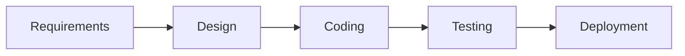

# Waterfall

## What is Waterfall Model?

Imagine that you're building a Lego tower. With the waterfall model, we follow a precise sequence of steps. We need to know exactly what we want to build before we start. We can't just decide to change our Lego tower to a Lego car halfway through. This is how software is developed using the waterfall model.

Steps in the Waterfall Model:

1. **Requirements**: We decide what our Lego tower should look like. For software, we list everything the program should do.
2. **Design**: We sketch our Lego tower. For software, we plan how we're going to build the program.
3. **Implementation**: We start building our Lego tower. For software, this is when we write the code.
4. **Verification**: We check our Lego tower against our sketch. For software, we test our program to see if it works correctly.
5. **Maintenance**: We take care of our Lego tower and fix any parts that might have broken. We change the program for software if there are any problems or need to add something new.

## Benefits and Downsides of the Waterfall Model

### Benefits

- It's simple and easy to understand because it's like building Lego.
- Knowing precisely what we want to build from the start is good.

### Downsides

- If we want to change something, we must return to the start, which can take a lot of time.
- It's hard to know all the problems we might have until we've built our Lego tower. The same goes for software; we can't predict all problems beforehand.

## Further Readings

Here are some books and articles you can read if you want to learn more about the Waterfall Model:

- "Managing the Development of Large Software Systems" by Dr. Winston W. Royce
- "A Rational Design Process: How and Why to Fake It" by David Lorge Parnas and Paul C. Clements
- "Comparative Studies of 10 Programming Languages within 10 Diverse Criteria - A Team 10 COMP6411-S10 Term Report" by Keeley Erhardt, Michael M. Grottke, and Khaled El Emam
