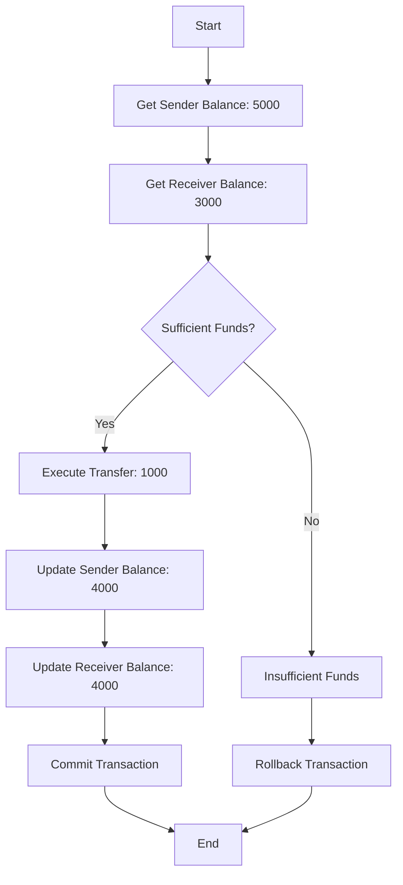

## Introduction

In the realm of database and system design, maintaining data integrity is of paramount importance. ACID, an acronym for Atomicity, Consistency, Isolation, and Durability, provides a set of principles that ensure the reliable processing of transactions in database systems. In this article, we will explore the significance of ACID and its relationship to database and system design, highlighting its impact on data consistency, transactional integrity, and overall system reliability.

## ELI5

Imagine you have a giant coloring book and want to ensure that your drawings look perfect and nothing goes wrong. ACID is like a set of rules that help you keep everything in order and ensure your drawings turn out just how you want them to be. Here's what ACID stands for:

- **Atomicity** means that when you start coloring a picture, you either finish coloring the whole thing or don't color it. You don't leave a picture half-colored because it wouldn't look right. You want to ensure your drawings are complete and don't look strange with unfinished parts.
- **Consistency** means that your drawings always follow specific rules. You color inside the lines, choose colors that go well together, and ensure everything looks nice and balanced. You want your drawings to be consistent and pleasing to the eye.
- **Isolation** means that when you're coloring a picture, you don't let anyone else interfere with your coloring. You want to focus on your work and ensure nobody messes it up. You want to keep your drawings separate and untouched until you finish coloring them.
- **Durability** means that once you finish coloring a picture, you want it to last and not disappear. You don't want your colors to fade or your drawings to get erased easily. You want them to stay on the paper and be there for a long time so that you can show them to your friends and family.

In summary, ACID is like a set of rules that help you ensure your coloring book drawings are complete, consistent, separate from others, and stay on the paper for a long time. It helps you create beautiful and lasting drawings you can be proud of.

## What is ACID?

### Atomicity: Guaranteeing Transactional Integrity

Atomicity is a fundamental concept in transaction processing. It refers to the property that all operations within a transaction are executed as a single unit of work or not at all. If any operation fails within a transaction, the entire transaction is rolled back. This is important because it ensures the database remains consistent despite a failure or error.

In practice, atomicity is achieved through transaction logs, which record all changes made to the database during a transaction. If a failure occurs, the transaction log can undo all changes made during the transaction and restore the database to its previous state.

In addition to maintaining data consistency, atomicity also helps to safeguard against partial updates, which can occur when only some of the operations in a transaction are completed successfully, by guaranteeing that all operations are completed successfully or none at all, atomicity ensures that the database remains in a valid state at all times.

Overall, atomicity is a critical component of transaction processing that helps to ensure the integrity and consistency of the database. By guaranteeing that transactions are executed as a single unit of work, atomicity helps to prevent data corruption and maintain the accuracy of the database over time.

### Consistency: Enforcing Data Validity

Maintaining data consistency is crucial for any system, as it prevents errors and inconsistencies from affecting the data. To achieve this, several measures can be taken.

One way to maintain data consistency is to put constraints in place to prevent invalid data from entering the system. This can be done by setting up rules and validations that check data as it is entered. Another way is to validate data at various stages of the transaction process to ensure that it is correct and accurate.

In addition to these measures, it is also essential to have a system that can roll back transactions in case of any failure. This ensures all data is returned to its state before the transaction starts, preventing inconsistencies.

The system can maintain high consistency and reliability by enforcing data validity and taking these measures. This is essential for any organization's smooth operation and helps ensure that data is always accurate and up-to-date.

### Isolation: Managing Concurrent Access

Isolation is an essential concept in database management, and it addresses the problem of concurrent access to shared resources. When multiple transactions are processed concurrently in a multi-user environment, it is crucial to manage these transactions effectively. Isolation ensures that transactions are executed sequentially, which prevents conflicts and maintains transactional integrity.

One way isolation is achieved is through the use of locks. Databases can utilize various types of locks, such as shared and exclusive locks, to ensure that only one transaction can access a particular shared resource at any time. This helps to prevent conflicts between transactions that try to access the same resource simultaneously.

Concurrency control mechanisms are another essential aspect of isolation. They help to manage the execution of transactions, ensuring that they do not interfere with one another. For example, a database might use a timestamp-based mechanism to ensure that transactions are executed in the correct order.

Isolation levels are also crucial for managing concurrent access. They define the level of isolation a transaction should have when accessing shared resources. For example, the READ COMMITTED isolation level ensures that a transaction can only see committed data.

By utilizing locks, concurrency control mechanisms, and isolation levels, databases can manage concurrent access effectively, ensuring data consistency in a multi-user environment.

### Durability: Ensuring Data Persistence

Durability is a critical concept in data storage and management. It is essential to ensure that data remains intact and recoverable despite system failures or unforeseen circumstances.

One way to achieve durability is through write-ahead logging. This technique involves recording changes in a transaction log before applying them to the data storage. By doing so, committed data remains intact and recoverable even if the system crashes or experiences a power outage.

Another way to ensure durability is through replication. This involves creating multiple copies of the data in different locations so that other copies are still available if one copy is lost or damaged. Replication can be done at the file, block, or record levels, depending on the system's specific needs.

In addition to these techniques, various software and hardware solutions can help ensure durability. For example, some storage systems use RAID (Redundant Array of Independent Disks) to provide fault tolerance and redundancy. Others use specialized hardware such as non-volatile RAM (NVRAM) or solid-state drives (SSDs) to improve durability and performance.

Overall, ensuring durability is essential for any system that deals with critical data. By using a combination of techniques and solutions, it is possible to ensure that data remains intact and recoverable even in the face of unexpected challenges.

## The ACID in Database and System Design

ACID principles are foundational to designing reliable and robust database systems. Here's how ACID relates to database and system design:

- **Data Consistency**: ACID ensures that data remains consistent throughout the transactional process, maintaining the integrity and validity of the database.
- **Transactional Integrity**: By adhering to ACID principles, database systems guarantee that transactions are executed reliably, preserving the integrity of the data and preventing incomplete or erroneous updates.
- **Reliability and Fault Tolerance**: ACID's durability property ensures data persists despite system failures. This contributes to system reliability and fault tolerance, as data can be recovered and restored after a failure.
- **Multi-User Environments**: ACID's isolation property enables databases to handle concurrent access by ensuring that transactions are executed in isolation, preventing conflicts and maintaining consistency in multi-user environments.
- **Data Integrity in Critical Systems**: ACID is vital in financial applications, e-commerce platforms, and other mission-critical systems requiring accurate and reliable data processing.

## Example: Funds Transfer between Users in a Bank

Let's consider an example of a fund transfer between two bank users to illustrate the importance of ACID principles. Here's the flow of the transaction:

ACID transaction in fund transfer between users.

Explanation of the flow:

1. The transaction starts (A).
2. The system retrieves the balance of the sender's account, which is $5000 (B).
3. The system also retrieves the balance of the receiver's account, which is $3000 (C).
4. The system checks if the sender has sufficient funds for the transfer (D).
   - The transfer proceeds if the sender has sufficient funds (Sufficient Funds? = Yes).
   - If the sender does not have sufficient funds (Sufficient Funds? = No), the transaction proceeds to the Insufficient Funds branch.
5. The transfer of $1000 is executed (E).
6. The sender's balance is updated to $4000 (F), reflecting the deducted amount.
7. The receiver's balance is updated to $4000 (G), reflecting the added amount.
8. The transaction is committed (H), permanently storing the changes.
9. The transaction ends (I).
10. In the case of insufficient funds, the transaction proceeds to the Insufficient Funds branch (J).
11. The transaction is rolled back (K) and ends (I).

This example demonstrates how ACID principles help maintain data integrity and consistency during a funds transfer. The transaction ensures atomicity by executing the transfer entirely or rolling it back if any step fails. Consistency is maintained by validating the sender's account balance and preventing transfers that exceed available funds. Isolation ensures that concurrent transactions do not interfere with each other, and durability guarantees the permanence of the transaction even in the event of system failures.

## Limitations of Non-ACID Systems

When a database system does not adhere to ACID principles, it can introduce various challenges and limitations, including:

- **Inconsistent or Partial Updates**: With atomicity, complete or partial updates can occur if a failure or error interrupts the transaction. This can leave the system in a consistent state where changes are applied partially, leading to data integrity issues.
- **Data Inconsistency**: Lack of consistency enforcement can result in violations of integrity constraints, leaving the data in an inconsistent state. For example, a transfer may proceed even if the sender has insufficient funds, leading to negative balances or unauthorized transactions.
- **Concurrency Anomalies**: Without proper isolation mechanisms, concurrent access to the database can result in concurrency anomalies such as dirty reads, non-repeatable reads, and phantom reads. These anomalies can lead to data consistency and correct results when multiple transactions are executed simultaneously.
- **Unreliable or Incomplete Rollbacks**: With proper rollback mechanisms, failed transactions may be rolled back entirely, leading to complete or consistent changes in the database.
- **Lack of Durability**: Non-durable systems may not ensure that committed transactions persist in the face of failures, resulting in data loss or inconsistencies during system failures or crashes.

These limitations highlight the importance of ACID principles in ensuring data integrity, consistency, and reliability in database systems. ACID-compliant systems provide robustness, transactional integrity, and a reliable foundation for critical applications.

## Conclusion

ACID principles ensure data integrity, consistency, and reliability in database and system design. Organizations can build robust systems that handle transactions reliably, maintain data consistency, and withstand failures by adhering to Atomicity, Consistency, Isolation, and Durability. Understanding and applying ACID principles is essential for architects and developers involved in designing and implementing database systems to ensure the integrity of critical data.

In contrast, non-ACID systems lack the transactional guarantees provided by ACID principles, leading to data integrity issues, concurrency anomalies, and unreliable operations. It is essential to consider the limitations of non-ACID systems when designing critical applications to ensure that data remains consistent, reliable, and protected.

## Further Readings

Here are some suggested further readings on ACID and its relevance to database and system design:

1. "Principles of Transaction Processing" by Philip A. Bernstein and Eric Newcomer - This book provides a comprehensive overview of transaction processing. It covers ACID principles, along with various transaction models and protocols.
2. "Database Systems: The Complete Book" by Hector Garcia-Molina, Jeffrey D. Ullman, and Jennifer Widom - This textbook covers the fundamentals of database systems and includes a section on ACID properties and their significance in ensuring data integrity.
3. "ACID versus BASE for Database Transactions" by Dan Pritchett - This article discusses the differences between ACID and BASE (Basically Available, Soft state, Eventually consistent) principles and their application in distributed systems.
4. "The End of an Architectural Era (It's Time for a Complete Rewrite)" by Pat Helland - This paper explores the challenges of maintaining ACID properties in modern distributed systems. It discusses alternative approaches that prioritize availability and partition tolerance over strict consistency.
5. "CAP Twelve Years Later: How the "Rules" Have Changed" by Eric Brewer - This paper discusses the CAP theorem, which states that in a distributed system, it is impossible to achieve Consistency, Availability, and Partition tolerance simultaneously. It delves into the trade-offs between these properties and their impact on system design.
6. "Distributed Systems for Fun and Profit" by Mikito Takada - This online book comprehensively introduces distributed systems. It covers consistency models, distributed transactions, and the trade-offs between solid consistency and availability.
