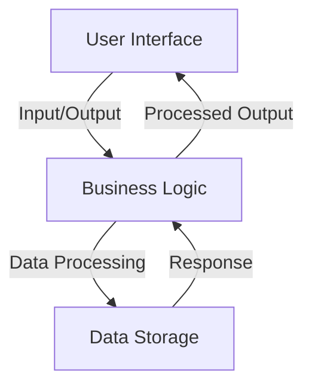
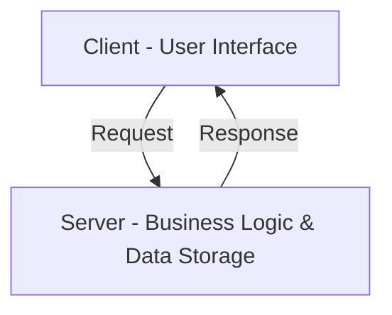
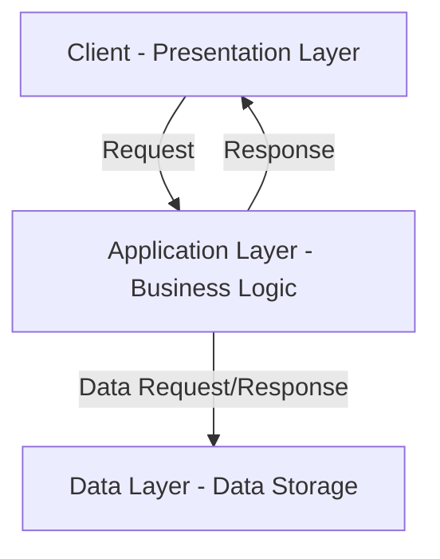
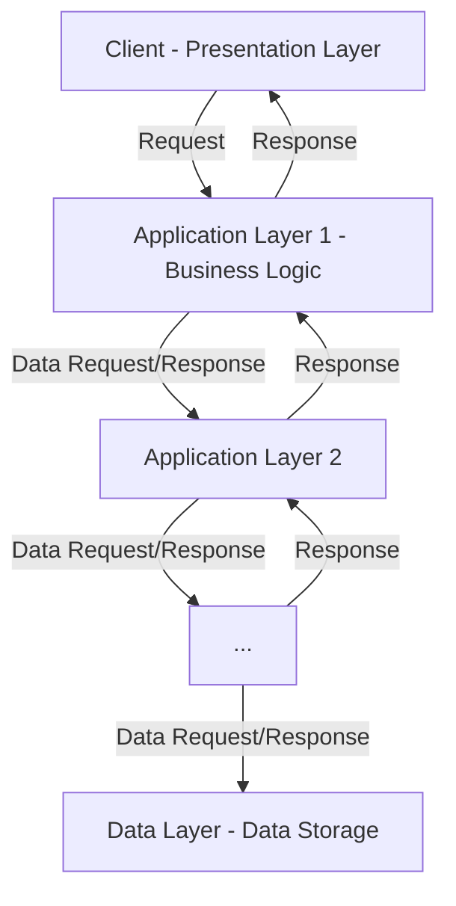

# Arsitektur Multi-Tier

## Pengantar

Di awal perkembangan komputasi, konsep arsitektur 1-tier masih banyak digunakan, di mana aplikasi berjalan pada satu mesin yang terintegrasi dengan semua lapisan sistem secara ketat. Namun, seiring kompleksitas sistem perangkat lunak yang semakin bertambah dan tuntutan pengguna yang semakin meningkat, keterbatasan arsitektur 1-tier mulai terlihat. Hal ini membawa pada evolusi arsitektur multi-tier, pendekatan yang lebih fleksibel dan skalabel. Artikel ini menjelaskan transisi dari arsitektur 1-tier ke arsitektur multi-tier, dengan fokus pada arsitektur 2-tier, 3-tier, dan n-tier serta keuntungan yang membawa pada desain sistem modern.

## Arsitektur Multi-tier dalam Istilah Sederhana

**Arsitektur 1-Tier**: Bayangkan kita memiliki robot mainan yang dapat melakukan semua tugas secara mandiri. Robot ini memiliki tombol yang dapat ditekan, memproses perintah, dan menyimpan semua informasi yang dibutuhkan. Semua fungsi robot terdapat dalam satu robot itu sendiri.

**Arsitektur 2-Tier**: Sekarang, bayangkan kita memiliki robot mainan yang kita kendalikan dengan menggunakan remote control. Remote control mengirimkan perintah ke robot, dan robot mengikuti perintah tersebut. Remote control bertanggung jawab memberitahu robot apa yang harus dilakukan, dan remote control mengatur semua tindakan.

**Arsitektur 3-Tier**: Sekarang, mari kita membuatnya lebih menarik. Bayangkan kita memiliki robot mainan yang dikendalikan dengan menggunakan aplikasi smartphone. Saat kita mengetuk tombol pada aplikasi, aplikasi mengirimkan perintah ke perangkat terpisah, seperti hub atau server. Perangkat ini menerima perintah dan kemudian mengirimkannya ke robot mainan. Robot mainan melakukan tindakan dan mengirimkan hasil atau informasi kembali ke perangkat, kemudian perangkat mengirimkannya kembali ke aplikasi di smartphone kita.

**Arsitektur N-Tier**: Mari kita mengambil contoh robot mainan ini lebih jauh lagi. Bayangkan tim robot bekerja sama untuk melakukan tugas-tugas yang berbeda. Pada arsitektur N-tier, sistem dibagi menjadi beberapa lapisan, masing-masing dengan peran yang spesifik.

Misalnya, kita memiliki robot pemimpin tim yang menerima instruksi dari kita. Robot pemimpin tim ini berkomunikasi dengan robot spesialis lainnya, seperti robot pembantu untuk membersihkan, robot pembangun untuk konstruksi, dan robot pengiriman untuk mengangkut barang. Setiap robot memiliki fungsi spesifiknya dan berkomunikasi dengan pemimpin tim untuk mengkoordinasikan tugas.

Pada arsitektur N-tier, lapisan-lapisan dapat dilihat sebagai tim atau kelompok robot yang berbeda, masing-masing bertanggung jawab atas aspek sistem yang spesifik. Lapisan tersebut dapat mencakup lapisan presentasi untuk antarmuka pengguna (seperti aplikasi smartphone), lapisan aplikasi untuk pengolahan dan koordinasi (seperti robot pemimpin tim), dan beberapa lapisan data untuk penyimpanan dan pengambilan data (seperti robot spesialis yang menangani tugas yang berbeda).

Secara ringkas, arsitektur 1-tier menggabungkan semua komponen menjadi satu program, arsitektur 2-tier memisahkan lapisan klien dan server, arsitektur 3-tier menambahkan lapisan untuk organisasi dan skalabilitas yang lebih baik, dan arsitektur N-tier memperluas konsep tersebut lebih jauh dengan membagi sistem menjadi beberapa lapisan, seperti tim robot spesialis.

## Arsitektur 1-Tier

### Mengapa Muncul?

Munculnya arsitektur 1-Tier terutama disebabkan oleh kesimpulannya dan kebutuhan aplikasi mandiri yang dasar. Selama awal tahun komputasi, sistem lebih sedikit kompleks, dan hardware perlu lebih kuat untuk menangani beberapa lapisan pemrosesan perangkat lunak. Oleh karena itu, arsitektur 1-Tier menjadi solusi yang efisien untuk membangun sistem perangkat lunak sederhana, mandiri di mana antarmuka pengguna, logika bisnis, dan penyimpanan data berada pada mesin yang sama.

### Apa Itu Arsitektur 1-Tier?

Arsitektur 1-Tier, juga dikenal sebagai arsitektur satu lapis atau monolitik, adalah jenis arsitektur perangkat lunak di mana semua komponen aplikasi - antarmuka pengguna, logika bisnis, dan penyimpanan data - berada di dalam sistem atau platform yang sama.

Berikut adalah diagram sederhana untuk mengilustrasikan alur:

Antarmuka pengguna mengirimkan masukan ke lapisan logika bisnis dalam arsitektur ini. Lapisan logika bisnis memproses data, berinteraksi dengan lapisan penyimpanan, dan mengembalikan data yang telah diproses ke antarmuka pengguna.

### Penggunaan/Contoh Dunia Nyata

1. **Perangkat Lunak Pribadi**: Perangkat lunak skala kecil seperti pemutar media, editor foto, dan pengolah kata sering menggunakan arsitektur 1-Tier, karena aplikasi ini biasanya berdiri sendiri dan berjalan pada satu mesin.
2. **Sistem Tertanam**: Perangkat seperti oven microwave, jam digital, dan pemutar MP3 menggunakan arsitektur ini karena mereka dirancang untuk melakukan fungsi yang spesifik dan tidak memerlukan komunikasi eksternal.

### Keuntungan

- **Simpel**: Karena tidak ada pemisahan antara lapisan, arsitektur 1-Tier mudah dipahami dan dikembangkan.
- **Kinerja**: Karena semua komponen berada di mesin yang sama, data tidak perlu melakukan perjalanan melalui jaringan, menghasilkan waktu respons yang lebih cepat.
- **Mudah Diperbaiki**: Karena semua komponen berada di satu tempat, pembaruan dan modifikasi relatif lebih mudah.

### Batasan

- **Masalah Skalabilitas**: Saat aplikasi berkembang, meningkatkan sistem dengan arsitektur 1-Tier mungkin memakan waktu dan usaha.
- **Kurangnya Fleksibilitas**: Dibutuhkan pemisahan yang lebih jelas antara antarmuka pengguna, logika bisnis, dan lapisan penyimpanan data, sehingga sulit untuk mengubah lapisan individu tanpa memengaruhi yang lain.
- **Keamanan**: Dengan semua komponen dalam satu sistem, seluruh sistem berisiko jika satu komponen terpengaruh.

### Kapan Menggunakannya?

Arsitektur 1-Tier paling baik digunakan untuk aplikasi sederhana dan berdiri sendiri di mana skalabilitas dan fleksibilitas bukan merupakan masalah utama. Ini juga merupakan pilihan yang efisien untuk aplikasi atau sistem kecil di mana kinerja sangat penting dan risiko pelanggaran keamanan minimal. Ini mungkin lebih baik untuk aplikasi skala besar yang memerlukan keamanan dan skalabilitas yang tinggi.

## Arsitektur 2-Tier

### Mengapa Muncul?

Arsitektur 2-Tier muncul sebagai solusi terhadap keterbatasan arsitektur 1-Tier. Seiring dengan semakin kompleksnya sistem, kebutuhan akan desain yang lebih terstruktur memunculkan pengembangan arsitektur ini. Memisahkan aplikasi ke dalam dua lapisan yang berbeda - klien dan server - memfasilitasi solusi yang lebih skalabel dan fleksibel.

### Apa Itu Arsitektur 2-Tier?

Arsitektur 2-Tier, atau arsitektur klien-server, membagi aplikasi menjadi dua bagian utama: klien, yang biasanya merupakan antarmuka pengguna, dan server, yang mencakup lapisan logika bisnis dan penyimpanan data.

Di bawah ini adalah diagram untuk menggambarkan alur:

Dalam model ini, klien mengirim permintaan ke server, di mana logika bisnis memproses permintaan dan berinteraksi dengan penyimpanan data. Kemudian server mengirimkan respons kembali ke klien.

### Penggunaan/Contoh di Dunia Nyata

1. **Aplikasi Web**: Aplikasi web umumnya menggunakan arsitektur 2-Tier. Klien, biasanya peramban web, berinteraksi dengan server web yang menyimpan logika bisnis dan data aplikasi.
2. **Aplikasi Database**: Sistem Informasi Manajemen (SIM) dan sistem Manajemen Hubungan Pelanggan (CRM) umumnya dibangun dengan model 2-Tier, di mana GUI sisi klien berinteraksi dengan database sisi server.

### Kelebihan

- **Skalabilitas**: Dibandingkan dengan 1-Tier, arsitektur 2-Tier memungkinkan skalabilitas yang lebih baik karena beban pemrosesan didistribusikan antara klien dan server.
- **Pemisahan Masalah**: Memisahkan antarmuka pengguna dari logika bisnis dan penyimpanan data membuatnya lebih mudah untuk mengelola dan memodifikasi setiap tier secara independen.

### Keterbatasan

- **Kinerja Jaringan**: Karena komunikasi terjadi melalui jaringan, kinerja sistem sangat bergantung pada kecepatan dan keandalan jaringan.
- **Kompleksitas Lebih Tinggi**: Arsitektur 2-Tier lebih kompleks daripada 1-Tier, memerlukan perencanaan dan sumber daya lebih banyak untuk diimplementasikan secara efektif.
- **Keterbatasan Fleksibilitas**: Meskipun lebih fleksibel daripada arsitektur 1-Tier, tetapi masih dapat membatasi jika lebih banyak tier (seperti lapisan terpisah untuk logika bisnis) diperlukan.

### Kapan Menggunakan?

Arsitektur 2-Tier cocok untuk aplikasi di mana antarmuka pengguna dan manajemen logika bisnis/data terpisah bermanfaat, dan skalabilitas menjadi perhatian. Ideal untuk aplikasi web dan database dan kasus lain di mana kinerja lebih bergantung pada interaksi klien-server yang efektif daripada kecepatan jaringan.

## Arsitektur 3-Tier

### Mengapa muncul?

Arsitektur 3-Tier muncul karena kebutuhan untuk struktur aplikasi yang lebih fleksibel, scalable, dan mudah dikelola meningkat. Menambahkan satu tier tambahan dibandingkan dengan arsitektur 2-Tier memungkinkan aplikasi untuk memisahkan tanggung jawab presentasi, logika aplikasi, dan manajemen data, sehingga memungkinkan scaling dan modifikasi independen dari setiap layer.

### Apa Itu Arsitektur 3-Tier

Arsitektur 3-Tier adalah jenis arsitektur perangkat lunak yang memisahkan aplikasi menjadi tiga tier logis: layer presentasi (klien), layer aplikasi (logika bisnis), dan layer data (penyimpanan dan akses data).

Berikut adalah diagram yang mewakili aliran:

Dalam arsitektur ini, klien mengirim permintaan ke lapisan aplikasi, yang memproses permintaan, berinteraksi dengan lapisan data, dan mengirimkan respons kembali ke klien.

### Penggunaan / Contoh Dunia Nyata

1. **Aplikasi Enterprise**: Aplikasi skala besar seperti Enterprise Resource Planning (ERP) dan sistem Customer Relationship Management (CRM) biasanya menggunakan arsitektur 3-Tier karena skalabilitas dan kemampuan mengelola.
2. **Aplikasi Web**: Aplikasi web modern sering menggunakan arsitektur ini, dengan aplikasi front-end (klien), server back-end (logika bisnis), dan database (penyimpanan data).

### Keuntungan

- **Skalabilitas**: Setiap lapisan dapat ditingkatkan secara independen, sehingga menjadi pilihan yang sangat baik untuk aplikasi yang besar dan kompleks.
- **Pemisahan Kepentingan**: Setiap lapisan dapat dikelola dan diperbarui secara independen, meningkatkan kemudahan pemeliharaan dan produktivitas pengembangan.
- **Keamanan**: Dengan memisahkan lapisan data dari klien, data sensitif lebih aman karena tidak dapat diakses langsung dari lapisan presentasi.

### Keterbatasan

- **Kompleksitas**: Arsitektur 3-Tier lebih kompleks daripada arsitektur 1-Tier atau 2-Tier, memerlukan lebih banyak sumber daya dan keahlian untuk menerapkannya dan mengelolanya secara efektif.
- **Kinerja**: Tergantung pada aplikasi dan kondisi jaringan, kompleksitas tambahan dan komunikasi jaringan dapat memengaruhi kinerja.

### Kapan Menggunakan?

Arsitektur 3-Tier terbaik digunakan untuk aplikasi yang kompleks dan berskala besar di mana skalabilitas, keamanan, dan pemisahan kepentingan sangat penting. Ini termasuk sebagian besar aplikasi tingkat enterprise dan aplikasi web modern di mana lapisan individu mungkin perlu ditingkatkan secara independen berdasarkan permintaan. Ini mungkin terlalu berlebihan untuk aplikasi yang lebih sederhana atau yang memiliki sumber daya yang lebih sedikit.

## Arsitektur N-Tier

### Mengapa Muncul?

Arsitektur N-Tier muncul sebagai respons terhadap kompleksitas dan keragaman proses bisnis dan persyaratan perangkat lunak yang semakin meningkat. Ini menyediakan versi yang diperpanjang dari model 3-Tier, menawarkan fleksibilitas dan skalabilitas yang lebih besar dengan memungkinkan sejumlah lapisan modular yang berbeda.

### Apa Itu Arsitektur N-Tier?

Arsitektur N-Tier adalah model arsitektur perangkat lunak yang mengorganisir aplikasi menjadi beberapa lapisan atau tingkat logis dan fisik. "N" menunjukkan bahwa tingkat dapat digunakan, dengan setiap tingkat menangani peran tertentu dalam aplikasi.

Berikut adalah diagram yang disederhanakan untuk mewakili aliran:

Client mengirim permintaan ke lapisan aplikasi pertama, yang dapat memproses permintaan dan meneruskannya ke lapisan aplikasi berikutnya. Proses ini terus berlanjut melalui lapisan aplikasi yang diperlukan hingga mencapai lapisan data. Respons kemudian dikembalikan melalui rantai yang sama.

### Penggunaan/Contoh Dunia Nyata

1. **Aplikasi Enterprise**: Aplikasi besar dan kompleks seperti Sistem Keuangan atau Sistem Manajemen Rantai Pasokan dapat menggunakan arsitektur N-Tier untuk memisahkan berbagai proses bisnis ke dalam lapisan yang berbeda.
2. **Arsitektur Microservices**: Microservices mengikuti gaya arsitektur N-Tier, di mana setiap microservice (yang mewakili kemampuan bisnis tertentu) dapat dianggap sebagai lapisan individu.

### Kelebihan

- **Skalabilitas Tinggi**: Setiap lapisan dapat diperbesar secara independen, menyediakan potensi skalabilitas yang tinggi untuk aplikasi besar skala.
- **Fleksibilitas**: Arsitektur ini dapat menampung berbagai proses bisnis dan persyaratan fungsional dengan memungkinkan jumlah lapisan yang sesuai.
- **Kemudahan Pemeliharaan**: Pemisahan yang jelas antara lapisan menyederhanakan pembaruan dan pemeliharaan, karena perubahan pada satu lapisan tidak harus mempengaruhi yang lain.

### Keterbatasan

- **Kompleksitas**: Ketika jumlah lapisan meningkat, kompleksitas pengelolaan dan koordinasi juga meningkat.
- **Kinerja**: Lebih banyak lapisan sering berarti lebih banyak komunikasi jaringan, yang dapat menyebabkan masalah kinerja potensial.
- **Biaya**: Mengembangkan dan memelihara sistem N-Tier memerlukan lebih banyak sumber daya dan keahlian, yang dapat menyebabkan biaya yang lebih tinggi.

### Kapan Menggunakan?

Arsitektur N-Tier paling cocok untuk aplikasi besar, kompleks, di mana proses bisnis dan persyaratan beragam dan dapat berubah. Ini menyediakan skalabilitas dan fleksibilitas yang dibutuhkan untuk menangani kompleksitas tersebut. Namun, arsitektur yang lebih sederhana seperti 1-Tier, 2-Tier, atau 3-Tier untuk aplikasi kecil atau sistem dengan persyaratan fungsional yang lebih sedikit mungkin lebih sesuai.

## Kesimpulan: Memahami Trade-Off dalam Arsitektur Multi-Tier

Dalam perkembangan dunia pengembangan software yang selalu berubah, sangat penting untuk memahami bahwa pilihan arsitektur melibatkan trade-off. Istilah "Arsitektur Multi-Tier" mencakup sejumlah gaya arsitektur, seperti 1-tier, 2-tier, 3-tier, dan n-tier, masing-masing memiliki kekuatan, keterbatasan, dan pertimbangan sendiri.

Ketika merancang sistem software, pengembang harus mempertimbangkan trade-off yang terkait dengan setiap arsitektur. Arsitektur 1-tier, dengan kesederhanaan dan kinerjanya, mungkin cocok untuk aplikasi skala kecil atau alat mandiri. Namun, diperlukan skalabilitas, fleksibilitas, dan keberlanjutan yang lebih besar ketika aplikasi berkembang.

Ketika kompleksitas dan skala aplikasi meningkat, transisi ke arsitektur multi-tier menjadi perlu. Arsitektur 2-tier memperkenalkan komunikasi client-server, memungkinkan skalabilitas dan pemisahan kepentingan yang lebih baik. Arsitektur 3-tier membagi sistem menjadi lapisan, meningkatkan modularitas, keamanan, dan kinerja. Arsitektur n-tier menampung lapisan tambahan atau fungsionalitas khusus untuk mengatasi persyaratan tertentu.

Penting untuk mengakui bahwa setiap keputusan arsitektur melibatkan trade-off. Skalabilitas, pemisahan kepentingan, optimasi kinerja, keamanan, dan keberlanjutan menjadi faktor kritis saat memilih arsitektur yang sesuai. Kompleksitas pengembangan, strategi penyebaran, kebutuhan integrasi, dan keberlanjutan masa depan sangat penting dalam pengambilan keputusan.

Dengan mengambil trade-off dan memahami kelebihan dan keterbatasan setiap lapisan dalam arsitektur multi-tier, pengembang dapat membuat keputusan yang tepat untuk menciptakan sistem software yang memenuhi persyaratan pengguna dan sejalan dengan tujuan organisasi. Kuncinya adalah menemukan keseimbangan yang sesuai dengan kebutuhan aplikasi, sehingga tercipta solusi yang kuat, skalabel, dan mudah dijaga.

Sebagai kesimpulan, arsitektur multi-tier memberikan kerangka kerja untuk mengambil trade-off yang sadar, memberdayakan pengembang untuk menciptakan solusi software yang unggul dalam kinerja, skalabilitas, keberlanjutan, dan fleksibilitas. Dengan mempertimbangkan trade-off dengan hati-hati, pengembang dapat merancang sistem yang memberikan nilai bagi pengguna sambil beradaptasi dengan kebutuhan yang berkembang dan kemajuan teknologi.

## Bacaan Lanjutan

1. **"Software Architecture Patterns"** oleh Mark Richards dan Neal Ford: Buku ini mencakup berbagai pola arsitektur software, termasuk arsitektur multi-tier, dan memberikan panduan praktis untuk merancang sistem yang skalabel dan mudah dijaga.
2. **"Building Microservices: Designing Fine-Grained Systems"** oleh Sam Newman: Meskipun berfokus pada microservices, buku ini menjelajahi prinsip dan pola yang mendasari sistem terdistribusi modern, yang sering menggunakan arsitektur multi-tier.
3. **"Pattern-Oriented Software Architecture, Volume 1: A System of Patterns"** oleh Frank Buschmann dkk.: Buku klasik ini memperkenalkan pola arsitektur dan menjelaskan konsep-konsep yang mendalam yang relevan dengan arsitektur multi-tier.
4. **"Domain-Driven Design: Tackling Complexity in the Heart of Software"** oleh Eric Evans: Meskipun terutama berfokus pada domain-driven design, buku ini menekankan pada pertimbangan arsitektur dan membimbing merancang sistem yang terstruktur dengan baik dan skalabel.
5. **"Clean Architecture: A Craftsman's Guide to Software Structure and Design"** oleh Robert C. Martin membahas prinsip-prinsip clean architecture, dengan menekankan pada pemisahan kepentingan dan pola arsitektur yang sejalan dengan praktik clean code.
