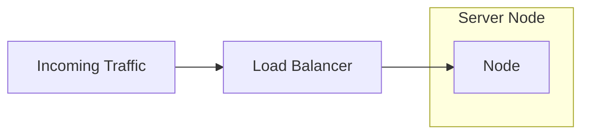
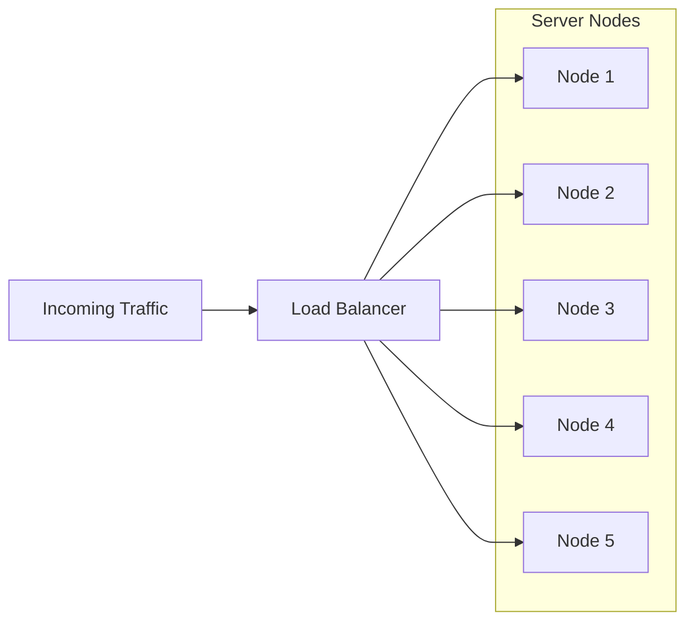

# Penskalaan Vertikal vs. Horizontal

## Pengantar

Ketika bisnis dan organisasi berkembang, mereka sering menghadapi tantangan dalam mengakomodasi peningkatan lalu lintas, daya pemrosesan, dan kebutuhan penyimpanan. Skalabilitas menjadi sangat penting dalam skenario seperti ini, dan dua pendekatan umum untuk mengatasinya adalah penskalaan horizontal dan penskalaan vertikal. Artikel ini akan menjelajahi perbedaan antara kedua teknik penskalaan ini dan membahas kelebihan dan kekurangannya, membantu kita memutuskan pendekatan mana yang cocok untuk kebutuhan pertumbuhan sistem kita.

## Penskalaan Vertikal

Penskalaan vertikal, juga dikenal sebagai penskalaan naik, melibatkan peningkatan sumber daya mesin yang ada (CPU, RAM, penyimpanan). Pendekatan ini berfokus pada mengoptimalkan kemampuan satu mesin daripada menambah mesin tambahan ke infrastruktur. Penskalaan vertikal sering dicapai dengan meningkatkan komponen perangkat keras atau beralih ke mesin yang lebih kuat.

Berikut adalah representasi Mermaid dari pendekatan ini:

Dan ini adalah diagram yang dihasilkan:

Dalam representasi di atas, "Traffic" mewakili permintaan atau beban kerja yang masuk ke sistem. "Load Balancer" mendistribusikan beban kerja di antara node-server.

Dalam kasus penskalaan vertikal, satu node-server direpresentasikan sebagai "Node". Load Balancer meneruskan permintaan yang masuk ke node-server tunggal ini, yang menangani beban kerja. Penskalaan vertikal berfokus pada mengoptimalkan kinerja dan sumber daya mesin tunggal.

### Keuntungan Penskalaan Vertikal

1. **Manajemen yang disederhanakan**: Dengan penskalaan vertikal, kita hanya perlu mengelola satu mesin, mengurangi kompleksitas koordinasi dan sinkronisasi antara beberapa mesin. Ini berarti kita dapat fokus pada mengoptimalkan kinerja satu mesin daripada khawatir tentang mengkoordinasikan beberapa mesin.
2. **Manajemen data yang lebih sederhana**: Penskalaan vertikal menyederhanakan manajemen data karena semua data berada pada satu mesin, sehingga lebih mudah untuk memastikan konsistensi data. Memiliki semua data di satu tempat juga memungkinkan solusi backup dan pemulihan bencana yang lebih mudah.
3. **Infrastruktur yang familiar**: Penskalaan vertikal dapat dicapai dengan meningkatkan perangkat keras yang ada dan memanfaatkan pengetahuan dan investasi infrastruktur yang sudah ada. Ini berarti kita dapat menghindari biaya dan risiko yang terkait dengan menerapkan infrastruktur baru sambil tetap mencapai manfaat penskalaan vertikal. Selain itu, dengan memanfaatkan infrastruktur yang ada, kita dapat dengan mudah mengintegrasikan perangkat keras baru dengan sistem yang sudah ada, mengurangi waktu henti dan meminimalkan gangguan pada operasi bisnis kita.

### Kerugian Penskalaan Vertikal

1. **Keterbatasan biaya**: Meskipun penskalaan vertikal memberikan peningkatan performa yang signifikan, hal ini juga bisa menjadi mahal, terutama saat melakukan upgrade ke mesin high-end atau hardware properti. Namun, hal ini dapat diatasi dengan memanfaatkan layanan cloud atau teknologi virtualisasi untuk pemanfaatan sumber daya yang efisien dan optimasi biaya.
2. **Skalabilitas terbatas**: Meskipun penskalaan vertikal dapat efektif meningkatkan performa, tetapi memiliki batas praktis yang diimposisi oleh kapasitas maksimum sebuah mesin tunggal. Namun, penskalaan horizontal dapat digunakan bersamaan dengan penskalaan vertikal untuk mencapai level skalabilitas yang lebih tinggi. Selain itu, dengan menggunakan load balancer, beban kerja dapat didistribusikan ke beberapa mesin, sehingga tidak ada satu mesin pun yang kelebihan beban dan performa tetap konsisten.
3. **Titik kegagalan tunggal**: Karena seluruh beban kerja terkonsentrasi pada satu mesin, kegagalan pada mesin tersebut dapat mengakibatkan downtime yang lengkap hingga masalah tersebut diresolusi. Untuk mengatasi masalah ini, perangkat keras ganda atau sistem backup dapat ditempatkan untuk memastikan bahwa beban kerja dapat dengan cepat dipindahkan ke mesin alternatif tanpa dampak signifikan pada performa dalam keadaan kegagalan.

## Penskalaan Horizontal

Penskalaan horizontal, atau scaling out, melibatkan penambahan mesin atau node untuk mendistribusikan beban kerja. Alih-alih meningkatkan sumber daya pada satu mesin, penskalaan horizontal berfokus pada memperluas sistem secara horizontal dengan menambahkan mesin-mesin identik ke infrastruktur yang sudah ada. Hal ini memungkinkan peningkatan kapasitas, kinerja yang lebih baik, dan peningkatan toleransi kesalahan.

Berikut adalah representasi Mermaid dari pendekatan ini:

Dan ini adalah diagram yang dihasilkan:

Dalam representasi di atas, "Traffic" mewakili permintaan masuk atau beban kerja yang diarahkan ke sistem. "Load Balancer" mendistribusikan beban kerja di antara node server.

Beberapa node server, yang direpresentasikan sebagai "Node 1," "Node 2," dan seterusnya, ditambahkan untuk menangani beban kerja untuk penskalaan horizontal. Load Balancer secara merata mendistribusikan lalu lintas di antara node-node ini, meningkatkan kinerja dan toleransi kesalahan.

### Keuntungan dari Penskalaan Horizontal

Penskalaan horizontal adalah strategi untuk meningkatkan sumber daya komputasi guna meningkatkan kinerja sistem, toleransi kesalahan, dan skalabilitas. Berikut adalah beberapa keuntungan dari penskalaan horizontal:

1. **Kinerja yang lebih baik**: Dengan penskalaan horizontal, beberapa mesin berbagi beban kerja, memungkinkan pemrosesan tugas yang lebih cepat dan waktu respons yang lebih baik. Ini berarti sistem dapat menangani beban kerja tanpa mengorbankan kinerja atau waktu respons seiring bertambahnya beban kerja.
2. **Biaya efektif**: Penskalaan horizontal biasanya melibatkan penggunaan perangkat keras komoditas, yang lebih terjangkau daripada berinvestasi dalam mesin terukur vertikal yang mahal. Ini berarti bisnis dapat mencapai kinerja yang lebih baik sambil menjaga biaya tetap terjangkau.
3. **Toleransi kesalahan**: Dengan mendistribusikan beban kerja di sejumlah mesin, penskalaan horizontal memberikan toleransi kesalahan yang lebih baik. Jika satu mesin gagal, yang lain dapat terus beroperasi, mengurangi risiko waktu tidak aktif. Ini berarti sistem dapat terus beroperasi bahkan jika terjadi kegagalan perangkat keras.
4. **Skalabilitas sesuai permintaan**: Menambah atau menghapus mesin dari sistem yang ditingkatkan secara horizontal relatif mudah, memungkinkan skalabilitas dinamis berdasarkan permintaan sistem. Ini berarti bisnis dapat meningkatkan atau menurunkan sumber daya komputasi mereka untuk memenuhi permintaan yang berubah.

### Kelemahan Penskalaan Horizontal

1. **Sistem yang kompleks**: Meskipun mengelola satu mesin cukup mudah, mengelola sistem terdistribusi dengan beberapa mesin dapat jauh lebih menantang. Ini membutuhkan koordinasi dan sinkronisasi yang tepat dan dapat rumit karena mesin-mesin individu dalam sistem mungkin memiliki konfigurasi perangkat keras yang berbeda atau berjalan pada sistem operasi yang berbeda.
2. **Kompleksitas jaringan yang meningkat**: Dalam sistem terdistribusi, mesin sangat bergantung pada komunikasi antar mesin untuk berbagi data dan bekerja sama. Namun, ini dapat memperkenalkan laten dan bottleneck potensial, terutama ketika mesin tersebar geografis atau terhubung melalui jaringan yang lebih lambat.
3. **Konsistensi data**: Menjaga data yang konsisten di sejumlah mesin dapat menjadi tantangan yang signifikan dalam sistem terdistribusi, terutama ketika berurusan dengan basis data terdistribusi atau sistem file bersama. Ini dapat menjadi lebih rumit lagi oleh partisi jaringan atau kegagalan mesin, menghasilkan ketidakkonsistenan data atau bahkan kehilangan data. Untuk mengatasi tantangan ini, sistem terdistribusi sering menggunakan replikasi, protokol konsensus, dan mekanisme penguncian terdistribusi untuk memastikan konsistensi data dan mencegah kehilangan data.

## Memilih Pendekatan yang Tepat

Memilih pendekatan penskalaan yang tepat tergantung pada beberapa faktor, termasuk sifat aplikasi kita, pertumbuhan yang diantisipasi, anggaran, dan persyaratan operasional. Berikut adalah beberapa pertimbangan:

1. **Karakteristik beban kerja**: Jika beban kerja kita dapat dengan mudah didistribusikan dan diparalelisasi, penskalaan horizontal mungkin lebih cocok. Namun, jika beban kerja kita melibatkan pemrosesan berurutan yang kompleks, penskalaan vertikal mungkin lebih cocok. Selain itu, aplikasi yang memerlukan sumber daya vertikal yang signifikan, seperti basis data besar dalam memori, mungkin mendapatkan manfaat yang lebih besar dari penskalaan vertikal. Perlu dicatat bahwa penskalaan horizontal mungkin memerlukan pekerjaan tambahan yang signifikan untuk mendistribusikan beban kerja secara efektif.
2. **Efektivitas biaya**: Penskalaan horizontal cenderung lebih efektif biaya karena memanfaatkan perangkat keras komoditas. Namun, jika anggaran kita memungkinkan mesin kelas atas atau kita memiliki persyaratan perangkat keras tertentu, penskalaan vertikal mungkin menjadi pilihan yang layak. Penskalaan vertikal juga menawarkan lebih banyak kontrol atas perangkat keras dan kemampuan untuk menyetel kinerja.
3. **Persyaratan toleransi kesalahan**: Penskalaan horizontal secara inheren memberikan toleransi kesalahan yang lebih baik dengan mendistribusikan beban kerja. Jika menjaga ketersediaan tinggi sangat penting untuk sistem kita, penskalaan horizontal bisa menjadi pilihan yang baik. Penskalaan vertikal, di sisi lain, mungkin mengarah ke titik-titik kegagalan tunggal dan peningkatan waktu tidak aktif. Penting untuk mempertimbangkan persyaratan toleransi kesalahan saat memilih antara penskalaan horizontal dan vertikal.
4. **Skalabilitas masa depan**: Jika kita mengantisipasi pertumbuhan yang substansial dan kebutuhan untuk penskalaan sesuai permintaan, penskalaan horizontal menyediakan solusi yang lebih fleksibel dan skalabel. Namun, penskalaan vertikal mungkin lebih cocok untuk aplikasi dengan beban kerja yang dapat diprediksi dan basis pengguna yang stabil. Penting untuk mempertimbangkan persyaratan saat ini dan kebutuhan skalabilitas masa depan saat memilih antara penskalaan horizontal dan vertikal.

## Contoh di Dunia Nyata

Untuk lebih memahami penerapan praktis dari penskalaan vertikal dan horizontal, mari kita pertimbangkan platform e-commerce yang mengalami lonjakan lalu lintas selama musim puncak, seperti liburan atau acara penjualan besar.

### Contoh Penskalaan Vertikal

Dalam hal penskalaan vertikal, platform e-commerce dapat meningkatkan server yang ada dengan meningkatkan CPU, RAM, dan kapasitas penyimpanan. Dengan begitu, mereka dapat mengatasi peningkatan lalu lintas tanpa menambah mesin tambahan. Misalnya, mereka dapat mengganti server yang ada dengan model yang lebih tangguh atau menambah modul memori tambahan.

Pendekatan ini memungkinkan platform untuk memperbesar sumber dayanya secara vertikal, mengoptimalkan kinerja mesin tunggal. Ini menyederhanakan manajemen, karena hanya ada satu server yang perlu dipelihara dan dipantau. Namun, ada batas untuk seberapa banyak server dapat ditingkatkan, dan mencapai batas tersebut mungkin memerlukan investasi yang lebih besar.

### Contoh Penskalaan Horizontal

Di sisi lain, penskalaan horizontal akan melibatkan penambahan server lebih banyak ke dalam infrastruktur untuk mendistribusikan beban lalu lintas yang semakin meningkat. Platform e-commerce dapat menggunakan load balancer yang meratakan permintaan masuk ke beberapa server. Setiap server menangani beberapa lalu lintas, memungkinkan kinerja dan toleransi kesalahan yang lebih baik.

Misalnya, platform dapat memulai dengan satu server dan kemudian menambahkan lebih banyak server identik saat lalu lintas tumbuh. Pendekatan ini memungkinkan platform untuk memperbesar sistem secara horizontal dengan menambahkan mesin tambahan. Ini memberikan fleksibilitas, karena server lebih banyak dapat ditambahkan atau dihapus berdasarkan permintaan. Jika satu server gagal, server yang tersisa dapat terus menangani beban kerja, memastikan ketersediaan yang tinggi.

Dengan mengadopsi penskalaan horizontal, platform e-commerce dapat mencapai skalabilitas yang lebih baik, menangani peningkatan lalu lintas, dan menyediakan sistem yang lebih tangguh dan toleran kesalahan. Namun, ini juga memperkenalkan kompleksitas dalam mengelola sistem terdistribusi dan memastikan konsistensi data di beberapa server.

## Kesimpulan

Skala vertikal dan horizontal menawarkan strategi yang berbeda untuk menangani pertumbuhan sistem dan peningkatan beban kerja. Pilihan antara keduanya tergantung pada berbagai faktor, termasuk persyaratan khusus aplikasi Anda, pertimbangan anggaran, dan kebutuhan skalabilitas yang diantisipasi.

Kita sering menggunakan teknik penskalaan vertikal dan horizontal untuk mengoptimalkan sistem kita dalam skenario dunia nyata. Kita mungkin memperbesar infrastruktur yang ada secara vertikal sampai batas tertentu dan kemudian memperbesar secara horizontal dengan menambahkan mesin ketika diperlukan.

Memahami kelebihan dan keterbatasan dari penskalaan vertikal dan horizontal dapat membantu kita membuat keputusan yang tepat tentang pendekatan yang paling sesuai untuk memperbesar sistem kita berdasarkan persyaratan dan pertumbuhan uniknya.

## Bacaan Lanjutan

1. "Scalability Rules: 50 Principles for Scaling Web Sites" oleh Martin L. Abbott dan Michael T. Fisher
2. "The Art of Scalability: Scalable Web Architecture, Processes, and Organizations for the Modern Enterprise" oleh Martin L. Abbott, Michael T. Fisher, dan Andreas M. Antonopoulos
3. "Designing Distributed Systems: Patterns and Paradigms for Scalable, Reliable Services" oleh Brendan Burns
4. "Site Reliability Engineering: How Google Runs Production Systems" oleh Betsy Beyer, Chris Jones, Jennifer Petoff, dan Niall Richard Murphy
5. "Scalability Patterns: Best Practices for Designing High-Volume, High-Capacity Systems" oleh Chander Dhall
