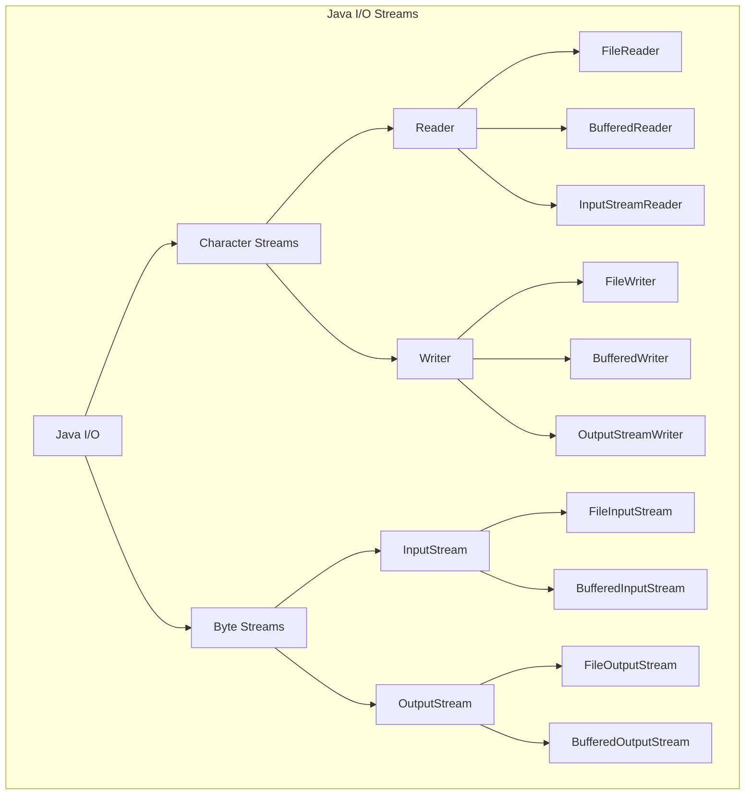

# Java Basics Cheat Sheet: Getting Started with Java

## Basic Syntax

### Comments

Java supports three types of comments:

```java
// Single-line comment

/* Multi-line comment
   that spans multiple
   lines of code */

/**
 * Documentation comment (Javadoc)
 * @author YourName
 * @version 1.0
 * Used to generate documentation
 */
```

**Example:**

```java
public class CommentExample {
    // This is a method that adds two numbers
    public int add(int a, int b) {
        return a + b; // Return the sum
    }

    /**
     * Multiplies two integers and returns the result
     * @param a first number
     * @param b second number
     * @return the product of a and b
     */
    public int multiply(int a, int b) {
        return a * b;
    }
}
```

### Printing and Output Streams

```java
// Basic printing
System.out.println("Prints text with a newline at the end");
System.out.print("Prints text without a newline");

// Formatted printing
System.out.printf("Formatted: %d, %.2f, %s%n", 10, 3.14159, "Hello");

// Error stream
System.err.println("Error message");
```

**Example:**

```java
public class OutputExample {
    public static void main(String[] args) {
        String name = "Alice";
        int age = 25;

        System.out.println("Basic information:");
        System.out.print("Name: ");
        System.out.println(name);
        System.out.printf("%s is %d years old%n", name, age);

        // Error output
        System.err.println("This appears as an error message");
    }
}
```

### Variable Declarations and Naming Conventions

```java
// Variable declaration syntax
dataType variableName = value;

// Constants (final variables)
final double PI = 3.14159;

// Multiple declarations
int x, y, z;
int a = 1, b = 2;
```

**Naming Conventions:**

- Variables: `camelCase` (start with lowercase)
- Constants: `UPPER_SNAKE_CASE`
- Classes: `PascalCase` (start with uppercase)
- Packages: all `lowercase`, use dots for hierarchy (com.example.project)

**Example:**

```java
public class NamingExample {
    // Constants
    final static double PI = 3.14159;
    final static int MAX_USERS = 100;

    public static void main(String[] args) {
        // Variables use camelCase
        String firstName = "John";
        String lastName = "Doe";
        int userAge = 30;

        // Multiple variables
        int count = 0, total = 100;

        // Valid identifiers
        int _count = 10;      // Starts with underscore (valid but discouraged)
        int $price = 9;       // Starts with $ (valid but discouraged)
        int numberOfItems;    // Clear descriptive name (recommended)
    }
}
```

### Primitive Data Types and Their Wrappers

| Primitive Type | Size    | Range                                      | Wrapper Class |
| -------------- | ------- | ------------------------------------------ | ------------- |
| `byte`         | 8 bits  | -128 to 127                                | `Byte`        |
| `short`        | 16 bits | -32,768 to 32,767                          | `Short`       |
| `int`          | 32 bits | -2^31 to 2^31-1                            | `Integer`     |
| `long`         | 64 bits | -2^63 to 2^63-1                            | `Long`        |
| `float`        | 32 bits | ~±3.4e38 (6-7 decimal digits precision)    | `Float`       |
| `double`       | 64 bits | ~±1.8e308 (15-16 decimal digits precision) | `Double`      |
| `char`         | 16 bits | 0 to 65,535 (Unicode characters)           | `Character`   |
| `boolean`      | 1 bit   | true or false                              | `Boolean`     |

**Example:**

```java
public class DataTypesExample {
    public static void main(String[] args) {
        // Primitive data types
        byte b = 100;
        short s = 20000;
        int i = 1000000;
        long l = 9223372036854775807L;  // Note the 'L' suffix
        float f = 3.14f;                // Note the 'f' suffix
        double d = 3.14159265359;
        char c = 'A';
        boolean bool = true;

        // Wrapper classes
        Integer wrappedInt = 42;
        Double wrappedDouble = 3.14;
        Character wrappedChar = 'X';
        Boolean wrappedBoolean = false;

        // Wrapper utility methods
        int parsed = Integer.parseInt("123");
        double max = Double.max(3.14, 2.71);
        boolean isDigit = Character.isDigit('7');

        // Auto-boxing and unboxing
        Integer boxed = 100;        // Auto-boxing
        int unboxed = boxed;        // Auto-unboxing
    }
}
```

### Operators

**Arithmetic Operators:**

```java
int a = 10, b = 3;
int sum = a + b;       // Addition: 13
int difference = a - b; // Subtraction: 7
int product = a * b;   // Multiplication: 30
int quotient = a / b;  // Division: 3 (integer division)
int remainder = a % b; // Modulus: 1

// Increment and decrement
int x = 5;
x++;    // Post-increment: x is now 6
++x;    // Pre-increment: x is now 7
x--;    // Post-decrement: x is now 6
--x;    // Pre-decrement: x is now 5
```

**Relational Operators:**

```java
int a = 10, b = 20;
boolean isEqual = (a == b);     // Equal to: false
boolean isNotEqual = (a != b);  // Not equal to: true
boolean isGreater = (a > b);    // Greater than: false
boolean isLess = (a < b);       // Less than: true
boolean isGE = (a >= b);        // Greater than or equal to: false
boolean isLE = (a <= b);        // Less than or equal to: true
```

**Logical Operators:**

```java
boolean x = true, y = false;
boolean andResult = x && y;  // Logical AND: false
boolean orResult = x || y;   // Logical OR: true
boolean notResult = !x;      // Logical NOT: false

// Short-circuit evaluation
boolean test = (getValueA() && getValueB());  // getValueB() only called if getValueA() is true
```

**Bitwise Operators:**

```java
int a = 5;  // Binary: 0101
int b = 3;  // Binary: 0011

int bitwiseAnd = a & b;   // Bitwise AND: 0001 (1)
int bitwiseOr = a | b;    // Bitwise OR: 0111 (7)
int bitwiseXor = a ^ b;   // Bitwise XOR: 0110 (6)
int bitwiseNot = ~a;      // Bitwise NOT: 1010 (-6 in two's complement)
int leftShift = a << 1;   // Left shift: 1010 (10)
int rightShift = a >> 1;  // Right shift: 0010 (2)
int zeroFillRightShift = a >>> 1;  // Zero-fill right shift: 0010 (2)
```

**Assignment Operators:**

```java
int a = 10;
a += 5;  // a = a + 5: 15
a -= 3;  // a = a - 3: 12
a *= 2;  // a = a * 2: 24
a /= 4;  // a = a / 4: 6
a %= 4;  // a = a % 4: 2
a &= 3;  // a = a & 3: 2
a |= 5;  // a = a | 5: 7
a ^= 1;  // a = a ^ 1: 6
a <<= 2; // a = a << 2: 24
a >>= 1; // a = a >> 1: 12
```

**Example:**

```java
public class OperatorsExample {
    public static void main(String[] args) {
        int a = 15, b = 4;

        // Arithmetic
        System.out.println("a + b = " + (a + b));  // 19
        System.out.println("a - b = " + (a - b));  // 11
        System.out.println("a * b = " + (a * b));  // 60
        System.out.println("a / b = " + (a / b));  // 3 (integer division)
        System.out.println("a % b = " + (a % b));  // 3

        // Relational
        System.out.println("a == b: " + (a == b));  // false
        System.out.println("a != b: " + (a != b));  // true
        System.out.println("a > b: " + (a > b));    // true

        // Logical with short-circuit
        boolean x = (a > 10) && (b < 5);  // true && true = true

        // Compound assignment
        int c = 10;
        c += a;  // c = c + a (c = 25)
        System.out.println("c after += a: " + c);
    }
}
```

### Type Conversion and Casting

**Implicit Conversion (Widening):**

```java
byte b = 100;
int i = b;       // Implicit conversion from byte to int
long l = i;      // Implicit conversion from int to long
float f = l;     // Implicit conversion from long to float
double d = f;    // Implicit conversion from float to double
```

**Explicit Casting (Narrowing):**

```java
double d = 100.56;
float f = (float) d;   // Explicit cast from double to float
long l = (long) f;     // Explicit cast from float to long
int i = (int) l;       // Explicit cast from long to int
byte b = (byte) i;     // Explicit cast from int to byte
```

**Example with Potential Data Loss:**

```java
public class CastingExample {
    public static void main(String[] args) {
        // Widening (no data loss)
        int smallNum = 100;
        double bigNum = smallNum;  // Implicit conversion
        System.out.println("Widening: int to double: " + bigNum);

        // Narrowing (potential data loss)
        double largeValue = 1234.56;
        int truncated = (int) largeValue;  // Explicit cast, loses decimal portion
        System.out.println("Narrowing: double to int: " + truncated);

        // Overflow example
        int tooLarge = 130;
        byte small = (byte) tooLarge;  // Overflow: 130 is outside byte range (-128 to 127)
        System.out.println("Overflow: int to byte: " + small);  // Prints -126

        // String conversion
        String strNumber = "42";
        int parsedInt = Integer.parseInt(strNumber);
        double parsedDouble = Double.parseDouble("3.14159");

        // Conversion to String
        String strValue = Integer.toString(500);
        String formatted = String.format("Value: %.2f", 3.14159);
    }
}
```

### Literals and Constants

**Integer Literals:**

```java
int decimal = 42;        // Decimal (base 10)
int octal = 052;         // Octal (base 8) - prefix with 0
int hexadecimal = 0x2A;  // Hexadecimal (base 16) - prefix with 0x
int binary = 0b101010;   // Binary (base 2) - prefix with 0b (Java 7+)
```

**Floating-Point Literals:**

```java
double d1 = 3.14;
double d2 = 3.14d;  // 'd' or 'D' suffix is optional for double
double d3 = 3.14D;
float f1 = 3.14f;   // 'f' or 'F' suffix is required for float
float f2 = 3.14F;
```

**Character and String Literals:**

```java
char c1 = 'A';
char c2 = '\t';         // Tab character
char c3 = '\u0041';     // Unicode for 'A'

String s1 = "Hello";
String s2 = "Hello\nWorld";  // With newline
String s3 = """
           Multi-line
           text block
           (Java 15+)
           """;
```

**Boolean Literals:**

```java
boolean b1 = true;
boolean b2 = false;
```

**Null Literal:**

```java
String name = null;  // null can be assigned to any reference type
```

**Constants:**

```java
final double PI = 3.14159;
final int MAX_USERS = 100;

// Class constants (static final)
public class Constants {
    public static final String APP_NAME = "MyApp";
    public static final int MAX_CONNECTIONS = 10;
}
```

**Example:**

```java
public class LiteralsExample {
    // Class constants
    public static final double EARTH_RADIUS_KM = 6371.0;

    public static void main(String[] args) {
        // Integer literals
        int million = 1_000_000;  // Underscore separator for readability (Java 7+)
        long bigNumber = 9_223_372_036_854_775_807L;  // 'L' suffix for long

        // Different bases
        int binary = 0b1101_1110;  // Binary: 222
        int octal = 0346;          // Octal: 230
        int hex = 0xDE;            // Hexadecimal: 222

        // Character literals with escape sequences
        char newline = '\n';
        char tab = '\t';
        char singleQuote = '\'';
        char backslash = '\\';

        // String with escape sequences
        String path = "C:\\Program Files\\Java";

        // Scientific notation
        double avogadro =, 6.022e23;  // 6.022 × 10^23
        double electron = 1.602e-19;  // 1.602 × 10^-19
    }
}
```

## Control Structures

### if-else Constructs and Nested Conditions

```java
// Basic if statement
if (condition) {
    // Code executed if condition is true
}

// if-else statement
if (condition) {
    // Code executed if condition is true
} else {
    // Code executed if condition is false
}

// if-else-if ladder
if (condition1) {
    // Code executed if condition1 is true
} else if (condition2) {
    // Code executed if condition1 is false and condition2 is true
} else if (condition3) {
    // Code executed if condition1 and condition2 are false and condition3 is true
} else {
    // Code executed if all conditions are false
}

// Nested if statements
if (outerCondition) {
    if (innerCondition) {
        // Code executed if both conditions are true
    }
}

// Ternary operator (conditional expression)
result = (condition) ? valueIfTrue : valueIfFalse;
```

**Example:**

```java
public class IfElseExample {
    public static void main(String[] args) {
        int score = 85;

        // Basic if-else
        if (score >= 60) {
            System.out.println("Passed");
        } else {
            System.out.println("Failed");
        }

        // if-else-if ladder for grade calculation
        char grade;
        if (score >= 90) {
            grade = 'A';
        } else if (score >= 80) {
            grade = 'B';
        } else if (score >= 70) {
            grade = 'C';
        } else if (score >= 60) {
            grade = 'D';
        } else {
            grade = 'F';
        }
        System.out.println("Grade: " + grade);

        // Nested if
        if (score >= 60) {
            System.out.println("Passed");
            if (score >= 90) {
                System.out.println("Excellent work!");
            }
        }

        // Ternary operator
        String result = (score >= 60) ? "Passed" : "Failed";
        int bonus = (score > 90) ? 10 : (score > 75) ? 5 : 0;
    }
}
```

### Switch Statements

**Traditional Switch:**

```java
switch (expression) {
    case value1:
        // Code executed if expression equals value1
        break;
    case value2:
        // Code executed if expression equals value2
        break;
    // More cases...
    default:
        // Code executed if no cases match
}
```

**Switch Expression (Java 12+):**

```java
// Switch expression with -> and no break needed
result = switch (expression) {
    case value1 -> result1;
    case value2 -> result2;
    default -> defaultResult;
};

// Switch expression with multiple cases
result = switch (day) {
    case MONDAY, FRIDAY, SUNDAY -> 6;
    case TUESDAY -> 7;
    case THURSDAY, SATURDAY -> 8;
    case WEDNESDAY -> 9;
    default -> 0;
};

// Switch expression with blocks
result = switch (value) {
    case 1 -> {
        // Multiple statements
        doSomething();
        yield resultValue;  // Use yield to return a value
    }
    default -> defaultValue;
};
```

**Example:**

```java
public class SwitchExample {
    public static void main(String[] args) {
        int day = 3;

        // Traditional switch
        String dayName;
        switch (day) {
            case 1:
                dayName = "Monday";
                break;
            case 2:
                dayName = "Tuesday";
                break;
            case 3:
                dayName = "Wednesday";
                break;
            case 4:
                dayName = "Thursday";
                break;
            case 5:
                dayName = "Friday";
                break;
            case 6:
                dayName = "Saturday";
                break;
            case 7:
                dayName = "Sunday";
                break;
            default:
                dayName = "Invalid day";
        }
        System.out.println(dayName);

        // Switch with fall-through (intentionally omitting break)
        String typeOfDay;
        switch (day) {
            case 1:
            case 2:
            case 3:
            case 4:
            case 5:
                typeOfDay = "Weekday";
                break;
            case 6:
            case 7:
                typeOfDay = "Weekend";
                break;
            default:
                typeOfDay = "Invalid day";
        }

        // Modern switch expression (Java 12+)
        String modernDayName = switch (day) {
            case 1 -> "Monday";
            case 2 -> "Tuesday";
            case 3 -> "Wednesday";
            case 4 -> "Thursday";
            case 5 -> "Friday";
            case 6 -> "Saturday";
            case 7 -> "Sunday";
            default -> "Invalid day";
        };

        // Switch with enum (very common use case)
        enum Month { JANUARY, FEBRUARY, MARCH, APRIL, MAY, JUNE,
                    JULY, AUGUST, SEPTEMBER, OCTOBER, NOVEMBER, DECEMBER }

        Month month = Month.FEBRUARY;
        int daysInMonth = switch (month) {
            case JANUARY, MARCH, MAY, JULY, AUGUST, OCTOBER, DECEMBER -> 31;
            case APRIL, JUNE, SEPTEMBER, NOVEMBER -> 30;
            case FEBRUARY -> 28;  // Simplified (ignoring leap years)
        };
    }
}
```

### Loops

**For Loop:**

```java
// Basic for loop
for (initialization; condition; update) {
    // Code executed for each iteration
}

// Example
for (int i = 0; i < 5; i++) {
    System.out.println(i);
}

// Multiple variables in for loop
for (int i = 0, j = 10; i < j; i++, j--) {
    System.out.println("i = " + i + ", j = " + j);
}
```

**Enhanced For Loop (for-each):**

```java
// For arrays
for (elementType element : array) {
    // Code using element
}

// For collections
for (elementType element : collection) {
    // Code using element
}

// Example
int[] numbers = {1, 2, 3, 4, 5};
for (int num : numbers) {
    System.out.println(num);
}
```

**While Loop:**

```java
// Basic while loop
while (condition) {
    // Code executed as long as condition is true
}

// Example
int count = 0;
while (count < 5) {
    System.out.println(count);
    count++;
}
```

**Do-While Loop:**

```java
// Basic do-while loop - executes at least once
do {
    // Code executed at least once, then as long as condition is true
} while (condition);

// Example
int count = 0;
do {
    System.out.println(count);
    count++;
} while (count < 5);
```

**Example:**

```java
public class LoopsExample {
    public static void main(String[] args) {
        // 1. Basic for loop
        System.out.println("Basic for loop:");
        for (int i = 0; i < 5; i++) {
            System.out.print(i + " ");
        }
        System.out.println();

        // 2. Enhanced for loop (for-each)
        System.out.println("Enhanced for loop:");
        int[] numbers = {10, 20, 30, 40, 50};
        for (int num : numbers) {
            System.out.print(num + " ");
        }
        System.out.println();

        // 3. While loop
        System.out.println("While loop:");
        int count = 0;
        while (count < 5) {
            System.out.print(count + " ");
            count++;
        }
        System.out.println();

        // 4. Do-while loop (always executes at least once)
        System.out.println("Do-while loop:");
        count = 0;
        do {
            System.out.print(count + " ");
            count++;
        } while (count < 5);
        System.out.println();

        // 5. Nested loops (generating a multiplication table)
        System.out.println("Multiplication table:");
        for (int i = 1; i <= 3; i++) {
            for (int j = 1; j <= 3; j++) {
                System.out.print(i * j + "\t");
            }
            System.out.println();
        }
    }
}
```

### Break, Continue, and Labeled Statements

**Break Statement:**

```java
// Break in loops
for (int i = 0; i < 10; i++) {
    if (i == 5) {
        break;  // Exit the loop when i is 5
    }
    System.out.println(i);
}

// Break in switch
switch (value) {
    case 1:
        // Code
        break;  // Exit the switch
    case 2:
        // Code
        break;
}
```

**Continue Statement:**

```java
// Skip the current iteration
for (int i = 0; i < 10; i++) {
    if (i % 2 == 0) {
        continue;  // Skip even numbers
    }
    System.out.println(i);  // Only prints odd numbers
}
```

**Labeled Statements:**

```java
// Label for outer loop
outerLoop: for (int i = 0; i < 3; i++) {
    for (int j = 0; j < 3; j++) {
        if (i * j > 2) {
            break outerLoop;  // Break out of the outer loop
        }
        System.out.println(i + " * " + j + " = " + (i * j));
    }
}

// Continue with labeled loop
outerLoop: for (int i = 0; i < 3; i++) {
    for (int j = 0; j < 3; j++) {
        if (j == 1) {
            continue outerLoop;  // Skip to the next iteration of the outer loop
        }
        System.out.println(i + " * " + j + " = " + (i * j));
    }
}
```

**Example:**

```java
public class BreakContinueExample {
    public static void main(String[] args) {
        // Break example - finding the first divisor
        System.out.println("Finding first divisor of 50 (excluding 1):");
        for (int i = 2; i <= 50; i++) {
            if (50 % i == 0) {
                System.out.println("First divisor: " + i);
                break;  // Exit loop after finding first divisor
            }
        }

        // Continue example - printing only odd numbers
        System.out.println("Odd numbers from 1 to 10:");
        for (int i = 1; i <= 10; i++) {
            if (i % 2 == 0) {
                continue;  // Skip even numbers
            }
            System.out.print(i + " ");
        }
        System.out.println();

        // Labeled break example
        System.out.println("Labeled break example:");
        outerLoop: for (int i = 0; i < 3; i++) {
            for (int j = 0; j < 3; j++) {
                if (i == 1 && j == 1) {
                    System.out.println("Breaking outer loop at i=" + i + ", j=" + j);
                    break outerLoop;  // Exit both loops
                }
                System.out.println("i=" + i + ", j=" + j);
            }
        }

        // Labeled continue example
        System.out.println("Labeled continue example:");
        outerLoop: for (int i = 0; i < 3; i++) {
            System.out.println("Outer loop i=" + i);
            for (int j = 0; j < 3; j++) {
                if (j == 1) {
                    System.out.println("  Skipping to next i when j=" + j);
                    continue outerLoop;  // Skip to next iteration of outer loop
                }
                System.out.println("  i=" + i + ", j=" + j);
            }
        }
    }
}
```

### Expression Blocks and Lambda Expressions

**Expression Block:**

```java
// Java 14+ Expression block (a preview feature)
var result = switch (day) {
    case MONDAY -> {
        yield "Start of work week";
    }
    case FRIDAY -> {
        yield "End of work week";
    }
    default -> {
        yield "Mid-week";
    }
};
```

**Lambda Expressions (Java 8+):**

```java
// Basic lambda syntax
(parameters) -> expression
(parameters) -> { statements; }

// Examples
Runnable r = () -> System.out.println("Hello World");
Consumer<String> printer = s -> System.out.println(s);
BiFunction<Integer, Integer, Integer> adder = (a, b) -> a + b;

// With type declarations
BiFunction<Integer, Integer, Integer> multiplier =
    (Integer a, Integer b) -> a * b;

// With multiple statements
Comparator<String> c = (s1, s2) -> {
    int result = s1.length() - s2.length();
    return result != 0 ? result : s1.compareTo(s2);
};
```

**Example:**

```java
import java.util.ArrayList;
import java.util.Arrays;
import java.util.List;
import java.util.function.Predicate;

public class LambdaExample {
    public static void main(String[] args) {
        // Basic lambda with Runnable
        Runnable simpleTask = () -> System.out.println("Simple task executed");
        simpleTask.run();

        // Lambda with parameters
        List<Integer> numbers = Arrays.asList(1, 2, 3, 4, 5, 6, 7, 8, 9, 10);

        // Filtering with lambda
        System.out.println("Even numbers:");
        numbers.stream()
               .filter(n -> n % 2 == 0)  // Lambda as predicate
               .forEach(n -> System.out.print(n + " "));  // Lambda as consumer
        System.out.println();

        // Lambda with multiple statements
        Predicate<Integer> complexCheck = n -> {
            if (n < 2) return false;
            for (int i = 2; i <= Math.sqrt(n); i++) {
                if (n % i == 0) return false;
            }
            return true;
        };

        System.out.println("Prime numbers:");
        numbers.stream()
               .filter(complexCheck)
               .forEach(n -> System.out.print(n + " "));
        System.out.println();

        // Using lambda with custom interface
        Calculator add = (a, b) -> a + b;
        Calculator subtract = (a, b) -> a - b;
        Calculator multiply = (a, b) -> a * b;

        System.out.println("10 + 5 = " + calculate(10, 5, add));
        System.out.println("10 - 5 = " + calculate(10, 5, subtract));
        System.out.println("10 * 5 = " + calculate(10, 5, multiply));
    }

    // Custom functional interface
    interface Calculator {
        int operation(int a, int b);
    }

    // Method that takes a lambda
    private static int calculate(int a, int b, Calculator calculator) {
        return calculator.operation(a, b);
    }
}
```

## Functions (Methods)

### Method Definition Syntax

```java
accessModifier [static] [final] returnType methodName(parameterType paramName, ...) [throws ExceptionType] {
    // Method body
    return value;  // If return type is not void
}
```

**Parts of a Method Declaration:**

- **Access Modifier**: `public`, `protected`, `private`, or default (no modifier)
- **Static**: Optional, makes the method belong to the class rather than instances
- **Final**: Optional, prevents method overriding in subclasses
- **Return Type**: Data type of the value returned or `void` for no return value
- **Method Name**: Follows camelCase convention
- **Parameters**: Comma-separated list of parameter types and names
- **Throws Clause**: Optional, declares checked exceptions the method might throw
- **Method Body**: Code enclosed in curly braces

**Example:**

```java
public class MethodDefinitionExample {
    // Public method with return type
    public int add(int a, int b) {
        return a + b;
    }

    // Private method with void return type
    private void printMessage(String message) {
        System.out.println(message);
    }

    // Static method that belongs to the class
    public static double calculateArea(double radius) {
        return Math.PI * radius * radius;
    }

    // Final method that cannot be overridden
    public final void finalMethod() {
        System.out.println("This method cannot be overridden in subclasses");
    }

    // Method with throws clause
    public void readFile(String fileName) throws IOException {
        // Method that might throw a checked exception
        BufferedReader reader = new BufferedReader(new FileReader(fileName));
        String line = reader.readLine();
        reader.close();
    }

    // Method with multiple parameters
    public void displayInfo(String name, int age, String location) {
        System.out.println(name + " is " + age + " years old and lives in " + location);
    }
}
```

### Return Types and Void Methods

```java
// Method with primitive return type
public int add(int a, int b) {
    return a + b;  // Returns an int value
}

// Method with reference return type
public String getMessage() {
    return "Hello World";  // Returns a String object
}

// Method with array return type
public int[] getNumbers() {
    return new int[] {1, 2, 3, 4, 5};  // Returns an array
}

// Method with void return type (returns nothing)
public void printMessage(String message) {
    System.out.println(message);
    // No return statement needed
}

// Void method with early return (for control flow)
public void processIf(boolean condition) {
    if (!condition) {
        return;  // Early exit, no value returned
    }

    System.out.println("Processing...");
}
```

**Example:**

```java
public class ReturnTypeExample {
    public static void main(String[] args) {
        ReturnTypeExample example = new ReturnTypeExample();

        // Using methods with return values
        int sum = example.add(5, 10);
        System.out.println("Sum: " + sum);

        String greeting = example.getGreeting("John");
        System.out.println(greeting);

        int[] numbers = example.generateNumbers(5);
        System.out.print("Generated numbers: ");
        for (int num : numbers) {
            System.out.print(num + " ");
        }
        System.out.println();

        // Using void methods
        example.printDivider();
        example.printInfo("Status", "Active");

        // Void method with conditional execution
        example.processIfValid(true);
        example.processIfValid(false);
    }

    // Primitive return type
    public int add(int a, int b) {
        return a + b;
    }

    // String return type
    public String getGreeting(String name) {
        return "Hello, " + name + "!";
    }

    // Array return type
    public int[] generateNumbers(int count) {
        int[] result = new int[count];
        for (int i = 0; i < count; i++) {
            result[i] = i + 1;
        }
        return result;
    }

    // Void method - performs an action but returns nothing
    public void printDivider() {
        System.out.println("-----------------------");
    }

    // Another void method with parameters
    public void printInfo(String label, String value) {
        System.out.println(label + ": " + value);
    }

    // Void method with conditional return
    public void processIfValid(boolean isValid) {
        if (!isValid) {
            System.out.println("Invalid input, skipping processing");
            return;  // Early exit
        }

        System.out.println("Processing valid input...");
        // More processing code would go here
    }
}
```

### Parameter Passing (by Value)

Java always passes parameters by value, which means:

- For primitive types, a copy of the value is passed
- For reference types, a copy of the reference is passed (not the object itself)

```java
// Primitive parameter (value is copied)
public void incrementNumber(int number) {
    number++;  // Only affects the local copy, not the original
}

// Reference parameter (reference is copied, but points to the same object)
public void modifyList(List<String> list) {
    list.add("New Item");  // Modifies the original object
    list = new ArrayList<>();  // Reassigns local copy only, original reference unchanged
}
```

**Example:**

```java
import java.util.ArrayList;
import java.util.List;

public class ParameterPassingExample {
    public static void main(String[] args) {
        // Primitive parameter example
        int x = 10;
        System.out.println("Before modifyValue: x = " + x);
        modifyValue(x);
        System.out.println("After modifyValue: x = " + x);  // x is still 10

        // Reference parameter - object modification
        List<String> names = new ArrayList<>();
        names.add("Alice");
        names.add("Bob");
        System.out.println("Before addName: " + names);
        addName(names);
        System.out.println("After addName: " + names);  // List is modified

        // Reference parameter - reference reassignment
        System.out.println("Before replaceList: " + names);
        replaceList(names);
        System.out.println("After replaceList: " + names);  // Original list unchanged

        // Object with primitive fields
        Person person = new Person("John", 30);
        System.out.println("Before modifyPerson: " + person);
        modifyPerson(person);
        System.out.println("After modifyPerson: " + person);  // Age is modified
    }

    // Primitive parameter - passed by value
    public static void modifyValue(int value) {
        value = value * 2;  // Only modifies the local copy
        System.out.println("Inside modifyValue: value = " + value);
    }

    // Reference parameter - object modification
    public static void addName(List<String> list) {
        list.add("Charlie");  // Modifies the object the reference points to
        System.out.println("Inside addName: " + list);
    }

    // Reference parameter - reference reassignment
    public static void replaceList(List<String> list) {
        list = new ArrayList<>();  // Creates a new list, original reference unchanged
        list.add("David");
        System.out.println("Inside replaceList: " + list);
    }

    // Object with primitive fields
    public static void modifyPerson(Person p) {
        p.setAge(p.getAge() + 5);  // Modifies the object's state
        System.out.println("Inside modifyPerson: " + p);
    }

    // Person class for demonstration
    static class Person {
        private String name;
        private int age;

        public Person(String name, int age) {
            this.name = name;
            this.age = age;
        }

        public int getAge() { return age; }
        public void setAge(int age) { this.age = age; }

        @Override
        public String toString() {
            return name + " (age: " + age + ")";
        }
    }
}
```

### Method Overloading Rules

Method overloading allows multiple methods with the same name but different parameter lists. Methods can be overloaded based on:

1. Different number of parameters
2. Different parameter types
3. Different order of parameters

Note: Return type alone is NOT sufficient for overloading.

```java
// Method overloading examples
public void display(int number) {
    System.out.println("Integer: " + number);
}

public void display(String text) {
    System.out.println("String: " + text);
}

public void display(int x, int y) {
    System.out.println("Coordinates: (" + x + ", " + y + ")");
}

public void display(String name, int age) {
    System.out.println(name + " is " + age + " years old");
}

public void display(int age, String name) {
    System.out.println("A " + age + "-year-old person named " + name);
}
```

**Example:**

```java
public class OverloadingExample {
    public static void main(String[] args) {
        OverloadingExample example = new OverloadingExample();

        // Calling overloaded methods
        example.print(42);                 // Calls print(int)
        example.print("Hello");            // Calls print(String)
        example.print(3.14159);            // Calls print(double)
        example.print(10, 20);             // Calls print(int, int)
        example.print("John", 30);         // Calls print(String, int)
        example.print(new int[]{1, 2, 3}); // Calls print(int[])

        // Method resolution based on parameter types
        example.add(5, 10);           // Calls add(int, int)
        example.add(5.5, 10.5);       // Calls add(double, double)
        example.add("Hello", "World"); // Calls add(String, String)

        // Automatic type promotion
        byte b = 10;
        example.print(b);  // Calls print(int) through implicit widening
    }

    // Overloaded methods with different parameter types
    public void print(int value) {
        System.out.println("Integer: " + value);
    }

    public void print(String text) {
        System.out.println("String: " + text);
    }

    public void print(double value) {
        System.out.println("Double: " + value);
    }

    // Overloaded methods with different number of parameters
    public void print(int x, int y) {
        System.out.println("Coordinates: (" + x + ", " + y + ")");
    }

    // Overloaded methods with different parameter order
    public void print(String text, int value) {
        System.out.println(text + ": " + value);
    }

    // Overloaded method with array parameter
    public void print(int[] array) {
        System.out.print("Array: [");
        for (int i = 0; i < array.length; i++) {
            System.out.print(array[i]);
            if (i < array.length - 1) {
                System.out.print(", ");
            }
        }
        System.out.println("]");
    }

    // Type-specific implementations
    public int add(int a, int b) {
        System.out.println("Adding integers");
        return a + b;
    }

    public double add(double a, double b) {
        System.out.println("Adding doubles");
        return a + b;
    }

    public String add(String a, String b) {
        System.out.println("Concatenating strings");
        return a + b;
    }
}
```

### Varargs Parameters

Variable-length arguments (varargs) allow methods to accept a variable number of arguments of the same type. Syntax: `Type... paramName`.

```java
// Varargs syntax
public void printNumbers(int... numbers) {
    for (int num : numbers) {
        System.out.println(num);
    }
}

// Varargs with other parameters (varargs must be last)
public void display(String name, int... scores) {
    System.out.println("Name: " + name);
    System.out.println("Scores:");
    for (int score : scores) {
        System.out.println(score);
    }
}
```

**Example:**

```java
public class VarargsExample {
    public static void main(String[] args) {
        // Calling methods with variable arguments
        sum();                        // 0 arguments
        sum(5);                       // 1 argument
        sum(1, 2, 3);                 // 3 arguments
        sum(1, 2, 3, 4, 5, 6, 7, 8);  // 8 arguments

        // Using an array with varargs
        int[] numbers = {10, 20, 30, 40, 50};
        sum(numbers);  // Passing array to varargs parameter

        // Using varargs with regular parameters
        printInfo("Student Report", 85, 90, 78, 92);

        // Practical example: String.format uses varargs
        String formatted = String.format("Name: %s, Age: %d, GPA: %.2f",
                                         "Alice", 20, 3.85);
        System.out.println(formatted);
    }

    // Basic varargs method
    public static void sum(int... numbers) {
        System.out.print("Calculating sum of " + numbers.length + " numbers: ");
        int total = 0;
        for (int num : numbers) {
            total += num;
        }
        System.out.println(total);
    }

    // Varargs with regular parameters
    public static void printInfo(String header, int... values) {
        System.out.println(header);
        System.out.println("--------------");
        for (int i = 0; i < values.length; i++) {
            System.out.println("Value " + (i + 1) + ": " + values[i]);
        }
        System.out.println();
    }

    // Overloaded methods with varargs
    public static double average(int... numbers) {
        if (numbers.length == 0) return 0;

        int sum = 0;
        for (int num : numbers) {
            sum += num;
        }
        return (double) sum / numbers.length;
    }

    public static double average(double... numbers) {
        if (numbers.length == 0) return 0;

        double sum = 0;
        for (double num : numbers) {
            sum += num;
        }
        return sum / numbers.length;
    }
}
```

### Static and Instance Methods

**Static Methods:**

- Belong to the class rather than instances
- Accessed via the class name: `ClassName.methodName()`
- Cannot access instance variables/methods directly
- Often used for utility functions and operations not requiring instance state
- Marked with the `static` keyword

**Instance Methods:**

- Belong to objects (instances) of the class
- Accessed via object references: `objectName.methodName()`
- Can access both instance and static variables/methods
- Represent behaviors that depend on instance state
- Default method type (no special keyword)

```java
public class MathUtils {
    // Static method (belongs to the class)
    public static int add(int a, int b) {
        return a + b;
    }

    // Static method with static variable
    private static int operationCount = 0;

    public static int multiply(int a, int b) {
        operationCount++;
        return a * b;
    }

    public static int getOperationCount() {
        return operationCount;
    }
}

public class Calculator {
    // Instance variables
    private String model;
    private boolean scientificMode;

    // Constructor
    public Calculator(String model, boolean scientificMode) {
        this.model = model;
        this.scientificMode = scientificMode;
    }

    // Instance method (belongs to objects)
    public double calculate(double a, double b, char operator) {
        switch (operator) {
            case '+': return a + b;
            case '-': return a - b;
            case '*': return a * b;
            case '/': return a / b;
            default: throw new IllegalArgumentException("Unknown operator: " + operator);
        }
    }

    // Instance method using instance variables
    public double power(double base, double exponent) {
        if (!scientificMode) {
            System.out.println("Warning: Using power on non-scientific calculator");
        }
        return Math.pow(base, exponent);
    }

    // Instance method that calls a static method
    public void displayModel() {
        System.out.println("Calculator model: " + model);
        System.out.println("Current time: " + getCurrentTime());
    }

    // Static method in the same class
    public static String getCurrentTime() {
        return new java.util.Date().toString();
    }
}
```

**Example:**

```java
public class StaticVsInstanceExample {
    // Static variable (shared across all instances)
    private static int instanceCount = 0;

    // Instance variable (unique to each instance)
    private String name;

    // Constructor
    public StaticVsInstanceExample(String name) {
        this.name = name;
        instanceCount++;  // Increment the shared counter
    }

    // Instance method (operates on instance data)
    public void printName() {
        System.out.println("Instance name: " + name);
        System.out.println("Total instances: " + instanceCount);
    }

    // Static method (operates on class data)
    public static int getInstanceCount() {
        return instanceCount;
    }

    // Static method cannot directly access instance variables
    public static void printCount() {
        System.out.println("Total instances created: " + instanceCount);
        // System.out.println(name);  // Error: Cannot access instance variable
    }

    // Instance method can access both static and instance variables
    public void printDetails() {
        System.out.println("Name: " + name);
        System.out.println("Instance count: " + instanceCount);
    }

    public static void main(String[] args) {
        // Calling static method without any instances
        System.out.println("Initial count: " + StaticVsInstanceExample.getInstanceCount());

        // Creating instances
        StaticVsInstanceExample obj1 = new StaticVsInstanceExample("Object 1");
        StaticVsInstanceExample obj2 = new StaticVsInstanceExample("Object 2");

        // Calling instance methods
        obj1.printName();
        obj2.printName();

        // Calling static method after creating instances
        System.out.println("Final count: " + getInstanceCount());  // Can be called directly within same class

        // Demonstrating utility class with static methods
        double circleArea = MathUtils.calculateCircleArea(5.0);
        System.out.println("Circle area: " + circleArea);

        int sum = MathUtils.add(10, 20);
        System.out.println("Sum: " + sum);
    }
}

// Utility class with static methods
class MathUtils {
    // Constants
    public static final double PI = 3.14159;

    // Private constructor prevents instantiation
    private MathUtils() {
        // Utility class should not be instantiated
    }

    // Static methods for mathematical operations
    public static double calculateCircleArea(double radius) {
        return PI * radius * radius;
    }

    public static int add(int a, int b) {
        return a + b;
    }

    public static int max(int a, int b) {
        return (a > b) ? a : b;
    }
}
```

## Arrays and Basic Collections

### Array Creation and Initialization

```java
// Array declaration
int[] numbers;         // Preferred syntax
int numbers[];         // Alternative syntax (less common)

// Array creation (allocation)
numbers = new int[5];  // Creates array of 5 integers initialized to 0

// Combined declaration and creation
String[] names = new String[3];  // Creates array of 3 strings initialized to null

// Array initialization with values
int[] scores = {95, 85, 75, 90, 68};  // Array literal syntax

// Alternative initialization syntax
int[] moreScores = new int[] {95, 85, 75, 90, 68};

// Creating and initializing in separate steps
String[] fruits;
fruits = new String[] {"Apple", "Orange", "Banana"};
```

**Example:**

```java
public class ArrayCreationExample {
    public static void main(String[] args) {
        // 1. Declaration and allocation in one step
        int[] numbers = new int[5];

        // Initialize array elements
        numbers[0] = 10;
        numbers[1] = 20;
        numbers[2] = 30;
        numbers[3] = 40;
        numbers[4] = 50;

        // Access and print array elements
        System.out.println("First element: " + numbers[0]);
        System.out.println("Array length: " + numbers.length);

        // 2. Initialization with array literal
        String[] days = {"Monday", "Tuesday", "Wednesday", "Thursday", "Friday"};

        // Print all elements using for loop
        System.out.println("Days of the week:");
        for (int i = 0; i < days.length; i++) {
            System.out.println("Day " + (i + 1) + ": " + days[i]);
        }

        // 3. Declaration, allocation, and initialization in separate steps
        double[] prices;                 // Declaration
        prices = new double[3];          // Allocation
        prices[0] = 9.99;                // Initialization
        prices[1] = 19.99;
        prices[2] = 29.99;

        // 4. Alternative syntax for array declaration
        float temperatures[];            // Less common syntax
        temperatures = new float[4];
        temperatures[0] = 32.0f;

        // 5. Anonymous array creation (useful for method arguments)
        printArray(new int[] {5, 10, 15, 20, 25});

        // 6. Creating an array of objects
        Person[] people = new Person[3];
        people[0] = new Person("Alice", 25);
        people[1] = new Person("Bob", 30);
        people[2] = new Person("Charlie", 35);

        // 7. Array of arrays (preparing for multi-dimensional arrays)
        int[][] matrix = new int[3][];
        matrix[0] = new int[] {1, 2, 3};
        matrix[1] = new int[] {4, 5};
        matrix[2] = new int[] {6, 7, 8, 9};
    }

    public static void printArray(int[] arr) {
        for (int num : arr) {
            System.out.print(num + " ");
        }
        System.out.println();
    }

    static class Person {
        String name;
        int age;

        Person(String name, int age) {
            this.name = name;
            this.age = age;
        }
    }
}
```

### Multidimensional Arrays

```java
// 2D array declaration and creation
int[][] matrix = new int[3][4];  // 3 rows, 4 columns

// 2D array initialization
int[][] grid = {
    {1, 2, 3},
    {4, 5, 6},
    {7, 8, 9}
};

// Jagged arrays (uneven rows)
int[][] jaggedArray = new int[3][];
jaggedArray[0] = new int[4];  // First row has 4 columns
jaggedArray[1] = new int[2];  // Second row has 2 columns
jaggedArray[2] = new int[5];  // Third row has 5 columns

// Jagged array initialization
int[][] jaggedGrid = {
    {1, 2, 3, 4},
    {5, 6},
    {7, 8, 9, 10, 11}
};
```

**Example:**

```java
public class MultidimensionalArrayExample {
    public static void main(String[] args) {
        // 1. Creating a 2D array (matrix)
        int[][] matrix = new int[3][4];  // 3 rows, 4 columns

        // Initialize with values
        for (int i = 0; i < matrix.length; i++) {
            for (int j = 0; j < matrix[i].length; j++) {
                matrix[i][j] = i * 4 + j + 1;
            }
        }

        // Print the matrix
        System.out.println("Matrix:");
        for (int i = 0; i < matrix.length; i++) {
            for (int j = 0; j < matrix[i].length; j++) {
                System.out.print(matrix[i][j] + "\t");
            }
            System.out.println();
        }

        // 2. Initialize a 2D array using array literals
        int[][] grid = {
            {1, 2, 3},
            {4, 5, 6},
            {7, 8, 9}
        };

        // 3. Creating a jagged array (rows of different lengths)
        int[][] jaggedArray = new int[3][];
        jaggedArray[0] = new int[4];
        jaggedArray[1] = new int[2];
        jaggedArray[2] = new int[5];

        // Initialize jagged array
        for (int i = 0; i < jaggedArray.length; i++) {
            for (int j = 0; j < jaggedArray[i].length; j++) {
                jaggedArray[i][j] = (i + 1) * 10 + j;
            }
        }

        // Print jagged array
        System.out.println("\nJagged Array:");
        for (int i = 0; i < jaggedArray.length; i++) {
            for (int j = 0; j < jaggedArray[i].length; j++) {
                System.out.print(jaggedArray[i][j] + "\t");
            }
            System.out.println();
        }

        // 4. 3D array example (cube)
        int[][][] cube = new int[3][3][3];

        // Initialize 3D array
        for (int i = 0; i < 3; i++) {
            for (int j = 0; j < 3; j++) {
                for (int k = 0; k < 3; k++) {
                    cube[i][j][k] = i * 9 + j * 3 + k;
                }
            }
        }

        // Print one "slice" of the 3D array
        System.out.println("\n3D Array (middle slice, k=1):");
        for (int i = 0; i < 3; i++) {
            for (int j = 0; j < 3; j++) {
                System.out.print(cube[i][j][1] + "\t");
            }
            System.out.println();
        }
    }
}
```

### Array Utility Methods

```java
import java.util.Arrays;

// Array copying
int[] source = {1, 2, 3, 4, 5};
int[] dest = new int[source.length];
System.arraycopy(source, 0, dest, 0, source.length);

// Array copy using Arrays class
int[] copy = Arrays.copyOf(source, source.length);
int[] partial = Arrays.copyOfRange(source, 1, 4);  // {2, 3, 4}

// Array comparison
boolean areEqual = Arrays.equals(source, copy);

// Array sorting
int[] numbers = {5, 2, 9, 1, 3};
Arrays.sort(numbers);  // {1, 2, 3, 5, 9}

// Binary search (on sorted arrays)
int index = Arrays.binarySearch(numbers, 3);

// Array filling
int[] filled = new int[5];
Arrays.fill(filled, 42);  // {42, 42, 42, 42, 42}

// Converting array to string representation
String arrayString = Arrays.toString(numbers);

// Parallel operations (Java 8+)
Arrays.parallelSort(numbers);
```

**Example:**

```java
import java.util.Arrays;

public class ArrayUtilsExample {
    public static void main(String[] args) {
        // 1. Arrays.toString() - for string representation
        int[] numbers = {5, 2, 9, 1, 3};
        System.out.println("Original array: " + Arrays.toString(numbers));

        // 2. Arrays.sort() - for sorting
        Arrays.sort(numbers);
        System.out.println("Sorted array: " + Arrays.toString(numbers));

        // 3. Arrays.binarySearch() - for finding elements (requires sorted array)
        int index = Arrays.binarySearch(numbers, 9);
        System.out.println("Index of 9: " + index);

        // 4. Arrays.fill() - for filling arrays
        double[] values = new double[5];
        Arrays.fill(values, 3.14);
        System.out.println("Filled array: " + Arrays.toString(values));

        // 5. Arrays.equals() - for comparing arrays
        int[] array1 = {1, 2, 3};
        int[] array2 = {1, 2, 3};
        int[] array3 = {1, 2, 4};

        System.out.println("array1 equals array2: " + Arrays.equals(array1, array2));  // true
        System.out.println("array1 equals array3: " + Arrays.equals(array1, array3));  // false

        // 6. Arrays.copyOf() - for copying arrays
        int[] source = {10, 20, 30, 40, 50};
        int[] copy = Arrays.copyOf(source, source.length);
        int[] extended = Arrays.copyOf(source, source.length + 2);  // Adds zeros at the end
        int[] truncated = Arrays.copyOf(source, 3);  // Takes first 3 elements

        System.out.println("Original: " + Arrays.toString(source));
        System.out.println("Copy: " + Arrays.toString(copy));
        System.out.println("Extended: " + Arrays.toString(extended));
        System.out.println("Truncated: " + Arrays.toString(truncated));

        // 7. Arrays.copyOfRange() - for copying a range
        int[] range = Arrays.copyOfRange(source, 1, 4);  // Elements at index 1, 2, 3
        System.out.println("Range (1-4): " + Arrays.toString(range));

        // 8. System.arraycopy() - low-level, faster array copying
        int[] dest = new int[source.length];
        System.arraycopy(source, 0, dest, 0, source.length);
        System.out.println("System.arraycopy result: " + Arrays.toString(dest));

        // 9. Arrays.deepToString() - for multi-dimensional arrays
        int[][] matrix = {{1, 2, 3}, {4, 5, 6}, {7, 8, 9}};
        System.out.println("Matrix: " + Arrays.deepToString(matrix));

        // 10. Arrays.deepEquals() - for multi-dimensional arrays
        int[][] matrix2 = {{1, 2, 3}, {4, 5, 6}, {7, 8, 9}};
        System.out.println("Matrices equal: " + Arrays.deepEquals(matrix, matrix2));  // true
    }
}
```

### ArrayList and Basic Operations

```java
import java.util.ArrayList;
import java.util.List;

// Creating ArrayList
ArrayList<String> names = new ArrayList<>();  // Empty ArrayList
ArrayList<Integer> numbers = new ArrayList<>(20);  // Initial capacity
ArrayList<String> copy = new ArrayList<>(anotherList);  // Copy of another list

// Adding elements
names.add("Alice");             // Adds to the end
names.add(0, "Bob");            // Adds at specific index
names.addAll(anotherList);      // Adds all elements from another collection

// Accessing elements
String first = names.get(0);    // Get element at index
int size = names.size();        // Number of elements
boolean isEmpty = names.isEmpty();

// Modifying elements
names.set(1, "Charlie");        // Replace element at index
names.remove(0);                // Remove by index
names.remove("Alice");          // Remove by value
names.clear();                  // Remove all elements

// Searching
boolean contains = names.contains("Bob");
int index = names.indexOf("Charlie");
int lastIndex = names.lastIndexOf("Alice");

// Iterating
for (String name : names) {
    System.out.println(name);
}

// Converting to array
String[] array = names.toArray(new String[0]);
```

**Example:**

```java
import java.util.ArrayList;
import java.util.Arrays;
import java.util.Collections;
import java.util.List;

public class ArrayListExample {
    public static void main(String[] args) {
        // 1. Creating ArrayLists
        ArrayList<String> fruits = new ArrayList<>();  // Empty ArrayList
        ArrayList<Integer> numbers = new ArrayList<>(20);  // With initial capacity

        // 2. Adding elements
        fruits.add("Apple");
        fruits.add("Banana");
        fruits.add("Orange");
        System.out.println("Fruits: " + fruits);

        // 3. Insert at specific position
        fruits.add(1, "Mango");
        System.out.println("After inserting Mango: " + fruits);

        // 4. Access elements
        String first = fruits.get(0);
        System.out.println("First fruit: " + first);

        // 5. Update elements
        fruits.set(0, "Strawberry");
        System.out.println("After updating first element: " + fruits);

        // 6. Remove elements
        fruits.remove("Orange");  // Remove by value
        System.out.println("After removing Orange: " + fruits);

        fruits.remove(0);  // Remove by index
        System.out.println("After removing first element: " + fruits);

        // 7. Size and emptiness checks
        System.out.println("Number of fruits: " + fruits.size());
        System.out.println("Is empty? " + fruits.isEmpty());

        // 8. Contains check
        System.out.println("Contains Banana? " + fruits.contains("Banana"));

        // 9. Index of elements
        System.out.println("Index of Mango: " + fruits.indexOf("Mango"));

        // 10. Adding multiple elements
        fruits.addAll(Arrays.asList("Grape", "Kiwi", "Pineapple"));
        System.out.println("After adding multiple fruits: " + fruits);

        // 11. Iterating through ArrayList
        System.out.println("All fruits:");
        for (String fruit : fruits) {
            System.out.println("- " + fruit);
        }

        // 12. Clear all elements
        fruits.clear();
        System.out.println("After clearing: " + fruits);

        // 13. ArrayList operations with numbers
        ArrayList<Integer> scores = new ArrayList<>();
        scores.add(85);
        scores.add(90);
        scores.add(75);
        scores.add(95);
        scores.add(80);

        // 14. Sorting an ArrayList
        Collections.sort(scores);
        System.out.println("Sorted scores: " + scores);

        // 15. Finding min and max
        int min = Collections.min(scores);
        int max = Collections.max(scores);
        System.out.println("Min score: " + min);
        System.out.println("Max score: " + max);

        // 16. Reversing an ArrayList
        Collections.reverse(scores);
        System.out.println("Reversed scores: " + scores);

        // 17. Converting ArrayList to array
        Integer[] scoresArray = scores.toArray(new Integer[0]);
        System.out.println("Scores array: " + Arrays.toString(scoresArray));

        // 18. Converting array to ArrayList
        String[] colorArray = {"Red", "Green", "Blue"};
        ArrayList<String> colors = new ArrayList<>(Arrays.asList(colorArray));
        System.out.println("Colors: " + colors);
    }
}
```

### Converting Between Arrays and Collections

```java
import java.util.ArrayList;
import java.util.Arrays;
import java.util.List;

// Array to List
String[] array = {"Apple", "Banana", "Orange"};

// Method 1: Using Arrays.asList() (returns fixed-size list)
List<String> fixedList = Arrays.asList(array);

// Method 2: Creating a new ArrayList (modifiable)
ArrayList<String> modifiableList = new ArrayList<>(Arrays.asList(array));

// Method 3: Using List.of() (Java 9+, immutable)
List<String> immutableList = List.of(array);

// List to Array
List<String> fruits = new ArrayList<>();
fruits.add("Apple");
fruits.add("Banana");
fruits.add("Orange");

// Method 1: Using toArray() with new array
String[] fruitsArray = fruits.toArray(new String[0]);

// Method 2: Using toArray() with exact size
String[] exactArray = fruits.toArray(new String[fruits.size()]);

// Primitive array to List
int[] numbers = {1, 2, 3, 4, 5};

// Must use wrapper class for primitives
List<Integer> numberList = new ArrayList<>();
for (int num : numbers) {
    numberList.add(num);
}
```

**Example:**

```java
import java.util.ArrayList;
import java.util.Arrays;
import java.util.List;
import java.util.stream.Collectors;
import java.util.stream.IntStream;

public class ArrayCollectionConversionExample {
    public static void main(String[] args) {
        // 1. Convert array to List
        String[] fruitArray = {"Apple", "Banana", "Orange", "Mango"};

        // Using Arrays.asList() - results in a fixed-size list backed by the array
        List<String> fixedList = Arrays.asList(fruitArray);
        System.out.println("Fixed list from array: " + fixedList);

        // Modifying the backing array affects the list
        fruitArray[0] = "Pear";
        System.out.println("Fixed list after array change: " + fixedList);

        // Modifying the list affects the backing array
        fixedList.set(1, "Grape");
        System.out.println("Array after list change: " + Arrays.toString(fruitArray));

        // Cannot add/remove elements (fixed size)
        try {
            fixedList.add("Kiwi");  // Throws UnsupportedOperationException
        } catch (UnsupportedOperationException e) {
            System.out.println("Cannot add to fixed-size list: " + e.getMessage());
        }

        // 2. Create modifiable ArrayList from array
        ArrayList<String> modifiableList = new ArrayList<>(Arrays.asList(fruitArray));
        modifiableList.add("Kiwi");  // Works fine
        System.out.println("Modifiable list: " + modifiableList);

        // 3. Convert List to array
        String[] newArray = modifiableList.toArray(new String[0]);
        System.out.println("Array from list: " + Arrays.toString(newArray));

        // 4. Working with primitive arrays
        int[] numbers = {1, 2, 3, 4, 5};

        // Option 1: Manual conversion (loop)
        List<Integer> numberList = new ArrayList<>();
        for (int num : numbers) {
            numberList.add(num);  // Auto-boxing
        }
        System.out.println("Number list (manual): " + numberList);

        // Option 2: Using Java 8+ streams
        List<Integer> streamList = IntStream.of(numbers)
                                           .boxed()
                                           .collect(Collectors.toList());
        System.out.println("Number list (stream): " + streamList);

        // 5. Convert List back to primitive array
        // Option 1: Manual conversion
        int[] newNumbers = new int[numberList.size()];
        for (int i = 0; i < numberList.size(); i++) {
            newNumbers[i] = numberList.get(i);  // Auto-unboxing
        }

        // Option 2: Using Java 8+ streams
        int[] streamArray = streamList.stream()
                                     .mapToInt(Integer::intValue)
                                     .toArray();
        System.out.println("Primitive array from list: " + Arrays.toString(streamArray));

        // 6. Using List.of() (Java 9+) for immutable list
        // List<String> immutableList = List.of("Red", "Green", "Blue");
        // System.out.println("Immutable list: " + immutableList);

        // 7. Collections utility methods with arrays
        Integer[] numberArray = {5, 2, 9, 1, 7};
        List<Integer> numbersList = Arrays.asList(numberArray);

        java.util.Collections.sort(numbersList);
        System.out.println("Sorted list: " + numbersList);
        System.out.println("Sorted array: " + Arrays.toString(numberArray));
    }
}
```

## Input and Output Basics

Java I/O operations are built on streams, which come in two main types: character streams and byte streams, as shown in the hierarchy below:



### Console Input with Scanner

```java
import java.util.Scanner;

// Creating a Scanner object
Scanner scanner = new Scanner(System.in);

// Reading different data types
String name = scanner.nextLine();     // Reads a line of text
int age = scanner.nextInt();          // Reads an integer
double salary = scanner.nextDouble(); // Reads a double
boolean flag = scanner.nextBoolean(); // Reads a boolean

// Reading single word vs. whole line
String word = scanner.next();         // Reads next token (word)
scanner.nextLine();                   // Consume newline after nextInt()
String line = scanner.nextLine();     // Reads whole line

// Input validation with hasNext methods
if (scanner.hasNextInt()) {
    int value = scanner.nextInt();
} else {
    System.out.println("Not an integer!");
    scanner.next();  // Skip invalid token
}

// Always close the scanner when done
scanner.close();
```

**Example:**

```java
import java.util.Scanner;

public class ScannerExample {
    public static void main(String[] args) {
        Scanner scanner = new Scanner(System.in);

        try {
            // 1. Reading strings
            System.out.print("Enter your name: ");
            String name = scanner.nextLine();

            System.out.print("Enter your city: ");
            String city = scanner.nextLine();

            // 2. Reading primitives
            System.out.print("Enter your age: ");
            int age = scanner.nextInt();

            System.out.print("Enter your height in meters: ");
            double height = scanner.nextDouble();

            // Note: After reading a number, the newline is still in the buffer
            scanner.nextLine();  // Consume the newline

            // 3. Reading a single word
            System.out.print("Enter your favorite color: ");
            String color = scanner.next();  // Reads just one word

            // Consume the rest of the line
            scanner.nextLine();

            // 4. Input validation
            System.out.print("Enter a number between 1 and 10: ");
            int number = 0;

            if (scanner.hasNextInt()) {
                number = scanner.nextInt();
                if (number < 1 || number > 10) {
                    System.out.println("Number out of range!");
                }
            } else {
                System.out.println("That's not a valid number!");
                scanner.nextLine();  // Skip the invalid input
            }

            // 5. Reading multiple values on one line
            System.out.print("Enter three numbers separated by spaces: ");
            int num1 = scanner.nextInt();
            int num2 = scanner.nextInt();
            int num3 = scanner.nextInt();

            // 6. Using delimiter
            scanner.useDelimiter(",\\s*");  // Use comma as delimiter
            System.out.print("Enter some comma-separated values: ");
            while (scanner.hasNext()) {
                System.out.println("Value: " + scanner.next());
                if (!scanner.hasNext()) break;
            }

            // Display the collected information
            System.out.println("\n--- User Information ---");
            System.out.println("Name: " + name);
            System.out.println("City: " + city);
            System.out.println("Age: " + age);
            System.out.println("Height: " + height + " m");
            System.out.println("Favorite color: " + color);
            System.out.println("Selected number: " + number);
            System.out.println("Three numbers: " + num1 + ", " + num2 + ", " + num3);

        } finally {
            // 7. Always close the scanner
            scanner.close();
        }
    }
}
```

### System.out and System.err

```java
// Basic output using System.out
System.out.println("Hello, World!");  // With newline
System.out.print("Hello, ");          // Without newline
System.out.print("World!");

// Formatted output
System.out.printf("Name: %s, Age: %d, GPA: %.2f%n", "John", 20, 3.8);

// Common format specifiers
// %s - String
// %d - Integer
// %f - Float/double
// %n - Newline (platform independent)
// %b - Boolean
// %c - Character
// %t - Date/time
// %x - Hexadecimal

// Error output
System.err.println("Error: File not found!");
```

**Example:**

```java
public class SystemOutputExample {
    public static void main(String[] args) {
        // 1. Basic output methods
        System.out.println("This line has a newline at the end");
        System.out.print("This line does not have a newline ");
        System.out.println("and continues here");

        // 2. Printing variables
        String name = "Alice";
        int age = 30;
        double height = 1.75;

        System.out.println("Name: " + name);
        System.out.println("Age: " + age);
        System.out.println("Height: " + height + " meters");

        // 3. Formatted output with printf
        System.out.printf("Person: %s, Age: %d, Height: %.2f m%n", name, age, height);

        // 4. Common format specifiers
        System.out.println("\nCommon Format Specifiers Examples:");

        // String formatting
        System.out.printf("String: '%s', Left-padded: '%10s', Right-padded: '%-10s'%n",
                          name, name, name);

        // Integer formatting
        System.out.printf("Integer: '%d', With sign: '%+d', Zero-padded: '%05d'%n",
                          age, age, age);

        // Floating-point formatting
        System.out.printf("Float default: '%f', Rounded: '%.1f', With sign: '%+.2f'%n",
                          height, height, height);

        double pi = Math.PI;
        System.out.printf("PI with 2 decimals: '%.2f', With 6 decimals: '%.6f'%n",
                          pi, pi);

        // Hexadecimal and octal formatting
        int value = 255;
        System.out.printf("Value in decimal: '%d', in hex: '%x', in octal: '%o'%n",
                          value, value, value);

        // Boolean formatting
        boolean isActive = true;
        System.out.printf("Boolean: '%b', Uppercase: '%B'%n", isActive, isActive);

        // Character formatting
        char letter = 'A';
        System.out.printf("Character: '%c', Lowercase: '%C'%n", letter, letter);

        // 5. Scientific notation
        double avogadro = 6.02214076e23;
        System.out.printf("Scientific notation: '%e', Alternative: '%E'%n",
                          avogadro, avogadro);

        // 6. Date/time formatting (requires Date object)
        System.out.printf("Current date: %tD%n", new java.util.Date());

        // 7. Error output using System.err
        System.err.println("\nThis is an error message!");
        System.err.printf("Error code: %d - %s%n", 404, "Resource not found");

        // 8. Printing special characters
        System.out.println("\nSpecial Characters:");
        System.out.println("Tab separated\tvalues");
        System.out.println("Line1\nLine2\nLine3");
        System.out.println("Single quote: \'");
        System.out.println("Double quote: \"");
        System.out.println("Backslash: \\");
    }
}
```

### Basic File Reading and Writing

```java
import java.io.BufferedReader;
import java.io.BufferedWriter;
import java.io.FileReader;
import java.io.FileWriter;
import java.io.IOException;
import java.nio.file.Files;
import java.nio.file.Paths;
import java.util.List;

// Writing to a file using FileWriter
try (FileWriter writer = new FileWriter("output.txt")) {
    writer.write("Hello, World!\n");
    writer.write("This is a test file.");
} catch (IOException e) {
    e.printStackTrace();
}

// Reading from a file using FileReader
try (FileReader reader = new FileReader("input.txt")) {
    int character;
    while ((character = reader.read()) != -1) {
        System.out.print((char) character);
    }
} catch (IOException e) {
    e.printStackTrace();
}

// Modern file reading (Java 7+)
try {
    String content = new String(Files.readAllBytes(Paths.get("input.txt")));
    System.out.println(content);

    // Reading lines
    List<String> lines = Files.readAllLines(Paths.get("input.txt"));
    for (String line : lines) {
        System.out.println(line);
    }
} catch (IOException e) {
    e.printStackTrace();
}

// Modern file writing (Java 7+)
try {
    Files.write(Paths.get("output.txt"), "Hello, World!".getBytes());
} catch (IOException e) {
    e.printStackTrace();
}
```

**Example:**

```java
import java.io.BufferedReader;
import java.io.BufferedWriter;
import java.io.File;
import java.io.FileReader;
import java.io.FileWriter;
import java.io.FileInputStream;
import java.io.FileOutputStream;
import java.io.InputStreamReader;
import java.io.OutputStreamWriter;
import java.io.IOException;
import java.nio.file.Files;
import java.nio.file.Paths;
import java.nio.charset.StandardCharsets;
import java.util.ArrayList;
import java.util.List;

public class FileIOExample {
    public static void main(String[] args) {
        // File paths
        String inputPath = "input.txt";
        String outputPath = "output.txt";

        // 1. Writing to a file using FileWriter
        try (FileWriter writer = new FileWriter(outputPath)) {
            writer.write("Hello, this is line 1\n");
            writer.write("This is line 2\n");
            writer.write("This is line 3\n");
            System.out.println("Successfully wrote to the file using FileWriter.");
        } catch (IOException e) {
            System.err.println("Error writing to file: " + e.getMessage());
        }

        // 2. Reading from a file using FileReader (character by character)
        System.out.println("\nReading file using FileReader:");
        try (FileReader reader = new FileReader(outputPath)) {
            int character;
            while ((character = reader.read()) != -1) {
                System.out.print((char) character);
            }
        } catch (IOException e) {
            System.err.println("Error reading file: " + e.getMessage());
        }

        // 3. Writing to a file using BufferedWriter (more efficient)
        try (BufferedWriter writer = new BufferedWriter(new FileWriter(outputPath, true))) {
            // Append to existing file
            writer.write("This is line 4 (appended)\n");
            writer.write("This is line 5 (appended)");
            System.out.println("\nSuccessfully appended to the file using BufferedWriter.");
        } catch (IOException e) {
            System.err.println("Error writing to file: " + e.getMessage());
        }

        // 4. Reading from a file using BufferedReader (line by line)
        System.out.println("\nReading file using BufferedReader (line by line):");
        try (BufferedReader reader = new BufferedReader(new FileReader(outputPath))) {
            String line;
            while ((line = reader.readLine()) != null) {
                System.out.println(line);
            }
        } catch (IOException e) {
            System.err.println("Error reading file: " + e.getMessage());
        }

        // 5. Modern file handling with Files class (Java 7+)
        System.out.println("\nModern file handling with Files class:");

        // Writing using Files.write
        List<String> lines = new ArrayList<>();
        lines.add("Line 1 using Files class");
        lines.add("Line 2 using Files class");
        lines.add("Line 3 using Files class");

        try {
            Files.write(Paths.get("modern_output.txt"), lines);
            System.out.println("Successfully wrote to file using Files class.");
        } catch (IOException e) {
            System.err.println("Error writing file: " + e.getMessage());
        }

        // Reading using Files.readAllLines
        try {
            List<String> readLines = Files.readAllLines(Paths.get("modern_output.txt"));
            System.out.println("Contents of modern_output.txt:");
            for (String line : readLines) {
                System.out.println(line);
            }
        } catch (IOException e) {
            System.err.println("Error reading file: " + e.getMessage());
        }

        // 6. Reading all content at once
        try {
            String content = new String(Files.readAllBytes(Paths.get("modern_output.txt")));
            System.out.println("\nReading entire file at once:");
            System.out.println(content);
        } catch (IOException e) {
            System.err.println("Error reading file: " + e.getMessage());
        }

        // 7. File information
        File file = new File(outputPath);
        System.out.println("\nFile information:");
        System.out.println("Exists: " + file.exists());
        System.out.println("Size: " + file.length() + " bytes");
        System.out.println("Path: " + file.getAbsolutePath());
        System.out.println("Is directory: " + file.isDirectory());
        System.out.println("Is file: " + file.isFile());
        System.out.println("Last modified: " + new java.util.Date(file.lastModified()));
    }
}
```

### Buffered I/O for Performance

Buffered I/O significantly improves performance by reducing the number of actual read/write operations to the underlying storage device. Instead of individual reads and writes, buffered I/O classes maintain an internal memory buffer (typically 8KB by default) that accumulates multiple operations before processing them in a single batch.

#### Key Benefits:

- **Reduced System Calls**: Fewer actual I/O operations mean less system overhead
- **Improved Throughput**: Batching operations is much more efficient, especially for small reads/writes
- **Line-by-Line Processing**: BufferedReader provides convenient methods like `readLine()`
- **Platform-Independent Line Endings**: BufferedWriter's `newLine()` handles OS-specific line separators

#### Basic Syntax:

```java
import java.io.BufferedReader;
import java.io.BufferedWriter;
import java.io.FileReader;
import java.io.FileWriter;
import java.io.IOException;

// Buffered reading (efficient, line-by-line)
try (BufferedReader reader = new BufferedReader(new FileReader("input.txt"))) {
    String line;
    while ((line = reader.readLine()) != null) {
        System.out.println(line);
    }
} catch (IOException e) {
    e.printStackTrace();
}

// Buffered writing (efficient)
try (BufferedWriter writer = new BufferedWriter(new FileWriter("output.txt"))) {
    writer.write("Line 1");
    writer.newLine();  // Platform-independent newline
    writer.write("Line 2");
    writer.newLine();
    writer.flush();    // Force write to disk immediately
} catch (IOException e) {
    e.printStackTrace();
}

// Customizing buffer size for very large files
try (BufferedReader reader = new BufferedReader(
        new FileReader("largefile.txt"), 32768)) {  // 32KB buffer instead of 8KB default
    // Process very large file more efficiently
}

// Mark and reset functionality
try (BufferedReader reader = new BufferedReader(new FileReader("input.txt"))) {
    reader.mark(1000);  // Mark position, allowing to go back up to 1000 chars
    String line1 = reader.readLine();
    String line2 = reader.readLine();
    reader.reset();    // Go back to the marked position
    // line1 = reader.readLine() would now read the same first line again
}
```

#### Performance Comparison Example:

```java
import java.io.*;

public class BufferedIOPerformanceExample {
    public static void main(String[] args) {
        // File paths for our test
        String sampleFile = "sample_large.txt";

        // First, create a test file with 100,000 lines
        createSampleFile(sampleFile, 100000);
        System.out.println("Created sample file with 100,000 lines");

        // 1. READING PERFORMANCE COMPARISON
        System.out.println("\n----- READING PERFORMANCE -----");

        // Measure unbuffered reading time
        long startTime = System.currentTimeMillis();
        int charCount = countCharsUnbuffered(sampleFile);
        long unbufferedReadTime = System.currentTimeMillis() - startTime;

        // Measure buffered reading time
        startTime = System.currentTimeMillis();
        int lineCount = countLinesBuffered(sampleFile);
        long bufferedReadTime = System.currentTimeMillis() - startTime;

        // Report results
        System.out.println("Unbuffered reading: " + unbufferedReadTime + " ms");
        System.out.println("Buffered reading: " + bufferedReadTime + " ms");
        System.out.println("Performance improvement: " +
                Math.round((1 - (double)bufferedReadTime/unbufferedReadTime) * 100) + "%");

        // 2. WRITING PERFORMANCE COMPARISON
        System.out.println("\n----- WRITING PERFORMANCE -----");

        // Measure unbuffered writing time
        startTime = System.currentTimeMillis();
        writeUnbuffered("unbuffered_output.txt", 100000);
        long unbufferedWriteTime = System.currentTimeMillis() - startTime;

        // Measure buffered writing time
        startTime = System.currentTimeMillis();
        writeBuffered("buffered_output.txt", 100000);
        long bufferedWriteTime = System.currentTimeMillis() - startTime;

        // Report results
        System.out.println("Unbuffered writing: " + unbufferedWriteTime + " ms");
        System.out.println("Buffered writing: " + bufferedWriteTime + " ms");
        System.out.println("Performance improvement: " +
                Math.round((1 - (double)bufferedWriteTime/unbufferedWriteTime) * 100) + "%");

        // Clean up our test files
        new File(sampleFile).delete();
        new File("unbuffered_output.txt").delete();
        new File("buffered_output.txt").delete();
    }

    // Create a large sample file for testing
    private static void createSampleFile(String fileName, int lines) {
        try (BufferedWriter writer = new BufferedWriter(new FileWriter(fileName))) {
            for (int i = 0; i < lines; i++) {
                writer.write("This is test line " + i +
                   " with some additional text to make it longer.\n");
            }
        } catch (IOException e) {
            System.err.println("Error creating test file: " + e.getMessage());
        }
    }

    // Count characters using unbuffered reader
    private static int countCharsUnbuffered(String fileName) {
        int count = 0;
        try (FileReader reader = new FileReader(fileName)) {
            int c;
            while ((c = reader.read()) != -1) {
                count++;
            }
        } catch (IOException e) {
            System.err.println("Error reading file: " + e.getMessage());
        }
        return count;
    }

    // Count lines using buffered reader
    private static int countLinesBuffered(String fileName) {
        int count = 0;
        try (BufferedReader reader = new BufferedReader(new FileReader(fileName))) {
            while (reader.readLine() != null) {
                count++;
            }
        } catch (IOException e) {
            System.err.println("Error reading file: " + e.getMessage());
        }
        return count;
    }

    // Write lines using unbuffered writer
    private static void writeUnbuffered(String fileName, int lines) {
        try (FileWriter writer = new FileWriter(fileName)) {
            for (int i = 0; i < lines; i++) {
                writer.write("This is test line " + i + "\n");
            }
        } catch (IOException e) {
            System.err.println("Error writing file: " + e.getMessage());
        }
    }

    // Write lines using buffered writer
    private static void writeBuffered(String fileName, int lines) {
        try (BufferedWriter writer = new BufferedWriter(new FileWriter(fileName))) {
            for (int i = 0; i < lines; i++) {
                writer.write("This is test line " + i);
                writer.newLine();  // Platform-independent newline
            }
        } catch (IOException e) {
            System.err.println("Error writing file: " + e.getMessage());
        }
    }
}
```

### Character vs Byte Streams

Java I/O operations are built on two fundamental stream types, each designed for different kinds of data:

#### Character Streams

Character streams (`Reader` and `Writer` classes) are designed specifically for text data. They:

- Automatically handle character encoding and decoding (UTF-8, UTF-16, etc.)
- Work with Unicode characters (16-bit)
- Provide methods specific to text processing
- Are ideal for human-readable content
- Use classes ending with "Reader" or "Writer"

#### Byte Streams

Byte streams (`InputStream` and `OutputStream` classes) are designed for binary data. They:

- Process raw bytes (8-bit) without any encoding/decoding
- Are more efficient for binary data (images, audio files, executables)
- Preserve all binary data exactly as stored
- Are lower-level than character streams
- Use classes ending with "InputStream" or "OutputStream"

#### Basic Syntax Examples:

```java
import java.io.*;
import java.nio.charset.StandardCharsets;

// CHARACTER STREAMS (for text data)
// Reading text with character streams
try (Reader reader = new FileReader("text.txt")) {
    char[] buffer = new char[1024];
    int charsRead;
    while ((charsRead = reader.read(buffer)) != -1) {
        // Process text data in buffer
        System.out.print(new String(buffer, 0, charsRead));
    }
} catch (IOException e) {
    e.printStackTrace();
}

// Writing text with character streams
try (Writer writer = new FileWriter("output.txt")) {
    writer.write("Hello, World!");   // Directly write String
    writer.write(' ');               // Write a single character
    writer.write("More text", 0, 4); // Write part of a String
} catch (IOException e) {
    e.printStackTrace();
}

// Using specific character encoding
try (Reader reader = new InputStreamReader(
        new FileInputStream("unicode.txt"), StandardCharsets.UTF_8)) {
    // Read UTF-8 encoded text
    char[] buffer = new char[1024];
    int read = reader.read(buffer);
    System.out.println(new String(buffer, 0, read));
} catch (IOException e) {
    e.printStackTrace();
}

// BYTE STREAMS (for binary data)
// Reading binary data
try (InputStream input = new FileInputStream("image.jpg")) {
    byte[] buffer = new byte[1024];
    int bytesRead;
    while ((bytesRead = input.read(buffer)) != -1) {
        // Process binary data in buffer
        // (Here we just count total bytes for demonstration)
        System.out.println("Read " + bytesRead + " bytes");
    }
} catch (IOException e) {
    e.printStackTrace();
}

// Writing binary data
try (OutputStream output = new FileOutputStream("output.bin")) {
    byte[] data = {65, 66, 67, 68};  // ASCII values for ABCD
    output.write(data);               // Write entire byte array
    output.write(data, 1, 2);         // Write portion (BC)
} catch (IOException e) {
    e.printStackTrace();
}
```

#### Comprehensive Example:

```java
import java.io.*;
import java.nio.charset.StandardCharsets;
import java.util.Arrays;

public class StreamTypesExample {
    public static void main(String[] args) {
        // Create a directory for our examples if it doesn't exist
        new File("stream_examples").mkdirs();

        try {
            // ===== TEXT FILE CREATION =====
            // Create a sample text file with mixed content including non-ASCII characters
            System.out.println("Creating text file...");
            try (Writer writer = new FileWriter("stream_examples/sample.txt")) {
                writer.write("Hello, World!\n");
                writer.write("Line with special chars: é ñ ü ß ¥ € 你好\n");
                writer.write("Numbers: 12345");
            }

            // ===== BINARY FILE CREATION =====
            // Create a simple binary file (a fake image header followed by incrementing bytes)
            System.out.println("Creating binary file...");
            try (OutputStream output = new FileOutputStream("stream_examples/sample.bin")) {
                // Write a fake file signature (like many binary formats have)
                byte[] header = {0x89, 0x50, 0x4E, 0x47}; // Mimicking PNG signature
                output.write(header);

                // Write 100 bytes with incrementing values
                for (int i = 0; i < 100; i++) {
                    output.write(i % 256);
                }
            }

            // ===== CHARACTER STREAM READING =====
            System.out.println("\n----- CHARACTER STREAM EXAMPLE -----");
            System.out.println("Reading text file with character stream (FileReader):");
            try (Reader reader = new FileReader("stream_examples/sample.txt")) {
                char[] buffer = new char[64];
                int charsRead = reader.read(buffer);
                System.out.println("Read " + charsRead + " characters");
                System.out.println("Content: " + new String(buffer, 0, charsRead));

                // Special character handling demonstration
                System.out.println("\nSpecial character handling:");
                for (int i = 0; i < charsRead; i++) {
                    char c = buffer[i];
                    if (c > 127) { // Non-ASCII character
                        System.out.println("Character '" + c + "' Unicode code point: U+"
                                + Integer.toHexString(c).toUpperCase());
                    }
                }
            }

            // Try reading the binary file with character stream (will likely cause issues)
            System.out.println("\nAttempting to read binary file with character stream:");
            try (Reader reader = new FileReader("stream_examples/sample.bin")) {
                char[] buffer = new char[10];
                int charsRead = reader.read(buffer);
                System.out.println("Read " + charsRead + " characters");
                System.out.println("Content (likely corrupted): " + new String(buffer, 0, charsRead));
                System.out.println("Note how binary data is incorrectly interpreted as text");
            } catch (IOException e) {
                System.err.println("Error reading binary with character stream: " + e.getMessage());
            }

            // ===== BYTE STREAM READING =====
            System.out.println("\n----- BYTE STREAM EXAMPLE -----");
            System.out.println("Reading binary file with byte stream (FileInputStream):");
            try (InputStream input = new FileInputStream("stream_examples/sample.bin")) {
                byte[] buffer = new byte[10]; // Read first 10 bytes
                int bytesRead = input.read(buffer);
                System.out.println("Read " + bytesRead + " bytes");

                // Display bytes in hexadecimal
                System.out.print("Hex values: ");
                for (int i = 0; i < bytesRead; i++) {
                    System.out.printf("%02X ", buffer[i] & 0xFF); // Convert to unsigned
                }
                System.out.println();
            }

            // Reading text file with byte stream
            System.out.println("\nReading text file with byte stream:");
            try (InputStream input = new FileInputStream("stream_examples/sample.txt")) {
                byte[] buffer = new byte[64];
                int bytesRead = input.read(buffer);
                System.out.println("Read " + bytesRead + " bytes");

                // Convert bytes to text using platform default encoding
                System.out.println("Content using default encoding: " + new String(buffer, 0, bytesRead));

                // The challenge: special characters may not be correctly handled
                System.out.println("Special characters might be incorrectly rendered");
            }

            // ===== CHARACTER ENCODING EXAMPLE =====
            System.out.println("\n----- CHARACTER ENCODING EXAMPLE -----");

            // Create file with explicit UTF-8 encoding
            try (Writer writer = new OutputStreamWriter(
                    new FileOutputStream("stream_examples/utf8_sample.txt"),
                    StandardCharsets.UTF_8)) {
                writer.write("UTF-8 encoded text: こんにちは 你好 안녕하세요");
            }

            // Read with correct encoding
            System.out.println("Reading UTF-8 file with correct encoding:");
            try (Reader reader = new InputStreamReader(
                    new FileInputStream("stream_examples/utf8_sample.txt"),
                    StandardCharsets.UTF_8)) {
                char[] buffer = new char[100];
                int charsRead = reader.read(buffer);
                System.out.println(new String(buffer, 0, charsRead));
            }

            // Read with incorrect encoding
            System.out.println("\nReading UTF-8 file with incorrect encoding (ISO-8859-1):");
            try (Reader reader = new InputStreamReader(
                    new FileInputStream("stream_examples/utf8_sample.txt"),
                    "ISO-8859-1")) {
                char[] buffer = new char[100];
                int charsRead = reader.read(buffer);
                System.out.println(new String(buffer, 0, charsRead));
                System.out.println("Notice the encoding errors with special characters");
            }

            System.out.println("\nExample complete. Check the stream_examples directory for the files created.");

        } catch (Exception e) {
            System.err.println("Error in example: " + e.getMessage());
            e.printStackTrace();
        }
    }
}
```

#### When to Use Each Stream Type:

| Use Character Streams When                       | Use Byte Streams When                                          |
| ------------------------------------------------ | -------------------------------------------------------------- |
| Working with text files (.txt, .csv, .xml, etc.) | Working with binary files (images, audio, video, etc.)         |
| Need to handle different text encodings          | Need exact byte-level control over data                        |
| Processing human-readable content                | Processing raw/binary data                                     |
| Need text-specific operations like `readLine()`  | Maximum performance is critical                                |
| Working with multi-language text (Unicode)       | Creating or reading file formats with specific byte structures |
| Parsing or generating structured text            | Implementing network protocols                                 |
| Need character-level processing                  | Working with encrypted or compressed data                      |

#### Bridging Between Streams:

The `InputStreamReader` and `OutputStreamWriter` classes are bridges between byte and character streams. They convert:

- Bytes to characters (`InputStreamReader`)
- Characters to bytes (`OutputStreamWriter`)

This allows you to specify explicit character encodings when reading or writing text data, ensuring correct handling of international characters across different systems.
