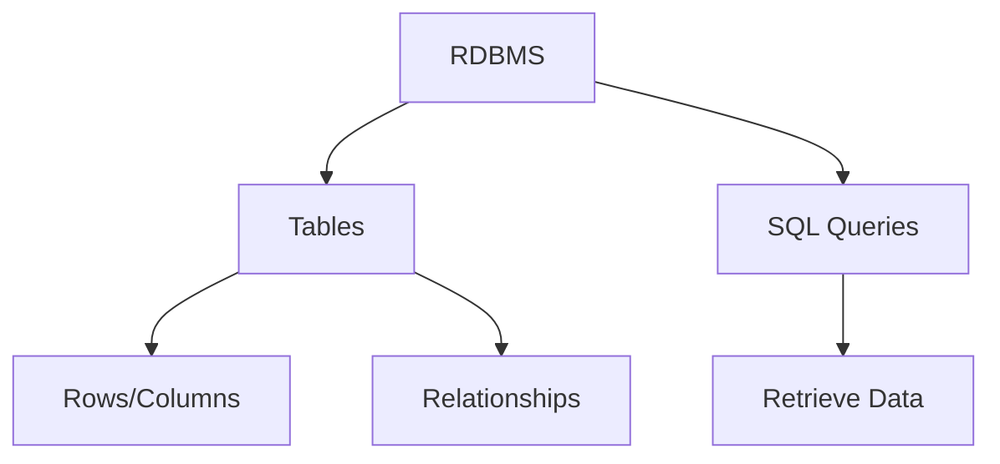
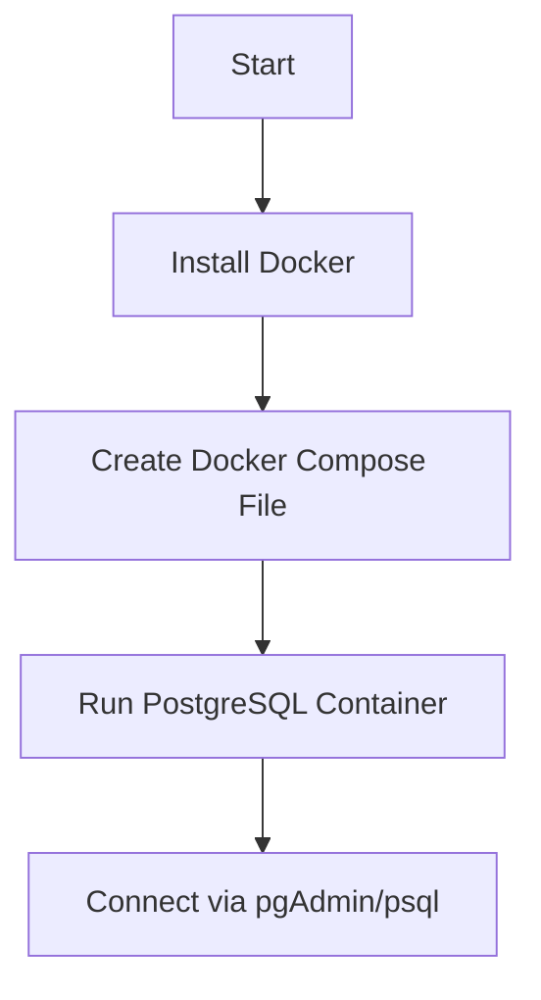
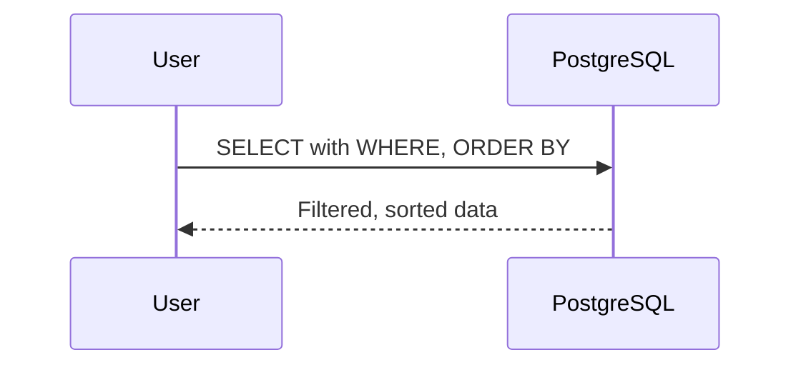
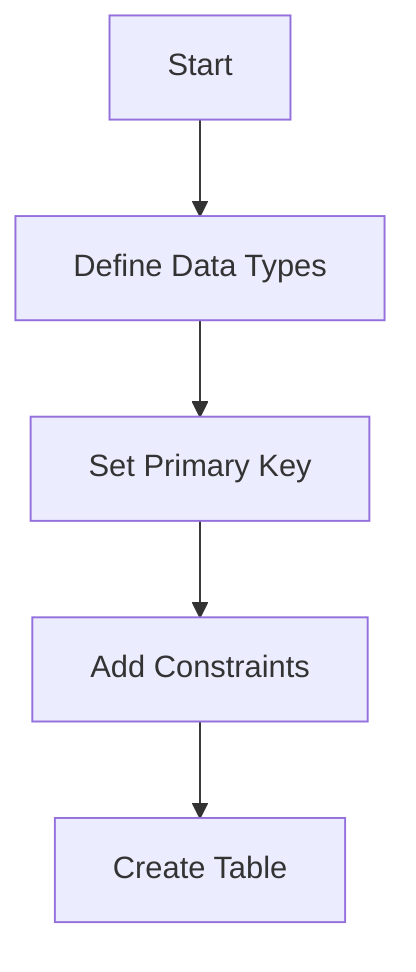
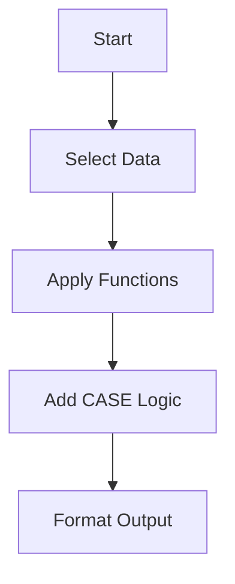
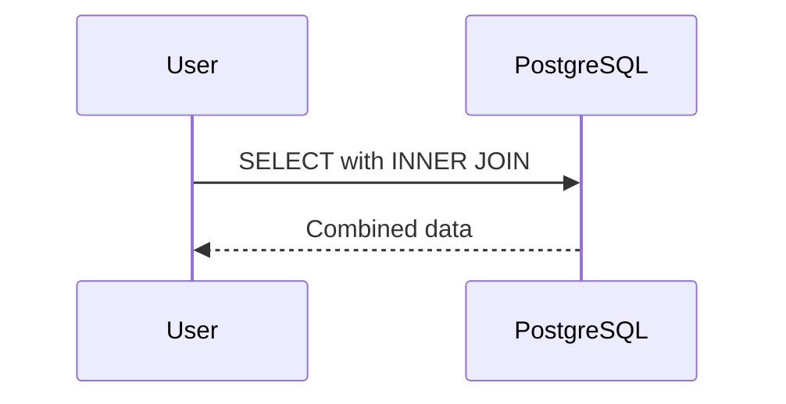
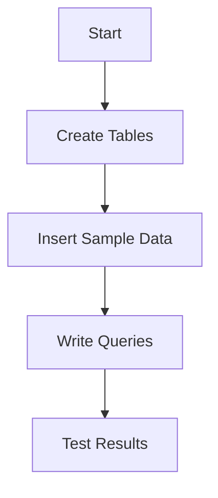

This cheatsheet is a concise, practical guide for the _Introduction to SQL and PostgreSQL_ course, designed for beginners with no database experience and familiarity with JavaScript, REST APIs, JSON, and frontend testing (e.g., Jest). It covers database fundamentals, PostgreSQL setup with Docker, basic SQL operations, data manipulation, table operations, and multi-table queries, culminating in a capstone project to design a relational database. Analogies to JavaScript concepts ensure clarity. Each section includes an overview, key concepts, commented code examples adhering to the _Code Commenting Guideline for Software Engineering Course_ with explicit output comments detailing query result structures, run commands with explanations, Mermaid diagrams, tips, and pitfalls.

## 1. Database Fundamentals

### Overview

Understand relational database concepts, like JavaScript objects in MongoDB, for organizing and managing data in applications like school records systems.

### Key Concepts

- **Relational Database Management Systems (RDBMS)**: Organizes data into tables, like a digital filing cabinet for a retail store.
  - **Characteristics**:
    - **Structured Storage**: Tables with rows/columns, like JSON objects.
    - **Relationships**: Links tables via keys, like object references.
    - **Querying**: SQL retrieves data, like JavaScript `filter`.
- **Data vs. Information**: Raw data (e.g., sales numbers) becomes information (e.g., reports) through queries.
- **ACID Properties**: Ensures reliable transactions (Atomicity, Consistency, Isolation, Durability), like JavaScript Promise resolution.
- **OLTP vs. OLAP**: Daily operations (OLTP, e.g., recording sales) vs. analytical reporting (OLAP, e.g., yearly profits).
- **PostgreSQL Advantages**: Free, open-source, scalable, like Node.js for backend development.

### Mermaid Diagram: RDBMS Structure



**Diagram Explanation**:

- Shows how an RDBMS organizes data into tables with relationships and queries, like a MongoDB database with collections and queries.

### Syntax Examples

```sql
-- File: explore_rdbms.sql
-- Description: Demonstrates basic table creation to explore RDBMS concepts.
-- Author: [Learner Name]
-- Date: 2025-07-07
-- Course: Introduction to SQL and PostgreSQL
-- Creates a simple table to store sales data
CREATE TABLE sales (
    sale_id SERIAL PRIMARY KEY,
    amount DECIMAL(10,2),
    sale_date DATE
);
-- Expected: Creates an empty sales table with columns:
--   sale_id (INTEGER, auto-incrementing primary key)
--   amount (DECIMAL, precision 10, scale 2)
--   sale_date (DATE)
```

**Run Command**:

```bash
psql -h localhost -U school_admin -d school_db -f explore_rdbms.sql
```

**Why This Command**:

- Executes the SQL file to create a table, similar to initializing a MongoDB collection with a JavaScript script.

**Test Command**:

```bash
psql -h localhost -U school_admin -d school_db -c "\d sales"
# Expected: Displays sales table structure:
#   Column    | Type                | Modifiers
#   ----------|--------------------|-----------
#   sale_id   | integer            | not null
#   amount    | numeric(10,2)      |
#   sale_date | date               |
```

### Quick Reference Table

| Concept   | Syntax/Tool           | JavaScript Equivalent   | Characteristics     |
| --------- | --------------------- | ----------------------- | ------------------- |
| RDBMS     | Tables, rows          | JSON objects in MongoDB | Structured storage  |
| ACID      | Transaction rules     | Promise resolution      | Ensures reliability |
| SQL Query | `SELECT * FROM table` | `collection.find()`     | Retrieves data      |

### Analogy

An RDBMS is like a MongoDB database, where tables are collections, and SQL queries are like `find` operations to extract data.

### Common Pitfalls

- **Misunderstanding Relationships**: Confusing table links. Solution: Study primary/foreign keys.
- **Ignoring ACID**: Overlooking transaction reliability. Solution: Review ACID properties for data integrity.

### Tips for Recall

- **Practice**: Create a simple table in pgAdmin to explore RDBMS.
- **Visualize**: Review the RDBMS diagram to connect concepts.
- **Test-Driven**: Query sample data to understand data vs. information.

### Connection to Next Section

- Understanding RDBMS concepts prepares learners to set up a PostgreSQL database, enabling practical data storage and querying.

## 2. Getting Started with PostgreSQL

### Overview

Set up a PostgreSQL database using Docker, like configuring a Node.js server, for a reproducible environment to manage data.

### Key Concepts

- **Docker-Based PostgreSQL Setup**: Runs PostgreSQL in a container, like a Node.js app in Docker.
- **Persistent Data Storage**: Saves data to a local folder (e.g., `./postgres_data`), like saving files in a Node.js app.
- **Database Connection**: Accesses PostgreSQL via pgAdmin or `psql`, like connecting to an API with Postman.
- **Docker Compose**: Defines services, like `package.json` for Node.js dependencies.

### Mermaid Diagram: Setup Flow



**Diagram Explanation**:

- Visualizes the setup process, similar to initializing a Node.js server with npm and Docker.

### Syntax Examples

```yaml
# File: docker-compose.yml
# Description: Configures a PostgreSQL container with persistent data storage.
# Author: [Learner Name]
# Date: 2025-07-07
# Course: Introduction to SQL and PostgreSQL
version: '3.8'
services:
  postgres:
    image: postgres:latest
    environment:
      POSTGRES_USER: school_admin
      POSTGRES_PASSWORD: secure_password
      POSTGRES_DB: school_db
    ports:
      - '5432:5432'
    volumes:
      # Persist data to local ./postgres_data folder
      - ./postgres_data:/var/lib/postgresql/data
# Expected: Creates a PostgreSQL instance accessible at localhost:5432
```

**Run Command**:

```bash
docker-compose up -d
```

**Why This Command**:

- Starts the PostgreSQL container in detached mode, like `npm start` for a Node.js app.

**Test Command**:

```bash
psql -h localhost -U school_admin -d school_db
# Expected: Connects to the database, allowing SQL command execution
```

### Quick Reference Table

| Concept            | Syntax/Tool          | JavaScript Equivalent      | Characteristics          |
| ------------------ | -------------------- | -------------------------- | ------------------------ |
| Docker Setup       | `docker-compose.yml` | `package.json`             | Reproducible environment |
| Connection         | `psql` or pgAdmin    | API client (e.g., Postman) | Accesses database        |
| Persistent Storage | `volumes`            | File system writes         | Ensures data retention   |

### Analogy

Setting up PostgreSQL with Docker is like configuring a Node.js server with Docker, creating a reliable environment for data management.

### Common Pitfalls

- **Missing Docker**: Install Docker first. Solution: Follow Docker’s official guide.
- **Port Conflict**: Port 5432 in use. Solution: Change to `5433:5432` in `docker-compose.yml`.

### Tips for Recall

- **Practice**: Run Docker setup and connect via `psql`.
- **Visualize**: Review setup diagram.
- **Test-Driven**: Verify connection with `psql`.

### Connection to Next Section

- Setting up PostgreSQL enables querying data with SQL, covered in the next section on basic operations.

## 3. Basic SQL Operations

### Overview

Master basic SQL queries for data retrieval, like filtering JavaScript arrays, to extract insights from a school database.

### Key Concepts

- **SELECT Statements**: Retrieves data, like `array.filter` in JavaScript.
- **WHERE Clause**: Filters rows, like an `if` condition.
- **ORDER BY**: Sorts results, like `array.sort`.
- **LIMIT/OFFSET**: Paginates data, like frontend table pagination.
- **NULL Handling**: Manages missing data, like checking `undefined` in JavaScript.

### Mermaid Diagram: Query Workflow



**Diagram Explanation**:

- Shows a user querying the database, like a frontend app fetching API data.

### Syntax Examples

```sql
-- File: select_query_exercise.sql
-- Description: Retrieve student grades from a school database.
-- Author: [Learner Name]
-- Date: 2025-07-07
-- Course: Introduction to SQL and PostgreSQL
-- Query: List grades above 80, sorted by date
-- Expected: Returns 5 rows for sample dataset with columns:
--   student_id (INTEGER, e.g., 1)
--   grade (INTEGER, e.g., 85)
--   exam_date (DATE, e.g., 2025-06-01)
-- Sample Output:
--   student_id | grade | exam_date
--   -----------|-------|------------
--   1         | 85    | 2025-06-01
--   2         | 90    | 2025-05-15
--   3         | 88    | 2025-04-20
--   4         | 82    | 2025-03-10
--   5         | 87    | 2025-02-05
SELECT student_id, grade, exam_date
FROM grades
WHERE grade > 80
ORDER BY exam_date DESC
LIMIT 5;
```

**Run Command**:

```bash
psql -h localhost -U school_admin -d school_db -f select_query_exercise.sql
```

**Why This Command**:

- Executes the SQL file, like running a JavaScript script with `node`.

**Test Command**:

```bash
psql -h localhost -U school_admin -d school_db -c "SELECT * FROM grades WHERE grade > 80;"
# Expected: Displays filtered grades with columns:
#   student_id (INTEGER, e.g., 1)
#   grade (INTEGER, e.g., 85)
#   exam_date (DATE, e.g., 2025-06-01)
#   Sample Output:
#   student_id | grade | exam_date
#   -----------|-------|------------
#   1         | 85    | 2025-06-01
#   ... (up to available rows)
```

### Quick Reference Table

| Concept  | Syntax                     | JavaScript Equivalent | Characteristics |
| -------- | -------------------------- | --------------------- | --------------- |
| SELECT   | `SELECT column FROM table` | `array.filter()`      | Retrieves data  |
| WHERE    | `WHERE condition`          | `if` statement        | Filters rows    |
| ORDER BY | `ORDER BY column`          | `array.sort()`        | Sorts results   |

### Analogy

SQL `SELECT` queries are like JavaScript `filter` and `sort` operations on arrays, extracting specific data from a collection.

### Common Pitfalls

- **Missing Semicolon**: Queries need `;`. Solution: Add at statement end.
- **NULL Mishandling**: `= NULL` fails. Solution: Use `IS NULL`.

### Tips for Recall

- **Practice**: Write queries in pgAdmin.
- **Visualize**: Review query workflow diagram.
- **Test-Driven**: Test queries with sample data.

### Connection to Next Section

- Querying data prepares learners to create and manage tables, enabling structured data storage in the next section.

## 4. Data Types and Table Operations

### Overview

Define and modify database tables with PostgreSQL data types, like defining JavaScript object schemas, for structured data storage.

### Key Concepts

- **PostgreSQL Data Types**: Numeric, text, date/time, like JavaScript types (number, string).
- **CREATE TABLE**: Defines table structures, like a JavaScript class.
- **Primary Keys/Constraints**: Ensures unique IDs, like unique object keys.
- **INSERT/UPDATE/DELETE**: Modifies data, like JavaScript object updates.
- **ALTER/DROP TABLE**: Adjusts/removes tables, like refactoring a class.

### Mermaid Diagram: Table Creation Flow



**Diagram Explanation**:

- Shows the process of creating a table, like defining a JavaScript object schema with properties and constraints.

### Syntax Examples

```sql
-- File: create_student_table.sql
-- Description: Creates a students table for an education database.
-- Author: [Learner Name]
-- Date: 2025-07-07
-- Course: Introduction to SQL and PostgreSQL
-- Creates a table with primary key and constraints
CREATE TABLE students (
    student_id SERIAL PRIMARY KEY,
    first_name VARCHAR(50) NOT NULL,
    last_name VARCHAR(50) NOT NULL,
    enrollment_date DATE
);
-- Expected: Creates an empty students table with columns:
--   student_id (INTEGER, auto-incrementing primary key)
--   first_name (VARCHAR, max 50 characters, not null)
--   last_name (VARCHAR, max 50 characters, not null)
--   enrollment_date (DATE, nullable)
```

```sql
-- File: insert_student.sql
-- Description: Inserts a student record.
-- Author: [Learner Name]
-- Date: 2025-07-07
-- Course: Introduction to SQL and PostgreSQL
-- Inserts sample data
INSERT INTO students (first_name, last_name, enrollment_date)
VALUES ('John', 'Doe', '2025-01-01');
-- Expected: Adds one row to students table with values:
--   student_id | first_name | last_name | enrollment_date
--   -----------|------------|-----------|----------------
--   1         | John       | Doe       | 2025-01-01
```

**Run Command**:

```bash
psql -h localhost -U school_admin -d school_db -f create_student_table.sql
```

**Why This Command**:

- Executes table creation, like initializing a MongoDB collection.

**Test Command**:

```bash
psql -h localhost -U school_admin -d school_db -c "\d students"
# Expected: Displays students table structure:
#   Column           | Type                | Modifiers
#   -----------------|---------------------|-----------
#   student_id       | integer            | not null
#   first_name       | character varying(50) | not null
#   last_name        | character varying(50) | not null
#   enrollment_date  | date               |
```

### Quick Reference Table

| Concept      | Syntax                           | JavaScript Equivalent | Characteristics    |
| ------------ | -------------------------------- | --------------------- | ------------------ |
| CREATE TABLE | `CREATE TABLE name (columns)`    | Class definition      | Defines structure  |
| Primary Key  | `SERIAL PRIMARY KEY`             | Unique object ID      | Ensures uniqueness |
| INSERT       | `INSERT INTO table VALUES (...)` | `object.push()`       | Adds data          |

### Analogy

Creating tables is like defining JavaScript objects with fixed properties, ensuring structured data storage.

### Common Pitfalls

- **Missing Constraints**: Omitting primary keys causes duplication. Solution: Define `PRIMARY KEY`.
- **Data Type Errors**: Using wrong types (e.g., VARCHAR for numbers). Solution: Match types to data.

### Tips for Recall

- **Practice**: Create tables in pgAdmin.
- **Visualize**: Review table creation diagram.
- **Test-Driven**: Insert and query data to verify structure.

### Connection to Next Section

- Creating tables enables data manipulation with functions and logic, covered in the next section.

## 5. Basic Data Manipulation

### Overview

Manipulate data with SQL functions and logic, like JavaScript string and date operations, to format reports or insights.

### Key Concepts

- **String Functions**: Combines/formats text (e.g., `CONCAT`), like JavaScript string methods.
- **Date/Time Functions**: Manipulates dates (e.g., `CURRENT_DATE`), like JavaScript `Date` objects.
- **Arithmetic Operations**: Performs calculations (e.g., `SUM`), like JavaScript math operations.
- **CASE Statements**: Adds conditional logic, like JavaScript `if/else`.
- **SQL Comments**: Documents query intent, like JavaScript comments.

### Mermaid Diagram: Data Manipulation Flow



**Diagram Explanation**:

- Shows the process of transforming data, like manipulating JavaScript objects for display.

### Syntax Examples

```sql
-- File: format_grades.sql
-- Description: Format student grades with pass/fail status.
-- Author: [Learner Name]
-- Date: 2025-07-07
-- Course: Introduction to SQL and PostgreSQL
-- Query: Concatenate names and add pass/fail label
-- Expected: Returns formatted student data with columns:
--   full_name (VARCHAR, e.g., "John Doe")
--   grade (INTEGER, e.g., 85)
--   status (VARCHAR, e.g., "Pass")
-- Sample Output:
--   full_name  | grade | status
--   -----------|-------|-------
--   John Doe   | 85    | Pass
--   Jane Smith | 55    | Fail
SELECT CONCAT(first_name, ' ', last_name) AS full_name,
       grade,
       CASE
           WHEN grade >= 60 THEN 'Pass'
           ELSE 'Fail'
       END AS status
FROM students
WHERE grade IS NOT NULL;
```

**Run Command**:

```bash
psql -h localhost -U school_admin -d school_db -f format_grades.sql
```

**Why This Command**:

- Executes the query, like running a JavaScript function to process data.

**Test Command**:

```bash
psql -h localhost -U school_admin -d school_db -c "SELECT CONCAT(first_name, ' ', last_name) AS full_name FROM students;"
# Expected: Displays concatenated names:
#   full_name
#   -----------
#   John Doe
#   Jane Smith
```

### Quick Reference Table

| Concept         | Syntax                            | JavaScript Equivalent | Characteristics   |
| --------------- | --------------------------------- | --------------------- | ----------------- |
| String Function | `CONCAT(str1, str2)`              | `str1 + str2`         | Manipulates text  |
| CASE            | `CASE WHEN condition THEN result` | `if/else`             | Conditional logic |
| Date Function   | `CURRENT_DATE`                    | `new Date()`          | Handles dates     |

### Analogy

SQL data manipulation is like JavaScript operations on arrays/objects, transforming raw data for display.

### Common Pitfalls

- **Syntax Errors**: Missing commas in `CONCAT`. Solution: Verify function syntax.
- **CASE Logic**: Incorrect conditions. Solution: Test conditions separately.

### Tips for Recall

- **Practice**: Write manipulation queries in pgAdmin.
- **Visualize**: Review data manipulation diagram.
- **Test-Driven**: Test functions with sample data.

### Connection to Next Section

- Data manipulation skills prepare learners to query multiple tables with relationships, covered in the next section.

## 6. Introduction to Multi-Table Operations

### Overview

Query multiple tables with joins, like linking JavaScript objects, to combine related data in an education database.

### Key Concepts

- **Table Relationships**: Links data (e.g., students to courses), like object references.
- **Foreign Keys**: Enforces valid links, like JavaScript ID checks.
- **INNER JOIN**: Combines related data, like merging arrays.
- **Aliases**: Simplifies query syntax, like JavaScript variable shortcuts.
- **Simple Subqueries**: Filters with nested queries, like nested `filter` calls.

### Mermaid Diagram: Join Workflow



**Diagram Explanation**:

- Shows a user joining tables, like a frontend app combining API data.

### Syntax Examples

```sql
-- File: join_query_exercise.sql
-- Description: Joins students and courses via enrollments.
-- Author: [Learner Name]
-- Date: 2025-07-07
-- Course: Introduction to SQL and PostgreSQL
-- Query: List student names and course names
-- Expected: Returns joined data with columns:
--   first_name (VARCHAR, e.g., "John")
--   last_name (VARCHAR, e.g., "Doe")
--   course_name (VARCHAR, e.g., "Math")
-- Sample Output:
--   first_name | last_name | course_name
--   -----------|-----------|------------
--   John       | Doe       | Math
--   Jane       | Smith     | Science
SELECT s.first_name, s.last_name, c.course_name
FROM students s
INNER JOIN enrollments e ON s.student_id = e.student_id
INNER JOIN courses c ON e.course_id = c.course_id;
```

**Run Command**:

```bash
psql -h localhost -U school_admin -d school_db -f join_query_exercise.sql
```

**Why This Command**:

- Executes the join query, like combining JavaScript objects in a script.

**Test Command**:

```bash
psql -h localhost -U school_admin -d school_db -c "SELECT * FROM enrollments;"
# Expected: Displays enrollment data:
#   enrollment_id (INTEGER, e.g., 1)
#   student_id (INTEGER, e.g., 1)
#   course_id (INTEGER, e.g., 1)
#   enrollment_date (DATE, e.g., 2025-01-01)
#   Sample Output:
#   enrollment_id | student_id | course_id | enrollment_date
#   --------------|------------|-----------|----------------
#   1            | 1          | 1         | 2025-01-01
#   2            | 2          | 2         | 2025-01-02
```

### Quick Reference Table

| Concept     | Syntax                                  | JavaScript Equivalent    | Characteristics        |
| ----------- | --------------------------------------- | ------------------------ | ---------------------- |
| INNER JOIN  | `JOIN table ON condition`               | Array `join` with lookup | Combines data          |
| Foreign Key | `FOREIGN KEY (column) REFERENCES table` | Object reference         | Enforces relationships |
| Alias       | `table AS t`                            | Variable shortcut        | Simplifies syntax      |

### Analogy

Joining tables is like merging JavaScript objects by matching IDs, combining related data for reports.

### Common Pitfalls

- **Incorrect Joins**: Wrong `ON` clauses. Solution: Verify column relationships.
- **Missing Foreign Keys**: Causes invalid links. Solution: Define `FOREIGN KEY`.

### Tips for Recall

- **Practice**: Write join queries in pgAdmin.
- **Visualize**: Review join workflow diagram.
- **Test-Driven**: Test joins with sample data.

### Connection to Next Section

- Multi-table operations enable building a complete database with relationships, applied in the capstone project.

## 7. Capstone: Education Platform Database

### Overview

Design a relational database for an education platform, like building a JavaScript application with multiple components, applying all course concepts to create and query tables.

### Key Concepts

- **Database Design**: Create tables with relationships, like JavaScript object schemas.
- **Constraints**: Use primary/foreign keys, like unique IDs.
- **Queries**: Combine SELECT, JOIN, and manipulation, like JavaScript data processing.
- **Deliverables**:
  - **Basic**: Two tables, three queries.
  - **Advanced**: Three tables, five queries with a subquery.

### Mermaid Diagram: Capstone Workflow



**Diagram Explanation**:

- Outlines project steps, like building a frontend app with data fetching.

### Example Code

```sql
-- File: capstone_database.sql
-- Description: Creates and queries an education database.
-- Author: [Learner Name]
-- Date: 2025-07-07
-- Course: Introduction to SQL and PostgreSQL
-- Creates courses table
CREATE TABLE courses (
    course_id SERIAL PRIMARY KEY,
    course_name VARCHAR(100) NOT NULL
);
-- Creates students table
CREATE TABLE students (
    student_id SERIAL PRIMARY KEY,
    first_name VARCHAR(50) NOT NULL,
    last_name VARCHAR(50) NOT NULL
);
-- Creates enrollments table
CREATE TABLE enrollments (
    enrollment_id SERIAL PRIMARY KEY,
    student_id INTEGER REFERENCES students(student_id),
    course_id INTEGER REFERENCES courses(course_id),
    enrollment_date DATE
);
-- Inserts sample data
INSERT INTO courses (course_name) VALUES ('Math'), ('Science');
INSERT INTO students (first_name, last_name) VALUES ('John', 'Doe'), ('Jane', 'Smith');
INSERT INTO enrollments (student_id, course_id, enrollment_date) VALUES (1, 1, '2025-01-01'), (2, 2, '2025-01-02');
-- Query: List students enrolled in courses
SELECT s.first_name, s.last_name, c.course_name
FROM students s
INNER JOIN enrollments e ON s.student_id = e.student_id
INNER JOIN courses c ON e.course_id = c.course_id;
-- Expected: Returns student-course pairs with columns:
--   first_name (VARCHAR, e.g., "John")
--   last_name (VARCHAR, e.g., "Doe")
--   course_name (VARCHAR, e.g., "Math")
-- Sample Output:
--   first_name | last_name | course_name
--   -----------|-----------|------------
--   John       | Doe       | Math
--   Jane       | Smith     | Science
```

**Run Command**:

```bash
psql -h localhost -U school_admin -d school_db -f capstone_database.sql
```

**Why This Command**:

- Executes the capstone script, like running a JavaScript app to initialize and query data.

**Test Command**:

```bash
psql -h localhost -U school_admin -d school_db -c "SELECT * FROM courses;"
# Expected: Displays course data:
#   course_id (INTEGER, e.g., 1)
#   course_name (VARCHAR, e.g., "Math")
#   Sample Output:
#   course_id | course_name
#   ----------|------------
#   1         | Math
#   2         | Science
```

### Quick Reference Table

| Concept         | Syntax                     | JavaScript Equivalent | Characteristics   |
| --------------- | -------------------------- | --------------------- | ----------------- |
| Database Design | `CREATE TABLE`             | Object schema         | Defines structure |
| Queries         | `SELECT, JOIN`             | Array operations      | Extracts insights |
| Constraints     | `PRIMARY KEY, FOREIGN KEY` | Unique IDs            | Ensures integrity |

### Analogy

The capstone is like building a JavaScript application with components for data storage, processing, and display, creating a functional system.

### Common Pitfalls

- **Data Type Mismatch**: Wrong types for IDs. Solution: Use `SERIAL`.
- **Missing Constraints**: Causes invalid links. Solution: Define `FOREIGN KEY`.

### Tips for Recall

- **Practice**: Build the capstone in pgAdmin.
- **Visualize**: Review workflow diagram.
- **Test-Driven**: Test queries with sample data.

## 8. Setup and Resources

### Environment Setup

- **Docker**:
  ```bash
  sudo apt install docker.io docker-compose
  ```
- **PostgreSQL Client**:
  ```bash
  sudo apt install postgresql-client
  ```
- **VS Code**: Install SQLTools extension for query execution.

### Key Resources

- **PostgreSQL**: Official documentation for syntax.
- **Docker**: Guides for container setup.
- **pgAdmin**: GUI for database management.
- **SQLTools**: VS Code extension for SQL execution.

### Terminal Commands

```bash
# Create project folder
mkdir school_db_project && cd school_db_project
# Run Docker Compose
docker-compose up -d
# Run SQL file
psql -h localhost -U school_admin -d school_db -f capstone_database.sql
```

### Analogy

Setting up PostgreSQL with Docker is like initializing a Node.js project with npm, creating a reliable environment.

### Common Pitfalls

- **Port Conflict**: Port 5432 in use. Solution: Change to `5433:5432` in `docker-compose.yml`.
- **Permission Issues**: Folder access denied. Solution: Run `chmod -R 777 postgres_data`.

## 9. Tips for Recall

- **Analogies**: Compare to JavaScript (e.g., `SELECT` ≈ `filter`, tables ≈ objects).
- **Practice**: Run queries and setup in pgAdmin or `psql`.
- **Visualize**: Use diagrams to connect concepts.
- **Test-Driven**: Write and test queries to reinforce learning.
- **Error Handling**: Learn to fix common errors like missing semicolons.
- **Capstone**: Revisit the education database to apply all skills.
