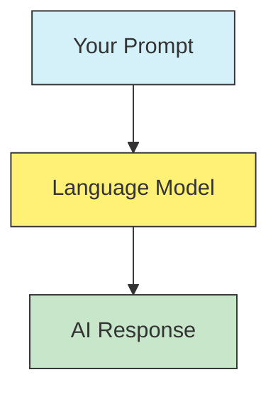
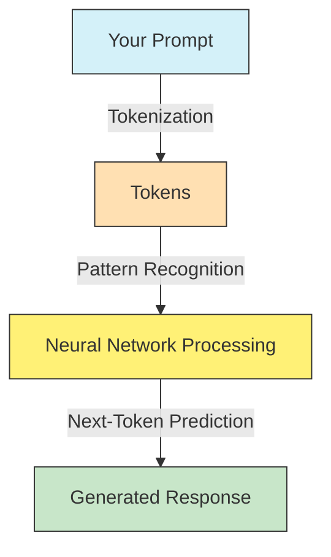
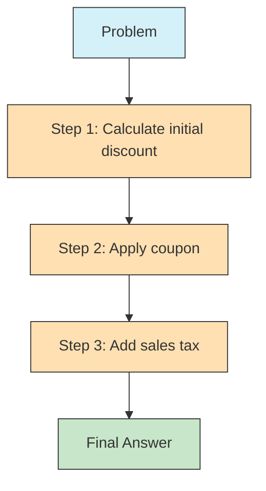
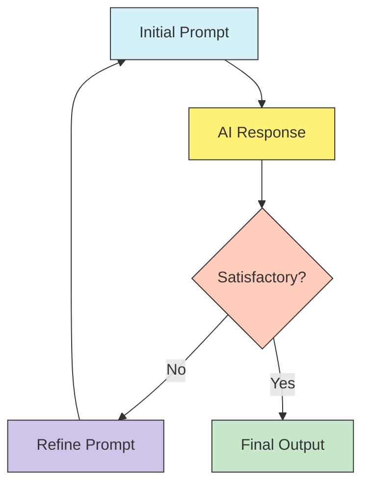
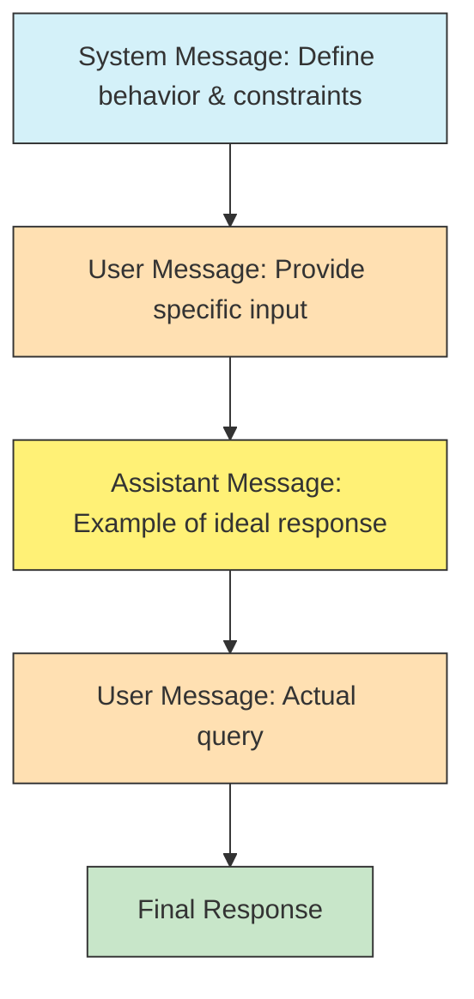

This crash course distills the most important aspects of prompt engineering to help you effectively communicate with AI language models like GPT-4, Claude, and others. By the end of this guide, you'll have mastered the core 85% of what you need for daily interactions, along with a clear roadmap for the remaining 15% you can explore independently.

## What is Prompt Engineering?

Prompt engineering is the art and science of crafting effective inputs (prompts) to guide AI language models toward generating useful, accurate, and relevant outputs. You can think of it as learning how to communicate effectively with AI—similar to how we learn to communicate clearly with other humans, but with some important differences.



### Prerequisites

One of the most encouraging aspects of prompt engineering is that you don't need a technical background to become proficient at it. If you can already structure questions and instructions in your daily life, you have the foundation needed. The only requirements are:

- Basic familiarity with language models like ChatGPT or Claude
- Curiosity and willingness to experiment with different approaches
- Ability to analyze what works and doesn't work in your prompts

## Understanding How LLMs Work (Simplified)

Before diving into specific techniques, it helps to understand how these AI models process your prompts. This understanding will make the techniques more intuitive and give you insight into why certain approaches work better than others.

When you provide a prompt, the model:

1. **Tokenization**: Your text is broken into tokens (word pieces or characters)
2. **Pattern Recognition**: The model processes these tokens through its neural network
3. **Next-Token Prediction**: The model predicts what should come next based on patterns learned during training
4. **Response Generation**: A response is generated by repeatedly predicting the next token



This process explains why the phrasing, structure, and details in your prompt matter so much—they guide the AI's response generation process in specific directions, much like setting a path for the model to follow.

## Core Techniques for Effective Prompts

Let's explore the fundamental techniques that will help you craft effective prompts for a wide range of applications.

### 1. Be Specific and Descriptive

The single most important rule in prompt engineering is to be as specific and detailed as possible about what you want. Vague prompts lead to vague, often unhelpful responses.

**Poor prompt:**

```
Tell me about climate change
```

**Better prompt:**

```
Explain the basic science behind climate change in simple terms for a high school student. Include:
1. The greenhouse effect mechanism
2. Major greenhouse gases and their sources
3. Current global impacts
4. Format with clear headings and keep it under 500 words
```

The difference is dramatic—the second prompt provides clear direction about content, audience, structure, and length, which guides the AI toward a much more useful response.

### 2. Use Clear Formatting

Structuring your prompts with clear sections and formatting helps the AI understand and organize the information you're providing. Using delimiters like triple quotes, dashes, or numbered lists makes your instructions more explicit.

**Example:**

```
Summarize the text below as a bullet point list of the most important points.

Text: """
[your long text here]
"""
```

This formatting clearly separates your instructions from the content you want processed, preventing confusion and improving results.

### 3. Specify Output Format

Always tell the AI exactly how you want the response formatted. This dramatically improves the likelihood of getting exactly what you need.

**Example:**

```
Create a 3-day meal plan for someone trying to reduce carbohydrates.

Format your response as a table with these columns:
- Day and meal
- Foods
- Approximate calories
- Protein (g)
- Carbs (g)
- Fat (g)
```

By specifying the exact format, you eliminate guesswork for the AI and ensure the response meets your needs without requiring additional back-and-forth.

### 4. Zero-Shot vs. Few-Shot Prompting

These approaches differ in whether you provide examples to guide the AI's response pattern.

**Zero-shot prompting** means asking the model to perform a task without providing examples. This works well for straightforward tasks:

```
Classify this product review as positive, negative, or neutral:
"The interface is intuitive but loading times are frustratingly slow."
```

**Few-shot prompting** includes examples to guide the model's response. This is particularly helpful for complex or specific tasks:

```
Classify the sentiment as positive, negative, or neutral:

Example 1:
Text: "This phone exceeded all my expectations!"
Classification: Positive

Example 2:
Text: "The battery life is disappointing but the camera is excellent."
Classification: Mixed

Now classify this:
Text: "Delivery was on time but the packaging was damaged."
Classification:
```

The examples help establish the pattern and expectations for the task, often leading to more consistent results.

### 5. Role/Persona Assignment

Assigning a specific role to the AI can lead to more specialized, targeted responses. This technique helps frame the context and knowledge base the AI should draw from.

```
You are an experienced pediatrician explaining medical concepts to worried parents.
Explain what causes childhood ear infections, warning signs parents should watch for,
and when they should seek medical attention.
```

By specifying the role (pediatrician) and the audience (worried parents), you're guiding the AI to adopt an appropriate tone, vocabulary level, and focus on practical information.

### 6. Chain-of-Thought Prompting

This powerful technique encourages the model to break down complex problems into steps, which often improves reasoning and accuracy. It's particularly effective for math problems, logical reasoning, and complex analysis.

```
Solve this math problem step by step:

A store offers a 25% discount on an item that originally costs $120.
If there's an additional 10% off coupon that applies after the first discount,
what is the final price including 8% sales tax?
```



By explicitly requesting a step-by-step approach, you're guiding the AI to show its work and follow a logical progression, which typically leads to more accurate results.

### 7. Template Prompting

Creating consistent templates for recurring tasks saves time and ensures consistency. Templates are especially useful for tasks you perform regularly.

**Example template for content review:**

```
Review the following [CONTENT TYPE] and provide feedback on:
1. Main strengths
2. Areas for improvement
3. Specific suggestions for enhancement
4. Overall rating on a scale of 1-10

[CONTENT TYPE]: """
[paste content here]
"""
```

This template can be reused for reviewing blog posts, emails, presentations, or any other content, with minimal adjustments.

## Controlling Response Characteristics

Beyond the basic structure of your prompts, you can also control various aspects of how the AI generates its responses.

### Temperature Setting

Temperature is a parameter that controls the randomness in responses. Think of it as adjusting how "creative" versus "focused" the AI should be:

- **Low temperature (0-0.3)**: More deterministic, focused, and precise—good for factual responses
- **High temperature (0.7-1.0)**: More creative, diverse, and exploratory—better for creative tasks

**When to use low temperature:**

- Factual questions where accuracy is crucial
- Code generation where precision matters
- Structured data extraction where consistency is important

**When to use high temperature:**

- Creative writing where you want novelty
- Brainstorming where you want diverse ideas
- Conversational responses where some variety feels more natural

Understanding when to adjust this parameter can significantly improve your results for different types of tasks.

### Managing Context Limitations

Most LLMs have token limits that restrict how much text they can process at once. To work effectively within these constraints:

1. Prioritize essential instructions and context
2. Remove unnecessary background information
3. Split complex tasks into sequential prompts
4. Use concise language throughout

Being mindful of these limitations helps you design prompts that work within the model's capabilities, especially for complex or lengthy tasks.

## Practical Applications with Examples

Now let's see how these techniques apply to real-world scenarios you're likely to encounter.

### Content Creation

AI models excel at generating various types of content when guided with effective prompts.

**Blog post introduction prompt:**

```
Create a blog post introduction about urban gardening for beginners.

The introduction should:
- Be approximately 150 words
- Target apartment dwellers with limited space
- Include a compelling hook
- Highlight 2-3 benefits of urban gardening
- End with a preview of what the full article would cover

Tone: Enthusiastic but practical
```

This prompt combines specificity, clear formatting, and output guidelines to generate a tailored piece of content for a specific audience.

### Data Analysis and Problem-Solving

Prompt engineering can help tackle business and analytical challenges by breaking them down into structured components.

**Business analysis prompt:**

```
You're a business consultant analyzing this situation:

"""
Our e-commerce store has seen a 15% drop in conversions despite increased
traffic. Cart abandonment is up 23%. Customer feedback mentions slow loading
times and confusion about shipping costs.
"""

Provide:
1. Three potential root causes
2. One diagnostic test for each cause
3. Three recommended immediate actions
4. One long-term strategy
```

This prompt uses role assignment, clear formatting, and specific output requirements to guide the AI toward a structured, actionable analysis.

### Code Generation

LLMs can generate code snippets and explain programming concepts when prompted effectively.

**Python function prompt:**

```
Create a Python function that:
1. Takes a list of dictionaries representing students (with 'name', 'grade', and 'subjects' keys)
2. Returns a new list with only students who take 'Mathematics' and have a grade above 85
3. Sort the results alphabetically by name

Include comments explaining your code and provide a simple example of how to use this function.
```

Example result:

```python
def filter_math_students(students_list):
    """
    Filter students who take Mathematics and have a grade above 85.

    Args:
        students_list: List of dictionaries with 'name', 'grade', and 'subjects' keys
                      where 'subjects' is a list of subject names

    Returns:
        Filtered list sorted alphabetically by name
    """
    # Filter students who take Mathematics and have grade > 85
    filtered_students = [
        student for student in students_list
        if 'Mathematics' in student['subjects'] and student['grade'] > 85
    ]

    # Sort alphabetically by name
    sorted_students = sorted(filtered_students, key=lambda x: x['name'])

    return sorted_students

# Example usage
students = [
    {'name': 'Alice', 'grade': 92, 'subjects': ['Mathematics', 'Physics']},
    {'name': 'Bob', 'grade': 78, 'subjects': ['Mathematics', 'Chemistry']},
    {'name': 'Carol', 'grade': 88, 'subjects': ['Mathematics', 'Biology']},
    {'name': 'David', 'grade': 95, 'subjects': ['Physics', 'Chemistry']}
]

math_students = filter_math_students(students)
print(math_students)
# Output: [{'name': 'Alice', 'grade': 92, 'subjects': ['Mathematics', 'Physics']},
#          {'name': 'Carol', 'grade': 88, 'subjects': ['Mathematics', 'Biology']}]
```

This prompt specifies both the functionality requirements and the documentation needs, resulting in well-commented, functional code with a usage example.

### Educational Content

AI can adapt explanations to different knowledge levels, making it valuable for educational purposes.

**Educational explanation prompt:**

```
Explain the concept of photosynthesis in three different ways:

1. First, as if I'm a 10-year-old
2. Then, as if I'm a high school biology student
3. Finally, as if I'm a university biology major

For each explanation, include a simple analogy that would help me understand.
```

This prompt leverages the AI's ability to adjust complexity levels and use analogies to make concepts more accessible to different audiences.

## Troubleshooting Common Issues

Even with well-crafted prompts, you may encounter challenges. Here's how to address common issues.

### Handling Hallucinations

LLMs can sometimes generate incorrect information or "hallucinate" facts. To reduce this risk:

1. Ask for citations or sources when appropriate
2. Request the model to highlight uncertain information
3. Use more specific prompts to constrain responses

**Anti-hallucination prompt:**

```
Explain quantum computing.

After your explanation:
1. Identify any statements that might be speculative
2. Mark any points that require specialized expertise
3. Note areas where there are scientific debates
```

This approach acknowledges the limitations of AI models and encourages more cautious, transparent responses.

### Iterative Refinement

Prompt engineering is inherently iterative. If you don't get the desired result on the first try, refine your prompt with more specific instructions or examples based on what you learned.



**Initial prompt:**

```
How do I learn programming?
```

**Refined prompt:**

```
Create a 4-week learning plan for a complete beginner who wants to learn
Python programming. Include:

1. Week-by-week learning goals
2. Specific free resources (websites, tutorials)
3. Small daily practice exercises
4. A weekend project for each week
5. Expected time commitment per day (assuming 1 hour available)

Focus on practical web scraping applications as the end goal.
```

This refinement process turns a vague question into a specific request for structured, actionable information.

## Practical Prompt Patterns

Certain patterns have emerged as particularly effective for common scenarios. Let's examine a couple of these patterns.

### The System-User-Assistant Pattern

When available, using different message roles can help structure complex interactions:

1. **System**: Set overall behavior, constraints, and goals
2. **User**: Provide specific inputs and questions
3. **Assistant**: Show examples of desired outputs



This pattern is especially useful for maintaining consistent behavior across multiple interactions or for complex tasks requiring specific constraints.

### The Evaluation Pattern

Having the AI evaluate its own responses can improve quality and completeness:

```
After generating your response to my question about [topic], please:
1. Review your response for factual accuracy
2. Identify any ambiguities or missing information
3. Rate your confidence in each major point (high/medium/low)
4. Suggest improvements for a more comprehensive answer
```

This pattern leverages the model's ability to critically assess its own output, leading to more thorough and accurate responses.

## The Remaining 15%: Advanced Topics

Now that you've mastered the core 85% of prompt engineering, let's explore what constitutes the remaining 15%—the advanced topics you can explore independently as your skills develop.

### Advanced Prompting Techniques

As you become more comfortable with basic techniques, you can explore more sophisticated approaches:

1. **Tree-of-Thought Prompting**: Exploring multiple reasoning paths simultaneously, allowing the AI to consider different angles before settling on a solution
2. **Meta-language Creation**: Developing specialized micro-languages for specific tasks that help constrain and direct the AI's responses
3. **ReAct Prompting**: Combining reasoning and acting in alternating steps to solve complex problems more systematically
4. **Autonomous Agent Frameworks**: Creating AI systems that can operate with minimal human intervention through carefully designed prompt sequences

### Domain-Specific Applications

Different domains benefit from specialized prompting approaches:

1. **Legal Document Analysis**: Specialized prompts for legal research, contract analysis, and regulatory compliance that account for the unique language and structure of legal documents
2. **Medical & Scientific Research**: Using LLMs for literature review, hypothesis generation, and experimental design with appropriate scientific rigor
3. **Financial Analysis**: Creating effective prompts for market analysis, financial reporting, and investment research with an emphasis on analytical precision
4. **Creative Writing**: Advanced techniques for fiction, poetry, and scriptwriting that balance creative freedom with narrative structure

### Technical Optimizations

For those interested in the more technical aspects:

1. **Token Optimization**: Making prompts more efficient and economical by reducing token usage without sacrificing clarity
2. **Model Benchmarking**: Comparing performance across different models to determine which works best for specific use cases
3. **API Integration**: Incorporating LLMs into software applications through effective API usage patterns
4. **Prompt Testing Methodologies**: Systematically testing prompt effectiveness across different scenarios and user needs

### Tools and Frameworks

A growing ecosystem of tools can help enhance your prompt engineering capabilities:

1. **Specialized Environments**: Platforms like IBM watsonx Prompt Lab, Spellbook, and Dust that provide structured environments for prompt development
2. **Prompt Libraries**: Collections of effective prompts for various use cases that you can adapt and build upon
3. **Version Control**: Methods for managing prompt iterations and improvements as you refine your approach
4. **Prompt Chaining**: Orchestrating series of prompts for complex workflows that build on each other

### Ethics and Responsible Usage

Ethical considerations become increasingly important as you develop more advanced applications:

1. **Bias Mitigation**: Identifying and addressing biases in AI outputs to ensure fair and balanced responses
2. **Factuality Verification**: Methods to ensure accurate information and reduce the risk of misinformation
3. **Privacy Considerations**: Protecting sensitive information in prompts and ensuring compliance with privacy regulations
4. **Content Moderation**: Ensuring appropriate and safe content generation, especially in public-facing applications

## Conclusion

You now have the essential knowledge that covers 85% of what you need for effective prompt engineering in daily use. This foundation will serve you well across a wide range of applications, from content creation to problem-solving, code generation, and educational content.

The key to improving is practice and experimentation—try different approaches, observe what works, and continuously refine your techniques. Remember that prompt engineering is both an art and a science. Each interaction with an AI model is an opportunity to develop better intuition for what works.

As AI models continue to evolve, the skills you've learned here will only become more valuable. You now have the tools to communicate effectively with AI systems, unlocking their potential to assist you in countless personal and professional contexts.
