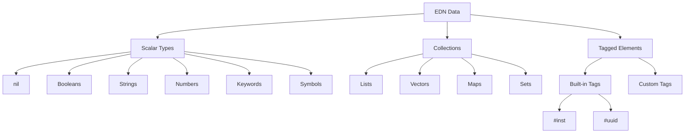
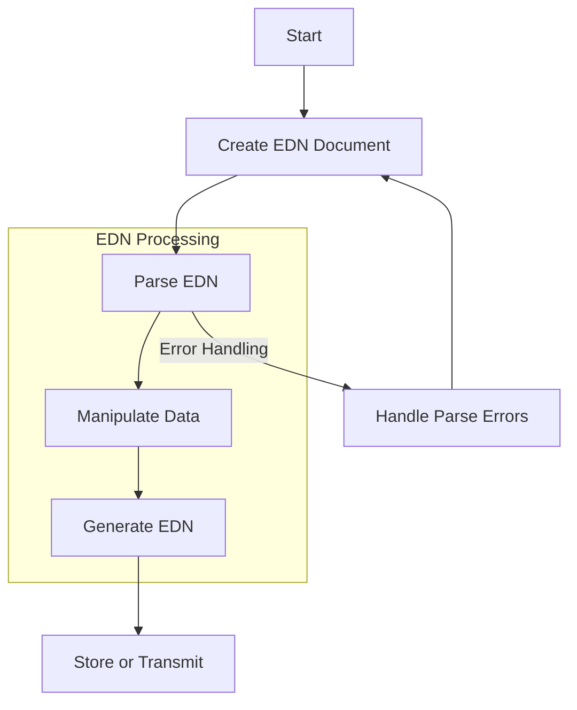

## Introduction

Extensible Data Notation (EDN, pronounced "eden") is a data format originating from the Clojure ecosystem that provides a robust alternative to JSON for data interchange between applications. As you begin exploring EDN, you'll discover it offers a richer set of built-in data types, powerful extensibility mechanisms, and superior support for complex data structures while maintaining excellent readability.

### Key Benefits Over JSON

EDN provides several advantages that make it worth considering for your data serialization needs:

- Support for comments within your data files
- Treatment of commas as whitespace, making them optional for flexibility
- A more comprehensive set of primitive data types for precise data representation
- Built-in extensibility mechanisms for custom data types
- Enhanced support for representing complex, nested data structures

## Prerequisites

You don't need specific technical knowledge to get started with EDN:

- No special prerequisites are required to begin learning
- Familiarity with JSON will provide helpful context and accelerate your understanding
- Basic knowledge of data serialization concepts will be beneficial but isn't essential

## Getting Started with EDN

Let's explore the fundamentals of EDN syntax and structure that will form the foundation of your understanding.

### Basic EDN Syntax

EDN syntax is designed to be clean, readable, and expressive. Here are the core elements you'll work with:

#### Comments

Comments in EDN begin with a semicolon (`;`) and continue to the end of the line, allowing you to document your data effectively:

```edn
{:name "John" ; This comments out the rest of the line
 :age 30}
```

#### Data Types

EDN provides a rich set of data types to represent information precisely:

1. **nil**: Represents the absence of a value, similar to `null` in other languages:

```edn
nil
```

2. **Booleans**: Simple true/false values for logical operations:

```edn
true
false
```

3. **Strings**: Text enclosed in double quotes with support for escape sequences:

```edn
"Hello, world!"
"This is a string with \"escaped quotes\""
```

4. **Numbers**: A comprehensive numeric system supporting integers, floating-point, and arbitrary precision numbers:

```edn
42        ; integer
3.14159   ; floating-point
42N       ; arbitrary precision integer (BigInteger)
3.14159M  ; arbitrary precision decimal (BigDecimal)
```

5. **Keywords**: Efficient identifiers starting with a colon, commonly used as map keys:

```edn
:name
:user/name     ; namespaced keyword
:db.type/string ; keywords can have multiple segments
```

Keywords provide significant performance advantages for comparison operations and memory usage compared to strings, making them ideal choices for map keys.

6. **Symbols**: Identifiers that don't start with a colon, often representing variables or functions:

```edn
x
clojure.core/+
my-namespace/my-function
```

Symbols can be namespaced using a forward slash, where the part before the slash defines the namespace for better organization.

#### Collections

EDN provides four versatile collection types that allow you to structure data in different ways:

1. **Lists**: Ordered sequences of values enclosed in parentheses:

```edn
(1 2 3 4)
(:a :b :c "mix" :of "different" :types)
```

2. **Vectors**: Ordered collections similar to arrays, allowing efficient random access, enclosed in square brackets:

```edn
[1 2 3 4]
[:a :b :c ["mix" :of "different" :types]]
```

3. **Maps**: Key-value associations enclosed in curly braces, forming the backbone of most EDN data structures:

```edn
{:name "John" :age 30}
{"key" "value" :another-key :another-value}
{:user/name "John" :user/age 30}
```

For improved readability, you may use commas as whitespace separators:

```edn
{:name "John", :age 30, :city "New York"}
```

4. **Sets**: Collections of unique values enclosed in `#{}`, automatically preventing duplicates:

```edn
#{1 2 3}
#{"unique" "values" "only"}
```

If you attempt to include duplicate values in a set literal, the parser will reject it with an error, ensuring data integrity.

### EDN Data Structure Visualization

The following diagram illustrates how these elements relate to each other in the EDN ecosystem:



## Advanced EDN Features

As you become comfortable with the basics, you'll want to explore EDN's more powerful capabilities.

### Tagged Elements

One of EDN's most distinctive features is its tagged element system, which enables extensibility. Tags begin with `#` followed by a symbol and a value:

```edn
#inst "2025-04-07T06:54:00Z"       ; Represents a datetime instant
#uuid "f81d4fae-7dec-11d0-a765-00a0c91e6bf6"  ; UUID
```

This powerful mechanism allows you to define custom tags for domain-specific data, extending EDN's capabilities to match your exact requirements.

### Whitespace and Commas

EDN treats whitespace as element separators and commas as whitespace, giving you considerable flexibility in formatting your data:

```edn
; All of these representations are equivalent:
{:a 1 :b 2 :c 3}
{:a 1, :b 2, :c 3}
{
  :a 1,
  :b 2,
  :c 3
}
```

This flexibility allows you to format your data for maximum readability without changing its meaning.

## Working with EDN

Now that you understand the structure of EDN, let's explore how to work with it in different programming environments.

### Parsing and Generating EDN in Different Languages

#### Clojure

In Clojure, EDN support is built into the standard library:

```clojure
; Reading EDN
(require '[clojure.edn :as edn])
(def data (edn/read-string "{:name \"John\", :age 30}"))
; => {:name "John", :age 30}

; Writing EDN
(require '[clojure.pprint :as pp])
(pp/pprint data)
; => {:name "John", :age 30}
```

#### Go (using go-edn)

For Go applications, you can use the go-edn library:

```go
import "github.com/go-edn/edn"

// Reading EDN
var user User
err := edn.Unmarshal(bs, &user)

// Writing EDN
result, err := edn.Marshal(user)
// result contains the EDN representation
```

### Common Use Cases

EDN excels in several important application areas:

1. Configuration files where comments and readability are valuable
2. Data exchange between services, especially in polyglot environments
3. Storing structured data with rich type information
4. Serializing application state with precise type fidelity
5. Database queries, particularly in Datomic and other Clojure-based databases

## Example: Putting It All Together

Let's examine a comprehensive example that demonstrates various EDN features working together:

```edn
; User profile with various data types
{
  ; Basic information
  :user/id #uuid "f81d4fae-7dec-11d0-a765-00a0c91e6bf6",
  :user/name "Jane Doe",
  :user/email "jane@example.com",
  :user/age 32,
  :user/active true,

  ; Address as a nested map
  :user/address {
    :street "123 Main St",
    :city "New York",
    :zip 10001,
    :coordinates [40.7128 -74.0060]
  },

  ; Tags as a set
  :user/tags #{:developer :designer :manager},

  ; Previous addresses as a vector of maps
  :user/previous-addresses [
    {:street "456 Park Ave", :city "Boston", :zip 02108}
    {:street "789 Oak St", :city "Chicago", :zip 60601}
  ],

  ; Registration date using tagged element
  :user/registered-at #inst "2023-01-15T14:30:00Z",

  ; Preferences with nested structures
  :user/preferences {
    :theme :dark,
    :notifications true,
    :display-options {
      :show-email false,
      :show-activity true
    }
  }
}
```

This example demonstrates how EDN naturally accommodates complex, nested data structures with a variety of data types.

### Implementation Flow

The following diagram illustrates a typical workflow when working with EDN:



## The Last 15%: Further Exploration

You now have a strong foundation covering 85% of what you need to know about EDN. To complete your knowledge, here are the advanced topics that comprise the remaining 15%:

1. **EDN vs Transit**: Transit extends EDN with performance optimizations for high-throughput applications. Understanding the tradeoffs between these formats will help you choose appropriately for your use case.

2. **Custom Tag Handlers**: Creating and registering custom data type readers allows you to extend EDN for specialized domains, enabling seamless integration with your application's unique data needs.

3. **Performance Considerations**: Different EDN implementations have varying performance characteristics. Learning about these differences will help you optimize for your specific requirements.

4. **Language-Specific EDN Libraries**:

   - Java: `org.edn-format/edn`
   - JavaScript: `jsedn`
   - Go: `go-edn/edn`
   - Python: `pyedn`
   - Ruby: `edn_rb`

5. **EDN in Databases**: Databases like Datomic and XTDB leverage EDN for queries and schema definitions, providing powerful data modeling capabilities.

6. **Security Considerations**: Understanding the security implications when parsing EDN from untrusted sources will help you build more robust systems.

7. **Pretty Printing and Formatting**: Advanced formatting techniques can significantly improve readability for human-maintained EDN files.

## Summary

EDN provides a powerful and flexible format for data interchange that combines the simplicity of JSON with the expressiveness of Clojure's data structures. Its extensibility through tagged elements allows you to represent domain-specific data without changing the core specification.

The key advantages that make EDN valuable include:

- A richer set of data types than JSON
- Support for comments and flexible formatting options
- Extensibility through custom tags
- First-class support for sets and other collections
- Natural integration with the Clojure ecosystem
- Growing support across multiple programming languages

With this crash course, you now have the knowledge to effectively use EDN in your daily work, along with clear pathways for deeper exploration as your requirements evolve.
