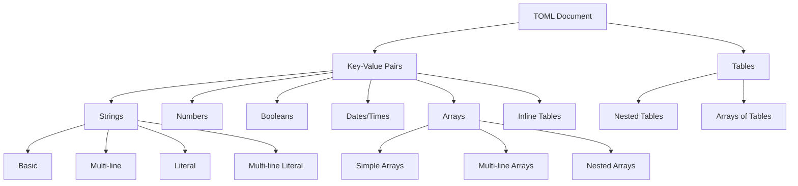

## Introduction to TOML

TOML (Tom's Obvious Minimal Language) is a configuration file format created in 2013 by Tom Preston-Werner, co-founder of GitHub. It was designed specifically to be human-readable while unambiguously mapping to data structures in programming languages.

TOML solves common configuration problems with several key advantages. Its clear syntax makes it easy to understand at a glance, and unlike INI files, it provides strong typing of values. Unlike JSON, TOML offers built-in support for comments, and it avoids the complex indentation rules that can make YAML challenging. The format also reduces visual noise by requiring fewer quotes, brackets, and commas than JSON.

These benefits have led to TOML's widespread adoption in many tools, particularly in the Python ecosystem where it's used by Poetry, Black, pytest, and for package distribution via `pyproject.toml`.

## TOML Syntax Fundamentals

At its core, TOML consists of simple key-value pairs that form the building blocks of your configuration:

```toml
# This is a basic TOML file
name = "My Project"
version = "1.0.0"
description = "An example project"
```

Keys can be bare (unquoted) or quoted, giving you flexibility when naming your configuration properties:

```toml
# Bare keys (recommended for simple keys)
simple_key = "value"
simple-dash-key = "value"

# Quoted keys (for special characters or spaces)
"quoted.key" = "value"
"key with spaces" = "value"
```

Comments in TOML start with the hash symbol (`#`), making it easy to document your configuration:

```toml
# This is a full-line comment
key = "value"  # This is an inline comment
```

## TOML Data Types

TOML supports a rich set of data types to accurately represent your configuration values.

### Strings

TOML offers four string formats to handle different scenarios:

1. **Basic strings** use double quotes and support escape sequences:

```toml
basic = "Hello, world!"
escaped = "Line 1\nLine 2"  # Supports escaping
```

2. **Multi-line basic strings** use triple double quotes for text that spans multiple lines:

```toml
multiline = """
This string
spans multiple
lines.
"""

# Backslashes at line end trim whitespace
trimmed = """\
    This is trimmed \
    to avoid unwanted \
    whitespace.
    """
```

3. **Literal strings** use single quotes and don't process escape sequences:

```toml
literal = 'C:\Users\path\to\file.txt'  # No escaping
```

4. **Multi-line literal strings** combine the benefits of literal strings with multi-line support:

```toml
multiline_literal = '''
No escaping
needed for \n
or anything else.
'''
```

### Numbers, Booleans, and Dates

TOML supports various numeric formats to precisely represent your data:

```toml
# Integers
integer = 42
big_integer = 1_000_000  # Underscores for readability
hex = 0xFF              # Hexadecimal
octal = 0o77           # Octal
binary = 0b1010        # Binary

# Floats
float = 3.14159
scientific = 6.022e23
```

Boolean values are straightforward with `true` and `false`:

```toml
enabled = true
debug = false
```

TOML also provides comprehensive support for dates and times in various formats:

```toml
# Full date-time with timezone (RFC 3339)
datetime = 2023-05-04T12:30:45Z
datetime_with_offset = 2023-05-04T12:30:45-07:00

# Local date-time (no timezone)
local_datetime = 2023-05-04T12:30:45

# Local date (only date)
date = 2023-05-04

# Local time (only time)
time = 12:30:45
```

## Structuring Data in TOML

As your configuration grows more complex, TOML provides powerful ways to organize related data.

### Tables

Tables function similarly to dictionaries or objects in programming languages:

```toml
[server]
host = "localhost"
port = 8080
```

You can nest tables to create hierarchical configurations using dot notation:

```toml
[database]
host = "localhost"
port = 5432

[database.credentials]  # This is a nested table
username = "admin"
password = "secret"
```

For compact representation of smaller tables, you can use inline tables:

```toml
server = { host = "localhost", port = 8080 }
```

### Arrays

TOML supports arrays for storing ordered collections of values:

```toml
colors = ["red", "green", "blue"]
numbers = [1, 2, 3, 4, 5]
nested = [[1, 2], [3, 4, 5]]
mixed = [1, "two", 3.0, true]
```

For better readability, arrays can span multiple lines:

```toml
numbers = [
    1,
    2,
    3,
]  # Trailing comma is allowed
```

When you need to represent a collection of similar objects, arrays of tables provide an elegant solution:

```toml
[[players]]
name = "Alice"
score = 10

[[players]]
name = "Bob"
score = 8
```

This creates an array containing two table elements, making it perfect for configuration that needs to represent multiple similar items.

## TOML Structure Visualization

The following diagram shows how different TOML elements relate to each other:



## Using TOML in Python

Now that you understand TOML's structure, let's explore how to work with TOML files in Python.

### Prerequisites

To work with TOML in Python, you'll need one of these libraries:

- Python 3.11+: Built-in `tomllib` (read-only)
- Earlier versions: Third-party packages like `tomli` (read-only) and `tomli-w` (write)
- Full read/write support: `tomlkit`

Installing these packages is straightforward:

```bash
# For Python < 3.11 (read-only)
pip install tomli

# For writing TOML (Python < 3.11)
pip install tomli-w

# Full read/write support with preserved formatting
pip install tomlkit
```

### Reading TOML Files

Using Python 3.11's built-in module makes reading TOML files simple:

```python
# Reading TOML in Python 3.11+
import tomllib

with open("config.toml", "rb") as f:  # Note: must open in binary mode
    config = tomllib.load(f)

# Access values
print(config["server"]["host"])  # Output: localhost
print(config["players"][0]["name"])  # Output: Alice
```

For Python versions before 3.11, you can use the third-party `tomli` package with identical syntax:

```python
# For Python versions before 3.11
import tomli

with open("config.toml", "rb") as f:
    config = tomli.load(f)
```

### Writing TOML Files

While Python 3.11's `tomllib` is read-only, you can use `tomli-w` for writing TOML in earlier versions:

```python
# Writing TOML (Python < 3.11)
import tomli_w

config = {
    "server": {
        "host": "localhost",
        "port": 8080
    },
    "database": {
        "enabled": True,
        "credentials": {
            "username": "admin",
            "password": "secret"
        }
    }
}

with open("config.toml", "wb") as f:
    tomli_w.dump(config, f)
# Output file will contain properly formatted TOML
```

For more control over formatting and comments, `tomlkit` offers a richer API:

```python
# Using tomlkit for better control
import tomlkit

document = tomlkit.document()
document.add("title", "TOML Example")

# Add a comment
document.add(tomlkit.comment("Server configuration"))

server = tomlkit.table()
server.add("host", "localhost")
server.add("port", 8080)
document.add("server", server)

with open("config.toml", "w") as f:
    f.write(tomlkit.dumps(document))
# Output preserves comments and formatting
```

## Real-World Example: Python Project Configuration

Let's see how TOML is used in the real world with a `pyproject.toml` example:

```toml
[build-system]
requires = ["setuptools>=42", "wheel"]
build-backend = "setuptools.build_meta"

[project]
name = "myproject"
version = "1.0.0"
description = "An example Python project"
authors = [
    {name = "Your Name", email = "your.email@example.com"}
]
dependencies = [
    "requests>=2.28.0",
    "pandas>=1.5.0",
]
requires-python = ">=3.8"

[project.optional-dependencies]
dev = [
    "pytest>=7.0.0",
    "black>=23.0.0",
]

[tool.black]
line-length = 88
target-version = ["py38", "py39", "py310"]

[tool.pytest]
testpaths = ["tests"]
python_files = "test_*.py"
```

This example demonstrates how TOML organizes project metadata, dependencies, and tool-specific configurations in a clear, hierarchical structure.

## Best Practices

To get the most out of TOML, follow these best practices:

1. **Use meaningful key names** that clearly describe the purpose of each configuration element
2. **Group related information in tables** to create a logical organization of your settings
3. **Add comments to clarify intent** for complex configurations or non-obvious settings
4. **Be consistent with formatting** throughout your TOML files to maintain readability
5. **Consider human readability first** by structuring complex data in an approachable way
6. **Use arrays of tables for collections** when you need to represent multiple similar items
7. **Stick to bare keys** when possible, reserving quoted keys for special situations
8. **Keep your TOML files organized** with a natural progression from general to specific settings

## The Last 15%: Advanced Topics

While this crash course covers the essential 85% of TOML, here are the advanced topics you might want to explore next:

1. **TOML Specification Details**:

   - The complete TOML specification at [toml.io](https://toml.io)
   - Edge cases and implementation-specific behaviors

2. **Language-Specific Implementations**:

   - TOML parsers in Go, Rust, JavaScript, and other languages
   - Behavioral differences between implementations

3. **Advanced TOML Usage Patterns**:

   - Schema validation for TOML files
   - Merging multiple TOML files
   - Configuration inheritance patterns

4. **Configuration Management Integration**:

   - Environment variable substitution
   - Configuration overlays and profiles
   - Handling secrets securely in TOML files

5. **Performance Considerations**:
   - Parsing efficiency for large TOML files
   - Memory usage optimization

## Conclusion

TOML provides a clear, minimal approach to configuration that strikes an excellent balance between human readability and machine parsability. Its straightforward syntax and strong typing make it an ideal choice for configuration files across a wide range of projects.

This crash course has equipped you with the essential TOML knowledge you'll use daily, while pointing you toward the remaining advanced topics for deeper exploration. With this foundation, you can confidently read, write, and work with TOML files in your projects, knowing you have the skills to handle 85% of common TOML scenarios.
