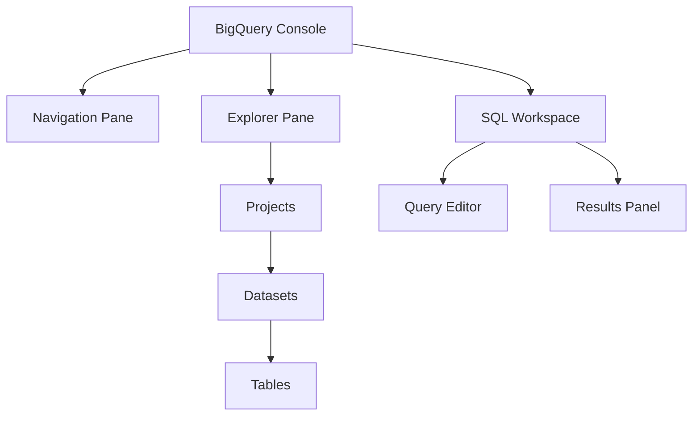
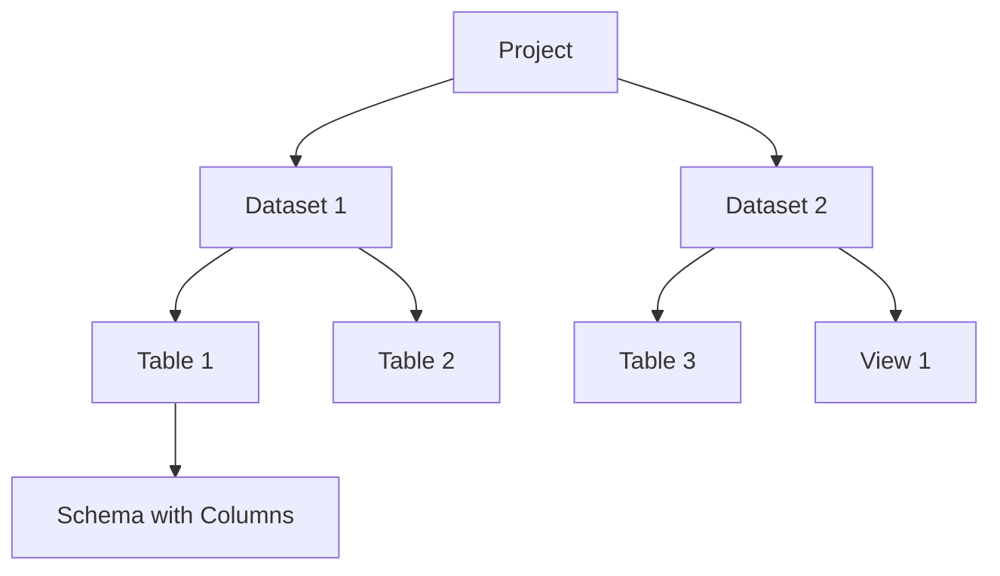

## Introduction: What is BigQuery?

Google BigQuery is a fully managed, serverless data warehouse that enables analyzing massive datasets quickly and efficiently. It separates compute and storage layers, allowing each to scale independently for optimal performance. This architecture means you don't need to provision or manage infrastructure - you simply focus on analyzing your data.

Key features:

- Serverless architecture (no infrastructure to manage)
- Standard SQL support
- Built-in machine learning capabilities
- Seamless integration with Google Cloud ecosystem
- Support for open table formats (Apache Iceberg, Delta, Hudi)

To get started with BigQuery, you'll need to understand a few basics and set up your environment properly.

## Prerequisites

Before diving into BigQuery, you'll need:

- A Google account
- Access to Google Cloud Platform (GCP)
- Basic understanding of SQL (for querying data)

With these requirements in place, let's move on to setting up your environment.

## Getting Started: Setting Up Your Environment

1. **Create a Google Cloud Project**
   Go to the [Google Cloud Console](https://console.cloud.google.com/), click on "Select a project" at the top of the page, then click "New Project". Give your project a name and click "Create".

2. **Enable BigQuery API**
   In most cases, it's enabled by default for new projects. If not, navigate to "APIs & Services" > "Library" and search for "BigQuery API" to enable it.

3. **Access BigQuery Console**
   From the Google Cloud Console navigation menu, select "BigQuery" to open the BigQuery console.

Once you've accessed the console, you'll want to familiarize yourself with its interface to navigate efficiently.

## Understanding the BigQuery Interface

The BigQuery console has three main components that work together to help you manage and analyze your data:



- **Navigation Pane**: Used to navigate between different Google Cloud services
- **Explorer Pane**: Lists your projects, datasets, and tables in a hierarchical structure
- **SQL Workspace**: Where you write and run SQL queries, and view results

Understanding this interface is essential as it reflects BigQuery's underlying resource model, which determines how your data is organized and accessed.

## BigQuery Resource Model

BigQuery organizes data in a hierarchical structure that helps you manage access and organize related information logically:



1. **Projects**: The root container for all BigQuery resources. Controls billing, user access, and privileges.

2. **Datasets**: Collections of related tables or views. Datasets define the location of data (multi-regional or regional) and allow access control at the dataset level.

3. **Tables**: Collections of rows and columns stored in managed storage, defined by a schema with strongly typed columns.

4. **Views**: Virtual tables defined by SQL queries.

5. **Jobs**: Actions run by BigQuery on your behalf, such as loading data, exporting data, or querying data.

Now that you understand how BigQuery organizes data, let's explore how to work with that data effectively.

## Working with Data in BigQuery

The first step in analyzing data is getting it into BigQuery and structuring it properly. Let's look at how to create datasets and tables, load data, and run queries.

### Creating Datasets and Tables

**To create a dataset:**

```sql
-- Creating a new dataset
CREATE SCHEMA IF NOT EXISTS `project_id.new_dataset`;
```

**To create a table:**

```sql
-- Creating a new table with a defined schema
CREATE TABLE IF NOT EXISTS `project_id.dataset_id.new_table` (
  user_id STRING,
  event_date DATE,
  product_id STRING,
  price NUMERIC
);
```

Once you've created your table structure, you'll need to populate it with data.

### Loading Data into BigQuery

There are several ways to load data, depending on your source and requirements:

1. **Batch Loading from files:**

```sql
-- Loading data from a CSV file in Google Cloud Storage
LOAD DATA INTO `project_id.dataset_id.table_id`
FROM FILES(
  format='CSV',
  uris=['gs://bucket/path/to/file.csv'],
  skip_leading_rows=1
);
```

2. **Creating a table from query results:**

```sql
-- Creating a table from query results
CREATE OR REPLACE TABLE `project_id.dataset_id.new_table` AS
SELECT * FROM `project_id.dataset_id.source_table`
WHERE condition;
```

3. **Inserting data directly:**

```sql
-- Inserting rows directly into a table
INSERT INTO `project_id.dataset_id.table_id` (column1, column2)
VALUES ('value1', 'value2'),
       ('value3', 'value4');
```

With data loaded into your tables, you can now begin querying and analyzing it.

### Writing Basic Queries

BigQuery uses standard SQL syntax, making it accessible to anyone familiar with SQL. Here's a simple query example:

```sql
-- Basic query with filtering, grouping, and ordering
SELECT
  product_category,
  COUNT(*) as product_count,
  AVG(price) as avg_price
FROM
  `project_id.dataset_id.products`
WHERE
  price > 10.00
GROUP BY
  product_category
ORDER BY
  product_count DESC
LIMIT 10;
```

This query:

1. Selects product categories along with count and average price
2. Filters for products priced above $10
3. Groups results by product category
4. Orders results by product count in descending order
5. Limits results to 10 rows

As you become comfortable with basic queries, you'll want to optimize them for better performance and cost-efficiency.

## Query Optimization and Best Practices

BigQuery's pricing model is based on the amount of data processed by your queries, so optimizing your queries not only improves performance but also reduces costs.

### Cost-Effective Querying

Here are key strategies to minimize costs:

1. **Select Specific Columns**: Avoid `SELECT *` when you only need specific columns

```sql
-- Instead of this (processes all columns):
SELECT * FROM `dataset.table`;

-- Do this (processes only needed columns):
SELECT id, name, date FROM `dataset.table`;
```

2. **Use Partitioned Tables**: Divide large tables into smaller segments based on a column value

```sql
-- Create a partitioned table by date
CREATE TABLE `dataset.partitioned_table`
PARTITION BY DATE(timestamp_column)
AS SELECT * FROM `dataset.source_table`;

-- Query that benefits from partitioning (only scans relevant partitions)
SELECT * FROM `dataset.partitioned_table`
WHERE DATE(timestamp_column) BETWEEN '2023-01-01' AND '2023-01-31';
```

3. **Use Clustered Tables**: Order data based on column contents to improve query performance

```sql
-- Create a clustered table
CREATE TABLE `dataset.clustered_table`
PARTITION BY DATE(timestamp_column)
CLUSTER BY user_id, product_id
AS SELECT * FROM `dataset.source_table`;
```

4. **Filter Early**: Apply filtering criteria as early as possible in your queries to reduce the amount of data processed

Beyond cost considerations, you'll also want to optimize for performance.

### Performance Optimization

To improve query performance:

1. **Denormalize When Necessary**: Unlike traditional databases, BigQuery often performs better with denormalized data because it reduces the need for complex joins

2. **Use Materialized Views**: Pre-compute and store query results for frequently accessed data patterns

```sql
-- Create a materialized view
CREATE MATERIALIZED VIEW `dataset.materialized_view` AS
SELECT
  date,
  product_id,
  COUNT(*) as view_count
FROM `dataset.product_views`
GROUP BY date, product_id;
```

3. **Optimize JOIN Operations**: Place the largest table first in JOIN operations and use appropriate join conditions to minimize the data that needs to be processed

While BigQuery is powerful on its own, its value is enhanced when integrated with other tools in your data ecosystem.

## Integration with Other Tools

BigQuery works well with a variety of visualization, analysis, and processing tools to create a complete data workflow.

### Visualization with Looker Studio

BigQuery integrates seamlessly with Looker Studio (formerly Data Studio):

1. In your BigQuery query results, click "Explore Data" and select "Explore with Looker Studio"
2. A new Looker Studio report opens with your data connected
3. Use Looker Studio's interface to create charts, graphs, and dashboards

For more programmatic data analysis, Python integration is often essential.

### Using with Python and Pandas

```python
# Install required libraries
# pip install google-cloud-bigquery pandas pyarrow

from google.cloud import bigquery
import pandas as pd

# Initialize the BigQuery client
# Note: This assumes you have set up authentication via
# gcloud CLI or environment variables
client = bigquery.Client()

# Define your SQL query
query = """
SELECT product_id, name, price
FROM `project_id.dataset_id.products`
WHERE price > 100
LIMIT 1000
"""

# Execute the query and convert to a Pandas DataFrame
df = client.query(query).to_dataframe()

# Now you can use pandas functions
print(df.head())  # Display first 5 rows
print(df.describe())  # Display summary statistics
```

To solidify your understanding, let's walk through a practical example that brings together the concepts we've covered.

## Practical Example: E-commerce Data Analysis

Let's create a sample e-commerce dataset and run some analyses to demonstrate BigQuery in action:

```sql
-- Create dataset
CREATE SCHEMA IF NOT EXISTS `ecommerce`;

-- Create customers table
CREATE OR REPLACE TABLE `ecommerce.customers` (
  customer_id STRING NOT NULL,
  name STRING,
  email STRING,
  registration_date DATE,
  last_login TIMESTAMP
);

-- Insert sample data
INSERT INTO `ecommerce.customers`
VALUES
  ('C001', 'John Doe', 'john@example.com', '2023-01-15', '2023-04-01 14:32:15'),
  ('C002', 'Jane Smith', 'jane@example.com', '2023-02-20', '2023-04-02 09:45:22'),
  ('C003', 'Alex Johnson', 'alex@example.com', '2023-03-05', '2023-04-01 18:12:45');

-- Create products table
CREATE OR REPLACE TABLE `ecommerce.products` (
  product_id STRING NOT NULL,
  name STRING,
  category STRING,
  price NUMERIC,
  inventory INT64
);

-- Insert sample data
INSERT INTO `ecommerce.products`
VALUES
  ('P001', 'Laptop', 'Electronics', 999.99, 50),
  ('P002', 'Smartphone', 'Electronics', 699.99, 100),
  ('P003', 'Headphones', 'Accessories', 149.99, 200);

-- Create orders table
CREATE OR REPLACE TABLE `ecommerce.orders` (
  order_id STRING NOT NULL,
  customer_id STRING,
  order_date DATE,
  total_amount NUMERIC
);

-- Insert sample data
INSERT INTO `ecommerce.orders`
VALUES
  ('O001', 'C001', '2023-03-10', 1149.98),
  ('O002', 'C002', '2023-03-15', 699.99),
  ('O003', 'C003', '2023-03-20', 849.98),
  ('O004', 'C001', '2023-03-25', 149.99);

-- Create order_items table to track which products were in each order
CREATE OR REPLACE TABLE `ecommerce.order_items` (
  order_id STRING NOT NULL,
  product_id STRING NOT NULL,
  quantity INT64,
  unit_price NUMERIC
);

-- Insert sample data
INSERT INTO `ecommerce.order_items`
VALUES
  ('O001', 'P001', 1, 999.99),
  ('O001', 'P003', 1, 149.99),
  ('O002', 'P002', 1, 699.99),
  ('O003', 'P002', 1, 699.99),
  ('O003', 'P003', 1, 149.99),
  ('O004', 'P003', 1, 149.99);
```

With our sample data in place, we can now run some meaningful analyses:

### Example Queries for Analysis

**1. Customer Purchase Analysis:**

```sql
-- Find total spend by customer
SELECT
  c.customer_id,
  c.name,
  COUNT(DISTINCT o.order_id) AS order_count,
  SUM(o.total_amount) AS total_spend
FROM
  `ecommerce.customers` c
JOIN
  `ecommerce.orders` o ON c.customer_id = o.customer_id
GROUP BY
  c.customer_id, c.name
ORDER BY
  total_spend DESC;

-- Result:
-- customer_id | name          | order_count | total_spend
-- C001        | John Doe      | 2           | 1299.97
-- C003        | Alex Johnson  | 1           | 849.98
-- C002        | Jane Smith    | 1           | 699.99
```

**2. Product Category Performance:**

```sql
-- Analyze product category performance
SELECT
  p.category,
  COUNT(DISTINCT oi.order_id) AS order_count,
  SUM(oi.quantity) AS units_sold,
  SUM(oi.quantity * oi.unit_price) AS total_revenue
FROM
  `ecommerce.products` p
JOIN
  `ecommerce.order_items` oi ON p.product_id = oi.product_id
GROUP BY
  p.category
ORDER BY
  total_revenue DESC;

-- Result:
-- category     | order_count | units_sold | total_revenue
-- Electronics  | 3           | 3          | 2399.97
-- Accessories  | 3           | 3          | 449.97
```

**3. Customer Purchase Timeline:**

```sql
-- Visualize customer purchase timeline
SELECT
  o.order_date,
  COUNT(DISTINCT o.order_id) AS daily_orders,
  SUM(o.total_amount) AS daily_revenue
FROM
  `ecommerce.orders` o
GROUP BY
  o.order_date
ORDER BY
  o.order_date;

-- Result:
-- order_date | daily_orders | daily_revenue
-- 2023-03-10 | 1            | 1149.98
-- 2023-03-15 | 1            | 699.99
-- 2023-03-20 | 1            | 849.98
-- 2023-03-25 | 1            | 149.99
```

Now that you've mastered the core concepts of BigQuery, let's explore what else is out there for your continued learning journey.

## The Last 15%: Advanced Topics to Explore

You've now learned the fundamentals of BigQuery that cover about 85% of daily usage. The remaining 15% consists of more advanced techniques that you can explore as your needs grow:

### 1. BigQuery ML (Machine Learning)

BigQuery ML allows you to create and execute machine learning models using standard SQL:

- Create models for classification, regression, forecasting, and clustering
- Train models on large datasets without moving data
- Make predictions directly within BigQuery

Example to explore:

```sql
-- Create a simple linear regression model
CREATE OR REPLACE MODEL `ecommerce.price_prediction_model`
OPTIONS(model_type='linear_reg') AS
SELECT
  category,
  inventory,
  price AS label
FROM
  `ecommerce.products`;

-- Make predictions using the model
SELECT
  *
FROM
  ML.PREDICT(MODEL `ecommerce.price_prediction_model`,
    (SELECT category, inventory FROM `ecommerce.products`));
```

### 2. Advanced Data Processing

- **Window Functions**: For complex analytical calculations

```sql
-- Example of window functions
SELECT
  product_id,
  order_date,
  quantity,
  SUM(quantity) OVER(PARTITION BY product_id ORDER BY order_date) AS running_total
FROM `dataset.sales`;
```

- **User-Defined Functions (UDFs)**: Create custom functions in SQL or JavaScript
- **BigQuery Scripting**: Write procedural SQL with variables and loops
- **Geospatial Analysis**: Work with geographic data types and functions

### 3. Data Governance and Security

- **Row-Level Security**: Control access to specific rows based on user attributes
- **Column-Level Security**: Restrict access to sensitive columns
- **Dynamic Data Masking**: Hide sensitive data without changing the underlying data
- **Access Control**: Fine-grained permission management for datasets and tables

### 4. Advanced Data Integration

- **BigQuery Data Transfer Service**: Automated data imports from various sources
- **Streaming Data Ingestion**: Real-time data processing with the Storage Write API
- **Connecting to External Data Sources**: Query data directly from external storage
- **BigQuery Omni**: Query data across multiple cloud platforms

### 5. Advanced Cost and Performance Optimization

- **Capacity Commitments**: Purchase committed slots for predictable workloads
- **Reservation Management**: Allocate resources across teams and projects
- **Query Plan Optimization**: Advanced techniques for improving query performance

## Conclusion

This crash course has covered the essential aspects of BigQuery that you'll encounter in your daily work. You now understand BigQuery's architecture, know how to set up your environment, manage data, write efficient queries, and integrate with other tools. This foundation gives you everything you need to start using BigQuery effectively for your data analytics needs.

As your experience grows, you can gradually explore the advanced topics in the "Last 15%" section to enhance your BigQuery skills. Remember that Google's documentation and training resources are excellent references that can support your continued learning.

By leveraging BigQuery's powerful capabilities, you can analyze vast amounts of data quickly and cost-effectively, unlocking valuable insights that drive better business decisions. The serverless nature of BigQuery means you can focus on what matters most—understanding your data—while Google handles the infrastructure management behind the scenes.
