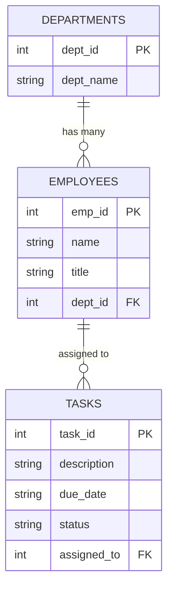
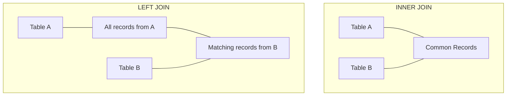
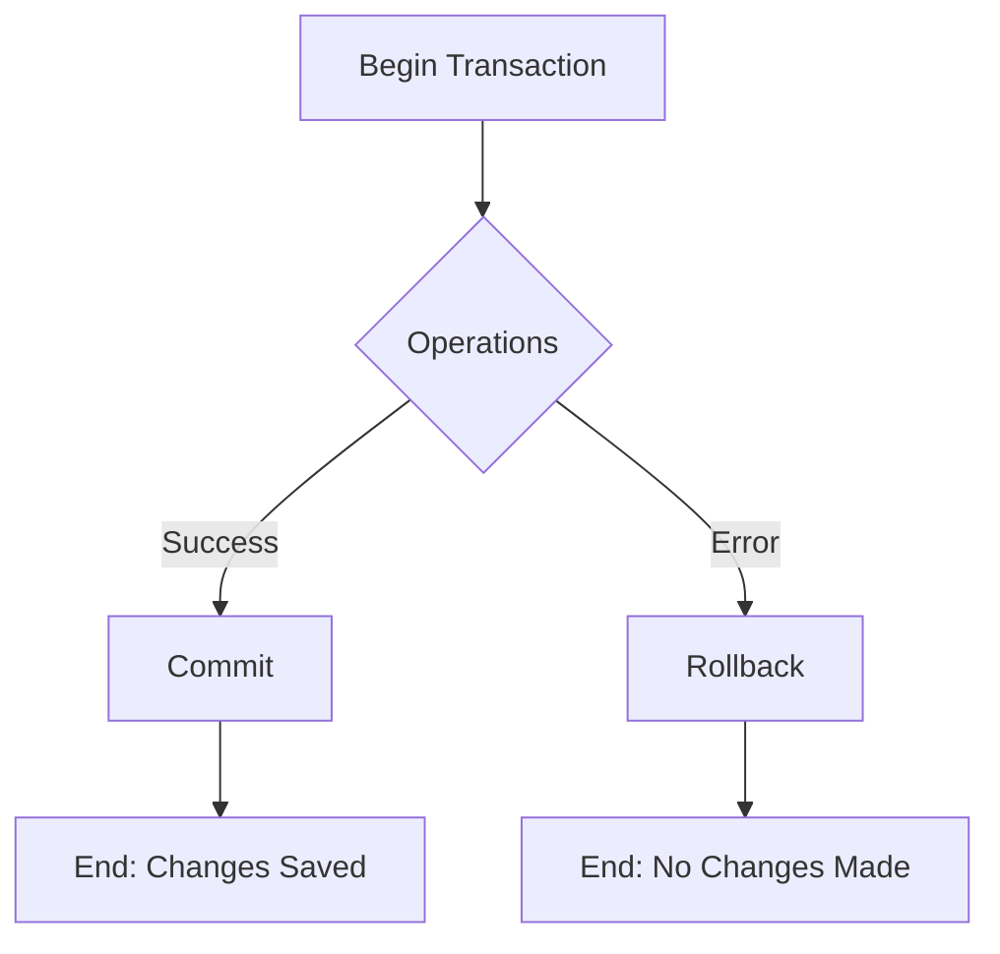

This crash course will equip you with the core knowledge needed for daily SQLite work. By the end, you'll understand 85% of what you'll encounter regularly, with clear pointers to the remaining 15% for self-exploration.

## Introduction to SQLite

SQLite is a lightweight, serverless, self-contained database engine that's embedded directly into applications. Unlike traditional database systems that require separate server processes, SQLite operates as an integrated part of the application itself.

**Key features:**

- Small footprint (< 15MB)
- Zero configuration required
- No separate server process needed
- Cross-platform compatibility
- ACID-compliant (ensures data integrity)
- Open-source and public domain

## Getting Started with SQLite

Before diving into database operations, you'll need to install SQLite and become familiar with its basic interface.

### Installation

SQLite likely comes pre-installed on your system. To check, open your terminal or command prompt and type:

```bash
sqlite3 --version
```

If not installed, follow these platform-specific instructions:

**Windows:**

```bash
# Download from sqlite.org/download.html
# Extract files to a directory
# Add that directory to your PATH environment variable
```

**macOS (using Homebrew):**

```bash
brew install sqlite
```

**Linux:**

```bash
# For Debian/Ubuntu
sudo apt-get install sqlite3

# For RHEL/CentOS
sudo yum install sqlite
```

### Basic Command Line Interface

Once installed, you can start SQLite from the command line by specifying a database file:

```bash
sqlite3 mydatabase.db
# This creates a new database file if it doesn't exist, or opens it if it does
```

After connecting to a database, you can use these helpful CLI commands:

```sql
.help     -- Show help text
.tables   -- List all tables
.schema   -- Show the CREATE statements for tables
.quit     -- Exit SQLite
.mode column   -- Display results in column format
.headers on    -- Show column headers in results
```

## Core Database Concepts

Now that you can access SQLite, let's explore the fundamental database operations you'll use regularly.

### Creating a Database

With SQLite, creating a database is straightforward—you simply connect to a file:

```bash
sqlite3 contacts.db
# Creates or opens the contacts.db file
```

### Creating Tables

After connecting to a database, you'll need to create tables to store your data:

```sql
CREATE TABLE contacts (
    id INTEGER PRIMARY KEY AUTOINCREMENT,
    name TEXT NOT NULL,
    phone TEXT,
    email TEXT
);
-- This creates a contacts table with 4 columns
-- id: Auto-incrementing primary key (unique identifier)
-- name: Required text field (cannot be NULL)
-- phone: Optional text field for phone numbers
-- email: Optional text field for email addresses
```

### Data Types in SQLite

Unlike many database systems, SQLite has a flexible approach to data types. It uses five storage classes:

1. NULL: Null values
2. INTEGER: Signed integers
3. REAL: Floating-point values
4. TEXT: Text strings
5. BLOB: Binary data

SQLite is more flexible about data types than most databases due to its "type affinity" system, which allows for automatic type conversion in many cases.

## Basic CRUD Operations

CRUD (Create, Read, Update, Delete) operations form the foundation of database interactions. Let's explore each operation with practical examples.

### Creating (Inserting) Data

Once you have tables set up, you'll need to add data to them:

```sql
-- Insert a single record
INSERT INTO contacts (name, phone, email)
VALUES ('Jane Doe', '555-1234', 'jane@example.com');
-- Adds one new contact to the database

-- Insert multiple records
INSERT INTO contacts (name, phone, email) VALUES
('John Smith', '555-5678', 'john@example.com'),
('Alice Johnson', '555-9012', 'alice@example.com');
-- Adds two new contacts in one statement
```

### Reading (Querying) Data

Retrieving data is one of the most common operations you'll perform:

```sql
-- Retrieve all records and all columns
SELECT * FROM contacts;
-- Returns all data from the contacts table

-- Retrieve specific columns
SELECT name, email FROM contacts;
-- Returns only the name and email columns

-- Filter records with WHERE clause
SELECT * FROM contacts WHERE name = 'Jane Doe';
-- Returns only records where name matches exactly

-- Sort results
SELECT * FROM contacts ORDER BY name ASC;
-- Returns records sorted alphabetically by name

-- Limit results
SELECT * FROM contacts LIMIT 5;
-- Returns only the first 5 records
```

### Updating Data

As your data changes, you'll need to update existing records:

```sql
-- Update a single record
UPDATE contacts
SET phone = '555-4321'
WHERE name = 'Jane Doe';
-- Changes phone number only for Jane Doe

-- Update multiple records
UPDATE contacts
SET email = 'contact@example.com'
WHERE email IS NULL;
-- Sets a default email for contacts without one
```

### Deleting Data

Sometimes you'll need to remove data from your database:

```sql
-- Delete a specific record
DELETE FROM contacts WHERE id = 1;
-- Removes the contact with id = 1

-- Delete all records that match a condition
DELETE FROM contacts WHERE name LIKE 'John%';
-- Removes all contacts whose names start with "John"

-- Delete all records
DELETE FROM contacts;
-- Empties the contacts table (dangerous!)
```

## Working with SQLite in Python

While the SQLite command line is useful, most applications interact with SQLite through programming languages. Python includes built-in support for SQLite via the `sqlite3` module.

### Connecting to a Database

The first step in working with SQLite in Python is establishing a connection:

```python
import sqlite3

# Connect to a database (creates it if it doesn't exist)
conn = sqlite3.connect('my_database.db')
# Creates a connection object to interact with the database

# Create a cursor object to execute SQL commands
cursor = conn.cursor()
# Cursor is used to run queries and fetch results

# Always close the connection when done
conn.close()
# Prevents resource leaks
```

A better practice is to use Python's context manager, which automatically handles connection closure:

```python
import sqlite3

with sqlite3.connect('my_database.db') as conn:
    cursor = conn.cursor()
    # Your database operations go here
    # No need to close connection - it's handled automatically
    # Connection is committed when the block exits normally
```

### Creating a Table in Python

Creating tables in Python is similar to the SQL approach but embedded in Python code:

```python
import sqlite3

with sqlite3.connect('school.db') as conn:
    cursor = conn.cursor()

    # Create a table
    cursor.execute('''
    CREATE TABLE IF NOT EXISTS students (
        id INTEGER PRIMARY KEY AUTOINCREMENT,
        name TEXT NOT NULL,
        age INTEGER,
        email TEXT
    )
    ''')
    # IF NOT EXISTS prevents errors if table already exists

    print("Table created successfully!")
```

### Inserting Data

Python offers convenient ways to insert data, especially when dealing with variables:

```python
import sqlite3

with sqlite3.connect('school.db') as conn:
    cursor = conn.cursor()

    # Insert a single record using parameterized query
    student_data = ('Jane Doe', 23, 'jane@example.com')
    cursor.execute('''
    INSERT INTO students (name, age, email)
    VALUES (?, ?, ?)
    ''', student_data)
    # ? marks are placeholders, filled by the student_data tuple
    # This prevents SQL injection attacks

    # Insert multiple records
    students = [
        ('John Smith', 21, 'john@example.com'),
        ('Alice Johnson', 22, 'alice@example.com'),
        ('Bob Brown', 20, 'bob@example.com')
    ]
    cursor.executemany('''
    INSERT INTO students (name, age, email)
    VALUES (?, ?, ?)
    ''', students)
    # executemany is more efficient for multiple inserts

    print(f"Records inserted successfully! Last row ID: {cursor.lastrowid}")
```

### Querying Data

Retrieving and working with data in Python is straightforward:

```python
import sqlite3

with sqlite3.connect('school.db') as conn:
    # Set row_factory to get named columns
    conn.row_factory = sqlite3.Row
    cursor = conn.cursor()

    # Query all records
    cursor.execute("SELECT * FROM students")
    all_students = cursor.fetchall()
    # fetchall() returns all matching rows as a list

    print("All Students:")
    for student in all_students:
        # With row_factory, we can access by column name
        print(f"ID: {student['id']}, Name: {student['name']}, Age: {student['age']}")

    # Query a single record
    cursor.execute("SELECT * FROM students WHERE name = ?", ('Jane Doe',))
    jane = cursor.fetchone()
    # fetchone() returns only the first matching row

    if jane:
        print(f"\nJane's Information: ID={jane['id']}, Email={jane['email']}")
    else:
        print("\nJane not found in database")
```

## Complete Database Example

Let's apply what we've learned by creating a practical project management database. This example demonstrates relationships between tables and more complex data structures.

```python
import sqlite3

# Function to set up our database
def setup_database():
    with sqlite3.connect('project_management.db') as conn:
        cursor = conn.cursor()

        # Create departments table
        cursor.execute('''
        CREATE TABLE IF NOT EXISTS departments (
            dept_id INTEGER PRIMARY KEY,
            dept_name TEXT NOT NULL UNIQUE
        )
        ''')

        # Create employees table with foreign key
        cursor.execute('''
        CREATE TABLE IF NOT EXISTS employees (
            emp_id INTEGER PRIMARY KEY,
            name TEXT NOT NULL,
            title TEXT,
            dept_id INTEGER,
            FOREIGN KEY (dept_id) REFERENCES departments(dept_id)
        )
        ''')

        # Create tasks table
        cursor.execute('''
        CREATE TABLE IF NOT EXISTS tasks (
            task_id INTEGER PRIMARY KEY,
            description TEXT NOT NULL,
            due_date TEXT,
            status TEXT DEFAULT 'Not Started',
            assigned_to INTEGER,
            FOREIGN KEY (assigned_to) REFERENCES employees(emp_id)
        )
        ''')

        # Insert sample data for departments
        departments = [
            (1, 'Engineering'),
            (2, 'Marketing'),
            (3, 'Human Resources')
        ]
        cursor.executemany('INSERT OR IGNORE INTO departments VALUES (?, ?)', departments)

        # Insert sample data for employees
        employees = [
            (1, 'John Doe', 'Software Engineer', 1),
            (2, 'Jane Smith', 'Marketing Specialist', 2),
            (3, 'Bob Johnson', 'HR Manager', 3),
            (4, 'Alice Williams', 'Senior Developer', 1)
        ]
        cursor.executemany('INSERT OR IGNORE INTO employees VALUES (?, ?, ?, ?)', employees)

        # Insert sample data for tasks
        tasks = [
            (1, 'Develop login page', '2023-12-31', 'In Progress', 1),
            (2, 'Create marketing campaign', '2023-11-30', 'Not Started', 2),
            (3, 'Review job applications', '2023-11-15', 'Completed', 3),
            (4, 'Fix database issues', '2023-12-15', 'In Progress', 4)
        ]
        cursor.executemany('INSERT OR IGNORE INTO tasks VALUES (?, ?, ?, ?, ?)', tasks)

        print("Database setup completed successfully!")

if __name__ == "__main__":
    setup_database()
```

### Database Schema Visualization

The relationships between our tables can be visualized as follows:



## Advanced Query Techniques

As your database grows, you'll need more sophisticated ways to query and analyze your data.

### Joins

Joins allow you to combine data from multiple related tables:

```sql
-- Inner join: Get employees with their department names
SELECT employees.name, employees.title, departments.dept_name
FROM employees
INNER JOIN departments ON employees.dept_id = departments.dept_id;
-- Only returns employees that have a matching department

-- Left join: Get all employees, even those without departments
SELECT employees.name, employees.title, departments.dept_name
FROM employees
LEFT JOIN departments ON employees.dept_id = departments.dept_id;
-- Returns all employees, with NULL for department if no match
```

Different types of joins serve different purposes, as illustrated below:



### Filtering and Aggregating Data

Beyond basic queries, SQLite provides powerful tools for filtering, grouping, and summarizing data:

```sql
-- Basic WHERE clause with multiple conditions
SELECT * FROM tasks
WHERE status = 'In Progress' AND due_date < '2024-01-01';
-- Finds tasks that are in progress and due before 2024

-- Using pattern matching
SELECT * FROM employees
WHERE name LIKE 'J%';
-- Finds employees whose names start with J

-- Counting records
SELECT status, COUNT(*) AS task_count
FROM tasks
GROUP BY status;
-- Counts the number of tasks in each status category

-- Aggregate functions
SELECT
    departments.dept_name,
    COUNT(employees.emp_id) AS employee_count,
    AVG(CAST(tasks.status = 'Completed' AS INTEGER)) * 100 AS completion_percentage
FROM departments
LEFT JOIN employees ON departments.dept_id = employees.dept_id
LEFT JOIN tasks ON employees.emp_id = tasks.assigned_to
GROUP BY departments.dept_id;
-- Gets employee count and task completion percentage by department
```

## Transactions

When multiple database operations need to succeed or fail as a unit, transactions are essential. They help maintain data integrity and consistency.

```python
import sqlite3

def transfer_funds(from_account, to_account, amount):
    with sqlite3.connect('bank.db') as conn:
        try:
            # Begin transaction
            conn.execute("BEGIN TRANSACTION")

            # Check if from_account has sufficient funds
            cursor = conn.execute("SELECT balance FROM accounts WHERE id = ?", (from_account,))
            from_balance = cursor.fetchone()[0]

            if from_balance < amount:
                raise Exception("Insufficient funds")

            # Deduct from from_account
            conn.execute("UPDATE accounts SET balance = balance - ? WHERE id = ?",
                         (amount, from_account))

            # Add to to_account
            conn.execute("UPDATE accounts SET balance = balance + ? WHERE id = ?",
                         (amount, to_account))

            # Commit the transaction
            conn.execute("COMMIT")
            print(f"Successfully transferred ${amount} from account {from_account} to {to_account}")

        except Exception as e:
            # Roll back in case of error
            conn.execute("ROLLBACK")
            print(f"Transfer failed: {e}")
```

The flow of a transaction can be visualized as follows:



## Performance Optimization

As your database grows, query performance becomes increasingly important. One of the most effective optimization techniques is using indexes.

### Indexes

Indexes improve query speed by creating efficient data structures for searching:

```sql
-- Create an index on a column
CREATE INDEX idx_task_status ON tasks(status);
-- Speeds up queries that filter by task status

-- Create a unique index
CREATE UNIQUE INDEX idx_dept_name ON departments(dept_name);
-- Ensures department names are unique and speeds up lookups

-- Drop an index when no longer needed
DROP INDEX idx_task_status;
-- Removes the index to save space
```

You should consider adding indexes to:

- Columns frequently used in WHERE clauses
- Columns used in JOIN conditions
- Columns used in ORDER BY or GROUP BY

However, indexes come with tradeoffs—they speed up reads but slow down writes and increase database size.

### Practical Query Optimization Example

This example demonstrates the dramatic impact indexes can have on query performance:

```python
import sqlite3
import time

def benchmark_query_with_and_without_index():
    # Create test database with large table
    with sqlite3.connect(':memory:') as conn:
        # Create table and fill with test data
        conn.execute('CREATE TABLE test (id INTEGER PRIMARY KEY, value TEXT)')

        # Insert 100,000 records
        conn.execute('BEGIN TRANSACTION')
        for i in range(100000):
            conn.execute('INSERT INTO test VALUES (?, ?)', (i, f'Value-{i}'))
        conn.execute('COMMIT')

        # Query without index
        start_time = time.time()
        conn.execute('SELECT * FROM test WHERE value = ?', ('Value-99999',)).fetchall()
        no_index_time = time.time() - start_time

        # Create index
        conn.execute('CREATE INDEX idx_test_value ON test(value)')

        # Query with index
        start_time = time.time()
        conn.execute('SELECT * FROM test WHERE value = ?', ('Value-99999',)).fetchall()
        with_index_time = time.time() - start_time

        print(f"Query without index: {no_index_time:.6f} seconds")
        print(f"Query with index: {with_index_time:.6f} seconds")
        print(f"Speedup factor: {no_index_time/with_index_time:.2f}x")

# Run the benchmark
benchmark_query_with_and_without_index()
# Output example:
# Query without index: 0.016732 seconds
# Query with index: 0.000331 seconds
# Speedup factor: 50.55x
```

## The Remaining 15%: Advanced Topics for Self-Exploration

Now that you've mastered the essentials of SQLite, here are more advanced topics to explore as your needs evolve:

1. **Full-text search capabilities** - Using the FTS5 extension for efficient text search
2. **JSON support** - Storing and querying JSON data
3. **Window functions** - For advanced analytical queries
4. **Virtual tables** - Creating special-purpose tables with custom behavior
5. **SQLite encryption** - Adding security layers to your database
6. **In-memory databases** - For temporary, high-performance storage
7. **SQLite with ORM frameworks** - Using object-relational mappers like SQLAlchemy
8. **Backup and restore strategies** - Ensuring data durability
9. **Performance optimization for large datasets** - Managing scalability
10. **SQLite in mobile development** - Implementation in Android and iOS
11. **Concurrency and locking** - Handling multiple connections
12. **Database migration strategies** - Evolving schemas over time
13. **Using SQLite with other programming languages** - Beyond Python
14. **Spatial data extensions** - Working with geographical data
15. **Custom collations and functions** - Extending SQLite capabilities

## Resources for Further Learning

To deepen your knowledge of SQLite, consider these valuable resources:

- Official SQLite documentation: [sqlite.org/docs.html](https://sqlite.org/docs.html)
- SQLite Tutorial: [sqlitetutorial.net](https://www.sqlitetutorial.net)
- Python SQLite documentation: [docs.python.org/3/library/sqlite3.html](https://docs.python.org/3/library/sqlite3.html)

## Conclusion

This crash course has covered the essential knowledge needed for daily work with SQLite. You've learned about creating and managing databases, performing CRUD operations, using Python with SQLite, creating relationships between tables, optimizing performance, and handling transactions.

With this foundation, you should be able to implement SQLite effectively in your applications while knowing what advanced topics to explore when specific needs arise. The lightweight, reliable nature of SQLite makes it an excellent choice for many applications, from mobile apps to desktop software and beyond.
