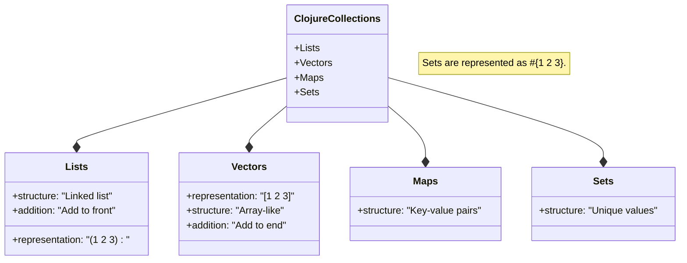
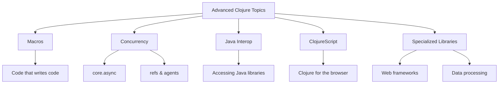

# Clojure Crash Course: The Essential 85%

Clojure is a dynamic, functional programming language created by Rich Hickey that runs on the Java Virtual Machine (JVM). This crash course will equip you with the core concepts and skills to be productive with Clojure on a daily basis, while giving you the foundation to explore more advanced topics independently.

## Introduction: Why Clojure?

Clojure stands out with four key strengths that make it particularly powerful for modern programming challenges:

1. **Functional programming** with emphasis on immutability, which helps create predictable code
2. **Concurrency support** built-in for multi-core processing, making it easier to write parallel programs
3. **LISP heritage** providing powerful metaprogramming capabilities that let you extend the language
4. **Java interoperability** through the JVM, giving you access to thousands of existing libraries

Companies like Walmart, Netflix, and Cisco use Clojure to handle large-scale data processing. Interestingly, Clojure developers are among the highest-paid programmers (fifth place according to the 2023 Stack Overflow Developer Survey).

## Getting Started: Installation and Setup

Before diving into code, let's get everything set up properly.

### Prerequisites

You'll need Java (version 11 or higher) installed as Clojure runs on the JVM:

```bash
# Check if Java is installed
java --version
```

### Installing Clojure CLI

The Clojure CLI is the recommended way to work with Clojure, as it provides tools for running code, managing dependencies, and building projects.

For macOS:

```bash
# Using Homebrew
brew install clojure/tools/clojure
```

For Linux:

```bash
curl -O https://download.clojure.org/install/linux-install-1.11.1.1208.sh
chmod +x linux-install-1.11.1.1208.sh
sudo ./linux-install-1.11.1.1208.sh
```

For Windows:

```bash
# If using WSL2, follow Linux instructions
# For PowerShell, use the MSI installer from clojure.org
```

### Editor Setup

While you could write Clojure in any text editor, having proper tooling significantly improves the experience. For beginners, VS Code with the Calva extension provides an excellent balance of simplicity and power:

1. Install VS Code
2. Search for and install the "Calva" extension
3. Open VS Code and you're ready to go

## Interactive Development with the REPL

One of Clojure's greatest strengths is its interactive development style through the REPL (Read-Eval-Print Loop). The REPL allows you to test code instantly and build your program incrementally.

Start it by running:

```bash
clj
```

You should see a prompt like:

```
Clojure 1.12.0
user=>
```

Try these simple examples to get a feel for how it works:

```clojure
user=> (+ 1 1)                  ; Addition
2
user=> (println "Hello, Clojure!")  ; Print to console
Hello, Clojure!
nil
```

Notice how the REPL immediately evaluates expressions and shows the result. This tight feedback loop is central to Clojure development and makes learning much faster.

## Understanding Clojure Syntax

Let's start with the basics of how Clojure code is structured.

### The Sacred Parentheses

Clojure uses prefix notation with parentheses, meaning the function comes first, followed by its arguments:

```clojure
(function arg1 arg2 arg3)  ; General form
(+ 1 2 3)                  ; Evaluates to 6 (adds all numbers)
(str "Hello" " " "World")  ; "Hello World" (concatenates strings)
```

This consistent syntax means there's no need to memorize operator precedence rules—the parentheses make the order of operations explicit.

### Comments

Comments help explain your code and leave notes for yourself and others:

```clojure
; Single-line comment starts with semicolon

#_ (println "This code is ignored")  ; Form-suppressing comment

(comment
  "This is a multi-line comment block"
  (+ 1 2 3))  ; Often used during development
```

The `(comment ...)` form is particularly useful during development as you can quickly evaluate code within it in the REPL.

## Clojure's Building Blocks: Data Types

Before working with collections and functions, let's understand the basic data types that serve as Clojure's building blocks:

```clojure
;; Numbers
42        ; integer
3.14      ; floating-point
1/3       ; ratio (exact fraction, unique to Clojure!)

;; Strings
"Hello"   ; strings use double quotes

;; Characters
\a        ; character literal
\newline  ; special character

;; Booleans and nil
true      ; boolean true
false     ; boolean false
nil       ; null/nil value (similar to null in other languages)

;; Symbols
my-symbol  ; used to reference things

;; Keywords (efficient identifiers, often used as keys)
:name     ; starts with colon
```

Keywords are particularly important in Clojure—they're self-evaluating, efficient for lookups, and commonly used as keys in data structures.

## The Four Pillars: Clojure's Collection Types

Now that we understand the basic types, let's explore Clojure's four primary collection types. All of these collections are immutable by default, meaning once created, they cannot be changed—operations that seem to modify them actually create new collections.



Let's examine each type in detail.

### Lists: The Foundation of Code

Lists are sequential collections primarily used for code (since Clojure code itself is represented as lists):

```clojure
;; Creating lists
'(1 2 3 4)       ; Quote prevents evaluation
(list 1 2 3 4)   ; Function creates a list

;; Adding to a list (returns a new list)
(conj '(2 3 4) 1)  ; => (1 2 3 4) - adds at the beginning!

;; Accessing elements
(first '(1 2 3))   ; => 1
(rest '(1 2 3))    ; => (2 3)
(nth '(1 2 3) 1)   ; => 2 (0-indexed)
```

Notice that `conj` adds to the beginning of a list, which is efficient because lists are implemented as linked lists.

### Vectors: Arrays for Data

Vectors are array-like collections with fast random access, making them the go-to structure for data sequences:

```clojure
;; Creating vectors
[1 2 3 4]        ; Literal syntax with square brackets
(vector 1 2 3 4) ; Function creates a vector

;; Adding to a vector (returns a new vector)
(conj [1 2 3] 4)   ; => [1 2 3 4] - adds at the end!

;; Accessing elements
(get [1 2 3] 0)    ; => 1 (0-indexed)
([1 2 3] 1)        ; => 2 (vectors are functions of their indices)
```

Unlike lists, `conj` adds to the end of vectors, which makes sense for their array-like implementation. Also note that vectors themselves can be used as functions to access their elements!

### Maps: Key-Value Associations

Maps are key-value collections, similar to dictionaries or objects in other languages:

```clojure
;; Creating maps
{:name "Alice" :age 30}           ; Literal syntax with curly braces
(hash-map :name "Alice" :age 30)  ; Function creates a map

;; Accessing values (three ways!)
(get {:name "Alice" :age 30} :name)    ; => "Alice"
({:name "Alice" :age 30} :name)        ; => "Alice" (maps are functions of their keys)
(:name {:name "Alice" :age 30})        ; => "Alice" (keywords are functions too!)

;; Adding or updating (returns a new map)
(assoc {:name "Alice"} :age 30)        ; => {:name "Alice" :age 30}
(update {:age 30} :age inc)            ; => {:age 31} (applies inc function to :age)

;; Working with nested maps
(get-in {:user {:name "Alice"}} [:user :name])  ; => "Alice"
```

The multiple ways to access map values demonstrate Clojure's consistent design: maps act as functions of their keys, and keywords act as functions that look themselves up in a map.

### Sets: Collections of Unique Values

Sets store unique values and are perfect for membership testing:

```clojure
;; Creating sets
#{1 2 3 4}        ; Literal syntax with #{}
(set [1 2 3 4])   ; Function creates a set from another collection

;; Operations
(conj #{1 2 3} 4)   ; => #{1 2 3 4}
(conj #{1 2 3} 1)   ; => #{1 2 3} (no change, 1 already exists)
(contains? #{1 2 3} 2)  ; => true
(disj #{1 2 3} 3)   ; => #{1 2} (removes element)
```

Sets automatically ensure all values are unique, making them ideal for eliminating duplicates or checking if a value exists.

## Defining Values and Functions

Now that we know the data types, let's learn how to define values and functions to work with them.

### Global Values with def

The `def` special form defines top-level values in a namespace:

```clojure
;; Define a global value
(def answer 42)
answer  ; => 42

;; Define with documentation
(def ^:doc greeting
  "A friendly greeting"
  "Hello, World!")
```

Values defined with `def` are global within their namespace and should be used for constants or application state.

### Local Bindings with let

For local values that are scoped to a specific block, use `let`:

```clojure
;; Let creates local bindings
(let [x 1
      y 2
      z (+ x y)]
  (println "Sum:" z)
  (* z 2))  ; => 6 (the last expression is returned)

;; Destructuring (extracting values from collections)
(let [[first second & rest] [1 2 3 4 5]]
  (println "First:" first)     ; => 1
  (println "Second:" second)   ; => 2
  (println "Rest:" rest))      ; => (3 4 5)
```

The destructuring feature shown in the second example is particularly powerful—it lets you extract values from collections in a concise, readable way.

### Functions: The Heart of Functional Programming

Functions are first-class citizens in Clojure, meaning they can be passed around just like any other value:

```clojure
;; Define a function
(defn greet
  "Returns a greeting for the given name."  ; Documentation string
  [name]                                   ; Parameters in vector
  (str "Hello, " name "!"))                ; Function body

(greet "Clojure")  ; => "Hello, Clojure!"

;; Multi-arity functions (different number of arguments)
(defn greet
  "Greets a person or the world."
  ([] (greet "World"))              ; No args version calls 1-arg version
  ([name] (str "Hello, " name "!"))) ; 1-arg version

(greet)          ; => "Hello, World!"
(greet "Alice")  ; => "Hello, Alice!"

;; Anonymous functions (two styles)
(map (fn [x] (* x x)) [1 2 3 4])  ; => (1 4 9 16)
(map #(* % %) [1 2 3 4])          ; => (1 4 9 16) (shorthand syntax with %)
```

The ability to create anonymous functions on the fly (using either `fn` or the `#()` reader macro) is especially useful when working with higher-order functions like `map` and `filter`.

## Functional Programming in Practice

Now let's explore how Clojure's functional programming features work together in practice.

### Immutability: The Foundation of Clarity

In Clojure, values don't change—when you "modify" a collection, you get a new one with the changes applied:

```clojure
(def numbers [1 2 3])
(def more-numbers (conj numbers 4))

numbers       ; => [1 2 3] (original unchanged)
more-numbers  ; => [1 2 3 4] (new vector)
```

This immutability eliminates a whole class of bugs related to unexpected mutations and makes code easier to reason about, especially in concurrent contexts.

### Higher-Order Functions: The Power Tools

Higher-order functions are the workhorses of functional programming, allowing you to express complex operations clearly and concisely:

```clojure
;; map: transform each element
(map inc [1 2 3])  ; => (2 3 4)
;; inc is a function that increments by 1

;; filter: select elements that match a predicate
(filter even? [1 2 3 4 5 6])  ; => (2 4 6)
;; even? returns true for even numbers

;; reduce: combine elements
(reduce + [1 2 3 4])  ; => 10 (1+2+3+4)
;; This starts with 0 and adds each number

;; Function composition
(def add-then-multiply (comp #(* % 2) inc))
(add-then-multiply 3)  ; => 8 ((3+1)*2)
```

These functions allow you to express what you want to accomplish rather than how to do it, leading to more declarative, readable code.

### Threading Macros: Making Code Flow

Threading macros improve readability by eliminating deeply nested function calls:

```clojure
;; Thread-first (->) passes result as first argument
(-> 5
    (+ 3)     ; (+ 5 3) = 8
    (* 2)     ; (* 8 2) = 16
    (- 1))    ; (- 16 1) = 15
; Same as: (- (* (+ 5 3) 2) 1) => 15

;; Thread-last (->>) passes result as last argument
(->> [1 2 3 4 5]
     (filter odd?)          ; (1 3 5)
     (map #(* % %))         ; (1 9 25)
     (reduce +))            ; 35
; Same as: (reduce + (map #(* % %) (filter odd? [1 2 3 4 5]))) => 35
```

These macros transform the code to make it read more like a pipeline of operations, flowing from top to bottom instead of from inside out.

## Building Projects in Clojure

Now that we understand the language fundamentals, let's see how to structure a complete project.

### Project Structure

A minimal Clojure project looks like this:

```
my-project/
├── deps.edn        # Dependencies and configuration
└── src/
    └── my_project/ # Namespace follows directory structure
        └── core.clj # Main namespace file
```

The `deps.edn` file is central to modern Clojure projects, replacing older build tools like Leiningen for many developers.

### deps.edn Configuration

```clojure
{:paths ["src" "resources"]
 :deps {org.clojure/clojure {:mvn/version "1.11.1"}}
 :aliases
 {:test {:extra-paths ["test"]
         :extra-deps {org.clojure/test.check {:mvn/version "1.1.1"}}}
  :run {:main-opts ["-m" "my-project.core"]}}}
```

This configuration specifies source directories, dependencies, and aliases for common tasks like running tests or starting the application.

### Namespaces: Organizing Your Code

Namespaces organize code and prevent naming conflicts:

```clojure
;; In src/my_project/core.clj
(ns my-project.core
  (:require [clojure.string :as str]))  ; Import other namespaces

(defn greet [name]
  (str/upper-case (str "Hello, " name "!")))

(defn -main [& args]  ; Entry point function
  (println (greet (or (first args) "World"))))
```

The namespace structure follows your directory structure, and the `require` form lets you import other namespaces, giving them aliases for convenience.

Run your project with:

```bash
clj -M:run Alice
# => HELLO, ALICE!
```

## Practical Example: Rock-Paper-Scissors Game

Let's tie everything together with a complete example that demonstrates Clojure in action:

```clojure
(ns rock-paper-scissors.core
  (:require [clojure.string :as str]))

;; Define the game rules as data
(def rules {:rock     {:beats :scissors :loses-to :paper}
            :paper    {:beats :rock     :loses-to :scissors}
            :scissors {:beats :paper    :loses-to :rock}})

(def valid-choices (set (keys rules)))  ; Set of valid moves

;; Get computer's random choice
(defn computer-choice []
  (rand-nth (vec valid-choices)))  ; rand-nth needs a vector, not a set

;; Determine the winner based on rules
(defn determine-winner [player computer]
  (cond
    (= player computer)               :tie
    (= computer (get-in rules [player :beats]))    :player
    (= computer (get-in rules [player :loses-to])) :computer))

;; Format a human-readable result message
(defn result-message [player computer result]
  (case result
    :tie       (str "Tie! Both chose " (name player))
    :player    (str "You win! " (name player) " beats " (name computer))
    :computer  (str "You lose! " (name computer) " beats " (name player))))

;; Get valid player choice with validation
(defn get-player-choice []
  (println "Enter your choice (rock, paper, scissors):")
  (let [choice (-> (read-line)           ; Read user input
                   (str/lower-case)      ; Convert to lowercase
                   (keyword))]           ; Convert to keyword
    (if (contains? valid-choices choice) ; Check if valid
      choice
      (do (println "Invalid choice. Try again.")
          (recur)))))  ; Recursively try again

;; Main game function for a single round
(defn play-game []
  (let [player (get-player-choice)
        computer (computer-choice)
        result (determine-winner player computer)]
    (println "You chose:" (name player))
    (println "Computer chose:" (name computer))
    (println (result-message player computer result))))

;; Ask if player wants to play again
(defn play-again? []
  (println "Play again? (y/n)")
  (-> (read-line)
      (str/lower-case)
      (str/starts-with? "y")))

;; Game loop
(defn game-loop []
  (play-game)
  (when (play-again?)  ; If player wants to play again
    (recur)))          ; Recur restarts the current function

;; Entry point
(defn -main [& args]
  (println "Welcome to Rock-Paper-Scissors!")
  (game-loop)
  (println "Thanks for playing!"))
```

This example demonstrates many Clojure principles:

- Representing game rules as data
- Composing small, focused functions
- Using threading macros for readability
- Leveraging recursion for loops
- Applying functional transformations

To run this game:

1. Save this code in `src/rock_paper_scissors/core.clj`
2. Create a `deps.edn` file with basic configuration
3. Run with `clj -M -m rock-paper-scissors.core`

## Managing State with Atoms

While immutability is a core principle in Clojure, sometimes you need values that change over time. For these cases, Clojure provides reference types like atoms:

```clojure
;; Create an atom (a reference to a value that can change)
(def counter (atom 0))

;; Read the current value (deref or @ syntax)
@counter  ; => 0
(deref counter)  ; => 0 (same thing)

;; Update the value atomically
(swap! counter inc)  ; => 1
@counter  ; => 1

;; Set a completely new value
(reset! counter 10)  ; => 10
@counter  ; => 10

;; Example: Game score tracker
(def scores (atom {:player 0 :computer 0}))

(defn update-score [winner]
  (when (#{:player :computer} winner)  ; Check if winner is valid
    (swap! scores update winner inc)))  ; Increment the winner's score

(update-score :player)  ; Update player score
@scores  ; => {:player 1 :computer 0}
```

Atoms provide a controlled way to manage state changes while maintaining thread safety. The `swap!` function ensures that updates happen atomically, preventing race conditions in concurrent code.

## Looking Beyond: The Remaining 15%

Now that you understand the core of Clojure (the 85%), here's what to explore next as your skills grow:



### 1. Macros - Extend the Language Itself

Macros are a powerful feature inherited from Lisp that allow you to transform code at compile time:

```clojure
(defmacro unless [test & body]
  `(if (not ~test) (do ~@body)))

(unless false (println "This will print"))
```

Macros enable you to create new control structures and domain-specific languages tailored to your problems.

### 2. Advanced Concurrency Tools

Beyond atoms, Clojure offers more sophisticated concurrency primitives:

- **Refs** for coordinated, synchronous changes across multiple references
- **Agents** for asynchronous changes that happen off the main thread
- **core.async** for CSP-style channels and processes, similar to Go's goroutines

### 3. Java Interoperability

Clojure's JVM foundation gives you access to the entire Java ecosystem:

```clojure
;; Call Java methods
(.toUpperCase "hello")  ; => "HELLO"

;; Create Java objects
(new java.util.Date)    ; => #inst "2023-..."
(java.util.Date.)       ; => same thing, shorter syntax
```

This interop capability means you're never limited—any Java library can be used from Clojure.

### 4. ClojureScript for Web Development

ClojureScript is Clojure that compiles to JavaScript, letting you use the same language on both server and client:

- **Reagent** - Lightweight React wrapper
- **Re-frame** - Application framework for managing state and effects

### 5. Key Libraries for Common Tasks

The Clojure ecosystem includes many high-quality libraries:

- **Ring/Compojure/Reitit** - Web server & routing
- **next.jdbc** - Database access
- **Spec** - Data specification and validation
- **Component/Mount/Integrant** - System composition and lifecycle

## Conclusion

You now have the knowledge to handle 85% of daily Clojure tasks! As you continue your journey, remember these key principles:

1. Embrace immutability for simpler, more predictable code
2. Think in data transformations rather than step-by-step procedures
3. Use the REPL for exploratory programming and fast feedback
4. Compose small, focused functions to build complex behavior

The Clojure community is known for being helpful and welcoming, so don't hesitate to ask questions on platforms like ClojureVerse when you encounter challenges.

As Rich Hickey (Clojure's creator) wisely said: "If you want everything to be familiar, you'll never learn anything new." Clojure may feel different at first, but that difference brings powerful new ways to solve problems.

Happy coding in Clojure!
