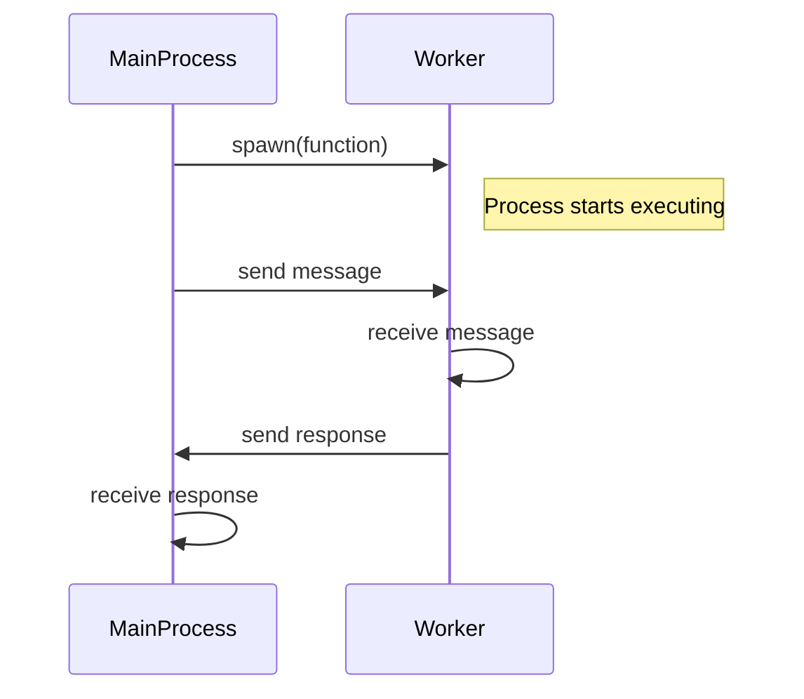
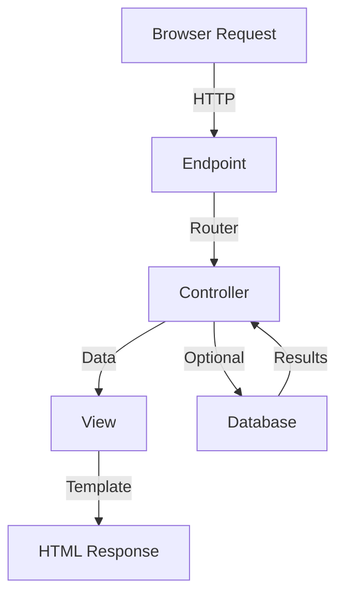
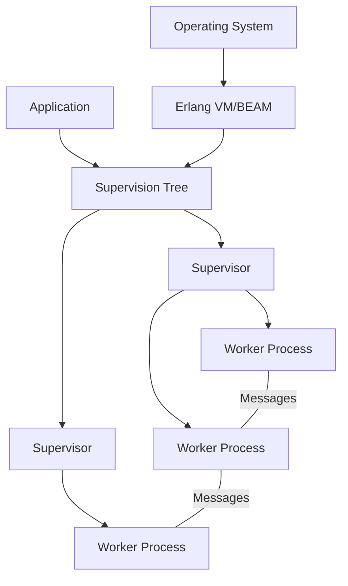

Welcome to your Elixir crash course! This guide will take you through the most important aspects of Elixir that you'll use every day, while building a solid foundation that lets you explore more advanced topics on your own later.

## What is Elixir and Why Should You Care?

Elixir is a functional programming language created by José Valim in 2011. It runs on the Erlang Virtual Machine (BEAM) and inherits Erlang's powerful features for building distributed, fault-tolerant systems. The language combines Erlang's battle-tested reliability with a more approachable, modern syntax that many developers find reminiscent of Ruby.

What makes Elixir special is its combination of powerful features:

- **Scalability**: Elixir can handle millions of concurrent connections efficiently, making it perfect for high-traffic web applications and real-time systems.
- **Fault tolerance**: Elixir systems are designed to be self-healing. When something goes wrong, the system can recover automatically without taking everything down with it.
- **Functional programming**: By treating data as immutable and emphasizing pure functions, Elixir helps you write code that's easier to understand, test, and maintain.
- **Developer happiness**: The syntax is clean and expressive, and the tooling (compiler, formatter, test framework) is excellent out of the box.

## Getting Started with Elixir

Let's begin by setting up Elixir on your system.

### Installation

The installation process varies by operating system:

**For macOS users:**

```bash
brew install elixir
```

**For Ubuntu/Debian Linux users:**

```bash
sudo apt-get update
sudo apt-get install elixir
```

**For Windows users:**

1. Visit [elixir-lang.org](https://elixir-lang.org) and click on the "Install" link
2. Download the Windows installer
3. Run the installer and follow the on-screen instructions

After installation, verify everything is working by opening a terminal and typing:

```bash
elixir -v
```

You should see output showing both the Erlang and Elixir versions installed on your system.

### Setting Up Your Development Environment

For the best development experience, I recommend Visual Studio Code with the ElixirLS extension:

1. Install Visual Studio Code if you don't already have it
2. Open the Extensions panel (Ctrl+Shift+X on Windows/Linux or Cmd+Shift+X on Mac)
3. Search for "ElixirLS" and install it

This will give you helpful features like syntax highlighting, code completion, and inline error checking as you write Elixir code.

## The Interactive Elixir Shell (IEx)

One of the best ways to learn Elixir is by experimenting in its interactive shell, called IEx. Think of it as a playground where you can run Elixir code and see the results immediately.

To start IEx, open a terminal and type:

```bash
iex
```

You'll be greeted with a prompt that looks like `iex(1)>`. Let's try some basic expressions:

```elixir
iex(1)> 2 + 3
5
iex(2)> "hello" <> " world"  # String concatenation
"hello world"
iex(3)> String.upcase("elixir")
"ELIXIR"
```

This interactive environment is perfect for testing small pieces of code and learning how Elixir works. When you're done, you can exit IEx by pressing Ctrl+C twice.

## Understanding Elixir's Basic Data Types

Let's explore the fundamental building blocks of Elixir programs.

### Numbers

Elixir supports integers and floating-point numbers:

```elixir
iex(1)> 42           # integer
42
iex(2)> 3.14         # float
3.14
iex(3)> 1.0e-10      # scientific notation
1.0e-10
iex(4)> 1_000_000    # underscores for readability
1000000
```

All the usual arithmetic operations work as expected: `+`, `-`, `*`, `/`. Integer division is done with `div/2` and remainder with `rem/2`:

```elixir
iex(5)> div(10, 3)  # Integer division
3
iex(6)> rem(10, 3)  # Remainder (modulo)
1
```

### Strings

Strings in Elixir are enclosed in double quotes and are UTF-8 encoded by default:

```elixir
iex(1)> "Hello, world!"
"Hello, world!"
iex(2)> "Hello, " <> "Elixir"  # String concatenation
"Hello, Elixir"
```

You can also use string interpolation to embed expressions inside strings:

```elixir
iex(3)> name = "Elixir"
"Elixir"
iex(4)> "Hello, #{name}!"  # The expression inside #{} is evaluated
"Hello, Elixir!"
```

The `String` module provides many useful functions for working with strings:

```elixir
iex(5)> String.length("Elixir")
6
iex(6)> String.split("hello world", " ")
["hello", "world"]
iex(7)> String.upcase("elixir")
"ELIXIR"
```

### Atoms

Atoms are constants where the name is the value itself. They're similar to symbols in Ruby or enumeration values in other languages:

```elixir
iex(1)> :hello
:hello
iex(2)> :success == :success
true
iex(3)> :success == :failure
false
```

Atoms are commonly used for keys in maps and for expressing constant values in your code. They're particularly useful in pattern matching and when you need a set of well-defined values.

### Booleans and nil

Elixir has `true` and `false` boolean values, and `nil` which represents "nothing" (similar to `null` in other languages):

```elixir
iex(1)> true && false  # Logical AND
false
iex(2)> true || false  # Logical OR
true
iex(3)> !true          # Logical NOT
false
iex(4)> nil            # Represents "nothing"
nil
iex(5)> is_nil(nil)
true
```

## Pattern Matching: Elixir's Secret Weapon

Pattern matching is one of Elixir's most powerful features. At first, it might seem strange if you're coming from other programming languages, but it quickly becomes an essential tool in your Elixir programming toolkit.

In Elixir, the `=` operator is not just for assignment—it's a match operator:

```elixir
iex(1)> x = 1        # This binds the value 1 to variable x
1
iex(2)> 1 = x        # This matches the value of x against 1 (succeeds)
1
iex(3)> 2 = x        # This tries to match x against 2 (fails)
** (MatchError) no match of right hand side value: 1
```

Where pattern matching really shines is in destructuring complex data:

```elixir
iex(1)> {a, b, c} = {:hello, 42, "world"}
{:hello, 42, "world"}
iex(2)> a  # Now a is bound to :hello
:hello
iex(3)> b  # b is bound to 42
42
iex(4)> c  # c is bound to "world"
"world"
```

You can use the underscore (`_`) as a wildcard when you don't care about certain values:

```elixir
iex(5)> {_, age, _} = {:hello, 42, "world"}  # Ignore first and last values
{:hello, 42, "world"}
iex(6)> age
42
```

Pattern matching becomes even more powerful when working with lists:

```elixir
iex(7)> [first, second | rest] = [1, 2, 3, 4, 5]
[1, 2, 3, 4, 5]
iex(8)> first
1
iex(9)> second
2
iex(10)> rest
[3, 4, 5]
```

## Working with Collections

Elixir provides several collection types, each with its own strengths.

### Lists

Lists in Elixir are implemented as linked lists, which makes them efficient for prepending elements and recursively processing from left to right:

```elixir
iex(1)> numbers = [1, 2, 3, 4, 5]
[1, 2, 3, 4, 5]

# Pattern matching with lists
iex(2)> [head | tail] = numbers
[1, 2, 3, 4, 5]
iex(3)> head  # First element
1
iex(4)> tail  # All remaining elements
[2, 3, 4, 5]

# Adding elements
iex(5)> [0 | numbers]  # Prepend (fast operation)
[0, 1, 2, 3, 4, 5]
iex(6)> numbers ++ [6]  # Append (slower for large lists)
[1, 2, 3, 4, 5, 6]

# Basic operations
iex(7)> length(numbers)  # Get list length
5
iex(8)> Enum.at(numbers, 2)  # Get element at index 2 (zero-based)
3
```

Lists can contain elements of different types:

```elixir
iex(9)> mixed = [1, :two, "three", 4.0]
[1, :two, "three", 4.0]
```

### Tuples

Tuples are similar to lists but are stored contiguously in memory. They're good for fixed-size collections where you need fast access to elements by index:

```elixir
iex(1)> person = {"John", 28, :developer}
{"John", 28, :developer}
iex(2)> elem(person, 0)  # Access by index (zero-based)
"John"
iex(3)> elem(person, 1)
28
iex(4)> tuple_size(person)  # Get tuple size
3
iex(5)> put_elem(person, 1, 29)  # Create a new tuple with updated value
{"John", 29, :developer}
```

### Maps

Maps are key-value stores, similar to dictionaries or hash maps in other languages:

```elixir
# Map with string keys
iex(1)> person = %{"name" => "John", "age" => 28, "job" => "developer"}
%{"age" => 28, "job" => "developer", "name" => "John"}
iex(2)> person["name"]  # Access with bracket notation
"John"

# Map with atom keys (more common in Elixir code)
iex(3)> person = %{name: "John", age: 28, job: "developer"}
%{age: 28, job: "developer", name: "John"}
iex(4)> person.name  # Access with dot notation (only works with atom keys)
"John"
iex(5)> Map.get(person, :age)  # Alternative access method
28

# Adding or updating values
iex(6)> Map.put(person, :location, "New York")  # Add a new key-value pair
%{age: 28, job: "developer", location: "New York", name: "John"}
iex(7)> %{person | age: 29}  # Update an existing value
%{age: 29, job: "developer", name: "John"}
```

Remember that in Elixir, all data is immutable. These operations don't modify the original map—they return new maps with the requested changes.

### Structs: Maps with a Schema

Structs are special maps with a defined structure and default values:

```elixir
defmodule Person do
  defstruct name: "", age: 0, job: nil
end

iex(1)> john = %Person{name: "John", age: 28, job: "developer"}
%Person{age: 28, job: "developer", name: "John"}
iex(2)> john.name
"John"
iex(3)> %{john | age: 29}  # Update a field
%Person{age: 29, job: "developer", name: "John"}
```

Structs enforce their structure—you can't add fields that weren't defined in the struct:

```elixir
iex(4)> %Person{name: "John", age: 28, location: "New York"}
** (KeyError) key :location not found
```

## Functions and Modules

In Elixir, code is organized into modules containing functions. Functions are the core building blocks of your programs.

### Creating Modules and Functions

Here's how to define a simple module with some functions:

```elixir
# Save as math.ex
defmodule Math do
  # Regular function definition
  def sum(a, b) do
    a + b
  end

  # One-line function syntax
  def multiply(a, b), do: a * b

  # Private function (only callable within the module)
  defp square(x), do: x * x

  # Function using a private helper
  def sum_of_squares(a, b) do
    square(a) + square(b)
  end
end
```

To use this module, you first need to compile it:

```bash
elixirc math.ex
```

Then you can use it in IEx:

```elixir
iex(1)> Math.sum(2, 3)
5
iex(2)> Math.multiply(4, 5)
20
iex(3)> Math.sum_of_squares(3, 4)
25
iex(4)> Math.square(5)  # This will fail because square is private
** (UndefinedFunctionError) function Math.square/1 is undefined or private
```

### Anonymous Functions

Anonymous functions don't have names and can be assigned to variables:

```elixir
iex(1)> add = fn a, b -> a + b end
#Function<...>
iex(2)> add.(5, 3)  # Note the dot for calling anonymous functions
8

# Shorthand syntax with capture operator
iex(3)> multiply = &(&1 * &2)  # &1, &2 refer to the first and second arguments
#Function<...>
iex(4)> multiply.(4, 5)
20

# Capturing named functions
iex(5)> upcase = &String.upcase/1  # /1 indicates arity (number of arguments)
&String.upcase/1
iex(6)> upcase.("hello")
"HELLO"
```

### Multiple Function Clauses

One of Elixir's most powerful features is the ability to define multiple implementations of a function based on pattern matching:

```elixir
defmodule Factorial do
  def of(0), do: 1
  def of(n) when n > 0, do: n * of(n - 1)
end

iex(1)> Factorial.of(5)
120
```

When you call `Factorial.of(5)`, Elixir tries to match the argument against each function clause in order until it finds a match. This pattern is commonly used for recursion, as shown above, and for handling different input types or cases.

## The Heart of Functional Programming

Now that we've covered the basics, let's explore some of the functional programming concepts that make Elixir special.

### Immutability: Why It Matters

In Elixir, all data is immutable—once created, it cannot be changed. Operations that seem to modify data are actually creating new copies with the requested changes:

```elixir
iex(1)> list = [1, 2, 3]
[1, 2, 3]
iex(2)> new_list = [0 | list]  # Creates a new list with 0 prepended
[0, 1, 2, 3]
iex(3)> list  # The original list remains unchanged
[1, 2, 3]
```

This immutability brings several benefits:

- **Predictability**: Functions with the same input always produce the same output
- **Concurrency safety**: No need to worry about data races or locks
- **Easier reasoning**: You know that data won't change unexpectedly

### The Pipe Operator: Enhancing Readability

The pipe operator (`|>`) passes the result of one function as the first argument to the next function. This allows you to chain operations in a clean, readable way:

```elixir
iex(1)> "elixir is fun"
|> String.upcase()
|> String.split(" ")
["ELIXIR", "IS", "FUN"]
```

Without pipes, the same code would look like this:

```elixir
iex(2)> String.split(String.upcase("elixir is fun"), " ")
["ELIXIR", "IS", "FUN"]
```

As operations get more complex, pipes keep your code readable by showing the transformation steps in a clear, sequential order.

### The Enum Module: Collection Processing

The `Enum` module provides a rich set of functions for working with collections:

```elixir
iex(1)> numbers = [1, 2, 3, 4, 5]
[1, 2, 3, 4, 5]

# Map: transform each element
iex(2)> Enum.map(numbers, fn x -> x * 2 end)
[2, 4, 6, 8, 10]

# Filter: keep elements matching a condition
iex(3)> Enum.filter(numbers, fn x -> rem(x, 2) == 0 end)
[2, 4]

# Reduce: accumulate a result
iex(4)> Enum.reduce(numbers, 0, fn x, acc -> x + acc end)
15  # sum of all elements

# Combined with pipes for a data processing pipeline
iex(5)> numbers
|> Enum.filter(fn x -> rem(x, 2) == 0 end)  # keep even numbers
|> Enum.map(fn x -> x * 2 end)              # double them
|> Enum.sum()                               # sum the results
12
```

This functional approach to collection processing is a cornerstone of Elixir programming.

### List Comprehensions: Concise List Generation

List comprehensions provide a concise way to generate lists based on existing collections:

```elixir
# Generate a list of doubled even numbers from 1 to 10
iex(1)> for x <- 1..10, rem(x, 2) == 0, do: x * 2
[4, 8, 12, 16, 20]

# Comprehensions work with any enumerable, not just ranges
iex(2)> for word <- ["hello", "world", "elixir"], do: String.upcase(word)
["HELLO", "WORLD", "ELIXIR"]
```

## Control Flow in Elixir

Elixir provides several constructs for controlling the flow of your programs.

### Pattern Matching in Function Clauses

We've already seen how pattern matching in function definitions creates elegant control flow:

```elixir
defmodule Greeting do
  def say(:morning), do: "Good morning!"
  def say(:evening), do: "Good evening!"
  def say(_), do: "Hello!"  # Default case
end

iex(1)> Greeting.say(:morning)
"Good morning!"
iex(2)> Greeting.say(:evening)
"Good evening!"
iex(3)> Greeting.say(:afternoon)
"Hello!"
```

### Case: Pattern Matching on Values

The `case` construct lets you pattern match on a value with multiple clauses:

```elixir
iex(1)> grade = 85
85
iex(2)> case grade do
...>   g when g >= 90 -> "A"
...>   g when g >= 80 -> "B"
...>   g when g >= 70 -> "C"
...>   g when g >= 60 -> "D"
...>   _ -> "F"  # Default case
...> end
"B"
```

### Cond: Selecting the First True Condition

The `cond` construct chooses the first clause that evaluates to true:

```elixir
iex(1)> age = 18
18
iex(2)> cond do
...>   age < 13 -> "Child"
...>   age < 18 -> "Teenager"
...>   age < 65 -> "Adult"
...>   true -> "Senior"  # Default case (always matches)
...> end
"Adult"
```

### If and Unless: Simple Conditionals

For simple conditions, Elixir provides `if` and `unless`:

```elixir
iex(1)> if age >= 18 do
...>   "You can vote"
...> else
...>   "You cannot vote yet"
...> end
"You can vote"

iex(2)> unless File.exists?("file.txt") do
...>   "File not found"
...> end
"File not found"
```

## Mix: Your Project Management Tool

Mix is Elixir's build tool for creating, compiling, testing, and managing dependencies for your projects.

### Creating a New Project

To create a new Elixir project, run:

```bash
mix new my_app
cd my_app
```

This creates a directory structure like this:

```
my_app/
├── .formatter.exs     # Formatter configuration
├── .gitignore
├── README.md
├── lib/              # Your application code goes here
│   └── my_app.ex
├── mix.exs           # Project configuration
└── test/             # Test files
    ├── my_app_test.exs
    └── test_helper.exs
```

### Managing Dependencies

To add external libraries to your project, edit the `deps` function in your `mix.exs` file:

```elixir
defp deps do
  [
    {:jason, "~> 1.4"},     # JSON library
    {:httpoison, "~> 2.0"}  # HTTP client
  ]
end
```

Then install the dependencies with:

```bash
mix deps.get
```

### Common Mix Tasks

Mix provides many useful commands for working with your project:

```bash
mix compile        # Compile the project
mix test           # Run tests
mix format         # Format code according to style guide
mix deps.update    # Update dependencies
mix help           # List available tasks
```

### Running Your Application

There are a few ways to run your Elixir application:

```bash
# Start an interactive Elixir shell with your application loaded
iex -S mix

# Run a specific script
mix run my_script.exs
```

## Concurrency: Elixir's Superpower

One of Elixir's most powerful features is its concurrency model, inherited from Erlang. It's based on lightweight processes (not OS processes) that communicate via message passing.

### Spawning Processes

Creating a new process is as simple as calling `spawn/1` with a function:

```elixir
iex(1)> pid = spawn(fn ->
...>   IO.puts("Hello from process #{inspect self()}")
...> end)
Hello from process #PID<0.108.0>
#PID<0.108.0>
```

Elixir processes are extremely lightweight—you can create thousands or even millions of them without significantly impacting system performance.

### Sending and Receiving Messages

Processes communicate by sending and receiving messages:

```elixir
iex(1)> receiver = spawn(fn ->
...>   receive do
...>     {:hello, sender} ->
...>       IO.puts("Got hello from #{inspect sender}")
...>       send(sender, :hello_back)
...>   end
...> end)
#PID<0.109.0>

# Send a message to the receiver process
iex(2)> send(receiver, {:hello, self()})
Got hello from #PID<0.106.0>
{:hello, #PID<0.106.0>}

# Wait to receive a response
iex(3)> receive do
...>   :hello_back -> "They said hello back!"
...> end
"They said hello back!"
```

### Understanding Process Flow

Let's visualize how processes communicate:



### Building a Simple Process Server

Here's a more complete example of a process that maintains state—a simple counter:

```elixir
defmodule Counter do
  # Start the counter process
  def start do
    spawn(fn -> loop(0) end)
  end

  # Client API
  def increment(pid) do
    send(pid, :increment)
  end

  def get_value(pid) do
    send(pid, {:get_value, self()})
    receive do
      {:count, value} -> value
    end
  end

  # Server implementation
  defp loop(count) do
    receive do
      :increment ->
        # Increment and continue with new state
        loop(count + 1)

      {:get_value, from} ->
        # Send current count back to caller
        send(from, {:count, count})
        # Continue with same state
        loop(count)
    end
  end
end
```

You can use this counter like this:

```elixir
# Start a counter process
iex(1)> counter = Counter.start()
#PID<0.112.0>

# Increment a few times
iex(2)> Counter.increment(counter)
:increment
iex(3)> Counter.increment(counter)
:increment

# Get the current value
iex(4)> Counter.get_value(counter)
2
```

This pattern—a process that loops and maintains state by calling itself recursively with updated state—is fundamental to Elixir applications. More advanced versions of this pattern are provided by OTP (Open Telecom Platform), Erlang's framework for building robust, distributed systems.

## A Glimpse of Phoenix: Elixir's Web Framework

Phoenix is the most popular web framework for Elixir. While a complete Phoenix tutorial would go beyond our 85% target, here's a quick introduction to get you started.

### Creating a Phoenix Project

First, make sure you have Phoenix installed:

```bash
# Install Hex package manager if not installed
mix local.hex

# Install Phoenix
mix archive.install hex phx_new

# Create a new Phoenix project
mix phx.new my_app
cd my_app

# Set up the database
mix ecto.create

# Start the server
mix phx.server
```

Once the server is running, you can visit `http://localhost:4000` in your browser to see your Phoenix application.

### Understanding Phoenix's Request Flow

Here's how a request flows through a Phoenix application:



### Creating a Simple Phoenix Controller

Controllers handle incoming requests and prepare data for views:

```elixir
# lib/my_app_web/controllers/hello_controller.ex
defmodule MyAppWeb.HelloController do
  use MyAppWeb, :controller

  def index(conn, _params) do
    render(conn, :index)
  end

  def show(conn, %{"name" => name}) do
    render(conn, :show, name: name)
  end
end
```

### Setting Up Routes

The router maps URLs to controller actions:

```elixir
# lib/my_app_web/router.ex
defmodule MyAppWeb.Router do
  use MyAppWeb, :router

  pipeline :browser do
    plug :accepts, ["html"]
    plug :fetch_session
    plug :fetch_flash
    plug :protect_from_forgery
    plug :put_secure_browser_headers
  end

  scope "/", MyAppWeb do
    pipe_through :browser

    get "/", PageController, :index
    get "/hello", HelloController, :index
    get "/hello/:name", HelloController, :show
  end
end
```

## The Remaining 15%: Your Path Forward

You've now learned about 85% of Elixir that you'll use in everyday programming. The remaining 15% consists of more advanced topics that you can explore as your needs evolve. Here's a road map to those advanced concepts:

1. **OTP (Open Telecom Platform)**

   - GenServer for stateful processes
   - Supervisors for fault tolerance
   - Application structure and lifecycle

2. **Macros and Metaprogramming**

   - Extending Elixir's syntax
   - Abstract Syntax Tree (AST) manipulation
   - Building domain-specific languages

3. **Protocols and Behaviours**

   - Implementing polymorphism in Elixir
   - Creating custom protocols
   - Defining consistent interfaces with behaviours

4. **Advanced Phoenix Features**

   - LiveView for real-time UIs without JavaScript
   - Channels for WebSockets
   - PubSub for event broadcasting

5. **Distribution and Clustering**

   - Connecting Elixir nodes across machines
   - Distributed process registry
   - Building systems that survive network partitions

6. **Hot Code Swapping**

   - Updating running applications without downtime

7. **Interoperability**

   - Native Implemented Functions (NIFs)
   - Ports and Port Drivers
   - Interfacing with other languages

8. **Advanced Testing Techniques**

   - Property-based testing
   - Testing concurrent code
   - Integration testing

9. **Performance Optimization**

   - Benchmarking
   - Memory profiling
   - Optimization techniques

10. **Deployment Strategies**
    - Creating releases
    - Docker containerization
    - Clustering in production

## Visualizing Elixir's Architecture

Here's how an Elixir application is typically structured:



## Conclusion: Your Journey with Elixir

This crash course has covered the essential 85% of Elixir that you'll use in your daily programming. We've explored the language's functional nature, immutability, and concurrency model—key concepts that make Elixir powerful and unique.

As you grow more comfortable with these fundamentals, you'll naturally begin to explore the advanced topics in the "remaining 15%" as your projects require them. The more you use Elixir, the more you'll appreciate its elegant design and powerful capabilities.

**Resources for continued learning:**

- [Elixir Official Documentation](https://elixir-lang.org/docs.html) - Comprehensive and well-written
- [Elixir School](https://elixirschool.com) - Free, community-driven lessons
- [Elixir Forum](https://elixirforum.com) - Friendly community for questions and discussions
- [Exercism's Elixir Track](https://exercism.org/tracks/elixir) - Practice exercises to build your skills

Remember that the functional programming paradigm might require an adjustment if you're coming from object-oriented languages, but the benefits in code clarity, maintainability, and scalability are well worth the learning curve.

Happy coding with Elixir!
