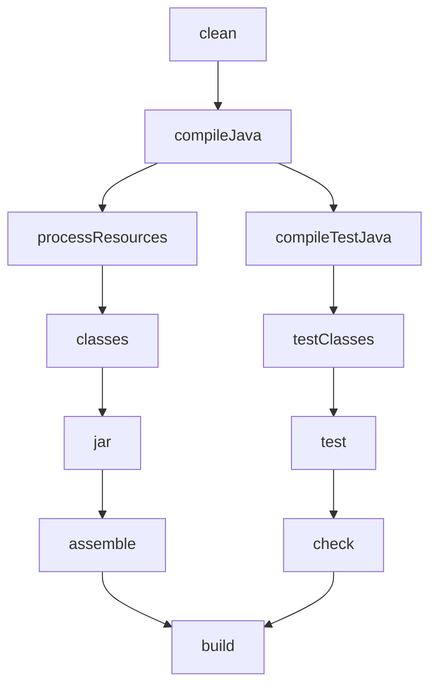

## Introduction to Gradle

Gradle is a powerful build automation tool that has become the standard for Java, Android, and JVM-based projects. At its core, Gradle helps you compile your code, run tests, package your application, manage dependencies, and deploy your software—all through a flexible, code-based configuration system.

What makes Gradle stand out from other build tools is its combination of power and flexibility:

1. **Flexibility**: Rather than using XML like older build tools, Gradle uses code (Groovy or Kotlin) for configuration, giving you much more expressive power.

2. **Performance**: Gradle employs smart incremental builds that only process what changed since your last build, significantly reducing build times for large projects.

3. **Dependency Management**: Its robust system seamlessly pulls libraries from Maven or Ivy repositories, handling transitive dependencies with ease.

4. **Multi-project Support**: When your application grows complex, Gradle excels at managing projects with many interconnected modules.

5. **Extensibility**: With its rich plugin ecosystem, you can easily add functionality for specific technologies or build processes.

## Getting Started

### Installation

Setting up Gradle is straightforward. Choose the method that works best for your operating system:

```bash
# macOS with Homebrew
brew install gradle

# Ubuntu/Debian
sudo apt install gradle

# Windows with Chocolatey
choco install gradle
```

After installation, verify everything is working by running:

```bash
gradle --version
```

### The Gradle Wrapper (Recommended Approach)

Rather than requiring everyone to install the same Gradle version locally, most projects use the Gradle Wrapper. This approach bundles a specific Gradle version with your project, ensuring everyone uses exactly the same build tool configuration.

To create a wrapper in an existing project:

```bash
gradle wrapper
```

This command generates several important files:

- `gradlew` (Linux/Mac) and `gradlew.bat` (Windows) scripts
- `gradle/wrapper/gradle-wrapper.jar`
- `gradle/wrapper/gradle-wrapper.properties`

From this point forward, you'll run builds using the wrapper instead of your local Gradle installation:

```bash
./gradlew build    # Linux/Mac
gradlew.bat build  # Windows
```

### Project Structure

A typical Gradle project follows this structure:

```
project/
├── gradle/
│   └── wrapper/
│       ├── gradle-wrapper.jar
│       └── gradle-wrapper.properties
├── gradlew
├── gradlew.bat
├── settings.gradle(.kts)
├── build.gradle(.kts)
└── src/
    ├── main/
    │   ├── java/
    │   └── resources/
    └── test/
        ├── java/
        └── resources/
```

The key files that define your project are:

- `settings.gradle(.kts)`: Defines your project name and any subprojects
- `build.gradle(.kts)`: Contains your build configuration
- `src/`: Contains your source code in a standard Maven layout

## Understanding Build Scripts

The heart of Gradle is its build scripts, which can be written in either Groovy (`.gradle`) or Kotlin (`.gradle.kts`). The Kotlin DSL has become increasingly popular due to its type safety, better IDE support, and more reliable refactoring.

Let's look at a basic build script using the Kotlin DSL:

```kotlin
// build.gradle.kts
plugins {
    id("java")  // Adds Java compilation support
}

group = "com.example"
version = "1.0-SNAPSHOT"

repositories {
    mavenCentral()  // Where to find dependencies
}

dependencies {
    implementation("com.google.guava:guava:31.1-jre")  // Regular dependency
    testImplementation("junit:junit:4.13.2")  // Test dependency
}
```

This simple script introduces several core Gradle concepts:

1. **Plugins**: These add functionality to your build. The Java plugin adds tasks for compiling, testing, and packaging Java code.

2. **Repositories**: These tell Gradle where to look for your dependencies. `mavenCentral()` is a common public repository.

3. **Dependencies**: These are external libraries your project needs. Gradle will download and manage them for you.

4. **Tasks**: Although not explicitly shown above, plugins add tasks—units of work that Gradle executes during the build process.

## Creating and Running Java Projects

Now that we understand the basics, let's see how to create and run a Java project with Gradle.

### Create a New Java Project

Gradle makes it easy to get started with a new project:

```bash
mkdir my-java-app
cd my-java-app
gradle init --type java-application
```

This command creates a complete Java application project with:

- A main class
- A test class
- All necessary Gradle configuration

### Common Gradle Commands

Once your project is set up, you'll use these commands regularly:

```bash
./gradlew build    # Compile, test, and package
./gradlew clean    # Remove build outputs
./gradlew test     # Run tests
./gradlew run      # Execute the application
./gradlew tasks    # List available tasks
```

Each command triggers a series of tasks that Gradle executes in the correct order.

## Managing Dependencies

As your project grows, you'll need to incorporate external libraries. Gradle organizes dependencies by their scope—when they're needed and who needs them:

```kotlin
dependencies {
    // For compile-time and runtime
    implementation("com.google.guava:guava:31.1-jre")

    // For compile-time only (visible to consumers of your library)
    api("org.apache.commons:commons-lang3:3.12.0")

    // For tests only
    testImplementation("junit:junit:4.13.2")

    // For runtime only
    runtimeOnly("org.postgresql:postgresql:42.3.6")
}
```

Each configuration serves a specific purpose. For example, `implementation` dependencies are needed for compilation and runtime but aren't exposed to consumers of your library, while `api` dependencies are.

### Version Catalogs

For larger projects with many dependencies, version catalogs help manage everything in one place:

```kotlin
// In gradle/libs.versions.toml
[versions]
kotlin = "1.7.10"
junit = "5.9.0"

[libraries]
kotlin-stdlib = { module = "org.jetbrains.kotlin:kotlin-stdlib", version.ref = "kotlin" }
junit-jupiter = { module = "org.junit.jupiter:junit-jupiter", version.ref = "junit" }

// In build.gradle.kts
dependencies {
    implementation(libs.kotlin.stdlib)
    testImplementation(libs.junit.jupiter)
}
```

This approach centralizes version management and makes it easy to update versions across multiple modules.

## Understanding Gradle Tasks

Tasks are the fundamental work units in Gradle. Each represents an atomic piece of work like compiling code or running tests. When you run a command like `./gradlew build`, you're actually executing a series of interconnected tasks.

### Built-in Tasks

Most plugins provide tasks that handle common operations:

- `build`: Assembles and tests the project
- `clean`: Deletes build outputs
- `test`: Runs tests
- `assemble`: Creates distribution archives
- `check`: Runs all verification tasks like tests and linting

### Creating Custom Tasks

As your build becomes more complex, you'll likely need custom tasks for project-specific operations:

```kotlin
// Simple task
tasks.register("hello") {
    description = "Prints a greeting"
    group = "Custom"  // Groups tasks in ./gradlew tasks output

    doLast {
        println("Hello, Gradle!")
    }
}

// Task with dependencies
tasks.register("processData") {
    dependsOn("downloadData", "validateData")
    doLast {
        println("Processing data...")
    }
}
```

The `dependsOn` method ensures tasks execute in the right order—in this case, `downloadData` and `validateData` will run before `processData`.

### The Task Graph

Behind the scenes, Gradle builds a directed acyclic graph (DAG) of tasks to determine the execution order:



This graph ensures tasks run in the correct order while maximizing parallelism where possible.

## Multi-Project Builds

As applications grow more complex, it often makes sense to split them into separate modules. Gradle's multi-project builds make this manageable.

### Structure

A multi-project build typically looks like this:

```
root-project/
├── settings.gradle.kts
├── build.gradle.kts
├── app/
│   └── build.gradle.kts
└── library/
    └── build.gradle.kts
```

### Configuration

Connecting these projects is straightforward:

```kotlin
// settings.gradle.kts
rootProject.name = "my-project"
include("app", "library")

// In app/build.gradle.kts
dependencies {
    implementation(project(":library"))  // Depend on the library project
}
```

With this setup, changes to the library automatically trigger rebuilds of the app when needed, and you can build everything with a single command.

## Build Customization

As your project requirements become more specific, you'll need more control over the build process.

### Source Sets

Source sets define different groups of code that should be compiled together:

```kotlin
sourceSets {
    main {
        java.srcDirs("src/main/java", "src/shared/java")
        resources.srcDirs("src/main/resources")
    }
    test {
        java.srcDirs("src/test/java")
    }
    // Create custom source set
    create("integrationTest") {
        java.srcDirs("src/integration-test/java")
        compileClasspath += sourceSets.main.get().output
        runtimeClasspath += sourceSets.main.get().output
    }
}
```

This approach lets you organize your code into logical groups with different compilation and runtime settings.

### Build Types and Product Flavors (Android)

For Android development, Gradle offers additional customization through build types and product flavors:

```kotlin
android {
    // Debug vs Release builds
    buildTypes {
        release {
            isMinifyEnabled = true
            proguardFiles(getDefaultProguardFile("proguard-android.txt"), "proguard-rules.pro")
        }
        debug {
            isDebuggable = true
            applicationIdSuffix = ".debug"
        }
    }

    // Free vs Paid versions
    flavorDimensions += "version"
    productFlavors {
        create("free") {
            dimension = "version"
            applicationIdSuffix = ".free"
        }
        create("paid") {
            dimension = "version"
            applicationIdSuffix = ".paid"
        }
    }
}
```

These configurations let you build multiple variants of your app from a single codebase.

## Gradle Plugins

Plugins are what make Gradle so versatile. They add tasks, configurations, dependencies, and more to your build.

### Common Plugins

Some widely used plugins include:

1. **Java Plugin**: Adds tasks for compiling, testing, and packaging Java code
2. **Application Plugin**: Adds tasks for running and packaging JVM applications
3. **Kotlin Plugin**: Adds support for Kotlin projects
4. **Spring Boot Plugin**: Simplifies Spring Boot application development

### Adding Plugins

Plugins can be core (built into Gradle) or external (from the Gradle Plugin Portal):

```kotlin
plugins {
    java  // Core plugin (built into Gradle)
    application  // Core plugin

    // External plugins with versions
    id("org.springframework.boot") version "2.7.3"
    id("io.spring.dependency-management") version "1.0.13.RELEASE"
    kotlin("jvm") version "1.7.10"
}
```

Each plugin adds its own set of tasks and configurations to your build.

## Creating a Complete Java App Example

Let's put everything together to create a simple Java application with Gradle. First, the build configuration:

```kotlin
// settings.gradle.kts
rootProject.name = "hello-gradle"

// build.gradle.kts
plugins {
    java
    application
}

group = "com.example"
version = "1.0-SNAPSHOT"

repositories {
    mavenCentral()
}

dependencies {
    implementation("com.google.guava:guava:31.1-jre")
    testImplementation("junit:junit:4.13.2")
}

application {
    mainClass.set("com.example.App")
}

// Add a custom task
tasks.register("printDependencies") {
    description = "Prints all dependencies"
    group = "Help"

    doLast {
        project.configurations.forEach { config ->
            println("${config.name}:")
            config.allDependencies.forEach { dep ->
                println("  - ${dep.group}:${dep.name}:${dep.version}")
            }
        }
    }
}
```

Next, let's create our source files:

```java
// src/main/java/com/example/App.java
package com.example;

import com.google.common.base.Strings;

public class App {
    public static void main(String[] args) {
        // Using Guava to demonstrate dependency usage
        String message = Strings.repeat("Hello Gradle! ", 3);
        System.out.println(message);
    }

    public String getGreeting() {
        return "Hello World!";
    }
}

// src/test/java/com/example/AppTest.java
package com.example;

import org.junit.Test;
import static org.junit.Assert.*;

public class AppTest {
    @Test
    public void testAppHasGreeting() {
        App classUnderTest = new App();
        assertNotNull("app should have a greeting", classUnderTest.getGreeting());
        assertEquals("Hello World!", classUnderTest.getGreeting());
    }
}
```

Finally, we can run the application:

```bash
./gradlew run
# Output: Hello Gradle! Hello Gradle! Hello Gradle!
```

This example demonstrates how Gradle integrates all the concepts we've covered: plugins, dependencies, tasks, and source code compilation.

## IDE Integration

You don't have to use Gradle from the command line—it works seamlessly with all major IDEs:

- **IntelliJ IDEA**: Built-in support with a dedicated Gradle tool window
- **Eclipse**: Via the Buildship plugin
- **Android Studio**: Built on IntelliJ with enhanced Gradle support
- **VS Code**: Via Gradle extension

This integration lets you run Gradle tasks directly from your IDE and provides useful visualizations of your build.

## The Remaining 15%: Advanced Topics

Now that you've mastered the essentials of Gradle, here are the more advanced topics that make up the remaining 15% you can explore on your own:

1. **Custom Plugin Development**: Create reusable functionality for multiple projects:

   ```kotlin
   // Example starter for a custom plugin
   class MyPlugin : Plugin<Project> {
       override fun apply(project: Project) {
           project.tasks.register("myTask") {
               doLast { println("Hello from my plugin") }
           }
       }
   }
   ```

2. **Build Cache Configuration**: Speed up builds across machines:

   ```kotlin
   buildCache {
       local {
           directory = File(rootDir, "build-cache")
           removeUnusedEntriesAfterDays = 30
       }
   }
   ```

3. **Composite Builds**: Work with builds from other directories:

   ```kotlin
   // settings.gradle.kts
   includeBuild("../other-project")
   ```

4. **Custom Task Types**: Create reusable task classes:

   ```kotlin
   abstract class PrintToFileTask : DefaultTask() {
       @get:InputFile
       abstract val inputFile: RegularFileProperty

       @get:OutputFile
       abstract val outputFile: RegularFileProperty

       @TaskAction
       fun execute() {
           // Task implementation
       }
   }
   ```

5. **Build Scans**: Get detailed insights into your build:

   ```kotlin
   plugins {
       id("com.gradle.build-scan") version "3.11"
   }

   buildScan {
       termsOfServiceUrl = "https://gradle.com/terms-of-service"
       termsOfServiceAgree = "yes"
   }
   ```

6. **Advanced Dependency Management**: Resolve version conflicts:

   ```kotlin
   configurations.all {
       resolutionStrategy {
           // Force specific versions
           force("com.google.guava:guava:30.1-jre")

           // Fail if versions conflict
           failOnVersionConflict()
       }
   }
   ```

7. **Gradle Script Kotlin Extensions**: Write type-safe build scripts with custom extensions

8. **Gradle TestKit**: Test your custom plugins and build logic

9. **CI/CD Integration**: Connect Gradle to Jenkins, GitHub Actions, and other CI systems

10. **Performance Optimization**: Profile and tune your builds:
    ```kotlin
    // Enable parallel execution
    org.gradle.parallel=true
    org.gradle.caching=true
    org.gradle.configureondemand=true
    ```

## Summary

This crash course has equipped you with the essential 85% of Gradle knowledge for day-to-day use. You now understand:

1. How to install Gradle and set up projects
2. How build scripts work with plugins, dependencies, and repositories
3. How to create and run tasks
4. How to structure multi-project builds
5. How to manage dependencies efficiently
6. How to customize your build for specific needs
7. How to use common plugins to enhance your build

The remaining 15%—custom plugins, build caching, advanced dependency management, and more—can be explored as your needs grow. Your foundation is now solid enough to tackle any Gradle project and expand your knowledge into these more specialized areas as needed.

Remember that Gradle's official documentation (docs.gradle.org) is extensive and well-maintained, providing a valuable reference when you need to dive deeper into any of these topics.
