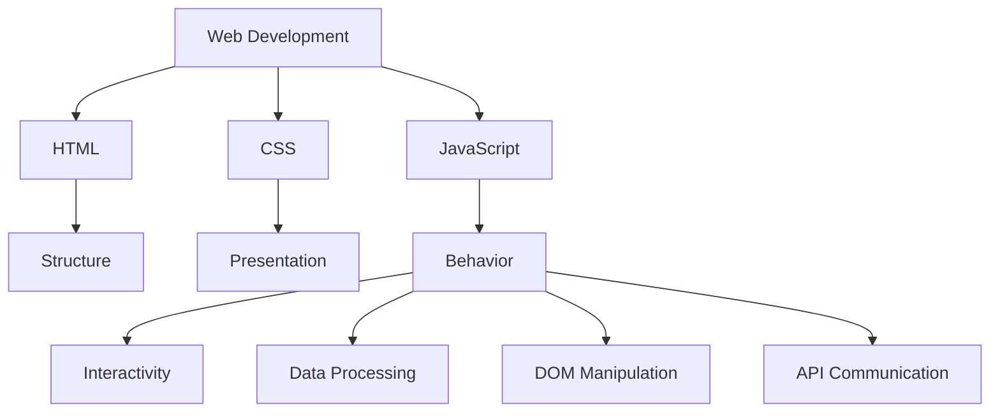
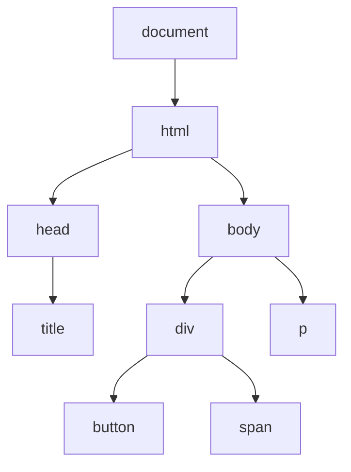
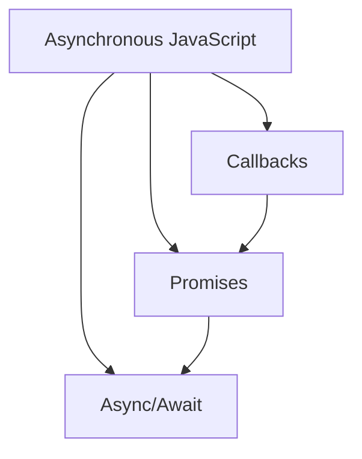

# JavaScript Crash Course: The Essential 85%

JavaScript is the backbone of modern web interactivity. This crash course covers the 85% of JavaScript you'll use daily, with guidance to explore the remaining 15% independently.

## Setting Up Your JavaScript Environment

Before diving into JavaScript concepts, let's set up a proper environment where you can practice what you'll learn. You'll need:

1. **A code editor**: Visual Studio Code (VS Code) is recommended

   - Download from: https://code.visualstudio.com/

2. **Node.js**: Allows you to run JavaScript outside a browser

   - Download from: https://nodejs.org/

3. **Create a basic project structure**:

```
project-folder/
│
├── index.html
├── styles.css
└── script.js
```

4. **Basic HTML template**:

```html
<!DOCTYPE html>
<html lang="en">
  <head>
    <meta charset="UTF-8" />
    <meta name="viewport" content="width=device-width, initial-scale=1.0" />
    <title>JavaScript Demo</title>
    <link rel="stylesheet" href="styles.css" />
  </head>
  <body>
    <h1>JavaScript Demo</h1>

    <!-- Your HTML content here -->

    <script src="script.js"></script>
  </body>
</html>
```

## JavaScript's Role in Web Development

Now that we have our environment ready, let's understand where JavaScript fits in the web development landscape. JavaScript works alongside HTML and CSS as the third pillar of web development:



While HTML provides the structure and CSS handles styling, JavaScript brings your website to life by adding behavior and interactivity. With our development environment ready and an understanding of JavaScript's role, we can now dive into the core language fundamentals.

## JavaScript Fundamentals

### Variables and Data Types

At the heart of JavaScript programming is the ability to store and manipulate data. We do this using variables, which act as containers for information:

```javascript
// Modern variable declarations
let age = 25; // Can be reassigned
const name = 'John'; // Cannot be reassigned

// Older approach (avoid when possible)
var score = 100; // Function-scoped, can be reassigned
```

JavaScript is a dynamically-typed language, meaning variables can hold different types of data. Here are the main data types you'll work with:

```javascript
// Primitive types
let string = 'Hello'; // Text
let number = 42; // Numbers (integers or decimals)
let boolean = true; // true/false values
let nullValue = null; // Intentional absence of value
let undefinedValue = undefined; // Unassigned value

// Reference types
let array = [1, 2, 3, 4]; // Ordered collection
let object = { name: 'Alice', age: 30 }; // Key-value pairs
```

Now that we can store data, we need ways to manipulate it. That's where operators come in.

### Operators

JavaScript provides a rich set of operators to perform operations on our data:

```javascript
// Arithmetic operators
let sum = 5 + 3; // Addition: 8
let difference = 10 - 4; // Subtraction: 6
let product = 3 * 4; // Multiplication: 12
let quotient = 20 / 5; // Division: 4
let remainder = 10 % 3; // Modulus (remainder): 1

// Assignment operators
let x = 10;
x += 5; // Same as: x = x + 5 (x is now 15)

// Comparison operators
let equals = 5 == '5'; // True (loose equality, converts types)
let strictEquals = 5 === '5'; // False (strict equality, checks types)
let notEqual = 5 != 10; // True
let greaterThan = 10 > 5; // True

// Logical operators
let and = true && false; // False (both must be true)
let or = true || false; // True (at least one must be true)
let not = !true; // False (inverts the boolean value)
```

With variables and operators at our disposal, we now need ways to control the flow of our program execution.

### Control Flow

Control flow allows us to make decisions and repeat actions in our code based on conditions.

#### Conditional Statements

Conditional statements help our program make decisions:

```javascript
let temperature = 25;

// If, else if, else statements
if (temperature > 30) {
  console.log("It's hot outside!"); // Will not execute
} else if (temperature > 20) {
  console.log("It's a nice day!"); // This will execute
} else {
  console.log("It's cold outside!"); // Will not execute
}

// Ternary operator (shorthand for if-else)
let message = temperature > 25 ? "It's warm" : "It's cool"; // "It's cool"

// Switch statement
let day = 'Monday';
switch (day) {
  case 'Monday':
    console.log('Start of work week'); // This will execute
    break; // Without break, execution would continue to the next case
  case 'Friday':
    console.log('End of work week');
    break;
  default:
    console.log('Another day');
}
```

#### Loops

Loops allow us to repeat actions multiple times without duplicating code:

```javascript
// For loop (with known number of iterations)
for (let i = 0; i < 5; i++) {
  console.log(i); // Outputs: 0, 1, 2, 3, 4
}

// While loop (executes as long as condition is true)
let count = 0;
while (count < 3) {
  console.log(count); // Outputs: 0, 1, 2
  count++;
}

// For...of loop (iterates over iterable objects like arrays)
const fruits = ['apple', 'banana', 'cherry'];
for (const fruit of fruits) {
  console.log(fruit); // Outputs: "apple", "banana", "cherry"
}

// For...in loop (iterates over object properties)
const person = { name: 'Alice', age: 30, job: 'Developer' };
for (const key in person) {
  console.log(`${key}: ${person[key]}`);
  // Outputs: "name: Alice", "age: 30", "job: Developer"
}
```

Now that we can control program flow, let's look at how to organize code into reusable blocks.

### Functions

Functions allow us to group code into reusable blocks, making our programs more organized and maintainable:

```javascript
// Function declaration
function greet(name) {
  return `Hello, ${name}!`;
}

// Function expression
const add = function (a, b) {
  return a + b;
};

// Arrow function (ES6+)
const multiply = (a, b) => a * b;

// Function with default parameters
function welcome(name = 'Guest') {
  return `Welcome, ${name}!`;
}

// Using functions
console.log(greet('Alice')); // "Hello, Alice!"
console.log(add(5, 3)); // 8
console.log(multiply(4, 6)); // 24
console.log(welcome()); // "Welcome, Guest!"
console.log(welcome('Bob')); // "Welcome, Bob!"
```

As we create functions and variables, it's important to understand where they can be accessed from within our code.

### Scope and Closures

Scope defines where variables and functions are accessible in your code:

```javascript
// Global scope
let globalVar = "I'm global";

function exampleFunction() {
  // Function scope
  let functionVar = "I'm function-scoped";

  if (true) {
    // Block scope (with let/const)
    let blockVar = "I'm block-scoped";
    var notBlockVar = "I'm not block-scoped"; // var ignores block scope

    console.log(globalVar); // Accessible: "I'm global"
    console.log(functionVar); // Accessible: "I'm function-scoped"
    console.log(blockVar); // Accessible: "I'm block-scoped"
  }

  console.log(globalVar); // Accessible: "I'm global"
  console.log(functionVar); // Accessible: "I'm function-scoped"
  // console.log(blockVar);        // Error: not accessible outside the block
  console.log(notBlockVar); // Accessible: "I'm not block-scoped"
}
```

A powerful concept related to scope is closures, which allow functions to "remember" their creation environment:

```javascript
// Closures: Functions that remember their outer variables
function createCounter() {
  let count = 0; // This variable is "enclosed" by the returned function

  return function () {
    count++; // Can access and modify the outer count variable
    return count;
  };
}

const counter = createCounter();
console.log(counter()); // 1
console.log(counter()); // 2
console.log(counter()); // 3
// The count variable remains "alive" between function calls
```

Now that we understand the basics of JavaScript, let's explore how to work with more complex data structures.

## Working with Data

### Arrays

Arrays are ordered collections that can store multiple values. They're essential for working with lists of data:

```javascript
// Creating arrays
let numbers = [1, 2, 3, 4, 5];
let mixed = [1, 'two', true, { name: 'John' }, [5, 6]];

// Accessing elements
console.log(numbers[0]); // 1 (first element, zero-indexed)
console.log(numbers[4]); // 5 (fifth element)
```

Arrays come with many built-in methods that make them powerful and flexible:

```javascript
// Common array methods
numbers.push(6); // Add to end: [1, 2, 3, 4, 5, 6]
numbers.pop(); // Remove from end: [1, 2, 3, 4, 5]
numbers.unshift(0); // Add to beginning: [0, 1, 2, 3, 4, 5]
numbers.shift(); // Remove from beginning: [1, 2, 3, 4, 5]
let sliced = numbers.slice(1, 3); // Extract [2, 3] (not modifying original)
numbers.splice(1, 2, 'a', 'b'); // Replace elements: [1, 'a', 'b', 4, 5]
```

Modern JavaScript introduced powerful higher-order array methods that transform data:

```javascript
// Higher-order array methods
const doubledNumbers = [1, 2, 3, 4].map((num) => num * 2);
// [2, 4, 6, 8] - creates a new array by applying function to each element

const evenNumbers = [1, 2, 3, 4, 5].filter((num) => num % 2 === 0);
// [2, 4] - creates a new array with elements that pass the test

const sum = [1, 2, 3, 4].reduce((total, num) => total + num, 0);
// 10 - reduces array to a single value using an accumulator
```

### Objects

While arrays are great for ordered collections, objects are perfect for representing entities with named properties:

```javascript
// Creating objects
const person = {
  name: 'Alice',
  age: 30,
  occupation: 'Developer',
  skills: ['JavaScript', 'HTML', 'CSS'],

  // Method inside object
  greet: function () {
    return `Hi, I'm ${this.name}!`;
  },

  // Shorthand method (ES6+)
  introduce() {
    return `I am a ${this.occupation} with ${this.skills.length} skills`;
  },
};
```

Objects are flexible and allow you to access, add, and modify properties easily:

```javascript
// Accessing properties
console.log(person.name); // "Alice" (dot notation)
console.log(person['age']); // 30 (bracket notation)
console.log(person.greet()); // "Hi, I'm Alice!"

// Adding/modifying properties
person.location = 'New York'; // Add new property
person.age = 31; // Modify existing property
```

Modern JavaScript introduced convenient ways to work with objects:

```javascript
// Object destructuring (ES6+)
const { name, occupation } = person;
console.log(name); // "Alice"
console.log(occupation); // "Developer"

// Spread operator with objects (ES6+)
const updatedPerson = { ...person, age: 32, status: 'Active' };
// Creates a new object with all properties of person, updating age and adding status
```

Now that we understand how to work with JavaScript data structures, let's see how JavaScript interacts with web pages.

## DOM Manipulation

The Document Object Model (DOM) is a programming interface that represents the structure of an HTML document. JavaScript can access and modify this structure, allowing you to create dynamic web pages:



### Selecting Elements

The first step in DOM manipulation is selecting the elements you want to work with:

```javascript
// Get element by ID
const header = document.getElementById('header');

// Get elements by class name (returns a live HTMLCollection)
const items = document.getElementsByClassName('item');

// Get elements by tag name (returns a live HTMLCollection)
const paragraphs = document.getElementsByTagName('p');

// Query selector (returns the first matching element)
const firstButton = document.querySelector('button');

// Query selector all (returns a static NodeList of all matches)
const allButtons = document.querySelectorAll('.btn');
```

### Modifying Content and Attributes

Once you've selected elements, you can modify their content and attributes:

```javascript
// Changing text content
header.textContent = 'New Header Title';

// Changing HTML content (be careful with security when using innerHTML)
document.querySelector('.content').innerHTML =
  '<strong>Updated</strong> content';

// Modifying attributes
const link = document.querySelector('a');
link.setAttribute('href', 'https://example.com');
console.log(link.getAttribute('href')); // "https://example.com"

// Working with classes
const element = document.querySelector('.item');
element.classList.add('active'); // Add a class
element.classList.remove('disabled'); // Remove a class
element.classList.toggle('highlighted'); // Toggle a class (add if absent, remove if present)
console.log(element.classList.contains('active')); // true - check if class exists
```

### Event Handling

To make your web pages interactive, you need to respond to user actions. This is done through event handling:

```javascript
// Adding event listeners
const button = document.querySelector('button');

button.addEventListener('click', function (event) {
  console.log('Button was clicked!');
  console.log(event); // Event object with details about the event
});
```

There are many types of events you can listen for:

```javascript
// Common events:
// click - when element is clicked
// submit - when a form is submitted
// keydown/keyup - when a key is pressed/released
// mouseover/mouseout - when mouse enters/leaves an element
// load - when a resource has loaded
```

You can also remove event listeners and control event propagation:

```javascript
// Removing event listeners
function handleHover() {
  console.log('Hovered!');
}

button.addEventListener('mouseover', handleHover);
button.removeEventListener('mouseover', handleHover);

// Event propagation (bubbling and capturing)
document.querySelector('.outer').addEventListener('click', function () {
  console.log('Outer div clicked'); // This executes second (bubbling)
});

document.querySelector('.inner').addEventListener('click', function (e) {
  console.log('Inner div clicked'); // This executes first
  e.stopPropagation(); // Prevents event from bubbling up to parent elements
});
```

With a solid understanding of DOM manipulation, let's explore the modern features that have made JavaScript more powerful and developer-friendly in recent years.

## Modern JavaScript Features (ES6+)

JavaScript has evolved significantly with the introduction of ECMAScript 6 (ES6) and later versions. These modern features make the language more expressive and easier to use.

### Arrow Functions

Arrow functions provide a more concise syntax for writing functions:

```javascript
// Traditional function
function add(a, b) {
  return a + b;
}

// Arrow function (shorter syntax)
const addArrow = (a, b) => a + b;

// Arrow function with body
const greet = (name) => {
  const greeting = `Hello, ${name}!`;
  return greeting;
};
```

Arrow functions also handle `this` differently than traditional functions:

```javascript
// 'this' behavior differences:
// Regular functions create their own 'this' context
// Arrow functions inherit 'this' from the surrounding scope
const counter = {
  count: 0,

  // Traditional function - creates its own 'this'
  increment: function () {
    this.count++; // 'this' refers to counter object
    console.log(this.count);
  },

  // Arrow function - inherits parent 'this'
  decrement: () => {
    this.count--; // 'this' does NOT refer to counter object!
    console.log(this.count); // May not work as expected
  },
};
```

### Template Literals

Template literals make string manipulation more readable and powerful:

```javascript
const name = 'Alice';
const age = 30;

// Old way
const message1 = 'My name is ' + name + ' and I am ' + age + ' years old.';

// Template literals - use backticks (`) and ${} for variables
const message2 = `My name is ${name} and I am ${age} years old.`;

// Multi-line strings
const multiLine = `This is line 1.
This is line 2.
This is line 3.`;
```

### Destructuring

Destructuring allows you to extract values from arrays and objects more elegantly:

```javascript
// Array destructuring
const coordinates = [10, 20, 30];
const [x, y, z] = coordinates;
console.log(x, y, z); // 10 20 30

// Object destructuring
const user = {
  name: 'John',
  age: 28,
  location: 'New York',
};
const { name, age, location: city } = user; // Rename location to city
console.log(name, age, city); // "John" 28 "New York"

// Default values and rest parameters
const [first, second, ...rest] = [1, 2, 3, 4, 5];
console.log(first, second, rest); // 1 2 [3, 4, 5]
```

### Spread/Rest Operators

These versatile operators simplify working with arrays and objects:

```javascript
// Spread operator with arrays
const arr1 = [1, 2, 3];
const arr2 = [4, 5, 6];
const combined = [...arr1, ...arr2]; // [1, 2, 3, 4, 5, 6]

// Spread operator with objects
const baseConfig = { theme: 'dark', language: 'en' };
const userConfig = { ...baseConfig, fontSize: 'large' };
// {theme: "dark", language: "en", fontSize: "large"}

// Rest parameter in functions
function sum(...numbers) {
  return numbers.reduce((total, num) => total + num, 0);
}
console.log(sum(1, 2, 3, 4)); // 10
```

### Classes

Classes provide a cleaner, more familiar syntax for object-oriented programming:

```javascript
// ES6 Class syntax
class Person {
  constructor(name, age) {
    this.name = name;
    this.age = age;
  }

  // Instance method
  greet() {
    return `Hello, my name is ${this.name}`;
  }

  // Static method (called on the class, not instances)
  static createAnonymous() {
    return new Person('Anonymous', 0);
  }
}
```

Classes also support inheritance, allowing you to create hierarchies of related objects:

```javascript
// Inheritance
class Employee extends Person {
  constructor(name, age, position) {
    super(name, age); // Call parent constructor
    this.position = position;
  }

  // Override parent method
  greet() {
    return `${super.greet()} and I work as a ${this.position}`;
  }
}

const alice = new Person('Alice', 30);
console.log(alice.greet()); // "Hello, my name is Alice"

const bob = new Employee('Bob', 35, 'Developer');
console.log(bob.greet()); // "Hello, my name is Bob and I work as a Developer"
```

These modern features have made JavaScript more expressive and powerful, but they still operate synchronously. For operations that take time, like network requests, we need asynchronous programming.

## Asynchronous JavaScript

JavaScript runs in a single thread, which means it can only do one thing at a time. However, many operations in web development (like fetching data from a server) take time. Asynchronous programming allows JavaScript to handle these operations without blocking the main thread:



### Callbacks

Callbacks are the original way to handle asynchronous operations in JavaScript:

```javascript
// Simple callback example
function fetchData(callback) {
  setTimeout(() => {
    const data = { id: 1, name: 'Product' };
    callback(data); // Execute the callback with the data
  }, 1000); // Simulate delay of 1 second
}

fetchData(function (data) {
  console.log('Data received:', data);
});
```

While callbacks work, they can lead to deeply nested code that's hard to follow (known as "callback hell"):

```javascript
// Callback hell (nested callbacks - hard to read and maintain)
fetchData(function (data) {
  processData(data, function (processed) {
    saveData(processed, function (result) {
      console.log('Final result:', result);
      // More nested callbacks would make this even harder to follow
    });
  });
});
```

### Promises

Promises provide a more elegant way to handle asynchronous operations:

```javascript
// Creating a promise
const fetchDataPromise = () => {
  return new Promise((resolve, reject) => {
    setTimeout(() => {
      const success = true; // Simulate successful operation
      if (success) {
        resolve({ id: 1, name: 'Product' }); // Success case
      } else {
        reject(new Error('Failed to fetch data')); // Failure case
      }
    }, 1000);
  });
};
```

Promises are chainable, which makes handling sequential asynchronous operations much cleaner:

```javascript
// Using promises (chainable and more readable)
fetchDataPromise()
  .then((data) => {
    console.log('Data received:', data);
    return processData(data); // Return a new promise
  })
  .then((processed) => {
    console.log('Data processed:', processed);
    return saveData(processed); // Return another promise
  })
  .then((result) => {
    console.log('Final result:', result);
  })
  .catch((error) => {
    console.error('Error:', error.message); // Handle any errors in the chain
  })
  .finally(() => {
    console.log('Operation completed'); // Always executes
  });
```

Promises can also handle multiple asynchronous operations in parallel:

```javascript
// Promise.all (parallel execution of multiple promises)
const promise1 = fetchUser(1);
const promise2 = fetchProducts();

Promise.all([promise1, promise2])
  .then(([user, products]) => {
    console.log('User:', user);
    console.log('Products:', products);
  })
  .catch((error) => {
    console.error('Error in one of the promises:', error);
  });
```

### Async/Await

Async/await is the most recent addition to JavaScript's asynchronous toolkit. It lets you write asynchronous code that looks and behaves more like synchronous code:

```javascript
// Async function - more synchronous-looking way to write asynchronous code
async function fetchAndProcessData() {
  try {
    // await pauses execution until the promise resolves
    const data = await fetchDataPromise();
    console.log('Data received:', data);

    const processed = await processData(data);
    console.log('Data processed:', processed);

    const result = await saveData(processed);
    console.log('Final result:', result);

    return result;
  } catch (error) {
    console.error('Error:', error.message);
  } finally {
    console.log('Operation completed');
  }
}

// Calling the async function
fetchAndProcessData().then((result) => {
  console.log('Everything completed with result:', result);
});
```

You can still run operations in parallel using async/await:

```javascript
// Parallel operations with async/await
async function fetchMultipleResources() {
  try {
    // Start both operations in parallel
    const userPromise = fetchUser(1);
    const productsPromise = fetchProducts();

    // Wait for both to complete
    const [user, products] = await Promise.all([userPromise, productsPromise]);

    console.log('User:', user);
    console.log('Products:', products);
  } catch (error) {
    console.error('Error:', error);
  }
}
```

### Fetch API

The Fetch API is a modern interface for making HTTP requests, which is a common asynchronous operation:

```javascript
// Basic GET request
fetch('https://api.example.com/data')
  .then((response) => {
    if (!response.ok) {
      throw new Error(`HTTP error! Status: ${response.status}`);
    }
    return response.json(); // Parse JSON response
  })
  .then((data) => {
    console.log('Data received:', data);
  })
  .catch((error) => {
    console.error('Fetch error:', error);
  });
```

The Fetch API can also handle different HTTP methods for more complex operations:

```javascript
// POST request with JSON data
fetch('https://api.example.com/submit', {
  method: 'POST',
  headers: {
    'Content-Type': 'application/json',
  },
  body: JSON.stringify({
    name: 'John Doe',
    email: 'john@example.com',
  }),
})
  .then((response) => response.json())
  .then((data) => console.log('Response:', data))
  .catch((error) => console.error('Error:', error));
```

Fetch works seamlessly with async/await for even cleaner code:

```javascript
// Using fetch with async/await
async function fetchUserData(userId) {
  try {
    const response = await fetch(`https://api.example.com/users/${userId}`);

    if (!response.ok) {
      throw new Error(`HTTP error! Status: ${response.status}`);
    }

    const userData = await response.json();
    return userData;
  } catch (error) {
    console.error('Error fetching user data:', error);
    throw error; // Rethrow to be caught by the caller
  }
}
```

As our code becomes more complex, especially with asynchronous operations, we need robust ways to handle errors.

## Error Handling

Error handling is crucial for building reliable applications that can recover gracefully from unexpected situations:

```javascript
// Try-catch for synchronous code
try {
  const data = JSON.parse('{"invalid json"}'); // This will throw an error
  processData(data);
} catch (error) {
  console.error('Error parsing JSON:', error.message);
  // Handle gracefully or show user-friendly message
}
```

For asynchronous code, error handling can be done with catch blocks or try-catch with async/await:

```javascript
// Error handling in async functions
async function fetchData() {
  try {
    const response = await fetch('https://api.example.com/data');

    if (!response.ok) {
      throw new Error(`HTTP error! Status: ${response.status}`);
    }

    return await response.json();
  } catch (error) {
    console.error('Fetch error:', error);
    // Show user-friendly message or retry
    return null;
  }
}
```

You can also create custom error types for more specific error handling:

```javascript
// Creating custom errors
class ValidationError extends Error {
  constructor(message) {
    super(message);
    this.name = 'ValidationError';
  }
}

function validateUser(user) {
  if (!user.name) {
    throw new ValidationError('Name is required');
  }
  if (!user.email) {
    throw new ValidationError('Email is required');
  }
}
```

When developing JavaScript applications, debugging tools are essential for finding and fixing problems.

## Debugging Tools

JavaScript provides several built-in methods for debugging:

```javascript
// Console methods
console.log('Regular message');
console.error('Error message'); // Red in console
console.warn('Warning message'); // Yellow in console
console.table([
  { name: 'John', age: 30 },
  { name: 'Alice', age: 25 },
]); // Displays data in a table format

console.time('Timer');
// Code to measure performance
console.timeEnd('Timer'); // Outputs time elapsed since console.time()

// Debugger statement
function complexCalculation(a, b) {
  let result = a * b;
  debugger; // Browser will pause execution here when DevTools is open
  return result * 2;
}
```

Browser DevTools also offer powerful debugging capabilities, including breakpoints, step-through execution, and variable inspection.

## Basic JavaScript Project Example

Let's put everything we've learned together in a small practical example - a simple todo list application:

```html
<!-- index.html -->
<!DOCTYPE html>
<html lang="en">
  <head>
    <meta charset="UTF-8" />
    <meta name="viewport" content="width=device-width, initial-scale=1.0" />
    <title>Todo List App</title>
    <style>
      .completed {
        text-decoration: line-through;
        color: gray;
      }
    </style>
  </head>
  <body>
    <h1>Todo List</h1>

    <form id="todo-form">
      <input type="text" id="todo-input" placeholder="Add a new task" />
      <button type="submit">Add</button>
    </form>

    <ul id="todo-list"></ul>

    <script src="script.js"></script>
  </body>
</html>
```

```javascript
// script.js
document.addEventListener('DOMContentLoaded', () => {
  // Get DOM elements
  const todoForm = document.getElementById('todo-form');
  const todoInput = document.getElementById('todo-input');
  const todoList = document.getElementById('todo-list');

  // Load saved todos from localStorage
  let todos = JSON.parse(localStorage.getItem('todos')) || [];

  // Render todos
  function renderTodos() {
    // Clear current list
    todoList.innerHTML = '';

    // Create list item for each todo
    todos.forEach((todo, index) => {
      const li = document.createElement('li');

      // Add completed class if todo is done
      if (todo.completed) {
        li.classList.add('completed');
      }

      // Add todo text
      li.textContent = todo.text;

      // Create toggle button
      const toggleButton = document.createElement('button');
      toggleButton.textContent = todo.completed ? 'Undo' : 'Complete';
      toggleButton.addEventListener('click', () => {
        toggleTodoComplete(index);
      });

      // Create delete button
      const deleteButton = document.createElement('button');
      deleteButton.textContent = 'Delete';
      deleteButton.addEventListener('click', () => {
        deleteTodo(index);
      });

      // Add buttons to list item
      li.appendChild(toggleButton);
      li.appendChild(deleteButton);

      // Add list item to list
      todoList.appendChild(li);
    });

    // Save todos to localStorage
    localStorage.setItem('todos', JSON.stringify(todos));
  }

  // Add a new todo
  function addTodo(text) {
    todos.push({
      text: text,
      completed: false,
    });
    renderTodos();
  }

  // Toggle todo completed status
  function toggleTodoComplete(index) {
    todos[index].completed = !todos[index].completed;
    renderTodos();
  }

  // Delete a todo
  function deleteTodo(index) {
    todos.splice(index, 1);
    renderTodos();
  }

  // Handle form submission
  todoForm.addEventListener('submit', (e) => {
    e.preventDefault(); // Prevent page reload

    const text = todoInput.value.trim();
    if (text) {
      addTodo(text);
      todoInput.value = ''; // Clear input
    }
  });

  // Initial render
  renderTodos();
});
```

This simple application demonstrates many of the concepts we've covered:

- DOM manipulation to select and modify elements
- Event handling for user interactions
- Array methods to manage data
- Local storage for persistence
- Functions to organize code

## The Remaining 15%: Advanced Topics to Explore

Now that you've learned the core 85% of JavaScript, here's a summary of advanced topics that make up the remaining 15% you might want to explore:

1. **Advanced JavaScript Patterns**

   - Design patterns (Module, Factory, Observer, etc.)
   - Functional programming concepts
   - Metaprogramming with Proxies and Reflect API

2. **Performance Optimization**

   - Memory management and garbage collection
   - Understanding the event loop and microtasks
   - Web workers for multithreading

3. **Testing & Quality Assurance**

   - Unit testing (Jest, Mocha)
   - Integration testing
   - End-to-end testing

4. **JavaScript Ecosystem**

   - Build tools (Webpack, Rollup, Vite)
   - Package management with npm/yarn
   - JavaScript frameworks (React, Vue, Angular, Svelte)

5. **Modern JavaScript Development**

   - TypeScript for static typing
   - Server-side JavaScript with Node.js
   - Web Components for reusable elements

6. **Advanced Asynchronous Patterns**

   - RxJS and Observables
   - Generators and Iterators
   - Advanced Promise patterns

7. **Security Considerations**

   - Cross-site scripting (XSS) prevention
   - Content Security Policy
   - CORS and secure coding practices

8. **Web APIs and Browser Integration**
   - Web Storage API (localStorage/sessionStorage)
   - Service Workers and Progressive Web Apps
   - WebSockets for real-time communication
   - WebGL for 3D graphics

As you become comfortable with the 85% covered in this crash course, gradually explore these advanced topics based on your specific interests and project requirements. The solid foundation you've built will make these advanced concepts much easier to grasp.
