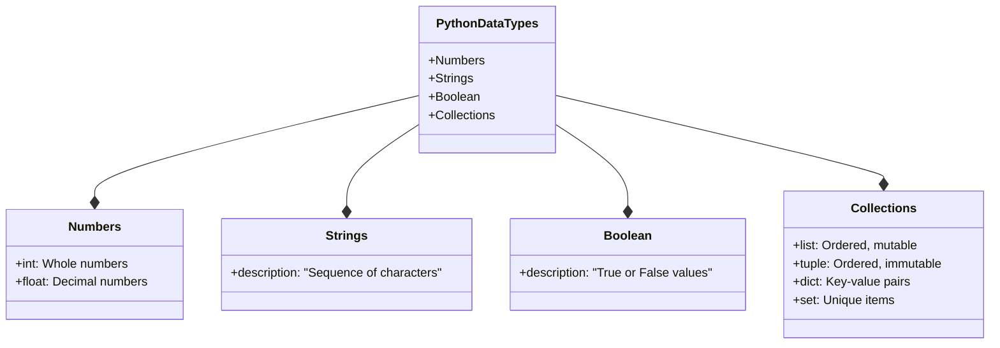
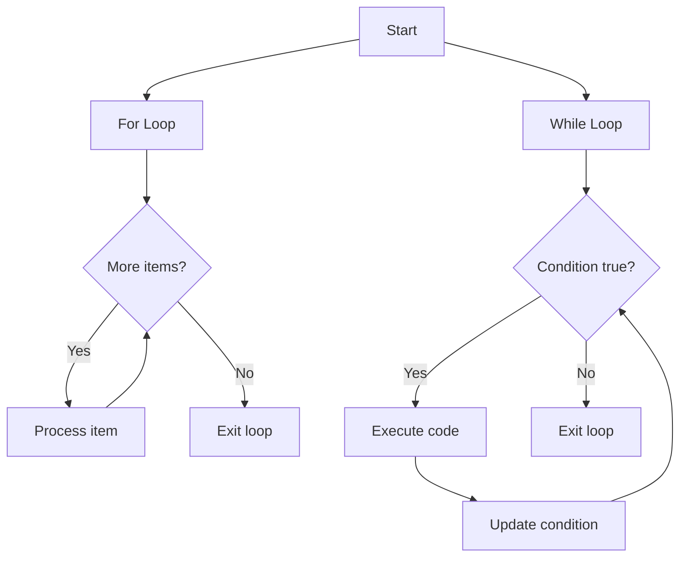
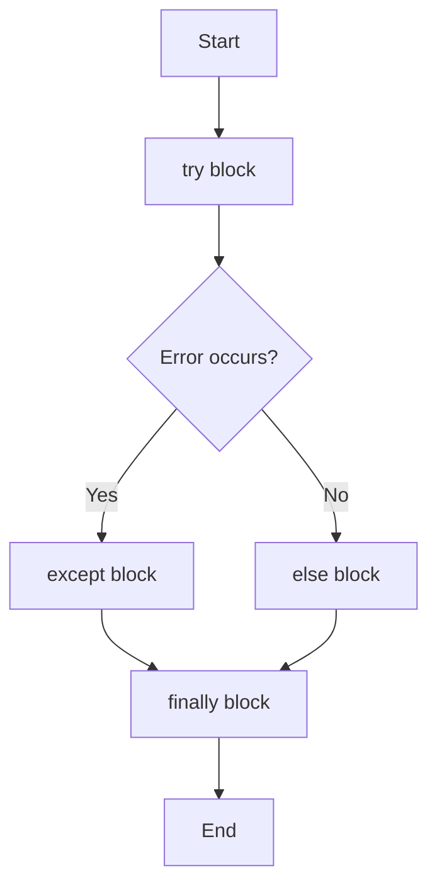
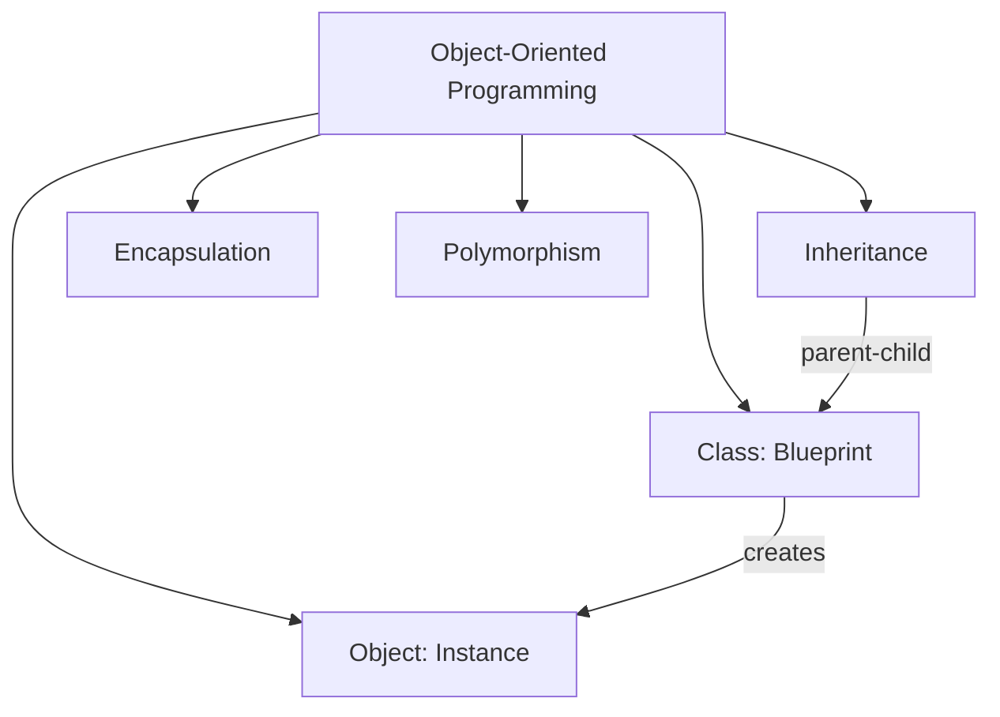
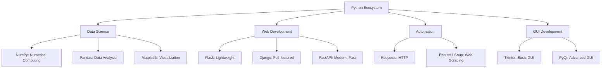

Welcome to your Python crash course! Python has become one of the world's most popular programming languages due to its readability, versatility, and extensive library support. This guide will equip you with the core knowledge needed for daily Python use while providing a solid foundation to explore the more advanced features on your own.

## 1. Getting Started with Python

### Installation & Setup

Before writing any code, you'll need to set up your Python environment:

1. **Download Python**: Visit [python.org](https://python.org) and download the latest version (3.x)
2. **Verify Installation**: Open a terminal or command prompt and run:

```python
python --version  # On Windows
python3 --version  # On macOS/Linux
```

3. **Choose an Editor/IDE**:
   - Visual Studio Code (free, lightweight, extensible)
   - PyCharm (powerful IDE with free community edition)
   - IDLE (comes with Python, simple for beginners)

### Your First Python Program

Let's write a simple program to get started:

```python
# This is a comment - Python ignores this line
print("Hello, World!")  # This prints text to the console

# Save this code in a file named hello.py
# Run it by typing 'python hello.py' in your terminal
```

## 2. Python Fundamentals

### Variables and Data Types

Variables are containers that store data values. Python makes working with variables intuitive:

```python
# Variable assignment
name = "John"     # String - text
age = 30          # Integer - whole number
height = 5.11     # Float - decimal number
is_student = True # Boolean - True/False

# Python is dynamically typed - no need to declare variable types
# Variable names are case-sensitive: 'name' and 'Name' are different
```

Here's a visual overview of Python's main data types:



- Lists are suitable for ordered, mutable data.
- Tuples are suitable for ordered, immutable data.

### Working with Numbers

Python makes arithmetic operations straightforward:

```python
# Basic operations
sum_result = 5 + 10       # Addition: 15
difference = 10 - 5       # Subtraction: 5
product = 4 * 5           # Multiplication: 20
quotient = 20 / 4         # Division: 5.0 (always returns float)
integer_division = 20 // 4 # Floor division: 5 (returns int)
remainder = 10 % 3        # Modulo (remainder): 1
power = 2 ** 3            # Exponentiation: 8 (2 raised to power 3)

# Type conversion
int_from_str = int("42")     # Convert string to int: 42
float_from_str = float("3.14") # Convert string to float: 3.14
str_from_num = str(42)       # Convert number to string: "42"

# Check type of a variable
print(type(sum_result))      # <class 'int'>
```

### Working with Strings

Strings are sequences of characters and offer many built-in operations:

```python
# String creation
single_quotes = 'Hello'
double_quotes = "World"
triple_quotes = '''Multiple
lines of text'''

# String operations
greeting = single_quotes + " " + double_quotes  # Concatenation: "Hello World"
repeated = "Ha" * 3  # Repetition: "HaHaHa"

# String methods
name = "Python"
print(name.upper())          # "PYTHON" - all uppercase
print(name.lower())          # "python" - all lowercase
print(len(name))             # 6 - length of string
print(name.replace('P', 'J')) # "Jython" - replace characters
print("th" in name)          # True - check if substring exists

# String formatting (f-strings - Python 3.6+)
name = "Alice"
age = 25
intro = f"My name is {name} and I'm {age} years old."
# Output: "My name is Alice and I'm 25 years old."
```

## 3. Collections and Data Structures

Python provides several powerful collection types that let you group related data together.

### Lists

Lists are ordered, changeable collections of items - one of Python's most versatile data structures:

```python
# Creating lists
fruits = ["apple", "banana", "cherry"]  # List of strings
mixed = [1, "hello", 3.14, True]        # List with different data types

# Accessing elements (zero-indexed)
first_fruit = fruits[0]   # "apple" - first item
last_fruit = fruits[-1]   # "cherry" - last item

# Slicing lists
subset = fruits[0:2]      # ["apple", "banana"] - items from index 0 up to (not including) 2

# Modifying lists
fruits.append("orange")   # Add item to end: ["apple", "banana", "cherry", "orange"]
fruits.insert(1, "mango") # Insert at position: ["apple", "mango", "banana", "cherry", "orange"]
fruits.remove("banana")   # Remove by value: ["apple", "mango", "cherry", "orange"]
popped = fruits.pop()     # Remove and return last item: "orange"
fruits[0] = "pear"        # Change item at index: ["pear", "mango", "cherry"]

# List operations
nums = [3, 1, 4, 1, 5, 9]
nums.sort()               # Sort in-place: [1, 1, 3, 4, 5, 9]
nums.reverse()            # Reverse in-place: [9, 5, 4, 3, 1, 1]
print(len(nums))          # Length: 6
print(sum(nums))          # Sum: 23
print(max(nums))          # Maximum: 9
print(min(nums))          # Minimum: 1
```

### Tuples

Similar to lists, tuples are ordered collections, but they're immutable (unchangeable) once created:

```python
# Creating tuples
coordinates = (10.5, 20.8)
single_item = (42,)  # Comma is needed for single-item tuples

# Accessing elements (same as lists)
x_coord = coordinates[0]  # 10.5

# Cannot modify tuples!
# coordinates[0] = 15  # This would cause an error

# Tuple unpacking
x, y = coordinates  # x = 10.5, y = 20.8
```

### Dictionaries

Dictionaries store data as key-value pairs, making them perfect for structured data:

```python
# Creating dictionaries
person = {
    "name": "John",
    "age": 30,
    "is_student": False
}

# Accessing values
name = person["name"]     # "John"
# Safer access with get (returns None or default if key doesn't exist)
height = person.get("height")         # None
height = person.get("height", 175)    # 175 (default value)

# Modifying dictionaries
person["age"] = 31        # Change value
person["height"] = 180    # Add new key-value pair
del person["is_student"]  # Remove key-value pair

# Dictionary methods
keys = list(person.keys())      # Get all keys: ['name', 'age', 'height']
values = list(person.values())  # Get all values: ['John', 31, 180]

# Checking if a key exists
if "name" in person:
    print("Name exists!")
```

### Sets

Sets are collections of unique items - perfect when you need to eliminate duplicates:

```python
# Creating sets
fruits = {"apple", "banana", "cherry"}
numbers = set([1, 2, 2, 3, 3, 4])  # Creates {1, 2, 3, 4} - duplicates removed

# Adding/removing items
fruits.add("orange")      # Add item
fruits.remove("banana")   # Remove item (raises error if not found)
fruits.discard("mango")   # Remove item (no error if not found)

# Set operations
set1 = {1, 2, 3}
set2 = {3, 4, 5}
union = set1 | set2       # Union: {1, 2, 3, 4, 5}
intersection = set1 & set2 # Intersection: {3}
difference = set1 - set2  # Difference: {1, 2}
```

## 4. Control Flow

Control flow lets you determine the execution path of your program based on conditions and repetition.

### Conditional Statements

Conditional statements let your code make decisions:

```python
# if-elif-else statement
age = 20

if age < 18:
    print("You are a minor")
elif age >= 18 and age < 65:
    print("You are an adult")
else:
    print("You are a senior")
# Output: "You are an adult"

# Comparison operators
x, y = 5, 10
print(x == y)  # Equal to: False
print(x != y)  # Not equal to: True
print(x < y)   # Less than: True
print(x > y)   # Greater than: False

# Logical operators
a, b = True, False
print(a and b)  # Logical AND: False
print(a or b)   # Logical OR: True
print(not a)    # Logical NOT: False
```

### Loops

Loops allow you to repeat code multiple times. Here's a visual of how loops work in Python:



#### For Loops

For loops iterate over a sequence of elements:

```python
# Iterating through a sequence
fruits = ["apple", "banana", "cherry"]
for fruit in fruits:
    print(fruit)
# Output: apple, banana, cherry (each on a new line)

# Using range
for i in range(5):  # 0 to 4
    print(i, end=" ")
# Output: 0 1 2 3 4

# Enumerate for index and value
for index, value in enumerate(fruits):
    print(f"Index {index}: {value}")
# Output: Index 0: apple, Index 1: banana, Index 2: cherry
```

#### While Loops

While loops repeat as long as a condition remains true:

```python
# Basic while loop
count = 0
while count < 5:
    print(count, end=" ")
    count += 1  # Don't forget to update the condition!
# Output: 0 1 2 3 4

# Break and continue
i = 1
while i <= 10:
    if i % 2 == 0:
        i += 1
        continue  # Skip even numbers
    if i > 7:
        break     # Exit loop when i > 7
    print(i, end=" ")
    i += 1
# Output: 1 3 5 7
```

## 5. Functions and Modules

Functions help you organize code into reusable blocks, making programs more modular and maintainable.

### Defining and Using Functions

```python
# Basic function
def greet():
    """This docstring describes what the function does"""
    print("Hello, world!")

# Function with parameters
def greet_person(name):
    print(f"Hello, {name}!")

# Function with default parameter
def greet_with_time(name, time="morning"):
    print(f"Good {time}, {name}!")

# Function with return value
def add(a, b):
    return a + b

# Call the functions
greet()                          # Hello, world!
greet_person("Alice")            # Hello, Alice!
greet_with_time("Bob")           # Good morning, Bob!
greet_with_time("Charlie", "evening") # Good evening, Charlie!
result = add(5, 3)               # result = 8
```

### Advanced Function Arguments

Python offers flexible ways to handle function arguments:

```python
# *args for variable positional arguments
def add_all(*numbers):
    """Accepts any number of arguments and returns their sum"""
    return sum(numbers)

print(add_all(1, 2, 3, 4))  # 10
print(add_all(5, 10))       # 15

# **kwargs for variable keyword arguments
def build_profile(**user_info):
    """Creates a dictionary with all keyword arguments"""
    return user_info

profile = build_profile(name="John", age=30, job="Developer")
# Returns {'name': 'John', 'age': 30, 'job': 'Developer'}
```

### Modules and Imports

Modules help organize code into separate files for better reusability:

```python
# Importing an entire module
import math
print(math.sqrt(16))  # 4.0

# Importing specific items
from math import pi, cos
print(pi)       # 3.141592653589793
print(cos(0))   # 1.0

# Importing with an alias
import math as m
print(m.sqrt(25))  # 5.0
```

## 6. Working with Files

File operations are essential for storing and retrieving data in your applications.

### Reading and Writing Text Files

Python makes file handling straightforward with context managers:

```python
# Writing to a file
with open("example.txt", "w") as file:
    file.write("Hello, world!\n")
    file.write("This is a text file.\n")
    # File is automatically closed when the block ends

# Reading a file
with open("example.txt", "r") as file:
    content = file.read()
    print(content)
    # Output: Hello, world!
    #         This is a text file.

# Reading line by line
with open("example.txt", "r") as file:
    for line in file:
        print(line.strip())  # strip() removes the newline character
```

### Working with JSON

JSON is a popular data format that's easy to work with in Python:

```python
import json

# Converting Python object to JSON string
data = {
    "name": "John",
    "age": 30,
    "city": "New York"
}
json_string = json.dumps(data, indent=4)
print(json_string)
# Output:
# {
#     "name": "John",
#     "age": 30,
#     "city": "New York"
# }

# Writing JSON to a file
with open("data.json", "w") as file:
    json.dump(data, file, indent=4)

# Reading JSON from a file
with open("data.json", "r") as file:
    loaded_data = json.load(file)
    print(loaded_data["name"])  # "John"
```

## 7. Error Handling

Error handling allows your programs to respond gracefully when things go wrong. Here's how errors flow in Python:



```python
# Basic try-except
try:
    result = 10 / 0  # This will cause a ZeroDivisionError
except ZeroDivisionError:
    print("Cannot divide by zero!")

# Handling multiple exceptions
try:
    number = int(input("Enter a number: "))  # Could cause ValueError
    result = 10 / number  # Could cause ZeroDivisionError
except ValueError:
    print("That's not a valid number!")
except ZeroDivisionError:
    print("Cannot divide by zero!")

# Try-except-else-finally
try:
    file = open("example.txt", "r")
    content = file.read()
except FileNotFoundError:
    print("File not found!")
else:
    # This runs if no exception occurs
    print(f"File content: {content}")
finally:
    # This runs no matter what
    if 'file' in locals():  # Check if file was opened successfully
        file.close()
    print("Operation attempted")
```

## 8. Object-Oriented Programming

Object-Oriented Programming (OOP) helps organize code by grouping related data and functions. Here are the key concepts:



### Creating Classes and Objects

Classes define the structure and behavior of objects:

```python
# Creating a simple class
class Dog:
    # Class attribute (shared by all instances)
    species = "Canis familiaris"

    # Initializer / Constructor
    def __init__(self, name, age):
        # Instance attributes (unique to each instance)
        self.name = name
        self.age = age

    # Instance method
    def description(self):
        return f"{self.name} is {self.age} years old"

    # Another instance method
    def speak(self, sound):
        return f"{self.name} says {sound}"

# Creating instances of the class
buddy = Dog("Buddy", 9)
miles = Dog("Miles", 4)

# Accessing attributes
print(buddy.name)      # "Buddy"
print(buddy.species)   # "Canis familiaris" (class attribute)

# Calling methods
print(buddy.description())     # "Buddy is 9 years old"
print(miles.speak("Woof!"))    # "Miles says Woof!"
```

### Inheritance

Inheritance allows classes to inherit attributes and methods from parent classes:

```python
# Parent class
class Pet:
    def __init__(self, name, age):
        self.name = name
        self.age = age

    def show(self):
        print(f"I am {self.name} and I am {self.age} years old")

    def speak(self):
        print("I don't know what to say")

# Child class inheriting from Pet
class Cat(Pet):
    def __init__(self, name, age, color):
        super().__init__(name, age)  # Call the parent initializer
        self.color = color

    # Override the parent's speak method
    def speak(self):
        print("Meow")

    # Override the parent's show method
    def show(self):
        print(f"I am {self.name}, a {self.color} cat, and I am {self.age} years old")

# Create a Cat object
felix = Cat("Felix", 3, "black")
felix.show()  # "I am Felix, a black cat, and I am 3 years old"
felix.speak()  # "Meow"
```

## 9. Package Management and Libraries

Python's ecosystem includes thousands of libraries that extend its functionality.

### Using pip (Python's package installer)

```bash
# Install a package
pip install requests

# Install a specific version
pip install requests==2.28.1

# Upgrade a package
pip install --upgrade requests

# List installed packages
pip list

# Uninstall a package
pip uninstall requests
```

### Virtual Environments

Virtual environments keep your project dependencies isolated:

```bash
# Create a virtual environment
python -m venv myenv  # Windows
python3 -m venv myenv  # macOS/Linux

# Activate the environment
myenv\Scripts\activate  # Windows
source myenv/bin/activate  # macOS/Linux

# Deactivate the environment
deactivate
```

### Popular Libraries Overview

Python's ecosystem is vast, with libraries for almost any purpose:



## 10. Practical Mini-Project: To-Do List Application

Let's apply what we've learned by creating a simple command-line to-do list application:

```python
import json
import os

# File to store the tasks
TASKS_FILE = "tasks.json"

def load_tasks():
    """Load tasks from file or return empty list if file doesn't exist"""
    if os.path.exists(TASKS_FILE):
        with open(TASKS_FILE, 'r') as file:
            try:
                return json.load(file)
            except json.JSONDecodeError:
                return []  # Return empty list if file is corrupted
    return []  # Return empty list if file doesn't exist

def save_tasks(tasks):
    """Save tasks to file"""
    with open(TASKS_FILE, 'w') as file:
        json.dump(tasks, file, indent=4)  # Save with nice formatting

def show_tasks(tasks):
    """Display all tasks with their indices"""
    if not tasks:
        print("No tasks yet!")
        return

    print("\n=== YOUR TASKS ===")
    for i, task in enumerate(tasks, 1):  # Start counting from 1
        status = "✓" if task["completed"] else " "
        print(f"{i}. [{status}] {task['title']}")
    print()

def add_task(tasks, title):
    """Add a new task"""
    tasks.append({"title": title, "completed": False})
    save_tasks(tasks)
    print(f"Task '{title}' added successfully!")

def complete_task(tasks, index):
    """Mark a task as completed"""
    if 1 <= index <= len(tasks):  # Check if index is valid
        tasks[index-1]["completed"] = True
        save_tasks(tasks)
        print(f"Task '{tasks[index-1]['title']}' marked as completed!")
    else:
        print("Invalid task number!")

def delete_task(tasks, index):
    """Delete a task"""
    if 1 <= index <= len(tasks):  # Check if index is valid
        deleted = tasks.pop(index-1)
        save_tasks(tasks)
        print(f"Task '{deleted['title']}' deleted!")
    else:
        print("Invalid task number!")

def main():
    """Main function to run the to-do list application"""
    tasks = load_tasks()

    while True:
        print("\n==== TO-DO LIST APP ====")
        print("1. Show tasks")
        print("2. Add task")
        print("3. Mark task as completed")
        print("4. Delete task")
        print("5. Exit")

        choice = input("\nEnter your choice (1-5): ")

        if choice == '1':
            show_tasks(tasks)

        elif choice == '2':
            title = input("Enter task title: ")
            add_task(tasks, title)

        elif choice == '3':
            show_tasks(tasks)
            try:
                index = int(input("Enter task number to mark as completed: "))
                complete_task(tasks, index)
            except ValueError:
                print("Please enter a valid number!")

        elif choice == '4':
            show_tasks(tasks)
            try:
                index = int(input("Enter task number to delete: "))
                delete_task(tasks, index)
            except ValueError:
                print("Please enter a valid number!")

        elif choice == '5':
            print("Goodbye!")
            break

        else:
            print("Invalid choice. Please try again.")

if __name__ == "__main__":
    main()

# To run this app:
# 1. Save this code to a file named todo.py
# 2. Open your terminal/command prompt
# 3. Navigate to the directory containing todo.py
# 4. Run the command: python todo.py
```

## 11. The Remaining 15%: Where to Go Next

Now that you've mastered the essential 85% of Python, here's what constitutes the remaining 15% that you can explore on your own:

### Advanced Python Features

1. **List/Dictionary Comprehensions**: Concise ways to create collections

   ```python
   squares = [x**2 for x in range(10)]  # [0, 1, 4, 9, 16, 25, 36, 49, 64, 81]
   ```

2. **Lambda Functions**: Small anonymous functions

   ```python
   multiply = lambda x, y: x * y
   print(multiply(5, 3))  # 15
   ```

3. **Decorators**: Functions that modify other functions

   ```python
   def log_function_call(func):
       def wrapper(*args, **kwargs):
           print(f"Calling {func.__name__}")
           return func(*args, **kwargs)
       return wrapper

   @log_function_call
   def add(a, b):
       return a + b
   ```

4. **Generators**: Functions that yield values one at a time

   ```python
   def countdown(n):
       while n > 0:
           yield n
           n -= 1
   ```

5. **Context Managers**: The `with` statement beyond file handling

   ```python
   from contextlib import contextmanager

   @contextmanager
   def timer():
       import time
       start = time.time()
       yield
       print(f"Elapsed: {time.time() - start:.2f} seconds")
   ```

6. **Threading and Multiprocessing**: Parallel execution for performance gains

### Domain-Specific Applications

1. **Data Science & Analysis**: NumPy, Pandas, Matplotlib
2. **Web Development**: Flask, Django, FastAPI
3. **Machine Learning**: Scikit-learn, TensorFlow, PyTorch
4. **Automation**: Selenium, BeautifulSoup
5. **Desktop Applications**: Tkinter, PyQt, Kivy
6. **Game Development**: Pygame

### Professional Python Development

1. **Testing**: unittest, pytest
2. **Documentation**: Sphinx
3. **Packaging and Distribution**: setuptools, Poetry
4. **Design Patterns**: Factory, Singleton, etc.
5. **Performance Optimization**: Profiling and optimization techniques

## Conclusion

Congratulations! You've completed this Python crash course covering the essential 85% of what you'll use daily. You now have a solid foundation in Python's core concepts and practical applications.

The best way to solidify your knowledge is through practice. Try building your own projects, solving coding challenges, or extending the to-do list application we created. As you gain experience, you'll naturally explore the remaining 15% based on your interests and needs.

Remember, programming is a journey of continuous learning. Python's vast ecosystem is always evolving, so stay curious and keep coding!
