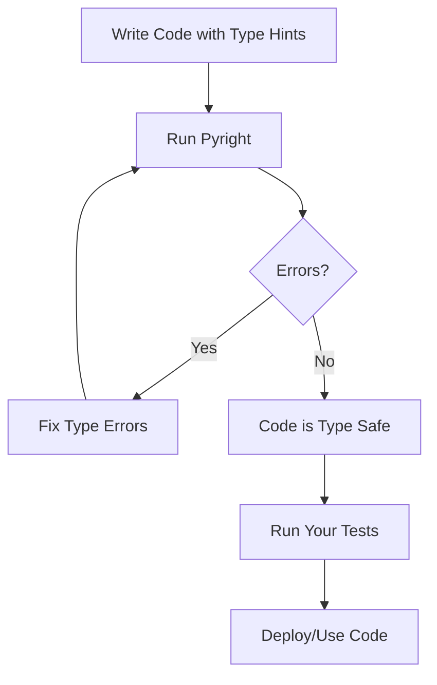
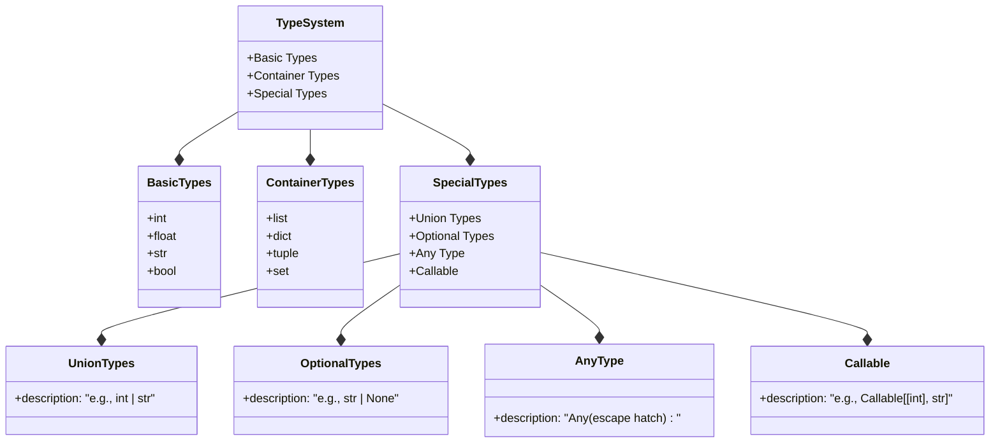

## Introduction

Static typing in Python offers a powerful way to catch errors before they happen. By adding type hints to your code, you get better documentation, improved IDE support, and early error detection without losing Python's flexibility. This crash course covers the essential 85% of what you need to know about Python's type system and how to use Pyright, Microsoft's fast and efficient static type checker.

## Prerequisites

Before we dive in, you'll need:

- Python 3.6 or newer (Python 3.10+ recommended for the newer syntax options)
- Basic understanding of Python programming
- A code editor (VS Code recommended for the best Pyright integration)

## Installation and Setup

Let's start by installing Pyright. You have two main options:

```bash
# Via pip (recommended for most Python users)
pip install pyright

# Or via npm if you already have Node.js installed
npm install -g pyright
```

After installation, verify that everything worked correctly:

```bash
pyright --version
# Should display something like: pyright 1.1.xxx
```

Now, let's set up a basic configuration file. Create a `pyrightconfig.json` in your project root:

```json
{
  "include": ["src"],
  "exclude": ["**/node_modules", "**/__pycache__"],
  "pythonVersion": "3.10",
  "typeCheckingMode": "basic"
}
```

Alternatively, you can add the configuration to your `pyproject.toml` file:

```toml
[tool.pyright]
include = ["src"]
exclude = ["**/node_modules", "**/__pycache__"]
pythonVersion = "3.10"
typeCheckingMode = "basic"
```

## Understanding Dynamic vs Static Typing

To appreciate what static typing brings to Python, let's first understand the difference:

```python
# Dynamic typing (traditional Python)
x = 10        # x is an integer
x = "Hello"   # now x is a string - perfectly valid!

# With type hints
x: int = 10   # Explicitly declare x as an integer
x = "Hello"   # Pyright will flag this as an error
```

In traditional Python, variables can change types freely—this flexibility is both a strength and a potential source of bugs. Type hints give you the best of both worlds: you still have Python's dynamic nature at runtime, but tools like Pyright can check your code beforehand to catch type-related mistakes.

## Basic Type Annotations

Let's start with the fundamental type annotations you'll use every day.

### Variable Type Annotations

The basic syntax places the type after a colon:

```python
# Basic type annotations
name: str = "Alice"           # String
age: int = 30                 # Integer
height: float = 5.9           # Float
is_active: bool = True        # Boolean

# Remember: The Python interpreter ignores these annotations,
# but Pyright uses them to check your code
```

### Function Annotations

Functions can have annotations for both parameters and return values:

```python
# Function parameter and return type annotations
def greet(name: str) -> str:
    return f"Hello, {name}!"

# Parameter types come after the colon
# Return type comes after the arrow (->)
```

### Collection Types

For collections like lists and dictionaries, you can specify what they contain:

```python
# Lists with specific item types
numbers: list[int] = [1, 2, 3]
# In Python 3.8 and earlier: from typing import List
# numbers: List[int] = [1, 2, 3]

# Dictionaries with specific key and value types
ages: dict[str, int] = {"Alice": 30, "Bob": 25}

# Tuples with specific types for each position
point: tuple[float, float] = (2.5, 3.0)

# Sets with specific item types
unique_ids: set[int] = {1, 2, 3}
```

## Union Types and Optional Values

Sometimes a variable can be one of several types. This is where union types come in:

```python
# Python 3.10+ syntax
result: int | str = "success"
result = 42  # Also valid since result can be int or str

# Pre-Python 3.10 syntax
from typing import Union
result: Union[int, str] = "success"
```

A common special case is variables that can be a specific type or `None`:

```python
# Python 3.10+ syntax
username: str | None = None

# Pre-Python 3.10 syntax
from typing import Optional
username: Optional[str] = None  # Same as str | None
```

## Type Checking in Action

Now let's see how type checking helps catch errors before your code runs:

```python
def process_user(user_id: int) -> str:
    return "User: " + user_id  # Error: can't add int to str
    # Correct version: return "User: " + str(user_id)
```

One of the powerful features of Pyright is that it understands type narrowing through conditionals:

```python
def process_value(value: int | str) -> str:
    if isinstance(value, int):
        # Pyright knows value is an int in this block
        return str(value * 2)
    else:
        # Pyright knows value is a str in this block
        return value.upper()
```

Similarly, Pyright recognizes None checks:

```python
def greet_user(user: str | None) -> str:
    if user is None:
        return "Hello, guest!"
    # Pyright knows user is a str here
    return f"Hello, {user}!"
```

## Advanced Type Hints

As your codebase grows, you'll need more sophisticated type annotations.

### Complex Container Types

You can nest container types to match complex data structures:

```python
# Nested containers
matrix: list[list[int]] = [[1, 2], [3, 4]]

# Variable-length tuples (records)
records: list[tuple[str, int, bool]] = [
    ("Alice", 30, True),
    ("Bob", 25, False)
]

# Dictionary with specific key and value types
config: dict[str, str | int | bool] = {
    "name": "MyApp",
    "version": 1,
    "debug": True
}
```

### Callable Types

For functions that accept other functions as arguments:

```python
from typing import Callable

# A function that takes an int and returns a str
def format_data(formatter: Callable[[int], str], value: int) -> str:
    return formatter(value)

# Usage
def as_dollars(cents: int) -> str:
    return f"${cents/100:.2f}"

result = format_data(as_dollars, 1250)  # "$12.50"
```

### Type Aliases

When you have complex types that you use repeatedly, type aliases help keep your code clean:

```python
from typing import TypeAlias

# Define a type alias
UserRecord: TypeAlias = dict[str, str | int | bool]

# Use the alias
def process_user(user: UserRecord) -> None:
    print(f"Processing user: {user['name']}")
```

## Running Pyright

With your code annotated, it's time to run Pyright. The basic usage is straightforward:

```bash
# Check entire project
pyright

# Check specific files or directories
pyright src/main.py
pyright src/models/
```

When Pyright finds an issue, it provides clear error messages:

```python
def greeting(name: str) -> str:
    return 0  # Error!

# Pyright error:
# Expression of type "Literal[0]" cannot be assigned to return type "str"
```

Common errors that Pyright helps catch include:

- Incompatible return types
- Argument type mismatches
- Accessing attributes that don't exist
- Operations between incompatible types

## The Type Checking Workflow

Type checking fits naturally into your development workflow:



This process helps catch many errors before your code even runs, saving you debugging time later.

## Type Hierarchy in Python

Understanding how types relate to each other helps you write better annotations:



- Union Types allow combining types.
- Optional Types include None.

## Practical Type Checking Patterns

Let's look at some real-world patterns for effective type checking.

### Gradual Typing

You don't need to add types to your entire codebase at once. Start with critical components and gradually expand:

```python
# Phase 1: Add type hints to function signatures
def calculate_discount(price: float, percentage: float) -> float:
    return price * (percentage / 100)

# Phase 2: Add type hints to internal variables
def calculate_discount(price: float, percentage: float) -> float:
    discount_factor: float = percentage / 100
    return price * discount_factor
```

### Type Guards

Type guards help Pyright understand when types narrow within code blocks:

```python
def process_item(item: str | int) -> str:
    if isinstance(item, str):
        # Pyright knows item is a string here
        return item.upper()
    else:
        # Pyright knows item is an int here
        return str(item * 2)
```

### Working with External Libraries

Not all libraries have type hints. Here's how to handle those cases:

```python
from typing import Any, cast

# For libraries without type hints
result: Any = untyped_library_function()

# Type assertion when you know better than the type checker
user_id = cast(int, get_user_id_somehow())

# Ignore specific lines when necessary
some_operation()  # type: ignore # Reason for ignoring
```

## Best Practices

Based on real-world experience with Python type hints, here are key best practices:

1. **Start gradually**: Begin with function signatures in critical code paths, then expand
2. **Be consistent**: Apply similar type annotation patterns throughout your code
3. **Don't over-specify**: Use `Any` where appropriate to avoid overly restrictive types
4. **Revisit regularly**: Update type hints as your understanding of the code evolves
5. **Use type ignore sparingly**: Only use `# type: ignore` with a comment explaining why

## The Remaining 15%: Advanced Topics

While this crash course covers the essential 85%, here are the advanced topics you can explore to master Python static typing:

1. **Generic Type Parameters**

   - Creating reusable types with `TypeVar`
   - Example: `T = TypeVar('T')` and `def first(items: list[T]) -> T`
   - Bounded type variables with constraints

2. **Protocols and Structural Typing**

   - Using `Protocol` for duck typing
   - Focusing on what an object can do rather than its class hierarchy

3. **Literal Types and TypedDict**

   - Restricting values to specific literals: `Mode = Literal["read", "write"]`
   - Defining dictionary structures with `TypedDict`

4. **Type Overloads**

   - Defining multiple function signatures for the same function
   - Handling complex conditional return types

5. **Pyright-specific Features**

   - Strictness levels and configuration options
   - Using `.pyi` stub files for third-party libraries

6. **Testing Type Correctness**

   - Integrating Pyright in CI/CD pipelines
   - Monitoring type coverage in your codebase

7. **Type Narrowing Advanced Patterns**
   - User-defined type guards
   - Using the `assert` statement for type narrowing

## Resources for Further Learning

To deepen your understanding of Python static typing:

- [Pyright GitHub Repository](https://github.com/microsoft/pyright) - The official source
- [Type Concepts Documentation](https://github.com/microsoft/pyright/blob/main/docs/type-concepts.md) - Deep dives into type theory
- [Python Typing Documentation](https://docs.python.org/3/library/typing.html) - The standard library's typing module
- [mypy Documentation](https://mypy.readthedocs.io/) - Another popular type checker with useful guides

## Summary

Python's static typing system paired with Pyright gives you the best of both worlds: Python's flexibility with the safety and tooling benefits of static typing. Starting with the fundamentals covered in this crash course—basic annotations, union types, and common patterns—you'll catch errors earlier, write more self-documenting code, and enjoy better IDE support.

As you become more comfortable with the basics, you can explore the advanced topics to handle even the most complex typing scenarios. The investment in learning Python's type system pays off through fewer bugs, better code documentation, and a more pleasant development experience.
