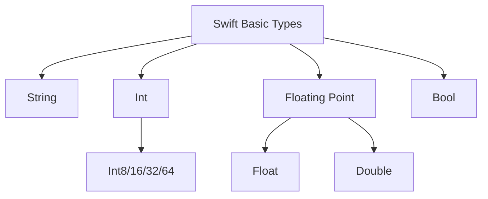
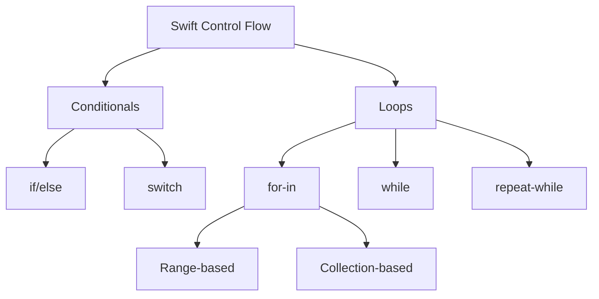
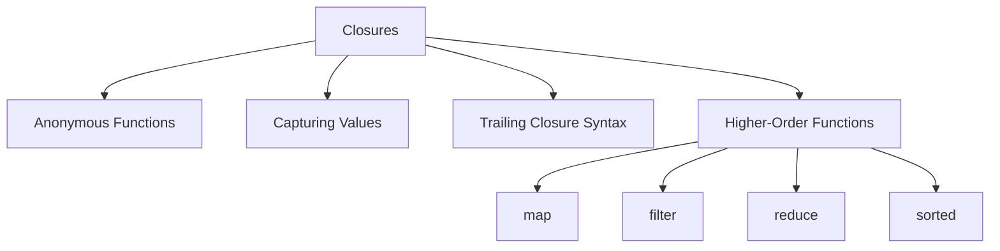
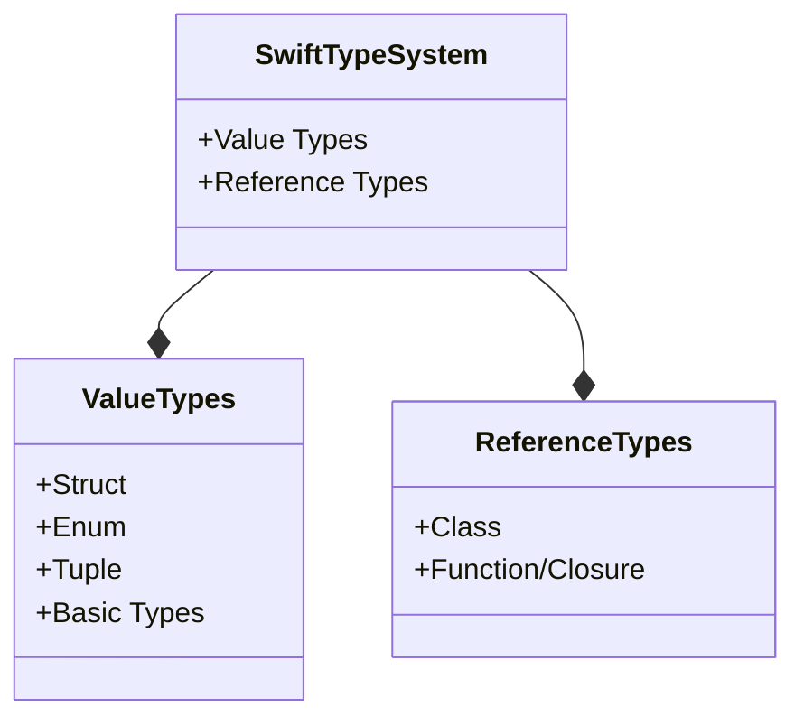
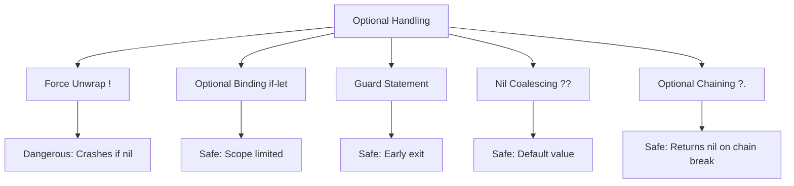
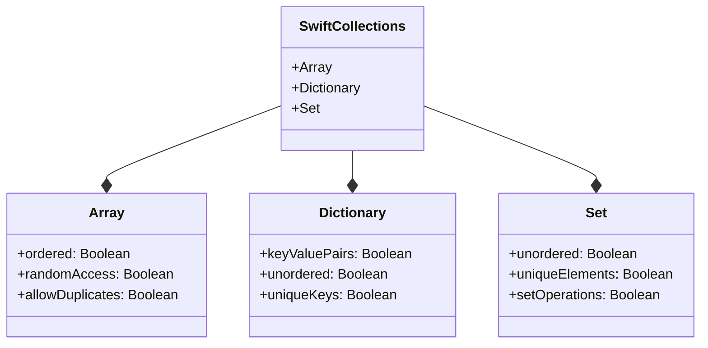

Welcome to your Swift crash course! Swift is Apple's powerful, intuitive programming language for building iOS, macOS, watchOS, and tvOS applications. I'll cover the essential 85% you'll need day-to-day while preparing you to explore the remaining 15% independently.

## Getting Started with Swift

### Installation and Setup

Before we dive into the language itself, let's get your development environment ready:

**For macOS users:**

- Download Xcode from the Mac App Store (it includes the Swift compiler, debugger, and iOS simulator)
- Open Xcode and create a new "Playground" to start writing Swift code immediately

**For Windows/Linux users:**

- Download the Swift toolchain from [swift.org](https://swift.org/download/)
- Install a code editor like Visual Studio Code
- Run Swift code via Terminal

After installation, verify it works by opening Terminal and running:

```bash
swift --version
```

## Swift Fundamentals

Now that you're set up, let's explore the core concepts that make Swift such a powerful language.

### Variables and Constants

Swift uses two main ways to store data, which gives you control over whether values can change:

```swift
// Variables (can change later)
var name = "John"
name = "John Smith" // This works fine

// Constants (cannot change once set)
let maxAttempts = 3
// maxAttempts = 5 // This would cause an error!
```

Using constants (`let`) whenever possible is considered a best practice in Swift as it makes your code safer and more predictable.

### Basic Data Types

Swift has several built-in types to represent different kinds of data:

```swift
// String - text values
let message: String = "Hello, Swift!"

// Int - whole numbers
let age: Int = 30

// Double - decimal numbers (more precision)
let pi: Double = 3.14159

// Float - decimal numbers (less precision)
let price: Float = 19.99

// Bool - true/false values
let isComplete: Bool = false
```

One of Swift's great features is type inference, which means the compiler can often determine the type automatically, making your code cleaner:

```swift
// Swift knows these are String, Int, and Double
let inferredString = "Hello"
let inferredInt = 42
let inferredDouble = 3.14
```

Here's a visual representation of Swift's type hierarchy:



### Operators

Swift provides a full range of operators that will be familiar if you've used other programming languages:

```swift
// Arithmetic
let sum = 5 + 3       // 8
let difference = 10 - 2   // 8
let product = 4 * 2   // 8
let quotient = 8 / 2  // 4
let remainder = 9 % 4 // 1 (modulo/remainder)

// Comparison
let isEqual = 5 == 5          // true
let isNotEqual = 5 != 6       // true
let isGreater = 7 > 3         // true
let isLess = 2 < 9            // true
let isGreaterOrEqual = 5 >= 5 // true
let isLessOrEqual = 3 <= 3    // true

// Logical
let and = true && true  // true (both must be true)
let or = true || false  // true (at least one must be true)
let not = !true         // false (negates the value)
```

These operators form the building blocks for more complex expressions and conditions we'll use throughout our Swift journey.

### Control Flow

Now that we can store and manipulate data, we need ways to control the flow of our program based on conditions and to repeat tasks.

#### Conditional Statements

Swift offers flexible ways to make decisions in your code:

```swift
// if-else statement
let temperature = 25
if temperature > 30 {
    print("It's hot outside!")
} else if temperature > 20 {
    print("It's a nice day!") // This will print
} else {
    print("It's cold outside!")
}

// switch statement (must be exhaustive)
let dayOfWeek = 3
switch dayOfWeek {
case 1:
    print("Monday")
case 2:
    print("Tuesday")
case 3:
    print("Wednesday") // This will print
case 4:
    print("Thursday")
case 5:
    print("Friday")
case 6, 7: // Multiple cases at once
    print("Weekend")
default: // Catches any other values
    print("Invalid day")
}
```

Swift's `switch` statements are more powerful than in many other languages—they don't fall through by default, and they must cover all possible values (being "exhaustive").

#### Loops

When you need to repeat an action multiple times, loops are your tool of choice:

```swift
// For loop with closed range (includes both ends)
for i in 1...5 {
    print(i) // Prints 1, 2, 3, 4, 5
}

// For loop with half-open range (excludes the end)
for i in 1..<5 {
    print(i) // Prints 1, 2, 3, 4
}

// While loop (checks condition first)
var counter = 5
while counter > 0 {
    print(counter) // Prints 5, 4, 3, 2, 1
    counter -= 1
}

// Repeat-while loop (executes at least once)
var number = 1
repeat {
    print(number) // Prints 1, 2, 3
    number += 1
} while number <= 3
```

Here's a visualization of Swift's control flow structures:



### Functions

Functions let you encapsulate reusable pieces of code, making your programs more organized and maintainable:

```swift
// Basic function
func greet() {
    print("Hello!")
}
greet() // Calls the function

// Function with parameters
func greet(person: String) {
    print("Hello, \(person)!")
}
greet(person: "Alex") // Prints: Hello, Alex!

// Function with return value
func add(a: Int, b: Int) -> Int {
    return a + b
}
let result = add(a: 5, b: 3)
print(result) // Prints: 8
```

Swift functions can return multiple values using tuples, which is very convenient:

```swift
// Function returning multiple values with tuple
func getMinMax(array: [Int]) -> (min: Int, max: Int) {
    var currentMin = array[0]
    var currentMax = array[0]

    for value in array[1..<array.count] {
        if value < currentMin {
            currentMin = value
        }
        if value > currentMax {
            currentMax = value
        }
    }

    return (currentMin, currentMax) // Returns a tuple
}

let bounds = getMinMax(array: [8, 3, 10, 4, 2])
print("Min: \(bounds.min), Max: \(bounds.max)") // Prints: Min: 2, Max: 10
```

Swift also offers flexible parameter naming to make function calls more readable:

```swift
// External and internal parameter names
func greet(to person: String, with message: String) {
    print("\(message), \(person)!")
}
greet(to: "Dave", with: "Good morning") // Prints: Good morning, Dave!

// Default parameter values
func greet(person: String, message: String = "Hello") {
    print("\(message), \(person)!")
}
greet(person: "Emma") // Uses default: Hello, Emma!
greet(person: "Frank", message: "Hi") // Overrides default: Hi, Frank!
```

Functions are a cornerstone of Swift development, and we'll see them throughout our coding journey.

### Closures

Taking functions a step further, Swift provides closures—self-contained blocks of functionality that can be passed around in your code:

```swift
// Basic closure
let sayHi = { print("Hi!") }
sayHi() // Prints: Hi!

// Closure with parameters and return value
let multiply = { (a: Int, b: Int) -> Int in
    return a * b
}
print(multiply(4, 5)) // Prints: 20
```

Closures really shine when used with Swift's collection functions:

```swift
// Using closures with functions
let numbers = [1, 5, 3, 8, 2]

// Sorting with a closure
let sortedNumbers = numbers.sorted { $0 < $1 }
print(sortedNumbers) // Prints: [1, 2, 3, 5, 8]

// Filtering with a closure
let filteredNumbers = numbers.filter { $0 > 3 }
print(filteredNumbers) // Prints: [5, 8]

// Mapping with a closure
let doubledNumbers = numbers.map { $0 * 2 }
print(doubledNumbers) // Prints: [2, 10, 6, 16, 4]
```

Closures are the foundation of Swift's functional programming capabilities, as visualized here:



### Structures (Structs)

Moving into more complex data structures, Swift offers structures to combine related properties and behaviors:

```swift
struct Person {
    // Properties
    var name: String
    var age: Int

    // Methods
    func describe() {
        print("I'm \(name), \(age) years old")
    }

    // Mutating method (can change properties)
    mutating func celebrateBirthday() {
        age += 1
    }
}

// Create an instance
var john = Person(name: "John", age: 25)
john.describe() // Prints: I'm John, 25 years old
john.celebrateBirthday()
print(john.age) // Prints: 26
```

A key characteristic of structs is that they're value types, meaning they're copied when assigned:

```swift
// Structs are copied when assigned
var jane = john
jane.name = "Jane"
print(john.name) // Still "John" - they're independent copies
print(jane.name) // "Jane"
```

Structs are the recommended default for most custom data types in Swift because of their predictable behavior and performance.

### Classes

While structs are great for many use cases, classes offer additional capabilities, particularly inheritance:

```swift
class Vehicle {
    // Properties
    var brand: String
    var year: Int

    // Initializer (constructor)
    init(brand: String, year: Int) {
        self.brand = brand
        self.year = year
    }

    // Methods
    func description() -> String {
        return "\(year) \(brand)"
    }
}

// Create an instance
let car = Vehicle(brand: "Toyota", year: 2022)
print(car.description()) // Prints: 2022 Toyota
```

The power of classes becomes evident when we use inheritance to build specialized types:

```swift
// Inheritance
class Car: Vehicle {
    var numberOfDoors: Int

    init(brand: String, year: Int, numberOfDoors: Int) {
        self.numberOfDoors = numberOfDoors
        super.init(brand: brand, year: year)
    }

    // Override method
    override func description() -> String {
        return "\(super.description()) with \(numberOfDoors) doors"
    }
}

let myCar = Car(brand: "Honda", year: 2021, numberOfDoors: 4)
print(myCar.description()) // Prints: 2021 Honda with 4 doors
```

Unlike structs, classes are reference types, which means variables point to the same instance:

```swift
// Classes are reference types
let car1 = Vehicle(brand: "Ford", year: 2023)
let car2 = car1 // car2 references the same object
car2.year = 2024
print(car1.year) // Prints: 2024 (both variables reference same object)
```

The differences between structs and classes are important to understand:



- Value Types are copied when assigned.
- Reference Types are referenced when assigned.

### Enumerations (Enums)

Enums provide a way to define a group of related values and work with them in a type-safe way:

```swift
// Basic enum
enum Direction {
    case north
    case south
    case east
    case west
}

var currentDirection = Direction.north
// Once type is known, you can use shorter dot syntax
currentDirection = .south

// Switch with enum (must be exhaustive)
switch currentDirection {
case .north:
    print("Heading north")
case .south:
    print("Heading south") // This will print
case .east:
    print("Heading east")
case .west:
    print("Heading west")
}
```

Swift enums are more powerful than in many other languages, supporting associated values:

```swift
// Enum with associated values
enum Barcode {
    case upc(Int, Int, Int, Int)
    case qrCode(String)
}

let productBarcode = Barcode.upc(8, 85909, 51226, 3)
```

They can also have raw values, which are especially useful when working with external data:

```swift
// Enum with raw values
enum Planet: Int {
    case mercury = 1, venus, earth, mars, jupiter, saturn, uranus, neptune
}

// Access raw value
print(Planet.earth.rawValue) // Prints: 3

// Create from raw value (returns optional)
if let planet = Planet(rawValue: 4) {
    print("Found planet: \(planet)") // Prints: Found planet: mars
}
```

Enums help make your code more readable and type-safe by grouping related values together.

### Protocols

Protocols are a powerful feature that define a blueprint of methods and properties:

```swift
protocol Vehicle {
    // Required properties
    var brand: String { get } // Read-only
    var year: Int { get set } // Read-write

    // Required methods
    func startEngine() -> String
}
```

Both structs and classes can implement protocols:

```swift
// Implement protocol with struct
struct Car: Vehicle {
    let brand: String // Read-only property
    var year: Int     // Read-write property

    func startEngine() -> String {
        return "Vroom!"
    }
}

// Implement protocol with class
class Motorcycle: Vehicle {
    let brand: String
    var year: Int

    init(brand: String, year: Int) {
        self.brand = brand
        self.year = year
    }

    func startEngine() -> String {
        return "Vrooom vroom!"
    }
}
```

The power of protocols comes from their ability to create polymorphic code:

```swift
// Function accepting any Vehicle type
func describeVehicle(_ vehicle: Vehicle) {
    print("A \(vehicle.year) \(vehicle.brand)")
    print("Engine sound: \(vehicle.startEngine())")
}

let car = Car(brand: "Ford", year: 2023)
let motorcycle = Motorcycle(brand: "Harley", year: 2022)

describeVehicle(car) // Works with Car
describeVehicle(motorcycle) // Works with Motorcycle
```

Protocols are a foundation of Swift's protocol-oriented programming paradigm, which encourages composition over inheritance.

### Extensions

Extensions let you add new functionality to existing types, even ones you don't own:

```swift
// Extend built-in String type
extension String {
    func isPalindrome() -> Bool {
        let characters = self.lowercased().filter { $0.isLetter }
        return characters == String(characters.reversed())
    }
}

print("radar".isPalindrome()) // Prints: true
print("hello".isPalindrome()) // Prints: false
```

Extensions also work well with protocols to provide default implementations:

```swift
// Extend protocol
extension Vehicle {
    func vehicleDetails() -> String {
        return "A \(year) \(brand) vehicle"
    }
}

print(car.vehicleDetails()) // Prints: A 2023 Ford vehicle
```

This extension-based approach allows for more modular and maintainable code.

### Optionals

Swift's type safety is enhanced by optionals, which represent values that might be absent:

```swift
// Declaring an optional
var name: String? = "John"
name = nil // Valid - can be set to nil
```

There are several ways to safely work with optionals:

```swift
// Optional binding (if-let)
if let unwrappedName = name {
    print("Hello, \(unwrappedName)!") // Prints if name isn't nil
} else {
    print("Name is nil")
}

// Guard statement (early exit pattern)
func greet(person: String?) {
    guard let name = person else {
        print("No name provided")
        return
    }

    // name is now non-optional within this scope
    print("Hello, \(name)!")
}

// Nil coalescing operator
name = nil
let displayName = name ?? "Anonymous" // "Anonymous" if name is nil
```

Optional chaining allows you to safely access properties through a chain of optionals:

```swift
// Optional chaining
struct Person {
    var address: Address?
}

struct Address {
    var street: String?
}

let person: Person? = Person(address: Address(street: "123 Main St"))
let street = person?.address?.street // Returns optional String
print(street ?? "Unknown street") // Prints: 123 Main St (or "Unknown street" if any part is nil)
```

Here's a visual guide to handling optionals:



Understanding optionals is crucial for writing safe and robust Swift code.

### Error Handling

Swift provides a structured approach to handling errors:

```swift
// Define error types
enum NetworkError: Error {
    case badURL
    case noData
    case decodingError
}

// Function that throws errors
func fetchData(from urlString: String) throws -> Data {
    guard let url = URL(string: urlString) else {
        throw NetworkError.badURL
    }

    // Simulated data fetching
    if urlString.contains("example.com") {
        return Data() // Return empty data for this example
    } else {
        throw NetworkError.noData
    }
}
```

You handle these errors using the do-catch pattern:

```swift
// Using do-catch to handle errors
do {
    let data = try fetchData(from: "https://example.com/data")
    print("Data fetched successfully")
} catch NetworkError.badURL {
    print("Invalid URL")
} catch NetworkError.noData {
    print("No data received")
} catch {
    print("Unknown error: \(error)")
}
```

For simpler error handling, you can convert errors to optionals:

```swift
// Try? converts throws to optional
let data = try? fetchData(from: "https://example.com/data")
// If successful, data contains Data, otherwise nil
```

Error handling in Swift encourages you to explicitly account for possible failure points, making your code more robust.

### Collections

Swift provides three main collection types to store groups of related items:

#### Arrays

Arrays store ordered collections of values:

```swift
// Creating arrays
var numbers = [1, 2, 3, 4, 5]
var strings = [String]() // Empty array

// Adding elements
numbers.append(6)
numbers += [7, 8]

// Accessing elements
print(numbers[0]) // First element (1)
print(numbers.first) // Optional first element
print(numbers.last) // Optional last element

// Modifying arrays
numbers[0] = 10 // Replace element
numbers.insert(0, at: 0) // Insert at start
numbers.remove(at: 2) // Remove third element
```

Arrays work well with Swift's higher-order functions:

```swift
// Higher-order functions
let doubled = numbers.map { $0 * 2 } // Multiply each element by 2
let evenNumbers = numbers.filter { $0 % 2 == 0 } // Keep only even numbers
let sum = numbers.reduce(0, +) // Sum all elements
```

#### Dictionaries

Dictionaries store unordered collections of key-value pairs:

```swift
// Creating dictionaries
var scores = ["Amy": 95, "Bob": 87, "Charlie": 92]
var emptyDict = [String: Int]() // Empty dictionary

// Adding and modifying entries
scores["David"] = 88 // Add new entry
scores["Amy"] = 97 // Modify existing entry

// Accessing values (returns optional)
if let amyScore = scores["Amy"] {
    print("Amy's score: \(amyScore)") // Prints: Amy's score: 97
}

// Removing entries
scores["Charlie"] = nil // Remove by setting to nil
scores.removeValue(forKey: "Bob") // Remove and return the value
```

Dictionaries are great for lookups and transformations:

```swift
// Dictionary transformations
let names = Array(scores.keys) // Get array of keys
let allScores = Array(scores.values) // Get array of values
let passedStudents = scores.filter { $0.value >= 90 } // Filter by value
```

#### Sets

Sets store unordered collections of unique values:

```swift
// Creating sets
var fruits: Set = ["apple", "orange", "banana"]
var emptySet = Set<String>() // Empty set

// Adding and removing elements
fruits.insert("pear") // Add element
fruits.remove("banana") // Remove element

// Checking membership
if fruits.contains("apple") {
    print("We have apples") // Will print
}
```

Sets excel at mathematical set operations:

```swift
// Set operations
let a: Set = [1, 2, 3, 4]
let b: Set = [3, 4, 5, 6]

let union = a.union(b) // [1, 2, 3, 4, 5, 6]
let intersection = a.intersection(b) // [3, 4]
let difference = a.subtracting(b) // [1, 2]
let symmetricDifference = a.symmetricDifference(b) // [1, 2, 5, 6]
```

Here's how these collection types compare:



- Array is ordered and allows duplicates.
- Dictionary is unordered with unique keys.
- Set is unordered with unique elements.

Choosing the right collection type for your data can significantly impact your app's performance and code clarity.

## The Remaining 15%: Advanced Topics

Now that you've mastered the essential 85% of Swift, here's what to explore next:

### 1. Advanced Generics

Generics allow you to write flexible, reusable code that works with any data type:

```swift
// Basic generic function (T is a placeholder type)
func swapValues<T>(_ a: inout T, _ b: inout T) {
    let temp = a
    a = b
    b = temp
}

// Generic types with constraints (T must conform to Equatable)
func findIndex<T: Equatable>(of valueToFind: T, in array: [T]) -> Int? {
    for (index, value) in array.enumerated() {
        if value == valueToFind {
            return index
        }
    }
    return nil
}
```

Generics are the foundation of Swift's standard library and allow for type-safe, reusable code.

### 2. Protocol-Oriented Programming

Swift encourages building functionality through protocol extensions rather than class inheritance:

```swift
protocol Bird {
    var name: String { get }
    var canFly: Bool { get }
}

// Default implementation through extension
extension Bird {
    var canFly: Bool { return true }
}

struct Penguin: Bird {
    let name: String
    let canFly = false // Override default
}

struct Eagle: Bird {
    let name: String
    // Uses default canFly implementation
}
```

This approach allows for more flexible code composition without the limitations of single inheritance.

### 3. Concurrency and Asynchronous Programming

Modern Swift concurrency features (Swift 5.5+) make asynchronous programming more readable:

```swift
// Asynchronous function
func fetchUser() async throws -> User {
    // Network request code here
}

// Calling async function
Task {
    do {
        let user = try await fetchUser()
        print("Fetched user: \(user.name)")
    } catch {
        print("Error fetching user: \(error)")
    }
}
```

These features help manage complex asynchronous workflows without callback pyramids or completion handlers.

### 4. Memory Management (ARC)

Swift uses Automatic Reference Counting for memory management, but you need to be aware of reference cycles:

```swift
class Person {
    let name: String
    var apartment: Apartment?

    init(name: String) {
        self.name = name
    }

    deinit {
        print("\(name) is being deinitialized")
    }
}

class Apartment {
    let unit: String
    weak var tenant: Person? // Weak reference prevents retain cycles

    init(unit: String) {
        self.unit = unit
    }

    deinit {
        print("Apartment \(unit) is being deinitialized")
    }
}
```

Understanding memory management is crucial for preventing memory leaks in more complex applications.

### 5. Custom Operators

Swift allows you to define your own operators for specific operations:

```swift
// Define a custom operator
infix operator **: BitwiseShiftPrecedence

// Implement for specific types
func ** (base: Double, power: Double) -> Double {
    return pow(base, power)
}

let result = 2.0 ** 3.0 // 8.0
```

Custom operators can make code more expressive but should be used judiciously to maintain readability.

## Conclusion and Next Steps

Congratulations! You've now learned the essential 85% of Swift that you'll use in your daily programming. You've covered:

- Swift fundamentals and syntax
- Control flow and functions
- Object-oriented programming with structs and classes
- Protocol-oriented programming
- Error handling and optionals
- Collections and data manipulation

This knowledge provides a solid foundation for building real Swift applications. To continue your Swift journey:

1. **Build real projects**: Create small apps that interest you to reinforce what you've learned
2. **Explore Apple's documentation**: The [official Swift docs](https://swift.org/documentation/) are excellent for deeper dives
3. **Dive into UI frameworks**: Learn SwiftUI or UIKit for building user interfaces
4. **Join the Swift community**: Engage with other developers online to learn best practices
5. **Practice regularly**: Try coding challenges on platforms like LeetCode or HackerRank

Remember, programming is a skill best learned by doing. Take what you've learned here and start building your own Swift applications! The remaining 15% of advanced topics will naturally come into play as you tackle real-world problems and expand your skills.
