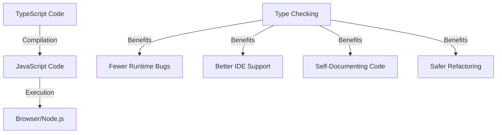
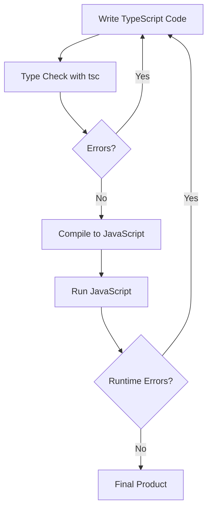

Welcome to your TypeScript crash course! I'll cover the core 85% of TypeScript you'll use daily, giving you the foundation to explore the remaining 15% on your own.

## Introduction to TypeScript

TypeScript is an open-source language developed by Microsoft that builds on JavaScript. It's a **superset** of JavaScript, meaning any valid JavaScript code is also valid TypeScript code. This makes it an excellent choice for gradually adopting type safety in existing JavaScript projects.

### Why TypeScript?

TypeScript adds static typing to JavaScript, offering several key benefits:

- **Static type checking**: Catch errors during development rather than at runtime
- **Enhanced IDE support**: Better autocompletion and navigation makes you more productive
- **Improved maintainability**: Types serve as documentation, making code easier to understand
- **Safer refactoring**: The compiler catches potential issues when you change code



## Getting Started

Before diving into TypeScript's features, let's set up a proper development environment to help you practice as you learn.

### Prerequisites

- Basic JavaScript knowledge
- Node.js installed on your computer

### Installation

First, you'll need to install TypeScript using npm, which comes with Node.js:

```bash
# Install TypeScript globally
npm install -g typescript

# Verify installation
tsc --version
```

### Project Setup

Now let's create a simple project structure to help organize your TypeScript files:

```bash
# Create project directory
mkdir my-ts-project
cd my-ts-project

# Initialize npm project
npm init -y

# Install TypeScript as a dev dependency
npm install typescript --save-dev

# Generate tsconfig.json
npx tsc --init
```

### Configuration: tsconfig.json

The generated `tsconfig.json` file is quite verbose, but here's a simplified version with the most important settings:

```json
{
  "compilerOptions": {
    "target": "es6", // JavaScript version to compile to
    "module": "commonjs", // Module system to use
    "strict": true, // Enable strict type checking
    "outDir": "./dist", // Output directory for compiled files
    "rootDir": "./src", // Source directory for TypeScript files
    "esModuleInterop": true // Better import/export compatibility
  },
  "include": ["src/**/*"] // Files to include in compilation
}
```

### Project Structure

A well-organized TypeScript project typically follows this structure:

```
my-ts-project/
├── node_modules/
├── src/               // Your TypeScript files go here
│   └── index.ts
├── dist/              // Compiled JavaScript output
├── package.json
└── tsconfig.json
```

### Compilation

With our project set up, we can now compile TypeScript to JavaScript:

```bash
# Compile once
npx tsc

# Compile and watch for changes
npx tsc --watch
```

Now that we have our environment ready, let's explore TypeScript's core features.

## TypeScript Fundamentals

The heart of TypeScript is its type system, which brings static typing to JavaScript. Let's start with the basic building blocks.

### Basic Types

TypeScript extends JavaScript's primitive types with additional type annotations:

```typescript
// Primitive types
let isDone: boolean = false; // boolean: true or false
let age: number = 30; // number: integers, floats, etc.
let fullName: string = 'John Doe'; // string: text values

// Special types
let notSure: any = 4; // any: opt out of type checking
let nothing: null = null; // null: explicit absence of value
let missing: undefined = undefined; // undefined: uninitialized value
let neverReturns: never = (() => {
  // never: function that never returns
  throw new Error('Error');
})();
let empty: void = undefined; // void: absence of any type

// Type inference (TypeScript guesses the type from the value)
let inferred = 'This is a string'; // Type: string
// inferred = 42; // Error: Type 'number' is not assignable to type 'string'
```

Once variables have a type, TypeScript enforces it, preventing common mistakes like trying to use a string where a number is expected.

### Arrays and Tuples

When working with collections of data, TypeScript provides typed arrays and tuples:

```typescript
// Arrays: collection of the same type
let numbers: number[] = [1, 2, 3, 4, 5];
let names: Array<string> = ['Alice', 'Bob', 'Charlie'];

// Tuples: fixed-length arrays with specific types at specific positions
let person: [string, number] = ['John', 30]; // Name and age
// person = [42, "John"]; // Error: wrong order of types
```

Tuples are particularly useful when you need a fixed structure but don't want to create a full class or interface.

### Enums

For sets of related constants, TypeScript offers enums:

```typescript
// Enum: a set of named constants
enum Direction {
  Up, // 0
  Down, // 1
  Left, // 2
  Right, // 3
}

let move: Direction = Direction.Up;
console.log(move); // Output: 0

// String enums
enum HttpStatus {
  OK = 'OK',
  NOT_FOUND = 'NOT_FOUND',
  ERROR = 'ERROR',
}

let status: HttpStatus = HttpStatus.OK;
console.log(status); // Output: "OK"
```

Enums help make your code more readable by giving meaningful names to numeric values.

### Type Aliases and Interfaces

As your application grows, you'll need to define custom types. TypeScript offers two primary ways to do this:

```typescript
// Type alias: define a custom type
type Point = {
  x: number;
  y: number;
};

const point: Point = { x: 10, y: 20 };

// Interface: similar to type alias but more extendable
interface User {
  id: number;
  name: string;
  email: string;
  age?: number; // Optional property (may be undefined)
  readonly createdAt: Date; // Can't be modified after creation
}

const user: User = {
  id: 1,
  name: 'John',
  email: 'john@example.com',
  createdAt: new Date(),
};

// user.createdAt = new Date(); // Error: readonly property
```

Interfaces and type aliases are similar, but interfaces are generally preferred for object shapes as they support extension and implementation.

### Union and Intersection Types

TypeScript allows combining types in flexible ways:

```typescript
// Union type: value can be one of several types
type ID = string | number;

function printID(id: ID) {
  console.log(`ID: ${id}`);

  // Type narrowing (checking the type at runtime)
  if (typeof id === 'string') {
    console.log(id.toUpperCase()); // Safe to use string methods
  } else {
    console.log(id.toFixed(0)); // Safe to use number methods
  }
}

// Intersection type: combine multiple types
type Employee = {
  id: number;
  name: string;
};

type Manager = {
  department: string;
  level: number;
};

// Combines all properties from both types
type ManagerEmployee = Employee & Manager;

const manager: ManagerEmployee = {
  id: 1,
  name: 'John',
  department: 'Engineering',
  level: 2,
};
```

Union types are especially powerful when dealing with functions that can accept different types of inputs, while intersection types help in composing complex types from simpler ones.

## Functions in TypeScript

Now that we understand basic types, let's see how TypeScript enhances JavaScript functions with type safety.

### Function Declarations

TypeScript allows annotating function parameters and return types:

```typescript
// Basic function with type annotations
function add(a: number, b: number): number {
  return a + b; // Must return a number
}

// Function expression with type annotation
const subtract = function (a: number, b: number): number {
  return a - b;
};

// Arrow function
const multiply = (a: number, b: number): number => a * b;

// Function type signature
let mathOperation: (x: number, y: number) => number;
mathOperation = add; // Valid
// mathOperation = "add"; // Error: not a function
```

Type annotations make your function contracts explicit, ensuring correct usage and helping with documentation.

### Optional and Default Parameters

TypeScript provides flexible parameter handling:

```typescript
// Optional parameter (may be undefined)
function greet(name: string, title?: string): string {
  if (title) {
    return `Hello, ${title} ${name}!`;
  }
  return `Hello, ${name}!`;
}

console.log(greet('John')); // Output: "Hello, John!"
console.log(greet('John', 'Mr.')); // Output: "Hello, Mr. John!"

// Default parameter
function welcome(name: string, greeting = 'Hello'): string {
  return `${greeting}, ${name}!`;
}

console.log(welcome('John')); // Output: "Hello, John!"
console.log(welcome('John', 'Welcome')); // Output: "Welcome, John!"
```

Optional parameters (marked with `?`) and default parameters help create flexible function interfaces while maintaining type safety.

### Rest Parameters and Function Overloads

For more advanced function patterns:

```typescript
// Rest parameters (variable number of arguments)
function sum(...numbers: number[]): number {
  return numbers.reduce((total, n) => total + n, 0);
}

console.log(sum(1, 2)); // Output: 3
console.log(sum(1, 2, 3, 4)); // Output: 10

// Function overloads
function convert(value: string): number;
function convert(value: number): string;
function convert(value: string | number): string | number {
  // Implementation for both overloads
  if (typeof value === 'string') {
    return parseInt(value, 10);
  } else {
    return value.toString();
  }
}

const num = convert('42'); // Returns number 42
const str = convert(42); // Returns string "42"
```

Function overloads allow you to define multiple function signatures for the same function, providing more specific type information based on the parameters.

## Object-Oriented Programming

TypeScript enhances JavaScript's class-based OOP features with additional type safety and features from traditional OOP languages.

### Classes

Classes in TypeScript add access modifiers and type annotations:

```typescript
class Person {
  // Properties with access modifiers
  private _name: string; // Only accessible within this class
  protected age: number; // Accessible in this class and subclasses
  readonly id: number; // Can't be modified after initialization

  // Constructor runs when new instance is created
  constructor(name: string, age: number, id: number) {
    this._name = name;
    this.age = age;
    this.id = id;
  }

  // Getter: access a property with validation/computation
  get name(): string {
    return this._name;
  }

  // Setter: modify a property with validation
  set name(value: string) {
    if (value.length > 0) {
      this._name = value;
    } else {
      throw new Error('Name cannot be empty');
    }
  }

  // Method
  greet(): string {
    return `Hello, my name is ${this._name} and I'm ${this.age} years old`;
  }
}

// Using the class
const john = new Person('John', 30, 1);
console.log(john.name); // Using getter: "John"
john.name = 'Johnny'; // Using setter
// john.id = 2;              // Error: readonly property
// console.log(john._name);  // Error: private property
console.log(john.greet()); // "Hello, my name is Johnny and I'm 30 years old"
```

The access modifiers (`private`, `protected`, `public`) and property types help ensure that class state is modified only in controlled ways.

### Inheritance

TypeScript supports class inheritance with strong typing:

```typescript
// Inheritance: extends a base class
class Employee extends Person {
  position: string;

  constructor(name: string, age: number, id: number, position: string) {
    super(name, age, id); // Call parent constructor
    this.position = position;
  }

  // Override parent method
  greet(): string {
    // Use super to call parent method
    return `${super.greet()}. I work as a ${this.position}`;
  }

  // Employee-specific method
  work(): string {
    return `${this.name} is working`;
  }
}

const jane = new Employee('Jane', 28, 2, 'Developer');
console.log(jane.greet()); // "Hello, my name is Jane and I'm 28 years old. I work as a Developer"
console.log(jane.work()); // "Jane is working"
```

Inheritance in TypeScript works just like in JavaScript, but with added type safety to ensure correct method overrides and property access.

### Implementing Interfaces

Classes can implement interfaces, creating a contract they must fulfill:

```typescript
// Interface defining a contract
interface Printable {
  print(): string;
  getDetails(): object;
}

// Class implementing the interface
class Document implements Printable {
  title: string;
  content: string;

  constructor(title: string, content: string) {
    this.title = title;
    this.content = content;
  }

  // Must implement all interface methods
  print(): string {
    return `Printing: ${this.title}`;
  }

  getDetails(): object {
    return {
      title: this.title,
      contentLength: this.content.length,
    };
  }
}

const doc = new Document('Report', 'Annual financial report content');
console.log(doc.print()); // "Printing: Report"
console.log(doc.getDetails()); // { title: "Report", contentLength: 29 }
```

Interfaces in TypeScript help enforce consistent implementation across multiple classes, similar to interfaces in languages like Java or C#.

## Generics

One of TypeScript's most powerful features is generics, which let you create reusable components that work with different types.

```typescript
// Generic function
function identity<T>(arg: T): T {
  return arg;
}

const num = identity<number>(42); // Type: number
const str = identity<string>('text'); // Type: string
// TypeScript can infer the type automatically
const bool = identity(true); // Type: boolean

// Generic interface
interface Box<T> {
  value: T;
}

const numberBox: Box<number> = { value: 42 };
const stringBox: Box<string> = { value: 'hello' };

// Generic class
class Queue<T> {
  private items: T[] = [];

  // Add item to queue
  enqueue(item: T): void {
    this.items.push(item);
  }

  // Remove and return first item
  dequeue(): T | undefined {
    return this.items.shift();
  }

  // See what's next without removing
  peek(): T | undefined {
    return this.items[0];
  }
}

// Create a queue that only accepts numbers
const numberQueue = new Queue<number>();
numberQueue.enqueue(1);
numberQueue.enqueue(2);
console.log(numberQueue.dequeue()); // 1
console.log(numberQueue.peek()); // 2
```

Generics provide the flexibility of `any` while maintaining type safety. They're particularly useful for collections, utilities, and components that need to work with different data types.

### Generic Constraints

You can limit what types a generic can accept using constraints:

```typescript
// Generic with constraint (must have length property)
interface HasLength {
  length: number;
}

function logLength<T extends HasLength>(arg: T): T {
  console.log(`Length: ${arg.length}`);
  return arg;
}

logLength('hello'); // Works: strings have length
logLength([1, 2, 3]); // Works: arrays have length
logLength({ length: 10 }); // Works: object has length property
// logLength(123);         // Error: numbers don't have length
```

Constraints ensure that generic types have specific properties or capabilities, providing a balance between flexibility and type safety.

## Modules and Namespaces

As your TypeScript applications grow, organizing code becomes crucial. TypeScript supports ES Modules for code organization:

```typescript
// math.ts
export function add(a: number, b: number): number {
  return a + b;
}

export function subtract(a: number, b: number): number {
  return a - b;
}

export const PI = 3.14159;

// Export default (main export of the file)
export default class Calculator {
  add(a: number, b: number): number {
    return a + b;
  }
}

// main.ts
import Calculator, { add, subtract, PI } from './math';

console.log(add(5, 3)); // 8
console.log(subtract(5, 3)); // 2
console.log(PI); // 3.14159

const calc = new Calculator();
console.log(calc.add(10, 5)); // 15
```

Modules help organize code into reusable, maintainable pieces while preventing naming conflicts in the global scope.

## Working with the DOM

When using TypeScript in frontend applications, you'll need to interact with the DOM. TypeScript provides types for DOM elements and events:

```typescript
// Type assertion to help TypeScript understand the element type
const button = document.querySelector('#myButton') as HTMLButtonElement;
const input = document.getElementById('myInput') as HTMLInputElement;
const container = document.querySelector('.container');

// Event listeners with typed events
button.addEventListener('click', (event: MouseEvent) => {
  event.preventDefault(); // MouseEvent has preventDefault

  // Safe access to input value (TypeScript knows it's an input)
  console.log('Input value:', input.value);

  // Create a new element
  const div = document.createElement('div');
  div.textContent = `You entered: ${input.value}`;
  div.className = 'result';

  // Type guard to check if container exists
  if (container) {
    container.appendChild(div);
  }
});
```

TypeScript provides DOM types out of the box, giving you autocomplete and type checking for DOM elements, properties, and methods.

## TypeScript with React

React and TypeScript work exceptionally well together, with TypeScript enhancing component props typing and state management:

```tsx
import React, { useState, FC } from 'react';

// Define props interface
interface UserProps {
  name: string;
  age: number;
  role?: string; // Optional prop
}

// Function component with TypeScript
const User: FC<UserProps> = ({ name, age, role = 'User' }) => {
  // State with explicit typing
  const [isActive, setIsActive] = useState<boolean>(false);

  // Event handler with typed event
  const handleClick = (e: React.MouseEvent<HTMLButtonElement>) => {
    setIsActive(!isActive);
  };

  return (
    <div className="user-card">
      <h2>{name}</h2>
      <p>Age: {age}</p>
      <p>Role: {role}</p>
      <p>Status: {isActive ? 'Active' : 'Inactive'}</p>
      <button onClick={handleClick}>Toggle Status</button>
    </div>
  );
};

// Using the component
const App: FC = () => {
  return (
    <div className="app">
      <h1>User Management</h1>
      <User name="John Doe" age={30} />
      <User name="Jane Smith" age={25} role="Admin" />
    </div>
  );
};

export default App;
```

TypeScript ensures that components receive the correct props, preventing many common React bugs before they happen.

## TypeScript Workflow

Putting it all together, a typical TypeScript development workflow looks like this:



This workflow helps catch errors early in the development process, reducing the likelihood of runtime errors in production.

## The Remaining 15%: Advanced Topics

Now that you understand the core of TypeScript, here's a summary of the advanced concepts you can explore on your own:

### 1. Advanced Type System

TypeScript's type system includes powerful features for complex type transformations:

- **Mapped Types**: Transform properties of an existing type

  ```typescript
  type ReadOnly<T> = { readonly [P in keyof T]: T[P] };
  ```

- **Conditional Types**: Types that resolve based on a condition

  ```typescript
  type ExtractType<T> = T extends string ? 'string' : 'other';
  ```

- **Template Literal Types**: Create new string types from combinations
  ```typescript
  type Direction = 'up' | 'down';
  type Position = 'top' | 'bottom';
  type DirectionPosition = `${Direction}-${Position}`; // 'up-top' | 'up-bottom' | etc.
  ```

### 2. Utility Types

TypeScript includes built-in utility types that transform existing types:

- **Partial<T>**: Makes all properties optional
- **Required<T>**: Makes all properties required
- **Readonly<T>**: Makes all properties readonly
- **Pick<T, K>**: Creates a type with only specified properties
- **Omit<T, K>**: Creates a type without specified properties
- **Record<K, T>**: Creates an object type with keys K and values T
- **ReturnType<T>**: Extracts return type of a function

### 3. Decorators

Decorators add metadata or modify behavior of classes, methods, and properties:

```typescript
// Method decorator example
function log(target: any, key: string, descriptor: PropertyDescriptor) {
  const original = descriptor.value;

  descriptor.value = function (...args: any[]) {
    console.log(`Calling ${key} with`, args);
    return original.apply(this, args);
  };

  return descriptor;
}

class Calculator {
  @log
  add(a: number, b: number) {
    return a + b;
  }
}
```

### 4. Advanced Configuration

As projects grow, you might need more sophisticated TypeScript configuration:

- **Module Resolution**: How TypeScript finds modules (`node` vs `classic`)
- **Declaration Files**: Create `.d.ts` files for JavaScript libraries
- **Project References**: Split large projects into smaller parts
- **Incremental Compilation**: Speed up builds by reusing previous output

### 5. Integration with Tools

TypeScript works well with various development tools:

- **ESLint**: Static code analysis
- **Jest/Testing**: Type-safe tests
- **Webpack/Vite**: Bundling TypeScript
- **CI/CD**: Continuous integration with TypeScript

## Conclusion

This crash course has covered the essential 85% of TypeScript you'll use in your daily development:

- Basic types and type annotations
- Interfaces and type aliases
- Functions with type safety
- Classes and inheritance
- Generics for reusable code
- Modules for organization
- DOM and React integration

With this foundation, you're now equipped to explore the remaining 15% of advanced TypeScript features as you encounter them in real-world projects. The TypeScript ecosystem continues to evolve, but with this core knowledge, you're well prepared to grow with it.

Remember, the TypeScript compiler (`tsc`) and good IDE support (like VS Code) are your best teachers — they'll guide you with helpful error messages and autocompletion as you write TypeScript code. Don't be afraid to make mistakes; TypeScript is designed to help you catch them early and learn from them.

Happy coding!
