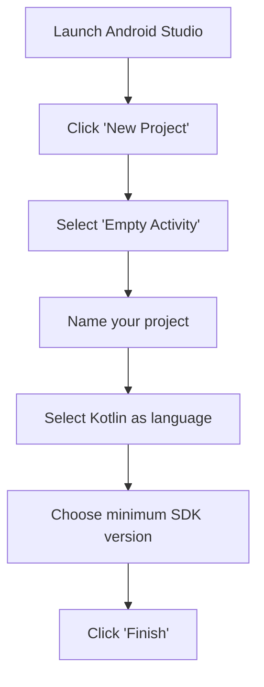
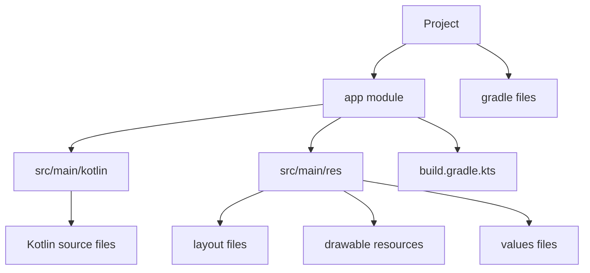
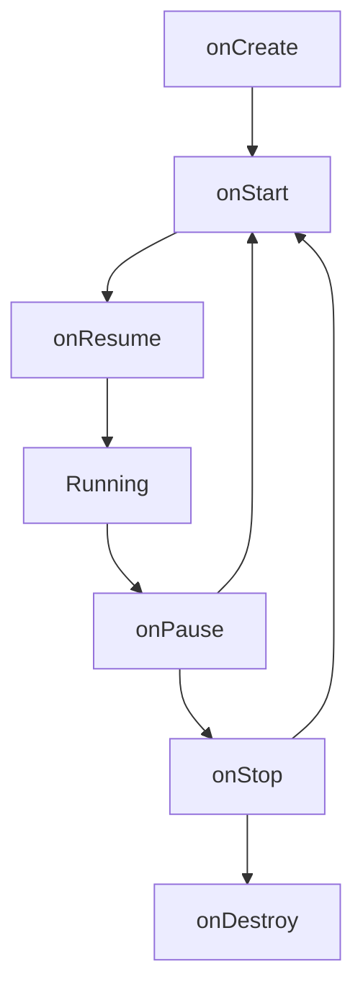
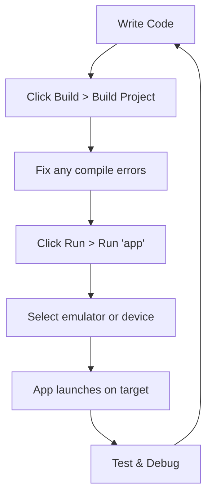

## Introduction

Android development with Kotlin represents the modern approach to building Android applications. Kotlin has become Google's preferred language for Android development because it's safer, more concise, and fully interoperable with Java. Companies using Kotlin have reported up to 30% reduction in crashes compared to Java, making it an excellent choice for building reliable applications.

## Setting Up Your Development Environment

Before writing any code, you need to set up Android Studio - the official integrated development environment for Android:

```
1. Download Android Studio from https://developer.android.com/studio
2. Run the installer and follow the installation wizard
3. Ensure Android SDK, Android Emulator, and Android Virtual Device components are selected
4. Complete the installation and launch Android Studio
```

Once installed, you can create a new project:



## Kotlin Programming Fundamentals

Before diving into Android-specific concepts, let's explore the essential Kotlin language features you'll use daily in your development.

### Variables and Data Types

Kotlin uses two keywords for variable declarations:

```kotlin
// val: Immutable (cannot be reassigned)
val name: String = "Android Developer"
// var: Mutable (can be reassigned)
var age: Int = 25
age = 26 // This works

// Type inference - compiler determines the type
val isActive = true // Boolean
val score = 95.5 // Double

// Basic types: Int, Long, Float, Double, Boolean, Char, String
```

### Null Safety

One of Kotlin's most powerful features is its null safety system, which helps prevent the dreaded NullPointerException crashes that plague Java applications:

```kotlin
// By default, variables cannot be null
// var name: String = null // This won't compile!

// To allow null values, use the nullable type with ?
var name: String? = null

// Safe calls prevent NullPointerExceptions
val length = name?.length // Returns null if name is null

// Elvis operator provides defaults
val length = name?.length ?: 0 // Returns 0 if name is null

// Not-null assertion (use with caution!)
// val length = name!!.length // Will crash if name is null
```

### Functions

Kotlin functions are declared using the `fun` keyword and offer several advantages over Java methods:

```kotlin
// Basic function
fun greet(name: String): String {
    return "Hello, $name!"
}

// Single-expression function (simplified syntax)
fun add(a: Int, b: Int) = a + b

// Function with default parameters
fun greet(name: String = "Guest") = "Hello, $name!"

// Extension functions (add functionality to existing classes)
fun String.addExclamation() = "$this!"
val excited = "Kotlin is awesome".addExclamation() // "Kotlin is awesome!"
```

### Control Flow

Kotlin provides concise yet powerful control flow statements that improve code readability:

```kotlin
// If expression (returns a value)
val max = if (a > b) a else b

// When expression (enhanced switch statement)
when (direction) {
    "NORTH" -> moveNorth()
    "SOUTH" -> moveSouth()
    "EAST", "WEST" -> moveHorizontal(direction)
    else -> stay()
}

// For loops
for (i in 1..10) {
    println(i) // Prints 1 through 10
}

// While loops
while (isActive) {
    processNext()
}
```

### Classes and Objects

Kotlin simplifies class creation with concise syntax and powerful features:

```kotlin
// Basic class with constructor parameters
class User(val name: String, var age: Int)

// Using the class
val user = User("John", 25)
println(user.name) // Access properties directly
user.age = 26 // Modify mutable properties

// Data class - automatically implements equals(), hashCode(), toString(), etc.
data class Product(val id: String, val name: String, val price: Double)

// Singleton object
object Logger {
    fun log(message: String) {
        println("LOG: $message")
    }
}
// Use directly: Logger.log("Hello")
```

## Android App Fundamentals

Now that we understand Kotlin's syntax and features, let's explore how these concepts apply to Android application development.

### Project Structure

An Android project has a specific structure that organizes code and resources:



Key components:

- `src/main/kotlin`: Contains your Kotlin code files
- `src/main/res`: Contains resources like layouts, strings, and images
- `build.gradle.kts`: Configuration files for your project dependencies and settings

### Activities and Lifecycle

Activities are one of the fundamental building blocks of Android apps, representing screens that users interact with. Each Activity has its own lifecycle that you need to understand to properly manage resources:

```kotlin
class MainActivity : AppCompatActivity() {
    override fun onCreate(savedInstanceState: Bundle?) {
        super.onCreate(savedInstanceState)
        setContentView(R.layout.activity_main) // Set the UI layout

        // Find a button in the layout and set a click listener
        val button = findViewById<Button>(R.id.button)
        button.setOnClickListener {
            // Handle button click
            Toast.makeText(this, "Button clicked!", Toast.LENGTH_SHORT).show()
        }
    }

    // Other lifecycle methods
    override fun onStart() {
        super.onStart()
        // Activity is becoming visible
    }

    override fun onResume() {
        super.onResume()
        // Activity is in the foreground and interactive
    }

    override fun onPause() {
        super.onPause()
        // Activity is partially visible but not in focus
    }

    override fun onStop() {
        super.onStop()
        // Activity is no longer visible
    }

    override fun onDestroy() {
        super.onDestroy()
        // Activity is being destroyed
    }
}
```

The activity lifecycle follows a specific sequence of events:



Understanding this lifecycle is crucial for proper resource management and preventing memory leaks.

### UI Development with XML Layouts

Traditional Android UI development uses XML files to define the layout of your screens:

```xml
<!-- activity_main.xml -->
<?xml version="1.0" encoding="utf-8"?>
<LinearLayout
    xmlns:android="http://schemas.android.com/apk/res/android"
    android:layout_width="match_parent"
    android:layout_height="match_parent"
    android:orientation="vertical"
    android:padding="16dp">

    <TextView
        android:id="@+id/textView"
        android:layout_width="wrap_content"
        android:layout_height="wrap_content"
        android:text="Hello, Android!"
        android:textSize="24sp"/>

    <Button
        android:id="@+id/button"
        android:layout_width="wrap_content"
        android:layout_height="wrap_content"
        android:layout_marginTop="16dp"
        android:text="Click Me"/>
</LinearLayout>
```

XML layouts are then inflated in your Activity and connected to your Kotlin code using view binding or findViewById.

### Modern UI with Jetpack Compose

While XML layouts have been the standard for years, Google now recommends Jetpack Compose, a modern declarative UI framework that allows you to build your interface directly in Kotlin:

```kotlin
class MainActivity : ComponentActivity() {
    override fun onCreate(savedInstanceState: Bundle?) {
        super.onCreate(savedInstanceState)
        setContent {
            MyAppTheme {
                MyApp()
            }
        }
    }
}

// UI components are created with @Composable functions
@Composable
fun MyApp() {
    Column(
        modifier = Modifier
            .padding(16.dp)
            .fillMaxSize(),
        verticalArrangement = Arrangement.Center
    ) {
        Text(
            text = "Hello, Compose!",
            fontSize = 24.sp
        )

        Spacer(modifier = Modifier.height(16.dp))

        Button(onClick = {
            // Handle click
        }) {
            Text("Click Me")
        }
    }
}
```

Compose makes UI development more intuitive and reduces boilerplate code compared to XML layouts.

### Navigation Between Screens

Once you have multiple screens in your app, you'll need to implement navigation between them. There are several approaches to navigation in Android:

1. Intent-based navigation (traditional):

```kotlin
// Navigate to another activity
val intent = Intent(this, SecondActivity::class.java)
intent.putExtra("key", "value") // Pass data
startActivity(intent)

// Receiving data in second activity
val value = intent.getStringExtra("key")
```

2. Jetpack Navigation Component (for fragment-based apps):

```kotlin
// In navigation XML graph (res/navigation/nav_graph.xml)
<navigation>
    <fragment
        android:id="@+id/homeFragment"
        android:name=".HomeFragment">
        <action
            android:id="@+id/to_detailFragment"
            app:destination="@id/detailFragment" />
    </fragment>
    <fragment
        android:id="@+id/detailFragment"
        android:name=".DetailFragment" />
</navigation>

// In Kotlin
findNavController().navigate(R.id.to_detailFragment)
```

3. Compose Navigation (for Jetpack Compose apps):

```kotlin
@Composable
fun AppNavigation() {
    val navController = rememberNavController()

    NavHost(navController, startDestination = "home") {
        composable("home") {
            HomeScreen(navController = navController)
        }
        composable("detail/{itemId}") { backStackEntry ->
            val itemId = backStackEntry.arguments?.getString("itemId")
            DetailScreen(itemId = itemId, navController = navController)
        }
    }
}

// Navigate from one screen to another
Button(onClick = {
    navController.navigate("detail/123")
}) {
    Text("Open Details")
}
```

## Data Management

Now that we understand how to create and navigate between screens, let's look at how to manage data within your application. Proper data management is crucial for creating responsive, maintainable apps.

### ViewModel & LiveData

The ViewModel architecture component helps manage UI-related data across configuration changes (like screen rotations) and provides a clean separation between your UI and data logic:

```kotlin
// Define ViewModel
class MainViewModel : ViewModel() {
    // LiveData: observable data holder that respects lifecycle
    private val _count = MutableLiveData(0)
    val count: LiveData<Int> = _count

    fun increment() {
        _count.value = (_count.value ?: 0) + 1
    }
}

// In Activity or Fragment
class MainActivity : AppCompatActivity() {
    private lateinit var viewModel: MainViewModel

    override fun onCreate(savedInstanceState: Bundle?) {
        super.onCreate(savedInstanceState)
        setContentView(R.layout.activity_main)

        // Initialize ViewModel
        viewModel = ViewModelProvider(this).get(MainViewModel::class.java)
        // Or with newer syntax: val viewModel: MainViewModel by viewModels()

        // Observe LiveData
        viewModel.count.observe(this) { count ->
            // Update UI with count
            findViewById<TextView>(R.id.countTextView).text = count.toString()
        }

        // Set click listener
        findViewById<Button>(R.id.incrementButton).setOnClickListener {
            viewModel.increment()
        }
    }
}
```

This pattern separates UI logic from business logic, making your app more testable and maintainable.

### Room Database

For local data persistence, Android recommends Room - a database library that provides an abstraction layer over SQLite:

```kotlin
// 1. Define Entity (database table)
@Entity
data class User(
    @PrimaryKey val id: Int,
    val name: String,
    val age: Int
)

// 2. Create Data Access Object (DAO)
@Dao
interface UserDao {
    @Query("SELECT * FROM user")
    fun getAll(): List<User>

    @Insert
    fun insert(user: User)

    @Update
    fun update(user: User)

    @Delete
    fun delete(user: User)
}

// 3. Create Database
@Database(entities = [User::class], version = 1)
abstract class AppDatabase : RoomDatabase() {
    abstract fun userDao(): UserDao

    companion object {
        // Singleton instance
        @Volatile
        private var INSTANCE: AppDatabase? = null

        fun getDatabase(context: Context): AppDatabase {
            return INSTANCE ?: synchronized(this) {
                val instance = Room.databaseBuilder(
                    context.applicationContext,
                    AppDatabase::class.java,
                    "app_database"
                ).build()
                INSTANCE = instance
                instance
            }
        }
    }
}

// 4. Usage
// Initialize database
val db = AppDatabase.getDatabase(applicationContext)

// Execute in background thread
lifecycleScope.launch(Dispatchers.IO) {
    // Insert data
    db.userDao().insert(User(1, "John", 25))

    // Query data
    val users = db.userDao().getAll()

    // Update UI on main thread
    withContext(Dispatchers.Main) {
        // Update UI with users
    }
}
```

Room handles the complexities of SQLite and provides compile-time verification of SQL queries, making database operations safer and more efficient.

### Working with APIs (Retrofit)

Most modern apps need to communicate with web services. Retrofit is the recommended library for API communication in Android:

```kotlin
// 1. Define API model
data class Post(
    val id: Int,
    val title: String,
    val body: String,
    val userId: Int
)

// 2. Create API interface
interface ApiService {
    @GET("posts")
    suspend fun getPosts(): List<Post>

    @GET("posts/{id}")
    suspend fun getPost(@Path("id") postId: Int): Post

    @POST("posts")
    suspend fun createPost(@Body post: Post): Post
}

// 3. Set up Retrofit
// Add dependencies in build.gradle.kts:
// implementation("com.squareup.retrofit2:retrofit:2.9.0")
// implementation("com.squareup.retrofit2:converter-gson:2.9.0")

val retrofit = Retrofit.Builder()
    .baseUrl("https://jsonplaceholder.typicode.com/")
    .addConverterFactory(GsonConverterFactory.create())
    .build()

val apiService = retrofit.create(ApiService::class.java)

// 4. Use with coroutines
lifecycleScope.launch {
    try {
        val posts = apiService.getPosts()
        // Update UI with posts
    } catch (e: Exception) {
        // Handle error
        Log.e("API", "Error fetching posts", e)
    }
}
```

Retrofit handles HTTP requests and response parsing, allowing you to focus on using the data rather than managing network operations.

## Error Handling & Crash Prevention

Creating reliable apps is essential for a good user experience. Let's look at techniques to handle errors and prevent crashes in your Android applications.

### Try-Catch Blocks

The most basic form of error handling is using try-catch blocks:

```kotlin
try {
    val number = text.toInt()
    processNumber(number)
} catch (e: NumberFormatException) {
    // Handle specific exception
    Log.e("ERROR", "Invalid number format", e)
    showErrorMessage("Please enter a valid number")
} catch (e: Exception) {
    // Catch any other exception
    Log.e("ERROR", "Unknown error", e)
    showErrorMessage("An unexpected error occurred")
} finally {
    // Always executes, regardless of exception
    cleanupResources()
}
```

This approach allows you to handle specific error cases with appropriate user feedback.

### Global Error Handling

For uncaught exceptions that might otherwise crash your app, you can implement a global error handler:

```kotlin
// In Application class
class MyApplication : Application() {
    override fun onCreate() {
        super.onCreate()

        // Set up global exception handler
        Thread.setDefaultUncaughtExceptionHandler { thread, throwable ->
            Log.e("CRASH", "Uncaught exception", throwable)
            // Log to analytics service
            // Show friendly error message
            // Restart app if needed
        }
    }
}

// Don't forget to register in AndroidManifest.xml
// <application
//    android:name=".MyApplication"
//    ...
// >
```

This approach helps you catch unexpected errors and provide a better experience than a sudden app crash.

### Kotlin's Null Safety for Crash Prevention

One of the most common causes of crashes in Android apps is the NullPointerException. Kotlin's null safety features help prevent these issues:

```kotlin
// Instead of this (potential crash if user is null):
val userName = user.name

// Do this (safe call):
val userName = user?.name // Returns null if user is null

// Or with default value:
val userName = user?.name ?: "Unknown User"

// Only use !! when you're absolutely sure the value isn't null:
// val userName = user!!.name // Will crash if user is null
```

Leveraging Kotlin's null safety features is a simple yet effective way to make your app more robust.

## Building and Running Your App

Once you've written your code, you'll need to build and run your app to see it in action:



The process is straightforward:

1. Connect your device via USB with USB debugging enabled
2. OR set up an emulator via AVD Manager
3. Click the "Run" button (green triangle) in Android Studio
4. Wait for the app to build and install
5. The app will launch automatically

## The Remaining 15%: Advanced Topics to Explore

The concepts covered so far represent about 85% of what you'll need for daily Android development. As you grow more comfortable with these fundamentals, here are the advanced topics that make up the remaining 15%:

1. **Advanced Jetpack Compose**: Custom layouts, animations, and theming
2. **Dependency Injection** with Hilt or Koin for better code organization
3. **Testing**: Unit tests, UI tests, and test-driven development
4. **Kotlin Coroutines Advanced**: Flow API, Channels, and StateFlow
5. **Custom Views**: Creating reusable UI components from scratch
6. **Performance Optimization**: Memory management, rendering optimization
7. **CI/CD**: Setting up automated builds and deployments
8. **Advanced Architecture Patterns**: Clean Architecture and MVI
9. **Multi-module Projects**: Structuring large-scale apps
10. **Kotlin Multiplatform**: Sharing code between Android, iOS, and web
11. **Gradle Kotlin DSL**: Advanced build configuration
12. **Security**: Encryption and secure data handling
13. **Background Processing**: WorkManager for reliable background tasks
14. **Accessibility**: Making your app usable by everyone
15. **Play Store Publishing**: App bundles, staged rollouts, and analytics

## Conclusion

This crash course has covered the essential 85% of Android development with Kotlin that you'll encounter daily. You've learned about Kotlin's powerful language features, Android app structure, UI development approaches, navigation patterns, data management techniques, and error handling strategies.

The knowledge provided here gives you a solid foundation to start building Android apps and provides the context necessary to explore more advanced topics as your skills grow. Remember that practice is key - start by building small apps to reinforce these concepts, then gradually incorporate more advanced techniques as you gain confidence.

By understanding these fundamentals and following best practices, you're well on your way to creating robust, maintainable Android applications that provide excellent user experiences.
