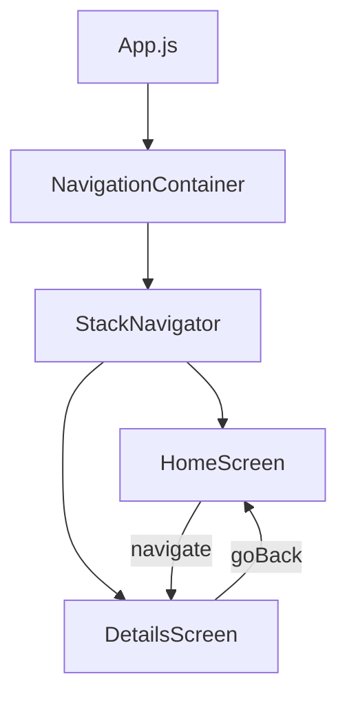
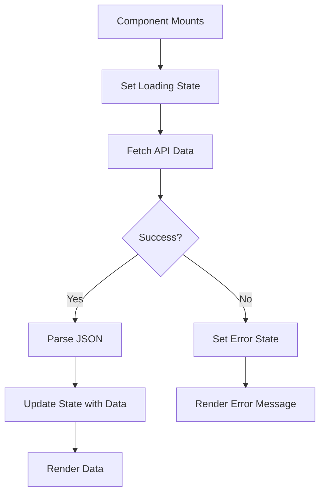
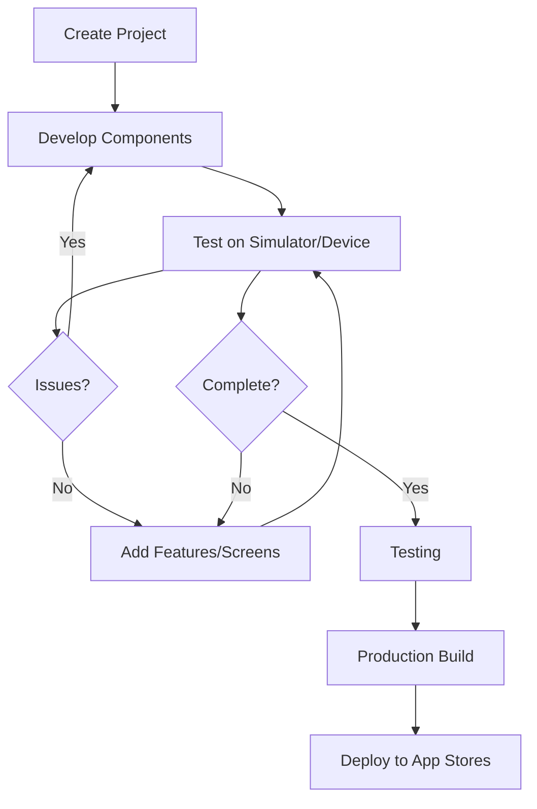

This crash course will guide you through the essential aspects of React Native development, covering the core knowledge you need to build cross-platform mobile applications effectively.

## What is React Native?

React Native is a JavaScript framework created by Facebook (now Meta) that allows you to build native mobile applications for iOS and Android using a single codebase. Unlike traditional hybrid apps, React Native doesn't run in a WebView but renders to native platform UI components, providing near-native performance and a genuine mobile experience.

### Key Benefits:

- **Write once, run on multiple platforms**: Build for iOS and Android from a single codebase
- **Native performance**: Direct mapping to native UI components rather than web views
- **Faster development**: Estimated 30-35% reduction in development time
- **Large community**: Extensive support from Meta and an active developer ecosystem
- **JavaScript-based**: Leverage existing JavaScript and React skills

## Prerequisites

Before starting with React Native, you should have:

- **Basic JavaScript knowledge**: Variables, functions, arrays, objects
- **Some familiarity with React**: Components, props, state (helpful but not mandatory)
- **Development environment**: Node.js and npm installed

If you're new to JavaScript or React, consider spending a week learning the basics before diving into React Native development.

## Setting Up Your Development Environment

To begin building with React Native, you'll need to set up your development environment. You have two main options:

### Option 1: Expo (Recommended for Beginners)

Expo provides a simplified development workflow with pre-built components and services that make getting started much easier.

```bash
# Install Expo CLI
npm install -g expo-cli

# Create a new project
npx create-expo-app MyFirstApp

# Navigate to your project
cd MyFirstApp

# Start the development server
npx expo start
```

Then scan the QR code with the Expo Go app (available on App Store/Google Play) to test your app on your physical device immediately.

### Option 2: React Native CLI (For More Control)

For more advanced projects or when you need native modules:

```bash
# Create a new project
npx react-native init MyFirstApp

# Navigate to your project
cd MyFirstApp

# Run on Android (requires Android Studio setup)
npx react-native run-android

# Run on iOS (Mac only, requires Xcode)
npx react-native run-ios
```

Once your environment is set up, you're ready to start building with React Native's components.

## Core Components and API

React Native provides a set of built-in components that map directly to native UI elements. These components serve as the building blocks for your mobile application:

```javascript
import React from 'react';
import { View, Text, Image, ScrollView, TextInput, Button } from 'react-native';

function BasicComponentsDemo() {
  return (
    <View style={{ padding: 20 }}>
      {/* View is like a div in web development */}
      <Text style={{ fontSize: 24, fontWeight: 'bold' }}>
        Hello React Native! 👋
      </Text>

      {/* Image component for displaying images */}
      <Image
        source={{ uri: 'https://reactnative.dev/img/tiny_logo.png' }}
        style={{ width: 50, height: 50, marginVertical: 10 }}
      />

      {/* TextInput for user input */}
      <TextInput
        style={{
          height: 40,
          borderColor: 'gray',
          borderWidth: 1,
          padding: 10,
          marginVertical: 10,
        }}
        placeholder="Type something here..."
      />

      {/* Button for user interactions */}
      <Button title="Press Me" onPress={() => alert('Button pressed!')} />
    </View>
  );
}
```

### Essential Components to Know:

- **View**: Container component (like div in web)
- **Text**: For displaying text (all text must be inside Text components)
- **Image**: For displaying images (local or remote)
- **ScrollView**: Scrollable container (for scrollable content)
- **FlatList**: Efficient list rendering (better than ScrollView for long lists)
- **TextInput**: For text input fields
- **Button**: Simple button component
- **TouchableOpacity**: For touchable elements with opacity feedback

These core components form the foundation of your React Native interfaces. After mastering them, you'll need to learn how to style them effectively.

## Styling in React Native

React Native uses JavaScript for styling with a syntax similar to CSS but in camelCase. This approach integrates styling directly with your components:

```javascript
import React from 'react';
import { StyleSheet, View, Text } from 'react-native';

function StyledComponent() {
  return (
    <View style={styles.container}>
      <Text style={styles.title}>Styled Component</Text>
      <Text style={styles.description}>
        React Native uses JavaScript for styling with a syntax similar to CSS.
        Styles are defined using StyleSheet.create for better performance.
      </Text>
    </View>
  );
}

// Create a StyleSheet object (this is optimized and recommended)
const styles = StyleSheet.create({
  container: {
    flex: 1, // Takes up all available space
    padding: 20, // 20 pixels of padding
    backgroundColor: '#f5f5f5',
    alignItems: 'center', // Center children horizontally
  },
  title: {
    fontSize: 24,
    fontWeight: 'bold',
    color: '#333',
    marginBottom: 10,
  },
  description: {
    fontSize: 16,
    color: '#666',
    textAlign: 'center',
  },
});

export default StyledComponent;
```

### Flexbox Layout

React Native relies on Flexbox for layouts, with a few key differences from web:

- **Default flex direction is column** (not row as in web CSS)
- **All dimensions are unitless** (treated as density-independent pixels)
- **Position 'absolute'** works as expected, but no 'fixed' positioning

```javascript
import React from 'react';
import { StyleSheet, View, Text } from 'react-native';

function FlexboxExample() {
  return (
    <View style={styles.container}>
      <View style={styles.box1}>
        <Text>1</Text>
      </View>
      <View style={styles.box2}>
        <Text>2</Text>
      </View>
      <View style={styles.box3}>
        <Text>3</Text>
      </View>
    </View>
  );
}

const styles = StyleSheet.create({
  container: {
    flex: 1, // Take all available space
    flexDirection: 'column', // Stack children vertically (default)
    justifyContent: 'space-around', // Space evenly along primary axis
    alignItems: 'center', // Center along cross axis
    padding: 20,
  },
  box1: {
    width: 100,
    height: 100,
    backgroundColor: 'red',
    justifyContent: 'center',
    alignItems: 'center',
  },
  box2: {
    width: 100,
    height: 100,
    backgroundColor: 'green',
    justifyContent: 'center',
    alignItems: 'center',
  },
  box3: {
    width: 100,
    height: 100,
    backgroundColor: 'blue',
    justifyContent: 'center',
    alignItems: 'center',
  },
});

export default FlexboxExample;
```

Understanding styling and layout is crucial for creating visually appealing interfaces. Once you have your components styled properly, you'll need to connect them together with navigation.

## Navigation

Most apps require multiple screens. React Navigation is the most popular library for handling navigation between screens in your application:

```bash
# Install React Navigation
npm install @react-navigation/native

# Install dependencies
npx expo install react-native-screens react-native-safe-area-context

# Install Stack Navigator
npm install @react-navigation/stack
```

Basic implementation:

```javascript
import React from 'react';
import { View, Text, Button } from 'react-native';
import { NavigationContainer } from '@react-navigation/native';
import { createStackNavigator } from '@react-navigation/stack';

// Define your screens as separate components
function HomeScreen({ navigation }) {
  return (
    <View style={{ flex: 1, alignItems: 'center', justifyContent: 'center' }}>
      <Text style={{ fontSize: 24, marginBottom: 20 }}>Home Screen</Text>
      <Button
        title="Go to Details"
        // Navigation to another screen with parameters
        onPress={() =>
          navigation.navigate('Details', {
            itemId: 86,
            otherParam: 'Anything you want',
          })
        }
      />
    </View>
  );
}

function DetailsScreen({ route, navigation }) {
  // Extract parameters from route
  const { itemId, otherParam } = route.params;

  return (
    <View style={{ flex: 1, alignItems: 'center', justifyContent: 'center' }}>
      <Text style={{ fontSize: 24, marginBottom: 20 }}>Details Screen</Text>
      <Text>Item ID: {itemId}</Text>
      <Text>Other Param: {otherParam}</Text>
      <Button title="Go Back" onPress={() => navigation.goBack()} />
    </View>
  );
}

// Create the navigator
const Stack = createStackNavigator();

// Main App component with NavigationContainer
function App() {
  return (
    <NavigationContainer>
      <Stack.Navigator initialRouteName="Home">
        <Stack.Screen
          name="Home"
          component={HomeScreen}
          options={{ title: 'Overview' }}
        />
        <Stack.Screen name="Details" component={DetailsScreen} />
      </Stack.Navigator>
    </NavigationContainer>
  );
}

export default App;
```

### Navigation Flow Visualization



### Navigation Types

- **Stack Navigator**: Traditional stack of screens (push/pop)
- **Tab Navigator**: Bottom/top tabs for switching between screens
- **Drawer Navigator**: Side menu for navigation
- **Bottom Tab Navigator**: Tab bar at the bottom (iOS-style)

With navigation in place, you'll need to manage data across your application screens.

## State Management

### Local Component State

Use the `useState` hook for component-level state to manage data that's specific to a single component:

```javascript
import React, { useState } from 'react';
import { View, Text, Button, StyleSheet } from 'react-native';

function Counter() {
  // Initialize state with useState hook
  const [count, setCount] = useState(0);

  return (
    <View style={styles.container}>
      <Text style={styles.countText}>Count: {count}</Text>
      <View style={styles.buttonContainer}>
        <Button title="Increment" onPress={() => setCount(count + 1)} />
        <View style={styles.buttonSpacer} />
        <Button title="Decrement" onPress={() => setCount(count - 1)} />
      </View>
    </View>
  );
}

const styles = StyleSheet.create({
  container: {
    flex: 1,
    justifyContent: 'center',
    alignItems: 'center',
    padding: 20,
  },
  countText: {
    fontSize: 24,
    marginBottom: 20,
  },
  buttonContainer: {
    flexDirection: 'row',
  },
  buttonSpacer: {
    width: 20,
  },
});

export default Counter;
```

### Global State Management

For application-wide state that needs to be shared across multiple components, you have several options:

1. **React Context API** (built-in, good for simpler apps)
2. **Redux** (comprehensive state management, industry standard)
3. **Zustand** (lightweight alternative to Redux)

Example using React Context:

```javascript
import React, { createContext, useContext, useState } from 'react';

// Create the context
const AppContext = createContext();

// Context provider component
export function AppProvider({ children }) {
  const [username, setUsername] = useState('');
  const [isLoggedIn, setIsLoggedIn] = useState(false);

  // Functions to update state
  const login = (user) => {
    setUsername(user);
    setIsLoggedIn(true);
  };

  const logout = () => {
    setUsername('');
    setIsLoggedIn(false);
  };

  // Value object containing state and functions
  const value = {
    username,
    isLoggedIn,
    login,
    logout,
  };

  return <AppContext.Provider value={value}>{children}</AppContext.Provider>;
}

// Custom hook to use the context
export function useAppContext() {
  return useContext(AppContext);
}

// Usage in a component:
// function ProfileScreen() {
//   const { username, isLoggedIn, logout } = useAppContext();
//   ...
// }
```

With state management in place, you can now focus on connecting your app to external data sources.

## Working with Data and APIs

Most applications need to fetch data from external APIs. Here's how to implement data fetching using the built-in `fetch` API:

```javascript
import React, { useState, useEffect } from 'react';
import {
  View,
  Text,
  FlatList,
  StyleSheet,
  ActivityIndicator,
} from 'react-native';

function UserList() {
  const [users, setUsers] = useState([]);
  const [loading, setLoading] = useState(true);
  const [error, setError] = useState(null);

  useEffect(() => {
    // Fetch data when component mounts
    fetchUsers();
  }, []);

  const fetchUsers = async () => {
    try {
      // API request using fetch
      const response = await fetch(
        'https://jsonplaceholder.typicode.com/users',
      );

      // Check if request was successful
      if (!response.ok) {
        throw new Error('Network response was not ok');
      }

      // Parse JSON response
      const data = await response.json();

      // Update state with fetched data
      setUsers(data);
      setLoading(false);
    } catch (error) {
      // Handle errors
      console.error('Fetch error:', error);
      setError('Failed to fetch users');
      setLoading(false);
    }
  };

  // Show loading indicator
  if (loading) {
    return (
      <View style={styles.centered}>
        <ActivityIndicator size="large" color="#0000ff" />
      </View>
    );
  }

  // Show error message
  if (error) {
    return (
      <View style={styles.centered}>
        <Text style={styles.error}>Error: {error}</Text>
      </View>
    );
  }

  // Render the list of users
  return (
    <View style={styles.container}>
      <Text style={styles.title}>Users</Text>
      <FlatList
        data={users}
        keyExtractor={(item) => item.id.toString()}
        renderItem={({ item }) => (
          <View style={styles.userItem}>
            <Text style={styles.userName}>{item.name}</Text>
            <Text style={styles.userEmail}>{item.email}</Text>
          </View>
        )}
      />
    </View>
  );
}

const styles = StyleSheet.create({
  container: {
    flex: 1,
    padding: 16,
  },
  centered: {
    flex: 1,
    justifyContent: 'center',
    alignItems: 'center',
  },
  title: {
    fontSize: 24,
    fontWeight: 'bold',
    marginBottom: 16,
  },
  userItem: {
    padding: 16,
    borderBottomWidth: 1,
    borderBottomColor: '#cccccc',
  },
  userName: {
    fontSize: 18,
    fontWeight: 'bold',
  },
  userEmail: {
    color: 'gray',
  },
  error: {
    color: 'red',
    fontSize: 18,
  },
});

export default UserList;
```

### Data Fetching Process Visualization



As your application grows, you'll need to ensure it remains responsive and performant.

## Performance Optimization

### 1. Use FlatList for Long Lists

For rendering lists efficiently, always use `FlatList` instead of `ScrollView` with mapped items:

```javascript
import React from 'react';
import { FlatList, Text, View, StyleSheet } from 'react-native';

function EfficientList() {
  // Sample data - in real app, this would come from API or props
  const data = Array.from({ length: 1000 }, (_, i) => ({
    id: i.toString(),
    title: `Item ${i}`,
  }));

  return (
    <FlatList
      data={data}
      keyExtractor={(item) => item.id}
      renderItem={({ item }) => (
        <View style={styles.item}>
          <Text style={styles.title}>{item.title}</Text>
        </View>
      )}
      // Performance optimizations
      initialNumToRender={10} // Render fewer items initially
      maxToRenderPerBatch={10} // Batch rendering when scrolling
      windowSize={5} // Buffer size
      removeClippedSubviews={true} // Detach off-screen views (experimental)
    />
  );
}

const styles = StyleSheet.create({
  item: {
    backgroundColor: '#f9f9f9',
    padding: 20,
    marginVertical: 8,
    marginHorizontal: 16,
  },
  title: {
    fontSize: 16,
  },
});

export default EfficientList;
```

### 2. Minimize Re-renders

Use memoization to prevent unnecessary re-renders and improve performance:

```javascript
import React, { useState, useCallback, useMemo } from 'react';
import { View, Text, Button, StyleSheet } from 'react-native';

// Child component that should only re-render when its props change
const ExpensiveComponent = React.memo(({ title, data }) => {
  console.log(`Rendering ExpensiveComponent: ${title}`);
  return (
    <View style={styles.expensiveComponent}>
      <Text style={styles.title}>{title}</Text>
      <Text>{data.join(', ')}</Text>
    </View>
  );
});

function ParentComponent() {
  const [count, setCount] = useState(0);
  const [items, setItems] = useState(['Item 1', 'Item 2', 'Item 3']);

  // This function is memoized and only recreated when its dependencies change
  const addItem = useCallback(() => {
    setItems((prevItems) => [...prevItems, `Item ${prevItems.length + 1}`]);
  }, []);

  // Memoize data calculations to prevent unnecessary work
  const processedData = useMemo(() => {
    console.log('Processing data...');
    return items.map((item) => item.toUpperCase());
  }, [items]); // Only recalculate when items change

  return (
    <View style={styles.container}>
      <Text style={styles.counterText}>Count: {count}</Text>
      <Button title="Increment Counter" onPress={() => setCount(count + 1)} />

      <View style={styles.separator} />

      <Button title="Add Item" onPress={addItem} />

      {/* This only re-renders when its props change */}
      <ExpensiveComponent title="Processed Items" data={processedData} />
    </View>
  );
}

const styles = StyleSheet.create({
  container: {
    flex: 1,
    padding: 20,
    alignItems: 'center',
  },
  counterText: {
    fontSize: 18,
    marginBottom: 10,
  },
  separator: {
    height: 1,
    backgroundColor: '#ccc',
    width: '100%',
    marginVertical: 20,
  },
  expensiveComponent: {
    padding: 16,
    backgroundColor: '#f0f0f0',
    borderRadius: 8,
    width: '100%',
    marginTop: 20,
  },
  title: {
    fontSize: 18,
    fontWeight: 'bold',
    marginBottom: 10,
  },
});

export default ParentComponent;
```

### 3. Enable Hermes

Hermes is a JavaScript engine optimized for React Native that improves startup time, reduces memory usage, and decreases app size. To enable Hermes:

For Expo projects, add in `app.json`:

```json
{
  "expo": {
    "jsEngine": "hermes"
  }
}
```

For React Native CLI projects:

- It's enabled by default in newer versions
- For older projects, check the [React Native documentation](https://reactnative.dev/docs/hermes)

As your application grows in complexity, organizing your code effectively becomes increasingly important.

## Recommended Project Structure

A well-organized project structure helps maintain your code and makes collaboration easier:

```
MyApp/
├── assets/             # Images, fonts, etc.
├── src/
│   ├── components/     # Reusable UI components
│   │   ├── common/     # Very reusable components (buttons, inputs)
│   │   └── specific/   # Application-specific components
│   ├── screens/        # Full screen components
│   ├── navigation/     # Navigation configuration
│   ├── services/       # API calls, backend connectivity
│   ├── utils/          # Helper functions
│   ├── hooks/          # Custom React hooks
│   ├── context/        # Context providers
│   └── styles/         # Global styles, themes
├── App.js              # App entry point
└── package.json
```

## Development Workflow

Understanding the typical development workflow helps streamline your process:



## The Remaining 15%: Advanced Topics

As you become more proficient with React Native, here are advanced topics to explore that will take your skills to the next level:

1. **Native Modules**: Creating custom native modules for platform-specific APIs
2. **Animation Systems**: Using Animated API and Reanimated for complex animations
3. **Deep Native Integration**: Writing Kotlin/Java or Swift/Objective-C code
4. **Advanced State Management**: Redux middleware, selectors, normalized state
5. **Offline-First Architecture**: Local storage with data synchronization
6. **Push Notifications**: Setting up and managing push notifications
7. **App Security**: Secure storage, certificate pinning, obfuscation
8. **Accessibility**: Making your app usable by everyone
9. **Analytics and Monitoring**: Crash reporting and usage analytics
10. **App Store Optimization**: Preparing your app for distribution
11. **The New Architecture**: React Native's Bridgeless architecture
12. **Internationalization**: Supporting multiple languages
13. **Testing Strategies**: Unit, integration, and end-to-end testing
14. **Custom Navigation**: Advanced navigation patterns, deep linking
15. **CI/CD Pipelines**: Automating building and deployment

## Quick Reference: Common Errors and Solutions

For your convenience, here's a quick reference guide for common issues you might encounter:

| Error                      | Likely Cause            | Solution                                                  |
| -------------------------- | ----------------------- | --------------------------------------------------------- |
| Red screen with JS error   | JavaScript syntax error | Check the error message and fix the code                  |
| App crashes on startup     | Native module issue     | Check native dependencies, rebuild project                |
| Can't find variable: React | Missing import          | Add `import React from 'react'`                           |
| Nothing displays           | Root component issue    | Check your App.js and component hierarchy                 |
| Metro bundler error        | Build tool issue        | Restart Metro with `npx react-native start --reset-cache` |

## Conclusion

You now have the foundational knowledge to build React Native applications! This crash course covered the essential 85% of what you need to know to get started and be productive. The concepts explained here—components, styling, navigation, state management, and data fetching—form the core of React Native development that you'll use daily.

As you continue your journey, gradually explore the advanced topics to deepen your expertise. Remember that the React Native ecosystem is constantly evolving, so staying updated with the official documentation and community resources is key to your continued growth as a React Native developer.

With practice and persistence, you'll soon be building sophisticated, performant mobile applications that work seamlessly across platforms.
