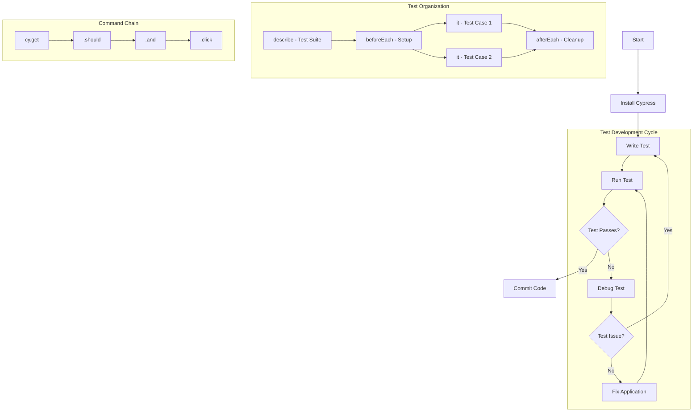

Cypress is a powerful JavaScript-based end-to-end testing framework designed specifically for modern web applications. This crash course will give you the core knowledge you need for daily testing work, along with a foundation to explore more advanced topics on your own.

## What is Cypress and Why Use It?

Cypress is a testing tool that runs directly in the browser, unlike traditional tools like Selenium that operate outside it. This unique approach gives Cypress several key advantages:

- **Browser Integration**: Runs in the same loop as your application, giving direct access to DOM elements
- **Automatic Waiting**: No need for arbitrary sleep/wait commands - Cypress automatically waits for elements
- **Time Travel Debugging**: Takes snapshots at each test step for easy debugging
- **Faster & More Reliable**: Tests are more consistent due to the architecture

## Prerequisites

Before diving into Cypress, you should have:

- **Node.js**: Version 12 or higher installed
- **Code Editor**: Visual Studio Code or any preferred editor
- **Basic JavaScript Knowledge**: Understanding functions, objects, and async operations
- **Web Development Basics**: Familiarity with HTML and CSS selectors

## Installation and Setup

Let's get Cypress installed and running on your system:

```bash
# Create a new project folder
mkdir cypress-project
cd cypress-project

# Initialize a new npm project
npm init -y

# Install Cypress as a dev dependency
npm install cypress --save-dev

# Open Cypress Test Runner
npx cypress open
```

When you first run Cypress, it will guide you through setup and create a skeleton project structure with example tests. Simply choose "E2E Testing" when prompted during the initial configuration.

## Understanding the Cypress Folder Structure

After initialization, your project will have this well-organized structure:

```
cypress/
├── e2e/         # Your test files go here (.cy.js extension)
├── fixtures/    # Test data files (JSON, CSV, etc.)
├── support/     # Custom commands and configurations
│   ├── commands.js  # Define reusable custom commands
│   └── e2e.js       # Global configuration for tests
└── downloads/   # Files downloaded during tests are stored here
cypress.config.js  # Main configuration file
```

## Writing Your First Test

Now that you understand the basics, let's create a simple test file in `cypress/e2e/first-test.cy.js`:

```javascript
// Describe block groups related tests
describe('My First Test Suite', () => {
  // Each it() is a single test case
  it('should visit a website and verify content', () => {
    // Visit the target website
    cy.visit('https://example.com');

    // Verify page has expected content
    cy.contains('Example Domain'); // Finds text anywhere on page

    // Get element by selector and make assertions
    cy.get('h1').should('be.visible'); // Element should be visible
    cy.get('h1').should('contain', 'Example Domain'); // Element should contain text

    // You can chain assertions
    cy.get('p')
      .should('exist') // Element exists
      .and('contain', 'for illustrative examples'); // Element contains text
  });
});
```

## Core Cypress Commands

With your first test written, let's explore the essential commands you'll use almost every day. These form the building blocks of all your Cypress tests.

### 1. Navigation Commands

These commands control browser navigation:

```javascript
// Visit a URL
cy.visit('https://example.com');

// Go back/forward in browser history
cy.go('back'); // or cy.go(-1)
cy.go('forward'); // or cy.go(1)

// Reload the page
cy.reload();
```

### 2. Element Selection Commands

Finding the right elements is crucial for testing:

```javascript
// Select by CSS selector (ID, class, attribute, etc.)
cy.get('#main-content'); // Select by ID
cy.get('.nav-item'); // Select by class
cy.get('[data-test=submit-button]'); // Select by attribute (preferred for testing)

// Find element containing specific text
cy.contains('Submit'); // Find element with text "Submit"
cy.contains('h2', 'Welcome'); // Find h2 element with text "Welcome"

// Find element within a previously selected element
cy.get('form').find('input[type="email"]');

// Get element by index (when multiple elements match)
cy.get('li').eq(2); // Get the third list item (0-based index)
```

### 3. Action Commands

These commands simulate user interactions:

```javascript
// Click on an element
cy.get('button').click(); // Simple click
cy.get('.menu-item').click({ multiple: true }); // Click all matching elements
cy.get('button').click({ force: true }); // Force click even if element is covered

// Type into an input field
cy.get('input[name="username"]').type('testuser'); // Type text
cy.get('input[name="password"]').type('password123', { sensitive: true }); // Mask in logs
cy.get('input').clear().type('new text'); // Clear first, then type

// Form interactions
cy.get('select').select('Option 2'); // Select dropdown option
cy.get('[type="checkbox"]').check(); // Check a checkbox
cy.get('[type="radio"]').first().check(); // Check first radio button
```

### 4. Assertion Commands

Verify that your application behaves as expected:

```javascript
// Element assertions
cy.get('button').should('exist'); // Element exists
cy.get('button').should('be.visible'); // Element is visible
cy.get('button').should('be.disabled'); // Element is disabled
cy.get('button').should('have.text', 'Submit'); // Exact text match
cy.get('button').should('contain', 'Submit'); // Contains text
cy.get('button').should('have.class', 'primary'); // Has CSS class
cy.get('input').should('have.value', 'test'); // Input has value

// URL assertions
cy.url().should('include', '/dashboard'); // URL contains string
cy.location('pathname').should('eq', '/login'); // Path equals string

// Multiple assertions
cy.get('form')
  .should('be.visible')
  .and('have.class', 'signup-form')
  .find('button')
  .should('contain', 'Register');
```

## Running Cypress Tests

Once you've written your tests, you'll need to run them. Cypress offers two main approaches:

### 1. Interactive Mode (GUI)

```bash
npx cypress open
```

This opens the Cypress Test Runner - a visual interface where you can:

- Select which tests to run
- Watch tests execute in real-time
- View time-travel snapshots
- Debug with the browser's DevTools

### 2. Headless Mode (CLI)

```bash
# Run all tests headlessly
npx cypress run

# Run specific test file
npx cypress run --spec "cypress/e2e/login.cy.js"

# Run tests in specific browser
npx cypress run --browser chrome
```

This mode is perfect for CI/CD pipelines and automatically produces:

- Video recordings of test runs
- Screenshots of failed tests
- Detailed command logs

## Advanced Testing Patterns

Now that you've mastered the basics, let's explore some more advanced patterns that will help you write more efficient and maintainable tests.

### Using Test Hooks for Setup and Teardown

Hooks help you organize common setup and cleanup operations:

```javascript
describe('User Dashboard', () => {
  // Runs once before all tests in this block
  before(() => {
    // Setup test database or global test state
    cy.log('Setting up test data');
  });

  // Runs before each test
  beforeEach(() => {
    // Log in before each test
    cy.visit('/login');
    cy.get('[name="username"]').type('testuser');
    cy.get('[name="password"]').type('password123');
    cy.get('form').submit();

    // Verify login successful
    cy.url().should('include', '/dashboard');
  });

  // Runs after each test
  afterEach(() => {
    // Clean up after each test
    cy.log('Test completed, cleaning up');
  });

  // Test cases
  it('should display user profile information', () => {
    cy.get('.profile-card').should('contain', 'testuser');
  });

  it('should allow editing user settings', () => {
    cy.get('.settings-button').click();
    // More test steps...
  });
});
```

### Working with Test Data (Fixtures)

Fixtures help you separate test data from test logic:

```javascript
describe('User Profile', () => {
  beforeEach(() => {
    // Load test data from fixtures folder
    cy.fixture('user.json').as('userData');

    // Visit page before each test
    cy.visit('/profile');
  });

  it('should fill profile form with fixture data', function () {
    // Access fixture data with this.userData
    cy.get('#name').type(this.userData.name);
    cy.get('#email').type(this.userData.email);
    cy.get('#bio').type(this.userData.bio);

    cy.get('form').submit();
    cy.get('.success-message').should('be.visible');
  });
});
```

Example `cypress/fixtures/user.json`:

```json
{
  "name": "Test User",
  "email": "test@example.com",
  "bio": "This is a test biography for the user profile."
}
```

### Intercepting and Mocking Network Requests

Intercepting network requests gives you powerful control over your test environment:

```javascript
describe('API Testing', () => {
  it('should display user data from API', () => {
    // Mock API response
    cy.intercept('GET', '/api/users/1', {
      statusCode: 200,
      body: {
        id: 1,
        name: 'Test User',
        email: 'test@example.com',
      },
    }).as('getUser'); // Assign alias to reference later

    // Visit page that will make the API call
    cy.visit('/user-profile/1');

    // Wait for intercepted request
    cy.wait('@getUser');

    // Verify data appears on page
    cy.get('.user-name').should('contain', 'Test User');
    cy.get('.user-email').should('contain', 'test@example.com');
  });

  it('should handle API error states', () => {
    // Mock API error response
    cy.intercept('GET', '/api/users/*', {
      statusCode: 404,
      body: {
        error: 'User not found',
      },
    }).as('getUserError');

    cy.visit('/user-profile/999');
    cy.wait('@getUserError');

    // Verify error message appears
    cy.get('.error-message')
      .should('be.visible')
      .and('contain', 'User not found');
  });
});
```

### Page Object Model for Maintainable Tests

The Page Object Model pattern helps keep your tests organized and maintainable by separating page interactions from test logic:

```javascript
// cypress/support/pages/LoginPage.js
class LoginPage {
  // Elements
  getUsernameField() {
    return cy.get('input[name="username"]');
  }

  getPasswordField() {
    return cy.get('input[name="password"]');
  }

  getLoginButton() {
    return cy.get('button[type="submit"]');
  }

  getErrorMessage() {
    return cy.get('.error-message');
  }

  // Actions
  visit() {
    cy.visit('/login');
    return this; // For method chaining
  }

  login(username, password) {
    this.getUsernameField().type(username);
    this.getPasswordField().type(password);
    this.getLoginButton().click();
    return this;
  }
}

export default new LoginPage();
```

Using the page object in tests makes your code more readable and maintainable:

```javascript
// cypress/e2e/login.cy.js
import LoginPage from '../support/pages/LoginPage';

describe('Login Functionality', () => {
  beforeEach(() => {
    LoginPage.visit();
  });

  it('should log in with valid credentials', () => {
    LoginPage.login('validuser', 'validpass');
    cy.url().should('include', '/dashboard');
  });

  it('should show error with invalid credentials', () => {
    LoginPage.login('invaliduser', 'invalidpass');
    LoginPage.getErrorMessage()
      .should('be.visible')
      .and('contain', 'Invalid username or password');
  });
});
```

## Cypress Best Practices

Following these best practices will help you write more reliable and maintainable tests:

1. **Use data attributes for test selection**

   ```html
   <!-- In your app's HTML -->
   <button data-cy="submit-button">Submit</button>
   ```

   ```javascript
   // In your test
   cy.get('[data-cy="submit-button"]').click();
   ```

2. **Avoid hard-coded waits**

   ```javascript
   // ❌ Bad practice
   cy.wait(5000); // Wait 5 seconds and hope element appears

   // ✅ Good practice
   cy.get('.loading-spinner').should('not.exist'); // Wait until spinner gone
   cy.get('.content').should('be.visible'); // Wait until content visible
   ```

3. **Keep tests independent**

   - Each test should set up its own state
   - Don't rely on previous test results
   - Use `beforeEach` hooks for common setup

4. **Test what the user sees and interacts with**

   - Test how elements appear visually
   - Focus on user workflows and journeys
   - Verify application behavior, not implementation details

5. **Use descriptive test names**

   ```javascript
   // ❌ Unclear test name
   it('login test', () => {
     // Test code...
   });

   // ✅ Clear description of what's being tested
   it('should display error message when password is incorrect', () => {
     // Test code...
   });
   ```

## Debugging Cypress Tests

When tests fail, Cypress offers several powerful debugging tools to help you identify and fix issues:

1. **Time Travel**: Click any command in the Command Log to see the application state at that point

2. **Console Debugging**:

   ```javascript
   cy.get('.element').then(($el) => {
     // Log element to console for inspection
     console.log($el);
   });
   ```

3. **Pause Execution**:

   ```javascript
   it('test with pause', () => {
     cy.visit('/app');
     cy.pause(); // Pause execution here
     cy.get('button').click();
   });
   ```

4. **Screenshots and Videos**: Automatically captured for failed tests in headless mode

5. **Debug with Developer Tools**:

   ```javascript
   cy.get('.complicated-element').then(($el) => {
     // Pause execution in browser dev tools
     debugger;

     // Now you can examine $el in the console
   });
   ```

## Testing Workflow Visualization

To better understand how all these concepts fit together, here's a visual representation of the Cypress testing workflow:



## Practical Example: Testing a Login Form

Let's put everything together with a complete test suite for a login form that demonstrates many of the concepts we've covered:

```javascript
describe('Login Functionality', () => {
  beforeEach(() => {
    // Visit login page before each test
    cy.visit('/login');

    // Intercept API calls
    cy.intercept('POST', '/api/auth/login').as('loginRequest');
  });

  it('should display the login form', () => {
    // Verify all form elements are visible
    cy.get('[data-cy=username]').should('be.visible');
    cy.get('[data-cy=password]').should('be.visible');
    cy.get('[data-cy=login-button]')
      .should('be.visible')
      .and('contain', 'Log In');
  });

  it('should require username and password', () => {
    // Try to submit empty form
    cy.get('[data-cy=login-button]').click();

    // Verify validation messages
    cy.get('[data-cy=username-error]')
      .should('be.visible')
      .and('contain', 'Username is required');
    cy.get('[data-cy=password-error]')
      .should('be.visible')
      .and('contain', 'Password is required');
  });

  it('should show error for invalid credentials', () => {
    // Mock failed login response
    cy.intercept('POST', '/api/auth/login', {
      statusCode: 401,
      body: { message: 'Invalid credentials' },
    }).as('failedLogin');

    // Fill form with invalid data
    cy.get('[data-cy=username]').type('wronguser');
    cy.get('[data-cy=password]').type('wrongpass');
    cy.get('[data-cy=login-button]').click();

    // Wait for request and verify error
    cy.wait('@failedLogin');
    cy.get('[data-cy=login-error]')
      .should('be.visible')
      .and('contain', 'Invalid credentials');
  });

  it('should successfully log in with valid credentials', () => {
    // Mock successful login response
    cy.intercept('POST', '/api/auth/login', {
      statusCode: 200,
      body: {
        token: 'fake-jwt-token',
        user: { id: 1, username: 'testuser' },
      },
    }).as('successfulLogin');

    // Fill form with valid data
    cy.get('[data-cy=username]').type('testuser');
    cy.get('[data-cy=password]').type('correctpass');
    cy.get('[data-cy=login-button]').click();

    // Wait for request
    cy.wait('@successfulLogin');

    // Verify redirect to dashboard
    cy.url().should('include', '/dashboard');

    // Verify welcome message
    cy.get('[data-cy=welcome-message]').should('contain', 'Welcome, testuser');
  });
});
```

## The Remaining 15%: Advanced Topics to Explore

Now that you understand the core 85% of Cypress, here are the advanced topics to explore as your testing needs grow:

1. **Custom Commands**: Extend Cypress with your own reusable commands

   ```javascript
   // In cypress/support/commands.js
   Cypress.Commands.add('login', (username, password) => {
     cy.visit('/login');
     cy.get('[data-cy=username]').type(username);
     cy.get('[data-cy=password]').type(password);
     cy.get('[data-cy=login-button]').click();
   });

   // In your test
   cy.login('testuser', 'password123');
   ```

2. **Cypress Dashboard Service**: Cloud recording, parallelization, and test analytics

   - Allows running tests in parallel across multiple machines
   - Stores test results, videos, and screenshots
   - Provides insights into test performance and flakiness

3. **Visual Testing**: Compare screenshots for UI regression testing

   - Plugins like `cypress-image-snapshot` for visual comparisons
   - Integration with services like Percy or Applitools

4. **Component Testing**: Test individual UI components in isolation

   - Test React, Vue, Angular components directly
   - Faster than full end-to-end tests for component-level behavior

5. **CI/CD Integration**: Running Cypress in continuous integration pipelines

   - GitHub Actions, CircleCI, Jenkins, etc.
   - Parallel test execution
   - Test result reporting

6. **API Testing Strategy**: Comprehensive backend validation

   - Using `cy.request()` for direct API calls
   - Testing API contracts and schemas
   - Integration with OpenAPI/Swagger specifications

7. **Performance Testing**: Basic performance monitoring

   - Tracking page load times
   - Measuring Core Web Vitals
   - Resource loading analysis

8. **Advanced Mocking Techniques**:

   - Stubbing browser APIs (localStorage, IndexedDB)
   - Clock manipulation for time-based testing
   - Service worker interception

9. **Cross-Browser Testing**: Testing across multiple browsers

   - Running tests in Chrome, Firefox, Edge, etc.
   - Handling browser-specific behavior differences

10. **Authentication Patterns**: Advanced authentication testing
    - OAuth flows
    - JWT token management
    - Session persistence

## Summary

This crash course has equipped you with the essential 85% of Cypress knowledge you'll need for daily testing:

- Installation and basic setup
- Core commands for navigation, selection, and assertions
- Test organization with describe/it blocks and hooks
- Network request interception and mocking
- The Page Object Model pattern for maintainable tests
- Best practices for writing reliable tests
- Debugging techniques for when things go wrong

With this solid foundation, you're now well-equipped to start writing robust end-to-end tests for your web applications. As your testing needs grow, you can gradually explore the more advanced capabilities we outlined in the remaining 15%.

Remember that the most effective Cypress tests focus on user workflows and behaviors rather than implementation details. This approach will keep your tests resilient to UI changes and provide the most value for your testing efforts.
