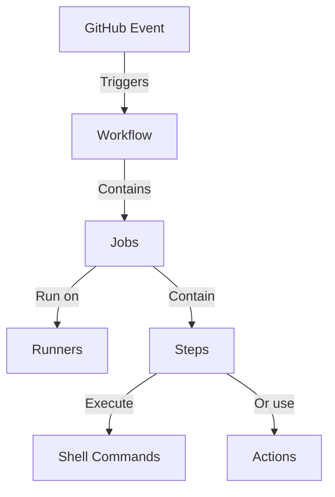
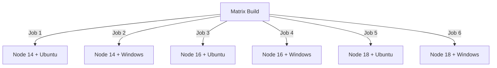

GitHub Actions is a powerful automation platform integrated directly into GitHub repositories, enabling you to automate building, testing, and deploying your code without setting up separate CI/CD tools.

## What You'll Learn (The Essential 85%)

This crash course covers:

- Understanding GitHub Actions core concepts
- Setting up your first workflows
- Working with events, jobs, and runners
- Managing secrets and environment variables
- Building practical CI/CD pipelines
- Applying best practices for security and performance

## Prerequisites

- A GitHub account
- Basic knowledge of Git operations (commit, push, pull)
- Familiarity with YAML syntax (but we'll explain the basics)
- A repository to practice with

## Key Concepts: How GitHub Actions Works

GitHub Actions operates on a straightforward workflow model:



**Key components:**

1. **Events**: Specific activities that trigger a workflow (push, PR, scheduled time)
2. **Workflows**: YAML files defining what happens when events occur
3. **Jobs**: Groups of steps that execute on the same runner
4. **Runners**: Virtual machines that execute your workflows
5. **Steps**: Individual tasks within a job that run commands or actions
6. **Actions**: Reusable units of code for common tasks

## Setting Up Your First Workflow

Workflows live in the `.github/workflows` directory in your repository as YAML files.

### Step 1: Create the workflow directory

```bash
mkdir -p .github/workflows
```

### Step 2: Create a basic workflow file

Create a file named `.github/workflows/ci.yml` with this content:

```yaml
name: CI Workflow # Name of your workflow

on: # Events that trigger this workflow
  push:
    branches: [main]
  pull_request:
    branches: [main]

jobs: # The jobs to run
  build:
    runs-on: ubuntu-latest # The type of runner to use

    steps: # The steps in this job
      - uses: actions/checkout@v4 # Action to check out your code
      - name: Set up Node.js # Descriptive name for this step
        uses: actions/setup-node@v3 # Action to set up Node.js
        with: # Parameters for the action
          node-version: '18'
      - name: Install dependencies
        run: npm ci # Shell command to run
      - name: Run tests
        run: npm test # Shell command to run tests
```

### Step 3: Commit and push to GitHub

```bash
git add .github/workflows/ci.yml
git commit -m "Add CI workflow"
git push
```

### Step 4: View your workflow

Go to the "Actions" tab in your GitHub repository to see your workflow running.

## Understanding Events

Events trigger your workflows. Here are the most common event types:

### Push and Pull Request Events

```yaml
on:
  push:
    branches: [main, development] # Runs on pushes to these branches
    paths:
      - 'src/**' # Only run when files in src directory change
  pull_request:
    branches: [main] # Runs on PRs targeting main
```

### Scheduled Events

```yaml
on:
  schedule:
    - cron: '0 0 * * *' # Runs at midnight UTC every day
    # ┌───────── minute (0-59)
    # │ ┌───────── hour (0-23)
    # │ │ ┌───────── day of month (1-31)
    # │ │ │ ┌───────── month (1-12)
    # │ │ │ │ ┌───────── day of week (0-6 or SUN-SAT)
    # │ │ │ │ │
    # * * * * *
```

### Manual Events

```yaml
on:
  workflow_dispatch: # Allows manual triggering
    inputs:
      environment:
        description: 'Environment to deploy to'
        required: true
        default: 'staging'
        type: choice
        options:
          - development
          - staging
          - production
```

## Working with Jobs

Jobs are the building blocks of workflows. Each job runs on a fresh virtual machine instance.

### Sequential Jobs with Dependencies

```yaml
jobs:
  build:
    runs-on: ubuntu-latest
    steps:
      - uses: actions/checkout@v4
      - run: npm ci
      - run: npm run build

  test:
    needs: build # This job only runs after build succeeds
    runs-on: ubuntu-latest
    steps:
      - uses: actions/checkout@v4
      - run: npm ci
      - run: npm test
```

### Matrix Builds for Testing Multiple Configurations

```yaml
jobs:
  test:
    runs-on: ubuntu-latest
    strategy:
      matrix:
        node-version: [14.x, 16.x, 18.x]
        os: [ubuntu-latest, windows-latest]

    steps:
      - uses: actions/checkout@v4
      - name: Use Node.js ${{ matrix.node-version }} on ${{ matrix.os }}
        uses: actions/setup-node@v3
        with:
          node-version: ${{ matrix.node-version }}
      - run: npm ci
      - run: npm test
```

This creates 6 parallel jobs testing all combinations of Node.js versions and operating systems.



## Working with Runners

Runners are the virtual machines that execute your workflows.

### GitHub-Hosted Runners

```yaml
jobs:
  build:
    runs-on: ubuntu-latest # Options: ubuntu-latest, windows-latest, macos-latest
```

These come with many tools pre-installed and are maintained by GitHub.

### Self-Hosted Runners

For special requirements, you can set up runners on your own infrastructure:

```yaml
jobs:
  build:
    runs-on: self-hosted # Uses your own runner
```

## Managing Secrets and Environment Variables

Never hardcode sensitive information in your workflows.

### Using Secrets

Store secrets in your repository (Settings > Secrets and variables > Actions):

```yaml
jobs:
  deploy:
    runs-on: ubuntu-latest
    steps:
      - uses: actions/checkout@v4
      - name: Deploy to production
        run: ./deploy.sh
        env:
          API_KEY: ${{ secrets.API_KEY }} # Access your secret
```

### Environment Variables

```yaml
env:
  GLOBAL_VAR: 'available to all jobs' # Workflow-level variable

jobs:
  build:
    env:
      JOB_VAR: 'available to all steps in this job' # Job-level variable
    runs-on: ubuntu-latest
    steps:
      - name: Use variables
        env:
          STEP_VAR: 'available only to this step' # Step-level variable
        run: |
          echo $GLOBAL_VAR
          echo $JOB_VAR
          echo $STEP_VAR
```

## Practical CI/CD Examples

### Building and Testing a Node.js Application

```yaml
name: Node.js CI

on:
  push:
    branches: [main]
  pull_request:
    branches: [main]

jobs:
  build-and-test:
    runs-on: ubuntu-latest

    steps:
      - uses: actions/checkout@v4

      - name: Set up Node.js
        uses: actions/setup-node@v3
        with:
          node-version: '18'
          cache: 'npm' # Enables caching for faster installs

      - name: Install dependencies
        run: npm ci

      - name: Run linter
        run: npm run lint
        # If linting fails, the workflow stops here

      - name: Run tests
        run: npm test
        # If tests fail, the workflow stops here

      - name: Build application
        run: npm run build
        # Creates production build
```

### Deploying to Production

```yaml
name: Deploy to Production

on:
  push:
    branches: [main] # Only deploy from main branch

jobs:
  deploy:
    runs-on: ubuntu-latest

    steps:
      - uses: actions/checkout@v4

      - name: Set up Node.js
        uses: actions/setup-node@v3
        with:
          node-version: '18'

      - name: Install dependencies
        run: npm ci

      - name: Build application
        run: npm run build

      - name: Deploy to production
        uses: actions/aws-cli@v1 # Example action for AWS deployment
        with:
          args: s3 sync ./build s3://my-website-bucket
        env:
          AWS_ACCESS_KEY_ID: ${{ secrets.AWS_ACCESS_KEY_ID }}
          AWS_SECRET_ACCESS_KEY: ${{ secrets.AWS_SECRET_ACCESS_KEY }}
```

### Docker Build and Push Example

```yaml
name: Build and Push Docker Image

on:
  push:
    branches: [main]

jobs:
  build-and-push:
    runs-on: ubuntu-latest

    steps:
      - uses: actions/checkout@v4

      - name: Login to Docker Hub
        uses: docker/login-action@v2
        with:
          username: ${{ secrets.DOCKER_USERNAME }}
          password: ${{ secrets.DOCKER_PASSWORD }}

      - name: Build and push Docker image
        uses: docker/build-push-action@v4
        with:
          context: . # Build context is current directory
          push: true # Actually push the image
          tags: |
            yourusername/yourapp:latest  # Tag as latest
            yourusername/yourapp:${{ github.sha }}  # Tag with commit SHA
```

## Advanced Features

### Conditional Execution

Run steps only when specific conditions are met:

```yaml
steps:
  - name: Deploy to production
    if: github.ref == 'refs/heads/main' && github.event_name == 'push'
    run: ./deploy-to-production.sh

  - name: Deploy to staging
    if: github.ref == 'refs/heads/development' && github.event_name == 'push'
    run: ./deploy-to-staging.sh
```

### Caching Dependencies

Speed up your workflows by caching dependencies:

```yaml
steps:
  - uses: actions/checkout@v4

  - name: Set up Node.js
    uses: actions/setup-node@v3
    with:
      node-version: '18'

  - name: Cache Node modules
    uses: actions/cache@v3
    with:
      path: ~/.npm # What to cache
      key: ${{ runner.os }}-node-${{ hashFiles('**/package-lock.json') }} # Cache key
      restore-keys: | # Fallback keys
        ${{ runner.os }}-node-

  - name: Install dependencies
    run: npm ci # Will be much faster with cached dependencies
```

### Artifacts and Sharing Data Between Jobs

Share files between jobs using artifacts:

```yaml
jobs:
  build:
    runs-on: ubuntu-latest
    steps:
      - uses: actions/checkout@v4
      - name: Build
        run: npm run build
      - name: Upload build artifacts
        uses: actions/upload-artifact@v3
        with:
          name: build-files
          path: build/ # Directory to upload

  deploy:
    needs: build
    runs-on: ubuntu-latest
    steps:
      - name: Download build artifacts
        uses: actions/download-artifact@v3
        with:
          name: build-files
          path: build/ # Directory to download to
      - name: Deploy
        run: ./deploy.sh
```

## Best Practices

### Security

1. **Use secrets for sensitive data**
2. **Pin actions to specific commits** (instead of using `@v3`, use the full SHA)
3. **Limit permissions** by configuring the least privilege necessary

### Performance

1. **Use caching** for dependencies and build outputs
2. **Optimize trigger conditions** using paths to only run workflows when relevant files change
3. **Run jobs in parallel** where possible

### Organization

1. **Create separate workflows** for different purposes (CI, CD, issue management)
2. **Use meaningful names** for workflows, jobs, and steps
3. **Keep workflows focused** on specific tasks

## The Remaining 15%: Advanced Topics to Explore

As you become more comfortable with GitHub Actions, these advanced topics will help you take full advantage of the platform:

1. **Custom actions development**: Build your own reusable actions in JavaScript, Docker, or as composite actions
2. **Self-hosted runner management**: Advanced configuration, security, and scaling
3. **Advanced workflow orchestration**: Complex patterns and event handling
4. **GitHub Actions API**: Programmatically interact with workflows
5. **Environment deployment protection rules**: Add approval workflows
6. **Organization and enterprise management**: Centralized policies
7. **Cost optimization strategies**: For repositories with limited included minutes
8. **Integration with other GitHub features**: GitHub Packages, CodeQL, etc.
9. **Complex matrix strategies**: Dynamic matrix generation
10. **Custom expressions and contexts**: Advanced usage of GitHub's expression syntax

## Getting Help

- Official documentation: [GitHub Actions Documentation](https://docs.github.com/en/actions)
- GitHub Community forums: [GitHub Community](https://github.community/c/actions/41)
- GitHub Actions Marketplace: [Marketplace](https://github.com/marketplace?type=actions)

This crash course has equipped you with the essential knowledge that covers approximately 85% of what you'll need day-to-day with GitHub Actions. As you gain experience, you can progressively explore the advanced topics to master the platform completely.
