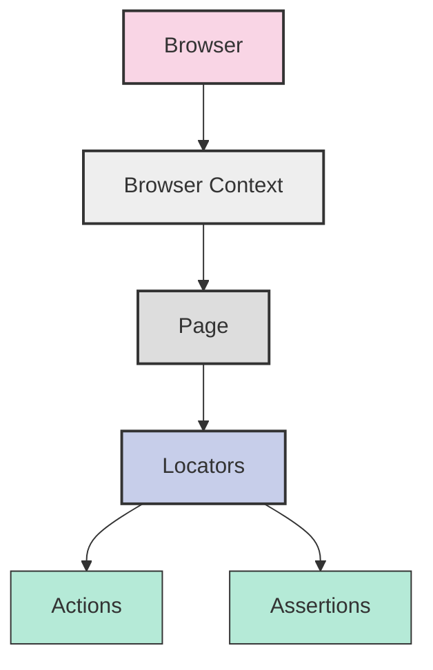
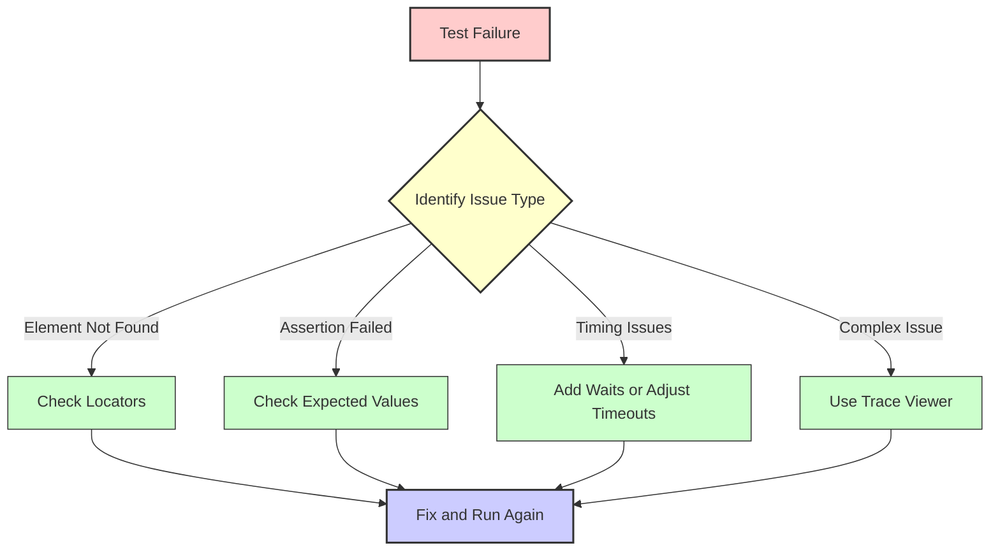

Playwright is a powerful, modern framework created by Microsoft for automating browser interactions and testing web applications. This crash course will get you up and running with the essentials that cover 85% of daily usage.

## Prerequisites

Before diving into Playwright, you'll need a few basics in place:

- Basic knowledge of JavaScript/TypeScript
- Node.js installed on your machine
- Familiarity with web technologies (HTML, CSS)
- A code editor (VS Code recommended)

## Installation and Setup

Let's start by setting up a new Playwright project. Open your terminal and run:

```bash
# Create a new project directory
mkdir playwright-project
cd playwright-project

# Initialize a new Playwright project
npm init playwright@latest
```

During the initialization, you'll be prompted to make a few choices. Don't worry, the defaults are sensible:

1. Choose JavaScript or TypeScript (TypeScript recommended for better autocompletion)
2. Name your tests folder (default: `tests` or `e2e`)
3. Add GitHub Actions workflow (optional)
4. Install browser engines (Chromium, Firefox, and WebKit)

Once completed, the setup will create a `playwright.config.js` (or `.ts`) file with default settings and a sample test to get you started.

## Core Concepts

Before writing tests, it's important to understand Playwright's architecture. Think of it as layers that build upon each other:



- **Browser**: The browser instance (Chrome, Firefox, or WebKit) that runs your tests
- **Browser Context**: An isolated incognito-like session that provides a clean slate for each test
- **Page**: Equivalent to a browser tab where your test actions actually happen
- **Locators**: Methods that help you find specific elements on the page
- **Actions**: Interactions with web elements (click, type, etc.) that simulate user behavior
- **Assertions**: Checks that verify your application behaves as expected

With these concepts in mind, let's see how they come together in a real test.

## Writing Your First Test

Playwright uses a simple, intuitive API. Here's a basic test that navigates to a website and verifies some content:

```javascript
// basic-test.js
import { test, expect } from '@playwright/test';

test('basic navigation test', async ({ page }) => {
  // Navigate to a website
  await page.goto('https://playwright.dev/');

  // Assert that the page title contains "Playwright"
  await expect(page).toHaveTitle(/Playwright/);

  // Find and click on a button
  await page.getByRole('link', { name: 'Get started' }).click();

  // Verify navigation was successful by checking for a heading
  await expect(
    page.getByRole('heading', { name: 'Installation' }),
  ).toBeVisible();

  // Take a screenshot for reference
  await page.screenshot({ path: 'screenshot.png' });
});
```

To run this test, simply execute:

```bash
npx playwright test basic-test.js
```

When you run this test, Playwright will launch a browser, navigate to the Playwright website, click the "Get started" link, verify you've arrived at the installation page, and save a screenshot. All of this happens automatically, with no manual intervention needed.

## Locating Elements (The Right Way)

Finding elements on a page is one of the most important aspects of testing. Playwright encourages user-centric testing through its powerful locators, which help you write tests that mirror how real users interact with your application.

```javascript
// RECOMMENDED: Role-based locators (most resilient)
const submitButton = page.getByRole('button', { name: 'Submit' });
const nameField = page.getByLabel('Full name');
const agreeCheckbox = page.getByLabel('I agree to terms');

// Text-based locators
const heading = page.getByText('Welcome to our site');
const paragraph = page.getByText('Learn more about our services');

// Test ID locators (requires adding data-testid to your HTML)
const loginForm = page.getByTestId('login-form');

// Other useful locators
const emailInput = page.getByPlaceholder('Enter your email');
const errorMessage = page.getByRole('alert');
const logo = page.getByAltText('Company Logo');

// LESS RECOMMENDED: CSS and XPath selectors (more brittle)
const menu = page.locator('nav.main-menu');
const footer = page.locator('xpath=//footer');
```

Role-based locators are preferred because they focus on the element's purpose rather than its implementation details. This makes your tests more resilient to UI changes and better reflects how users see your application.

## Common Interactions

Once you've located elements, you'll want to interact with them. Playwright provides methods that simulate all common user actions:

```javascript
// Clicking elements
await page.getByRole('button', { name: 'Submit' }).click();
await page.getByText('Read more').click();

// Text input
await page.getByLabel('Username').fill('testuser');
await page.getByLabel('Password').fill('securepassword123');

// Handling dropdowns
await page.getByLabel('Country').selectOption('United States'); // By visible text
await page.getByLabel('Country').selectOption({ value: 'US' }); // By value

// Checkboxes and radio buttons
await page.getByLabel('I agree to terms').check();
await page.getByLabel('Female').check(); // For radio buttons

// Working with file inputs
await page
  .getByLabel('Upload profile picture')
  .setInputFiles('path/to/image.jpg');
// For multiple files:
await page
  .getByLabel('Upload documents')
  .setInputFiles(['file1.pdf', 'file2.pdf']);

// Special key presses
await page.getByRole('textbox').press('Enter');
await page.getByRole('textbox').press('Control+A'); // Select all text
```

These interactions closely mirror what a user would do, making your tests more intuitive and realistic. Playwright handles waiting automatically, so you don't need to add explicit waits or delays in most cases.

## Making Assertions

After interacting with your application, you'll need to verify that it behaves correctly. Assertions are how you check that the expected outcomes actually happen:

```javascript
// Element visibility and state assertions
await expect(page.getByText('Success')).toBeVisible();
await expect(page.getByRole('button', { name: 'Submit' })).toBeEnabled();
await expect(page.getByLabel('Accept terms')).toBeChecked();

// Text content assertions
await expect(page.getByTestId('error-message')).toContainText('Invalid email');
await expect(page.locator('.greeting')).toHaveText('Hello, User!');

// Attribute assertions
await expect(page.getByRole('img')).toHaveAttribute('alt', 'Profile Picture');
await expect(page.getByRole('link')).toHaveAttribute('href', /about/);

// Page state assertions
await expect(page).toHaveURL(/dashboard/);
await expect(page).toHaveTitle('User Dashboard');

// Counting elements
await expect(page.getByTestId('notification')).toHaveCount(3);

// Negative assertions
await expect(page.getByText('Error')).not.toBeVisible();
```

These assertions create the "testing" part of your automated tests. They verify that your application is functioning correctly and provide clear feedback when something goes wrong.

## Test Organization

As your test suite grows, organization becomes crucial for maintainability. Playwright provides several features to help structure your tests:

```javascript
// test-organization.spec.js
import { test, expect } from '@playwright/test';

// Test hooks for setup and teardown
test.beforeEach(async ({ page }) => {
  // Common setup before each test
  await page.goto('https://example.com/login');
});

test.afterEach(async ({ page }) => {
  // Cleanup after each test
  // For example, clear localStorage
  await page.evaluate(() => localStorage.clear());
});

// Group related tests
test.describe('Authentication flows', () => {
  test('successful login', async ({ page }) => {
    await page.getByLabel('Username').fill('testuser');
    await page.getByLabel('Password').fill('password123');
    await page.getByRole('button', { name: 'Log in' }).click();

    // Verify successful login
    await expect(page.getByText('Welcome back')).toBeVisible();
  });

  test('failed login with incorrect password', async ({ page }) => {
    await page.getByLabel('Username').fill('testuser');
    await page.getByLabel('Password').fill('wrongpassword');
    await page.getByRole('button', { name: 'Log in' }).click();

    // Verify error message
    await expect(page.getByText('Invalid credentials')).toBeVisible();
  });
});

// Conditional tests
test('feature only available in Chrome', async ({ page, browserName }) => {
  // Skip test for non-Chrome browsers
  test.skip(browserName !== 'chromium', 'Feature only available in Chrome');

  // Test Chrome-specific feature
  // ...
});
```

This structure keeps related tests together and avoids repetition by sharing setup code. It also makes it easier to understand what each test is checking, which is particularly valuable when tests fail.

## Page Object Model

As your test suite grows even further, you might find yourself repeating the same locators and actions across multiple tests. The Page Object Model (POM) pattern helps address this by encapsulating page-specific code:

```javascript
// models/LoginPage.js
class LoginPage {
  constructor(page) {
    this.page = page;
    this.usernameInput = page.getByLabel('Username');
    this.passwordInput = page.getByLabel('Password');
    this.loginButton = page.getByRole('button', { name: 'Log in' });
    this.errorMessage = page.getByTestId('login-error');
  }

  async goto() {
    await this.page.goto('https://example.com/login');
  }

  async login(username, password) {
    await this.usernameInput.fill(username);
    await this.passwordInput.fill(password);
    await this.loginButton.click();
  }

  async getErrorMessage() {
    return this.errorMessage.textContent();
  }
}

// Export the page object
export default LoginPage;

// Using the Page Object in a test
// tests/login.spec.js
import { test, expect } from '@playwright/test';
import LoginPage from '../models/LoginPage';

test('login functionality', async ({ page }) => {
  const loginPage = new LoginPage(page);
  await loginPage.goto();

  // Test successful login
  await loginPage.login('validuser', 'validpass');
  await expect(page).toHaveURL(/dashboard/);

  // Navigate back to login for another test
  await loginPage.goto();

  // Test failed login
  await loginPage.login('validuser', 'wrongpass');
  const errorText = await loginPage.getErrorMessage();
  expect(errorText).toContain('Invalid credentials');
});
```

This approach centralizes page-specific code, making your tests more maintainable and readable. When the UI changes, you only need to update the page object, not every test that uses it.

## Handling Advanced UI Components

Modern web applications often include complex components that require special handling. Playwright provides tools for working with these sophisticated elements:

```javascript
// Working with iframes
const frame = page.frameLocator('#checkout-iframe');
await frame.getByRole('button', { name: 'Pay Now' }).click();

// Handling alerts and dialogs
page.on('dialog', (dialog) => {
  console.log(`Dialog message: ${dialog.message()}`);
  dialog.accept(); // Or dialog.dismiss() to cancel
});
await page.getByRole('button', { name: 'Delete' }).click();

// Working with dates
await page.getByLabel('Departure date').fill('2023-12-25');

// Handling shadow DOM
await page.locator('custom-element').getByRole('button').click();

// Working with tables
// For a table with data
const row = page.getByRole('row', { name: /John Doe/ });
const cell = row.getByRole('cell').nth(2); // Get the 3rd cell
const value = await cell.textContent();
```

These techniques allow you to test even the most complex parts of your application, ensuring comprehensive test coverage.

## API Testing and Mocking

Beyond UI testing, Playwright allows you to test and mock APIs, which is crucial for testing complex web applications:

```javascript
// Direct API testing
test('API returns correct data', async ({ request }) => {
  const response = await request.get('https://api.example.com/users');
  expect(response.status()).toBe(200);

  const data = await response.json();
  expect(data.users.length).toBeGreaterThan(0);
});

// Mocking API responses
test('handle successful API response', async ({ page }) => {
  // Mock the API response
  await page.route('https://api.example.com/users', (route) => {
    route.fulfill({
      status: 200,
      contentType: 'application/json',
      body: JSON.stringify({
        users: [
          { id: 1, name: 'John Doe' },
          { id: 2, name: 'Jane Smith' },
        ],
      }),
    });
  });

  // Navigate to page that will use this API
  await page.goto('https://example.com/user-list');

  // Verify the mocked data is displayed
  await expect(page.getByText('John Doe')).toBeVisible();
});

// Simulating API errors
test('handle API error gracefully', async ({ page }) => {
  // Mock an API error
  await page.route('https://api.example.com/users', (route) => {
    route.fulfill({
      status: 500,
      contentType: 'application/json',
      body: JSON.stringify({ error: 'Server error' }),
    });
  });

  await page.goto('https://example.com/user-list');

  // Verify error message is shown
  await expect(page.getByText('Failed to load users')).toBeVisible();
});
```

This capability allows you to test how your application behaves with different API responses, without needing to modify the actual backend services.

## Debugging Tips

When tests fail (and they will), effective debugging techniques are essential. Playwright offers several tools to help you diagnose and fix issues:

```javascript
// Slow down test execution to visually see what's happening
test.slow(); // Run the test 3x slower

// Pause execution for interactive debugging
await page.pause();

// Take screenshots at crucial points
await page.screenshot({ path: 'before-submit.png' });
await submitButton.click();
await page.screenshot({ path: 'after-submit.png' });

// Enable verbose API logging
// Add to playwright.config.js:
// use: { launchOptions: { slowMo: 100 } }

// Generate traces for failed tests (for Playwright Trace Viewer)
// In playwright.config.js:
// use: { trace: 'on-first-retry' }

// View trace with:
// npx playwright show-trace trace.zip
```

When debugging, it's helpful to think about a systematic approach:



This systematic approach saves time and reduces frustration when troubleshooting test failures.

## Configuration

As your test suite grows, you'll likely need to customize Playwright's behavior. The `playwright.config.js` file is where you control these settings:

```javascript
// playwright.config.js
import { defineConfig } from '@playwright/test';

export default defineConfig({
  // Basic settings
  testDir: './tests', // Directory with tests
  timeout: 30000, // Timeout for each test in milliseconds

  // Run tests in parallel
  fullyParallel: true,

  // Retry failed tests
  retries: 1,

  // Reporters
  reporter: [
    ['html'], // Generate HTML report
    ['list'], // Show results in console
  ],

  // Launch options for all browsers
  use: {
    // Record traces, video, or screenshots
    trace: 'on-first-retry', // or 'on', 'off', 'retain-on-failure'
    video: 'on-first-retry',
    screenshot: 'only-on-failure',

    // Browser settings
    headless: true, // Run browsers in headless mode
    viewport: { width: 1280, height: 720 },

    // Automatically capture screenshot before each action
    launchOptions: {
      slowMo: 50, // Slow down test by 50ms (helps visualize actions)
    },

    // Base URL to use in navigation methods
    baseURL: 'https://example.com',
  },

  // Configure browsers to run tests against
  projects: [
    {
      name: 'chromium',
      use: { browserName: 'chromium' },
    },
    {
      name: 'firefox',
      use: { browserName: 'firefox' },
    },
    {
      name: 'webkit',
      use: { browserName: 'webkit' },
    },
    // Mobile emulation
    {
      name: 'Mobile Chrome',
      use: {
        browserName: 'chromium',
        ...devices['Pixel 5'],
      },
    },
  ],
});
```

This configuration file gives you fine-grained control over how your tests run, allowing you to adapt to different testing needs.

## Running Tests

With your tests written and configured, you're ready to run them:

```bash
# Run all tests
npx playwright test

# Run a specific test file
npx playwright test login.spec.js

# Run tests in a specific browser
npx playwright test --browser=firefox

# Run tests with UI mode for debugging
npx playwright test --ui

# Generate a report after tests
npx playwright show-report
```

Each command serves a different purpose, allowing you to tailor your test execution to your current needs.

## The Remaining 15% (Advanced Topics)

Now that you've mastered the essential 85% of Playwright, here's what you can explore next to become a Playwright expert:

1. **Visual Testing**: Compare screenshots for pixel-perfect UI testing

   ```javascript
   // Add to your tests
   await expect(page).toHaveScreenshot('expected-ui.png');
   ```

2. **API Testing Strategies**: More complex API testing and mocking scenarios

3. **Authentication Patterns**: Reusing authentication states between tests

   ```javascript
   // Store authenticated state
   await page.context().storageState({ path: 'auth.json' });

   // Use in other tests via playwright.config.js
   // use: { storageState: 'auth.json' }
   ```

4. **Performance Testing**: Measuring load times and performance metrics

   ```javascript
   const startTime = Date.now();
   await page.goto('https://example.com');
   const loadTime = Date.now() - startTime;
   console.log(`Page loaded in ${loadTime}ms`);
   ```

5. **Mobile Testing**: Emulating various mobile devices and orientations

6. **Accessibility Testing**: Verifying your app meets accessibility standards

7. **Component Testing**: Testing individual UI components in isolation

8. **Test Data Management**: Strategies for creating and managing test data

9. **CI/CD Integration**: Running Playwright in continuous integration pipelines

10. **Custom Fixtures**: Creating reusable test contexts

    ```javascript
    // fixtures.ts
    import { test as base } from '@playwright/test';

    export const test = base.extend({
      loggedInPage: async ({ page }, use) => {
        await page.goto('/login');
        await page.fill('[name="username"]', 'test');
        await page.fill('[name="password"]', 'pass');
        await page.click('button[type="submit"]');
        await page.waitForURL('/dashboard');
        await use(page);
      },
    });
    ```

11. **Network Monitoring**: Analyzing network requests and performance

12. **Geolocation and Permissions**: Testing location-based features

13. **WebSocket Testing**: Testing real-time applications

14. **Test Generation**: Using Playwright Codegen to record and generate tests

    ```bash
    npx playwright codegen https://example.com
    ```

15. **Advanced Reporting**: Custom reporters and integrations with test management systems

## Conclusion

This crash course has covered the essential 85% of Playwright you'll use daily. With this foundation, you can now write effective automated tests for web applications across different browsers. As you gain experience, you can gradually explore the more advanced features to address specific testing challenges.

Remember that Playwright's official documentation at https://playwright.dev is comprehensive and regularly updated, making it an excellent resource for continued learning. The community is also active and supportive, with many examples and solutions available online.

By mastering Playwright, you're not just learning a tool—you're advancing your skills in automated testing, which is an increasingly valuable expertise in modern web development. The time you invest in learning Playwright will pay off with more reliable applications and more efficient testing processes.

Happy testing!
