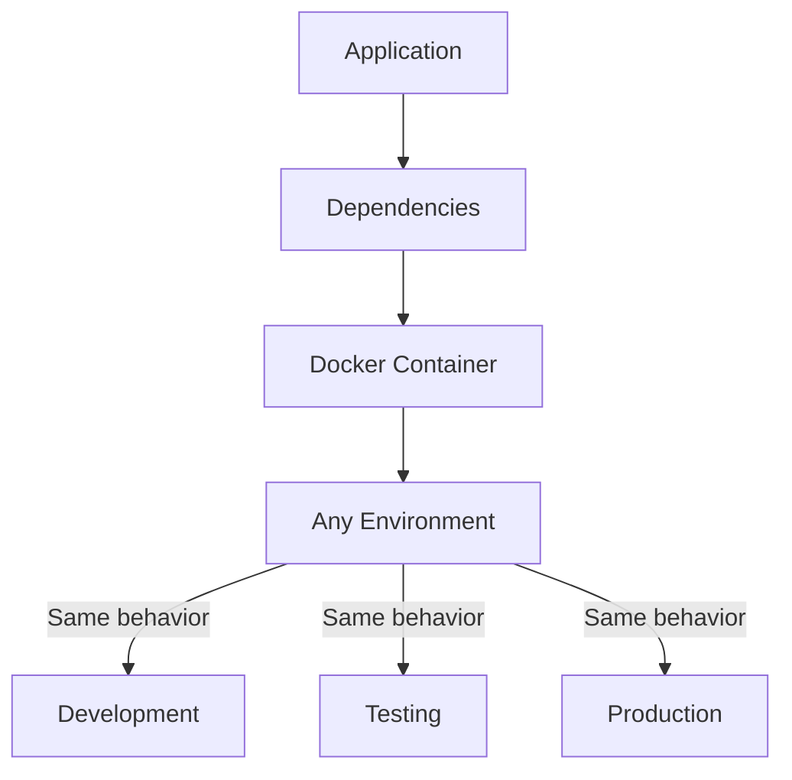
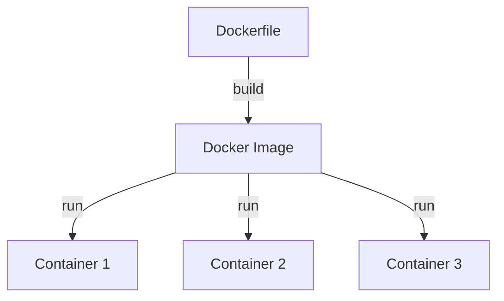
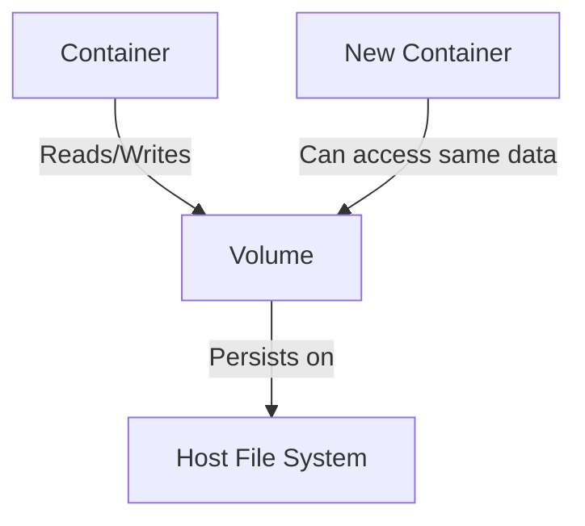
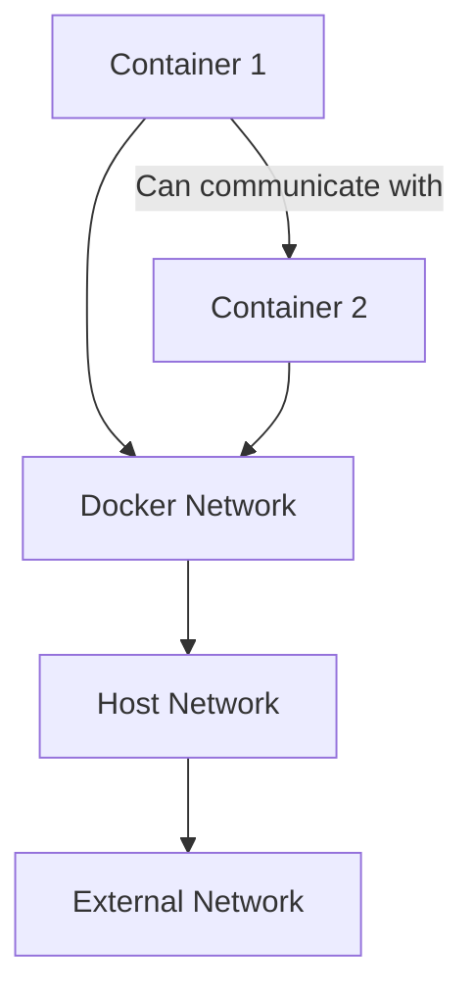
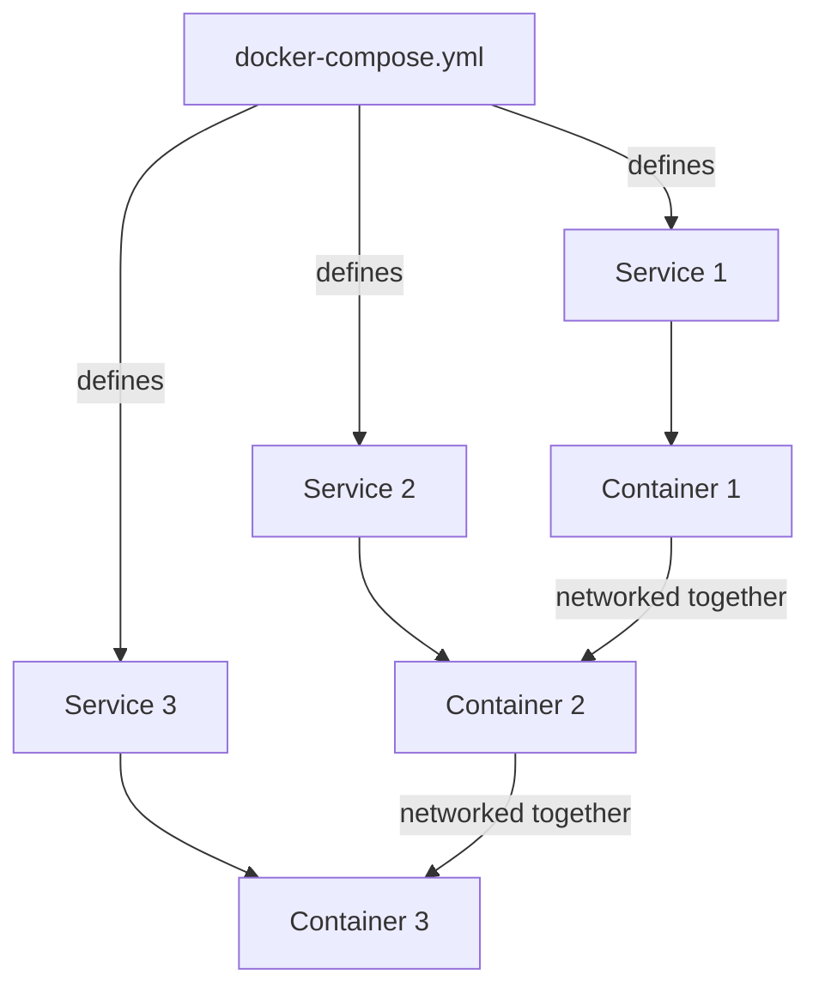

Docker has transformed how developers build, deploy, and run applications by introducing a powerful containerization approach. This crash course will guide you through the essential Docker concepts and commands you'll use daily, while giving you the foundation to explore more advanced topics on your own.

## What is Docker and Why Use It?

At its core, Docker is a platform that allows you to package applications with all their dependencies into standardized units called **containers**. These containers can run consistently across different environments, solving several critical problems in software development:

- **"Works on my machine" syndrome**: By packaging your application with all its dependencies, Docker eliminates inconsistencies between development, testing, and production environments.
- **Environment consistency**: The same container runs identically everywhere, preventing unexpected behavior when deploying.
- **Resource efficiency**: Containers are much lighter than virtual machines since they share the host's operating system kernel.
- **Isolation**: Applications in separate containers don't interfere with each other, improving stability and security.



## Prerequisites

Before diving into Docker, ensure your system meets these requirements:

- 64-bit processor
- 4GB RAM minimum (8GB+ recommended for smoother performance)
- Virtualization enabled in BIOS/UEFI
- Administrative access to your machine

## Installation

Getting Docker up and running is straightforward across all major platforms.

### For Windows:

1. Download Docker Desktop from [docker.com](https://www.docker.com/products/docker-desktop/)
2. Run the installer (WSL2 will be configured automatically)
3. Start Docker Desktop from your applications

### For Mac:

1. Download Docker Desktop from [docker.com](https://www.docker.com/products/docker-desktop/)
2. Drag the Docker icon to your Applications folder
3. Launch Docker Desktop and wait for it to initialize

### For Linux (Ubuntu example):

```bash
# Update packages
sudo apt update

# Install prerequisites
sudo apt install apt-transport-https ca-certificates curl software-properties-common

# Add Docker's GPG key
curl -fsSL https://download.docker.com/linux/ubuntu/gpg | sudo apt-key add -

# Add Docker repository
sudo add-apt-repository "deb [arch=amd64] https://download.docker.com/linux/ubuntu $(lsb_release -cs) stable"

# Install Docker
sudo apt update
sudo apt install docker-ce

# Add your user to the docker group (to run without sudo)
sudo usermod -aG docker ${USER}

# Log out and back in for changes to take effect
```

Once installed, verify everything is working properly:

```bash
docker --version
docker run hello-world
```

If you see the Docker version and the hello-world container runs successfully, you're ready to start your Docker journey.

## Core Concepts

Before diving into commands, let's understand the fundamental Docker concepts that form the foundation of everything you'll do.

### Images vs Containers

The relationship between Dockerfiles, images, and containers is central to understanding Docker:



- **Dockerfile**: A text file with instructions to build an image, similar to a recipe
- **Image**: A read-only template containing your application and all its dependencies
- **Container**: A running instance of an image, like a lightweight, isolated virtual machine
- **Registry**: A storage service for Docker images (like Docker Hub, which works similarly to GitHub but for Docker images)

With these concepts in mind, let's explore the essential commands you'll use daily.

## Essential Commands

Docker's command-line interface is how you'll interact with images and containers. Here are the commands you'll use most frequently:

### Working with Images

Images are the building blocks of containers. Here's how to manage them:

```bash
# Download an image from Docker Hub
docker pull nginx:latest
# List all images on your system
docker images
# Remove an image when you no longer need it
docker rmi nginx:latest
# Build an image from a Dockerfile
docker build -t myapp:1.0 .  # Don't forget the dot!
```

### Working with Containers

Once you have images, you'll create and manage containers with these commands:

```bash
# Run a container
docker run nginx:latest
# Run in detached mode (background)
docker run -d nginx:latest
# Run with interactive terminal
docker run -it ubuntu:latest bash
# Run with port mapping (host:container)
docker run -p 8080:80 nginx:latest
# Run with volume (for data persistence)
docker run -v /host/path:/container/path nginx:latest
# Run with environment variables
docker run -e DB_HOST=localhost -e DB_PORT=5432 myapp:1.0
# Run with a name
docker run --name webserver nginx:latest
# List running containers
docker ps
# List all containers (including stopped)
docker ps -a
# Stop a container
docker stop container_id_or_name
# Start a stopped container
docker start container_id_or_name
# Remove a container
docker rm container_id_or_name
# View container logs
docker logs container_id_or_name
# Execute command in running container
docker exec -it container_id_or_name bash
```

Now that you understand the basic commands, let's put them into practice with some examples.

## Example 1: Running Your First Container

Let's start with something simple - running a web server:

```bash
# Pull and run a Nginx web server
docker run -d -p 8080:80 --name my-webserver nginx:latest
# Check if it's running
docker ps
# Now visit http://localhost:8080 in your browser!
# View the logs
docker logs my-webserver
# Stop and remove when done
docker stop my-webserver
docker rm my-webserver
```

Just like that, you've deployed a web server without installing Nginx directly on your machine. This is the power of Docker - isolated, ready-to-run applications that don't interfere with your host system.

## Creating Docker Images with Dockerfile

While using pre-built images is convenient, you'll often need to create custom images for your applications. This is where Dockerfiles come in:

```dockerfile
# Base image
FROM node:14-alpine

# Set working directory
WORKDIR /app

# Copy dependency files
COPY package*.json ./

# Install dependencies
RUN npm install

# Copy application code
COPY . .

# Expose port for the application
EXPOSE 3000

# Command to run when container starts
CMD ["npm", "start"]
```

This Dockerfile defines a complete environment for a Node.js application. To turn it into an image:

```bash
docker build -t my-node-app:1.0 .
# The "." specifies the build context (current directory)
```

And to run your custom image:

```bash
docker run -d -p 3000:3000 my-node-app:1.0
```

Let's see how this works with a complete application example.

## Example 2: Node.js Web Application

Here's how to containerize a simple Express app:

1. Create `package.json`:

```json
{
  "name": "docker-demo",
  "version": "1.0.0",
  "description": "Docker demo app",
  "main": "app.js",
  "scripts": {
    "start": "node app.js"
  },
  "dependencies": {
    "express": "^4.17.1"
  }
}
```

2. Create `app.js`:

```javascript
const express = require('express');
const app = express();
const PORT = process.env.PORT || 3000;

app.get('/', (req, res) => {
  res.send('Hello from Docker!');
});

app.listen(PORT, () => {
  console.log(`Server running on port ${PORT}`);
});
```

3. Create `Dockerfile` (as shown earlier)

4. Build and run:

```bash
docker build -t node-demo .
docker run -d -p 3000:3000 --name my-node-app node-demo
# Visit http://localhost:3000 to see the app
```

Congratulations! You've just containerized a Node.js application. This pattern works for many types of applications - just adjust the Dockerfile for your language and framework.

## Data Persistence with Volumes

One challenge with containers is their ephemeral nature - when a container is removed, all data inside it is lost. This is where volumes come in, providing persistent storage for your containers:



Docker supports several types of data persistence:

- **Named volumes**: Managed by Docker, the easiest to use
- **Bind mounts**: Direct mapping to specific locations on your host filesystem
- **tmpfs mounts**: Stored in memory only, for sensitive or temporary data

Here's how to work with volumes:

```bash
# Create a named volume
docker volume create my-data

# Run with named volume
docker run -d -v my-data:/data --name my-container nginx

# Run with bind mount
docker run -d -v $(pwd)/html:/usr/share/nginx/html --name my-nginx nginx

# List volumes
docker volume ls

# Remove volume
docker volume rm my-data
```

Let's see how this works with a database example.

## Example 3: Database with Persistent Data

Databases are perfect candidates for volumes, as they need to persist data:

```bash
# Create a volume for database data
docker volume create postgres-data

# Run PostgreSQL with persistent storage
docker run -d \
  --name my-postgres \
  -e POSTGRES_PASSWORD=mysecretpassword \
  -e POSTGRES_USER=myuser \
  -e POSTGRES_DB=mydb \
  -p 5432:5432 \
  -v postgres-data:/var/lib/postgresql/data \
  postgres:13

# Now your database data persists even if you remove the container!
```

With this setup, you can stop, remove, and recreate the PostgreSQL container without losing your data. The data lives in the volume, safely stored on your host system.

## Networking in Docker

As your applications grow more complex, you'll often need multiple containers that can communicate with each other. Docker's networking capabilities make this possible:



Docker provides several network types to suit different needs:

- **bridge**: The default network that isolates containers while allowing them to communicate
- **host**: Uses the host's networking directly (no isolation)
- **none**: No network access (for maximum isolation)
- **custom**: User-defined networks with more control over container communication

Here's how to work with Docker networks:

```bash
# Create a custom network
docker network create my-network

# List networks
docker network ls

# Run container in specific network
docker run -d --network=my-network --name container1 nginx

# Connect existing container to network
docker network connect my-network container2

# Inspect network
docker network inspect my-network
```

Now let's see how networking works in a multi-container application.

## Example 4: Multi-Container Application with Networking

Here's how to create a web application that connects to a database:

```bash
# Create a network
docker network create app-network

# Run a database
docker run -d \
  --name postgres \
  --network app-network \
  -e POSTGRES_PASSWORD=password \
  -e POSTGRES_USER=user \
  -e POSTGRES_DB=myapp \
  postgres:13

# Run a web application that connects to the database
docker run -d \
  --name webapp \
  --network app-network \
  -p 8080:8080 \
  -e DB_HOST=postgres \
  -e DB_USER=user \
  -e DB_PASSWORD=password \
  -e DB_NAME=myapp \
  myapp:latest

# Containers can now communicate using container names as hostnames
# The webapp can connect to postgres using 'postgres' as the hostname
```

This setup illustrates a key Docker networking feature: containers on the same network can reach each other using container names as hostnames. This simplifies configuration and makes your applications more portable.

While managing multiple containers with individual commands works, it can become unwieldy as your application grows. This is where Docker Compose comes in.

## Docker Compose for Multi-Container Applications

Docker Compose lets you define and manage multi-container applications with a single YAML file:



With Docker Compose, you can:

- Define all services in one file
- Start all containers with a single command
- Create a default network for your services automatically
- Define dependencies between services

Here's an example `docker-compose.yml`:

```yaml
version: '3'
services:
  web:
    build: . # Build from Dockerfile in current directory
    ports:
      - '8080:80'
    depends_on:
      - db
    environment:
      - DB_HOST=db
      - DB_USER=postgres
      - DB_PASSWORD=password
      - DB_NAME=myapp

  db:
    image: postgres:13
    volumes:
      - db-data:/var/lib/postgresql/data
    environment:
      - POSTGRES_USER=postgres
      - POSTGRES_PASSWORD=password
      - POSTGRES_DB=myapp

volumes:
  db-data: # Named volume for database data
```

And here are the essential Docker Compose commands:

```bash
# Start all services
docker-compose up

# Start in detached mode
docker-compose up -d

# Stop all services
docker-compose down

# Stop and remove volumes
docker-compose down -v

# View logs
docker-compose logs

# View logs for specific service
docker-compose logs web

# Scale a service
docker-compose up -d --scale web=3
```

Let's see Docker Compose in action with a full-stack application.

## Example 5: Full Stack Application with Docker Compose

Imagine you're building an application with a React frontend, a Node.js backend, and a PostgreSQL database. Here's how you'd set it up with Docker Compose:

1. Create a `docker-compose.yml`:

```yaml
version: '3'
services:
  frontend:
    build: ./frontend
    ports:
      - '3000:3000'
    depends_on:
      - backend

  backend:
    build: ./backend
    ports:
      - '5000:5000'
    depends_on:
      - db
    environment:
      - DB_HOST=db
      - DB_USER=postgres
      - DB_PASSWORD=password
      - DB_NAME=myapp

  db:
    image: postgres:13
    volumes:
      - postgres-data:/var/lib/postgresql/data
    environment:
      - POSTGRES_USER=postgres
      - POSTGRES_PASSWORD=password
      - POSTGRES_DB=myapp

volumes:
  postgres-data:
```

2. Start everything with a single command:

```bash
docker-compose up -d
```

With this setup, Docker Compose handles creating a network, starting containers in the right order, and connecting everything together. This drastically simplifies development and deployment of complex applications.

## Best Practices

As you become more comfortable with Docker, these best practices will help you create more efficient and secure containers.

### Dockerfile Best Practices:

1. **Use specific base image tags** (e.g., `node:14-alpine` not just `node`) to ensure consistency
2. **Minimize layers** by combining related commands with `&&` to reduce image size
3. **Order instructions by change frequency** (less frequent at top) to optimize build times
4. **Use .dockerignore** to exclude unnecessary files from your build context
5. **Use multi-stage builds** for smaller production images

Here's how a multi-stage build looks:

```dockerfile
# Build stage
FROM node:14-alpine AS build
WORKDIR /app
COPY package*.json ./
RUN npm install
COPY . .
RUN npm run build

# Production stage
FROM nginx:alpine
COPY --from=build /app/build /usr/share/nginx/html
EXPOSE 80
CMD ["nginx", "-g", "daemon off;"]
```

This approach drastically reduces the final image size by including only what's needed for production.

### Security Best Practices:

1. **Don't run as root** inside containers to limit potential damage from breaches
2. **Scan images for vulnerabilities** using tools like Docker Scout
3. **Use official or verified images** to reduce the risk of malicious code
4. **Keep images updated** with security patches to protect against known vulnerabilities
5. **Don't store secrets in images** - use environment variables or dedicated secrets management

## Database Seed Example (for PostgreSQL)

When working with databases in Docker, you'll often need to initialize them with schema and data. Here's how to do it with PostgreSQL:

Create a `seed.sql` file:

```sql
-- Create tables
CREATE TABLE IF NOT EXISTS users (
    id SERIAL PRIMARY KEY,
    name VARCHAR(100) NOT NULL,
    email VARCHAR(100) UNIQUE NOT NULL,
    created_at TIMESTAMP DEFAULT CURRENT_TIMESTAMP
);

-- Seed data
INSERT INTO users (name, email) VALUES
('John Doe', 'john@example.com'),
('Jane Smith', 'jane@example.com'),
('Bob Johnson', 'bob@example.com');
```

Then add the initialization to your docker-compose:

```yaml
services:
  db:
    image: postgres:13
    volumes:
      - postgres-data:/var/lib/postgresql/data
      - ./seed.sql:/docker-entrypoint-initdb.d/seed.sql # This will run on initialization
    environment:
      - POSTGRES_USER=postgres
      - POSTGRES_PASSWORD=password
      - POSTGRES_DB=myapp
```

PostgreSQL automatically executes any .sql files in the `/docker-entrypoint-initdb.d/` directory when the container first initializes, making this an elegant way to seed your database.

## The Remaining 15%: Advanced Topics

Now that you've mastered the essentials of Docker, here are the advanced topics you can explore on your own:

1. **Container Orchestration**

   - Kubernetes for managing containerized applications at scale
   - Docker Swarm for native Docker orchestration in multi-server environments

2. **Advanced Networking**

   - Overlay networks for multi-host deployments
   - Network policies and security for fine-grained access control

3. **Docker in CI/CD Pipelines**

   - Integrating Docker with GitHub Actions, Jenkins, or GitLab CI
   - Automated testing and deployment of containers for continuous delivery

4. **Advanced Security**

   - Docker Content Trust for image signing and verification
   - Security scanning and hardening techniques
   - Rootless containers for additional security

5. **Monitoring and Logging**

   - Container monitoring with Prometheus and Grafana
   - Centralized logging with ELK stack (Elasticsearch, Logstash, Kibana)

6. **Docker on Different Platforms**
   - Windows containers for .NET applications
   - Edge and IoT deployments for resource-constrained environments

As you delve into these topics, you'll find that your solid foundation in Docker basics will serve you well.

## Summary

Congratulations! You've now learned the 85% of Docker you'll use on a daily basis:

- Core concepts of images and containers
- Essential commands for managing Docker resources
- Creating custom images with Dockerfiles
- Persisting data with volumes
- Connecting containers with networking
- Orchestrating multi-container applications with Docker Compose
- Best practices for efficiency and security

The examples provided should help you get started immediately, and you now have the knowledge foundation to explore the more advanced topics on your own.

Remember that Docker is all about making development and deployment more consistent and efficient. As you integrate Docker into your workflow, you'll find that it simplifies many complex tasks and allows you to focus on what matters most: building great applications.

Happy containerizing!
