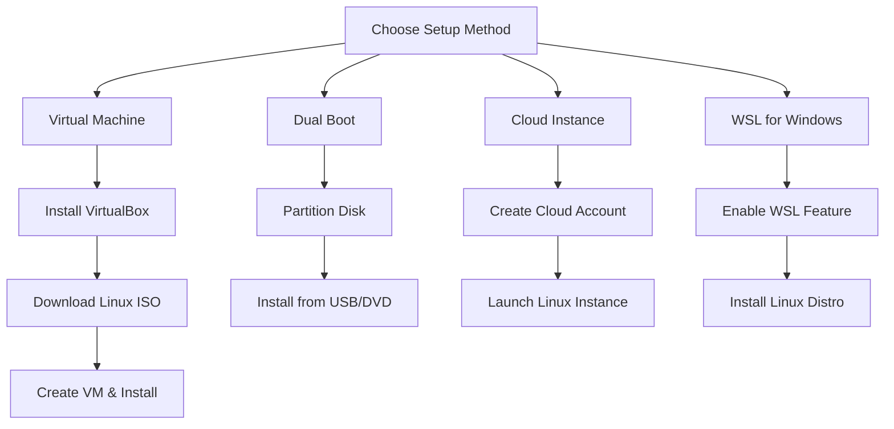
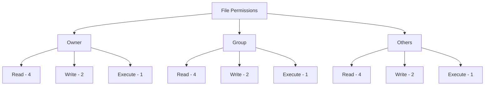

Welcome to your Linux administration crash course! This guide covers the fundamental 85% of Linux administration skills you'll use daily, while giving you the foundation to explore more advanced topics independently.

## Introduction to Linux

Linux is an open-source operating system kernel created by Linus Torvalds in 1991. It now powers everything from smartphones to supercomputers. Linux is organized into distributions ("distros") – different flavors of the operating system with unique characteristics but sharing the same core principles.

### Key Linux Distributions

- **Ubuntu/Debian**: User-friendly, extensive package repositories, ideal for beginners
- **CentOS/Red Hat Enterprise Linux (RHEL)**: Enterprise-focused, stable, preferred in corporate environments
- **Fedora**: Cutting-edge features, sponsored by Red Hat
- **Arch Linux**: Minimalist and highly customizable
- **SUSE/OpenSUSE**: Enterprise-ready with excellent administration tools

Once you've chosen a distribution that fits your needs, the next step is setting up your Linux environment.

## Setting Up Your Linux Environment

Before diving into administration tasks, you need a Linux system to practice on. There are several ways to get started, each with its own advantages:

### Installation Methods



**Method 1: Virtual Machine (Recommended for Beginners)**

```bash
# Install VirtualBox on Windows/macOS
# Download an Ubuntu or CentOS ISO from their official website
# In VirtualBox:
# 1. Click "New"
# 2. Name your VM and select the Linux type and version
# 3. Allocate at least 2GB RAM
# 4. Create a virtual hard disk (20GB+)
# 5. Mount the ISO and start the VM
# 6. Follow the installation prompts
```

**Basic System Requirements:**

- 2GB RAM minimum (4GB recommended)
- 20GB disk space
- Internet connection for updates
- 64-bit processor (recommended)

With your Linux system set up, you'll need to understand how Linux organizes files and directories.

## Linux File System Hierarchy

Unlike Windows with its drive letters, Linux organizes everything in a single tree-like structure. Understanding this hierarchy is foundational for effective administration:

### Key Directories

- **/bin**: Essential command binaries (ls, cp, mv)
- **/boot**: Boot loader files and kernel
- **/dev**: Device files (hardware access)
- **/etc**: System configuration files
- **/home**: User home directories
- **/lib**: Essential shared libraries
- **/media**: Mount point for removable media
- **/mnt**: Temporary mount points
- **/opt**: Optional application software
- **/proc**: Virtual filesystem for process info
- **/root**: Home directory for the root user
- **/sbin**: System binaries (for administrators)
- **/tmp**: Temporary files (cleared on reboot)
- **/usr**: User utilities and applications
- **/var**: Variable files (logs, mail, databases)

### Navigating the File System

Now that you understand the structure, you'll need commands to navigate and manipulate files:

```bash
pwd                   # Print Working Directory - shows current location
ls -la                # List All files with details (-l=long format, -a=all files)
cd /path/to/directory # Change Directory to specified path
cd ..                 # Go up one directory level
cd ~                  # Go to your home directory
mkdir new_directory   # Create a new directory
rmdir empty_directory # Remove an empty directory
rm file.txt           # Remove a file
rm -r directory       # Remove directory and all contents (use carefully!)
```

These basic navigation commands are just the beginning. To become proficient in Linux administration, you'll need to master the command line interface.

## Command Line Fundamentals

The command line is where Linux administrators work most efficiently. While graphical interfaces exist, the real power of Linux comes through its terminal commands:

### Essential Commands

```bash
# File Operations
touch file.txt         # Create empty file
cp source destination  # Copy file (-r for directories)
mv source destination  # Move/rename file or directory
cat file.txt           # Display file contents
less file.txt          # View file contents with scrolling (q to quit)
head -n 10 file.txt    # Show first 10 lines
tail -n 10 file.txt    # Show last 10 lines
grep "pattern" file    # Search for pattern in file

# System Information
uname -a               # Kernel version and system info
cat /etc/os-release    # Distribution info
df -h                  # Disk usage (human-readable)
free -h                # Memory usage (human-readable)
top                    # Process viewer (q to quit)
ps aux                 # List all processes
```

### I/O Redirection and Pipes

What makes the Linux command line truly powerful is the ability to connect commands together, creating powerful combinations:

```bash
command > file.txt     # Redirect output to file (overwrites)
command >> file.txt    # Append output to file
command 2> errors.txt  # Redirect error messages
command1 | command2    # Pipe output from command1 to command2

# Example: Find 10 largest files in /var, sort by size
find /var -type f -exec du -h {} \; | sort -rh | head -n 10
```

With these command-line basics, you're ready to tackle one of the most important aspects of system administration: managing users and their permissions.

## User and Group Management

Linux is a multi-user system designed from the ground up for shared environments. Managing users and their access rights is a core responsibility:

### User Management Commands

```bash
# Add new user
sudo useradd -m username  # -m creates home directory

# Set/change password
sudo passwd username

# Delete user
sudo userdel -r username  # -r removes home directory

# Add user to group
sudo usermod -aG groupname username

# Create new group
sudo groupadd groupname

# View user info
id username  # Shows UID, GID and group memberships
```

### File Permissions

Linux uses a sophisticated yet elegant permission system that controls who can access files and what they can do with them:



```bash
# Change file permissions
chmod 755 file.txt     # Owner: rwx, Group: r-x, Others: r-x
# OR
chmod u=rwx,g=rx,o=rx file.txt  # Same as above

# Change file owner
chown user:group file.txt
```

Numeric permissions:

- Read (r) = 4
- Write (w) = 2
- Execute (x) = 1

Common permissions:

- 755 (rwxr-xr-x): Executable files
- 644 (rw-r--r--): Regular files
- 700 (rwx------): Private scripts

With users and permissions managed, we need to look at another critical aspect of administration: controlling the programs that run on your system.

## Process Management

Every running program in Linux is a process. Managing these processes is essential for maintaining system performance and stability:

### Viewing and Managing Processes

```bash
# List processes
ps aux                # All processes (detailed)
top                   # Interactive process viewer
htop                  # Enhanced process viewer (may need installation)

# Process control
kill PID              # Send termination signal
kill -9 PID           # Force kill (last resort)
killall process_name  # Kill all processes with this name

# Background processes
command &             # Run command in background
fg                    # Bring background job to foreground
bg                    # Resume stopped job in background
jobs                  # List background jobs
nohup command &       # Run immune to hangups (stays running when you log out)
```

Understanding process management helps maintain system responsiveness. Equally important is managing the storage where your data and programs reside.

## Storage Management

Linux offers powerful tools for managing disks, partitions, and filesystems to ensure your data is organized and accessible:

### Disk and Partition Management

```bash
# List disks and partitions
lsblk                 # List block devices
fdisk -l              # List partition tables (requires sudo)

# Create and format partitions (interactive tools)
sudo fdisk /dev/sdX   # Partition a disk (X is disk letter)
sudo mkfs.ext4 /dev/sdX1  # Format partition with ext4 filesystem

# Mount filesystems
sudo mount /dev/sdX1 /mnt/mountpoint
```

### Adding Permanent Mounts

To ensure your storage devices are automatically available after reboot, you need to configure them in the filesystem table:

```bash
# First create a mount point
sudo mkdir /mnt/data

# Add to /etc/fstab (use sudo):
# /dev/sdX1  /mnt/data  ext4  defaults  0  2

# Test mount
sudo mount -a  # Mount all entries in fstab
```

### Logical Volume Management (LVM)

For more advanced storage needs, Linux offers Logical Volume Management which provides flexibility in resizing and managing storage:

```bash
# Create physical volume
sudo pvcreate /dev/sdX1

# Create volume group
sudo vgcreate vg_name /dev/sdX1

# Create logical volume
sudo lvcreate -L 10G -n lv_name vg_name

# Format and mount
sudo mkfs.ext4 /dev/vg_name/lv_name
sudo mount /dev/vg_name/lv_name /mnt/mountpoint
```

With storage configured, you'll need to know how to install and manage software on your system.

## Software Management

Linux distributions use package managers to install, update, and remove software. The commands differ between distribution families:

### Debian/Ubuntu (APT)

```bash
sudo apt update             # Update package lists
sudo apt upgrade            # Upgrade installed packages
sudo apt install package    # Install package
sudo apt remove package     # Remove package
apt search keyword          # Search for package
apt show package            # Show package details
```

### RHEL/CentOS/Fedora (DNF/YUM)

```bash
sudo dnf check-update      # Update package lists
sudo dnf upgrade           # Upgrade installed packages
sudo dnf install package   # Install package
sudo dnf remove package    # Remove package
dnf search keyword         # Search for package
dnf info package           # Show package details
```

Most Linux servers connect to networks, so networking knowledge is crucial for a Linux administrator.

## Network Configuration

Networking allows your Linux system to communicate with other systems, whether locally or across the internet:

### Basic Network Commands

```bash
ip addr                    # Show IP addresses
ping hostname_or_ip        # Test connectivity
traceroute hostname_or_ip  # Trace network path
nslookup domain.com        # DNS lookup
dig domain.com             # Advanced DNS lookup
ss -tuln                   # Show listening ports
wget URL                   # Download file
curl URL                   # Get URL content
```

### Network Configuration Files

Understanding these files helps you configure networking persistently:

- **/etc/hosts**: Local hostname resolution
- **/etc/resolv.conf**: DNS settings
- **/etc/network/interfaces** (Debian/Ubuntu) or **/etc/sysconfig/network-scripts/** (RHEL): Network settings

### Basic Firewall Configuration

Securing your network connections is essential:

```bash
# Ubuntu/Debian - UFW (Uncomplicated Firewall)
sudo ufw status            # Check status
sudo ufw enable            # Enable firewall
sudo ufw allow 22/tcp      # Allow SSH connections
sudo ufw allow http        # Allow HTTP (port 80)

# RHEL/CentOS - firewalld
sudo firewall-cmd --state
sudo firewall-cmd --add-service=ssh --permanent
sudo firewall-cmd --add-service=http --permanent
sudo firewall-cmd --reload
```

Once your system is networked, you need to keep an eye on its health and performance.

## System Monitoring and Logging

A responsible administrator constantly monitors system health and investigates issues through logs:

### System Monitoring

```bash
# Resource usage
top                        # CPU/memory usage (interactive)
free -h                    # Memory usage (human-readable)
df -h                      # Disk usage (human-readable)
vmstat                     # System statistics
iostat                     # Input/Output statistics
```

### Log Management

Linux keeps detailed logs that help diagnose issues:

- **/var/log/syslog** or **/var/log/messages**: General system logs
- **/var/log/auth.log** or **/var/log/secure**: Authentication logs
- **/var/log/kern.log**: Kernel logs
- **/var/log/apache2/** or **/var/log/httpd/**: Web server logs

```bash
# View logs
less /var/log/syslog      # View log file
tail -f /var/log/syslog   # Follow log updates in real-time
grep "error" /var/log/syslog  # Search logs

# Systemd journal
journalctl                # View all logs
journalctl -u service_name  # Service-specific logs
journalctl -f             # Follow new log entries
```

Proper system operation depends on services running correctly, so service management is another critical skill.

## Service Management

Modern Linux systems use systemd to manage services (daemons) that run in the background:

```bash
systemctl status service_name   # Check service status
systemctl start service_name    # Start service
systemctl stop service_name     # Stop service
systemctl restart service_name  # Restart service
systemctl enable service_name   # Enable at boot
systemctl disable service_name  # Disable at boot
systemctl list-units --type=service  # List all services
```

As your administration tasks grow more complex, you'll want to automate them through scripting.

## Basic Shell Scripting

Shell scripts allow you to automate repeated tasks, combining multiple commands into reusable tools:

```bash
#!/bin/bash
# My first shell script

# Variables
NAME="Linux Admin"
echo "Hello, $NAME!"

# Command output in variable
CURRENT_DIR=$(pwd)
echo "You are in: $CURRENT_DIR"

# Conditionals
if [ "$1" = "test" ]; then
    echo "Test parameter provided"
else
    echo "No test parameter"
fi

# Loops
echo "Counting to 5:"
for i in {1..5}; do
    echo "Number: $i"
done

# Functions
my_function() {
    echo "Function executed with parameter: $1"
}

# Call function
my_function "parameter1"

# Exit with success status code
exit 0
```

Save as `myscript.sh`, then:

```bash
chmod +x myscript.sh     # Make executable
./myscript.sh test       # Run with parameter
```

### Scheduled Tasks with Cron

For tasks that need to run at specific times or intervals, Linux provides the cron system:

```bash
crontab -e               # Edit your crontab

# Format: minute hour day_of_month month day_of_week command
# Run script daily at 2:30 AM
30 2 * * * /path/to/script.sh

# Special shortcuts
@daily /path/to/script.sh
@weekly /path/to/script.sh
@monthly /path/to/script.sh
```

In our increasingly connected world, system security has become a top priority.

## Basic Security Practices

Implementing fundamental security practices helps protect your Linux systems from threats:

### System Updates

Keeping systems updated is your first line of defense:

```bash
# Debian/Ubuntu
sudo apt update && sudo apt upgrade -y

# RHEL/CentOS
sudo dnf upgrade -y
```

### SSH Hardening

Since SSH is often the primary way to access remote systems, securing it is crucial:

Edit `/etc/ssh/sshd_config`:

```
# Disable root login
PermitRootLogin no

# Use key authentication only
PasswordAuthentication no
```

After changes:

```bash
sudo systemctl restart sshd
```

### Setting Up SSH Key Authentication

Using encryption keys instead of passwords dramatically improves security:

```bash
# On your local machine
ssh-keygen -t ed25519      # Generate key pair
ssh-copy-id user@server    # Copy to server

# Now you can login without password
ssh user@server
```

Now that you've covered the essential 85% of Linux administration skills, let's briefly explore what lies ahead.

## The Remaining 15%: Advanced Topics

Here's what you'll want to explore once you've mastered the fundamentals:

1. **Advanced Security**

   - SELinux and AppArmor for mandatory access control
   - Security auditing tools (OpenSCAP, Lynis)
   - Intrusion detection systems (Snort, OSSEC)
   - Encryption techniques and certificate management

2. **Containerization and Virtualization**

   - Docker and container fundamentals
   - Kubernetes for orchestration
   - KVM and Libvirt for virtualization

3. **High Availability and Clustering**

   - Load balancing (HAProxy, Nginx)
   - Failover configurations
   - Clustered storage and services

4. **Advanced Networking**

   - Software-defined networking
   - Network namespaces and virtual networking
   - Advanced routing configurations
   - VPN setup and management

5. **Enterprise Authentication**

   - LDAP and Active Directory integration
   - Kerberos authentication
   - Single Sign-On (SSO) solutions

6. **Advanced Storage**

   - Storage Area Networks (SAN)
   - Network Attached Storage (NAS)
   - Distributed file systems (GlusterFS, Ceph)
   - Advanced RAID configurations

7. **Automation and Infrastructure as Code**

   - Ansible for configuration management
   - Terraform for infrastructure provisioning
   - GitOps workflows for infrastructure

8. **Performance Tuning**

   - Kernel parameter optimization
   - Resource control with cgroups
   - I/O scheduling and performance monitoring

9. **Cloud Integration**
   - AWS, Azure, and Google Cloud services
   - Cloud-init and cloud-native configurations
   - Hybrid cloud deployments

## Conclusion

You've now learned the essential 85% of Linux administration skills that you'll use daily. From setting up your first system to managing users, processes, storage, networking, services, and security, these fundamentals form the core of Linux administration.

The key to mastering Linux is practice. Set up a test environment, experiment with different commands, and don't be afraid to break things—that's often when the best learning happens. As you become comfortable with these basics, gradually explore the more advanced topics to expand your expertise.

Remember: in Linux, there are usually multiple ways to accomplish the same task. Focus on understanding the concepts rather than memorizing commands, and you'll develop the problem-solving skills that make a successful Linux administrator.
