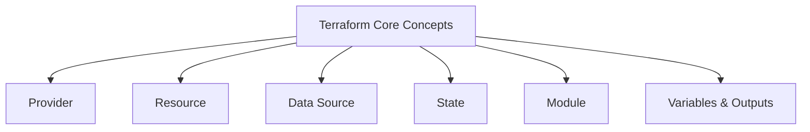
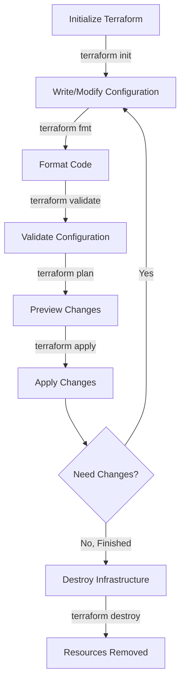
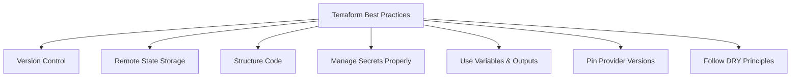

# Terraform Crash Course: Infrastructure as Code Fundamentals

Welcome to this crash course on Terraform! By the end of this guide, you'll understand 85% of what you need for daily work with Terraform and have the foundation to explore the remaining 15% on your own.

## What is Terraform?

Terraform is an Infrastructure as Code (IaC) tool created by HashiCorp that lets you define, provision, and manage infrastructure across various cloud providers using declarative configuration files. Instead of manually clicking through web interfaces to set up servers, networks, and other resources, you write code that describes your desired infrastructure state.

### Key Benefits

- **Declarative**: You specify what you want, not how to create it
- **Multi-Cloud**: Works with AWS, Azure, GCP, and many others
- **Version Control**: Infrastructure changes can be tracked like application code
- **Consistency**: Same infrastructure every time you deploy
- **Automation**: Reduces human error through repeatable processes
- **Collaboration**: Teams can work together efficiently on infrastructure

## Prerequisites

Before diving into Terraform, it helps to have:

- Basic command-line experience
- Familiarity with at least one cloud provider (AWS, Azure, or GCP)
- Understanding of basic infrastructure concepts (VMs, networks, storage)
- A text editor (VS Code recommended with the Terraform extension)

## Installation and Setup

Let's start by installing Terraform on your system:

### For macOS:

```bash
brew install terraform
```

### For Windows:

```bash
choco install terraform
```

### For Linux:

```bash
wget -O- https://apt.releases.hashicorp.com/gpg | gpg --dearmor | sudo tee /usr/share/keyrings/hashicorp-archive-keyring.gpg
echo "deb [signed-by=/usr/share/keyrings/hashicorp-archive-keyring.gpg] https://apt.releases.hashicorp.com $(lsb_release -cs) main" | sudo tee /etc/apt/sources.list.d/hashicorp.list
sudo apt update && sudo apt install terraform
```

After installation, verify everything is working:

```bash
terraform version
# Should output something like: Terraform v1.5.7
```

## Core Concepts

Before writing any code, let's understand the fundamental building blocks of Terraform:



### Provider

A provider is a plugin that connects Terraform to a specific platform like AWS, Azure, or GCP. Providers give Terraform the ability to create and manage resources on that platform.

### Resource

A resource represents an infrastructure component that Terraform manages, such as a virtual machine, database, or network. Resources are the main building blocks of your infrastructure.

### Data Source

A data source lets you fetch information about existing infrastructure not managed by your current Terraform configuration. This is useful for referencing resources you didn't create with Terraform.

### State

Terraform maintains a state file that maps the resources in your configuration to real-world resources. This state file is crucial for tracking what Terraform has created and how it should be updated.

### Module

A module is a collection of resources that are used together as a unit. Think of modules as reusable components or templates that you can use across multiple projects.

### Variables & Outputs

Variables let you customize configurations without changing the code, while outputs expose information about your infrastructure after creation for other systems to use.

## Terraform Workflow

The Terraform workflow follows a consistent pattern that you'll use repeatedly in your projects:



Let's explore each step in this workflow:

### 1. Initialize (terraform init)

This command prepares your working directory, downloads required providers, and sets up the backend for storing state.

```bash
terraform init
# Output: Terraform has been successfully initialized!
```

### 2. Format (terraform fmt)

This command automatically formats your configuration files for consistent style and readability.

```bash
terraform fmt
# Will reformat files and return names of the modified files
```

### 3. Validate (terraform validate)

Checks if your configuration is syntactically valid and internally consistent before you try to apply it.

```bash
terraform validate
# Output: Success! The configuration is valid.
```

### 4. Plan (terraform plan)

Creates an execution plan showing exactly what Terraform will do when you apply your configuration.

```bash
terraform plan
# Output will show what resources will be created, modified, or destroyed
```

### 5. Apply (terraform apply)

Executes the actions proposed in the plan to create or modify your infrastructure.

```bash
terraform apply
# Shows the plan and asks for confirmation
# Apply complete! Resources: 1 added, 0 changed, 0 destroyed.
```

### 6. Destroy (terraform destroy)

When you're done, this command removes all resources managed by your Terraform configuration.

```bash
terraform destroy
# Shows what will be destroyed and asks for confirmation
```

## Writing Terraform Configuration

Terraform uses HashiCorp Configuration Language (HCL) for its configuration files. Let's start with a simple example to see how it works:

### Basic Structure

Configuration files use the `.tf` extension and follow this structure:

```hcl
# Configure a provider (AWS in this example)
provider "aws" {
  region = "us-east-1"
}

# Define a resource
resource "aws_instance" "example" {
  ami           = "ami-0c55b159cbfafe1f0"
  instance_type = "t2.micro"

  tags = {
    Name = "example-instance"
  }
}
```

The syntax is straightforward:

- `provider` blocks configure which cloud or service providers to use
- `resource` blocks define infrastructure components to create
- Each resource has a type (`aws_instance`) and a name (`example`)
- Inside each block, you set various configuration options

### Variables and Outputs

To make your configurations flexible and reusable, Terraform provides variables and outputs. Start by creating a `variables.tf` file:

```hcl
variable "instance_type" {
  description = "The EC2 instance type"
  type        = string
  default     = "t2.micro"  # Default value if none is provided
}

variable "ami_id" {
  description = "The AMI ID to use"
  type        = string
  # No default - must be provided
}
```

Then reference these variables in your main configuration:

```hcl
resource "aws_instance" "example" {
  ami           = var.ami_id
  instance_type = var.instance_type
}
```

Outputs provide useful information after applying your configuration. Create an `outputs.tf` file:

```hcl
output "instance_ip" {
  description = "The public IP of the instance"
  value       = aws_instance.example.public_ip
}
```

After applying your configuration, Terraform will display these outputs, which you can also retrieve later with `terraform output`.

### Setting Variable Values

You can set variable values in multiple ways, giving you flexibility in how you configure your infrastructure:

1. In a `.tfvars` file (e.g., `terraform.tfvars`):

```hcl
ami_id        = "ami-0c55b159cbfafe1f0"
instance_type = "t3.micro"
```

2. Command line:

```bash
terraform apply -var="ami_id=ami-0c55b159cbfafe1f0" -var="instance_type=t3.micro"
```

3. Environment variables:

```bash
export TF_VAR_ami_id=ami-0c55b159cbfafe1f0
export TF_VAR_instance_type=t3.micro
```

This flexibility allows you to use the same configuration files across different environments by changing only the variable values.

## State Management

Terraform's state file (`terraform.tfstate`) is a crucial part of how it works. This file maps your configuration to real-world resources and helps Terraform know what it's managing.

By default, state is stored locally, but for team environments, you should use a remote backend to share state and prevent conflicts.

### Remote State (AWS S3 Example)

```hcl
terraform {
  backend "s3" {
    bucket         = "my-terraform-state"
    key            = "prod/terraform.tfstate"
    region         = "us-east-1"
    encrypt        = true
    dynamodb_table = "terraform-lock"  # For state locking
  }
}
```

This configuration stores your state in an S3 bucket and uses DynamoDB for state locking to prevent conflicts when multiple people are making changes.

### State Commands

Terraform provides several commands to help you manage state:

```bash
# List resources in state
terraform state list

# Show details of a specific resource
terraform state show aws_instance.example

# Move a resource (e.g., after renaming)
terraform state mv aws_instance.old aws_instance.new

# Remove a resource from state (without destroying it)
terraform state rm aws_instance.example
```

These commands help you manage your state file and deal with changes to your configuration structure.

## Working with Modules

As your infrastructure grows, you'll want to organize your code into reusable components called modules. Think of modules as functions for your infrastructure code.

### Creating a Module

Start by creating a directory structure like this:

```
my-module/
├── main.tf          # Contains resources
├── variables.tf     # Input variables
├── outputs.tf       # Output values
└── README.md        # Documentation
```

Example `main.tf` in your module:

```hcl
resource "aws_instance" "instance" {
  ami           = var.ami_id
  instance_type = var.instance_type
  tags          = var.tags
}
```

Example `variables.tf`:

```hcl
variable "ami_id" {
  description = "The AMI ID to use"
  type        = string
}

variable "instance_type" {
  description = "The instance type"
  type        = string
  default     = "t2.micro"
}

variable "tags" {
  description = "Resource tags"
  type        = map(string)
  default     = {}
}
```

Example `outputs.tf`:

```hcl
output "instance_id" {
  description = "ID of the created instance"
  value       = aws_instance.instance.id
}
```

### Using a Module

In your main configuration, you can now use this module:

```hcl
module "web_server" {
  source        = "./modules/ec2-instance"  # Path to module
  ami_id        = "ami-0c55b159cbfafe1f0"
  instance_type = "t2.medium"
  tags = {
    Name = "Web Server"
  }
}

# Access module outputs
output "web_server_id" {
  value = module.web_server.instance_id
}
```

Modules help you create standardized, reusable infrastructure components, reducing duplication and making your configurations more maintainable.

## Practical Example: AWS Web Server

Let's put everything together with a complete example that provisions a web server on AWS with all necessary components:

```hcl
# Configure the AWS Provider
provider "aws" {
  region = "us-east-1"
}

# Create a VPC
resource "aws_vpc" "main" {
  cidr_block = "10.0.0.0/16"
  tags = {
    Name = "main-vpc"
  }
}

# Create a public subnet
resource "aws_subnet" "public" {
  vpc_id                  = aws_vpc.main.id
  cidr_block              = "10.0.1.0/24"
  map_public_ip_on_launch = true
  tags = {
    Name = "public-subnet"
  }
}

# Create an internet gateway
resource "aws_internet_gateway" "gw" {
  vpc_id = aws_vpc.main.id
  tags = {
    Name = "main-igw"
  }
}

# Create a route table
resource "aws_route_table" "public" {
  vpc_id = aws_vpc.main.id

  route {
    cidr_block = "0.0.0.0/0"
    gateway_id = aws_internet_gateway.gw.id
  }

  tags = {
    Name = "public-rt"
  }
}

# Associate route table with subnet
resource "aws_route_table_association" "public" {
  subnet_id      = aws_subnet.public.id
  route_table_id = aws_route_table.public.id
}

# Create a security group
resource "aws_security_group" "web" {
  name        = "web-sg"
  description = "Allow HTTP and SSH traffic"
  vpc_id      = aws_vpc.main.id

  ingress {
    from_port   = 80
    to_port     = 80
    protocol    = "tcp"
    cidr_blocks = ["0.0.0.0/0"]
    description = "Allow HTTP from anywhere"
  }

  ingress {
    from_port   = 22
    to_port     = 22
    protocol    = "tcp"
    cidr_blocks = ["0.0.0.0/0"]  # In production, restrict to your IP
    description = "Allow SSH from anywhere (restrict in production)"
  }

  egress {
    from_port   = 0
    to_port     = 0
    protocol    = "-1"
    cidr_blocks = ["0.0.0.0/0"]
    description = "Allow all outbound traffic"
  }

  tags = {
    Name = "web-sg"
  }
}

# Find latest Amazon Linux 2 AMI
data "aws_ami" "amazon_linux" {
  most_recent = true
  owners      = ["amazon"]

  filter {
    name   = "name"
    values = ["amzn2-ami-hvm-*-x86_64-gp2"]
  }
}

# Create EC2 instance
resource "aws_instance" "web" {
  ami                    = data.aws_ami.amazon_linux.id
  instance_type          = "t2.micro"
  subnet_id              = aws_subnet.public.id
  vpc_security_group_ids = [aws_security_group.web.id]

  user_data = <<-EOF
              #!/bin/bash
              yum update -y
              yum install -y httpd
              systemctl start httpd
              systemctl enable httpd
              echo "Hello World from Terraform" > /var/www/html/index.html
              EOF

  tags = {
    Name = "web-server"
  }
}

# Output the web server's public IP
output "web_public_ip" {
  value = aws_instance.web.public_ip
  description = "Public IP address of the web server"
}
```

This example demonstrates how Terraform can create multiple interconnected resources that together form a complete infrastructure. Notice how resources reference each other (e.g., the subnet references the VPC ID) to create dependencies.

To deploy this infrastructure, save the code to a file named `main.tf` and run:

```bash
terraform init
terraform plan
terraform apply
```

After applying, you'll get the web server's public IP. Visit that IP in your browser to see your website.

When you're done experimenting, clean up all resources with:

```bash
terraform destroy
```

## Best Practices

As you continue using Terraform, follow these best practices to keep your infrastructure code maintainable and reliable:



1. **Use Version Control**

   - Store Terraform configurations in Git
   - Add `.terraform/` directory and state files to `.gitignore`
   - Use feature branches and pull requests for infrastructure changes

2. **Use Remote State Storage**

   - Store state in a remote backend like S3 with DynamoDB locking
   - Never commit state files to version control
   - Use state locking to prevent concurrent modifications

3. **Structure Your Code**

   - Use modules for reusable components
   - Separate environments (dev, staging, prod)
   - Use consistent naming conventions
   - Organize files by purpose (main.tf, variables.tf, outputs.tf)

4. **Manage Secrets Properly**

   - Never hardcode sensitive values
   - Use environment variables or a secret management tool
   - Consider using HashiCorp Vault for secrets

5. **Use Variables and Outputs**

   - Parameterize your code with variables
   - Document variables with descriptions and types
   - Output useful information for reference or for other systems

6. **Pin Provider Versions**

   ```hcl
   terraform {
     required_providers {
       aws = {
         source  = "hashicorp/aws"
         version = "~> 4.0"
       }
     }
   }
   ```

7. **Follow DRY Principles**

   - Don't Repeat Yourself
   - Use loops and conditionals for similar resources:

   ```hcl
   # Create multiple EC2 instances
   resource "aws_instance" "servers" {
     count = 3

     ami           = data.aws_ami.amazon_linux.id
     instance_type = "t2.micro"

     tags = {
       Name = "server-${count.index + 1}"
     }
   }
   ```

## The Remaining 15%: Advanced Topics

As you become more comfortable with Terraform, you might want to explore these advanced topics that make up the remaining 15% of Terraform knowledge:

1. **Terraform Workspaces**

   - Managing multiple environments with the same configuration
   - Using commands like `terraform workspace new/select/list/delete`
   - Environment-specific variable handling

2. **Complex Module Composition**

   - Creating modules that work with other modules
   - Module versioning strategies
   - Publishing and consuming modules from the Terraform Registry

3. **Advanced State Management**

   - State locking mechanisms
   - State migration between backends
   - Managing large state files
   - Troubleshooting state issues

4. **Custom Providers and Resources**

   - Developing custom providers for internal systems
   - Using provider SDKs
   - Contributing to open-source providers

5. **Terraform Cloud and Enterprise Features**

   - Policy as Code (Sentinel)
   - Run Triggers and notifications
   - Private module registry
   - Team collaboration features

6. **CI/CD Integration**

   - GitOps workflows
   - Automated testing of Terraform code
   - Automated approval processes
   - Integration with tools like Jenkins, GitHub Actions

7. **CDK for Terraform**

   - Using programming languages (TypeScript, Python, Java) to define infrastructure
   - Converting from HCL to CDK

8. **Advanced Functions and Expressions**

   - Complex interpolation techniques
   - For loops and conditional expressions
   - Map and string manipulation functions
   - Local values and transformations

9. **Dynamic Blocks**

   - Generating nested configuration blocks dynamically
   - Using dynamic blocks for repeated configurations

10. **Provider Aliases**
    - Using multiple configurations of the same provider
    - Managing resources across regions or accounts

## Conclusion

You've now learned the fundamentals of Terraform, covering 85% of what you'll encounter in daily usage. You understand how to:

- Install and configure Terraform
- Write configuration with providers and resources
- Use variables and outputs for flexibility
- Manage state effectively
- Create and use modules for reusability
- Apply Terraform best practices

With this knowledge, you're well-equipped to start using Terraform for your own infrastructure needs. The beauty of Infrastructure as Code is that it brings software development practices to infrastructure management, giving you consistency, version control, and automation.

As you gain experience, you can gradually explore the advanced topics at your own pace. Remember that Terraform has excellent documentation and a supportive community to help you on your journey.

Happy infrastructure coding!
