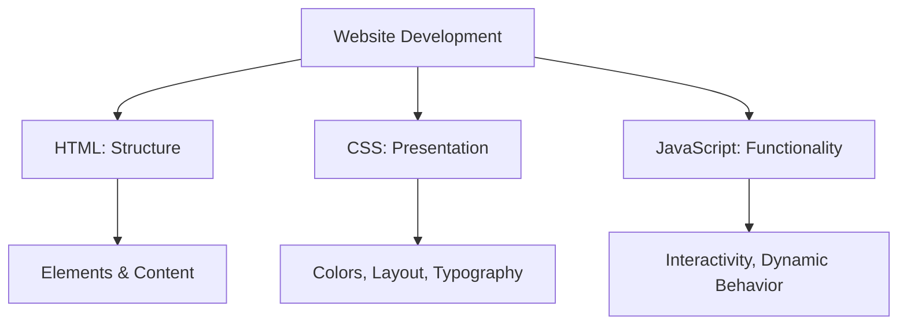
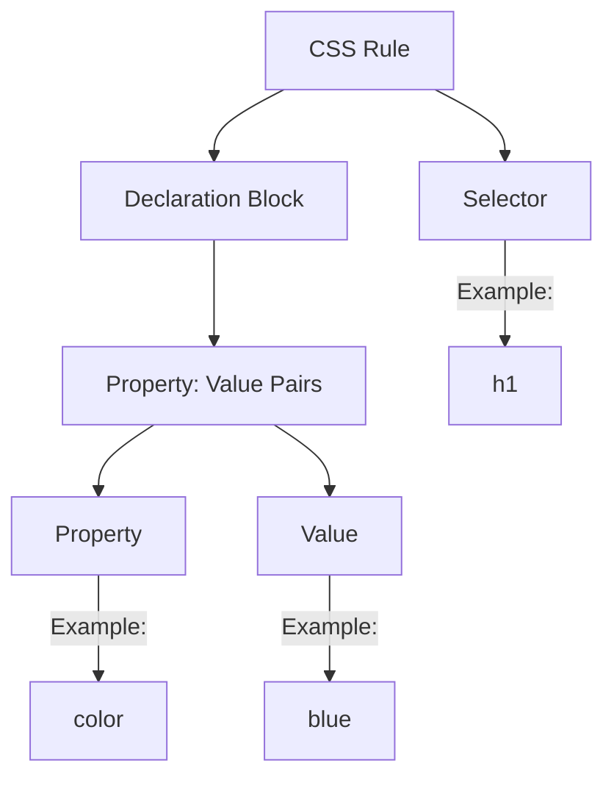
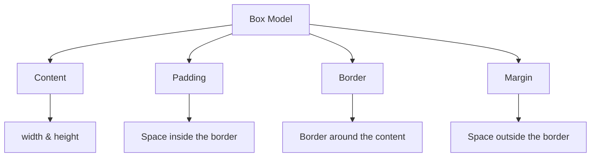
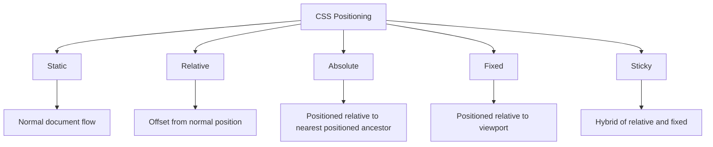
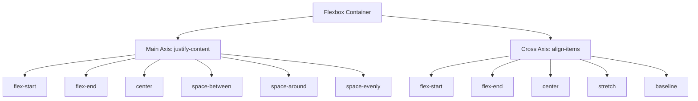

CSS (Cascading Style Sheets) is essential for transforming plain HTML into visually appealing websites. This crash course covers the 85% of CSS you'll use daily, providing a solid foundation that will enable you to explore the remaining concepts independently.

## What is CSS and Why Do We Need It?

CSS controls the presentation of HTML elements on webpages. While HTML provides the structural framework, CSS brings aesthetic appeal through colors, layouts, fonts, and animations.

Think of building a website like constructing a house:

- HTML forms the structure (foundation, walls, rooms)
- CSS handles the aesthetics (paint, decorations, landscaping)
- JavaScript adds functionality (electricity, plumbing)



## Getting Started with CSS

Before diving into the code, ensure you have these essentials:

### Prerequisites

- Basic understanding of HTML
- A text editor (VS Code, Sublime Text, Atom, etc.)
- A web browser with developer tools (Chrome, Firefox, etc.)

### Three Ways to Add CSS to HTML

You can implement CSS in your projects through three different methods:

1. **Inline CSS**: Applied directly to HTML elements using the style attribute

   ```html
   <p style="color: blue; font-size: 18px;">Hello World!</p>
   ```

2. **Internal CSS**: Placed within `<style>` tags in the HTML document's `<head>` section

   ```html
   <head>
     <style>
       h1 {
         color: blue;
         font-size: 24px;
       }
     </style>
   </head>
   ```

3. **External CSS**: Stored in a separate .css file and linked to HTML
   ```html
   <head>
     <link rel="stylesheet" href="styles.css" />
   </head>
   ```

**Best Practice**: External CSS is recommended for most websites as it promotes separation of concerns and easier maintenance. This approach keeps your HTML clean and allows multiple pages to share the same styling rules.

## CSS Syntax: The Building Blocks

Understanding CSS syntax is fundamental to creating effective stylesheets. CSS follows a straightforward structure consisting of selectors, properties, and values:

```css
selector {
  property: value;
  another-property: another-value;
}
```

Breaking this down:

- **Selector**: Targets the HTML element(s) to style
- **Property**: The styling attribute you want to change
- **Value**: How you want to change that property



### CSS Selectors: Targeting Elements

Selectors are powerful tools that determine which elements receive your styles. Here are the most commonly used types:

1. **Element Selectors**: Target HTML elements by tag name

   ```css
   h1 {
     color: blue;
   }
   p {
     font-size: 16px;
   }
   ```

2. **Class Selectors**: Target elements with a specific class attribute (prefixed with `.`)

   ```css
   .container {
     background-color: lightgray;
   }
   .primary-button {
     background-color: blue;
   }
   ```

3. **ID Selectors**: Target a unique element with a specific ID (prefixed with `#`)

   ```css
   #content {
     padding: 20px;
   }
   #hero {
     height: 500px;
   }
   ```

4. **Descendant Selectors**: Target elements that are descendants of another element

   ```css
   .container p {
     margin-bottom: 10px;
   }
   ```

5. **Pseudo-class Selectors**: Target elements in a specific state
   ```css
   a:hover {
     text-decoration: underline;
   }
   button:focus {
     outline: 2px solid blue;
   }
   ```

Understanding these selector types gives you precise control over which elements receive styling, allowing for both broad and highly specific targeting as needed.

## The Box Model: Foundation of CSS Layout

The box model is a core concept in CSS that affects how every element is sized and positioned. In this model, every HTML element is represented as a rectangular box.



Here's how to control box model dimensions:

```css
.box {
  /* Content dimensions */
  width: 300px;
  height: 200px;

  /* Padding (inner space) */
  padding: 20px;
  /* Or individually: */
  padding-top: 10px;
  padding-right: 20px;
  padding-bottom: 10px;
  padding-left: 20px;

  /* Border */
  border: 2px solid black;
  /* Or individually: */
  border-width: 2px;
  border-style: solid;
  border-color: black;

  /* Margin (outer space) */
  margin: 30px;
  /* Or individually: */
  margin-top: 10px;
  margin-right: 30px;
  margin-bottom: 20px;
  margin-left: 30px;
}
```

**Box-sizing Property**:
By default, `width` and `height` only apply to the content area, which can lead to unexpected layout issues. The `box-sizing` property provides a solution:

```css
/* Makes width and height include padding and border */
* {
  box-sizing: border-box;
}
```

This setting ensures that the specified width and height include both the content and its padding and border, making layout calculations more intuitive.

## Typography and Colors

After mastering the box model, you can focus on making your content visually appealing through typography and color choices.

### Text Styling

CSS offers extensive control over text appearance:

```css
.text-styles {
  /* Font family (fallbacks provided) */
  font-family: 'Arial', Helvetica, sans-serif;

  /* Font size */
  font-size: 16px;

  /* Font weight (normal, bold, or numeric values) */
  font-weight: bold;

  /* Text alignment */
  text-align: center;

  /* Line height (space between lines) */
  line-height: 1.5;

  /* Text decoration */
  text-decoration: underline;

  /* Text transformation */
  text-transform: uppercase;

  /* Letter spacing */
  letter-spacing: 1px;
}
```

### Colors in CSS

Colors bring life to your website, and CSS supports multiple formats to define them:

1. **Color Names**:

   ```css
   h1 {
     color: red;
   }
   ```

2. **Hexadecimal**:

   ```css
   h1 {
     color: #ff0000;
   } /* Full hex */
   h1 {
     color: #f00;
   } /* Shorthand hex */
   ```

3. **RGB/RGBA**:

   ```css
   h1 {
     color: rgb(255, 0, 0);
   } /* RGB */
   h1 {
     color: rgba(255, 0, 0, 0.5);
   } /* RGB with opacity */
   ```

4. **HSL/HSLA**:
   ```css
   h1 {
     color: hsl(0, 100%, 50%);
   } /* HSL */
   h1 {
     color: hsla(0, 100%, 50%, 0.5);
   } /* HSL with opacity */
   ```

Having a variety of color formats gives you flexibility, with RGBA and HSLA being particularly useful when you need to incorporate transparency into your design.

## CSS Layout: Positioning Elements

With the fundamentals of styling in place, let's explore how to position elements on the page.

### Display Property

The `display` property determines how an element behaves in the document flow:

```css
/* Block elements take full width and start on a new line */
div {
  display: block;
}

/* Inline elements only take necessary width and don't force new lines */
span {
  display: inline;
}

/* Inline-block combines features of both */
button {
  display: inline-block;
}

/* Hide the element completely */
.hidden {
  display: none;
}
```

### Position Property

The `position` property provides even more control over element placement:

```css
/* Static - follows normal document flow */
div {
  position: static;
}

/* Positioned relative to its normal position */
.relative {
  position: relative;
  top: 10px;
  left: 20px;
}

/* Positioned relative to its closest positioned ancestor */
.absolute {
  position: absolute;
  top: 0;
  right: 0;
}

/* Positioned relative to the viewport */
.fixed {
  position: fixed;
  bottom: 20px;
  right: 20px;
}

/* Similar to fixed but can be contained within a parent */
.sticky {
  position: sticky;
  top: 0;
}
```



Understanding these positioning options gives you precise control over where elements appear on your page, enabling complex layouts and interface components.

## Flexbox: Modern CSS Layout

While positioning properties are useful, modern CSS offers more powerful layout tools. Flexbox is a one-dimensional layout method designed specifically for arranging items in rows or columns:

```css
/* Parent container (flex container) */
.container {
  display: flex; /* or inline-flex */

  /* Main axis direction */
  flex-direction: row; /* default: left to right */
  /* Other options: row-reverse, column, column-reverse */

  /* Wrapping behavior */
  flex-wrap: wrap; /* allows items to wrap to next line if needed */

  /* Alignment along main axis */
  justify-content: space-between;
  /* Other options: flex-start, flex-end, center, space-around, space-evenly */

  /* Alignment along cross axis */
  align-items: center;
  /* Other options: flex-start, flex-end, stretch, baseline */

  /* Spacing between lines (only applies when flex-wrap is not nowrap) */
  align-content: space-between;
  /* Other options: flex-start, flex-end, center, space-around, stretch */
}

/* Child items (flex items) */
.item {
  /* Growth factor */
  flex-grow: 1;

  /* Shrink factor */
  flex-shrink: 1;

  /* Base size */
  flex-basis: 200px;

  /* Shorthand for grow, shrink, and basis */
  flex: 1 1 200px;

  /* Self-alignment (overrides container's align-items) */
  align-self: flex-start;
}
```

### Flexbox Example

Here's a practical implementation of Flexbox for a simple component:

```css
.container {
  display: flex;
  justify-content: space-between;
  align-items: center;
  padding: 20px;
  background-color: #f5f5f5;
}

.item {
  flex: 1;
  margin: 10px;
  padding: 20px;
  background-color: #ddd;
  text-align: center;
}
```



Flexbox simplifies many common layout tasks, particularly when dealing with a single row or column of items that need to be distributed and aligned intelligently.

## CSS Grid: Two-Dimensional Layout

Building on the concept of Flexbox, CSS Grid takes layout to the next level by enabling two-dimensional control:

```css
/* Parent container (grid container) */
.container {
  display: grid;

  /* Define columns */
  grid-template-columns: 1fr 2fr 1fr; /* Three columns with proportional widths */

  /* Define rows */
  grid-template-rows: 100px auto 100px; /* Fixed header, dynamic content, fixed footer */

  /* Gap between rows and columns */
  gap: 20px; /* or row-gap and column-gap individually */

  /* Alignment of all items within their cells */
  justify-items: center;
  align-items: center;

  /* Alignment of the entire grid within the container */
  justify-content: center;
  align-content: center;
}

/* Child item (grid item) */
.item {
  /* Spanning multiple columns */
  grid-column: 1 / 3; /* Start at line 1, end before line 3 */

  /* Spanning multiple rows */
  grid-row: 2 / 4; /* Start at line 2, end before line 4 */

  /* Shorthand for both */
  grid-area: 2 / 1 / 4 / 3; /* row-start / column-start / row-end / column-end */

  /* Self-alignment (overrides container's alignment) */
  justify-self: start;
  align-self: end;
}
```

### Grid Example

This example demonstrates a common webpage layout using CSS Grid:

```css
.grid-container {
  display: grid;
  grid-template-areas:
    'header header header'
    'nav main aside'
    'footer footer footer';
  grid-template-columns: 1fr 3fr 1fr;
  grid-template-rows: auto 1fr auto;
  gap: 20px;
  height: 100vh;
}

header {
  grid-area: header;
  background-color: #f0f9fa;
  padding: 20px;
}
nav {
  grid-area: nav;
  background-color: #e0ecef;
  padding: 20px;
}
main {
  grid-area: main;
  background-color: #e2e6ea;
  padding: 20px;
}
aside {
  grid-area: aside;
  background-color: #d0e4da;
  padding: 20px;
}
footer {
  grid-area: footer;
  background-color: #c0d5bd;
  padding: 20px;
}
```

CSS Grid excels at creating complex layouts where elements need to align in both horizontal and vertical directions, making it ideal for overall page structure.

## Responsive Design

With solid layout skills established, the next crucial step is ensuring your designs work well across all devices and screen sizes through responsive design techniques.

### Media Queries

Media queries allow you to apply different CSS rules based on device characteristics:

```css
/* Base styles for all devices */
body {
  font-size: 16px;
}

/* Styles for tablets and smaller devices */
@media (max-width: 768px) {
  body {
    font-size: 14px;
  }

  .container {
    flex-direction: column;
  }
}

/* Styles for mobile phones */
@media (max-width: 480px) {
  body {
    font-size: 12px;
  }

  .hidden-mobile {
    display: none;
  }
}
```

### CSS Units

Choosing the right units is fundamental to responsive design:

1. **Absolute Units**:

   - `px`: Pixels (fixed size)
   - `pt`: Points (1pt = 1/72 inch)

2. **Relative Units**:
   - `%`: Percentage relative to parent element
   - `em`: Relative to the font-size of the element
   - `rem`: Relative to the font-size of the root element
   - `vw`: Viewport width (1vw = 1% of viewport width)
   - `vh`: Viewport height (1vh = 1% of viewport height)

```css
/* Example of responsive styling using relative units */
.container {
  width: 90%; /* Relative to parent */
  max-width: 1200px; /* Maximum width */
  margin: 0 auto; /* Center horizontally */
}

html {
  font-size: 16px; /* Base font size */
}

h1 {
  font-size: 2rem; /* 2 × root font size = 32px */
}

p {
  font-size: 1rem; /* 1 × root font size = 16px */
  line-height: 1.5; /* 1.5 × font size = 24px */
}

.hero {
  height: 50vh; /* 50% of viewport height */
}
```

Using relative units and media queries together creates designs that adapt fluidly to different screen sizes, ensuring a consistent user experience across devices.

## Putting It All Together: A Complete Example

Now that we've covered the essential components of CSS, let's see how they work together in a complete example. This demonstration incorporates the box model, typography, colors, positioning, flexbox, and responsive design principles.

### HTML Structure

```html
<!DOCTYPE html>
<html lang="en">
  <head>
    <meta charset="UTF-8" />
    <meta name="viewport" content="width=device-width, initial-scale=1.0" />
    <title>CSS Basics</title>
    <link rel="stylesheet" href="styles.css" />
  </head>
  <body>
    <header>
      <nav>
        <div class="logo">WebDev</div>
        <ul class="nav-links">
          <li><a href="#">Home</a></li>
          <li><a href="#">About</a></li>
          <li><a href="#">Services</a></li>
          <li><a href="#">Contact</a></li>
        </ul>
      </nav>

      <section class="hero">
        <h1>Learn HTML, CSS, and JavaScript to build amazing websites</h1>
        <p>Start your journey to becoming a web developer today</p>
        <button class="cta-button">Get Started</button>
      </section>
    </header>

    <main>
      <section class="about-section">
        <h2>About Us</h2>

        <div class="about-content">
          <div class="about-text">
            <p>
              We're a team of passionate web developers dedicated to teaching
              others the art of web development.
            </p>
          </div>

          <div class="about-image">
            <div class="image-placeholder"></div>
          </div>
        </div>
      </section>
    </main>

    <footer>&copy; 2025 CSS Crash Course. All rights reserved.</footer>
  </body>
</html>
```

### CSS Implementation

```css
/* Reset some default browser styles */
* {
  margin: 0;
  padding: 0;
  box-sizing: border-box;
}

/* Base styles */
body {
  font-family: 'Segoe UI', Tahoma, Geneva, Verdana, sans-serif;
  line-height: 1.6;
  color: #333;
}

/* Header and Navigation */
header {
  background-color: #f0f9fa;
}

nav {
  display: flex;
  justify-content: space-between;
  align-items: center;
  padding: 20px;
  max-width: 1200px;
  margin: 0 auto;
}

.logo {
  font-size: 1.5rem;
  font-weight: bold;
  color: #007bff;
}

.nav-links {
  display: flex;
  list-style: none;
}

.nav-links li {
  margin-left: 20px;
}

.nav-links a {
  text-decoration: none;
  color: #333;
  transition: color 0.3s ease;
}

.nav-links a:hover {
  color: #007bff;
}

/* Hero Section */
.hero {
  text-align: center;
  padding: 100px 20px;
  background-color: #e9ecef;
}

.hero h1 {
  font-size: 2.5rem;
  margin-bottom: 20px;
}

.hero p {
  font-size: 1.2rem;
  margin-bottom: 30px;
  color: #6c757d;
}

.cta-button {
  padding: 10px 20px;
  background-color: #007bff;
  color: white;
  border: none;
  border-radius: 5px;
  font-size: 1rem;
  cursor: pointer;
  transition: background-color 0.3s ease;
}

.cta-button:hover {
  background-color: #0056b3;
}

/* About section */
.about-section {
  padding: 80px 20px;
  max-width: 1200px;
  margin: 0 auto;
}

.about-section h2 {
  text-align: center;
  margin-bottom: 40px;
  font-size: 2rem;
}

.about-content {
  display: flex;
  justify-content: space-between;
  align-items: center;
  gap: 40px;
}

.about-text,
.about-image {
  flex: 1;
}

.image-placeholder {
  height: 300px;
  background-color: #e2e6ea;
  border-radius: 5px;
}

/* Footer */
footer {
  background-color: #343a40;
  color: white;
  text-align: center;
  padding: 20px;
}

/* Responsive design */
@media (max-width: 768px) {
  .nav-links {
    display: none; /* For simplicity in this example */
  }

  .about-content {
    flex-direction: column;
  }

  .hero h1 {
    font-size: 2rem;
  }
}
```

This complete example demonstrates how various CSS concepts work together to create a cohesive, responsive design. The navigation uses flexbox for alignment, the content sections implement appropriate spacing through the box model, and media queries ensure the layout adapts to different screen sizes.

## The Remaining 15%: Advanced CSS Topics

While you now have a solid foundation in CSS, there are advanced topics worth exploring as you continue your journey:

### 1. CSS Animations and Transitions

Animations add life and interactivity to your websites:

```css
/* Simple transition */
.button {
  background-color: blue;
  transition: background-color 0.3s ease;
}

.button:hover {
  background-color: darkblue;
}

/* Keyframe animation */
@keyframes slide-in {
  0% {
    transform: translateX(-100%);
  }
  100% {
    transform: translateX(0);
  }
}

.animated-element {
  animation: slide-in 1s ease-out forwards;
}
```

### 2. CSS Variables (Custom Properties)

Variables make your CSS more maintainable and consistent:

```css
:root {
  --primary-color: #3498db;
  --secondary-color: #e67e22;
  --font-main: 'Roboto', sans-serif;
}

.header {
  background-color: var(--primary-color);
  font-family: var(--font-main);
}

.button {
  background-color: var(--secondary-color);
}
```

### 3. Advanced Selectors

More sophisticated selectors provide fine-grained control:

```css
/* Attribute selectors */
input[type='text'] {
  border: 1px solid gray;
}

/* Sibling selectors */
h2 + p {
  margin-top: 0;
}

/* Child selectors */
ul > li {
  list-style-type: square;
}

/* :not() pseudo-class */
div:not(.special) {
  padding: 10px;
}

/* ::before and ::after pseudo-elements */
.quote::before {
  content: '"';
}
.quote::after {
  content: '"';
}
```

### 4. CSS Preprocessors

Preprocessors like Sass expand CSS capabilities:

```scss
// Sass example
$primary-color: #3498db;

.container {
  max-width: 1200px;
  margin: 0 auto;

  .header {
    background-color: $primary-color;

    h1 {
      font-size: 32px;
    }
  }
}
```

### 5. CSS Frameworks

Frameworks like Bootstrap, Tailwind CSS, and Bulma provide pre-built components and utility classes to accelerate development.

### 6. Advanced Layout Techniques

These include subgrid, multi-column layout, CSS shapes, and CSS masonry layout for specialized design needs.

## Conclusion

This crash course has equipped you with a comprehensive understanding of CSS fundamentals—the 85% you'll use most frequently in day-to-day web development. You've learned how to select elements, control their appearance through the box model, style text and colors, position elements precisely, and create responsive layouts using Flexbox and Grid.

As you build projects and gain experience, you'll naturally begin exploring the advanced topics we've summarized in the 15% section. Transitions and animations will bring your interfaces to life, CSS variables will make your code more maintainable, and preprocessors will enhance your productivity.

Remember that mastering CSS is an ongoing journey of practice and experimentation. Start with small projects, inspect websites you admire to learn from their techniques, and gradually incorporate advanced concepts as you become comfortable with the fundamentals.

With the knowledge from this crash course, you're well-prepared to create visually appealing, responsive websites that provide excellent user experiences across all devices.
