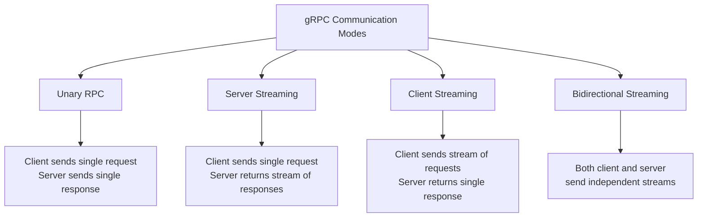

## Introduction: What is gRPC?

gRPC is a high-performance, open-source remote procedure call (RPC) framework initially developed by Google. It allows services to communicate efficiently across different programming languages and platforms, making it an ideal choice for modern distributed systems.

### Key Features

- Built on HTTP/2 for efficient transport with features like multiplexing and header compression
- Uses Protocol Buffers (protobuf) for serialization, offering compact data representation
- Supports multiple programming languages including Go, Java, Python, C++, and Node.js
- Provides bi-directional streaming capabilities for real-time communication
- Designed for high-performance microservices communication with minimal latency

## Prerequisites

Before starting with gRPC, you should have:

- Basic understanding of client-server architecture
- Familiarity with at least one programming language (we'll use Go in examples)
- Command-line interface knowledge
- Understanding of API concepts

With these fundamentals in place, you'll be well-prepared to explore gRPC's powerful capabilities.

## Installation and Setup

The first step in working with gRPC is setting up your development environment. You'll need to install:

1. **Protocol Buffers compiler (protoc)** - This translates your service definitions into language-specific code
2. **gRPC tools for your chosen language** - These provide the runtime libraries and code generation plugins

For Go development, here's how to set up your environment:

```bash
# Install Protocol Buffers compiler
# For macOS
brew install protobuf

# For Linux
apt-get install protobuf-compiler

# For Windows (using chocolatey)
choco install protoc

# Install Go gRPC packages
go install google.golang.org/protobuf/cmd/protoc-gen-go@latest
go install google.golang.org/grpc/cmd/protoc-gen-go-grpc@latest

# Ensure your PATH includes $GOPATH/bin
export PATH="$PATH:$(go env GOPATH)/bin"
```

With these tools installed, you're ready to dive into gRPC's core concepts.

## Core Concepts

Understanding three foundational elements will give you a solid grasp of gRPC: Protocol Buffers, communication modes, and service definition structure.

### 1. Protocol Buffers (Protobuf)

Protocol Buffers are a language-neutral, platform-neutral extensible mechanism for serializing structured data. They serve as the Interface Definition Language (IDL) for gRPC, allowing you to define your service interfaces and message structures in a clear, language-agnostic way.

Example of a protobuf definition:

```protobuf
syntax = "proto3";  // Specifies the version of protocol buffers

package greeter;    // Logical package for this service
option go_package = "github.com/yourusername/grpc-demo/greeter";  // Package for generated code

// Service definition
service Greeter {
  // Method definition with request and response types
  rpc SayHello(HelloRequest) returns (HelloResponse);
}

// Message definitions - these are the data structures
message HelloRequest {
  string name = 1;  // Field with a position tag
}

message HelloResponse {
  string message = 1;
}
```

The numbered tags (like `= 1`) identify fields in the binary encoding and shouldn't be changed once your service is in use.

### 2. Communication Modes

One of gRPC's strengths is its support for different communication patterns beyond simple request-response. gRPC offers four powerful communication modes:



These flexible communication patterns allow you to design APIs that match your exact use case, whether you need real-time updates, batch processing, or interactive communication.

### 3. Service Definition Structure

Every gRPC service follows a consistent structure, which makes development predictable across different projects:

1. Define services and methods in a `.proto` file
2. Generate language-specific code using the protoc compiler
3. Implement server logic for the service
4. Create clients that connect to the service

This standardized workflow promotes clean separation between interface definition and implementation.

## Practical Implementation: Creating Your First gRPC Service

Now that you understand the core concepts, let's put them into practice by creating a simple greeter service. We'll implement this step by step, building both the server and client sides.

### Step 1: Define the Service (greeter.proto)

First, we need to define our service interface using Protocol Buffers:

```protobuf
syntax = "proto3";

package greeter;
option go_package = "github.com/yourusername/grpc-demo/greeter";

// Service definition with a single method
service Greeter {
  rpc SayHello(HelloRequest) returns (HelloResponse);
}

// Request message with a name field
message HelloRequest {
  string name = 1;
}

// Response message with a greeting
message HelloResponse {
  string message = 1;
}
```

This simple definition establishes a service with one method that takes a name and returns a greeting message.

### Step 2: Generate Code from Proto File

Next, we'll generate the Go code from our proto file. This step creates all the necessary interfaces, client stubs, and server skeletons:

```bash
# Create a directory structure
mkdir -p grpc-demo/greeter

# Move your proto file to this directory
mv greeter.proto grpc-demo/

# Generate Go code from the proto file
cd grpc-demo
protoc --go_out=. --go-grpc_out=. greeter.proto

# This will create:
# - greeter/greeter.pb.go (message types)
# - greeter/greeter_grpc.pb.go (service interfaces)
```

The generated code handles all the complex serialization and RPC mechanics, allowing you to focus on your business logic.

### Step 3: Implement the Server

Now let's implement the server side of our service. Create a file named `server.go`:

```go
// server.go
package main

import (
	"context"
	"fmt"
	"log"
	"net"

	"github.com/yourusername/grpc-demo/greeter" // Import the generated package
	"google.golang.org/grpc"
)

// Server struct that implements the GreeterServer interface
type server struct {
	greeter.UnimplementedGreeterServer // Required for forward compatibility
}

// Implementation of the SayHello method defined in the proto file
func (s *server) SayHello(ctx context.Context, req *greeter.HelloRequest) (*greeter.HelloResponse, error) {
	// Log the incoming request
	log.Printf("Received request from: %s", req.Name)

	// Return a response with a formatted greeting
	return &greeter.HelloResponse{
		Message: fmt.Sprintf("Hello, %s!", req.Name),
	}, nil
}

func main() {
	// Create a TCP listener on port 50051 (standard for gRPC examples)
	lis, err := net.Listen("tcp", ":50051")
	if err != nil {
		log.Fatalf("Failed to listen: %v", err)
	}

	// Create a new gRPC server instance
	s := grpc.NewServer()

	// Register our service implementation with the gRPC server
	greeter.RegisterGreeterServer(s, &server{})

	log.Println("Server starting on port 50051...")

	// Start serving requests
	if err := s.Serve(lis); err != nil {
		log.Fatalf("Failed to serve: %v", err)
	}
}
```

This server implementation registers our service with the gRPC server and handles incoming requests by executing our `SayHello` method.

### Step 4: Implement the Client

To complete our example, we need a client that can connect to our server. Create a file named `client.go`:

```go
// client.go
package main

import (
	"context"
	"log"
	"time"

	"github.com/yourusername/grpc-demo/greeter" // Import the generated package
	"google.golang.org/grpc"
	"google.golang.org/grpc/credentials/insecure" // For development only
)

func main() {
	// Set up a connection to the server
	// Using insecure credentials for simplicity (not recommended for production)
	conn, err := grpc.Dial("localhost:50051", grpc.WithTransportCredentials(insecure.NewCredentials()))
	if err != nil {
		log.Fatalf("Did not connect: %v", err)
	}
	// Ensure connection is closed when function exits
	defer conn.Close()

	// Create a new client
	client := greeter.NewGreeterClient(conn)

	// Set up a context with timeout for the request
	ctx, cancel := context.WithTimeout(context.Background(), time.Second)
	defer cancel()

	// Make the RPC call with a request
	response, err := client.SayHello(ctx, &greeter.HelloRequest{Name: "gRPC User"})
	if err != nil {
		log.Fatalf("Could not greet: %v", err)
	}

	// Print the response from the server
	log.Printf("Server response: %s", response.Message)
	// Output: Server response: Hello, gRPC User!
}
```

The client establishes a connection to our server, creates a request with a name, and then processes the response.

### Step 5: Run the Application

With both server and client implemented, you can now run your application:

```bash
# Terminal 1: Run the server
go run server.go

# Terminal 2: Run the client
go run client.go
```

When you run the client, it connects to the server, sends the request, and displays the response. Congratulations—you've created your first gRPC service!

## Advanced Communication Patterns

Now that we've covered the basics with a simple unary RPC, let's explore all four communication modes that gRPC offers. These patterns provide powerful options for different types of service interactions.

### Updated Proto File with All Communication Types

First, let's update our proto file to include all four communication modes:

```protobuf
syntax = "proto3";

package greeter;
option go_package = "github.com/yourusername/grpc-demo/greeter";

service Greeter {
  // Unary RPC: Single request, single response
  rpc SayHello(HelloRequest) returns (HelloResponse);

  // Server streaming RPC: Single request, stream of responses
  rpc SayHellos(HelloRequest) returns (stream HelloResponse);

  // Client streaming RPC: Stream of requests, single response
  rpc GreetEveryone(stream HelloRequest) returns (HelloResponse);

  // Bidirectional streaming RPC: Both sides stream independently
  rpc Exchange(stream HelloRequest) returns (stream HelloResponse);
}

message HelloRequest {
  string name = 1;
}

message HelloResponse {
  string message = 1;
}
```

Notice how we use the `stream` keyword to indicate streaming methods in both directions.

### Implementing All Communication Modes

Now, let's see a complete server implementation that handles all four communication patterns:

```go
// expanded_server.go
package main

import (
	"context"
	"fmt"
	"io"
	"log"
	"net"
	"time"

	"github.com/yourusername/grpc-demo/greeter"
	"google.golang.org/grpc"
)

type server struct {
	greeter.UnimplementedGreeterServer
}

// 1. Unary RPC: Simple request-response
func (s *server) SayHello(ctx context.Context, req *greeter.HelloRequest) (*greeter.HelloResponse, error) {
	log.Printf("Received unary request from: %s", req.Name)
	return &greeter.HelloResponse{Message: fmt.Sprintf("Hello, %s!", req.Name)}, nil
}

// 2. Server Streaming RPC: Client sends one request, server sends multiple responses
func (s *server) SayHellos(req *greeter.HelloRequest, stream greeter.Greeter_SayHellosServer) error {
	log.Printf("Received server streaming request from: %s", req.Name)

	// Send 5 responses with a delay between them
	for i := 0; i < 5; i++ {
		// Create a response message
		response := &greeter.HelloResponse{
			Message: fmt.Sprintf("Hello %s, response #%d", req.Name, i+1),
		}

		// Send the response through the stream
		if err := stream.Send(response); err != nil {
			return err
		}

		// Add a small delay between messages
		time.Sleep(200 * time.Millisecond)
	}

	// Return nil indicates successful completion
	return nil
}

// 3. Client Streaming RPC: Client sends multiple requests, server sends one response
func (s *server) GreetEveryone(stream greeter.Greeter_GreetEveryoneServer) error {
	log.Println("Started client streaming RPC")

	// Store all received names
	var names []string

	// Keep receiving messages until client closes the stream
	for {
		// Wait for the next message from the client
		req, err := stream.Recv()

		// Check if we've reached the end of the stream
		if err == io.EOF {
			// Client has finished sending
			break
		}
		if err != nil {
			// Some other error occurred
			return err
		}

		// Add the name to our list
		names = append(names, req.Name)
		log.Printf("Received name: %s", req.Name)
	}

	// After receiving all names, send a single response
	response := fmt.Sprintf("Hello to everyone: %v!", names)
	return stream.SendAndClose(&greeter.HelloResponse{Message: response})
}

// 4. Bidirectional Streaming RPC: Both client and server send multiple messages
func (s *server) Exchange(stream greeter.Greeter_ExchangeServer) error {
	log.Println("Started bidirectional streaming RPC")

	// Use a goroutine to handle receiving messages while sending responses
	// This demonstrates the independent nature of bidirectional streams

	// Create channel to signal when we're done receiving
	waitc := make(chan struct{})

	// Start a goroutine to receive messages
	go func() {
		for {
			// Receive request from client
			req, err := stream.Recv()

			if err == io.EOF {
				// Client closed the send stream
				close(waitc)
				return
			}
			if err != nil {
				log.Printf("Error receiving: %v", err)
				return
			}

			log.Printf("Received message: %s", req.Name)

			// Immediately send a response for each request
			response := &greeter.HelloResponse{
				Message: fmt.Sprintf("You sent: %s, I reply: Hello!", req.Name),
			}
			if err := stream.Send(response); err != nil {
				log.Printf("Error sending: %v", err)
				return
			}
		}
	}()

	// Wait for the receiving goroutine to finish
	<-waitc
	return nil
}

func main() {
	// Create a TCP listener on port 50051
	lis, err := net.Listen("tcp", ":50051")
	if err != nil {
		log.Fatalf("Failed to listen: %v", err)
	}

	// Create a new gRPC server
	s := grpc.NewServer()

	// Register our service implementation
	greeter.RegisterGreeterServer(s, &server{})

	log.Println("Server starting on port 50051...")
	if err := s.Serve(lis); err != nil {
		log.Fatalf("Failed to serve: %v", err)
	}
}
```

On the client side, we need corresponding methods to interact with each of these server implementations:

```go
// expanded_client.go
package main

import (
	"context"
	"io"
	"log"
	"time"

	"github.com/yourusername/grpc-demo/greeter"
	"google.golang.org/grpc"
	"google.golang.org/grpc/credentials/insecure"
)

func main() {
	// Connect to the server
	conn, err := grpc.Dial("localhost:50051", grpc.WithTransportCredentials(insecure.NewCredentials()))
	if err != nil {
		log.Fatalf("Did not connect: %v", err)
	}
	defer conn.Close()

	// Create a client
	client := greeter.NewGreeterClient(conn)

	// Test each type of communication mode
	testUnary(client)
	testServerStreaming(client)
	testClientStreaming(client)
	testBidirectionalStreaming(client)
}

// 1. Unary RPC example
func testUnary(client greeter.GreeterClient) {
	log.Println("\n----- Unary RPC -----")

	// Set up a context with timeout
	ctx, cancel := context.WithTimeout(context.Background(), time.Second)
	defer cancel()

	// Make the RPC call
	response, err := client.SayHello(ctx, &greeter.HelloRequest{Name: "Unary User"})
	if err != nil {
		log.Fatalf("Unary RPC failed: %v", err)
	}

	log.Printf("Unary Response: %s", response.Message)
}

// 2. Server Streaming RPC example
func testServerStreaming(client greeter.GreeterClient) {
	log.Println("\n----- Server Streaming RPC -----")

	// Set up context
	ctx, cancel := context.WithTimeout(context.Background(), 10*time.Second)
	defer cancel()

	// Make the streaming RPC call
	stream, err := client.SayHellos(ctx, &greeter.HelloRequest{Name: "Stream User"})
	if err != nil {
		log.Fatalf("Server Streaming RPC failed: %v", err)
	}

	// Receive all responses from the stream
	for {
		response, err := stream.Recv()
		if err == io.EOF {
			// End of stream
			break
		}
		if err != nil {
			log.Fatalf("Error receiving stream: %v", err)
		}

		log.Printf("Server Stream Response: %s", response.Message)
	}
}

// 3. Client Streaming RPC example
func testClientStreaming(client greeter.GreeterClient) {
	log.Println("\n----- Client Streaming RPC -----")

	// Set up context
	ctx, cancel := context.WithTimeout(context.Background(), 10*time.Second)
	defer cancel()

	// Start the client streaming RPC
	stream, err := client.GreetEveryone(ctx)
	if err != nil {
		log.Fatalf("Client Streaming RPC failed: %v", err)
	}

	// Send multiple requests
	names := []string{"Alice", "Bob", "Charlie", "Dave", "Eve"}
	for _, name := range names {
		if err := stream.Send(&greeter.HelloRequest{Name: name}); err != nil {
			log.Fatalf("Error sending request: %v", err)
		}
		log.Printf("Sent request: %s", name)
		time.Sleep(200 * time.Millisecond)
	}

	// Close the client stream and receive the response
	response, err := stream.CloseAndRecv()
	if err != nil {
		log.Fatalf("Error receiving response: %v", err)
	}

	log.Printf("Client Stream Response: %s", response.Message)
}

// 4. Bidirectional Streaming RPC example
func testBidirectionalStreaming(client greeter.GreeterClient) {
	log.Println("\n----- Bidirectional Streaming RPC -----")

	// Set up context
	ctx, cancel := context.WithTimeout(context.Background(), 10*time.Second)
	defer cancel()

	// Start bidirectional streaming
	stream, err := client.Exchange(ctx)
	if err != nil {
		log.Fatalf("Bidirectional Streaming RPC failed: %v", err)
	}

	// Create a channel to wait for the receiving goroutine
	waitc := make(chan struct{})

	// Start a goroutine to receive responses
	go func() {
		for {
			response, err := stream.Recv()
			if err == io.EOF {
				// Server closed the send stream
				close(waitc)
				return
			}
			if err != nil {
				log.Fatalf("Error receiving: %v", err)
				return
			}
			log.Printf("Received response: %s", response.Message)
		}
	}()

	// Send requests
	messages := []string{"Message 1", "Message 2", "Message 3", "Message 4", "Final Message"}
	for _, msg := range messages {
		if err := stream.Send(&greeter.HelloRequest{Name: msg}); err != nil {
			log.Fatalf("Error sending: %v", err)
		}
		log.Printf("Sent message: %s", msg)
		time.Sleep(500 * time.Millisecond)
	}

	// Close the send stream
	stream.CloseSend()

	// Wait for the receiving goroutine to finish
	<-waitc
}
```

These examples demonstrate the flexibility of gRPC's communication patterns, enabling you to design APIs that match your specific requirements for data transfer and interaction models.

## Error Handling in gRPC

Proper error handling is essential for building robust gRPC services. gRPC uses a standard set of error codes that work across all supported languages, making error handling consistent and predictable.

Here's a practical example of error handling in a gRPC service:

```go
// Server-side error handling example
func (s *server) SayHello(ctx context.Context, req *greeter.HelloRequest) (*greeter.HelloResponse, error) {
	// Check if name is empty
	if req.Name == "" {
		// Return a standard gRPC error with an appropriate status code
		return nil, status.Errorf(codes.InvalidArgument, "name cannot be empty")
	}

	// Check if the name is too long
	if len(req.Name) > 50 {
		return nil, status.Errorf(codes.InvalidArgument, "name too long (max 50 characters)")
	}

	// Simulate a service unavailable error occasionally
	if rand.Intn(10) == 0 {  // 10% chance of error
		return nil, status.Errorf(codes.Unavailable, "service temporarily unavailable")
	}

	return &greeter.HelloResponse{Message: fmt.Sprintf("Hello, %s!", req.Name)}, nil
}

// Client-side error handling
func testErrorHandling(client greeter.GreeterClient) {
	// Set up context
	ctx, cancel := context.WithTimeout(context.Background(), time.Second)
	defer cancel()

	// Call with empty name (should fail)
	response, err := client.SayHello(ctx, &greeter.HelloRequest{Name: ""})

	// Check for specific error types
	if err != nil {
		// Convert the error to a gRPC status object
		st, ok := status.FromError(err)
		if ok {
			// Check the error code and message
			switch st.Code() {
			case codes.InvalidArgument:
				log.Printf("Invalid argument: %s", st.Message())
			case codes.DeadlineExceeded:
				log.Printf("Deadline exceeded: request timed out")
			case codes.Unavailable:
				log.Printf("Service unavailable: %s", st.Message())
			default:
				log.Printf("Unknown error: %s", st.Message())
			}
		} else {
			log.Printf("Non-gRPC error: %v", err)
		}
		return
	}

	log.Printf("Response: %s", response.Message)
}
```

By using standard error codes and providing meaningful error messages, you create a more maintainable and user-friendly API.

## Testing gRPC Services

Testing is a crucial part of building reliable gRPC services. Let's look at a simple approach to unit testing our gRPC server:

```go
// greeter_test.go
package main

import (
	"context"
	"net"
	"testing"
	"time"

	"github.com/yourusername/grpc-demo/greeter"
	"google.golang.org/grpc"
	"google.golang.org/grpc/credentials/insecure"
	"google.golang.org/grpc/test/bufconn"
)

// Create a buffer-based listener for testing
const bufSize = 1024 * 1024
var lis *bufconn.Listener

// Setup function to initialize the test server
func init() {
	lis = bufconn.Listen(bufSize)
	s := grpc.NewServer()
	greeter.RegisterGreeterServer(s, &server{})
	go func() {
		if err := s.Serve(lis); err != nil {
			panic(err)
		}
	}()
}

// Helper function to create a client connection for testing
func getBufDialer() func(context.Context, string) (net.Conn, error) {
	return func(ctx context.Context, url string) (net.Conn, error) {
		return lis.Dial()
	}
}

// Test the SayHello method
func TestSayHello(t *testing.T) {
	// Create a client connection
	ctx, cancel := context.WithTimeout(context.Background(), time.Second)
	defer cancel()

	conn, err := grpc.DialContext(ctx, "bufnet",
		grpc.WithContextDialer(getBufDialer()),
		grpc.WithTransportCredentials(insecure.NewCredentials()))
	if err != nil {
		t.Fatalf("Failed to dial bufnet: %v", err)
	}
	defer conn.Close()

	// Create a client
	client := greeter.NewGreeterClient(conn)

	// Test case 1: Valid name
	t.Run("Valid name", func(t *testing.T) {
		resp, err := client.SayHello(ctx, &greeter.HelloRequest{Name: "Tester"})

		if err != nil {
			t.Errorf("SayHello failed: %v", err)
		}

		expected := "Hello, Tester!"
		if resp.Message != expected {
			t.Errorf("Response message incorrect, got: %s, want: %s",
				resp.Message, expected)
		}
	})

	// Additional test cases can be added here
}
```

This testing approach uses an in-memory connection, allowing you to test your gRPC services without network overhead or dependencies on external services.

## The Last 15%: Advanced gRPC Topics

Now that you've mastered the core concepts (85%), here's a summary of the advanced topics (15%) that you can explore when you're ready to deepen your gRPC expertise:

```mermaid
graph TD
    A[Advanced gRPC Topics]
    A --> B[Authentication & Security]
    B --> B1[TLS/SSL Setup]
    B --> B2[Token-based Auth]
    B --> B3[OAuth Integration]

    A --> C[Error Handling]
    C --> C1[Advanced Status Codes]
    C --> C2[Custom Error Types]
    C --> C3[Retry Mechanisms]

    A --> D[Middleware & Interceptors]
    D --> D1[Logging]
    D --> D2[Metrics]
    D --> D3[Rate Limiting]

    A --> E[Load Balancing]
    E --> E1[Client-side Load Balancing]
    E --> E2[Server-side Load Balancing]

    A --> F[Performance Optimization]
    F --> F1[Connection Pooling]
    F --> F2[Keepalive Settings]
    F --> F3[Protocol Buffer Optimization]

    A --> G[Advanced Patterns]
    G --> G1[Deadlines & Timeouts]
    G --> G2[Cancellation]
    G --> G3[Multiplexing]

    A --> H[Production Deployment]
    H --> H1[Health Checking]
    H --> H2[Reflection]
    H --> H3[Integration with Service Mesh]
```



### 1. Authentication & Security

- **TLS/SSL**: Implement transport security using certificates to encrypt communication
- **Token-based Authentication**: Add JWT or custom token validation for secure API access
- **OAuth Integration**: Connect gRPC services with OAuth providers for standardized authentication

### 2. Advanced Error Handling

- Custom error types and detailed error propagation across service boundaries
- Implementing retry mechanisms with exponential backoff for transient failures
- Handling deadline exceeded and cancelled contexts properly in complex request flows

### 3. Middleware & Interceptors

- Logging all requests and responses for monitoring and debugging
- Collecting metrics for performance monitoring and alerting
- Implementing rate limiting and circuit breaking to protect services from overload

### 4. Load Balancing

- Client-side load balancing strategies for distributing requests across instances
- Server-side load balancing with proxy servers for more complex routing
- Service discovery integration to dynamically locate service instances

### 5. Performance Optimization

- Connection pooling configurations to reuse connections efficiently
- Keepalive settings to maintain long-lived connections appropriately
- Protocol Buffer message optimization techniques to minimize payload size

### 6. Advanced Patterns

- Proper handling of deadlines and timeouts to prevent resource leaks
- Context cancellation propagation to stop unnecessary work
- Multiplexing multiple services over a single connection for efficiency

### 7. Production Deployment

- Health checking implementation for service monitoring and automatic recovery
- Server reflection for dynamic client generation and exploration
- Integration with service mesh technologies (Istio, Linkerd) for advanced networking capabilities

## Conclusion

You've now learned 85% of what you need to know about gRPC for daily usage:

- Core concepts and service definition with Protocol Buffers
- The four communication modes (unary, server streaming, client streaming, bidirectional)
- Setting up a complete gRPC environment
- Implementing and connecting servers and clients
- Basic error handling and testing approaches

This foundation gives you everything you need to start building gRPC services right away. As you encounter more complex requirements, you'll be well-positioned to explore the advanced topics that make up the final 15%.

Remember that gRPC excels in scenarios requiring high performance, strong typing, and cross-language compatibility, making it an excellent choice for microservices architectures and systems with diverse technology stacks.
