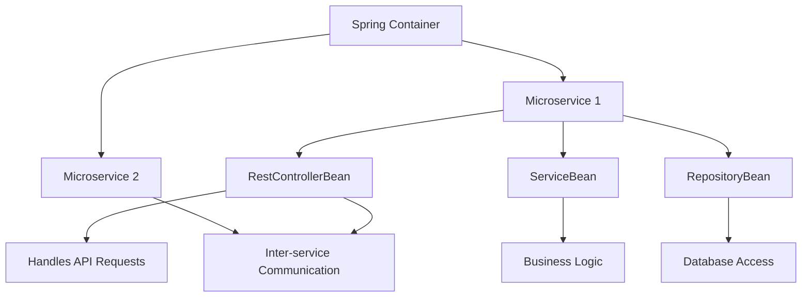
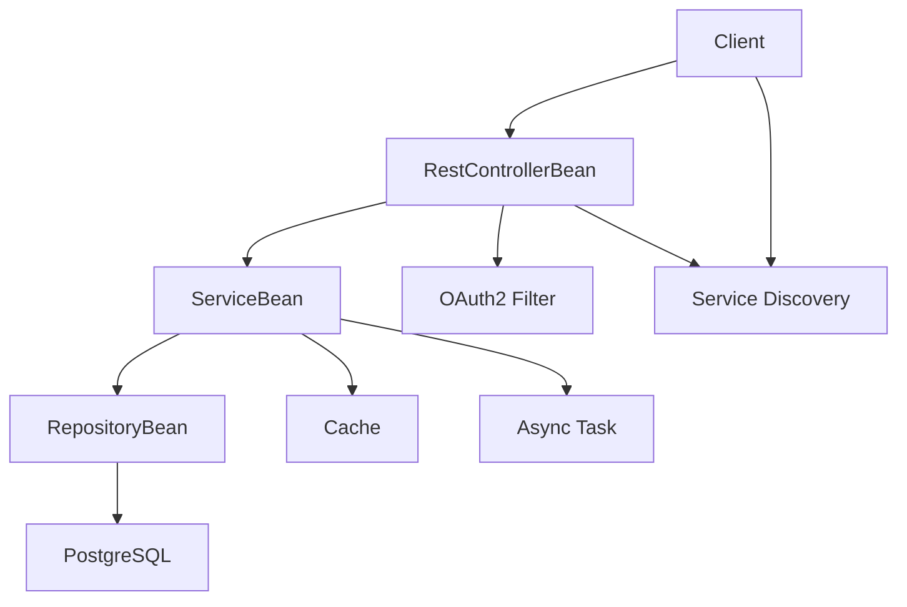

This cheatsheet is a concise, practical guide for the _SWE - Spring Boot - Advanced_ course, designed for web developers with intermediate Spring Boot knowledge (e.g., REST APIs, JPA, dependency injection) and familiarity with JavaScript, REST APIs, JSON, and frontend testing (e.g., Jest). It covers microservices, asynchronous processing, caching, advanced security, resiliency, deployment, and testing, using analogies to frontend concepts for clarity. Each section includes an overview, key concepts, commented code examples adhering to the _Code Commenting Guideline for Software Engineering Course_ with output comments, run commands with explanations, Mermaid diagrams, tips, and pitfalls.

## 1. Spring Boot Components and Beans (Advanced Context)

### Overview

Master Spring Boot’s beans and components for scalable microservices, like modular JavaScript services in a frontend app.

### Key Concepts

- **Spring Beans**: Objects managed by Spring’s container, like JavaScript modules or React components, enabling scalability.
  - **Characteristics**:
    - **Managed Lifecycle**: Spring handles creation and destruction, like React’s component lifecycle.
    - **Custom Scopes**: Use `@Scope` (e.g., `request`, `session`) for microservices, like React state scopes.
    - **Dependency Injection (DI)**: Beans are injected via `@Autowired`, like React context.
    - **Annotations**: `ComponentBean`, `ServiceBean`, `RepositoryBean`, `RestControllerBean`, `ConfigurationBean` define roles.
- **Spring Boot Components**:
  - **ComponentBean**: General-purpose bean, like a JavaScript utility module.
  - **ServiceBean**: Manages business logic, like a JavaScript service module.
  - **RepositoryBean**: Handles database operations, like a Sequelize model.
  - **RestControllerBean**: Processes HTTP requests, like Express routes.
  - **ConfigurationBean**: Defines custom settings, like a JavaScript config file.
- **Spring Container**: Manages beans across microservices, like a Node.js module system.

### Mermaid Diagram: Microservices Architecture



**Diagram Explanation**:

- This diagram shows the Spring container managing microservices, each with `RestControllerBean`, `ServiceBean`, and `RepositoryBean`, interacting via APIs, like a frontend app with multiple services.

## 2. Microservices with Spring Cloud

### Overview

Build microservices with Spring Cloud, like independent React components communicating via APIs.

### Key Concepts

- **Microservices**: Independent services, like React component libraries, communicating via APIs.
- **Spring Cloud**: Provides service discovery (Eureka) and configuration, like frontend service orchestration.
- **Eureka**: Registers services, like a frontend service registry.
- **ConfigurationBean**: Centralizes settings with Spring Cloud Config, like a shared `.env` file.

### Syntax Examples

```xml
<!-- File: pom.xml -->
<!-- Description: Configures Maven project with Spring Cloud and Eureka -->
<!-- Author: wkf -->
<!-- Date: 2025-07-07 -->
<!-- Course: SWE - Spring Boot - Advanced -->
<project>
    <modelVersion>4.0.0</modelVersion>
    <groupId>com.example</groupId>
    <artifactId>blog-service</artifactId>
    <version>1.0-SNAPSHOT</version>
    <parent>
        <groupId>org.springframework.boot</groupId>
        <artifactId>spring-boot-starter-parent</artifactId>
        <version>3.3.1</version>
    </parent>
    <dependencies>
        <!-- Spring Cloud starter for Eureka client -->
        <dependency>
            <groupId>org.springframework.cloud</groupId>
            <artifactId>spring-cloud-starter-netflix-eureka-client</artifactId>
        </dependency>
        <!-- Spring Boot starter for web -->
        <dependency>
            <groupId>org.springframework.boot</groupId>
            <artifactId>spring-boot-starter-web</artifactId>
        </dependency>
    </dependencies>
    <dependencyManagement>
        <dependencies>
            <dependency>
                <groupId>org.springframework.cloud</groupId>
                <artifactId>spring-cloud-dependencies</artifactId>
                <version>2023.0.3</version>
                <type>pom</type>
                <scope>import</scope>
            </dependency>
        </dependencies>
    </dependencyManagement>
</project>
```

```yaml
# File: application.yml
# Description: Configures Eureka client for service discovery
# Author: wkf
# Date: 2025-07-07
# Course: SWE - Spring Boot - Advanced
eureka:
  client:
    serviceUrl:
      defaultZone: http://localhost:8761/eureka/ # Eureka server URL
spring:
  application:
    name: blog-service # Service name
```

```java
// File: BlogServiceApplication.java
// Description: Main entry point for blog microservice with Eureka.
// Author: wkf
// Date: 2025-07-07
// Course: SWE - Spring Boot - Advanced

import org.springframework.boot.SpringApplication;
import org.springframework.boot.autoconfigure.SpringBootApplication;
import org.springframework.cloud.netflix.eureka.EnableEurekaClient;

// Combines ConfigurationBean, ComponentScan, EnableAutoConfiguration
@SpringBootApplication
@EnableEurekaClient // Registers with Eureka
public class BlogServiceApplication {
    public static void main(String[] args) {
        // Starts microservice
        SpringApplication.run(BlogServiceApplication.class, args);
        // Output: Service registers with Eureka, runs on port 8080
    }
}
```

**Run Command**:

```bash
mvn spring-boot:run
```

**Why This Command**:

- The `mvn spring-boot:run` command starts the microservice, registering it with Eureka and running the Tomcat server, similar to a Node.js microservice.

### Quick Reference Table

| Concept       | Java Syntax             | JavaScript Equivalent       | Characteristics         |
| ------------- | ----------------------- | --------------------------- | ----------------------- |
| Eureka Client | `EnableEurekaClient`    | Service registry in Node.js | Registers service       |
| Microservice  | `SpringBootApplication` | Independent Node.js app     | Independent, API-driven |
| Config        | Spring Cloud Config     | `.env` or config server     | Centralized settings    |

### Analogy

- Microservices are like React component libraries, with Eureka as a service catalog.

### Common Pitfalls

- **Eureka Server**: Run a Eureka server first (`spring-cloud-starter-netflix-eureka-server`).
- **Unique Names**: Ensure unique `spring.application.name` per service.
- **Network**: Verify Eureka server URL in `application.yml`.

## 3. Asynchronous Processing

### Overview

Implement asynchronous tasks with `@Async`, like JavaScript `async/await`, for non-blocking operations.

### Key Concepts

- **Async Methods**: Use `@Async` for non-blocking tasks, like JavaScript `async` functions.
- **Task Executor**: Configure with `ConfigurationBean`, like a Node.js worker pool.
- **CompletableFuture**: Handle async results, like JavaScript `Promise`.

### Syntax Examples

```xml
<!-- File: pom.xml -->
<!-- Description: Configures Maven project with async support -->
<!-- Author: wkf -->
<!-- Date: 2025-07-07 -->
<!-- Course: SWE - Spring Boot - Advanced -->
<project>
    <modelVersion>4.0.0</modelVersion>
    <groupId>com.example</groupId>
    <artifactId>blog-service</artifactId>
    <version>1.0-SNAPSHOT</version>
    <parent>
        <groupId>org.springframework.boot</groupId>
        <artifactId>spring-boot-starter-parent</artifactId>
        <version>3.3.1</version>
    </parent>
    <dependencies>
        <!-- Spring Boot starter for async -->
        <dependency>
            <groupId>org.springframework.boot</groupId>
            <artifactId>spring-boot-starter</artifactId>
        </dependency>
    </dependencies>
</project>
```

```java
// File: AsyncConfig.java
// Description: Configures async task executor.
// Author: wkf
// Date: 2025-07-07
// Course: SWE - Spring Boot - Advanced

import org.springframework.context.annotation.Configuration;
import org.springframework.context.annotation.Bean;
import org.springframework.scheduling.annotation.EnableAsync;
import org.springframework.scheduling.concurrent.ThreadPoolTaskExecutor;
import java.util.concurrent.Executor;

// Marks this class as a Spring configuration bean
@Configuration
@EnableAsync
public class AsyncConfig {
    // Defines task executor for async tasks
    @Bean
    public Executor taskExecutor() {
        ThreadPoolTaskExecutor executor = new ThreadPoolTaskExecutor();
        executor.setCorePoolSize(2); // Minimum threads
        executor.setMaxPoolSize(5); // Maximum threads
        executor.setQueueCapacity(100); // Task queue size
        executor.setThreadNamePrefix("Async-");
        executor.initialize();
        return executor;
    }
}
```

```java
// File: AsyncService.java
// Description: Service bean for async post processing.
// Author: wkf
// Date: 2025-07-07
// Course: SWE - Spring Boot - Advanced

import org.springframework.scheduling.annotation.Async;
import org.springframework.stereotype.Service;
import java.util.concurrent.CompletableFuture;

// Marks this class as a Spring service bean
@Service
public class AsyncService {
    // Processes post asynchronously
    // Inputs: post (String)
    // Returns: CompletableFuture<String>
    @Async
    public CompletableFuture<String> processPost(String post) {
        try {
            Thread.sleep(1000); // Simulate delay
        } catch (InterruptedException e) {
            throw new RuntimeException("Processing failed");
        }
        return CompletableFuture.completedFuture("Processed: " + post);
        // Output: Processed: [post content]
    }
}
```

**Run Command**:

```bash
mvn spring-boot:run
```

**Why This Command**:

- The `mvn spring-boot:run` command starts the app, enabling async processing, similar to a Node.js app with async tasks.

### Quick Reference Table

| Concept           | Java Syntax                         | JavaScript Equivalent | Characteristics        |
| ----------------- | ----------------------------------- | --------------------- | ---------------------- |
| Async Method      | `@Async`                            | `async function`      | Non-blocking execution |
| Task Executor     | `ThreadPoolTaskExecutor`            | Node.js worker pool   | Manages async tasks    |
| CompletableFuture | `CompletableFuture.completedFuture` | `Promise.resolve`     | Handles async results  |

### Analogy

- `@Async` is like JavaScript `async/await`, offloading tasks for performance.

### Common Pitfalls

- **Missing `@EnableAsync`**: Add to a `ConfigurationBean`.
- **Thread Starvation**: Set sufficient `corePoolSize`.
- **Error Handling**: Use `exceptionally()` for async errors.

## 4. Caching with Spring

### Overview

Use caching to optimize performance, like frontend memoization, with Spring’s `@Cacheable`.

### Key Concepts

- **Caching**: Store results with `@Cacheable`, like memoized JavaScript functions.
- **Cache Manager**: Configure with `ConfigurationBean`, like a Redux cache.
- **Cache Eviction**: Use `@CacheEvict` to clear cache, like clearing frontend state.
- **Cache Providers**: Use Caffeine, like `localStorage` in browsers.

### Syntax Examples

```xml
<!-- File: pom.xml -->
<!-- Description: Configures Maven project with caching -->
<!-- Author: wkf -->
<!-- Date: 2025-07-07 -->
<!-- Course: SWE - Spring Boot - Advanced -->
<project>
    <modelVersion>4.0.0</modelVersion>
    <groupId>com.example</groupId>
    <artifactId>blog-service</artifactId>
    <version>1.0-SNAPSHOT</version>
    <parent>
        <groupId>org.springframework.boot</groupId>
        <artifactId>spring-boot-starter-parent</artifactId>
        <version>3.3.1</version>
    </parent>
    <dependencies>
        <!-- Spring Boot starter for caching -->
        <dependency>
            <groupId>org.springframework.boot</groupId>
            <artifactId>spring-boot-starter-cache</artifactId>
        </dependency>
    </dependencies>
</project>
```

```java
// File: CacheConfig.java
// Description: Configures caching with Caffeine.
// Author: wkf
// Date: 2025-07-07
// Course: SWE - Spring Boot - Advanced

import org.springframework.context.annotation.Configuration;
import org.springframework.cache.annotation.EnableCaching;
import org.springframework.cache.caffeine.CaffeineCacheManager;
import com.github.benmanes.caffeine.cache.Caffeine;
import java.util.concurrent.TimeUnit;

// Marks this class as a Spring configuration bean
@Configuration
@EnableCaching
public class CacheConfig {
    // Defines cache manager
    @Bean
    public CaffeineCacheManager cacheManager() {
        CaffeineCacheManager cacheManager = new CaffeineCacheManager("posts");
        cacheManager.setCaffeine(Caffeine.newBuilder()
            .expireAfterWrite(10, TimeUnit.MINUTES)
            .maximumSize(100));
        return cacheManager;
    }
}
```

```java
// File: PostService.java
// Description: Service bean with caching for post retrieval.
// Author: wkf
// Date: 2025-07-07
// Course: SWE - Spring Boot - Advanced

import org.springframework.beans.factory.annotation.Autowired;
import org.springframework.cache.annotation.Cacheable;
import org.springframework.cache.annotation.CacheEvict;
import org.springframework.data.domain.Page;
import org.springframework.data.domain.Pageable;
import org.springframework.stereotype.Service;
import java.util.Optional;

// Marks this class as a Spring service bean
@Service
public class PostService {
    private final PostRepository repository; // Repository bean

    // Constructor to inject PostRepository
    @Autowired
    public PostService(PostRepository repository) {
        this.repository = repository;
    }

    // Retrieves post with caching
    // Inputs: id (Long)
    @Cacheable("posts")
    public Post findById(Long id) {
        return repository.findById(id)
            .orElseThrow(() -> new RuntimeException("Post not found"));
        // Output: Cached JSON post object
    }

    // Saves a post
    // Inputs: post (Post)
    @CacheEvict(value = "posts", allEntries = true)
    public Post save(Post post) {
        return repository.save(post);
        // Output: Saved post, cache cleared
    }

    // Retrieves paginated posts
    // Inputs: pageable (Pageable)
    public Page<Post> findAll(Pageable pageable) {
        return repository.findAll(pageable);
        // Output: Paginated JSON, e.g., {"content":[{"id":1,"title":"Test"}],"totalPages":1}
    }
}
```

**Run Command**:

```bash
mvn spring-boot:run
```

**Why This Command**:

- The `mvn spring-boot:run` command starts the app, enabling caching for `PostService`, similar to a Node.js app with caching.

### Quick Reference Table

| Concept        | Java Syntax            | JavaScript Equivalent | Characteristics     |
| -------------- | ---------------------- | --------------------- | ------------------- |
| Caching        | `@Cacheable("posts")`  | Memoization function  | Stores results      |
| Cache Eviction | `@CacheEvict("posts")` | Clear cache in Redux  | Removes cached data |
| Cache Manager  | `CaffeineCacheManager` | `localStorage`        | Manages cache store |

### Analogy

- Caching is like frontend memoization, reducing database calls.

### Common Pitfalls

- **Missing `@EnableCaching`**: Add to a `ConfigurationBean`.
- **Cache Conflicts**: Use unique cache names (e.g., `posts`).
- **Memory Issues**: Limit `maximumSize` in cache config.

## 5. Advanced Security with OAuth2

### Overview

Secure APIs with OAuth2, like frontend token-based authentication, for robust access control.

### Key Concepts

- **OAuth2**: Token-based authentication, like frontend OAuth flows.
- **Resource Server**: Protect endpoints with `ConfigurationBean`, like Express OAuth middleware.
- **JWT Validation**: Validate tokens, like frontend token checks.
- **Role-Based Access**: Restrict endpoints with `@PreAuthorize`, like route guards.

### Syntax Examples

```xml
<!-- File: pom.xml -->
<!-- Description: Configures Maven project with OAuth2 -->
<!-- Author: wkf -->
<!-- Date: 2025-07-07 -->
<!-- Course: SWE - Spring Boot - Advanced -->
<project>
    <modelVersion>4.0.0</modelVersion>
    <groupId>com.example</groupId>
    <artifactId>blog-service</artifactId>
    <version>1.0-SNAPSHOT</version>
    <parent>
        <groupId>org.springframework.boot</groupId>
        <artifactId>spring-boot-starter-parent</artifactId>
        <version>3.3.1</version>
    </parent>
    <dependencies>
        <!-- Spring Boot starter for OAuth2 -->
        <dependency>
            <groupId>org.springframework.boot</groupId>
            <artifactId>spring-boot-starter-oauth2-resource-server</artifactId>
        </dependency>
    </dependencies>
</project>
```

```yaml
# File: application.yml
# Description: Configures OAuth2 resource server
# Author: wkf
# Date: 2025-07-07
# Course: SWE - Spring Boot - Advanced
spring:
  security:
    oauth2:
      resourceserver:
        jwt:
          issuer-uri: http://auth-server:8080 # OAuth2 issuer
```

```java
// File: SecurityConfig.java
// Description: Configures OAuth2 resource server.
// Author: wkf
// Date: 2025-07-07
// Course: SWE - Spring Boot - Advanced

import org.springframework.context.annotation.Configuration;
import org.springframework.context.annotation.Bean;
import org.springframework.security.config.annotation.web.builders.HttpSecurity;
import org.springframework.security.web.SecurityFilterChain;
import org.springframework.security.config.annotation.method.configuration.EnableMethodSecurity;

// Marks this class as a Spring configuration bean
@Configuration
@EnableMethodSecurity
public class SecurityConfig {
    // Configures security with OAuth2
    @Bean
    public SecurityFilterChain securityFilterChain(HttpSecurity http) throws Exception {
        http
            .authorizeHttpRequests(auth -> auth
                .requestMatchers("/api/v1/public/**").permitAll()
                .anyRequest().authenticated())
            .oauth2ResourceServer(oauth2 -> oauth2.jwt());
        return http.build();
    }
}
```

**Run Command**:

```bash
mvn spring-boot:run
```

**Why This Command**:

- The `mvn spring-boot:run` command starts the app, enabling OAuth2 security, similar to a Node.js app with OAuth middleware.

### Quick Reference Table

| Concept    | Java Syntax                         | JavaScript Equivalent        | Characteristics  |
| ---------- | ----------------------------------- | ---------------------------- | ---------------- |
| OAuth2     | `oauth2ResourceServer().jwt()`      | Express OAuth middleware     | Token-based auth |
| Role-Based | `@PreAuthorize("hasRole('ADMIN')")` | `if (user.role === 'admin')` | Restricts access |

### Analogy

- OAuth2 is like frontend OAuth flows, securing APIs with tokens.

### Common Pitfalls

- **Issuer Mismatch**: Ensure `issuer-uri` matches OAuth2 server.
- **Role Errors**: Verify roles in JWT claims.
- **Token Expiry**: Handle expired tokens with refresh logic.

## 6. Resiliency with Circuit Breakers

### Overview

Enhance resiliency with Resilience4j circuit breakers, like frontend retry logic, for reliable API calls.

### Key Concepts

- **Circuit Breaker**: Handle failures with Resilience4j, like frontend retries.
- **Fallbacks**: Provide default responses, like error boundaries.
- **ConfigurationBean**: Configure circuit breaker settings, like JavaScript retry config.

### Syntax Examples

```xml
<!-- File: pom.xml -->
<!-- Description: Configures Maven project with Resilience4j -->
<!-- Author: wkf -->
<!-- Date: 2025-07-07 -->
<!-- Course: SWE - Spring Boot - Advanced -->
<project>
    <modelVersion>4.0.0</modelVersion>
    <groupId>com.example</groupId>
    <artifactId>blog-service</artifactId>
    <version>1.0-SNAPSHOT</version>
    <parent>
        <groupId>org.springframework.boot</groupId>
        <artifactId>spring-boot-starter-parent</artifactId>
        <version>3.3.1</version>
    </parent>
    <dependencies>
        <!-- Resilience4j for circuit breakers -->
        <dependency>
            <groupId>io.github.resilience4j</groupId>
            <artifactId>resilience4j-spring-boot3</artifactId>
            <version>2.2.0</version>
        </dependency>
    </dependencies>
</project>
```

```yaml
# File: application.yml
# Description: Configures circuit breaker settings
# Author: wkf
# Date: 2025-07-07
# Course: SWE - Spring Boot - Advanced
resilience4j:
  circuitbreaker:
    instances:
      externalApi:
        slidingWindowSize: 10
        failureRateThreshold: 50
        waitDurationInOpenState: 10000
```

```java
// File: ExternalService.java
// Description: Service bean with circuit breaker for external API calls.
// Author: wkf
// Date: 2025-07-07
// Course: SWE - Spring Boot - Advanced

import io.github.resilience4j.circuitbreaker.annotation.CircuitBreaker;
import org.springframework.stereotype.Service;

// Marks this class as a Spring service bean
@Service
public class ExternalService {
    // Calls external API with circuit breaker
    // Inputs: data (String)
    @CircuitBreaker(name = "externalApi", fallbackMethod = "fallback")
    public String callExternalApi(String data) {
        if (Math.random() > 0.5) {
            throw new RuntimeException("API failure");
        }
        return "Success: " + data;
        // Output: Success: [data]
    }

    // Fallback method
    // Inputs: data (String), t (Throwable)
    public String fallback(String data, Throwable t) {
        return "Fallback: " + data;
        // Output: Fallback: [data]
    }
}
```

**Run Command**:

```bash
mvn spring-boot:run
```

**Why This Command**:

- The `mvn spring-boot:run` command starts the app, enabling circuit breakers, similar to a Node.js app with retry logic.

### Quick Reference Table

| Concept         | Java Syntax                             | JavaScript Equivalent | Characteristics  |
| --------------- | --------------------------------------- | --------------------- | ---------------- |
| Circuit Breaker | `@CircuitBreaker(name = "externalApi")` | Retry logic in axios  | Manages failures |
| Fallback        | `fallbackMethod`                        | `catch` block         | Default response |

### Analogy

- Circuit breakers are like frontend retry logic, protecting against API failures.

### Common Pitfalls

- **Missing Config**: Define circuit breaker settings in `application.yml`.
- **Fallback Mismatch**: Ensure fallback method signatures match.
- **Overuse**: Apply circuit breakers only to critical external calls.

## 7. Deployment with Docker

### Overview

Deploy Spring Boot apps with Docker, like containerizing a Node.js app, for consistent environments.

### Key Concepts

- **Dockerfile**: Packages app, like a Node.js Docker image.
- **Docker Compose**: Orchestrates services, like frontend multi-service setups.
- **ConfigurationBean**: Configures app for Docker environment variables.

### Syntax Examples

```dockerfile
# File: Dockerfile
# Description: Packages Spring Boot app for Docker
# Author: wkf
# Date: 2025-07-07
# Course: SWE - Spring Boot - Advanced
FROM openjdk:17-jdk-slim
COPY target/blog-service-1.0-SNAPSHOT.jar app.jar
ENTRYPOINT ["java", "-jar", "/app.jar"]
```

```yaml
# File: docker-compose.yml
# Description: Orchestrates app with database
# Author: wkf
# Date: 2025-07-07
# Course: SWE - Spring Boot - Advanced
version: '3.8'
services:
  app:
    image: blog-service
    build: .
    ports:
      - '8080:8080'
    environment:
      - SPRING_DATASOURCE_URL=jdbc:postgresql://db:5432/blogdb
  db:
    image: postgres:15
    environment:
      - POSTGRES_DB=blogdb
      - POSTGRES_USER=user
      - POSTGRES_PASSWORD=password
```

```yaml
# File: application.yml
# Description: Configures app for Docker
# Author: wkf
# Date: 2025-07-07
# Course: SWE - Spring Boot - Advanced
spring:
  datasource:
    url: ${SPRING_DATASOURCE_URL:jdbc:h2:mem:blogdb}
    driverClassName: org.postgresql.Driver
  jpa:
    hibernate:
      ddl-auto: update
```

**Run Command**:

```bash
docker-compose up --build
```

**Why This Command**:

- The `docker-compose up --build` command builds and runs the app and database in Docker containers, similar to a Node.js app with Docker Compose.

### Quick Reference Table

| Concept        | Syntax                     | JavaScript Equivalent      | Characteristics       |
| -------------- | -------------------------- | -------------------------- | --------------------- |
| Dockerfile     | `FROM openjdk:17-jdk-slim` | `FROM node:18`             | Packages app          |
| Docker Compose | `docker-compose.yml`       | Node.js Compose file       | Orchestrates services |
| Env Vars       | `${SPRING_DATASOURCE_URL}` | `process.env.DATABASE_URL` | Configures app        |

### Analogy

- Dockerizing Spring Boot is like containerizing a Node.js app.

### Common Pitfalls

- **Missing JAR**: Run `mvn clean install` before building Docker image.
- **Port Conflicts**: Ensure host port 8080 is free.
- **Env Vars**: Define variables in `docker-compose.yml`.

## 8. Advanced Testing

### Overview

Test Spring Boot apps with integration and containerized tests, like end-to-end frontend testing.

### Key Concepts

- **Integration Testing**: Use `@SpringBootTest` with real database, like end-to-end tests.
- **Testcontainers**: Use PostgreSQL for realistic testing, like Dockerized frontend tests.
- **Mocking**: Mock external APIs with Mockito, like Jest mocking `axios`.

### Syntax Examples

```xml
<!-- File: pom.xml -->
<!-- Description: Configures Maven project with Testcontainers -->
<!-- Author: wkf -->
<!-- Date: 2025-07-07 -->
<!-- Course: SWE - Spring Boot - Advanced -->
<project>
    <modelVersion>4.0.0</modelVersion>
    <groupId>com.example</groupId>
    <artifactId>blog-service</artifactId>
    <version>1.0-SNAPSHOT</version>
    <parent>
        <groupId>org.springframework.boot</groupId>
        <artifactId>spring-boot-starter-parent</artifactId>
        <version>3.3.1</version>
    </parent>
    <dependencies>
        <!-- Spring Boot starter for testing -->
        <dependency>
            <groupId>org.springframework.boot</groupId>
            <artifactId>spring-boot-starter-test</artifactId>
            <scope>test</scope>
        </dependency>
        <!-- Testcontainers for PostgreSQL -->
        <dependency>
            <groupId>org.testcontainers</groupId>
            <artifactId>postgresql</artifactId>
            <version>1.19.8</version>
            <scope>test</scope>
        </dependency>
    </dependencies>
</project>
```

```java
// File: PostControllerTest.java
// Description: Tests PostController with Testcontainers.
// Author: wkf
// Date: 2025-07-07
// Course: SWE - Spring Boot - Advanced

import org.junit.jupiter.api.Test;
import org.springframework.beans.factory.annotation.Autowired;
import org.springframework.boot.test.autoconfigure.web.servlet.AutoConfigureMockMvc;
import org.springframework.boot.test.context.SpringBootTest;
import org.springframework.http.MediaType;
import org.springframework.test.web.servlet.MockMvc;
import org.testcontainers.containers.PostgreSQLContainer;
import org.testcontainers.junit.jupiter.Container;
import org.testcontainers.junit.jupiter.Testcontainers;
import static org.springframework.test.web.servlet.request.MockMvcRequestBuilders.*;
import static org.springframework.test.web.servlet.result.MockMvcResultMatchers.*;

@SpringBootTest
@AutoConfigureMockMvc
@Testcontainers
class PostControllerTest {
    @Container
    private static final PostgreSQLContainer<?> postgres = new PostgreSQLContainer<>("postgres:15")
        .withDatabaseName("blogdb")
        .withUsername("user")
        .withPassword("password");

    @Autowired
    private MockMvc mockMvc; // MockMvc for testing

    // Tests POST request
    @Test
    void testCreatePost() throws Exception {
        String postJson = "{\"title\":\"Test Post\",\"content\":\"Content\"}";
        mockMvc.perform(post("/api/v1/posts")
                .contentType(MediaType.APPLICATION_JSON)
                .content(postJson))
            .andExpect(status().isCreated())
            .andExpect(jsonPath("$.title").value("Test Post"));
        // Output: Test passes if response contains "Test Post"
    }
}
```

**Run Command**:

```bash
mvn test
```

**Why This Command**:

- The `mvn test` command runs JUnit tests with Testcontainers, testing against a real PostgreSQL database, similar to `npm test` for Jest.

### Quick Reference Table

| Concept          | Java Syntax                 | JavaScript Equivalent     | Characteristics      |
| ---------------- | --------------------------- | ------------------------- | -------------------- |
| Integration Test | `@SpringBootTest`           | End-to-end tests          | Tests full app       |
| Testcontainers   | `PostgreSQLContainer`       | Dockerized test DB        | Real DB testing      |
| MockMvc          | `mockMvc.perform(get(...))` | `supertest(app).get(...)` | Tests REST endpoints |

### Analogy

- Testcontainers is like Dockerized frontend tests, ensuring realistic DB testing.

### Common Pitfalls

- **Docker Setup**: Ensure Docker is running for Testcontainers.
- **Test Overhead**: Limit Testcontainers to integration tests.
- **Mocking**: Use `@MockBean` for external dependencies.

## 9. Advanced Capstone: Scalable Blog Microservice

### Overview

Build a scalable Spring Boot microservice with JPA, caching, async processing, and OAuth2, like a Node.js microservice.

### Mermaid Diagram: Blog Microservice Architecture



**Diagram Explanation**:

- This diagram shows a client interacting with a microservice’s `RestControllerBean`, using `ServiceBean`, `RepositoryBean`, caching, async tasks, OAuth2, and Eureka, like a Node.js microservice setup.

### Example Code

```java
// File: Post.java
// Description: Defines Post entity for JPA.
// Author: wkf
// Date: 2025-07-07
// Course: SWE - Spring Boot - Advanced

import jakarta.persistence.*;

@Entity
public class Post {
    // Primary key, auto-incremented
    @Id
    @GeneratedValue(strategy = GenerationType.IDENTITY)
    private Long id;
    private String title; // Table column
    private String content; // Table column

    // Getter for id
    public Long getId() { return id; }
    // Setter for id
    public void setId(Long id) { this.id = id; }
    // Getter for title
    public String getTitle() { return title; }
    // Setter for title
    public void setTitle(String title) { this.title = title; }
    // Getter for content
    public String getContent() { return content; }
    // Setter for content
    public void setContent(String content) { this.content = content; }
}

// File: PostRepository.java
// Description: JPA repository for Post entity.
// Author: wkf
// Date: 2025-07-07
// Course: SWE - Spring Boot - Advanced

import org.springframework.data.jpa.repository.JpaRepository;

// Marks this interface as a Spring repository bean
public interface PostRepository extends JpaRepository<Post, Long> {}
```

```java
// File: PostService.java
// Description: Service bean with caching and async processing.
// Author: wkf
// Date: 2025-07-07
// Course: SWE - Spring Boot - Advanced

import org.springframework.beans.factory.annotation.Autowired;
import org.springframework.cache.annotation.Cacheable;
import org.springframework.cache.annotation.CacheEvict;
import org.springframework.data.domain.Page;
import org.springframework.data.domain.Pageable;
import org.springframework.scheduling.annotation.Async;
import org.springframework.stereotype.Service;
import java.util.concurrent.CompletableFuture;
import java.util.Optional;

// Marks this class as a Spring service bean
@Service
public class PostService {
    private final PostRepository repository; // Repository bean

    // Constructor to inject PostRepository
    @Autowired
    public PostService(PostRepository repository) {
        this.repository = repository;
    }

    // Retrieves post with caching
    @Cacheable("posts")
    public Post findById(Long id) {
        return repository.findById(id)
            .orElseThrow(() -> new RuntimeException("Post not found"));
        // Output: Cached JSON post object
    }

    // Saves a post and clears cache
    @CacheEvict(value = "posts", allEntries = true)
    public Post save(Post post) {
        return repository.save(post);
        // Output: Saved post, cache cleared
    }

    // Retrieves paginated posts
    public Page<Post> findAll(Pageable pageable) {
        return repository.findAll(pageable);
        // Output: Paginated JSON, e.g., {"content":[{"id":1,"title":"Test"}],"totalPages":1}
    }

    // Processes post asynchronously
    @Async
    public CompletableFuture<Post> processPost(Post post) {
        Post saved = repository.save(post);
        return CompletableFuture.completedFuture(saved);
        // Output: Saved JSON post object
    }
}
```

```java
// File: BlogController.java
// Description: REST controller with OAuth2 and caching.
// Author: wkf
// Date: 2025-07-07
// Course: SWE - Spring Boot - Advanced

import org.springframework.beans.factory.annotation.Autowired;
import org.springframework.http.HttpStatus;
import org.springframework.http.ResponseEntity;
import org.springframework.security.access.prepost.PreAuthorize;
import org.springframework.web.bind.annotation.*;

import java.util.*;

// Marks this class as a Spring REST controller bean
@RestController
@RequestMapping("/api/v1/posts")
public class BlogController {
    private final PostService postService; // Service bean

    // Constructor to inject PostService
    @Autowired
    public BlogController(PostService postService) {
        this.postService = postService;
    }

    // Handles POST requests with OAuth2
    @PreAuthorize("hasRole('ADMIN')")
    @PostMapping
    public ResponseEntity<Post> createPost(@RequestBody Post post) {
        CompletableFuture<Post> saved = postService.processPost(post);
        return new ResponseEntity<>(saved.join(), HttpStatus.CREATED);
        // Output: HTTP 201 with JSON post
    }

    // Handles GET requests with caching
    @GetMapping("/{id}")
    public ResponseEntity<Post> getPost(@PathVariable Long id) {
        Post post = postService.findById(id);
        return new ResponseEntity<>(post, HttpStatus.OK);
        // Output: HTTP 200 with cached JSON post
    }
}
```

**Run Command**:

```bash
mvn spring-boot:run
```

**Why This Command**:

- The `mvn spring-boot:run` command starts the microservice, enabling JPA, caching, async processing, and OAuth2, similar to a Node.js microservice.

**Test Commands**:

```bash
# Test GET endpoint
curl -H "Authorization: Bearer <token>" http://localhost:8080/api/v1/posts/1
# Output: {"id":1,"title":"Test","content":"Content"}

# Test POST endpoint
curl -X POST -H "Authorization: Bearer <token>" -H "Content-Type: application/json" -d '{"title":"New Post","content":"Content"}' http://localhost:8080/api/v1/posts
# Output: {"id":1,"title":"New Post","content":"Content"}
```

### Analogy

- The blog microservice is like a scalable Node.js app with MongoDB and auth.

### Common Pitfalls

- **Security Tokens**: Ensure valid JWT tokens with correct roles.
- **Caching**: Clear cache with `@CacheEvict` on updates.
- **Async Blocking**: Avoid `join()` in production for `CompletableFuture`.

## 10. Setup and Resources

### Environment Setup

- **JDK 17+**:
  ```bash
  # Install JDK 17 on Linux
  sudo apt install openjdk-17-jdk
  ```
- **Maven**:
  ```bash
  # Install Maven
  sudo apt install maven
  # Check version
  mvn --version
  ```
- **Docker**:
  ```bash
  # Install Docker on Linux
  sudo apt install docker.io
  ```
- **VS Code**: Install Spring Boot Extension Pack.
- **Spring Initializr**: Use `start.spring.io` for project setup.

### Key Resources

- **Spring Cloud**: `org.springframework.cloud:spring-cloud-starter-netflix-eureka-client:2023.0.3`.
- **Caching**: `org.springframework.boot:spring-boot-starter-cache`.
- **Security**: `org.springframework.boot:spring-boot-starter-oauth2-resource-server`.
- **Async**: `org.springframework.boot:spring-boot-starter`.
- **Resilience4j**: `io.github.resilience4j:resilience4j-spring-boot3:2.2.0`.
- **Testcontainers**: `org.testcontainers:postgresql:1.19.8`.
- **Spring Docs**: Official documentation for microservices and security.
- **Swagger UI**: Access at `http://localhost:8080/swagger-ui.html`.

### Terminal Commands

```bash
# Generate project
curl https://start.spring.io/starter.zip -d dependencies=web,data-jpa,cache,security,actuator,webflux,cloud-eureka -d javaVersion=17 -o project.zip

# Run application
mvn spring-boot:run

# Run tests
mvn test

# Build Docker image
docker-compose up --build
```

### Analogy

- Setting up a Spring Boot microservice is like configuring a Node.js microservice with Docker.

### Common Pitfalls

- **Dependency Conflicts**: Use consistent Spring Boot and Cloud versions.
- **Docker**: Ensure Docker is running for Testcontainers.
- **Eureka**: Verify Eureka server URL.

## 11. Tips for Recall

- **Analogies**: Compare to Node.js (e.g., `RestControllerBean` ≈ routes, `CompletableFuture` ≈ `Promise`).
- **Practice**: Test endpoints with `curl`, monitor via `/actuator`, explore `/swagger-ui.html`.
- **Visualize**: Use tables and diagrams to connect concepts.
- **Test-Driven**: Write unit and integration tests.
- **Error Handling**: Learn exceptions like `ResourceNotFoundException`.
- **Capstones**: Revisit blog microservice for practical application.
