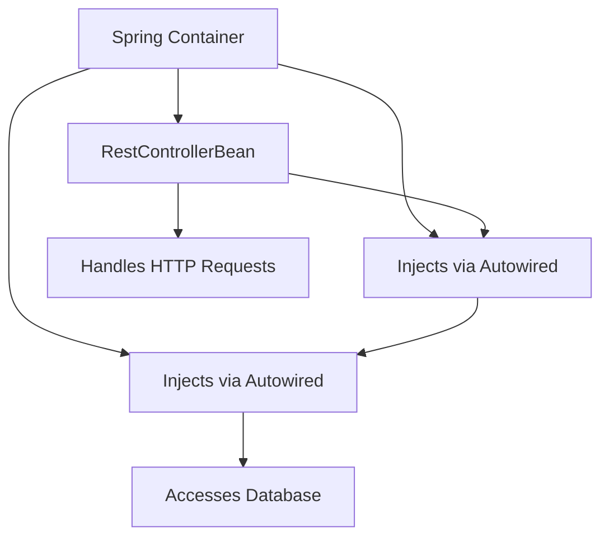
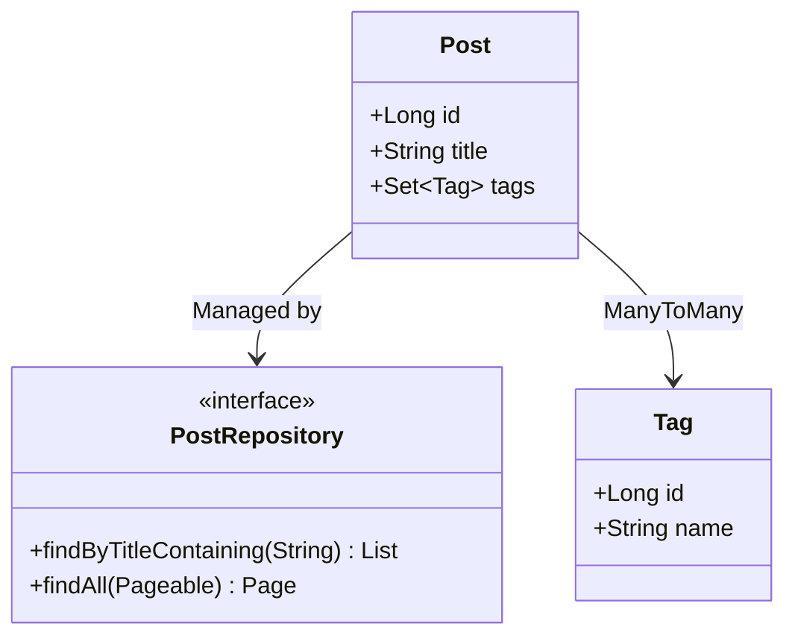
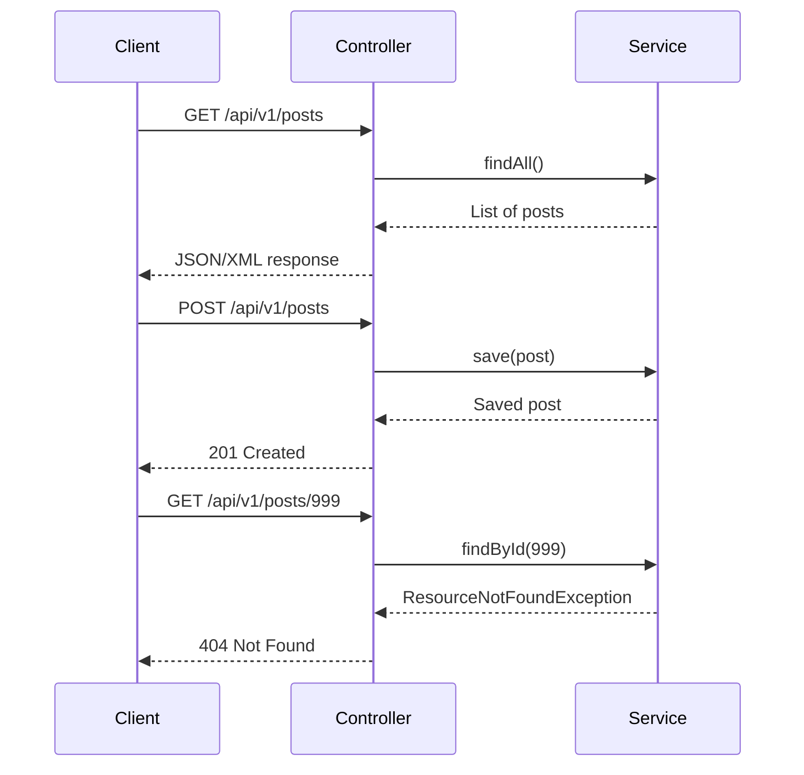
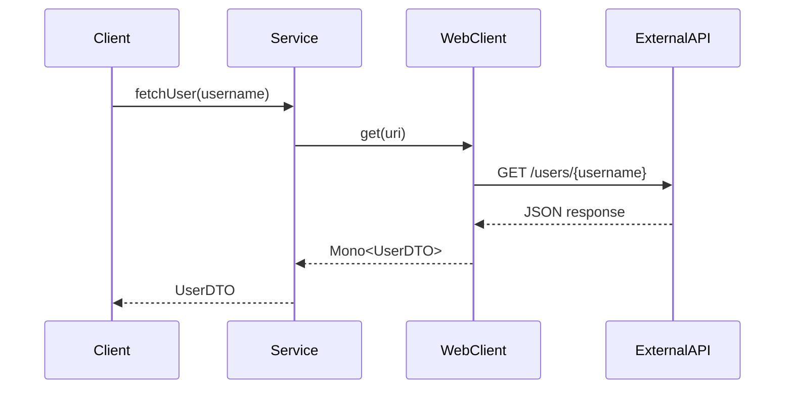

This cheatsheet is a concise, practical guide for the _SWE - Spring Boot - Intermediate_ course, designed for web developers with basic Spring Boot knowledge (e.g., REST APIs, JPA, dependency injection) and familiarity with JavaScript, REST APIs, JSON, and frontend testing (e.g., Jest). It covers advanced JPA, REST API design, external API integration, validation, security, testing, scheduling, and monitoring, using analogies to frontend concepts for clarity. Each section includes an overview, key concepts, commented code examples adhering to the _Code Commenting Guideline for Software Engineering Course_ with output comments, run commands with explanations, Mermaid diagrams, tips, and pitfalls.

## 1. Spring Boot Components and Beans

### Overview

Understand Spring Boot’s beans and components, like JavaScript modules, for building scalable backend systems.

### Key Concepts

- **Spring Beans**: Objects managed by Spring’s container, like JavaScript modules or React components, for reusability and testability.
  - **Characteristics**:
    - **Managed Lifecycle**: Spring handles creation and destruction, like React’s component lifecycle.
    - **Singleton Scope**: One instance per app by default, like a shared JavaScript module.
    - **Dependency Injection (DI)**: Beans are injected via `@Autowired`, like React context.
    - **Annotations**: `ComponentBean`, `ServiceBean`, `RepositoryBean`, `RestControllerBean`, `ConfigurationBean` define roles.
- **Spring Boot Components**:
  - **ComponentBean**: General-purpose bean, like a JavaScript utility module.
  - **ServiceBean**: Manages business logic, like a JavaScript service module.
  - **RepositoryBean**: Handles database operations, like a Sequelize model.
  - **RestControllerBean**: Processes HTTP requests, like Express routes.
  - **ConfigurationBean**: Defines custom settings, like a JavaScript config file.

### Mermaid Diagram: Component Interaction



**Diagram Explanation**:

- This diagram shows the Spring container managing beans, with `RestControllerBean` calling `ServiceBean`, which uses `RepositoryBean` for database access, similar to an Express app’s route-service-database flow.

## 2. Advanced Spring Data JPA

### Overview

Master advanced JPA for complex database operations, like Sequelize associations in Node.js.

### Key Concepts

- **Custom Queries**: Use `@Query` for JPQL, like Sequelize custom queries.
- **Entity Relationships**: `@OneToMany`, `@ManyToMany` define table links, like Sequelize associations.
- **Pagination**: Use `Pageable` for efficient data retrieval, like frontend table pagination.
- **RepositoryBean**: Extends `JpaRepository` for CRUD and custom queries.

### Mermaid Diagram: JPA Entity Relationships



**Diagram Explanation**:

- This diagram shows the `Post` entity with a `ManyToMany` relationship to `Tag`, managed by `PostRepository`, like Sequelize model associations.

### Syntax Examples

```xml
<!-- File: pom.xml -->
<!-- Description: Configures Maven project with JPA and H2 dependencies -->
<!-- Author: wkf -->
<!-- Date: 2025-07-07 -->
<!-- Course: SWE - Spring Boot - Intermediate -->
<project>
    <modelVersion>4.0.0</modelVersion>
    <groupId>com.example</groupId>
    <artifactId>myapp</artifactId>
    <version>1.0-SNAPSHOT</version>
    <parent>
        <groupId>org.springframework.boot</groupId>
        <artifactId>spring-boot-starter-parent</artifactId>
        <version>3.3.1</version>
    </parent>
    <dependencies>
        <!-- Spring Boot starter for JPA -->
        <dependency>
            <groupId>org.springframework.boot</groupId>
            <artifactId>spring-boot-starter-data-jpa</artifactId>
        </dependency>
        <!-- H2 database for testing -->
        <dependency>
            <groupId>com.h2database</groupId>
            <artifactId>h2</artifactId>
            <scope>runtime</scope>
        </dependency>
    </dependencies>
</project>
```

```java
// File: Post.java
// Description: Post entity with ManyToMany relationship to Tag.
// Author: wkf
// Date: 2025-07-07
// Course: SWE - Spring Boot - Intermediate

import jakarta.persistence.*;
import java.util.*;

// Marks this class as a database entity
@Entity
public class Post {
    // Primary key, auto-incremented
    @Id
    @GeneratedValue(strategy = GenerationType.IDENTITY)
    private Long id;
    private String title; // Table column
    // ManyToMany relationship, like Sequelize association
    @ManyToMany
    @JoinTable(name = "post_tag", joinColumns = @JoinColumn(name = "post_id"), inverseJoinColumns = @JoinColumn(name = "tag_id"))
    private Set<Tag> tags = new HashSet<>();

    // Getter for id
    public Long getId() { return id; }
    // Setter for id
    public void setId(Long id) { this.id = id; }
    // Getter for title
    public String getTitle() { return title; }
    // Setter for title
    public void setTitle(String title) { this.title = title; }
    // Getter for tags
    public Set<Tag> getTags() { return tags; }
    // Setter for tags
    public void setTags(Set<Tag> tags) { this.tags = tags; }
}

// File: Tag.java
// Description: Tag entity for ManyToMany relationship.
// Author: wkf
// Date: 2025-07-07
// Course: SWE - Spring Boot - Intermediate

import jakarta.persistence.*;

@Entity
public class Tag {
    // Primary key, auto-incremented
    @Id
    @GeneratedValue(strategy = GenerationType.IDENTITY)
    private Long id;
    private String name; // Table column

    // Getter for id
    public Long getId() { return id; }
    // Setter for id
    public void setId(Long id) { this.id = id; }
    // Getter for name
    public String getName() { return name; }
    // Setter for name
    public void setName(String name) { this.name = name; }
}
```

```java
// File: PostRepository.java
// Description: JPA repository with custom queries and pagination.
// Author: wkf
// Date: 2025-07-07
// Course: SWE - Spring Boot - Intermediate

import org.springframework.data.jpa.repository.JpaRepository;
import org.springframework.data.jpa.repository.Query;
import org.springframework.data.domain.Page;
import org.springframework.data.domain.Pageable;
import java.util.List;

// Marks this interface as a Spring repository bean
public interface PostRepository extends JpaRepository<Post, Long> {
    // Custom JPQL query for title search
    // Inputs: keyword (String)
    // Returns: List of matching posts
    @Query("SELECT p FROM Post p WHERE p.title LIKE %:keyword%")
    List<Post> findByTitleContaining(String keyword);

    // Pagination query
    // Inputs: pageable (Pageable)
    // Returns: Paginated posts
    Page<Post> findAll(Pageable pageable);
}
```

```java
// File: PostService.java
// Description: Service bean for managing posts with pagination.
// Author: wkf
// Date: 2025-07-07
// Course: SWE - Spring Boot - Intermediate

import org.springframework.beans.factory.annotation.Autowired;
import org.springframework.data.domain.Page;
import org.springframework.data.domain.PageRequest;
import org.springframework.data.domain.Sort;
import org.springframework.stereotype.Service;
import java.util.Optional;

// Marks this class as a Spring service bean
@Service
public class PostService {
    private final PostRepository repository; // Repository bean

    // Constructor to inject PostRepository
    // Inputs: repository (PostRepository)
    @Autowired
    public PostService(PostRepository repository) {
        this.repository = repository;
    }

    // Saves a post
    // Inputs: post (Post)
    // Returns: Saved post
    public Post save(Post post) {
        return repository.save(post); // Persist post
        // Output: Saved post object
    }

    // Finds post by ID
    // Inputs: id (Long)
    // Returns: Optional post
    public Optional<Post> findById(Long id) {
        return repository.findById(id); // Retrieve post
        // Output: Optional containing post or empty
    }

    // Retrieves paginated posts
    // Inputs: page (int), size (int)
    // Returns: Paginated posts
    public Page<Post> findAll(Pageable pageable) {
        return repository.findAll(pageable); // Fetch paginated posts
        // Output: JSON, e.g., {"content":[{"id":1,"title":"Test"}],"totalPages":1}
    }
}
```

**Run Command**:

```bash
mvn spring-boot:run
```

**Why This Command**:

- The `mvn spring-boot:run` command starts the Spring Boot app, initializing the H2 database and JPA repository, enabling database operations, similar to a Node.js app with Sequelize.

### Quick Reference Table

| Concept    | Java Syntax                      | JavaScript Equivalent           | Characteristics          |
| ---------- | -------------------------------- | ------------------------------- | ------------------------ |
| Entity     | `@Entity class Post`             | `Sequelize.define('Post')`      | Maps to table            |
| ManyToMany | `@ManyToMany @JoinTable`         | Sequelize associations          | Defines relationships    |
| JPQL Query | `@Query("SELECT p FROM Post p")` | `Model.findAll({ where: ... })` | Custom queries           |
| Pagination | `PageRequest.of(page, size)`     | `offset, limit` in Sequelize    | Efficient data retrieval |

### Analogy

- JPA relationships are like Sequelize associations, structuring complex backend data.

### Common Pitfalls

- **Missing `@JoinTable`**: Define explicitly for `@ManyToMany` relationships.
- **JPQL Errors**: Use entity names (e.g., `Post`) in queries, not table names.
- **Pagination Issues**: Ensure `Pageable` is configured correctly.

## 3. Advanced REST API Design

### Overview

Design robust REST APIs with proper status codes, content negotiation, and error handling, like frontend-backend API contracts.

### Key Concepts

- **REST Principles**: Use HTTP status codes (e.g., 201 Created, 404 Not Found), like frontend API standards.
- **Content Negotiation**: Support JSON/XML via `produces`, like frontend response formats.
- **API Versioning**: Use `/api/v1/` paths, like frontend route versioning.
- **Error Handling**: Custom exceptions with `@ExceptionHandler`, like Express error middleware.

### Mermaid Diagram: REST API Flow



**Diagram Explanation**:

- This diagram shows a client interacting with a `RestControllerBean` and `ServiceBean` for GET, POST, and error cases, like an Express app handling API requests.

### Syntax Examples

```java
// File: ResourceNotFoundException.java
// Description: Custom exception for not found errors.
// Author: wkf
// Date: 2025-07-07
// Course: SWE - Spring Boot - Intermediate

public class ResourceNotFoundException extends RuntimeException {
    // Constructor for exception
    // Inputs: message (String)
    public ResourceNotFoundException(String message) {
        super(message); // Pass message to parent
    }
}

// File: PostController.java
// Description: REST controller with advanced API design.
// Author: wkf
// Date: 2025-07-07
// Course: SWE - Spring Boot - Intermediate

import org.springframework.beans.factory.annotation.Autowired;
import org.springframework.http.HttpStatus;
import org.springframework.http.MediaType;
import org.springframework.http.ResponseEntity;
import org.springframework.web.bind.annotation.*;

import java.util.*;

// Marks this class as a Spring REST controller bean
@RestController
@RequestMapping(value = "/api/v1/posts", produces = {MediaType.APPLICATION_JSON_VALUE, MediaType.APPLICATION_XML_VALUE})
public class PostController {
    private final PostService postService; // Service bean

    // Constructor to inject PostService
    @Autowired
    public PostController(PostService postService) {
        this.postService = postService;
    }

    // Handles GET requests by ID
    // Inputs: id (Long)
    // Returns: Post object
    @GetMapping("/{id}")
    public ResponseEntity<Post> getPost(@PathVariable Long id) {
        Post post = postService.findById(id)
            .orElseThrow(() -> new ResourceNotFoundException("Post not found: " + id));
        return new ResponseEntity<>(post, HttpStatus.OK);
        // Output: JSON/XML, e.g., {"id":1,"title":"Test"}
    }

    // Handles POST requests
    // Inputs: post (Post)
    // Returns: Saved post
    @PostMapping
    public ResponseEntity<Post> createPost(@RequestBody Post post) {
        Post saved = postService.save(post);
        return new ResponseEntity<>(saved, HttpStatus.CREATED);
        // Output: HTTP 201 with JSON/XML post
    }

    // Handles errors
    @ExceptionHandler(ResourceNotFoundException.class)
    public ResponseEntity<String> handleNotFound(ResourceNotFoundException e) {
        return new ResponseEntity<>(e.getMessage(), HttpStatus.NOT_FOUND);
        // Output: HTTP 404 with "Post not found: [id]"
    }
}
```

**Run Command**:

```bash
mvn spring-boot:run
```

**Why This Command**:

- The `mvn spring-boot:run` command starts the Spring Boot app, enabling `/api/v1/posts` endpoints with JSON/XML support, similar to `node app.js`.

**Test Commands**:

```bash
# Test GET endpoint
curl -H "Accept: application/json" http://localhost:8080/api/v1/posts/1
# Output: {"id":1,"title":"Test"} (if post exists)

# Test POST endpoint
curl -X POST -H "Content-Type: application/json" -d '{"title":"New Post"}' http://localhost:8080/api/v1/posts
# Output: {"id":1,"title":"New Post"}
```

### Quick Reference Table

| Concept        | Java Syntax                                   | JavaScript Equivalent   | Characteristics           |
| -------------- | --------------------------------------------- | ----------------------- | ------------------------- |
| REST Endpoint  | `@GetMapping("/path")`                        | `app.get("/path", ...)` | Defines HTTP route        |
| Status Code    | `HttpStatus.CREATED`                          | `res.status(201)`       | Sets response status      |
| Content Type   | `produces = MediaType.APPLICATION_JSON_VALUE` | `res.json()`            | Specifies response format |
| Error Handling | `@ExceptionHandler`                           | Express `next(err)`     | Handles exceptions        |

### Analogy

- REST APIs are like frontend-backend contracts, ensuring clear communication.

### Common Pitfalls

- **Incorrect Status**: Use `HttpStatus.CREATED` for POST, not `OK`.
- **Content Negotiation**: Specify `produces` to avoid format errors.
- **Global Errors**: Use `@ControllerAdvice` for shared error handling.

## 4. Calling External REST APIs

### Overview

Integrate external APIs using WebClient, like `axios` in JavaScript, for backend data fetching.

### Key Concepts

- **WebClient**: Non-blocking HTTP client, like `axios` for API calls.
- **Error Handling**: Manage timeouts/retries, like frontend error boundaries.
- **JSON Mapping**: Use Jackson for DTOs, like `JSON.parse`.
- **Reactive Programming**: Use `Mono` for single responses, like `async/await`.

### Mermaid Diagram: WebClient Flow



**Diagram Explanation**:

- This diagram shows a `ServiceBean` using `WebClient` to fetch external API data, like a frontend app using `axios` with reactive handling.

### Syntax Examples

```xml
<!-- File: pom.xml -->
<!-- Description: Configures Maven project with WebClient -->
<!-- Author: wkf -->
<!-- Date: 2025-07-07 -->
<!-- Course: SWE - Spring Boot - Intermediate -->
<project>
    <modelVersion>4.0.0</modelVersion>
    <groupId>com.example</groupId>
    <artifactId>myapp</artifactId>
    <version>1.0-SNAPSHOT</version>
    <parent>
        <groupId>org.springframework.boot</groupId>
        <artifactId>spring-boot-starter-parent</artifactId>
        <version>3.3.1</version>
    </parent>
    <dependencies>
        <!-- Spring Boot starter for WebClient -->
        <dependency>
            <groupId>org.springframework.boot</groupId>
            <artifactId>spring-boot-starter-webflux</artifactId>
        </dependency>
    </dependencies>
</project>
```

```java
// File: WebClientConfig.java
// Description: Configures WebClient bean for external API calls.
// Author: wkf
// Date: 2025-07-07
// Course: SWE - Spring Boot - Intermediate

import org.springframework.context.annotation.Configuration;
import org.springframework.context.annotation.Bean;
import org.springframework.web.reactive.function.client.WebClient;

// Marks this class as a Spring configuration bean
@Configuration
public class WebClientConfig {
    // Defines WebClient bean
    // Returns: WebClient instance
    @Bean
    public WebClient webClient() {
        return WebClient.builder()
            .baseUrl("https://api.github.com") // Set base URL
            .defaultHeader("Accept", "application/json") // Set JSON header
            .build();
    }
}
```

```java
// File: UserDTO.java
// Description: DTO for GitHub user data.
// Author: wkf
// Date: 2025-07-07
// Course: SWE - Spring Boot - Intermediate

public class UserDTO {
    private String name; // JSON field

    // Getter for name
    public String getName() { return name; }
    // Setter for name
    public void setName(String name) { this.name = name; }
}

// File: GitHubService.java
// Description: Service bean for fetching GitHub user data.
// Author: wkf
// Date: 2025-07-07
// Course: SWE - Spring Boot - Intermediate

import org.springframework.beans.factory.annotation.Autowired;
import org.springframework.stereotype.Service;
import org.springframework.web.reactive.function.client.WebClient;
import reactor.core.publisher.Mono;

// Marks this class as a Spring service bean
@Service
public class GitHubService {
    private final WebClient webClient; // WebClient dependency

    // Constructor to inject WebClient
    @Autowired
    public GitHubService(WebClient webClient) {
        this.webClient = webClient;
    }

    // Fetches GitHub user data
    // Inputs: username (String)
    // Returns: Mono<UserDTO>
    public Mono<UserDTO> fetchUser(String username) {
        return webClient.get()
            .uri("/users/{username}", username)
            .retrieve()
            .bodyToMono(UserDTO.class)
            .onErrorReturn(new UserDTO()); // Fallback on error
        // Output: JSON user object, e.g., {"name":"Alice"}
    }
}
```

**Run Command**:

```bash
mvn spring-boot:run
```

**Why This Command**:

- The `mvn spring-boot:run` command starts the Spring Boot app, enabling `GitHubService` to fetch external API data, similar to a Node.js app with `axios`.

### Quick Reference Table

| Concept        | Java Syntax                 | JavaScript Equivalent       | Characteristics        |
| -------------- | --------------------------- | --------------------------- | ---------------------- |
| WebClient      | `WebClient.get().uri(...)`  | `axios.get(...)`            | Non-blocking API calls |
| Error Handling | `onErrorReturn(...)`        | `try { ... } catch { ... }` | Manages failures       |
| DTO Mapping    | `bodyToMono(UserDTO.class)` | `JSON.parse(response.data)` | Maps JSON to object    |

### Analogy

- WebClient is like `axios`, fetching external data with error handling.

### Common Pitfalls

- **Blocking Calls**: Avoid `block()` in production; use reactive flows.
- **API Errors**: Handle 4xx/5xx errors with `onStatus`.
- **DTO Mismatch**: Match DTO fields to API response structure.

## 5. Intermediate Capstone: Blog API with External Integration

### Overview

Build a RESTful blog API with JPA, external API calls, and validation, like a frontend app with third-party API integration.

### Example Code

```java
// File: PostDTO.java
// Description: DTO for post creation with validation.
// Author: wkf
// Date: 2025-07-07
// Course: SWE - Spring Boot - Intermediate

import jakarta.validation.constraints.*;

public class PostDTO {
    // Validates title
    @NotNull(message = "Title cannot be null")
    @Size(min = 1, max = 100, message = "Title must be 1-100 characters")
    private String title;
    // Validates username
    @NotNull(message = "Author username required")
    private String authorUsername;

    // Getter for title
    public String getTitle() { return title; }
    // Setter for title
    public void setTitle(String title) { this.title = title; }
    // Getter for authorUsername
    public String getAuthorUsername() { return authorUsername; }
    // Setter for authorUsername
    public void setAuthorUsername(String authorUsername) { this.authorUsername = authorUsername; }
}

// File: BlogController.java
// Description: REST controller with external API integration.
// Author: wkf
// Date: 2025-07-07
// Course: SWE - Spring Boot - Intermediate

import org.springframework.beans.factory.annotation.Autowired;
import org.springframework.http.HttpStatus;
import org.springframework.http.ResponseEntity;
import org.springframework.transaction.annotation.Transactional;
import org.springframework.validation.annotation.Validated;
import org.springframework.web.bind.annotation.*;

import jakarta.validation.Valid;

// Marks this class as a Spring REST controller bean
@RestController
@RequestMapping("/api/v1/posts")
@Validated // Enables validation
public class BlogController {
    private final PostService postService; // Service bean
    private final GitHubService gitHubService; // External API service bean

    // Constructor to inject services
    @Autowired
    public BlogController(PostService postService, GitHubService gitHubService) {
        this.postService = postService;
        this.gitHubService = gitHubService;
    }

    // Handles POST requests with validation
    // Inputs: postDTO (PostDTO)
    @PostMapping
    @Transactional
    public ResponseEntity<Post> createPost(@Valid @RequestBody PostDTO postDTO) {
        // Fetch author name from GitHub
        String author = gitHubService.fetchUser(postDTO.getAuthorUsername())
            .block() // Block for simplicity (avoid in production)
            .getName();
        // Create post
        Post post = new Post();
        post.setTitle(postDTO.getTitle());
        post.setContent("By " + author);
        // Save post
        Post saved = postService.save(post);
        return new ResponseEntity<>(saved, HttpStatus.CREATED);
        // Output: HTTP 201 with JSON post
    }
}
```

**Run Command**:

```bash
mvn spring-boot:run
```

**Why This Command**:

- The `mvn spring-boot:run` command starts the Spring Boot app, enabling the blog API with JPA and external API integration, similar to a Node.js app.

**Test Commands**:

```bash
# Test POST endpoint
curl -X POST -H "Content-Type: application/json" -d '{"title":"New Post","authorUsername":"alice"}' http://localhost:8080/api/v1/posts
# Output: {"id":1,"title":"New Post","content":"By Alice"}
```

### Analogy

- The blog API is like a frontend app fetching third-party API data.

### Common Pitfalls

- **Transaction Scope**: Use `@Transactional` for database and API calls.
- **Validation Errors**: Ensure `@Valid` and `spring-boot-starter-validation`.
- **Blocking**: Avoid `block()` in production for WebClient.

## 6. Data Validation and API Documentation

### Overview

Validate inputs and document APIs, like frontend form validation and Postman docs.

### Key Concepts

- **Bean Validation**: Use `@NotNull`, `@Size`, like frontend form checks.
- **Custom Validators**: Create rules with `@Constraint`, like JavaScript validation.
- **Swagger**: Generate API docs with `ConfigurationBean`, like Postman collections.

### Syntax Examples

```xml
<!-- File: pom.xml -->
<!-- Description: Configures Maven project with validation and Swagger -->
<!-- Author: wkf -->
<!-- Date: 2025-07-07 -->
<!-- Course: SWE - Spring Boot - Intermediate -->
<project>
    <modelVersion>4.0.0</modelVersion>
    <groupId>com.example</groupId>
    <artifactId>myapp</artifactId>
    <version>1.0-SNAPSHOT</version>
    <parent>
        <groupId>org.springframework.boot</groupId>
        <artifactId>spring-boot-starter-parent</artifactId>
        <version>3.3.1</version>
    </parent>
    <dependencies>
        <!-- Spring Boot starter for validation -->
        <dependency>
            <groupId>org.springframework.boot</groupId>
            <artifactId>spring-boot-starter-validation</artifactId>
        </dependency>
        <!-- Springdoc for Swagger -->
        <dependency>
            <groupId>org.springdoc</groupId>
            <artifactId>springdoc-openapi-starter-webmvc-ui</artifactId>
            <version>2.2.0</version>
        </dependency>
    </dependencies>
</project>
```

```java
// File: OpenApiConfig.java
// Description: Configures Swagger API documentation.
// Author: wkf
// Date: 2025-07-07
// Course: SWE - Spring Boot - Intermediate

import org.springframework.context.annotation.Configuration;
import org.springframework.context.annotation.Bean;
import io.swagger.v3.oas.models.OpenAPI;
import io.swagger.v3.oas.models.info.Info;

// Marks this class as a Spring configuration bean
@Configuration
public class OpenApiConfig {
    // Defines OpenAPI bean for Swagger
    @Bean
    public OpenAPI customOpenApi() {
        return new OpenAPI()
            .info(new Info()
                .title("Blog API")
                .version("v1")
                .description("REST API for blog management"));
        // Output: Swagger UI at /swagger-ui.html
    }
}
```

**Run Command**:

```bash
mvn spring-boot:run
```

**Why This Command**:

- The `mvn spring-boot:run` command starts the Spring Boot app, enabling Swagger at `/swagger-ui.html`, similar to a Node.js app with API docs.

**Test Command**:

```bash
# Access Swagger UI
curl http://localhost:8080/swagger-ui.html
# Output: Opens Swagger UI in browser
```

### Quick Reference Table

| Concept    | Java Syntax             | JavaScript Equivalent        | Characteristics     |
| ---------- | ----------------------- | ---------------------------- | ------------------- |
| Validation | `@NotNull`, `@Size`     | `if (!form.title) throw ...` | Ensures valid input |
| Swagger    | `OpenAPI` configuration | Postman API spec             | Generates API docs  |

### Analogy

- Validation is like frontend form checks; Swagger is like Postman collections.

### Common Pitfalls

- **Missing Validation**: Add `spring-boot-starter-validation` to `pom.xml`.
- **Swagger Access**: Ensure `springdoc-openapi` dependency is included.
- **Validation Scope**: Use `@Validated` on controllers for method-level validation.

## 7. Testing Spring Boot Applications

### Overview

Test Spring Boot apps with unit and integration tests, like Jest and Supertest for Node.js apps.

### Key Concepts

- **Unit Testing**: JUnit 5 and Mockito for `ServiceBean`, like Jest for components.
- **Integration Testing**: `@SpringBootTest` for system tests, like end-to-end tests.
- **MockMvc**: Test `RestControllerBean` endpoints, like Supertest.
- **Test Annotations**: `@MockBean`, `@AutoConfigureMockMvc` for mocking and API testing.

### Syntax Examples

```xml
<!-- File: pom.xml -->
<!-- Description: Configures Maven project with testing dependency -->
<!-- Author: wkf -->
<!-- Date: 2025-07-07 -->
<!-- Course: SWE - Spring Boot - Intermediate -->
<project>
    <modelVersion>4.0.0</modelVersion>
    <groupId>com.example</groupId>
    <artifactId>myapp</artifactId>
    <version>1.0-SNAPSHOT</version>
    <parent>
        <groupId>org.springframework.boot</groupId>
        <artifactId>spring-boot-starter-parent</artifactId>
        <version>3.3.1</version>
    </parent>
    <dependencies>
        <!-- Spring Boot starter for testing -->
        <dependency>
            <groupId>org.springframework.boot</groupId>
            <artifactId>spring-boot-starter-test</artifactId>
            <scope>test</scope>
        </dependency>
    </dependencies>
</project>
```

```java
// File: PostServiceTest.java
// Description: Tests PostService with JUnit 5 and Mockito.
// Author: wkf
// Date: 2025-07-07
// Course: SWE - Spring Boot - Intermediate

import org.junit.jupiter.api.Test;
import org.springframework.beans.factory.annotation.Autowired;
import org.springframework.boot.test.context.SpringBootTest;
import org.springframework.boot.test.mock.mockito.MockBean;
import static org.junit.jupiter.api.Assertions.*;
import static org.mockito.Mockito.*;

@SpringBootTest
class PostServiceTest {
    @MockBean
    private PostRepository postRepository; // Mocked repository
    @Autowired
    private PostService postService; // Service to test

    // Tests saving a post
    @Test
    void testSavePost() {
        Post post = new Post();
        post.setTitle("Test");
        when(postRepository.save(any(Post.class))).thenReturn(post);
        Post saved = postService.save(post);
        assertEquals("Test", saved.getTitle());
        // Output: Test passes if title is "Test"
    }
}
```

```java
// File: PostControllerTest.java
// Description: Tests PostController with MockMvc.
// Author: wkf
// Date: 2025-07-07
// Course: SWE - Spring Boot - Intermediate

import org.junit.jupiter.api.Test;
import org.springframework.beans.factory.annotation.Autowired;
import org.springframework.boot.test.autoconfigure.web.servlet.AutoConfigureMockMvc;
import org.springframework.boot.test.context.SpringBootTest;
import org.springframework.http.MediaType;
import org.springframework.test.web.servlet.MockMvc;
import static org.springframework.test.web.servlet.request.MockMvcRequestBuilders.*;
import static org.springframework.test.web.servlet.result.MockMvcResultMatchers.*;

@SpringBootTest
@AutoConfigureMockMvc
class PostControllerTest {
    @Autowired
    private MockMvc mockMvc; // MockMvc for testing

    // Tests POST request
    @Test
    void testCreatePost() throws Exception {
        String postJson = "{\"title\":\"Test Post\"}";
        mockMvc.perform(post("/api/v1/posts")
                .contentType(MediaType.APPLICATION_JSON)
                .content(postJson))
            .andExpect(status().isCreated())
            .andExpect(jsonPath("$.title").value("Test Post"));
        // Output: Test passes if response contains "Test Post"
    }
}
```

**Run Command**:

```bash
mvn test
```

**Why This Command**:

- The `mvn test` command runs JUnit tests, executing `PostServiceTest` and `PostControllerTest`, similar to `npm test` for Jest.

### Quick Reference Table

| Concept          | Java Syntax                  | JavaScript Equivalent  | Characteristics           |
| ---------------- | ---------------------------- | ---------------------- | ------------------------- |
| Unit Test        | `@Test`, `Mockito.when`      | `jest.mock`, `test`    | Tests logic in isolation  |
| Integration Test | `@SpringBootTest`, `MockMvc` | `supertest` E2E tests  | Tests system interactions |
| JPA Test         | `@DataJpaTest`               | Sequelize test queries | Tests database operations |

### Analogy

- MockMvc is like Supertest; `@DataJpaTest` is like testing Sequelize queries.

### Common Pitfalls

- **Mock Setup**: Use `@MockBean` to avoid real database calls.
- **Test Scope**: Use `@DataJpaTest` for JPA; `@SpringBootTest` for full context.
- **JSON Path**: Match `jsonPath` to response structure.

## 8. Security and JWT

### Overview

Secure APIs with JWT, like frontend token-based authentication, for robust access control.

### Key Concepts

- **Spring Security**: Secures APIs with JWT, like Express middleware.
- **JWT Filter**: Validates tokens, like frontend token verification.
- **Role-Based Access**: Restrict endpoints with roles, like frontend route guards.

### Syntax Examples

```xml
<!-- File: pom.xml -->
<!-- Description: Configures Maven project with security -->
<!-- Author: wkf -->
<!-- Date: 2025-07-07 -->
<!-- Course: SWE - Spring Boot - Intermediate -->
<project>
    <modelVersion>4.0.0</modelVersion>
    <groupId>com.example</groupId>
    <artifactId>myapp</artifactId>
    <version>1.0-SNAPSHOT</version>
    <parent>
        <groupId>org.springframework.boot</groupId>
        <artifactId>spring-boot-starter-parent</artifactId>
        <version>3.3.1</version>
    </parent>
    <dependencies>
        <!-- Spring Boot starter for security -->
        <dependency>
            <groupId>org.springframework.boot</groupId>
            <artifactId>spring-boot-starter-security</artifactId>
        </dependency>
    </dependencies>
</project>
```

```java
// File: SecurityConfig.java
// Description: Configures Spring Security with JWT.
// Author: wkf
// Date: 2025-07-07
// Course: SWE - Spring Boot - Intermediate

import org.springframework.context.annotation.Configuration;
import org.springframework.context.annotation.Bean;
import org.springframework.security.config.annotation.web.builders.HttpSecurity;
import org.springframework.security.web.SecurityFilterChain;
import org.springframework.security.web.authentication.UsernamePasswordAuthenticationFilter;

// Marks this class as a Spring configuration bean
@Configuration
public class SecurityConfig {
    // Configures security filter chain
    @Bean
    public SecurityFilterChain securityFilterChain(HttpSecurity http) throws Exception {
        http
            .authorizeHttpRequests(auth -> auth
                .requestMatchers("/api/v1/public/**").permitAll()
                .anyRequest().authenticated())
            .addFilterBefore(new JwtFilter(), UsernamePasswordAuthenticationFilter.class)
            .csrf(csrf -> csrf.disable());
        return http.build();
    }
}

// File: JwtFilter.java
// Description: Component bean for JWT validation.
// Author: wkf
// Date: 2025-07-07
// Course: SWE - Spring Boot - Intermediate

import jakarta.servlet.*;
import org.springframework.stereotype.Component;
import org.springframework.security.core.context.SecurityContextHolder;
import org.springframework.security.authentication.UsernamePasswordAuthenticationToken;
import java.util.List;
import java.io.IOException;

// Marks this class as a Spring component bean
@Component
public class JwtFilter implements Filter {
    // Filters requests to validate JWT
    @Override
    public void doFilter(ServletRequest request, ServletResponse response, FilterChain chain)
            throws IOException, ServletException {
        HttpServletRequest req = (HttpServletRequest) request;
        String token = req.getHeader("Authorization");
        if (token != null && token.startsWith("Bearer ")) {
            // Simulate JWT validation (use jjwt in production)
            SecurityContextHolder.getContext().setAuthentication(
                new UsernamePasswordAuthenticationToken("user", null, List.of()));
        }
        chain.doFilter(request, response);
    }
}
```

**Run Command**:

```bash
mvn spring-boot:run
```

**Why This Command**:

- The `mvn spring-boot:run` command starts the Spring Boot app, enabling JWT security, similar to a Node.js app with auth middleware.

### Quick Reference Table

| Concept         | Java Syntax         | JavaScript Equivalent         | Characteristics     |
| --------------- | ------------------- | ----------------------------- | ------------------- |
| Security Config | `EnableWebSecurity` | Express `passport` middleware | Configures security |
| JWT Filter      | `implements Filter` | `express-jwt` middleware      | Validates tokens    |

### Analogy

- JWT security is like frontend token-based auth, securing APIs with bearer tokens.

### Common Pitfalls

- **JWT Validation**: Implement proper token parsing (e.g., jjwt library).
- **CSRF**: Disable only for stateless APIs.
- **Token Headers**: Ensure `Authorization: Bearer <token>` in requests.

## 9. Scheduling and Monitoring

### Overview

Implement scheduled tasks and monitoring, like frontend `setInterval` and analytics dashboards.

### Key Concepts

- **Scheduling**: Use `@Scheduled` for periodic tasks, enabled by `ConfigurationBean`.
- **Monitoring**: Spring Boot Actuator for metrics, like frontend analytics.
- **Health Checks**: Expose `/actuator/health`, like frontend status APIs.

### Syntax Examples

```xml
<!-- File: pom.xml -->
<!-- Description: Configures Maven project with Actuator -->
<!-- Author: wkf -->
<!-- Date: 2025-07-07 -->
<!-- Course: SWE - Spring Boot - Intermediate -->
<project>
    <modelVersion>4.0.0</modelVersion>
    <groupId>com.example</groupId>
    <artifactId>myapp</artifactId>
    <version>1.0-SNAPSHOT</version>
    <parent>
        <groupId>org.springframework.boot</groupId>
        <artifactId>spring-boot-starter-parent</artifactId>
        <version>3.3.1</version>
    </parent>
    <dependencies>
        <!-- Spring Boot starter for Actuator -->
        <dependency>
            <groupId>org.springframework.boot</groupId>
            <artifactId>spring-boot-starter-actuator</artifactId>
        </dependency>
    </dependencies>
</project>
```

```java
// File: SchedulingConfig.java
// Description: Configures scheduling for periodic tasks.
// Author: wkf
// Date: 2025-07-07
// Course: SWE - Spring Boot - Intermediate

import org.springframework.context.annotation.Configuration;
import org.springframework.scheduling.annotation.EnableScheduling;

// Marks this class as a Spring configuration bean
@Configuration
@EnableScheduling
public class SchedulingConfig {}
```

```java
// File: DataSyncService.java
// Description: Service bean for scheduled data sync.
// Author: wkf
// Date: 2025-07-07
// Course: SWE - Spring Boot - Intermediate

import org.slf4j.Logger;
import org.slf4j.LoggerFactory;
import org.springframework.scheduling.annotation.Scheduled;
import org.springframework.stereotype.Service;

// Marks this class as a Spring service bean
@Service
public class DataSyncService {
    private static final Logger logger = LoggerFactory.getLogger(DataSyncService.class);

    // Runs sync every 60 seconds
    @Scheduled(fixedRate = 60000)
    public void syncData() {
        logger.info("Syncing data...");
        // Output: Log entry "Syncing data..." every 60 seconds
    }
}
```

```yaml
# File: application.yml
# Description: Configures Actuator for monitoring
# Author: wkf
# Date: 2025-07-07
# Course: SWE - Spring Boot - Intermediate
management:
  endpoints:
    web:
      exposure:
        include: health,metrics # Expose endpoints
  endpoint:
    health:
      show-details: always # Detailed health info
```

**Run Command**:

```bash
mvn spring-boot:run
```

**Why This Command**:

- The `mvn spring-boot:run` command starts the Spring Boot app, enabling scheduled tasks and Actuator endpoints, similar to a Node.js app with analytics.

**Test Commands**:

```bash
# Check health
curl http://localhost:8080/actuator/health
# Output: {"status":"UP","details":{...}}

# Check metrics
curl http://localhost:8080/actuator/metrics
# Output: {"names":[...]}
```

### Quick Reference Table

| Concept    | Java Syntax                     | JavaScript Equivalent     | Characteristics |
| ---------- | ------------------------------- | ------------------------- | --------------- |
| Scheduling | `@Scheduled(fixedRate = 60000)` | `setInterval(fn, 60000)`  | Periodic tasks  |
| Actuator   | `/actuator/health`              | Frontend health check API | Exposes metrics |

### Analogy

- Scheduling is like `setInterval`; Actuator is like a frontend analytics dashboard.

### Common Pitfalls

- **Scheduling**: Enable with `@EnableScheduling` in a `ConfigurationBean`.
- **Actuator Access**: Expose endpoints in `application.yml`.
- **Log Levels**: Use `info` for general logs, `debug` for diagnostics.

## 10. Setup and Resources

### Environment Setup

- **JDK 17+**:
  ```bash
  # Install JDK 17 on Linux
  sudo apt install openjdk-17-jdk
  ```
- **Maven**:
  ```bash
  # Install Maven
  sudo apt install maven
  # Check version
  mvn --version
  ```
- **VS Code**: Install Spring Boot Extension Pack for IntelliSense.
- **Spring Initializr**: Use `start.spring.io` for project setup.
- **H2 Database**: Configured in `pom.xml` for testing.

### Key Resources

- **Spring Data JPA**: `org.springframework.boot:spring-boot-starter-data-jpa:3.3.1`.
- **WebClient**: `org.springframework.boot:spring-boot-starter-webflux:3.3.1`.
- **Validation**: `org.springframework.boot:spring-boot-starter-validation`.
- **Security**: `org.springframework.boot:spring-boot-starter-security`.
- **Actuator**: `org.springframework.boot:spring-boot-starter-actuator`.
- **Swagger**: `org.springdoc:springdoc-openapi-starter-webmvc-ui:2.2.0`.
- **Spring Docs**: Official documentation for JPA, security, and testing.
- **H2 Console**: Access at `http://localhost:8080/h2-console`.

### Terminal Commands

```bash
# Generate project
curl https://start.spring.io/starter.zip -d dependencies=web,data-jpa,validation,security,actuator,webflux -d javaVersion=17 -o project.zip

# Run application
mvn spring-boot:run

# Run tests
mvn test

# Build project
mvn clean install
```

### Analogy

- Setting up Spring Boot is like configuring a Node.js app with npm and Sequelize.

### Common Pitfalls

- **Dependency Conflicts**: Ensure consistent Spring Boot versions (3.3.1).
- **H2 Setup**: Verify `application.yml` for H2 console access.
- **Maven Cache**: Clear `.m2` folder if build fails (`rm -rf ~/.m2/repository`).

## 11. Tips for Recall

- **Analogies**: Compare to Express (e.g., `RestControllerBean` ≈ routes, WebClient ≈ `axios`).
- **Practice**: Test endpoints with `curl`, explore `/swagger-ui.html`, and check `/h2-console`.
- **Visualize**: Use tables and diagrams to connect concepts.
- **Test-Driven**: Write unit and integration tests to reinforce learning.
- **Error Handling**: Learn exceptions like `ResourceNotFoundException`.
- **Capstones**: Revisit blog API to apply JPA and external API integration.
