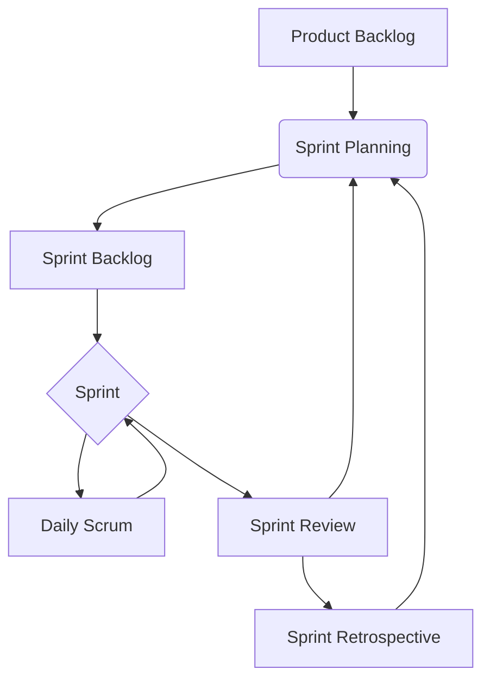

Scrum is an agile framework for managing and completing complex projects. Scrum events are time-boxed events that are used to facilitate the Scrum framework. Five Scrum events occur within a Sprint, a time-boxed iteration of one to four weeks.

## The Five Scrum Events

### 1. Sprint Planning

Sprint Planning is an essential activity in the Scrum framework used in agile software development. This time-boxed event occurs at the beginning of each Sprint, a time-boxed iteration of two to four weeks. The primary objective of Sprint Planning is to define the Sprint Goal, a high-level objective that the Scrum Team aims to achieve during the Sprint.

To achieve the Sprint Goal, the Scrum Team collaborates to determine which Product Backlog Items (PBIs) will be completed during the Sprint and how they will be completed. PBIs are items on the Product Backlog, which is an ordered list of requirements that describes the functionality or features of a product. During Sprint Planning, the Scrum Team selects PBIs from the Product Backlog they can complete during the Sprint.

Once the Scrum Team has selected the PBIs for the Sprint, they create a plan for achieving the Sprint Goal. This plan includes defining the tasks that need to be completed to deliver each PBI, estimating the effort required for each task, and assigning tasks to members of the Scrum Team.

Overall, Sprint Planning is a crucial event that sets the direction for the Sprint and ensures everyone is aligned on the goals and objectives. The Scrum Team can deliver high-quality products and achieve business objectives by collaborating and planning.

### 2. Daily Scrum

The Daily Scrum is a vital aspect of the Scrum framework. It is a time-boxed event that occurs every day during the Sprint, providing a daily opportunity for the Development Team to inspect their progress toward the Sprint Goal, synchronize their work, and plan for the next 24 hours. The Scrum Master should ensure that the Daily Scrum is held at the same time and place each day and that it is no longer than 15 minutes.

During the Daily Scrum, each Development Team member should answer the following questions:

- What did I do yesterday that helped the Development Team meet the Sprint Goal?
- What will I do today to help the Development Team meet the Sprint Goal?
- Do I see any impediment that prevents me or the Development Team from meeting the Sprint Goal?

It is important to note that the Daily Scrum is not a status meeting but a time for the Development Team to inspect their progress and adapt their plan accordingly. It is also an opportunity for the Scrum Master to identify any impediments and help the Development Team to resolve them.

Overall, the Daily Scrum is a crucial component of the Scrum framework, promoting collaboration, transparency, and continuous improvement throughout development.

### 3. Sprint Review

The Sprint Review is a crucial part of the Scrum methodology at the end of each Sprint. This time-boxed event allows the Scrum Team and stakeholders to come together and reflect on the work accomplished during the Sprint.

During the Sprint Review, the Scrum Team presents the Increment and demonstrates the functionality that has been added to the product. The team also discusses any challenges encountered during the Sprint and how those challenges were overcome.

In addition, the Sprint Review allows stakeholders to give feedback on the product. This feedback can improve the product and adjust the future Backlog if necessary.

Overall, the Sprint Review is an essential aspect of the Scrum methodology that promotes collaboration and continuous improvement. It ensures that the product is meeting the needs of the stakeholders and that the Scrum Team is working effectively together.

### 4. Sprint Retrospective

The Sprint Retrospective is a crucial part of the Scrum framework that happens at the end of each Sprint. During this time-boxed event, the Scrum Team takes a step back to reflect on their performance and identify areas for improvement. By doing so, they can create a plan to help them work more effectively and efficiently in the next Sprint.

In the Sprint Retrospective, the Scrum Team analyzes what went well in the previous Sprint and what didn't go as planned. They also identify potential impediments during the Sprint and discuss ways to overcome them. The Scrum Team can continuously improve their work and deliver better results by reflecting and planning.

It's worth noting that the Sprint Retrospective is not a blame game. Instead, it's an opportunity for the Scrum Team to work together and collaborate to create a better working environment. By encouraging open and honest communication, the Scrum Team can build trust and foster a culture of continuous improvement.

### 5. Backlog Refinement

Backlog Refinement is a crucial aspect of the Scrum framework and an ongoing event throughout the Sprint. Backlog Refinement aims to ensure the Product Backlog is well-prepared for the next Sprint Planning. During Backlog Refinement, the Scrum Team collaborates to refine the Product Backlog Items by breaking them down into smaller, more manageable parts. This helps to ensure that the items are clear, concise, and actionable.

Furthermore, Backlog Refinement is an iterative process that involves continuous improvement. As the Scrum Team better understands the product and its requirements, they can refine the Product Backlog Items to meet customers' needs better. This helps ensure the product is delivered on time and within budget while meeting customer expectations.

In addition, Backlog Refinement is an opportunity for the Scrum Team to collaborate and share knowledge. By working together, the team can identify potential issues and develop solutions. This helps ensure the team works efficiently and effectively to deliver a high-quality product.

Overall, Backlog Refinement is a critical aspect of the Scrum framework, and it is essential to ensure that the Product Backlog is well-prepared for the next Sprint Planning. The Scrum Team can deliver a high-quality product that meets the customer's needs and expectations by collaborating, refining, and continuously improving the Product Backlog Items.

## The Scrum Flow

Here is the Scrum flow diagram:

This flowchart visually represents the Scrum framework and how the events fit together to support iterative and incremental development.

## Further Readings

- [The Scrum Guide](https://scrumguides.org/scrum-guide.html)
- [Scrum.org](https://www.scrum.org/)
