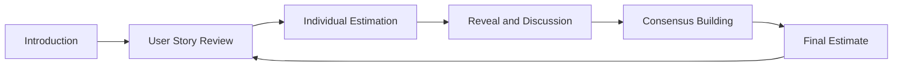

## Overview

Planning Poker is an Agile estimation technique developed teams use to estimate the effort or relative size of user stories or tasks in a project. It is a collaborative approach that leverages team members’ collective knowledge and expertise to achieve more accurate estimates. Planning Poker is a popular method within Agile methodologies like Scrum, where accurate estimations are crucial for effective planning and prioritization.

In addition to its usefulness in Agile methodologies, Planning Poker can be used in other project management frameworks. For example, it can be utilized in the Waterfall method to estimate the length of each process stage. Planning Poker can also be used to estimate the duration of a project, the number of resources required, and the budget needed to complete it.

Furthermore, Planning Poker is not limited to software development projects. It can be used in any project requiring estimation, such as construction, marketing, or event planning. By involving the entire team in the estimation process, Planning Poker can ensure that everyone has a shared understanding of the project's goals and requirements, leading to a more successful project outcome.

## Output

Planning Poker is an effective tool for agile teams to estimate the work required for each user story or task. By assigning estimated values to each story point, the team can communicate the effort, complexity, and size of the work that needs to be done. This can help ensure the project backlog is prioritized and planned effectively while providing a detailed overview of the work.

Planning Poker allows the team to assign story points to each user story or task based on a range of factors, such as the complexity of the work, the amount of effort required, and the size of the task. By considering these factors, the team can provide a more accurate estimate of the work required for each task.

## Participants

The participants in Planning Poker typically include the development team members, product owner, and Scrum Master. The team members involved in the estimation process should understand the user stories or tasks being estimated.

It is important to note that the development team members should come from different backgrounds and have varying levels of expertise to ensure that all aspects of the project are thoroughly considered during the estimation process. The product owner, responsible for representing the end user's interests, should be present to provide context and clarify any uncertainties that may arise. The Scrum Master, who serves as a facilitator and coach for the team, should also be present to ensure that the process runs smoothly and that everyone's opinions are heard.

## Duration

The duration of a Planning Poker session can vary depending on the number of user stories or tasks being estimated, the team size, and the level of detail that needs to be discussed. If the project involves multiple teams or stakeholders, schedule multiple sessions to ensure that everyone has the opportunity to provide input.

In addition to the time required for the estimation process, it is also important to allocate time for preparation and follow-up activities. For example, the facilitator may need to prepare the user stories or tasks beforehand, and team members may need to review the results and provide feedback after the session.

Another factor that can affect the duration of a Planning Poker session is the level of engagement and participation from team members. If some team members need to become more familiar with the estimation process or are actively engaged, achieving consensus on the estimates may take longer.

Overall, while Planning Poker sessions generally last between 1 to 2 hours, it is essential to be flexible and adjust the duration to ensure that all relevant factors are considered and that the team has sufficient time to complete the estimation process effectively.

## Preparation

Specific preparations are necessary before a Planning Poker session to ensure a smooth and effective estimation process. Here are some ways to prepare:

1. **Backlog Refinement**: The product owner should ensure that user stories or tasks are well-defined and prioritized in the project backlog. This involves analyzing the backlog and ensuring all the necessary information is included, such as requirements, acceptance criteria, and dependencies. The product owner should also be available to answer any team questions during the estimation process.
2. **User Story Breakdown**: If the user stories are too large, they should be broken down into smaller, more manageable pieces to facilitate estimation. This could involve splitting a user story into multiple smaller stories or tasks that can be estimated more accurately. The team could also consider organizing the tasks into epics or themes to make estimating the effort to complete the work easier.
3. **Planning Poker Cards**: The team should have a set of Planning Poker cards or a digital tool that allows participants to vote on their estimates. These cards typically have values like 0, 1, 2, 3, 5, 8, 13, 20, etc., representing story points. It is essenUsingnt a well-defined set of cards to ensure that the estimation process is effective. The team should also ensure the cards are easily visible to all participants during the session.
4. **Facilitation**: A neutral party who can guide the team through the process should facilitate the estimation process and ensure that everyone has a chance to participate. The facilitator should explain the game's rules, answer any questions the team may have, and keep the session on track.

Overall, careful preparation is the key to a successful Planning Poker session. By following these guidelines, the team can estimate user stories accurately and efficiently, leading to a more effective and productive development process.

## Process

The Planning Poker process is a detailed one that involves six steps. These steps are outlined below:

1. **Introduction**: At the beginning of the Planning Poker game, the facilitator explains the purpose of the game and the rules to all participants. This ensures that everyone is on the same page and understands what is expected of them.
2. **User Story Review**: The product owner presents a user story and provides any necessary clarification to the team. The team can ask questions to ensure that they fully understand the user story.
3. **Individual Estimation**: Each team member privately selects a Planning Poker card to represent their estimate for the user story. This is an essential step, allowing each team member to provide their input and estimate.
4. **Reveal and Discussion**: All team members reveal their chosen cards simultaneously. If there is a significant difference in estimates, team members engage in a discussion to understand the underlying reasons for their choices. This step is crucial because it allows the team to discuss their perspectives and reach a consensus.
5. **Consensus Building**: Participants repeat the estimation process (steps 3 and 4) until a consensus is reached or until further discussion doesn't significantly change the estimates. This step is critical because it ensures all team members agree with the estimate.
6. **Final Estimate**: The team's final estimate is recorded and repeated for the next user story or task. This step ensures the estimate is documented and can be used for future reference.

It is essential to follow these steps to ensure that the Planning Poker game is effective and that all team members agree on the estimates. The team can collaborate effectively and produce high-quality work by following these steps.

Here is the mermaid representation of it:

## Benefits

Planning Poker offers several benefits in Agile estimation:

- **Collaborative Estimation**: Planning Poker encourages collaboration and involvement from the entire team, leveraging their diverse perspectives and knowledge. This results in a richer and more comprehensive estimation process, as each member brings unique insights. With Planning Poker, the team can work together to create a more accurate and reliable estimate of the work involved.
- **Reliable Estimates**: The team's collective wisdom leads to more accurate estimates, reducing the risk of underestimating or overestimating work. By leveraging the team's diverse perspectives, Planning Poker can help identify areas of the project that may have been overlooked or underestimated, leading to a more comprehensive and accurate estimate.
- **Transparency**: The process promotes transparency by highlighting differences in estimations and facilitating open discussions to resolve discrepancies. When team members have different estimations, Planning Poker encourages them to discuss their reasoning and reach a consensus. This promotes transparency and helps ensure that everyone on the team understands the work.
- **Improved Communication**: Planning Poker facilitates meaningful conversations among team members, leading to a shared understanding of the work involved. By discussing the details of each task, team members can ensure that everyone is on the same page regarding the requirements and scope of the work. This helps prevent misunderstandings and ensures the team works towards a common goal.
- **Team Engagement**: Involving the team in estimation fosters a sense of ownership and commitment to the project's success. When team members have a say in the estimation process, they are more likely to feel invested in the project and motivated to see it through to completion. This can lead to increased engagement and a stronger sense of teamwork.

## Downsides

While Planning Poker has several advantages, it's essential to consider the potential downsides, which are as follows:

- **Time-consuming**: The process can take significant time, particularly for larger projects or teams with many user stories to estimate. However, this time investment can ultimately pay off in more accurate estimates and better project planning.
- **Influence Bias**: Strong personalities or individuals with more influence may sway the estimates, potentially leading to inaccurate results. To mitigate this risk, it's essential to establish clear guidelines and encourage open discussion and collaboration among team members.
- **Overemphasis on Numbers**: Relying solely on numbers may overlook other factors that affect project complexity or effort. For example, some user stories may require more research or coordination with other teams, which may not be reflected in the story point estimate. To address this, teams can consider additional factors such as risk, complexity, and dependencies when estimating user stories.
- **Lack of Precision**: Story point estimation is inherently subjective, and team members may interpret a particular story point value differently. To address this, teams can establish clear definitions and guidelines for story point estimation and provide training and support to help team members develop a shared understanding of the process.

## Do's

To ensure a successful Planning Poker session, consider the following tips:

- **Establish Clear Guidelines**: Before starting the session, set clear guidelines and rules to ensure a consistent understanding of the estimation process. Include all critical stakeholders in the guidelines and provide examples to showcase the expectations.
- **Encourage Active Participation**: Encourage all team members to actively participate, express their opinions, and engage in discussions to achieve accurate estimates. You can do this by asking open-ended questions, providing a safe space for all voices to be heard, and using facilitation techniques to keep the conversation flowing.
- **Respect Diverse Perspectives**: Respect the diverse perspectives of team members and promote an inclusive environment where everyone feels comfortable sharing their views. Ensure that all team members feel valued and heard and that their contributions are considered when estimating.
- **Focus on Relative Sizing**: Emphasize the relative sizing of user stories rather than getting caught up in absolute values or trying to convert story points into specific hours or days. You can do this by using the Fibonacci sequence or other relative sizing techniques to assign points to user stories based on their complexity and priority.
- **Leverage Retrospectives**: Regularly review and improve the estimation process by incorporating feedback from retrospective meetings to make it more effective. Use the feedback to identify improvement areas and implement estimation process changes accordingly. This will ensure that the process stays relevant and effective over time and that the team's estimates become more accurate and reliable.

## Things to Keep in Mind

When conducting Planning Poker sessions, it's essential to keep the following points in mind:

- **Avoid an Overemphasis on Consensus**: While consensus is essential, it shouldn't be achieved by ignoring valuable insights or rushing through the estimation process. Take the time to consider all perspectives.
- **Guide, Don't Dictate**: As the facilitator, guiding the estimation process without dictating the estimates is essential. Allow team members to form their judgments and share their insights.
- **Strive for Clarity, Not Complexity**: Avoid overanalyzing or overcomplicating the estimation process. Please keep it simple and focused on the relative sizing of user stories. Don't overthink it.
- **Consider the Big Picture**: Consider the context, dependencies, and constraints while estimating. Discuss any uncertainties or assumptions that may impact the estimates. Take a holistic view of the project.
- **Don't Be Afraid to Ask Questions**: If something needs to be clarified or needs further explanation, feel free to ask questions. It's better to clarify things upfront than make assumptions leading to inaccurate estimates.

## Further Readings

- [Planning Poker: Agile Estimation Technique](https://www.mountaingoatsoftware.com/agile/planning-poker)
- [Agile Estimation Techniques: A True Estimation in an Agile Project](https://kanbanize.com/agile-lean/agile-estimation-techniques)
- [The Agile Estimating and Planning Poker](https://www.atlassian.com/agile/project-management/estimation)
