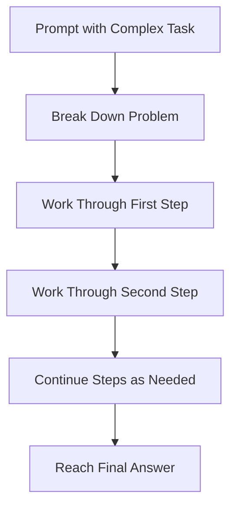
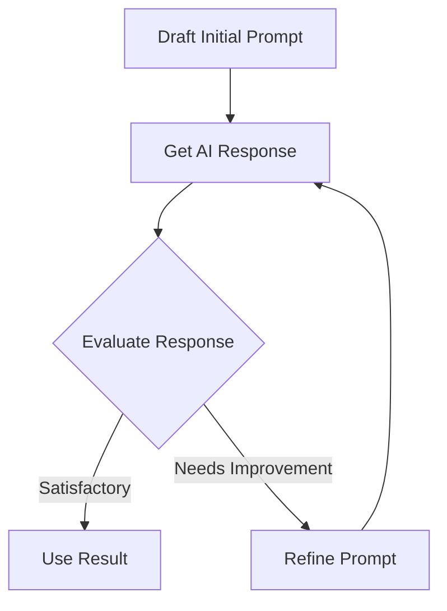

Hey there! Let's dive into prompt engineering - the art and science of communicating effectively with AI models like me. By the end of this crash course, you'll have a solid grasp of 85% of what you need to know for day-to-day prompt engineering.

## What is Prompt Engineering?

Prompt engineering is crafting inputs to AI systems to get desired outputs. Think of it as learning how to ask questions or give instructions in a way that helps the AI understand exactly what you want.

```
Basic prompt: "Write about dogs."
Engineered prompt: "Write a 200-word explanation about the intelligence of Border Collies, including two examples of problem-solving behaviors."
```

The difference in results would be dramatic - from a generic essay about dogs to specific, targeted information.

## The Fundamentals

### Clarity and Specificity

The clearer and more specific your prompt, the better the response:

```
Vague: "Give me information about climate change."
Specific: "Explain three ways individuals can reduce their carbon footprint at home, with approximate CO2 savings for each action."
```

### Desired Format and Length

Tell the AI how you want the information structured:

```
"Create a 5-point checklist for maintaining a bicycle, with each point being 1-2 sentences long."
```

### Context Setting

Provide relevant background information:

```
"I'm a high school science teacher preparing a lesson. Create a simple explanation of photosynthesis that 15-year-old students would understand."
```

## Key Techniques

### Role-Based Prompting

Ask the AI to adopt a particular perspective:

```
"As an experienced gardener, explain how to grow tomatoes in a small apartment balcony."
```

### Chain of Thought Prompting

Instruct the AI to think step-by-step:

```
"Solve this math problem step-by-step, explaining your reasoning at each stage: If a store offers a 20% discount on a $85 item, and then applies a $10 coupon, what is the final price after 8.5% sales tax?"
```

Let's visualize the Chain of Thought approach:



### Few-Shot Learning

Provide examples of what you want:

```
Prompt: "Classify these statements as either 'Fact' or 'Opinion':

Statement: The Earth orbits the Sun.
Classification: Fact

Statement: Chocolate ice cream is the best flavor.
Classification: Opinion

Statement: Water boils at 100°C at sea level.
Classification: "
```

The AI will likely respond: "Fact"

## Task-Specific Strategies

### For Creative Writing

```
"Write a short story about a lost dog finding its way home. Include:
- A dog named Max
- An unexpected helper
- A happy reunion
- Keep it under 300 words
- Use a heartwarming tone"
```

### For Data Analysis

```
"I have customer feedback data. Help me categorize these comments into 'Product Quality', 'Customer Service', or 'Website Usability' issues:

1. 'The checkout process took too many steps.'
2. 'My sweater started unraveling after two washes.'
3. 'The representative was very helpful when I called.'"
```

### For Coding Help

```
"Write a Python function that takes a list of numbers and returns the average of only the positive numbers. Include error handling and comments explaining the code."
```

## Common Pitfalls and How to Avoid Them

### Being Too Vague

❌ "Write something good about technology."
✅ "Write a 300-word blog post about how smartphone technology has changed communication in the workplace since 2010."

### Overloading with Instructions

❌ "Write an article about dogs that's funny, informative, sad, includes statistics, personal stories, training tips, breed information, and historical facts."
✅ "Write an informative article about the three most popular dog breeds, focusing on their temperament and suitable living conditions."

### Forgetting to Specify Audience

❌ "Explain quantum computing."
✅ "Explain quantum computing to a high school student with basic physics knowledge."

## Testing and Iterating

The most important skill is learning to refine your prompts:

1. Start with a basic prompt
2. Evaluate the response
3. Identify gaps or issues
4. Refine your prompt
5. Repeat until satisfied



## Advanced Strategies

### System and User Messages

Many AI systems allow you to set different types of messages:

- System message: Sets overall behavior/context
- User message: Contains specific requests

```
System: You are a helpful assistant that specializes in explaining scientific concepts using simple analogies.
User: Explain how vaccines work.
```

### Iterative Refinement

Start with a general output, then ask for improvements:

```
Step 1: "Write a short paragraph introducing machine learning."
Step 2: "Now rewrite that paragraph to make it engaging for a 12-year-old."
Step 3: "Add a simple analogy to help explain the concept."
```

## The Remaining 15% - Advanced Topics

Here's what you can explore on your own after mastering the basics:

1. **Model-Specific Optimization**: Different AI models respond differently to prompting techniques

   - Experiment with tailoring prompts to specific models

2. **Prompt Chaining and Agents**: Creating systems where outputs from one prompt become inputs to another

   - Building complex workflows with multiple prompts

3. **Retrieval-Augmented Generation (RAG)**: Combining prompts with external knowledge retrieval

   - Integrating AI with databases or search engines

4. **Multimodal Prompting**: Working with text, images, and other formats together

   - Creating prompts that reference or generate multiple types of content

5. **Prompt Security**: Addressing jailbreaking, prompt injection, and data leakage

   - Hardening your prompts against manipulation attempts

6. **Optimization Methods**: Using algorithms to automatically improve prompts

   - Techniques like prompt tuning and soft prompting

7. **Evaluation Frameworks**: Systematically measuring prompt effectiveness

   - Setting up benchmarks for your prompts

8. **State Management**: Maintaining context over long conversations
   - Techniques for handling multi-turn interactions

The beauty of prompt engineering is that once you understand the core principles, these advanced topics become much easier to explore on your own. Start experimenting, keep notes on what works, and don't be afraid to try unusual approaches - sometimes the most creative prompts yield the best results!
