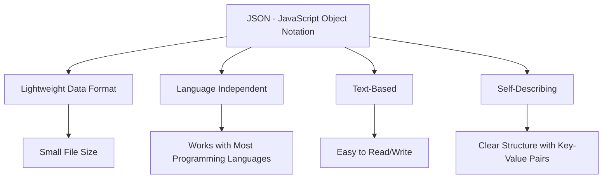
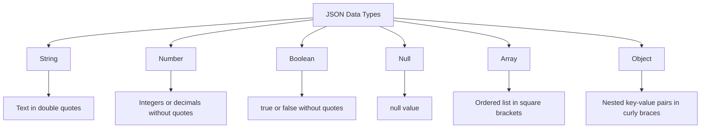
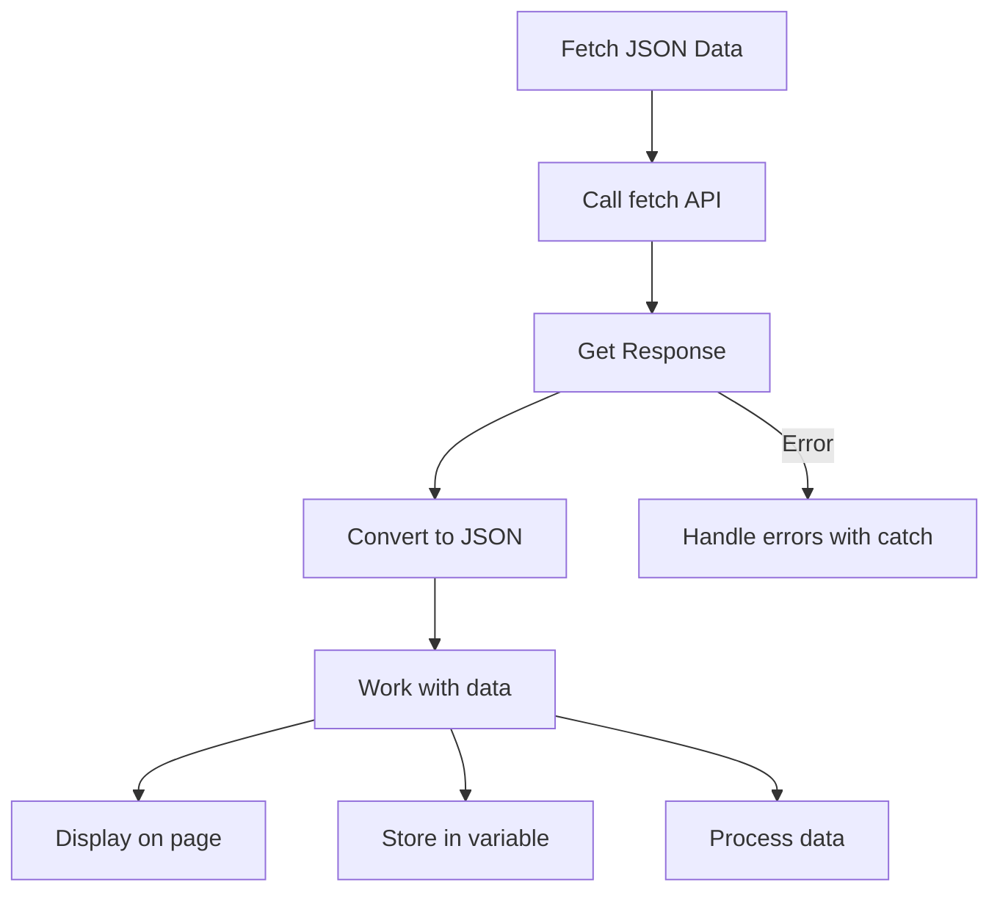
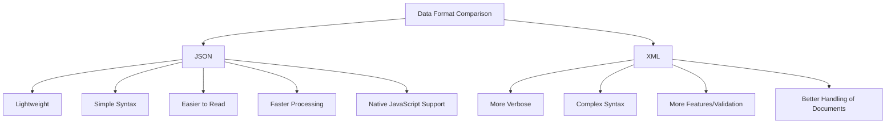

This crash course will equip you with 85% of what you'll encounter in day-to-day JSON usage, with enough foundation to explore the more advanced concepts on your own.

## What is JSON?

JSON (JavaScript Object Notation) is a lightweight data format that has become the standard for data exchange in modern web applications. Created by Douglas Crockford, it has largely replaced XML for APIs and configuration files due to its simplicity and efficiency.

**Key advantages:**

- Lightweight and minimal syntax
- Human-readable format
- Language independent (usable in virtually any programming language)
- Self-describing data structure
- Faster parsing than XML



## JSON Syntax and Structure

Now that we understand what JSON is, let's examine how it's structured and the syntax rules that govern it.

### Basic Structure

JSON data uses a simple key-value pair structure enclosed within curly braces `{}`. The format follows these rules:

- Data is stored in name/value pairs
- Keys must be in double quotes
- Values are separated from keys by colons
- Pairs are separated by commas
- Objects are enclosed in curly braces `{}`
- Arrays are enclosed in square brackets `[]`

Here's a simple JSON object:

```json
{
  "firstName": "John",
  "lastName": "Doe",
  "age": 30,
  "isStudent": false
}
```

### JSON Data Types

Within this structure, JSON supports six data types that can be used as values:

1. **String**: Text enclosed in double quotes

   ```json
   { "name": "John Doe" }
   ```

2. **Number**: Integers or floating-point numbers (no quotes)

   ```json
   { "age": 30, "height": 5.11 }
   ```

3. **Boolean**: true or false (no quotes)

   ```json
   { "isActive": true }
   ```

4. **Null**: Represents no value

   ```json
   { "spouse": null }
   ```

5. **Array**: Ordered list of values in square brackets

   ```json
   { "hobbies": ["reading", "swimming", "coding"] }
   ```

6. **Object**: Collection of key-value pairs in curly braces
   ```json
   {
     "address": {
       "street": "123 Main St",
       "city": "Boston"
     }
   }
   ```



## Common JSON Syntax Errors

With these syntax rules in mind, it's important to be aware of common mistakes that can cause your JSON to be invalid:

1. Missing or mismatched brackets/braces
2. Using single quotes instead of double quotes for keys/strings
3. Adding trailing commas after the last item in arrays/objects
4. Using comments (JSON doesn't support comments)
5. Using undefined as a value (only null is valid)
6. Unquoted property names

Understanding these potential pitfalls will help you debug JSON-related issues more effectively.

## Working with JSON in JavaScript

Since JSON is derived from JavaScript, working with it in JS is straightforward. Let's look at how to convert between JSON strings and JavaScript objects.

### Converting Between JSON and JavaScript Objects

JavaScript provides two built-in methods for working with JSON:

1. **JSON.parse()**: Converts a JSON string into a JavaScript object
2. **JSON.stringify()**: Converts a JavaScript object into a JSON string

```javascript
// Converting from JSON string to JavaScript object
const jsonString = '{"name":"John", "age":30, "city":"New York"}';
const javaScriptObject = JSON.parse(jsonString);

console.log(javaScriptObject.name); // Output: John

// Converting from JavaScript object to JSON string
const person = {
  name: 'Jane',
  age: 25,
  city: 'Boston',
};
const jsonFromObject = JSON.stringify(person);

console.log(jsonFromObject); // Output: {"name":"Jane","age":25,"city":"Boston"}
```

These conversion methods form the foundation for how we interact with JSON data in JavaScript applications.

## Fetching JSON Data

Building on our ability to parse JSON, one of the most common uses of JSON is fetching data from APIs. Here's how to do it with the Fetch API:

```javascript
// Fetching JSON data from an API
fetch('https://jsonplaceholder.typicode.com/users')
  .then((response) => {
    // Check if the response is successful
    if (!response.ok) {
      throw new Error('Network response was not ok');
    }
    return response.json(); // Parse the JSON response
  })
  .then((data) => {
    // Work with the JSON data
    console.log(data);
    displayUsers(data);
  })
  .catch((error) => {
    console.error('There was a problem with the fetch operation:', error);
  });

// Function to display users on the page
function displayUsers(users) {
  const userList = document.getElementById('user-list');

  users.forEach((user) => {
    const userItem = document.createElement('div');
    userItem.innerHTML = `
      ${user.name}
      Email: ${user.email}
      Company: ${user.company.name}
    `;
    userList.appendChild(userItem);
  });
}
```

This pattern of fetching and processing JSON data is fundamental to modern web development.



## JSON in Different Programming Languages

While we've focused on JavaScript, JSON's language independence is one of its key strengths. Here's how JSON works in other popular programming languages:

### Python

Python's built-in `json` module provides similar functionality:

```python
import json

# Parse JSON string to Python dictionary
json_string = '{"name": "John", "age": 30, "city": "New York"}'
python_dict = json.loads(json_string)
print(python_dict['name'])  # Output: John

# Convert Python dictionary to JSON string
person = {
    'name': 'Jane',
    'age': 25,
    'city': 'Boston'
}
json_from_dict = json.dumps(person, indent=2)
print(json_from_dict)
# Output:
# {
#   "name": "Jane",
#   "age": 25,
#   "city": "Boston"
# }
```

### PHP

PHP also offers straightforward JSON handling:

```php
<?php
// Parse JSON string to PHP object
$jsonString = '{"name": "John", "age": 30, "city": "New York"}';
$phpObject = json_decode($jsonString);
echo $phpObject->name;  // Output: John

// Convert to associative array instead of object
$phpArray = json_decode($jsonString, true);
echo $phpArray['name'];  // Output: John

// Convert PHP array to JSON string
$person = array(
    'name' => 'Jane',
    'age' => 25,
    'city' => 'Boston'
);
$jsonFromArray = json_encode($person);
echo $jsonFromArray;  // Output: {"name":"Jane","age":25,"city":"Boston"}
?>
```

This consistency across languages makes JSON an ideal format for data exchange between different systems and platforms.

## Complex JSON Structures

As applications become more sophisticated, so does the JSON data they use. Real-world JSON often contains nested objects and arrays. Here's an example of a more complex structure:

```json
{
  "employees": [
    {
      "firstName": "John",
      "lastName": "Doe",
      "skills": ["JavaScript", "HTML", "CSS"],
      "address": {
        "street": "123 Main St",
        "city": "Boston",
        "state": "MA",
        "zipCode": "02101"
      }
    },
    {
      "firstName": "Anna",
      "lastName": "Smith",
      "skills": ["Python", "SQL", "React"],
      "address": {
        "street": "456 Park Ave",
        "city": "New York",
        "state": "NY",
        "zipCode": "10022"
      }
    }
  ],
  "company": {
    "name": "Tech Solutions Inc.",
    "founded": 2005,
    "active": true
  }
}
```

To access nested data, use dot notation or bracket notation:

```javascript
// Accessing nested JSON data
const data = JSON.parse(complexJsonString);

// Get the first employee's first name
console.log(data.employees[0].firstName); // Output: John

// Get the second employee's skills
console.log(data.employees[1].skills); // Output: ["Python", "SQL", "React"]

// Get the company name
console.log(data.company.name); // Output: Tech Solutions Inc.
```

Understanding how to navigate these nested structures is essential for working with real-world APIs and data.

## JSON vs. XML

Before JSON became widespread, XML was the dominant format for data exchange. Understanding the differences helps explain why JSON has become so popular:



| Feature           | JSON                                       | XML                                           |
| ----------------- | ------------------------------------------ | --------------------------------------------- |
| Syntax            | Lightweight, easy to read                  | More verbose with opening/closing tags        |
| Data Types        | Native support for numbers, booleans, null | Everything is text (requires type conversion) |
| Learning Curve    | Easy to learn and use                      | Steeper learning curve                        |
| Parsing Speed     | Faster to parse                            | Slower parsing                                |
| Human Readability | Very readable                              | Less readable with complex structures         |
| Language Support  | Universal support                          | Universal support                             |

This comparison highlights why JSON has become the preferred choice for most modern web applications, especially those requiring frequent data exchange.

## Best Practices for JSON

Now that you understand how JSON works, let's explore some best practices to create effective and maintainable JSON:

1. **Use clear, descriptive key names**

   - Prefer camelCase for keys
   - Avoid spaces and special characters

2. **Structure data logically**

   - Group related data in nested objects
   - Use arrays for collections of similar items

3. **Keep it minimal**

   - Only include necessary data
   - Remove redundant information

4. **Validate your JSON**

   - Use tools like JSONLint to validate syntax
   - Consider JSON Schema for validating structure

5. **Handle errors gracefully**
   - Always use try/catch when parsing JSON
   - Provide meaningful error messages

Following these practices will help you avoid common pitfalls and create more robust applications.

## Getting Started with JSON

Implementing what you've learned is straightforward. To start working with JSON, you don't need any special tools or installations:

1. Use a text editor (VS Code, Sublime Text, etc.) to create and edit JSON files (use .json extension)
2. For testing and validation, use online tools like [JSONLint](https://jsonlint.com/)
3. To interact with JSON in your projects, you only need to know how to use the appropriate methods in your programming language (like JSON.parse() in JavaScript)

This minimal setup requirement is another reason for JSON's widespread adoption.

## The Remaining 15%: Advanced JSON Topics

While this crash course covers the essentials, there are some advanced topics you may need as your JSON usage becomes more sophisticated:

1. **JSON Schema**

   - Define the structure and validation rules for JSON data
   - Enforce data types and required fields
   - Documentation: https://json-schema.org/

2. **JSON-LD (Linked Data)**

   - Add semantic context to JSON data
   - Used for SEO and structured data
   - Resources: https://json-ld.org/

3. **JSON Web Tokens (JWT)**

   - Secure method for transmitting information
   - Used for authentication and authorization
   - Learn more: https://jwt.io/

4. **JSON Patch**

   - Format for describing changes to JSON documents
   - Apply partial updates efficiently
   - RFC 6902: https://datatracker.ietf.org/doc/html/rfc6902

5. **Advanced Techniques**
   - Custom JSON serialization
   - Stream parsing for large files
   - Compression techniques for large JSON data
   - Performance optimization for large JSON datasets
   - Working with binary JSON formats like BSON and MessagePack

With the foundation you've built in this crash course, exploring these advanced topics will be much more manageable when you need them.

## Summary

This crash course has equipped you with the essential knowledge needed for day-to-day JSON usage, including:

- Understanding JSON's structure and syntax
- Working with different data types in JSON
- Converting between JSON and programming language objects
- Fetching and processing JSON data from APIs
- Working with complex, nested JSON structures
- Best practices for creating and handling JSON

JSON's simplicity, readability, and universal language support have made it the de facto standard for data interchange in modern applications. With the knowledge from this crash course, you're now prepared to handle most JSON tasks you'll encounter, with a solid foundation to explore more advanced topics as your needs evolve.
