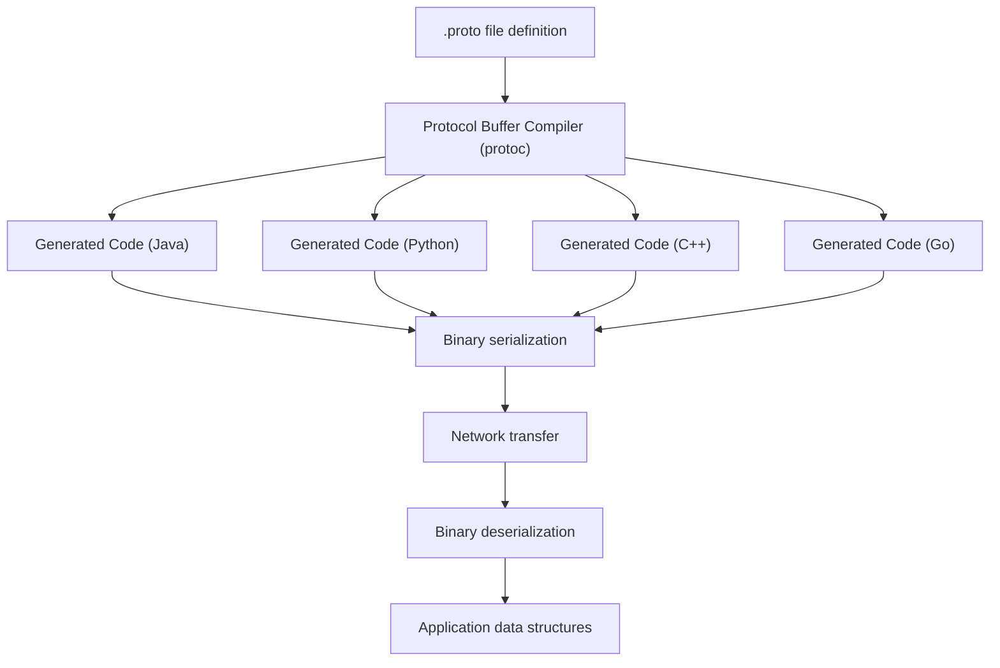
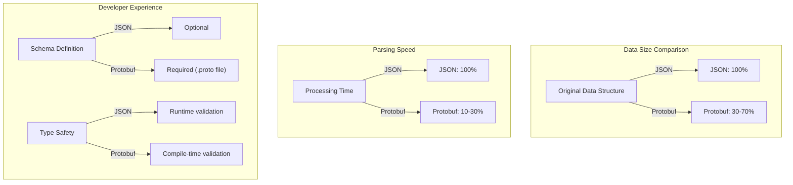
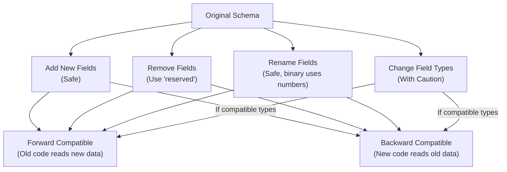

## Introduction

Protocol Buffers (Protobuf) is Google's language-neutral, platform-neutral, extensible mechanism for serializing structured data. Think of it as a more efficient alternative to JSON or XML that offers better performance, smaller size, and stronger typing.

This crash course covers the 85% of Protocol Buffers you'll use daily, with enough foundation to explore the remaining 15% on your own.

## What Are Protocol Buffers?

Protocol Buffers serialize structured data into a compact binary format. Unlike text-based formats like JSON or XML, Protobuf offers:

- **Smaller size**: 3-10x smaller than JSON
- **Faster parsing**: Significantly quicker serialization/deserialization
- **Strongly typed**: Schema definition ensures data integrity
- **Cross-language compatibility**: Generate code for multiple languages from one definition
- **Built-in versioning**: Backward and forward compatibility

These advantages make Protocol Buffers particularly valuable for applications where efficiency matters, such as high-performance APIs, microservices, and data storage systems.

## How Protocol Buffers Work

At its core, Protocol Buffers follow a straightforward workflow: define your data structure in a `.proto` file, compile it with the Protocol Buffer compiler, and use the generated code to serialize and deserialize your data.



This compiler-based approach ensures type safety while enabling cross-language compatibility, as the same `.proto` file can generate code for multiple programming languages.

## Installation and Setup

Before you can start using Protocol Buffers, you'll need to install the compiler and language-specific libraries.

### Installing `protoc` Compiler

1. Download the appropriate package from [Protocol Buffers GitHub releases](https://github.com/protocolbuffers/protobuf/releases)
2. Extract the contents and add the binary to your PATH
3. Verify installation:

```bash
protoc --version
# Should output something like: libprotoc 3.21.12
```

### Installing Language-Specific Plugins

Once you have the compiler installed, you'll need the language-specific runtime libraries:

For Python:

```bash
pip install protobuf
```

For JavaScript:

```bash
npm install google-protobuf
```

For Go:

```bash
go install google.golang.org/protobuf/cmd/protoc-gen-go@latest
```

With these tools in place, you're ready to define your first Protocol Buffer message.

## Defining Messages in .proto Files

Protocol Buffer definitions are stored in `.proto` files, which define the structure of your data. These definition files are the foundation of your Protocol Buffer implementation.

### Basic Syntax Example

```protobuf
// person.proto
syntax = "proto3";  // Always specify proto3 for new projects

package tutorial;  // Helps avoid naming conflicts

// A message definition - like a class or struct
message Person {
  string name = 1;       // Field with tag number 1
  int32 id = 2;          // Field with tag number 2
  string email = 3;      // Field with tag number 3

  enum PhoneType {       // Nested enum definition
    MOBILE = 0;          // First enum value must be zero
    HOME = 1;
    WORK = 2;
  }

  message PhoneNumber {  // Nested message definition
    string number = 1;
    PhoneType type = 2;  // Using the enum we defined
  }

  repeated PhoneNumber phones = 4;  // Array/list of PhoneNumbers
}
```

### Key Components of a .proto File

1. **Field Numbers**: Each field has a unique number (tag) used in the binary format. Once assigned, these should never change as they identify your fields in the serialized data.

2. **Data Types**: Protocol Buffers support a variety of data types to handle different kinds of information:

   - Basic types: `int32`, `int64`, `uint32`, `uint64`, `float`, `double`, `bool`, `string`, `bytes`
   - Enum: For predefined sets of values
   - Other messages: For nested structures

3. **Field Rules**:
   - Singular: Default in proto3, can have zero or one instance
   - Repeated: Like an array or list, can have zero or more instances

With your message definitions in place, the next step is to compile them into usable code.

## Compiling and Using Protocol Buffers

The Protocol Buffer compiler transforms your `.proto` files into language-specific code that you can use in your applications.

### Compiling Your .proto Files

Use the `protoc` compiler to generate code in your target language:

```bash
# General format:
protoc --proto_path=IMPORT_PATH --LANG_out=OUTPUT_DIR path/to/file.proto

# Example for generating Python code:
protoc --proto_path=. --python_out=. person.proto

# Example for multiple languages:
protoc --proto_path=. \
       --python_out=./python \
       --java_out=./java \
       --js_out=./javascript \
       person.proto
```

### Using Generated Code

After compilation, you'll have language-specific code that handles serialization and deserialization. While the exact API varies by language, the general approach remains consistent:

#### Python Example

```python
# Import the generated code
import person_pb2

# Create a new person message
person = person_pb2.Person()
person.name = "Alice Smith"
person.id = 12345
person.email = "alice@example.com"

# Add a phone number
phone = person.phones.add()  # Creates and adds a new PhoneNumber
phone.number = "555-1234"
phone.type = person_pb2.Person.PhoneType.MOBILE  # Using enum

# Serialize to binary string
binary_data = person.SerializeToString()
print(f"Binary size: {len(binary_data)} bytes")  # Much smaller than JSON!

# Parse from binary
parsed_person = person_pb2.Person()
parsed_person.ParseFromString(binary_data)
print(f"Parsed name: {parsed_person.name}")  # Alice Smith
print(f"Parsed ID: {parsed_person.id}")      # 12345
print(f"Parsed email: {parsed_person.email}") # alice@example.com
```

#### JavaScript Example

```javascript
// Require the generated code
const pb = require('./person_pb.js');

// Create a new person message
const person = new pb.Person();
person.setName('Bob Johnson');
person.setId(98765);
person.setEmail('bob@example.com');

// Add a phone number
const phone = new pb.Person.PhoneNumber();
phone.setNumber('555-6789');
phone.setType(pb.Person.PhoneType.HOME);
person.addPhones(phone);

// Serialize to binary
const binaryData = person.serializeBinary();
console.log(`Binary size: ${binaryData.length} bytes`);

// Parse from binary
const parsedPerson = pb.Person.deserializeBinary(binaryData);
console.log(`Parsed name: ${parsedPerson.getName()}`); // Bob Johnson
console.log(`Parsed ID: ${parsedPerson.getId()}`); // 98765
```

These examples demonstrate how Protocol Buffers provide a consistent approach to data serialization across different programming languages.

## JSON vs Protocol Buffers Comparison

To understand why Protocol Buffers are often preferred over JSON for certain applications, let's compare their key characteristics:



This comparison highlights the trade-offs between the two formats. Protocol Buffers excel in performance and type safety, while JSON offers simplicity and human readability. Your choice depends on your specific requirements and constraints.

## Practical Example: User Profile Service

Now that we understand the basics, let's build a complete example for a user profile service to see Protocol Buffers in action:

### 1. Define the .proto File

First, we'll define our data structures in a `.proto` file:

```protobuf
// user_profile.proto
syntax = "proto3";

package userservice;

// User profile information
message User {
  int32 id = 1;
  string username = 2;
  string full_name = 3;
  string email = 4;
  uint64 created_timestamp = 5;  // Unix timestamp

  enum Status {
    ACTIVE = 0;
    INACTIVE = 1;
    BANNED = 2;
  }

  Status status = 6;

  message Address {
    string street = 1;
    string city = 2;
    string state = 3;
    string zip_code = 4;
    string country = 5;
  }

  repeated Address addresses = 7;
  map<string, string> preferences = 8;  // Key-value user preferences
}

// List of users response
message UserList {
  repeated User users = 1;
  int32 total_count = 2;
  int32 page = 3;
  int32 page_size = 4;
}
```

### 2. Compile the .proto File

Next, we'll generate the Python code from our definition:

```bash
protoc --proto_path=. --python_out=. user_profile.proto
```

### 3. Use the Generated Code (Python)

Finally, we'll use the generated code to create, serialize, and deserialize our user profiles:

```python
import user_profile_pb2
import time

# Create a few users
def create_sample_users():
    # First user
    user1 = user_profile_pb2.User()
    user1.id = 1001
    user1.username = "jsmith"
    user1.full_name = "John Smith"
    user1.email = "john.smith@example.com"
    user1.created_timestamp = int(time.time())
    user1.status = user_profile_pb2.User.Status.ACTIVE

    # Add an address
    address1 = user1.addresses.add()
    address1.street = "123 Main St"
    address1.city = "Anytown"
    address1.state = "CA"
    address1.zip_code = "12345"
    address1.country = "USA"

    # Add preferences
    user1.preferences["theme"] = "dark"
    user1.preferences["language"] = "en"

    # Second user
    user2 = user_profile_pb2.User()
    user2.id = 1002
    user2.username = "mjones"
    user2.full_name = "Mary Jones"
    user2.email = "mary.jones@example.com"
    user2.created_timestamp = int(time.time()) - 86400  # One day ago
    user2.status = user_profile_pb2.User.Status.ACTIVE

    return [user1, user2]

# Create a list of users
def create_user_list(users):
    user_list = user_profile_pb2.UserList()
    user_list.total_count = len(users)
    user_list.page = 1
    user_list.page_size = 10

    for user in users:
        user_list.users.append(user)

    return user_list

# Main execution
users = create_sample_users()
user_list = create_user_list(users)

# Serialize to binary
binary_data = user_list.SerializeToString()
print(f"Binary size: {len(binary_data)} bytes")

# Deserialize from binary
parsed_list = user_profile_pb2.UserList()
parsed_list.ParseFromString(binary_data)

# Print the results
print(f"Total users: {parsed_list.total_count}")
for idx, user in enumerate(parsed_list.users):
    print(f"\nUser {idx+1}:")
    print(f"  ID: {user.id}")
    print(f"  Username: {user.username}")
    print(f"  Full Name: {user.full_name}")
    print(f"  Email: {user.email}")
    print(f"  Status: {user_profile_pb2.User.Status.Name(user.status)}")

    for i, addr in enumerate(user.addresses):
        print(f"  Address {i+1}: {addr.street}, {addr.city}, {addr.state} {addr.zip_code}, {addr.country}")

    print("  Preferences:")
    for key, value in user.preferences.items():
        print(f"    {key}: {value}")
```

This example demonstrates how Protocol Buffers handle complex nested structures, enumerations, and collections in a type-safe manner.

## Schema Evolution and Compatibility

One of the most powerful features of Protocol Buffers is their built-in support for evolving your data schema over time. As your application grows and changes, you'll need to modify your data structures, and Protocol Buffers make this process much smoother.

### Versioning and Compatibility Rules

When updating your Protocol Buffer schemas, follow these guidelines to maintain compatibility:

1. **Never change field numbers** - They identify fields in the binary format
2. **New fields can be added safely** - Old code will ignore them
3. **Fields can be removed, but reserve their numbers** - Prevents future conflicts
4. **Field types can be changed with caution** - Follow wire compatibility rules

This approach to schema evolution ensures both forward compatibility (old code can read new data) and backward compatibility (new code can read old data).



### Example of Schema Evolution

Here's how you might evolve a Protocol Buffer schema over time:

```protobuf
// Original version (v1)
message User {
  int32 id = 1;
  string name = 2;
  string email = 3;
}

// Updated version (v2)
message User {
  int32 id = 1;
  string name = 2;
  string email = 3;
  string phone_number = 4;    // New field - safe to add
  repeated string tags = 5;   // New field - safe to add
  // reserved 6, 8 to 10;     // Reserve numbers for removed fields
  // reserved "address";      // Reserve field names
}
```

This approach to schema evolution makes Protocol Buffers particularly well-suited for long-lived systems where data structures evolve over time.

## Best Practices

Based on industry experience, here are some best practices to follow when working with Protocol Buffers:

1. **Plan for evolution**: Design messages with future changes in mind, leaving room for expansion
2. **Choose field numbers wisely**: Lower numbers (1-15) use less space in the binary format
3. **Use appropriate types**: For example, use `int32` for most integers, but `sint32` for negative numbers
4. **Document your messages**: Add comments to explain the purpose and usage of each field
5. **Reuse message definitions**: Create common definitions for structures shared across multiple services
6. **Test compatibility**: Verify old code can read new messages and vice versa when making changes

Following these best practices will help you avoid common pitfalls and ensure your Protocol Buffer implementations remain maintainable and efficient.

## The Remaining 15%: Advanced Topics

While this crash course covers the core functionality of Protocol Buffers, there are several advanced topics you can explore as your needs grow more sophisticated:

1. **Well-Known Types**: Pre-defined message types for common concepts like timestamps and durations
2. **Custom Options**: Extending the protocol buffer language with metadata annotations
3. **Any Type**: For storing arbitrary message types without their .proto definitions
4. **Reflection**: Manipulating messages without compile-time knowledge of their type
5. **Performance Optimization**: Advanced techniques for maximizing throughput and minimizing latency
6. **Wire Format Details**: Understanding the binary encoding at a low level for debugging and optimization
7. **Advanced gRPC Integration**: Using Protocol Buffers with gRPC for efficient remote procedure calls
8. **Advanced Validation**: Adding custom validation beyond type checking for business logic enforcement
9. **Complex Maps and Oneofs**: For more sophisticated data structures with mutually exclusive fields
10. **Protocol Buffer Editions**: The newest evolution of the Protocol Buffer language with enhanced features

These advanced topics represent the cutting edge of Protocol Buffer usage and will help you solve specialized problems as you gain more experience.

## Conclusion

Protocol Buffers provide an efficient, language-neutral way to serialize structured data. They offer significant advantages over text-based formats like JSON and XML, particularly for applications where performance, data size, and type safety are critical considerations.

This crash course has equipped you with the essential knowledge needed to implement Protocol Buffers in your projects, covering the 85% of functionality you'll use on a daily basis. You've learned how to define messages, compile .proto files, use the generated code, and evolve your schemas over time.

As you become more comfortable with Protocol Buffers, explore the advanced topics to unlock the full potential of this powerful serialization format. With Protocol Buffers in your toolkit, you're well-prepared to build high-performance, cross-language applications with efficient data interchange.
