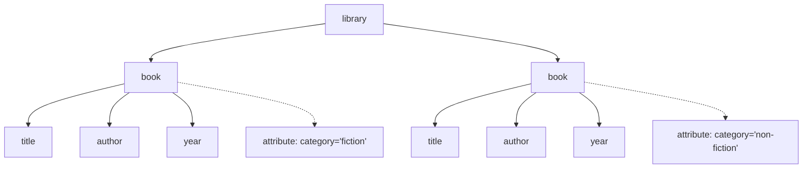
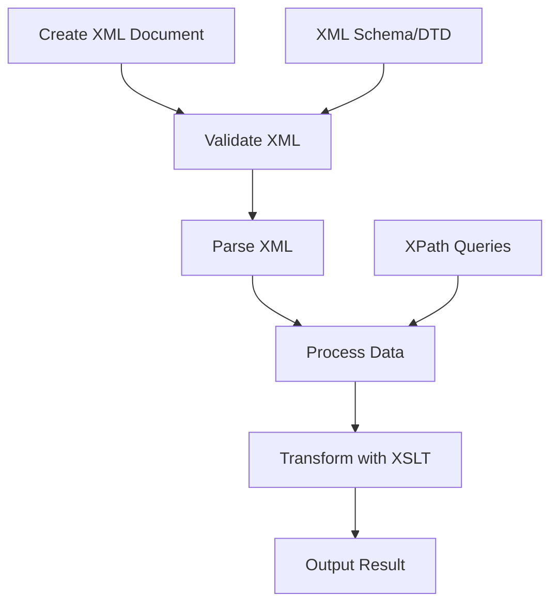

Hey there! Ready to dive into the world of XML? It's one of those technologies that has been around for decades but still plays a crucial role in many systems. Let's break it down in a way that covers most of what you'll encounter, while giving you the tools to explore the rest.

## What is XML and Why Should You Care?

XML (eXtensible Markup Language) is essentially a way to store and transport data in a format that both humans and machines can read. Think of it as a flexible container for structured information.

Unlike HTML (which is for displaying data), XML is for describing and organizing data. It doesn't do anything on its own - it just holds information in a structured way that other programs can use.

```xml
<?xml version="1.0" encoding="UTF-8"?>
<note>
  <to>You</to>
  <from>Me</from>
  <heading>XML Crash Course</heading>
  <body>This is what XML looks like!</body>
</note>
```

## The Basic Building Blocks

### Elements: The Heart of XML

Elements are the building blocks of XML, consisting of:

- A start tag: `<tagname>`
- The content: Text or other elements
- An end tag: `</tagname>`

Elements can be nested inside other elements, creating a hierarchical tree structure:

```xml
<library>
  <book category="fiction">
    <title>The Great Gatsby</title>
    <author>F. Scott Fitzgerald</author>
    <year>1925</year>
  </book>
  <book category="non-fiction">
    <title>In Cold Blood</title>
    <author>Truman Capote</author>
    <year>1966</year>
  </book>
</library>
```

Let's visualize this structure:



### Attributes: Extra Information

Attributes provide additional information about elements and are always placed in the opening tag:

```xml
<person id="123" status="active">
  <name>Jane Doe</name>
  <age>32</age>
</person>
```

Here, `id` and `status` are attributes of the `person` element.

### XML Declaration

The XML declaration specifies the XML version and the encoding used:

```xml
<?xml version="1.0" encoding="UTF-8"?>
```

This should be the first line of your XML document. While optional, it's a good practice to include it.

### Comments and CDATA

Comments work similarly to HTML:

```xml
<!-- This is a comment in XML -->
```

For text that shouldn't be parsed as markup (like code snippets), use CDATA sections:

```xml
<script>
<![CDATA[
  function sayHello() {
    alert("Hello, world! <test>");  // The "<test>" won't be treated as XML
  }
]]>
</script>
```

## XML Rules: Well-formed vs. Valid XML

### Well-formed XML

For XML to be "well-formed" (syntactically correct), it must follow these rules:

1. Every opening tag must have a closing tag
2. Tags must be properly nested
3. XML is case-sensitive (`<Person>` and `<person>` are different elements)
4. All attributes must have quotes around their values
5. There must be exactly one root element

### Valid XML

"Valid" XML follows all well-formed rules AND conforms to a specific structure defined in a DTD (Document Type Definition) or XML Schema:

```xml
<!DOCTYPE note SYSTEM "note.dtd">
<note>
  <to>You</to>
  <from>Me</from>
  <heading>Reminder</heading>
  <body>Don't forget our meeting!</body>
</note>
```

## XML Namespaces

Namespaces help avoid name conflicts when combining XML from different sources:

```xml
<h:html xmlns:h="http://www.w3.org/TR/html4/">
  <h:head>
    <h:title>Using namespaces</h:title>
  </h:head>
  <h:body>
    <h:p>This paragraph uses the HTML namespace.</h:p>
  </h:body>
</h:html>
```

Here, the `xmlns:h` attribute defines a namespace prefix `h` that's used throughout the document.

## Working with XML in Programming Languages

Let's look at how to parse XML in a few common languages:

### JavaScript

```javascript
// Parsing XML from a string
const parser = new DOMParser();
const xmlDoc = parser.parseFromString(xmlString, 'text/xml');

// Accessing elements
const books = xmlDoc.getElementsByTagName('book');
for (let i = 0; i < books.length; i++) {
  const title = books[i].getElementsByTagName('title')[0].textContent;
  console.log(title); // Outputs: "The Great Gatsby", then "In Cold Blood"
}
```

### Python

```python
import xml.etree.ElementTree as ET

# Parse from a file
tree = ET.parse('library.xml')
root = tree.getroot()

# Find all book titles
for book in root.findall('./book'):
    title = book.find('title').text
    print(title)  # Outputs: "The Great Gatsby", then "In Cold Blood"

# Get attribute values
for book in root.findall('./book'):
    category = book.get('category')
    print(f"Category: {category}")  # Outputs: "Category: fiction", then "Category: non-fiction"
```

### Java

```java
import javax.xml.parsers.DocumentBuilderFactory;
import javax.xml.parsers.DocumentBuilder;
import org.w3c.dom.Document;
import org.w3c.dom.NodeList;
import org.w3c.dom.Node;
import org.w3c.dom.Element;
import java.io.File;

public class XMLParser {
    public static void main(String[] args) {
        try {
            File xmlFile = new File("library.xml");
            DocumentBuilderFactory dbFactory = DocumentBuilderFactory.newInstance();
            DocumentBuilder dBuilder = dbFactory.newDocumentBuilder();
            Document doc = dBuilder.parse(xmlFile);

            doc.getDocumentElement().normalize();

            NodeList bookList = doc.getElementsByTagName("book");

            for (int i = 0; i < bookList.getLength(); i++) {
                Node bookNode = bookList.item(i);

                if (bookNode.getNodeType() == Node.ELEMENT_NODE) {
                    Element bookElement = (Element) bookNode;
                    String category = bookElement.getAttribute("category");
                    String title = bookElement.getElementsByTagName("title").item(0).getTextContent();

                    System.out.println("Book: " + title + ", Category: " + category);
                }
            }
        } catch (Exception e) {
            e.printStackTrace();
        }
    }
}
```

## XML Querying with XPath

XPath is a powerful language for finding information in an XML document:

```javascript
// JavaScript example
const xmlDoc = parser.parseFromString(xmlString, 'text/xml');
const result = xmlDoc.evaluate(
  "//book[@category='fiction']/title",
  xmlDoc,
  null,
  XPathResult.STRING_TYPE,
  null,
);
console.log(result.stringValue); // Outputs: "The Great Gatsby"
```

Common XPath expressions:

- `/library/book` - All book elements that are children of library
- `//title` - All title elements anywhere in the document
- `//book[@category="fiction"]` - All book elements with category="fiction"
- `//book[year>1950]/title` - Titles of books published after 1950

## XML Transformation with XSLT

XSLT transforms XML into other formats (like HTML, PDF, or different XML):

```xml
<?xml version="1.0" encoding="UTF-8"?>
<xsl:stylesheet version="1.0" xmlns:xsl="http://www.w3.org/1999/XSL/Transform">
  <xsl:template match="/">
    <html>
      <body>
        <h2>My Library</h2>
        <table border="1">
          <tr>
            <th>Title</th>
            <th>Author</th>
            <th>Year</th>
          </tr>
          <xsl:for-each select="library/book">
            <tr>
              <td><xsl:value-of select="title"/></td>
              <td><xsl:value-of select="author"/></td>
              <td><xsl:value-of select="year"/></td>
            </tr>
          </xsl:for-each>
        </table>
      </body>
    </html>
  </xsl:template>
</xsl:stylesheet>
```

## Real-world XML Applications

Let's look at some common places you'll encounter XML:

### Configuration Files

Many applications use XML for configuration:

```xml
<?xml version="1.0" encoding="UTF-8"?>
<configuration>
  <database>
    <host>localhost</host>
    <port>5432</port>
    <username>admin</username>
    <password>secret</password>
  </database>
  <logging>
    <level>INFO</level>
    <file>app.log</file>
  </logging>
</configuration>
```

### Web Services (SOAP)

SOAP APIs use XML for communication:

```xml
<?xml version="1.0"?>
<soap:Envelope xmlns:soap="http://www.w3.org/2003/05/soap-envelope">
  <soap:Header>
    <m:Auth xmlns:m="http://example.org/auth">
      <m:Token>ABC123</m:Token>
    </m:Auth>
  </soap:Header>
  <soap:Body>
    <m:GetStockPrice xmlns:m="http://example.org/stock">
      <m:StockName>MSFT</m:StockName>
    </m:GetStockPrice>
  </soap:Body>
</soap:Envelope>
```

### RSS Feeds

RSS uses XML to syndicate content:

```xml
<?xml version="1.0" encoding="UTF-8"?>
<rss version="2.0">
  <channel>
    <title>Blog Title</title>
    <link>https://example.com</link>
    <description>Blog Description</description>
    <item>
      <title>Article Title</title>
      <link>https://example.com/article1</link>
      <description>Article summary goes here</description>
      <pubDate>Mon, 23 May 2022 09:00:00 GMT</pubDate>
    </item>
    <!-- More items... -->
  </channel>
</rss>
```

## XML Processing Flow

Let's visualize the typical XML processing flow:



## The Last 15%: What We Haven't Covered

Here's what you might want to explore next:

1. **XML Databases**: Systems like BaseX or eXist-DB that store data natively in XML format
2. **Advanced XSLT**: Complex transformations, XSLT 2.0/3.0 features, and functional programming aspects
3. **XQuery**: A powerful query language specifically designed for XML data
4. **XML Security**: Digital signatures, encryption, and secure processing
5. **XML in Enterprise Systems**: How XML is used in large-scale business applications
6. **Industry-specific XML Standards**: Standards like DITA (technical documentation), SVG (graphics), MathML (mathematical notation)
7. **Performance Optimization**: Techniques for working with large XML documents efficiently
8. **XML Alternatives**: When to use JSON, YAML, or other formats instead of XML
9. **XML Schema Advanced Features**: Complex types, inheritance, and patterns
10. **XML Streaming APIs**: Processing very large XML documents with limited memory

## Getting Started: Tools You'll Need

To follow along and practice with XML, you'll need:

1. **A Text Editor**: Any code editor like VS Code, Sublime Text, or even Notepad++ will work
2. **XML Validator**: Online tools like [xmlvalidation.com](https://www.xmlvalidation.com) or built-in validators in your IDE
3. **Browser**: Modern browsers can display XML and apply XSLT
4. **Programming Language**: Choose from JavaScript, Python, Java, or others depending on your preference

Just create an XML file with the `.xml` extension and start experimenting with the examples we've covered!

And that's it! You now know about 85% of what you'll encounter with XML in daily use. The fundamentals are solid, and you have a roadmap for exploring the rest. Any specific part you'd like to dive deeper into?
