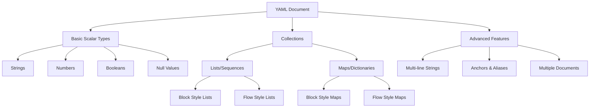

## Introduction to YAML

YAML (YAML Ain't Markup Language) is a human-readable data serialization language designed for configuration files and data exchange between languages with different data structures. Initially created as an alternative to more complex formats, YAML has become the standard for configuration in modern DevOps tools like Kubernetes, Docker, Ansible, and CI/CD pipelines.

**Key Features:**

- Human-readable with minimal syntax
- Uses indentation for structure (similar to Python)
- Supports complex data structures
- Works with most programming languages
- Superset of JSON (any valid JSON is valid YAML)

Before diving into the specifics, it's worth noting that YAML's popularity stems from its simplicity and readability, making it accessible even to those new to programming concepts.

## Prerequisites

Getting started with YAML requires minimal setup. You'll need:

- A text editor (VS Code, Sublime Text, Notepad++, etc.)
- Basic understanding of key-value pairs and data structures
- YAML validator (optional but recommended): [YAMLlint](http://www.yamllint.com)

With these tools in hand, you're ready to explore YAML's core concepts.

## YAML Syntax Fundamentals

At its core, YAML is all about representing data in a structured way. Let's start with the fundamental building blocks.

### Indentation and Structure

YAML uses indentation to define the structure, similar to Python. The golden rule that will save you countless headaches: **always use spaces, never tabs**.

```yaml
# This is how YAML structures data
parent:
  child1: value1
  child2: value2
  nested_child:
    grandchild: value3
```

This hierarchical structure is intuitive, representing parent-child relationships through indentation levels.

### Comments

Adding context to your YAML is easy with comments, which start with a hash symbol (#):

```yaml
# This is a comment
key: value # This is an inline comment
```

Comments are particularly valuable when creating configuration files that others will need to understand or maintain.

## Basic Data Types

Now that we understand YAML's structure, let's explore the data types it supports, starting with the most common ones.

### Strings

Strings in YAML are flexible and can be represented in several ways:

```yaml
# Strings can be quoted or unquoted
unquoted: This is a simple string
quoted: 'This is a quoted string'
single_quoted: "Use single quotes for 'escaping' quotes"

# Multiline strings
literal_block: |
  This is a multiline string.
  Each line break is preserved.
  Indentation is stripped but preserved relatively.

folded_style: >
  This is also multiline but
  line breaks become spaces.

  Blank lines still create paragraphs.
```

The multiline string options are particularly useful for configuration files where formatting matters.

### Numbers

YAML automatically recognizes various number formats:

```yaml
integer: 42
float: 3.14159
scientific: 1e+12
hexadecimal: 0x123 # equals 291
octal: 0123 # equals 83
```

No special syntax is needed – YAML will interpret these values as the appropriate number type.

### Booleans

Boolean values in YAML are versatile, with multiple representations:

```yaml
# Boolean values (all these are valid forms)
true_values: [true, True, TRUE, yes, Yes, YES]
false_values: [false, False, FALSE, no, No, NO]

# To use words like "yes" as strings, quote them
actual_string: 'yes' # This is a string, not a boolean
```

This flexibility can be convenient but also requires caution to ensure values are interpreted as intended.

### Null Values

When you need to represent the absence of a value, YAML offers multiple options:

```yaml
nothing: null # Can also use ~, Null, or NULL
empty_field: # This is also null
```

## Collections

Building on our understanding of basic data types, we can now explore how YAML organizes data into collections.

### Lists (Sequences)

Lists allow you to group related items in a sequence:

```yaml
# Block style (most common)
fruits:
  - apple
  - banana
  - cherry

# Flow style (JSON-like)
vegetables: [carrot, celery, broccoli]

# Nested lists
shopping_list:
  - dairy:
      - milk
      - cheese
  - produce:
      - apples
      - oranges
```

The block style is more readable for longer lists, while the flow style is compact for simple lists.

### Dictionaries (Maps)

Dictionaries create key-value pairs for structured data:

```yaml
# Block style
person:
  name: John Doe
  age: 30
  profession: Developer

# Flow style (JSON-like)
address: { street: '123 Main St', city: 'Anytown', zip: 12345 }

# Nested dictionaries
employee:
  personal:
    name: Jane Smith
    age: 28
  professional:
    title: Engineer
    department: IT
```

Dictionaries form the backbone of most YAML documents, organizing data into logical structures.

## Complex Structures

With a firm grasp of basic collections, we can now combine them to create more complex structures that represent real-world scenarios.

```yaml
# A more complex example combining maps and lists
server_config:
  environment: production
  databases:
    - name: users
      type: postgres
      settings:
        host: db.example.com
        port: 5432
        credentials:
          username: admin
          password: s3cr3t
    - name: logs
      type: mongodb
      settings:
        host: logs.example.com
        port: 27017
  features:
    authentication: true
    monitoring: true
    rate_limiting:
      enabled: true
      requests_per_minute: 100
```

This example demonstrates how YAML can represent complex configurations with nested relationships, making it ideal for detailed system specifications.

## Anchors and Aliases

As configurations grow, duplication becomes a concern. YAML addresses this with a powerful feature: anchors and aliases.

```yaml
# Define defaults with an anchor
defaults: &defaults
  timeout: 30
  retry: 3
  logging: true

# Reference the anchor in different configurations
development:
  <<: *defaults # Merge the defaults
  environment: development
  debug: true

production:
  <<: *defaults # Same defaults
  environment: production
  debug: false
```

This DRY (Don't Repeat Yourself) approach ensures consistency and reduces maintenance effort when values need to change.

## Multiple Documents

For more complex use cases, YAML allows multiple documents within a single file:

```yaml
---
# First document
document: 1
content: Document one
---
# Second document
document: 2
content: Document two
... # Optional document end marker
```

This feature is particularly useful for defining related but separate configurations, such as multiple deployments in Kubernetes.

## Common Use Cases

Let's explore how these concepts apply to real-world scenarios that you're likely to encounter.

### Configuration Files

Application settings are often stored in YAML:

```yaml
# Application configuration
app:
  name: MyWebApp
  version: 1.0.0
  settings:
    theme: dark
    cache: true
    timeout: 30
```

The hierarchical structure makes complex configurations easy to read and modify.

### Docker Compose

Container orchestration with Docker Compose relies heavily on YAML:

```yaml
# docker-compose.yml
version: '3'
services:
  web:
    image: nginx:latest
    ports:
      - '80:80'
    volumes:
      - ./html:/usr/share/nginx/html
  database:
    image: postgres:13
    environment:
      POSTGRES_PASSWORD: example
```

This approach allows developers to define multi-container applications in a single file.

### Kubernetes

Kubernetes, the container orchestration platform, uses YAML for defining resources:

```yaml
# Simple Kubernetes Deployment
apiVersion: apps/v1
kind: Deployment
metadata:
  name: nginx-deployment
spec:
  replicas: 3
  selector:
    matchLabels:
      app: nginx
  template:
    metadata:
      labels:
        app: nginx
    spec:
      containers:
        - name: nginx
          image: nginx:1.14.2
          ports:
            - containerPort: 80
```

The declarative nature of YAML makes it perfect for describing the desired state of infrastructure.

### GitHub Actions

CI/CD workflows in GitHub Actions are defined using YAML:

```yaml
# Simple GitHub workflow
name: CI
on: [push, pull_request]
jobs:
  test:
    runs-on: ubuntu-latest
    steps:
      - uses: actions/checkout@v2
      - name: Run tests
        run: |
          npm install
          npm test
```

This standardized format provides a consistent way to define automated processes across different platforms.

## YAML Structure Visualization

To visualize how these concepts fit together, here's a diagram of YAML's structure:



This visualization helps understand how the various elements we've covered relate to each other in the YAML ecosystem.

## Common Pitfalls to Avoid

Even with YAML's simplicity, there are some common mistakes to watch out for:

1. **Mixing tabs and spaces**: Always use spaces for indentation to avoid parsing errors.
2. **Inconsistent indentation levels**: Maintain consistent indentation (typically 2 spaces) throughout your document.
3. **Forgetting quotes for special characters**: Quote strings containing characters like `:[]{}&*#?|>%@` to prevent interpretation issues.
4. **Incorrect placement of colons**: Ensure a space after colons in key-value pairs for proper parsing.
5. **Misaligned items in collections**: All items at the same level should have the same indentation to maintain the correct structure.

For example:

```yaml
# INCORRECT - inconsistent indentation
person:
  name: John
    age: 30  # Wrong indentation

# CORRECT
person:
  name: John
  age: 30
```

Being aware of these issues will save you debugging time and frustration.

## YAML vs. JSON and XML

Understanding how YAML compares to similar formats helps choose the right tool for different scenarios:

| Feature                 | YAML   | JSON    | XML     |
| ----------------------- | ------ | ------- | ------- |
| Human Readability       | High   | Medium  | Low     |
| Comments                | Yes    | No      | Yes     |
| Complexity              | Medium | Low     | High    |
| Whitespace Significance | Yes    | No      | No      |
| Data Types              | Rich   | Limited | Limited |

YAML's balance of readability and functionality makes it ideal for configuration files, while JSON might be preferred for data interchange where parsing performance is critical.

## Best Practices

To make the most of YAML, follow these established best practices:

1. **Use comments to explain complex structures** – they help others (and future you) understand the purpose of configurations.
2. **Keep indentation consistent** (2 or 4 spaces) throughout all your YAML files.
3. **Choose meaningful key names** that clearly indicate the purpose of the data.
4. **Use anchors and aliases to avoid duplication** when the same configuration appears in multiple places.
5. **Validate your YAML before using it** to catch syntax errors early.
6. **Use multi-line strings appropriately** based on whether line breaks matter for your content.
7. **Be careful with special characters in strings** – when in doubt, use quotes.

Following these practices will help you create maintainable, error-free YAML documents.

## Tools for Working with YAML

To enhance your YAML workflow, consider these helpful tools:

- **Validators**: [YAMLlint](http://www.yamllint.com) checks for syntax errors and formatting issues.
- **Editor Plugins**: VS Code YAML extension or Sublime YAML Formatter provide syntax highlighting and validation.
- **Converters**: YAML to JSON and JSON to YAML tools facilitate working across formats.
- **Language Libraries**: PyYAML (Python) and js-yaml (JavaScript) enable programmatic manipulation of YAML.

These tools can significantly improve your efficiency when working with YAML files.

## The Missing 15%: Topics for Further Exploration

While we've covered the essential 85% of YAML, here are the advanced topics you might explore as your needs evolve:

1. **Custom Tag Handling**: Using `!tags` for custom data types
2. **Schema Validation**: Enforcing structure with JSON Schema
3. **Complex Merge Behaviors**: Advanced anchor and merge techniques
4. **Language-Specific YAML Libraries**: Detailed usage of libraries in various programming languages
5. **Binary Data Representation**: Encoding binary data in YAML
6. **Advanced Type Conversions**: Controlling type conversion during parsing
7. **Security Considerations**: Avoiding YAML injection attacks
8. **Performance Optimization**: Working efficiently with large YAML documents
9. **Custom Serialization/Deserialization**: Implementing custom YAML serializers
10. **Directive Processors**: Using YAML directives like `%YAML` and `%TAG`
11. **YAML in CI/CD Pipelines**: Advanced pipeline configurations
12. **YAML-based DSLs**: Creating domain-specific languages with YAML
13. **Dynamic YAML Generation**: Templating and generating YAML programmatically
14. **YAML Versioning**: Managing configuration versions
15. **Advanced Error Handling**: Debugging complex YAML issues

As your YAML usage grows more sophisticated, these topics will provide the additional depth you need.

## Summary

In this crash course, we've covered the essential 85% of YAML that you'll use in daily work:

- The basic syntax and structure that forms the foundation of all YAML documents
- Core data types and collections that represent various kinds of information
- Complex nested structures that model real-world configurations
- Advanced features like anchors, aliases, and multiple documents for more sophisticated use cases
- Common use cases in modern development workflows
- Best practices and tools to enhance your productivity

With this knowledge, you're well-equipped to read, write, and maintain YAML in most contexts. As you encounter more complex scenarios, you now have a solid foundation to explore the advanced topics at your own pace. YAML's intuitive design makes it accessible for beginners while providing the depth needed for complex configurations, making it an essential skill in today's technology landscape.
