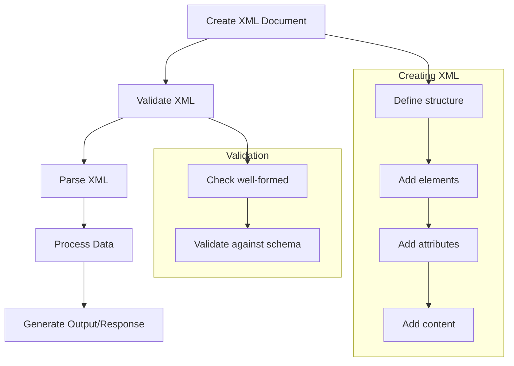

XML (eXtensible Markup Language) is a markup language designed for storing and transporting data in a format that's both human-readable and machine-readable. Unlike HTML which focuses on displaying data, XML focuses on describing what data is. Let's dive into this versatile technology that powers many data exchange systems.

## Prerequisites

Before we begin, you'll need:

- Basic understanding of markup languages (helpful but not required)
- A text editor (like Notepad++, Visual Studio Code, or any plain text editor)
- A web browser to view XML files

Nothing complex to install—you're likely ready to start right away!

## What is XML and Why Use It?

XML was designed as a software and hardware-independent tool for storing and transporting data. Think of it as a universal language for describing data that both humans and computers can understand.

XML has several key characteristics that make it valuable:

- **Extensible**: Unlike HTML with its predefined tags, XML lets you create your own tags that perfectly describe your data
- **Self-descriptive**: The tags themselves tell you what the data means
- **Structured**: Data is organized in a clear, hierarchical tree structure
- **Platform-independent**: Works seamlessly across different operating systems and applications

For example, while HTML might display customer information like this:

```html
<p>John Doe - john@example.com</p>
```

XML would describe what each piece of data actually is:

```xml
<customer>
  <name>John Doe</name>
  <email>john@example.com</email>
</customer>
```

It's important to understand that XML itself doesn't "do" anything—it's simply information wrapped in descriptive tags. Programs must be written to send, receive, store, or display this information. XML is the messenger, not the action-taker.

## Getting Started with XML

Getting started with XML is straightforward because it requires no special software. You simply need:

1. A text editor to create and edit XML files
2. A web browser to view and validate them

Save your XML files with a `.xml` extension, and you're ready to go! Let's move on to the fundamental rules that make XML work.

## XML Syntax and Structure

XML follows a set of strict but logical syntax rules that ensure consistency and reliability. These rules form the foundation of working with XML effectively.

### Basic Syntax Rules

Every XML document must follow these rules:

1. **Root element requirement**: Every XML document must have exactly one root element that contains all other elements—this creates a clear hierarchy
2. **Proper tag closing**: All elements must have both opening and closing tags (or be self-closing)
3. **Case sensitivity**: Unlike HTML, XML tags are case sensitive—`<Name>` and `<name>` are different elements
4. **Proper nesting**: Elements must be properly nested, with inner elements closed before their containing elements
5. **Quoted attributes**: All attribute values must be enclosed in quotes
6. **Special character escaping**: Characters like `<`, `>`, `&`, `'`, and `"` must use entity references
7. **Whitespace preservation**: XML preserves all whitespace, including spaces, tabs, and line breaks

Let's see how these rules work together in practice.

### Creating Your First XML Document

Every XML document typically follows this general structure:

```xml
<?xml version="1.0" encoding="UTF-8"?>
<root>
  <child>
    Content goes here
  </child>
</root>
```

Let's look at a more practical example—a bookstore inventory. This shows how XML can organize related data in a structured way:

```xml
<?xml version="1.0" encoding="UTF-8"?>
<bookstore>
  <book category="fiction">
    <title>The Great Gatsby</title>
    <author>F. Scott Fitzgerald</author>
    <year>1925</year>
    <price>12.99</price>
  </book>
  <book category="non-fiction">
    <title>A Brief History of Time</title>
    <author>Stephen Hawking</author>
    <year>1988</year>
    <price>15.99</price>
  </book>
</bookstore>
```

Notice how this example naturally creates a hierarchy of information, with each book containing several properties, all nested within the bookstore.

### XML Tree Structure

This hierarchical organization creates what we call a "tree structure." Visualizing this structure helps understand the relationships between elements:

```mermaid
graph TD
    A[bookstore] -->|parent| B[book]
    B -->|child| D[title]
    B -->|child| E[author]
    B -->|child| F[year]
    B -->|child| G[price]
    A -->|parent| C[book]
    C -->|child| H[title]
    C -->|child| I[author]
    C -->|child| J[year]
    C -->|child| K[price]
    B -->|attribute| L[category="fiction"]
    C -->|attribute| M[category="non-fiction"]
```

Understanding this tree structure is essential for working with XML effectively. Each element can be a parent (containing other elements), a child (contained within another element), or both simultaneously.

## XML Elements and Attributes

Now that we understand the overall structure, let's look more closely at the building blocks of XML: elements and attributes.

### Elements

Elements are the primary building blocks of XML documents. An element consists of an opening tag, content, and a closing tag:

```xml
<element>content</element>
```

Not all elements need content. Empty elements can be written in two equivalent ways:

```xml
<element></element>
<!-- or in shorthand form -->
<element/>
```

Elements can contain text, other elements, or both, allowing for complex nested structures.

### Attributes

Attributes provide additional information about elements and always appear within the opening tag:

```xml
<element attribute="value">content</element>
```

Let's see a practical example using both elements and attributes:

```xml
<employee id="12345">
  <name>Jane Smith</name>
  <department code="HR">Human Resources</department>
</employee>
```

In this example:

- `id` is an attribute of the `employee` element
- `code` is an attribute of the `department` element

A common question when designing XML is whether to use elements or attributes for your data. Here's a helpful guideline:

- Use **elements** for the actual data content
- Use **attributes** for metadata about the element

This distinction helps maintain clear, logical XML structures.

## XML Declaration and Well-formed XML

Every XML document should ideally begin with a declaration that provides important processing information.

### XML Declaration

The XML declaration appears at the very beginning of the document:

```xml
<?xml version="1.0" encoding="UTF-8" standalone="yes"?>
```

This declaration includes:

- `version`: Specifies the XML version being used
- `encoding`: Indicates the character encoding (UTF-8 is most common)
- `standalone`: States whether the document depends on external markup declarations

While technically optional, the declaration is strongly recommended and must be the first line if included.

### Well-formed XML

A "well-formed" XML document strictly follows all XML syntax rules. Here's a simple example:

```xml
<?xml version="1.0" encoding="UTF-8"?>
<contact>
  <name>Tanmay Patil</name>
  <company>TutorialsPoint</company>
  <phone>(011) 123-4567</phone>
</contact>
```

If any rule is broken—for example, if a closing tag is missing—browsers and XML parsers will display an error instead of processing the document. This strict enforcement ensures data integrity and consistency.

## Comments in XML

As your XML documents grow in complexity, it's helpful to add explanatory comments. XML comments use this syntax:

```xml
<!-- This is a comment in XML -->
```

Here's how you might use comments to make a document more understandable:

```xml
<?xml version="1.0" encoding="UTF-8"?>
<!-- This XML file represents a simple employee record -->
<employee>
  <!-- Personal information section -->
  <name>John Doe</name>
  <age>35</age>
  <!-- Contact information section -->
  <email>john@example.com</email>
  <phone>(123) 456-7890</phone>
</employee>
```

Comments are visible when viewing the XML file but are ignored by XML parsers—they're strictly for human readers.

## Special Characters in XML

Because characters like `<` and `>` have special meaning in XML, you must use entity references when you want these characters to appear as actual content. Here are the most common entity references:

| Character | Entity Reference | Description    |
| --------- | ---------------- | -------------- |
| <         | &lt;             | Less than      |
| >         | &gt;             | Greater than   |
| &         | &amp;            | Ampersand      |
| '         | &apos;           | Apostrophe     |
| "         | &quot;           | Quotation mark |

For example:

```xml
<message>The price is &lt; $100 &amp; available now!</message>
<!-- This will display as: The price is < $100 & available now! -->
```

Using these entity references prevents XML parsers from misinterpreting special characters as markup.

## Viewing and Validating XML

Once you've created an XML document, you'll want to view and validate it to ensure it's well-formed.

You can view XML files using:

1. **Text editors** like Notepad++, Visual Studio Code, or Sublime Text
2. **Web browsers** like Chrome, Firefox, or Edge
3. **Specialized XML editors** that offer syntax highlighting and validation features

To view an XML file in a browser, simply:

1. Save your XML document with a `.xml` extension
2. Open the file in any modern web browser

The browser will display the XML structure and automatically show error messages if the XML is not well-formed. This makes browsers a quick and easy tool for basic XML validation.

## Working with XML in JavaScript

Let's move beyond just creating and viewing XML to actually working with it programmatically. JavaScript provides built-in tools for parsing and manipulating XML.

For basic XML parsing in JavaScript, you can use the built-in DOM parser:

```javascript
// Parse XML string into a DOM object
const parser = new DOMParser();
const xmlString = '<root><child>content</child></root>';
const xmlDoc = parser.parseFromString(xmlString, 'text/xml');

// Access elements
const childElement = xmlDoc.getElementsByTagName('child')[0];
console.log(childElement.textContent); // Output: content

// Create new XML elements
const newElement = xmlDoc.createElement('newChild');
newElement.textContent = 'new content';
xmlDoc.documentElement.appendChild(newElement);

// Convert back to string
const serializer = new XMLSerializer();
const updatedXmlString = serializer.serializeToString(xmlDoc);
console.log(updatedXmlString);
// Output: <root><child>content</child><newChild>new content</newChild></root>
```

For more complex XML handling, you might want to use libraries like `fast-xml-parser`:

```javascript
// Example using fast-xml-parser (requires npm installation)
// npm install fast-xml-parser

const { XMLParser, XMLBuilder, XMLValidator } = require('fast-xml-parser');

// XML data to parse
const xmlData = `<?xml version="1.0"?>
<company>
  <employee id="1">
    <name>John</name>
    <title>Developer</title>
  </employee>
</company>`;

// Validate XML first
if (XMLValidator.validate(xmlData)) {
  // Parse XML to JavaScript object
  const parser = new XMLParser();
  let jsonObj = parser.parse(xmlData);

  // Now you can work with the data as a JavaScript object
  console.log(jsonObj.company.employee.name); // Output: John

  // Modify the data
  jsonObj.company.employee.title = 'Senior Developer';

  // Convert back to XML
  const builder = new XMLBuilder();
  let updatedXml = builder.build(jsonObj);
  console.log(updatedXml);
}
```

This approach converts XML to JavaScript objects, making it easier to work with the data using familiar JavaScript syntax.

## Loading XML from a Server

In real-world applications, you'll often need to load XML data from a server. Here's how to do that using the `XMLHttpRequest` object:

```javascript
// Function to load XML from server
function loadXML() {
  // Create XMLHttpRequest object
  const xhttp = new XMLHttpRequest();

  // Define what happens on successful data submission
  xhttp.onreadystatechange = function () {
    if (this.readyState == 4 && this.status == 200) {
      // Parse the XML response
      const xmlDoc = this.responseXML;

      // Now you can work with the XML document
      const books = xmlDoc.getElementsByTagName('book');
      for (let i = 0; i < books.length; i++) {
        const title = books[i].getElementsByTagName('title')[0].textContent;
        console.log('Book title: ' + title);
      }
    }
  };

  // Send request
  xhttp.open('GET', 'books.xml', true);
  xhttp.send();
}

// Call the function
loadXML();
```

This approach allows you to retrieve XML data from a server and process it dynamically in your web applications.

## Practical XML Examples

Let's explore some practical XML examples that you might encounter in real-world applications.

### Customer Data

```xml
<?xml version="1.0" encoding="UTF-8"?>
<customers>
  <customer id="C001">
    <name>John Smith</name>
    <email>john@example.com</email>
    <phone>(123) 456-7890</phone>
    <address>
      <street>123 Main St</street>
      <city>Anytown</city>
      <state>CA</state>
      <zip>12345</zip>
    </address>
  </customer>
</customers>
```

This example shows how XML can organize complex nested data like customer records with multiple fields and sub-sections.

### Product Inventory

```xml
<?xml version="1.0" encoding="UTF-8"?>
<inventory>
  <product id="P001">
    <name>Wireless Headphones</name>
    <category>Electronics</category>
    <price>89.99</price>
    <quantity>42</quantity>
  </product>
</inventory>
```

Here, XML provides a clear structure for product information, making it easy to track inventory details.

### RSS Feed Example

```xml
<?xml version="1.0" encoding="UTF-8"?>
<rss version="2.0">
  <channel>
    <title>My Blog</title>
    <link>https://www.myblog.com</link>
    <description>Latest news and articles</description>
    <item>
      <title>New Article</title>
      <link>https://www.myblog.com/new-article</link>
      <description>This is a new article about XML</description>
      <pubDate>Mon, 07 Apr 2025 10:53:00 WIB</pubDate>
    </item>
  </channel>
</rss>
```

RSS feeds, which use XML format, are a common way to distribute regularly updated content like blog posts or news articles.

## XML Processing Flow

Understanding the typical XML processing flow helps visualize how XML fits into application architecture:



This diagram shows how XML moves from creation to final usage, with each step building on the previous one.

## Common Pitfalls and Best Practices

As you begin working with XML, being aware of common issues and best practices will save you time and frustration.

### Common Mistakes to Avoid

1. **Forgetting the root element**: Every XML document must have exactly one root element
2. **Incorrect nesting**: Elements must be properly nested like `<outer><inner>content</inner></outer>`, not `<outer><inner>content</outer></inner>`
3. **Case sensitivity issues**: Remember that `<Name>` and `<name>` are different elements
4. **Unclosed tags**: Every opening tag must have a closing tag or be self-closing
5. **Unquoted attributes**: Always put attribute values in quotes, like `attribute="value"`

### Best Practices

Following these best practices will make your XML more readable and maintainable:

1. **Use meaningful tag names** that clearly describe the data they contain
2. **Be consistent with naming conventions** (camelCase or snake_case) throughout your documents
3. **Indent your XML** to visually represent the hierarchy of elements
4. **Add comments** to explain complex structures or provide context
5. **Validate your XML** regularly to catch errors early

These practices not only make your XML more effective but also easier for others to work with.

## The Remaining 15%: Advanced XML Concepts

Now that you've mastered the essential 85% of XML knowledge, here's a summary of the remaining 15% you can explore as needed:

1. **XML Schema Definition (XSD)**

   - A more powerful way to define the structure and validate XML documents
   - Supports data types, constraints, and complex relationship definitions

2. **Document Type Definition (DTD)**

   - An older but still used method to define document structure
   - Defines the legal building blocks of an XML document

3. **XML Namespaces**

   - Helps avoid naming conflicts when combining XML from different sources
   - Essential for complex applications that integrate multiple XML vocabularies

4. **XSLT (Extensible Stylesheet Language Transformations)**

   - Powerful tool for transforming XML into other formats like HTML or PDF
   - Creates presentation views of your XML data

5. **XPath**

   - A query language for navigating through XML documents
   - Allows precise selection of elements based on various criteria

6. **XML DOM (Document Object Model)**

   - A programming interface for advanced XML manipulation
   - Provides complete control over document structure and content

7. **SAX (Simple API for XML)**

   - An event-based alternative to DOM for processing large XML files
   - More memory-efficient for certain applications

8. **XML Security**

   - Techniques for encrypting and signing XML documents
   - Important for secure data exchange

9. **Industry-specific XML Standards**
   - Specialized XML vocabularies for different industries
   - Examples include SOAP for web services, SVG for graphics, and RSS for web feeds

These advanced topics build upon the foundation you now have, and you can explore them as specific needs arise in your projects.

## Summary

Congratulations! You've now learned the essential 85% of XML knowledge that will cover most of your daily XML needs:

- What XML is and why it's a valuable tool for data exchange
- The basic syntax and structure of XML documents
- How to create well-formed XML using elements and attributes
- Techniques for viewing, validating, and working with XML
- Practical examples of XML in real-world applications
- Common pitfalls to avoid and best practices to follow

With this solid foundation, you're well-equipped to work with XML in your projects and expand your knowledge into more specialized areas as needed. The consistent, self-descriptive nature of XML makes it a reliable technology for data storage and exchange across different systems and platforms.
