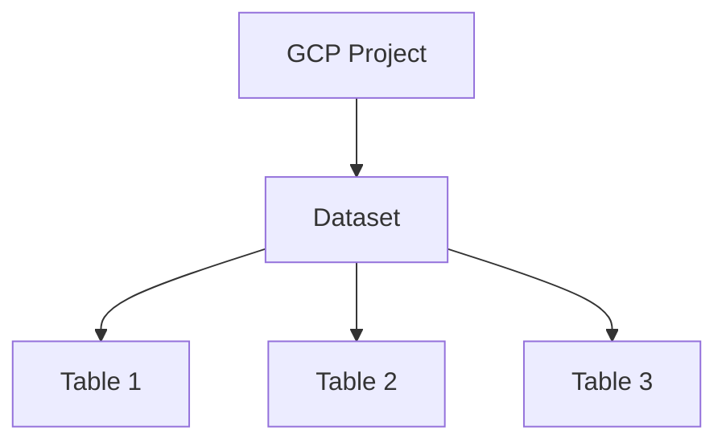
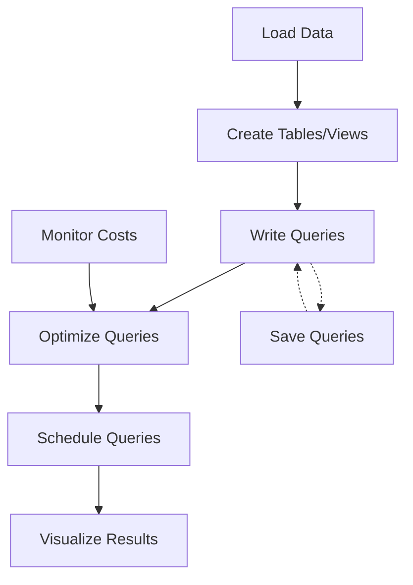

Hey there! Let's dive into Google BigQuery - Google's fully-managed, serverless data warehouse that lets you analyze massive datasets with SQL. I'll walk you through everything you need to know to get started and be productive daily.

## What is BigQuery and Why Should You Care?

BigQuery is Google's enterprise data warehouse for analytics. Think of it as a super-powered SQL database designed to:

- Query terabytes or petabytes of data in seconds
- Work without you having to manage any infrastructure
- Scale automatically to handle your workloads
- Integrate with the Google Cloud ecosystem

The big difference from traditional databases? BigQuery separates storage and compute, allowing for massive parallelization and cost optimization.

## Getting Started with BigQuery

### Prerequisites

- A Google Cloud Platform (GCP) account
- A GCP project (create one if you don't have it)
- Basic SQL knowledge (though I'll cover the essentials)

### Setup

1. **Create a GCP account** if you don't have one at [console.cloud.google.com](https://console.cloud.google.com)

2. **Enable billing** for your project:

   - You get $300 in free credits as a new user
   - BigQuery also has a generous free tier (1 TB of queries per month)

3. **Access BigQuery** through:
   - GCP Console: Navigate to "BigQuery" in the menu
   - `bq` command-line tool: Install the [Google Cloud SDK](https://cloud.google.com/sdk/docs/install)
   - Client libraries: Available for Python, Java, etc.

For local experimentation, let's install the `bq` command-line tool:

```bash
# Install Google Cloud SDK
curl https://sdk.cloud.google.com | bash

# Initialize and authenticate
gcloud init
```

## BigQuery Data Structure

BigQuery organizes data hierarchically:



- **Project**: Your GCP project that contains all resources
- **Dataset**: Container for tables (like a database schema)
- **Table**: Actual data storage (like database tables)

Let's create these structures:

```bash
# Create a dataset
bq mk --dataset your_project_id:your_dataset_name

# Example
bq mk --dataset my_analytics_project:ecommerce_data
```

Via the SQL interface:

```sql
-- Create a new dataset
CREATE SCHEMA `your_project_id.your_dataset_name`;

-- Example
CREATE SCHEMA `my_analytics_project.ecommerce_data`;
```

## Creating Your First Table

Let's create a table and load some data:

```sql
-- Create a table with schema definition
CREATE TABLE `my_analytics_project.ecommerce_data.products` (
  product_id STRING,
  name STRING,
  category STRING,
  price NUMERIC,
  inventory INT64,
  last_updated TIMESTAMP
);

-- Insert sample data (seeding script)
INSERT INTO `my_analytics_project.ecommerce_data.products`
VALUES
  ('P001', 'Ergonomic Keyboard', 'Electronics', 89.99, 120, CURRENT_TIMESTAMP()),
  ('P002', 'Wireless Mouse', 'Electronics', 45.50, 200, CURRENT_TIMESTAMP()),
  ('P003', 'Coffee Mug', 'Kitchen', 12.99, 500, CURRENT_TIMESTAMP()),
  ('P004', 'Notebook', 'Office', 8.75, 1000, CURRENT_TIMESTAMP()),
  ('P005', 'Desk Lamp', 'Home', 34.50, 75, CURRENT_TIMESTAMP());
```

Now let's create a second table for orders:

```sql
-- Create orders table
CREATE TABLE `my_analytics_project.ecommerce_data.orders` (
  order_id STRING,
  customer_id STRING,
  order_date DATE,
  total_amount NUMERIC
);

-- Insert sample data
INSERT INTO `my_analytics_project.ecommerce_data.orders`
VALUES
  ('O10001', 'C2001', DATE '2023-01-15', 134.48),
  ('O10002', 'C3045', DATE '2023-01-16', 45.50),
  ('O10003', 'C2001', DATE '2023-01-20', 21.74),
  ('O10004', 'C8832', DATE '2023-01-25', 89.99),
  ('O10005', 'C9234', DATE '2023-01-28', 55.25);
```

And finally, let's add order items:

```sql
-- Create order_items table
CREATE TABLE `my_analytics_project.ecommerce_data.order_items` (
  order_id STRING,
  product_id STRING,
  quantity INT64,
  item_price NUMERIC
);

-- Insert sample data
INSERT INTO `my_analytics_project.ecommerce_data.order_items`
VALUES
  ('O10001', 'P001', 1, 89.99),
  ('O10001', 'P003', 2, 12.99),
  ('O10001', 'P004', 2, 8.75),
  ('O10002', 'P002', 1, 45.50),
  ('O10003', 'P003', 1, 12.99),
  ('O10003', 'P004', 1, 8.75),
  ('O10004', 'P001', 1, 89.99),
  ('O10005', 'P005', 1, 34.50),
  ('O10005', 'P003', 1, 12.99),
  ('O10005', 'P004', 1, 8.75);
```

## BigQuery SQL Basics

BigQuery uses a SQL dialect called GoogleSQL (similar to standard SQL). Let's explore some basics:

### Simple Queries

```sql
-- Basic SELECT statement
SELECT * FROM `my_analytics_project.ecommerce_data.products`
LIMIT 10;

-- Filtering with WHERE
SELECT name, price, category
FROM `my_analytics_project.ecommerce_data.products`
WHERE category = 'Electronics'
ORDER BY price DESC;
```

### JOINs and Aggregations

```sql
-- Join tables to find popular products
SELECT
  p.product_id,
  p.name,
  SUM(oi.quantity) as total_quantity_sold
FROM `my_analytics_project.ecommerce_data.products` p
JOIN `my_analytics_project.ecommerce_data.order_items` oi
  ON p.product_id = oi.product_id
GROUP BY p.product_id, p.name
ORDER BY total_quantity_sold DESC;

-- Calculate revenue by category
SELECT
  p.category,
  SUM(oi.quantity * oi.item_price) as total_revenue
FROM `my_analytics_project.ecommerce_data.products` p
JOIN `my_analytics_project.ecommerce_data.order_items` oi
  ON p.product_id = oi.product_id
GROUP BY p.category
ORDER BY total_revenue DESC;
```

### BigQuery Specific Functions

```sql
-- Working with timestamps
SELECT
  EXTRACT(MONTH FROM last_updated) as month,
  EXTRACT(YEAR FROM last_updated) as year,
  COUNT(*) as product_count
FROM `my_analytics_project.ecommerce_data.products`
GROUP BY month, year;

-- Array functions
SELECT
  customer_id,
  ARRAY_AGG(order_id ORDER BY order_date) as all_orders
FROM `my_analytics_project.ecommerce_data.orders`
GROUP BY customer_id;
```

## Loading Data into BigQuery

BigQuery supports several ways to load data:

### 1. Loading from local files (CSV, JSON, etc.)

Using the command line:

```bash
# Load CSV file into a table
bq load \
  --source_format=CSV \
  --skip_leading_rows=1 \
  your_project_id:your_dataset.your_table \
  path/to/your/file.csv \
  field1:type,field2:type
```

Using SQL:

```sql
-- Load data from GCS
LOAD DATA INTO `my_analytics_project.ecommerce_data.new_products`
FROM FILES(
  format = 'CSV',
  uris = ['gs://your-bucket/products.csv'],
  skip_leading_rows = 1
);
```

### 2. Loading from Google Cloud Storage (GCS)

```sql
-- Load from GCS bucket
LOAD DATA INTO `my_analytics_project.ecommerce_data.customers`
FROM FILES(
  format = 'NEWLINE_DELIMITED_JSON',
  uris = ['gs://your-bucket/customers*.json']
);
```

### 3. Querying External Data Sources

```sql
-- Create an external table
CREATE EXTERNAL TABLE `my_analytics_project.ecommerce_data.external_sales`
OPTIONS (
  format = 'CSV',
  uris = ['gs://your-bucket/sales/sales_*.csv'],
  skip_leading_rows = 1
);
```

## Common Analysis Patterns

### Time-Series Analysis

```sql
-- Monthly sales analysis
SELECT
  EXTRACT(MONTH FROM o.order_date) as month,
  EXTRACT(YEAR FROM o.order_date) as year,
  SUM(o.total_amount) as monthly_revenue
FROM `my_analytics_project.ecommerce_data.orders` o
WHERE o.order_date BETWEEN '2023-01-01' AND '2023-12-31'
GROUP BY month, year
ORDER BY year, month;
```

### Window Functions

Window functions are super useful for analytics:

```sql
-- Calculate running total of sales
SELECT
  order_date,
  total_amount,
  SUM(total_amount) OVER (ORDER BY order_date) as running_total
FROM `my_analytics_project.ecommerce_data.orders`;

-- Calculate percent of total by category
SELECT
  category,
  SUM(price * inventory) as category_inventory_value,
  SUM(price * inventory) / SUM(SUM(price * inventory)) OVER () as pct_of_total
FROM `my_analytics_project.ecommerce_data.products`
GROUP BY category;
```

## BigQuery Performance & Cost Optimization

BigQuery charges based on the amount of data processed by your queries. Here are some best practices:

### 1. Query Optimization

```sql
-- BAD: Scans all columns
SELECT * FROM `my_analytics_project.ecommerce_data.orders`;

-- GOOD: Only select needed columns
SELECT order_id, customer_id, order_date
FROM `my_analytics_project.ecommerce_data.orders`;

-- BAD: Processing all data
SELECT COUNT(*) FROM `my_analytics_project.ecommerce_data.orders`;

-- BETTER: Using approximate functions when appropriate
SELECT APPROX_COUNT_DISTINCT(customer_id)
FROM `my_analytics_project.ecommerce_data.orders`;
```

### 2. Partitioning and Clustering

Partitioning divides your table into segments based on a column value:

```sql
-- Create a partitioned table by date
CREATE TABLE `my_analytics_project.ecommerce_data.orders_partitioned`
PARTITION BY order_date AS
SELECT * FROM `my_analytics_project.ecommerce_data.orders`;

-- Query that benefits from partitioning (only scans relevant partitions)
SELECT *
FROM `my_analytics_project.ecommerce_data.orders_partitioned`
WHERE order_date BETWEEN '2023-01-01' AND '2023-01-15';
```

Clustering further organizes data within partitions:

```sql
-- Create a clustered table
CREATE TABLE `my_analytics_project.ecommerce_data.orders_clustered`
PARTITION BY order_date
CLUSTER BY customer_id AS
SELECT * FROM `my_analytics_project.ecommerce_data.orders`;
```

### 3. Checking Query Costs Before Running

```sql
-- Dry run to estimate bytes processed
#standardSQL
SELECT
  COUNT(*) AS orders_count,
  SUM(total_amount) AS total_sales
FROM `my_analytics_project.ecommerce_data.orders`;
-- Add "Execution Details" in the UI to see bytes processed
```

## BigQuery Views and Saved Queries

Views are virtual tables defined by a query:

```sql
-- Create a view for common analytics
CREATE VIEW `my_analytics_project.ecommerce_data.sales_by_category` AS
SELECT
  p.category,
  COUNT(DISTINCT o.order_id) as order_count,
  SUM(oi.quantity * oi.item_price) as revenue
FROM `my_analytics_project.ecommerce_data.products` p
JOIN `my_analytics_project.ecommerce_data.order_items` oi
  ON p.product_id = oi.product_id
JOIN `my_analytics_project.ecommerce_data.orders` o
  ON oi.order_id = o.order_id
GROUP BY p.category;

-- Query the view
SELECT * FROM `my_analytics_project.ecommerce_data.sales_by_category`
ORDER BY revenue DESC;
```

## Visualizing BigQuery Data

BigQuery integrates with several visualization tools:

1. **Google Data Studio (now Looker Studio)**: Direct connection
2. **Google Sheets**: Query results can be exported
3. **Tableau/PowerBI**: Connect via ODBC drivers

But for quick ad-hoc visualization, you can use the query results:

```sql
-- Query to visualize monthly sales trends
SELECT
  FORMAT_DATE('%Y-%m', order_date) as month,
  SUM(total_amount) as revenue
FROM `my_analytics_project.ecommerce_data.orders`
GROUP BY month
ORDER BY month;
-- Then click "Explore Data" > "Explore with Looker Studio"
```

## BigQuery Workflow Execution

Here's a typical workflow in BigQuery:



## The Remaining 15%: What You'll Explore Next

Now that you've got the essentials, here's what you'll want to explore on your own:

1. **BigQuery ML**: Build and deploy machine learning models using SQL

   ```sql
   -- Simple example of creating a linear regression model
   CREATE MODEL `my_project.my_dataset.price_prediction_model`
   OPTIONS(model_type='linear_reg') AS
   SELECT features, target FROM training_data;
   ```

2. **Advanced Performance Techniques**:

   - Materialized views
   - Dynamic partitioning strategies
   - Advanced clustering techniques

3. **BigQuery Scripting and Stored Procedures**:

   ```sql
   -- Example of a stored procedure
   CREATE PROCEDURE `my_project.my_dataset.analyze_sales`()
   BEGIN
     -- Multiple SQL statements
   END;
   ```

4. **User-Defined Functions (UDFs)**:

   ```sql
   -- JavaScript UDF example
   CREATE FUNCTION `my_project.my_dataset.calculate_discount`(price FLOAT64, category STRING)
   RETURNS FLOAT64
   LANGUAGE js AS """
     if (category === 'Electronics') return price * 0.9;
     return price * 0.95;
   """;
   ```

5. **Streaming Data**: Real-time data ingestion

   ```
   -- Using the BigQuery API to stream data
   -- (typically done via client libraries)
   ```

6. **Data Governance and Security**:

   - Column-level security
   - Dynamic data masking
   - Row-level security policies

7. **BigQuery BI Engine**: In-memory analysis service for sub-second query responses

   ```
   -- Configuration via the Google Cloud Console
   ```

8. **Integration with Other GCP Services**:
   - Dataflow for ETL
   - Pub/Sub for event streams
   - Cloud Functions for automation

## Final Tips to Remember

1. **Start with small queries** when learning
2. **Use the BigQuery sandbox** if you don't have billing enabled
3. **Explore public datasets** in the BigQuery marketplace
4. **Save commonly used queries** as views or saved queries
5. **Monitor your costs** in the GCP Billing dashboard

That's it! You now know the 85% of BigQuery you'll use daily. The remaining 15% you'll pick up as you go deeper into specific use cases. Happy querying!
