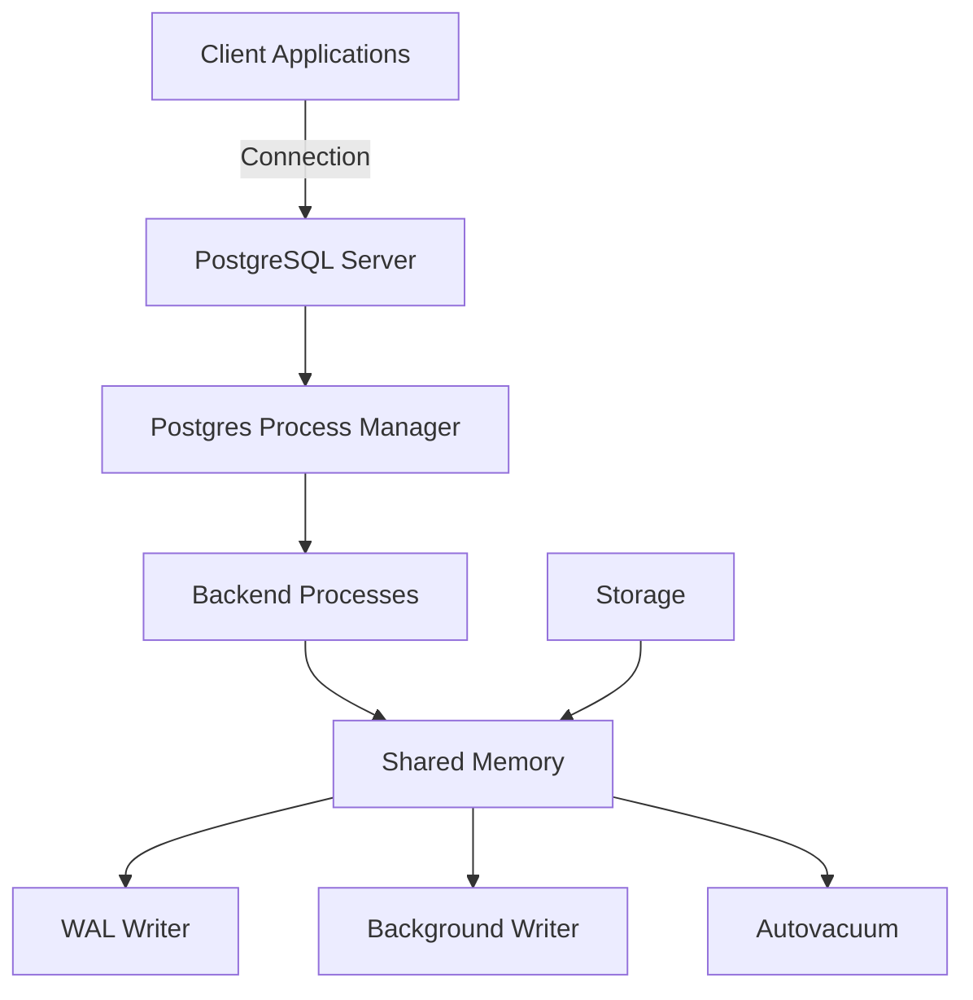
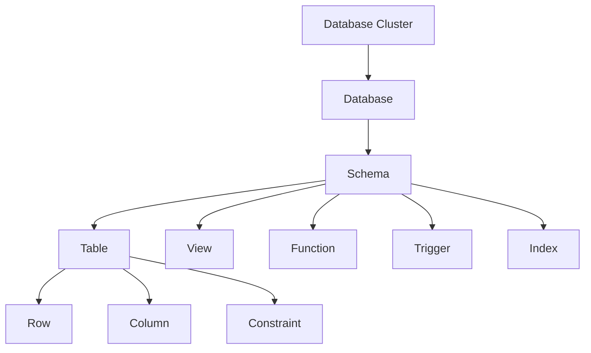
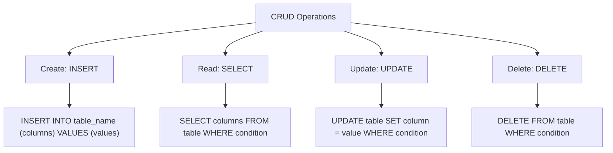
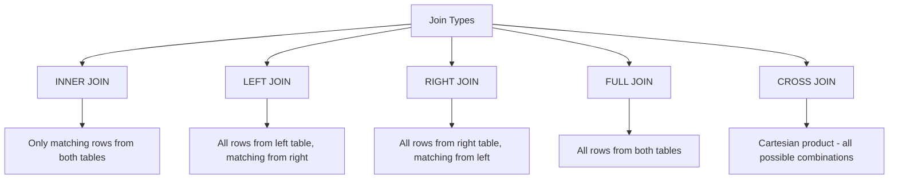
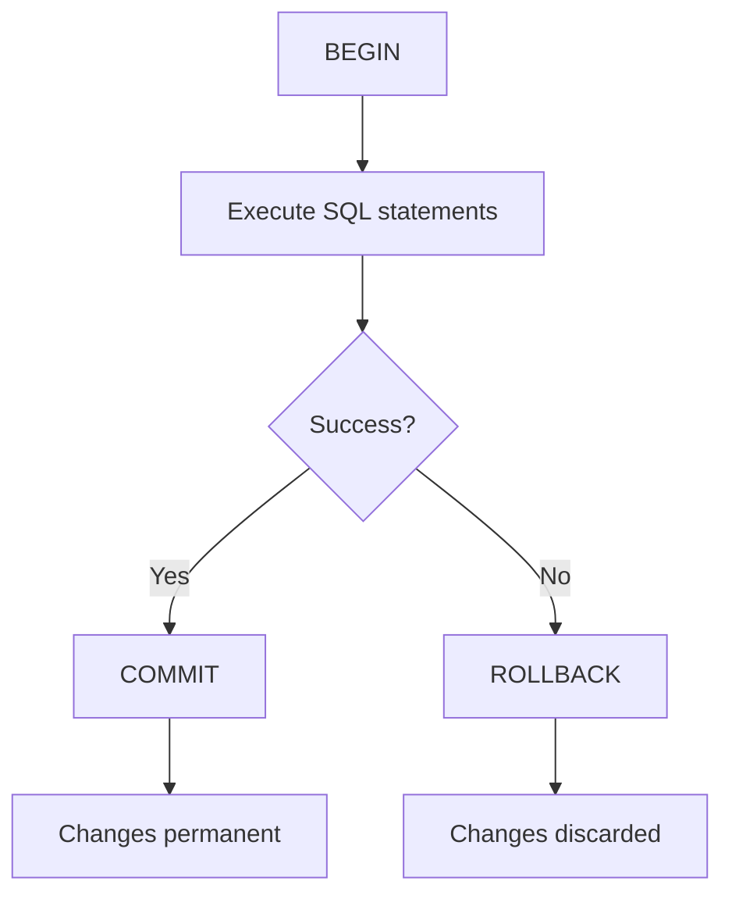

# PostgreSQL Crash Course: Master 85% of Daily Tasks

Welcome to your PostgreSQL crash course! PostgreSQL (often called "Postgres") is a powerful, open-source relational database management system that combines reliability, extensibility, and SQL compliance. This guide will cover the core 85% of what you'll need for daily use, with guidance on how to explore the remaining 15%.

## Prerequisites

Before starting, you'll need:

- Basic understanding of SQL concepts (tables, rows, columns)
- Command-line familiarity
- A computer with at least 1GB RAM and 512MB free disk space

## Installation and Setup

Let's begin by installing PostgreSQL on your system. The process varies by operating system, but we'll cover the main ones:

### Windows Installation

```bash
# 1. Download installer from https://www.postgresql.org/download/windows/
# 2. Run the installer and follow the wizard
# 3. Select components (PostgreSQL server, pgAdmin, Stack Builder)
# 4. Choose installation directory
# 5. Set a password for 'postgres' user (remember this!)
# 6. Use default port (5432)
# 7. Complete installation
```

### macOS Installation

```bash
# Option 1: Using Homebrew
brew install postgresql

# Option 2: EnterpriseDB installer from PostgreSQL website
# Download from https://www.postgresql.org/download/macosx/
```

### Linux Installation

```bash
# Ubuntu/Debian
sudo apt update
sudo apt install postgresql postgresql-contrib

# Red Hat/Fedora
sudo dnf install postgresql postgresql-server
sudo postgresql-setup --initdb
sudo systemctl start postgresql
sudo systemctl enable postgresql
```

After installation, you should verify that PostgreSQL is running correctly:

### Verifying Installation

```bash
# Check PostgreSQL version
psql --version

# Start PostgreSQL service (if not started)
# Windows: Search for "Services" in Start menu, find PostgreSQL and start it
# macOS: brew services start postgresql
# Linux: sudo systemctl start postgresql
```

## Database Fundamentals

Now that PostgreSQL is installed, let's understand its architecture and how to create your first database.

### PostgreSQL Architecture

PostgreSQL operates as a client-server system with several components working together:



This architecture ensures reliability and data integrity even during system failures.

### Creating Your First Database

Let's connect to PostgreSQL and create our first database:

```bash
# Windows: Use SQL Shell (psql) from Start menu
# macOS/Linux:
sudo -u postgres psql

# Create a new database
CREATE DATABASE my_first_db;

# Connect to your new database
\c my_first_db
```

When you work with PostgreSQL, you'll interact with different types of database objects, organized in a hierarchy:

### Database Objects Hierarchy



This hierarchy helps organize your data and database objects logically.

## Creating Tables and Data Types

Now that we understand the basics, let's create tables and explore PostgreSQL's data types.

### Basic Table Creation

Tables store your data in a structured format. Here's how to create a basic table:

```sql
-- Create a simple table
CREATE TABLE employees (
    employee_id SERIAL PRIMARY KEY,  -- Auto-incrementing ID
    first_name VARCHAR(50) NOT NULL, -- Cannot be empty
    last_name VARCHAR(50) NOT NULL,  -- Cannot be empty
    email VARCHAR(100) UNIQUE,       -- Must be unique
    hire_date DATE,                  -- Date format
    salary NUMERIC(10, 2),           -- Decimal with 2 digits precision
    department_id INTEGER            -- References another table
);
```

PostgreSQL supports a wide range of data types to fit different needs. Let's explore the most commonly used ones:

### Core Data Types

```mermaid
graph TD
    A[PostgreSQL Data Types] --> B[Numeric Types]
    A --> C[Character Types]
    A --> D[Date/Time Types]
    A --> E[Boolean Type]
    A --> F[Special Types]

    B --> B1[INTEGER: Whole numbers]
    B --> B2[NUMERIC/DECIMAL: Exact decimal values]
    B --> B3[REAL/DOUBLE: Floating point]

    C --> C1[CHAR(n): Fixed-length]
    C --> C2[VARCHAR(n): Variable-length with limit]
    C --> C3[TEXT: Unlimited variable-length]

    D --> D1[DATE: Calendar date]
    D --> D2[TIME: Time of day]
    D --> D3[TIMESTAMP: Date and time]
    D --> D4[INTERVAL: Time span]

    E --> E1[TRUE/FALSE values]

    F --> F1[JSON/JSONB: JSON data]
    F --> F2[UUID: Unique identifiers]
    F --> F3[ARRAY: Arrays of other types]
```

Choosing the right data type for each column is crucial for data integrity and performance.

### Setting Up Relationships

In relational databases, tables often relate to each other. Let's create another table and establish a relationship:

```sql
-- Create a related table
CREATE TABLE departments (
    department_id SERIAL PRIMARY KEY,
    department_name VARCHAR(100) NOT NULL,
    location VARCHAR(100)
);

-- Add foreign key constraint to employees
ALTER TABLE employees
ADD CONSTRAINT fk_department
FOREIGN KEY (department_id)
REFERENCES departments(department_id);
```

This foreign key constraint ensures that every department_id in the employees table must exist in the departments table, maintaining referential integrity.

## Database Seeding

Now that our tables are set up, we should populate them with initial data so we can perform meaningful operations:

```sql
-- First, insert departments
INSERT INTO departments (department_name, location) VALUES
    ('Engineering', 'Building A'),  -- ID will be 1
    ('Marketing', 'Building B'),    -- ID will be 2
    ('HR', 'Building A'),           -- ID will be 3
    ('Finance', 'Building C');      -- ID will be 4

-- Now, insert employees
INSERT INTO employees
    (first_name, last_name, email, hire_date, salary, department_id)
VALUES
    ('John', 'Doe', 'john.doe@example.com', '2022-01-15', 75000, 1),
    ('Jane', 'Smith', 'jane.smith@example.com', '2022-02-01', 82000, 2),
    ('Mike', 'Johnson', 'mike.j@example.com', '2022-01-20', 67000, 1),
    ('Sarah', 'Williams', 'sarah.w@example.com', '2022-03-10', 71000, 3),
    ('Robert', 'Brown', 'robert.b@example.com', '2022-02-15', 90000, 1),
    ('Emily', 'Davis', 'emily.d@example.com', '2022-04-05', 65000, 2),
    ('David', 'Miller', 'david.m@example.com', '2022-03-20', 85000, 4);
```

These INSERT statements add four departments and seven employees to our database, creating a foundation for our examples.

## Basic Data Operations (CRUD)

Now that we have data, let's explore the four fundamental database operations: Create, Read, Update, and Delete (CRUD).

### CRUD Workflow



Let's explore each operation in detail, starting with querying data.

### Querying Data (Read)

The SELECT statement allows you to retrieve data from your tables:

```sql
-- Basic SELECT query (all columns, all rows)
SELECT * FROM employees;

-- Select specific columns
SELECT first_name, last_name, salary FROM employees;

-- Filter with WHERE
SELECT * FROM employees WHERE department_id = 1;
-- Result: Returns all employees in department 1 (Engineering)

-- Sort results with ORDER BY
SELECT * FROM employees ORDER BY salary DESC;
-- Result: Returns all employees sorted by salary (highest first)

-- Limit number of rows returned
SELECT * FROM employees LIMIT 3;
-- Result: Returns only the first 3 employees
```

The WHERE clause is particularly powerful for filtering your results.

### Filtering with WHERE

You can use various operators and conditions to filter data precisely:

```sql
-- Comparison operators
SELECT * FROM employees WHERE salary > 75000;
-- Result: Returns employees with salary greater than 75000

-- Between range
SELECT * FROM employees WHERE hire_date BETWEEN '2022-01-01' AND '2022-02-28';
-- Result: Returns employees hired in Jan or Feb 2022

-- IN operator (multiple possible values)
SELECT * FROM employees WHERE department_id IN (1, 3);
-- Result: Returns employees in departments 1 or 3

-- Pattern matching with LIKE
SELECT * FROM employees WHERE email LIKE '%@example.com';
-- Result: Returns employees whose email ends with @example.com

-- Combine conditions with AND/OR
SELECT * FROM employees
WHERE salary > 70000 AND department_id = 1;
-- Result: Returns employees in department 1 with salary > 70000
```

These filtering capabilities help you extract exactly the information you need.

### Updating Data

The UPDATE statement allows you to modify existing data:

```sql
-- Update a single record
UPDATE employees SET salary = 78000 WHERE employee_id = 1;
-- Result: John Doe's salary is now 78000

-- Update multiple records
UPDATE employees SET salary = salary * 1.05 WHERE department_id = 2;
-- Result: All Marketing employees (dept 2) get a 5% raise
```

Always use the WHERE clause with UPDATE to avoid modifying all records unintentionally.

### Deleting Data

The DELETE statement removes records from your tables:

```sql
-- Delete a single record
DELETE FROM employees WHERE employee_id = 7;
-- Result: David Miller is removed from employees

-- Delete multiple records
DELETE FROM employees WHERE department_id = 3;
-- Result: All HR employees (dept 3) are removed
```

As with UPDATE, always use a WHERE clause with DELETE to avoid accidentally removing all records.

## Joining Tables

So far, we've worked with one table at a time. Joins allow you to combine data from multiple related tables.

### Join Types Visualization

PostgreSQL supports several types of joins, each serving different purposes:



Let's examine the most commonly used joins.

### Basic Joins

```sql
-- INNER JOIN (only matching rows)
SELECT e.first_name, e.last_name, d.department_name
FROM employees e
INNER JOIN departments d ON e.department_id = d.department_id;
-- Result: Shows names and departments for all employees with valid departments

-- LEFT JOIN (all employees, even if no department)
SELECT e.first_name, e.last_name, d.department_name
FROM employees e
LEFT JOIN departments d ON e.department_id = d.department_id;
-- Result: Includes employees without departments (department_name would be NULL)
```

Notice the table aliases (`e` for employees and `d` for departments) that make the queries more readable.

## Aggregation and Grouping

Aggregation functions allow you to perform calculations across multiple rows, providing summary information.

### Aggregate Functions

PostgreSQL provides several built-in aggregation functions:

```sql
-- COUNT rows
SELECT COUNT(*) FROM employees;
-- Result: Returns total number of employees

-- Calculate SUM
SELECT SUM(salary) FROM employees;
-- Result: Returns total payroll amount

-- Calculate AVG (average)
SELECT AVG(salary) FROM employees;
-- Result: Returns average salary across all employees

-- Find MIN and MAX values
SELECT MIN(salary), MAX(salary) FROM employees;
-- Result: Returns lowest and highest salary
```

These functions become even more powerful when combined with grouping.

### Grouping Data

The GROUP BY clause divides your result set into groups based on specified columns:

```sql
-- Group by one column
SELECT department_id, COUNT(*) as employee_count, AVG(salary) as avg_salary
FROM employees
GROUP BY department_id;
-- Result: Shows count and average salary for each department

-- Filter groups with HAVING
SELECT department_id, COUNT(*) as employee_count
FROM employees
GROUP BY department_id
HAVING COUNT(*) > 2;
-- Result: Shows only departments with more than 2 employees
```

Note that WHERE filters rows before grouping, while HAVING filters the groups after they're formed.

## Advanced Querying Techniques

Now let's explore some more advanced query techniques that will help you solve complex data problems.

### Subqueries

Subqueries are queries nested within another query, allowing for multi-step operations:

```sql
-- Subquery in WHERE clause
SELECT first_name, last_name
FROM employees
WHERE department_id IN (
    SELECT department_id
    FROM departments
    WHERE location = 'Building A'
);
-- Result: Returns employees in departments located in Building A

-- Subquery in FROM clause
SELECT dept_avg.department_id, d.department_name, dept_avg.avg_salary
FROM (
    SELECT department_id, AVG(salary) as avg_salary
    FROM employees
    GROUP BY department_id
) dept_avg
JOIN departments d ON dept_avg.department_id = d.department_id;
-- Result: Returns department names with their average salaries
```

Subqueries allow you to break down complex problems into manageable steps.

### Common Table Expressions (CTEs)

CTEs provide a more readable alternative to subqueries, especially for complex queries:

```sql
-- Simple CTE example
WITH high_salary_employees AS (
    SELECT * FROM employees WHERE salary > 75000
)
SELECT first_name, last_name, salary
FROM high_salary_employees
ORDER BY salary DESC;
-- Result: Returns all employees with salaries over 75000, ordered by salary

-- More complex CTE
WITH dept_stats AS (
    SELECT department_id, AVG(salary) as avg_salary
    FROM employees
    GROUP BY department_id
)
SELECT e.first_name, e.last_name, e.salary, d.department_name,
       ds.avg_salary, (e.salary - ds.avg_salary) as salary_diff
FROM employees e
JOIN departments d ON e.department_id = d.department_id
JOIN dept_stats ds ON e.department_id = ds.department_id
WHERE e.salary > ds.avg_salary;
-- Result: Shows employees who earn more than their department's average
```

CTEs make your queries more modular and easier to understand, especially for complex operations.

## Performance Optimization

As your database grows, query performance becomes increasingly important. Let's explore some techniques to optimize your database.

### Indexing

Indexes are one of the most powerful tools for improving query performance:

```sql
-- Create a basic B-tree index
CREATE INDEX idx_employees_last_name ON employees(last_name);
-- Result: Speeds up queries filtering or sorting by last_name

-- Create a unique index
CREATE UNIQUE INDEX idx_employees_email ON employees(email);
-- Result: Enforces uniqueness and speeds up queries on email column

-- Multi-column index
CREATE INDEX idx_employees_dept_hire ON employees(department_id, hire_date);
-- Result: Helpful for queries filtering by both department and hire date
```

Indexes work similarly to a book's table of contents, allowing PostgreSQL to find data without scanning the entire table.

### Index Types and Usage

PostgreSQL offers several types of indexes for different scenarios:

```mermaid
graph TD
    A[PostgreSQL Indexes] --> B[B-tree: Default general-purpose]
    A --> C[Hash: Equality comparisons]
    A --> D[GiST: Geometric, full-text]
    A --> E[GIN: Arrays, JSON, full-text]
    A --> F[BRIN: Large tables with ordered data]
    A --> G[SP-GiST: Partitioned search trees]

    H[When to use indexes] --> H1[Frequently queried columns]
    H --> H2[JOIN, WHERE, ORDER BY columns]
    H --> H3[UNIQUE constraint columns]
    H --> H4[Foreign key columns]

    I[When NOT to use] --> I1[Small tables]
    I --> I2[Columns rarely queried]
    I --> I3[Columns frequently updated]
    I --> I4[Tables with heavy INSERT activity]
```



While indexes speed up queries, they can slow down data modifications, so use them judiciously.

### Query Analysis with EXPLAIN

To understand how PostgreSQL executes your queries, use the EXPLAIN command:

```sql
-- Basic EXPLAIN (shows query plan)
EXPLAIN SELECT * FROM employees WHERE department_id = 1;

-- EXPLAIN ANALYZE (executes query and shows actual timings)
EXPLAIN ANALYZE SELECT * FROM employees WHERE department_id = 1;
```

These tools help you identify inefficient queries and determine whether your indexes are being used effectively.

## Transaction Management

Transactions ensure data integrity by grouping operations that must succeed or fail together.

### Transaction Workflow



Transactions are crucial for maintaining database consistency, especially when multiple related changes must be made together.

### Basic Transaction

Here's an example of a transaction that moves an employee between departments:

```sql
-- Start a transaction
BEGIN;

-- Update employee's department
UPDATE employees SET department_id = 2 WHERE employee_id = 1;

-- Update department's employee count (if we had such a column)
UPDATE departments SET employee_count = employee_count - 1 WHERE department_id = 1;
UPDATE departments SET employee_count = employee_count + 1 WHERE department_id = 2;

-- If everything is OK, commit the transaction
COMMIT;

-- If something went wrong, we could roll back instead
-- ROLLBACK;
```

This transaction ensures that either all updates succeed or none of them do, maintaining data consistency.

## PostgreSQL-Specific Features

Beyond standard SQL, PostgreSQL offers several powerful features that set it apart from other database systems.

### JSON Support

PostgreSQL provides excellent support for JSON data, allowing you to combine relational and document-based approaches:

```sql
-- Create a table with JSON column
CREATE TABLE orders (
    order_id SERIAL PRIMARY KEY,
    info JSONB NOT NULL
);

-- Insert JSON data
INSERT INTO orders (info) VALUES
('{"customer": "John Doe", "items": [{"product": "Laptop", "price": 1200}, {"product": "Mouse", "price": 20}]}');

-- Query JSON data
SELECT info->'customer' FROM orders;
-- Result: Returns the customer name as JSON ("John Doe")

SELECT info->>'customer' FROM orders;
-- Result: Returns the customer name as text (John Doe)

SELECT info->'items'->0->>'product' FROM orders;
-- Result: Returns the first product (Laptop)
```

The JSONB type provides efficient storage and indexing for JSON data, making PostgreSQL a great choice for applications that need both structured and semi-structured data.

### Using PostgreSQL with Python

Now let's see how to interact with PostgreSQL from application code. Python's psycopg2 library provides a straightforward way to connect to and work with PostgreSQL:

```python
import psycopg2

# Connect to the database
conn = psycopg2.connect(
    dbname="my_first_db",       # Database name
    user="postgres",            # Username
    password="your_password",   # Password you set during installation
    host="localhost",           # Database server (localhost for local installs)
    port="5432"                 # Default PostgreSQL port
)

# Create a cursor
cur = conn.cursor()

# Execute a query
cur.execute("SELECT first_name, last_name FROM employees WHERE department_id = %s", (1,))
# Using parameterized queries prevents SQL injection attacks

# Fetch results
rows = cur.fetchall()
for row in rows:
    print(f"{row[0]} {row[1]}")  # Print first_name last_name

# Insert data
cur.execute(
    "INSERT INTO employees (first_name, last_name, email, hire_date, salary, department_id) VALUES (%s, %s, %s, %s, %s, %s)",
    ("Alice", "Johnson", "alice.j@example.com", "2023-01-15", 70000, 2)
)

# Commit the changes (important!)
conn.commit()

# Close cursor and connection
cur.close()
conn.close()
```

This pattern of connecting, creating a cursor, executing queries, committing changes, and closing the connection is standard across most applications that work with PostgreSQL.

## The Remaining 15%: Advanced Topics

While this crash course covers 85% of what you'll need for daily PostgreSQL tasks, there's still more to explore. Here's a summary of the advanced topics that make up the remaining 15%:

1. **Advanced Indexing Techniques**

   - GIN indexes for full-text search and JSON
   - BRIN indexes for large tables with ordered data
   - Partial and expression indexes

2. **Partitioning**

   - Table partitioning for very large tables
   - Range, list, and hash partitioning strategies

3. **Replication and High Availability**

   - Streaming replication for high availability
   - Logical replication for selective data sharing
   - Failover configurations

4. **Full-Text Search**

   - Using PostgreSQL's built-in text search capabilities
   - Creating and using text search vectors and indexes
   - Language-specific text search configurations

5. **Extensions**

   - PostGIS for spatial data
   - TimescaleDB for time-series data
   - pg_stat_statements for query performance monitoring

6. **Advanced Security Features**

   - Row-level security policies
   - Column-level encryption
   - Client certificate authentication

7. **Custom Functions and Stored Procedures**

   - Writing functions in PL/pgSQL
   - Triggers and event-driven programming
   - Custom aggregation functions

8. **Advanced Data Types**

   - Range types for date ranges
   - Network address types (CIDR, INET)
   - Custom composite types

9. **Performance Tuning**

   - Vacuum and autovacuum configuration
   - Memory and disk configuration optimization
   - Connection pooling with PgBouncer

10. **Concurrency Control**
    - Isolation levels and their trade-offs
    - Advisory locks for application-level locking
    - Detecting and resolving deadlocks

As your database needs grow more complex, these advanced topics will help you solve specialized problems and optimize your database for specific scenarios.

## Conclusion

You've now learned the core 85% of PostgreSQL that you'll use in day-to-day work! This foundation gives you the skills to:

- Set up and connect to PostgreSQL databases
- Create and manage tables with appropriate data types
- Perform basic and advanced data operations
- Optimize query performance with indexes
- Work with transactions for data integrity
- Connect to PostgreSQL from application code

To continue your learning journey, try working on a small project that uses PostgreSQL, and gradually explore the remaining 15% of advanced topics as your needs evolve. For example, you might build a simple inventory system or blog application to practice your new skills.

Remember that the PostgreSQL documentation (https://www.postgresql.org/docs/) is excellent and should be your go-to resource when you need more detailed information. The PostgreSQL community is also active and helpful, with many forums and discussion groups where you can get assistance with specific problems.

With practice and exploration, you'll soon be comfortable using PostgreSQL for a wide range of database needs, from simple applications to complex enterprise systems.
