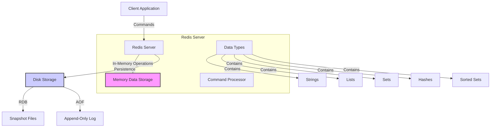

## Introduction: What is Redis?

Redis (Remote Dictionary Server) is an open-source, in-memory data store that functions as a NoSQL key-value database. What makes Redis special is its incredible speed - it stores and serves data from RAM rather than disk, making operations extremely fast while still offering durability by persisting data to disk.

Redis stands out with several key characteristics:

- **In-memory storage**: All data lives in RAM for fast access
- **Simple but powerful data structures**: Strings, Lists, Sets, Hashes, and more
- **Single-threaded architecture**: Eliminates complex locking mechanisms
- **High performance**: Can handle nearly 100,000 requests per second

Before diving in, let's ensure you have everything needed to follow along successfully.

## Prerequisites

- Basic understanding of command-line interfaces
- Familiarity with key-value data models is helpful but not required
- For production use: Docker (optional) or admin rights on your system

With these basics covered, let's get Redis up and running on your system.

## Installation and Setup

You can install Redis using either a direct installation or Docker. The Docker approach is especially beginner-friendly as it includes a helpful web UI.

### Method 1: Direct Installation (Ubuntu)

```bash
# Install Redis
sudo apt-get install redis-server

# Start Redis server
sudo systemctl start redis-server

# Verify Redis is running
redis-cli ping
# Should return "PONG" if working correctly
```

### Method 2: Using Docker (Recommended for beginners)

```bash
# Pull and run Redis with RedisInsight web UI
docker run -d --name redis-stack -p 6379:6379 -p 8001:8001 redis/redis-stack:latest

# Connect to Redis CLI
docker exec -it redis-stack redis-cli

# Test connection
ping
# Should return "PONG"
```

The RedisInsight web UI will be available at `http://localhost:8001` - a helpful visual tool for exploring Redis.

Now that we have Redis running, let's explore its fundamental data types and the commands to manipulate them.

## Redis Core Data Types and Commands

Redis offers several powerful data structures, each designed for specific use cases. Let's explore the most commonly used ones.

### 1. Strings - The Basic Building Block

Strings can store text, numbers, or binary data up to 512MB.

```
# Basic string operations
SET user:name "John Doe"    # Set a key-value pair
GET user:name               # Returns "John Doe"
SET counter 1               # Strings can store numbers too
INCR counter                # Atomically increments to 2
GET counter                 # Returns "2"

# Multiple operations
MSET item1 "apple" item2 "orange" item3 "banana"  # Set multiple keys
MGET item1 item2 item3                            # Get multiple values in one command
# Returns: 1) "apple" 2) "orange" 3) "banana"
```

### 2. Lists - Perfect for Queues and Stacks

Building on our understanding of strings, lists provide ordered collections of string values, making them ideal for implementing message queues or tracking recent items.

```
# Creating and manipulating lists
LPUSH tasks "send-email"     # Add to left (beginning)
LPUSH tasks "process-order"  # Now at beginning
RPUSH tasks "update-status"  # Add to right (end)

LRANGE tasks 0 -1            # Get all items (0 to -1 means all)
# Returns: 1) "process-order" 2) "send-email" 3) "update-status"

# Queue operations
LPOP tasks                   # Remove and return left item ("process-order")
RPOP tasks                   # Remove and return right item ("update-status")
```

### 3. Sets - Collections of Unique Items

When you need to store collections of unique items and perform set operations, Redis sets provide an elegant solution.

```
# Working with sets
SADD tags "redis"           # Add to set
SADD tags "nosql" "database" # Add multiple values
SADD tags "redis"           # Duplicates are ignored (returns 0)

SMEMBERS tags               # Get all set members
# Returns: 1) "redis" 2) "nosql" 3) "database"

# Set operations
SADD fruits "apple" "banana" "orange"
SADD tropical "banana" "pineapple" "mango"

SINTER fruits tropical      # Set intersection - items in both sets
# Returns: 1) "banana"

SUNION fruits tropical      # Set union - all unique items
# Returns: 1) "apple" 2) "banana" 3) "orange" 4) "pineapple" 5) "mango"

SDIFF fruits tropical       # Set difference - in fruits but not in tropical
# Returns: 1) "apple" 2) "orange"
```

### 4. Hashes - For Structured Data

Hashes allow you to represent objects with multiple fields, similar to dictionaries or JSON objects.

```
# Creating and updating hashes
HSET user:100 name "Maria" email "maria@example.com" age 28
# Returns 3 (number of fields set)

HGET user:100 name          # Get a specific field
# Returns "Maria"

HGETALL user:100            # Get all fields and values
# Returns: 1) "name" 2) "Maria" 3) "email" 4) "maria@example.com" 5) "age" 6) "28"

HINCRBY user:100 age 1      # Increment numeric field
# Returns 29
```

### 5. Working with Expirations

One of Redis's powerful features is the ability to automatically expire keys after a specified time - making it perfect for caching scenarios.

```
# Setting expirations
SET session:user123 "active" EX 3600    # Set with 1-hour expiration
TTL session:user123                      # Get remaining time in seconds
# Returns something like 3598

EXPIRE session:user123 300               # Update expiration to 5 minutes
# Returns 1 (success)

# After the expiration time
GET session:user123                      # Key automatically deleted
# Returns nil
```

Now that we understand these fundamental data types, let's see how to apply them in a real-world scenario.

## Practical Example: Building a Caching Layer with Node.js

Here's how you can use Redis to dramatically improve application performance by implementing a simple caching layer:

```javascript
// app.js - A simple caching example with Redis and Express
const express = require('express');
const axios = require('axios');
const redis = require('redis');

const app = express();
const PORT = 3000;

// Create Redis client
const redisClient = redis.createClient({
  // For default local Redis installation:
  // url: 'redis://localhost:6379'

  // If using Docker from our installation example:
  url: 'redis://localhost:6379',
});

// Connect to Redis
(async () => {
  await redisClient.connect();
  console.log('Connected to Redis');
})();

// Handle Redis connection errors
redisClient.on('error', (err) => {
  console.error('Redis Error:', err);
});

// API route with Redis caching
app.get('/api/users', async (req, res) => {
  try {
    // Check if data exists in cache
    const cacheKey = 'api:users';
    const cachedData = await redisClient.get(cacheKey);

    if (cachedData) {
      console.log('Cache HIT - Returning cached data');
      return res.json(JSON.parse(cachedData));
    }

    console.log('Cache MISS - Fetching from API');

    // If not in cache, fetch from API
    const response = await axios.get(
      'https://jsonplaceholder.typicode.com/users',
    );
    const users = response.data;

    // Store in cache for 1 hour (3600 seconds)
    await redisClient.setEx(cacheKey, 3600, JSON.stringify(users));

    // Return the data
    res.json(users);
  } catch (error) {
    console.error('Error:', error);
    res.status(500).json({ error: 'An error occurred' });
  }
});

app.listen(PORT, () => {
  console.log(`Server running on port ${PORT}`);
});

// To run this:
// 1. npm init -y
// 2. npm install express axios redis
// 3. node app.js
```

This implementation demonstrates Redis's power as a caching layer. The first request might take 300-500ms, but subsequent requests can be as fast as 5-10ms - a dramatic improvement that your users will definitely notice.

While Redis excels as an in-memory database, you might wonder about data persistence. Let's look at how Redis handles this crucial aspect.

## Redis Data Persistence

Despite being an in-memory database, Redis provides durability through two complementary persistence mechanisms:

### RDB (Redis Database) Snapshots

RDB creates point-in-time snapshots of your dataset at specified intervals.

```
# In redis.conf or via CLI
SAVE 900 1      # Save if at least 1 key changed in 900 seconds (15 minutes)
SAVE 300 10     # Save if at least 10 keys changed in 300 seconds (5 minutes)
SAVE 60 10000   # Save if at least 10,000 keys changed in 60 seconds (1 minute)

# Manual snapshot
SAVE            # Blocking save
BGSAVE          # Non-blocking save in background
```

### AOF (Append Only File)

AOF records every write operation in a log file that can be replayed during restart, offering more durability at the cost of larger files.

```
# In redis.conf
appendonly yes           # Enable AOF
appendfsync everysec     # Sync strategy (always, everysec, no)
```

With these persistence options understood, let's explore some common Redis use cases that go beyond simple caching.

## Common Redis Use Cases

Redis's versatility makes it suitable for a variety of scenarios. Here are some practical applications:

### 1. Session Store

Redis is perfect for storing session data due to its speed and built-in expiration:

```javascript
// Express session with Redis
const session = require('express-session');
const RedisStore = require('connect-redis').default;

app.use(
  session({
    store: new RedisStore({ client: redisClient }),
    secret: 'your-secret-key',
    resave: false,
    saveUninitialized: false,
    cookie: { maxAge: 86400000 }, // 24 hours
  }),
);
```

### 2. Rate Limiting

Protect your APIs from abuse by implementing rate limiting with Redis:

```javascript
// Simple rate limiter middleware
async function rateLimiter(req, res, next) {
  const ip = req.ip;
  const key = `ratelimit:${ip}`;

  // Get current request count
  let count = (await redisClient.get(key)) || 0;
  count = parseInt(count);

  if (count >= 100) {
    // Over limit - 100 requests per hour
    return res.status(429).json({ error: 'Too many requests' });
  }

  // Increment count and set expiry
  if (count === 0) {
    // First request - set with expiry
    await redisClient.setEx(key, 3600, 1);
  } else {
    // Increment existing key
    await redisClient.incr(key);
  }

  next();
}

app.use(rateLimiter);
```

### 3. Distributed Locks

Coordinate between multiple processes or servers with Redis-based distributed locks:

```javascript
// Implementing a distributed lock
async function acquireLock(lockName, timeout = 10) {
  // Set key only if it doesn't exist, with expiry in seconds
  const result = await redisClient.set(`lock:${lockName}`, 'locked', {
    NX: true,
    EX: timeout,
  });

  return result === 'OK';
}

async function releaseLock(lockName) {
  return await redisClient.del(`lock:${lockName}`);
}

// Example usage
async function processPayment(orderId) {
  const lockName = `order:${orderId}`;

  if (await acquireLock(lockName)) {
    try {
      // Process payment safely - only one process can do this at a time
      console.log(`Processing payment for order ${orderId}`);
      // ... payment processing logic
    } finally {
      // Always release the lock when done
      await releaseLock(lockName);
    }
  } else {
    console.log(`Order ${orderId} is being processed by another instance`);
  }
}
```

To help you get started with meaningful data, let's create a seeding script for Redis.

## Seeding Script for Redis

This script will populate Redis with sample data to help you experiment with different data types:

```javascript
// seed-redis.js - Populate Redis with sample data
const redis = require('redis');

async function seedRedis() {
  // Connect to Redis
  const client = redis.createClient({
    url: 'redis://localhost:6379',
  });

  await client.connect();
  console.log('Connected to Redis');

  try {
    // Clear existing data (optional)
    await client.flushDb();
    console.log('Database cleared');

    // Seed users (using hashes)
    console.log('Seeding users...');
    const users = [
      {
        id: 1,
        name: 'Alice Johnson',
        email: 'alice@example.com',
        role: 'admin',
      },
      { id: 2, name: 'Bob Smith', email: 'bob@example.com', role: 'user' },
      {
        id: 3,
        name: 'Charlie Brown',
        email: 'charlie@example.com',
        role: 'user',
      },
    ];

    for (const user of users) {
      await client.hSet(`user:${user.id}`, user);
    }

    // Seed products (using hashes)
    console.log('Seeding products...');
    const products = [
      { id: 101, name: 'Laptop', price: 999.99, stock: 50 },
      { id: 102, name: 'Smartphone', price: 699.99, stock: 100 },
      { id: 103, name: 'Headphones', price: 149.99, stock: 75 },
    ];

    for (const product of products) {
      await client.hSet(`product:${product.id}`, product);
    }

    // Create product category sets
    await client.sAdd(
      'category:electronics',
      'product:101',
      'product:102',
      'product:103',
    );
    await client.sAdd('category:mobile', 'product:102');

    // Add order data with expiration
    await client.hSet('order:1001', {
      userId: 2,
      total: 1149.98,
      items: JSON.stringify([
        { productId: 102, quantity: 1 },
        { productId: 103, quantity: 1 },
      ]),
      status: 'pending',
    });

    // Set expiry for temporary data (24 hours)
    await client.expire('order:1001', 86400);

    // Add a sorted set for product rankings
    await client.zAdd('product:rankings', [
      { score: 4.7, value: 'product:101' },
      { score: 4.9, value: 'product:102' },
      { score: 4.5, value: 'product:103' },
    ]);

    console.log('Seeding completed successfully');
  } catch (error) {
    console.error('Error seeding Redis:', error);
  } finally {
    await client.quit();
    console.log('Redis connection closed');
  }
}

seedRedis();

// To run:
// 1. npm install redis
// 2. node seed-redis.js
```

To better understand how Redis works, let's visualize its architecture.

## Redis Architecture Visualization



As you continue working with Redis, keep these best practices in mind for optimal performance and reliability.

## Best Practices for Daily Redis Use

1. **Use descriptive key naming conventions**: `object-type:id:field` (e.g., `user:1000:session`) helps organize and retrieve data logically.

2. **Set appropriate TTLs**: Don't cache forever; set realistic expiration times based on data volatility and access patterns.

3. **Use pipelining** for bulk operations to reduce network overhead when sending multiple commands at once.

4. **Monitor memory usage**: Use `INFO memory` command regularly to ensure Redis doesn't exceed available RAM.

5. **Plan for persistence**: Configure RDB and/or AOF based on your durability needs and acceptable data loss window.

6. **Implement proper error handling**: Redis can fail too; always handle connection errors gracefully in your application.

We've covered the essential 85% of Redis knowledge you'll need for daily use. However, there's still more to explore for advanced scenarios.

## The Remaining 15%: Advanced Redis Features

Once you're comfortable with the fundamentals, these advanced topics can help you solve more complex problems:

### Advanced Data Structures

Redis offers specialized data structures for specific use cases:

- **Sorted Sets (ZSET)**: Sets with scores for ranking and range queries - perfect for leaderboards and time-ordered data.
- **Bitmaps**: Space-efficient structure for boolean data such as user activity tracking or feature flags.
- **HyperLogLog**: Probabilistic data structure for unique value counting with minimal memory usage.
- **Streams**: Append-only data structure for event sourcing and message queues, with consumer groups.
- **Geospatial indexes**: Store and query location data with distance calculations and radius searches.

### Redis Modules & Extensions

Redis can be extended with powerful modules:

- **RedisJSON**: Native JSON handling in Redis for complex document storage.
- **RediSearch**: Full-text search capabilities with advanced querying.
- **RedisGraph**: Graph database functionality for relationship-based data.
- **RedisTimeSeries**: Time series data handling with downsampling and aggregation.
- **RedisAI**: Machine learning model serving directly from Redis.

### High Availability & Scaling

For production environments, Redis offers several options:

- **Redis Sentinel**: Monitoring, notification, and automatic failover for high availability.
- **Redis Cluster**: Horizontal scaling with automatic data sharding across multiple nodes.
- **Redis Replication**: Master-replica setup for read scaling and data redundancy.

### Advanced Programming Techniques

For more complex operations:

- **Lua Scripting**: Writing custom atomic operations that execute directly on the Redis server.
- **Pub/Sub Messaging**: Real-time message broadcasting between publishers and subscribers.
- **Transactions**: Using MULTI/EXEC for atomic operations across multiple commands.
- **Server-side Lua caching**: Optimizing with EVAL SCRIPT LOAD for frequently used scripts.

### Enterprise & Cloud Options

For managed Redis solutions:

- **Redis Enterprise**: Commercial offering with enhanced features and support.
- **AWS ElastiCache**: Amazon's managed Redis service with simplified deployment.
- **Azure Cache for Redis**: Microsoft's managed Redis offering integrated with Azure.
- **Google Cloud Memorystore**: Google's managed Redis service for GCP environments.

## Getting Started with the 15%

To begin exploring these advanced topics:

1. Try sorted sets with `ZADD` and `ZRANGE` commands for ranking and leaderboards
2. Experiment with Redis Pub/Sub using `SUBSCRIBE` and `PUBLISH` commands
3. Test a simple master-replica setup for high availability
4. Look into Redis modules that match your specific use cases
5. Visit [Redis University](https://university.redis.com/) for free specialized courses

By mastering the core 85% covered in this crash course, you're well-equipped to start exploring these advanced features as your needs evolve. Redis's elegance lies in its simplicity combined with impressive versatility - allowing you to start simple and grow as your application demands.
