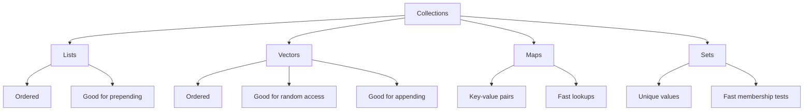
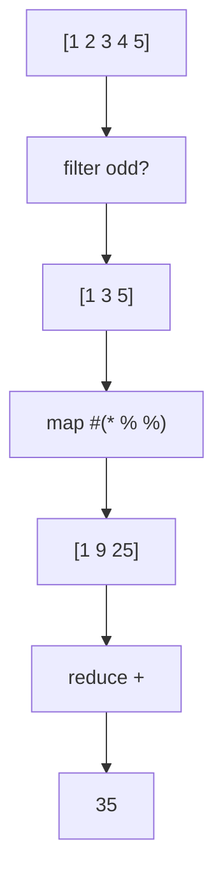
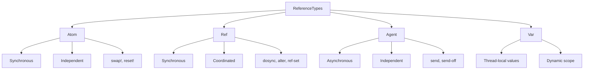

Hey there! Let's dive into the fascinating world of Clojure over our virtual coffee. By the end of this guide, you'll know enough to be dangerous with Clojure and have a clear path to explore the rest.

## What is Clojure?

Clojure is a modern Lisp dialect that runs on the Java Virtual Machine (JVM). Created by Rich Hickey in 2007, it combines the elegance of Lisp with practical access to Java's ecosystem. It's a functional programming language that emphasizes immutability and simplicity.

```
;; This is a Clojure comment
;; Hello, World! in Clojure
(println "Hello, World!")
;; => Hello, World!
```

## Getting Started with Clojure

### Installation

First, let's get you set up:

1. **Install Java** - Clojure runs on the JVM, so you need Java (JDK 8 or newer)
2. **Install Leiningen** - The most popular build tool for Clojure

For Mac (using Homebrew):

```
brew install leiningen
```

For Windows:

1. Install Java
2. Download the `lein.bat` script from https://leiningen.org/
3. Place it on your PATH

For Linux:

```
sudo apt-get install leiningen  # Debian/Ubuntu
```

### Creating Your First Project

```
lein new app my-first-project
cd my-first-project
```

This creates a new project with a standard structure:

```clojure
my-first-project/
  ├── README.md
  ├── doc/
  ├── project.clj         # Project configuration
  ├── resources/
  ├── src/                # Source code
  │   └── my_first_project/
  │       └── core.clj    # Main file
  └── test/               # Test files
```

### Running Your Code

```
lein run          # Run the application
lein repl         # Start a REPL (interactive shell)
```

## Clojure Syntax and Data Structures

Clojure's syntax is based on S-expressions: lists enclosed in parentheses where the first element is the function and the rest are arguments.

```clojure
;; Basic syntax: (function arg1 arg2 ...)
(+ 1 2 3)                  ; => 6
(str "Hello" " " "World")  ; => "Hello World"
```

### Core Data Types

```clojure
;; Numbers
42          ; integer
3.14        ; floating-point
22/7        ; ratio

;; Strings
"Hello"

;; Characters
\a \b \c

;; Symbols
'mySymbol

;; Keywords (often used as keys)
:name
:age

;; Booleans
true
false

;; Nil (like null in other languages)
nil
```

### Collections

Clojure has four primary collection types, all immutable:

```clojure
;; Lists - ordered collections, efficient at prepending
'(1 2 3 4)
(list 1 2 3 4)

;; Vectors - ordered collections, efficient at appending and random access
[1 2 3 4]
(vector 1 2 3 4)

;; Maps - key-value pairs
{:name "Alice" :age 30}
(hash-map :name "Alice" :age 30)

;; Sets - unique values
#{1 2 3 4}
(hash-set 1 2 3 4)
```

Let's visualize these collections:



Think of this like a family tree of containers - each with their own special talents! Lists are great when you're constantly adding things to the front, vectors when you need to grab items by position, maps when you need to look things up by name, and sets when you only want unique items.

## Functions: The Heart of Clojure

### Defining Functions

```clojure
;; Define a simple function
(defn greet
  "Returns a greeting message" ; Documentation string
  [name]                       ; Parameter list
  (str "Hello, " name "!"))    ; Function body

;; Call the function
(greet "Alice")  ; => "Hello, Alice!"

;; Anonymous functions (two ways)
(fn [x] (* x x))           ; Traditional way
#(* % %)                   ; Shorthand with % as argument
```

### Multi-arity Functions

```clojure
;; A function that works with different numbers of arguments
(defn greet
  ([] (greet "World"))                     ; 0 arguments
  ([name] (str "Hello, " name "!"))        ; 1 argument
  ([title name] (str "Hello, " title " " name "!"))) ; 2 arguments

(greet)                ; => "Hello, World!"
(greet "Alice")        ; => "Hello, Alice!"
(greet "Ms." "Alice")  ; => "Hello, Ms. Alice!"
```

### Variadic Functions

```clojure
;; A function that takes a variable number of arguments
(defn welcome [greeting & names]
  (str greeting " " (clojure.string/join ", " names)))

(welcome "Hello" "Alice" "Bob" "Charlie")
;; => "Hello Alice, Bob, Charlie"
```

## Let's Get Functional

Clojure is a functional programming language, emphasizing:

1. **Immutability** - Data doesn't change; new values are created
2. **Pure functions** - Same input always yields same output, no side effects
3. **First-class functions** - Functions can be passed as arguments

### Working with Collections

```clojure
;; Using map to transform each element
(map #(* % 2) [1 2 3 4 5])  ; => (2 4 6 8 10)

;; Using filter to select elements
(filter even? [1 2 3 4 5])  ; => (2 4)

;; Using reduce to combine elements
(reduce + [1 2 3 4 5])      ; => 15

;; Chaining operations
(->> [1 2 3 4 5]            ; Start with this data
     (filter odd?)          ; Keep odd numbers
     (map #(* % %))         ; Square each
     (reduce +))            ; Sum them
;; => 35 (1² + 3² + 5² = 1 + 9 + 25 = 35)
```

Let's visualize the threading macro:



This is like a cooking recipe where each step transforms the ingredients! We start with our numbers, filter out the even ones, square what's left, and then add everything together. The threading macro (`->>`) just makes this flow really clean and readable.

### Destructuring

Destructuring lets you extract values from collections easily:

```clojure
;; Destructuring a vector
(let [[first second & rest] [1 2 3 4 5]]
  (println "First:" first)       ; => First: 1
  (println "Second:" second)     ; => Second: 2
  (println "The rest:" rest))    ; => The rest: (3 4 5)

;; Destructuring a map
(let [{name :name age :age} {:name "Alice" :age 30 :city "Wonderland"}]
  (println name "is" age "years old")) ; => Alice is 30 years old

;; Using :keys shorthand
(let [{:keys [name age]} {:name "Alice" :age 30}]
  (println name "is" age "years old")) ; => Alice is 30 years old
```

## State Management

Clojure provides several reference types for managing state safely:

### Atoms

Atoms provide synchronous, independent state:

```clojure
;; Create an atom
(def counter (atom 0))

;; Read the current value
@counter  ; => 0

;; Update the value
(swap! counter inc)  ; => 1
(swap! counter + 10) ; => 11

;; Set a new value directly
(reset! counter 0)   ; => 0
```

### Refs and Transactions

Refs allow coordinated changes to multiple references:

```clojure
(def account1 (ref 1000))
(def account2 (ref 500))

;; Atomically transfer funds
(dosync
  (alter account1 - 100)
  (alter account2 + 100))

;; Check new balances
@account1  ; => 900
@account2  ; => 600
```

Let's visualize Clojure's reference types:



Imagine these as different ways to handle change in your application. Atoms are like a box with one value you can swap out safely. Refs are for when multiple things need to change together (like both sides of a bank transfer). Agents are like little helpers that do tasks for you in the background. And Vars are values that can change depending on who's looking at them!

## Building a Simple To-Do List Application

Let's put it all together with a practical example - a simple to-do list app:

```clojure
(ns todo-app.core
  (:require [clojure.string :as str]))

;; Our state - an atom holding a vector of maps
(def todos (atom []))

;; Add a new todo
(defn add-todo
  "Add a new todo item"
  [description]
  (swap! todos conj {:id (count @todos)
                     :description description
                     :completed false}))

;; Toggle the completed status
(defn toggle-completed
  "Toggle the completed status of a todo by id"
  [id]
  (swap! todos (fn [items]
                 (map (fn [item]
                        (if (= id (:id item))
                          (update item :completed not)
                          item))
                      items))))

;; Remove a todo
(defn remove-todo
  "Remove a todo by id"
  [id]
  (swap! todos (fn [items]
                 (vec (remove #(= id (:id %)) items)))))

;; Display all todos
(defn show-todos
  "Display all todos"
  []
  (if (empty? @todos)
    (println "No todos yet!")
    (doseq [todo @todos]
      (println (str (if (:completed todo) "[X] " "[ ] ")
                    (:id todo) ": "
                    (:description todo))))))

;; Let's use our app

;; Add some todos
(add-todo "Learn Clojure basics")
(add-todo "Build a small project")
(add-todo "Read Clojure documentation")

;; Show all todos
(show-todos)
;; => [ ] 0: Learn Clojure basics
;; => [ ] 1: Build a small project
;; => [ ] 2: Read Clojure documentation

;; Mark the first as complete
(toggle-completed 0)
(show-todos)
;; => [X] 0: Learn Clojure basics
;; => [ ] 1: Build a small project
;; => [ ] 2: Read Clojure documentation

;; Remove the second todo
(remove-todo 1)
(show-todos)
;; => [X] 0: Learn Clojure basics
;; => [ ] 2: Read Clojure documentation
```

## Interacting with Java

Clojure runs on the JVM, so you can use Java libraries directly:

```clojure
;; Import Java classes
(import java.util.Date)
(import java.text.SimpleDateFormat)

;; Create a Date object
(def now (Date.))

;; Format the date using a Java class
(def formatter (SimpleDateFormat. "yyyy-MM-dd"))
(.format formatter now)
;; => "2025-03-25" (today's date)

;; Using the dot special form for methods
(. now getTime)            ; => long timestamp
(.getTime now)             ; Same thing, shorter syntax

;; Using doto for multiple operations
(doto (java.util.HashMap.)
  (.put "key1" "value1")
  (.put "key2" "value2"))
```

## The Power of Macros

Macros allow you to extend the language itself:

```clojure
;; A simple unless macro
(defmacro unless
  "Evaluates body if condition is false"
  [condition & body]
  `(if (not ~condition)
     (do ~@body)))

;; Using our macro
(unless false
  (println "This will print"))
;; => This will print

(unless true
  (println "This won't print"))
;; => nil
```

## Practical Workflow with Clojure

When developing in Clojure, a typical workflow looks like:

1. Start a REPL: `lein repl`
2. Write code incrementally, testing in the REPL
3. Build your application: `lein uberjar` (creates a standalone JAR)
4. Run your application: `java -jar target/my-app-standalone.jar`

## The Remaining 15%: Where to Go Next

You've now learned the essential 85% of Clojure. Here's what to explore next:

1. **Advanced Concurrency**

   - Software Transactional Memory (STM) in depth
   - core.async for CSP-style concurrency

2. **ClojureScript**

   - Clojure that compiles to JavaScript
   - React integration with Reagent or re-frame

3. **Spec**

   - Data specification and validation
   - Generative testing

4. **Web Development**

   - Ring for HTTP abstraction
   - Compojure/Reitit for routing
   - Hiccup for HTML generation

5. **Database Access**

   - JDBC integration
   - next.jdbc for modern database access
   - Datomic and DataScript

6. **Metaprogramming**

   - Advanced macro techniques
   - Creating domain-specific languages (DSLs)

7. **Production Deployment**
   - Containerization with Docker
   - Uberjar deployment strategies
   - Monitoring and logging

Remember, the best way to learn is by doing. Start with small projects and gradually build up to more complex ones. Happy coding!
