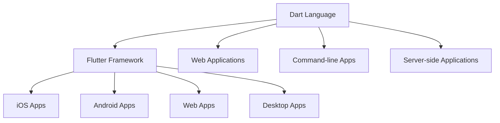
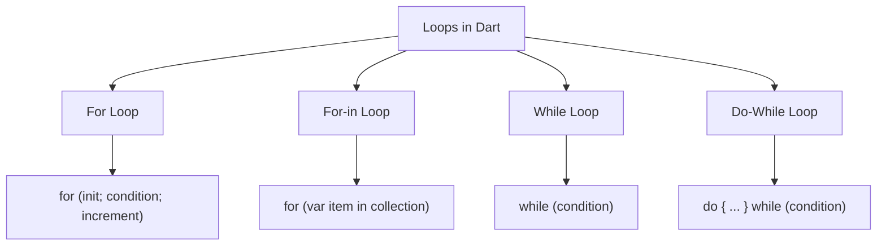
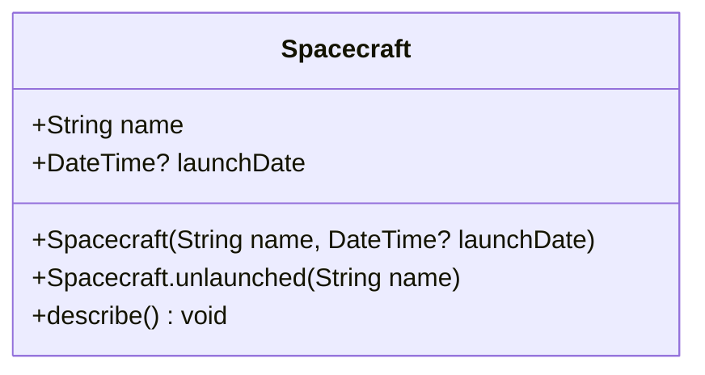
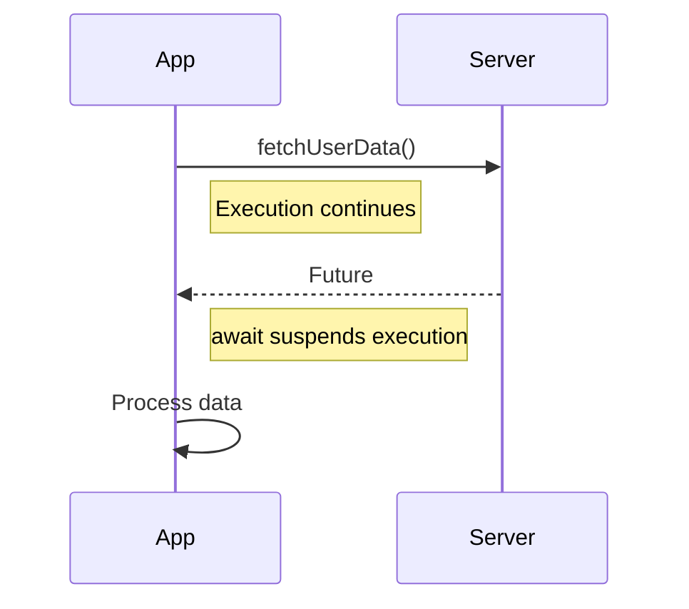

Dart is a client-optimized programming language developed by Google, primarily known as the language powering Flutter - a framework for building cross-platform applications. This crash course covers 85% of what you'll encounter daily in Dart programming, providing you with the foundation to explore the remaining 15% on your own.

## Introduction to Dart

Dart is a modern, object-oriented programming language optimized for building user interfaces across multiple platforms. Created by Google, it has gained significant popularity primarily because it powers Flutter, which allows developers to create applications for mobile, web, and desktop from a single codebase.

### Key Features of Dart

Dart comes with several distinguishing features that make it powerful and efficient:

- **Statically typed**: Variables have specific types that cannot change, enhancing code safety and performance.
- **Client-optimized**: Specifically designed for creating fast applications on any platform.
- **Null safety**: With sound null safety, variables can't contain null values unless explicitly specified.
- **Two compilation modes**: Just-in-Time (JIT) compilation during development for fast iteration, and Ahead-of-Time (AOT) compilation for production to optimize performance.
- **Cross-platform**: Used to build applications for Android, iOS, web, and desktop platforms.

The diagram below illustrates Dart's versatility across different platforms and applications:



## Setting Up Dart

Before diving into programming with Dart, you'll need to set up your development environment by installing the Dart SDK.

### Installing Dart SDK

The Dart SDK (Software Development Kit) contains the tools and libraries necessary for Dart development. Installation varies by operating system:

```bash
# For macOS using Homebrew
brew tap dart-lang/dart
brew install dart

# For Windows using Chocolatey
choco install dart-sdk

# For Linux using apt
sudo apt-get update
sudo apt-get install dart
```

### Using DartPad

If you prefer to start experimenting without installing anything, DartPad offers an excellent alternative. It's an online editor that allows you to write and run Dart code directly in your browser. Simply visit https://dartpad.dev/ to get started.

## Dart Fundamentals

Now that you have your environment set up, let's explore the fundamental concepts of Dart programming.

### Hello World

As with most programming languages, we'll start with a simple "Hello World" program. In Dart, every program begins with the `main()` function, which serves as the entry point:

```dart
void main() {
  print('Hello, World!'); // Outputs: Hello, World!
}
```

### Variables and Data Types

Dart is a statically typed language, meaning variable types are known at compile time. However, it also supports type inference with the `var` keyword, making your code more concise:

```dart
// Explicitly typed variables
String name = 'Voyager I';
int year = 1977;
double antennaDiameter = 3.7;
bool isOperational = true;

// Type inference
var spacecraft = 'Voyager I'; // String
var launchYear = 1977; // int
var isActive = true; // bool
```

#### Special Variables: final and const

Dart provides two special variable types that help you create immutable values:

```dart
// final: Can be assigned a value only once, but the value is determined at runtime
final launchDate = DateTime.now(); // Value set at runtime

// const: Like final, but the value must be known at compile time
const pi = 3.14159; // Value known at compile time
```

#### Null Safety

One of Dart's standout features is its sound null safety system, which helps prevent null reference exceptions. Variables cannot contain null unless explicitly declared nullable:

```dart
// Non-nullable variables
String name = 'Voyager';
int age = 40;

// Nullable variables
String? nullableName; // Can be null
int? nullableAge; // Can be null

// Assertion operator (!) - use when you're sure a value isn't null
String definiteName = nullableName!; // Throws if nullableName is null
```

### Control Flow

Control flow statements direct the execution path of your program. Dart supports standard control flow constructs found in most programming languages.

#### Conditional Statements

Conditional statements let your program make decisions based on conditions:

```dart
// If-else statements
if (year >= 2021) {
  print('21st century');
} else if (year >= 1901) {
  print('20th century');
} else {
  print('19th century or earlier');
}

// Ternary operator
var visibility = isOperational ? 'visible' : 'invisible';

// Switch statement
switch (command) {
  case 'OPEN':
    executeOpen();
    break;
  case 'CLOSE':
    executeClose();
    break;
  default:
    print('Unknown command');
}
```

#### Loops

Loops allow you to execute a block of code repeatedly. Dart provides several looping mechanisms:

```dart
// For loop
for (int i = 0; i < 5; i++) {
  print(i);
}

// For-in loop (iterating through a collection)
var planets = ['Mercury', 'Venus', 'Earth', 'Mars'];
for (var planet in planets) {
  print(planet);
}

// While loop
int i = 0;
while (i < 5) {
  print(i);
  i++;
}

// Do-while loop
i = 0;
do {
  print(i);
  i++;
} while (i < 5);
```

The following diagram illustrates the different types of loops in Dart:



### Functions

Functions are a cornerstone of structured programming. In Dart, functions are first-class objects, meaning they can be assigned to variables and passed as arguments to other functions:

```dart
// Basic function
int add(int a, int b) {
  return a + b;
}

// Arrow function (shorthand for simple functions)
int multiply(int a, int b) => a * b;

// Optional positional parameters
String sayHello(String name, [String greeting = 'Hello']) {
  return '$greeting, $name!';
}

// Named parameters
void printPersonDetails({required String name, int? age, String country = 'Unknown'}) {
  print('Name: $name, Age: ${age ?? 'Not specified'}, Country: $country');
}

// Functions as arguments
void executeFunction(Function callback) {
  callback();
}
```

### Collections

Collections are containers that group multiple objects together. Dart provides three main collection types: lists, sets, and maps.

#### Lists

Lists are ordered collections of objects:

```dart
// Creating a list
var planets = ['Mercury', 'Venus', 'Earth', 'Mars'];

// Accessing elements
var firstPlanet = planets[0]; // Mercury

// Adding elements
planets.add('Jupiter');

// Finding elements
var earthIndex = planets.indexOf('Earth'); // 2

// Iterating
planets.forEach((planet) => print(planet));
```

#### Sets

Sets are unordered collections of unique objects, useful when you want to ensure no duplicates exist:

```dart
// Creating a set
var elements = {'Hydrogen', 'Helium', 'Lithium'};

// Adding elements
elements.add('Beryllium');

// Checking elements
print(elements.contains('Helium')); // true

// Set operations
var nobleGases = {'Helium', 'Neon', 'Argon'};
var allElements = elements.union(nobleGases);
```

#### Maps

Maps are collections of key-value pairs, ideal for associating values with unique keys:

```dart
// Creating a map
var planetDistances = {
  'Mercury': 0.39,
  'Venus': 0.72,
  'Earth': 1.0,
  'Mars': 1.52
};

// Accessing values
var earthDistance = planetDistances['Earth']; // 1.0

// Adding entries
planetDistances['Jupiter'] = 5.2;

// Iterating
planetDistances.forEach((planet, distance) {
  print('$planet is $distance AU from the Sun');
});
```

## Object-Oriented Programming in Dart

Building on the fundamental concepts, let's explore Dart's object-oriented programming features. Dart is a class-based language with support for inheritance, interfaces, and mixins.

### Classes and Objects

Classes are blueprints for creating objects that encapsulate data and behavior:

```dart
class Spacecraft {
  String name;
  DateTime? launchDate;

  // Constructor
  Spacecraft(this.name, this.launchDate);

  // Named constructor
  Spacecraft.unlaunched(this.name) : launchDate = null;

  // Method
  void describe() {
    print('Spacecraft: $name');
    if (launchDate != null) {
      print('Launched: ${launchDate!.year}');
    } else {
      print('Unlaunched');
    }
  }
}

// Creating objects
var voyager = Spacecraft('Voyager I', DateTime(1977, 9, 5));
voyager.describe();

var voyager3 = Spacecraft.unlaunched('Voyager III');
voyager3.describe();
```

This diagram shows the structure of our Spacecraft class:



### Inheritance

Inheritance allows you to create new classes that reuse, extend, and modify the behavior defined in other classes. Dart supports single inheritance:

```dart
class Orbiter extends Spacecraft {
  double altitude;

  Orbiter(String name, DateTime? launchDate, this.altitude)
      : super(name, launchDate);

  @override
  void describe() {
    super.describe();
    print('Altitude: $altitude km');
  }
}

var hubble = Orbiter('Hubble Space Telescope', DateTime(1990, 4, 24), 540);
hubble.describe();
```

## Asynchronous Programming

Modern applications often need to handle operations that don't complete immediately, such as network requests or file operations. Dart provides robust support for asynchronous programming through Futures, async/await, and Streams.

### Futures

A Future represents a value or error that will be available at some time in the future:

```dart
Future<String> fetchUserData() {
  return Future.delayed(
    Duration(seconds: 2),
    () => '{"name": "John Doe", "email": "john@example.com"}'
  );
}

// Using a Future with then()
fetchUserData().then((data) {
  print('User data: $data');
}).catchError((error) {
  print('Error: $error');
});
```

### Async and Await

While Futures are powerful, the async and await keywords provide a more intuitive way to work with asynchronous operations:

```dart
// Async function
Future<void> printUserData() async {
  try {
    // Await suspends execution until the Future completes
    String data = await fetchUserData();
    print('User data: $data');
  } catch (error) {
    print('Error: $error');
  }
}

// Call the async function
printUserData();
```

This sequence diagram illustrates how async/await works in Dart:



### Streams

While Futures represent a single asynchronous value, Streams represent a sequence of asynchronous values:

```dart
// Creating a Stream
Stream<int> countStream(int max) async* {
  for (int i = 1; i <= max; i++) {
    await Future.delayed(Duration(seconds: 1));
    yield i; // Emit a value
  }
}

// Using a Stream
final subscription = countStream(5).listen(
  (data) => print('Data: $data'),
  onError: (error) => print('Error: $error'),
  onDone: () => print('Stream done'),
);

// Cancel subscription after 3 seconds
Future.delayed(Duration(seconds: 3), () {
  subscription.cancel();
  print('Subscription canceled');
});
```

## Working with Packages

As your applications grow more complex, you'll likely need functionality beyond Dart's standard library. Dart uses packages to manage shared software, with pub.dev serving as the official package repository.

### Using Packages

The process of incorporating packages into your project involves three simple steps:

1. Add package dependencies to your `pubspec.yaml` file:

```yaml
dependencies:
  http: ^0.13.5
  path: ^1.8.0
```

2. Install the packages:

```bash
dart pub get
```

3. Import and use the packages:

```dart
import 'package:http/http.dart' as http;

Future<void> fetchData() async {
  final response = await http.get(Uri.parse('https://api.example.com/data'));
  if (response.statusCode == 200) {
    print('Data: ${response.body}');
  } else {
    print('Failed to fetch data: ${response.statusCode}');
  }
}
```

## Practical Example: Building a Quiz App

To consolidate your understanding of the concepts we've covered, let's build a simple command-line quiz application. This example ties together multiple aspects of Dart programming:

```dart
import 'dart:io';

class Question {
  String text;
  List<String> options;
  int correctOptionIndex;

  Question(this.text, this.options, this.correctOptionIndex);

  bool checkAnswer(int userAnswer) {
    return userAnswer == correctOptionIndex;
  }
}

class Quiz {
  String name;
  List<Question> questions;
  int score = 0;

  Quiz(this.name, this.questions);

  void start() {
    print('Welcome to the $name quiz!');
    print('You will be asked ${questions.length} questions.\n');

    for (int i = 0; i < questions.length; i++) {
      var question = questions[i];
      print('Question ${i + 1}: ${question.text}');

      for (int j = 0; j < question.options.length; j++) {
        print('${j + 1}. ${question.options[j]}');
      }

      int? userAnswer;
      while (userAnswer == null || userAnswer < 1 || userAnswer > question.options.length) {
        stdout.write('Enter your answer (1-${question.options.length}): ');
        try {
          userAnswer = int.parse(stdin.readLineSync() ?? '0');
        } catch (e) {
          print('Please enter a valid number.');
        }
      }

      if (question.checkAnswer(userAnswer - 1)) {
        print('Correct!\n');
        score++;
      } else {
        print('Incorrect! The correct answer is: ${question.options[question.correctOptionIndex]}\n');
      }
    }

    print('Quiz completed! Your score: $score/${questions.length}');
    double percentage = score * 100 / questions.length;
    print('Percentage: ${percentage.toStringAsFixed(2)}%');
  }
}

void main() {
  var questions = [
    Question(
      'What is Dart?',
      [
        'A programming language developed by Google',
        'A type of arrow',
        'A database management system',
        'A web framework'
      ],
      0
    ),
    Question(
      'Which framework uses Dart as its primary language?',
      ['React Native', 'Flutter', 'Angular', 'Vue'],
      1
    ),
    Question(
      'What does AOT stand for in Dart?',
      ['Application Object Technology', 'Abstract Object Type', 'Ahead Of Time', 'All Of These'],
      2
    )
  ];

  var quiz = Quiz('Dart Basics', questions);
  quiz.start();
}
```

This quiz application demonstrates several key concepts:

- Class definition and inheritance
- Object creation and method invocation
- Input handling with error management
- Control flow with loops and conditionals
- String interpolation and formatting

## The Remaining 15%: Advanced Dart Topics

While this crash course has equipped you with the knowledge to handle 85% of your daily Dart programming tasks, there are additional advanced topics that constitute the remaining 15%. As you become more comfortable with the fundamentals, consider exploring these areas:

1. **Isolates for concurrent programming**: Dart's approach to handle concurrent execution without sharing memory.
2. **Generics with advanced constraints**: Creating more specialized generic types with bounds and extensions.
3. **Metadata annotations**: Using metadata (@annotations) to provide additional information about code.
4. **Native Extensions**: Interfacing with platform-specific code written in languages like C/C++.
5. **Reflection and mirrors**: Dynamic code inspection and manipulation (though limited in Dart).
6. **Advanced Stream operations**: Combining, transforming, and handling backpressure with Streams.
7. **Custom operators**: Implementing and overriding operators in Dart classes.
8. **Advanced patterns and pattern matching**: Using destructuring and pattern matching features introduced in Dart 3.
9. **Records**: Working with compound data using the tuple-like records feature.
10. **Macros**: Code generation at compile time (an upcoming feature in Dart).

## Conclusion

You've now completed a comprehensive crash course on Dart programming that covers 85% of what you'll encounter in everyday development. From fundamental concepts like variables and control flow to more advanced topics like object-oriented programming and asynchronous operations, you've built a solid foundation for developing applications with Dart.

As you continue your journey, remember that programming proficiency comes through practice. Start with small projects that reinforce the concepts you've learned, then gradually tackle more complex challenges. When you're ready, explore the advanced topics outlined in the previous section to deepen your expertise.

The Dart ecosystem is dynamic and continually evolving, with new features being added regularly to enhance developer productivity. Keep an eye on the official Dart documentation at dart.dev for updates and detailed information on any topic that interests you.

Whether you're building mobile apps with Flutter, web applications, or command-line tools, the skills you've acquired in this crash course will serve as a valuable foundation for your Dart programming endeavors.
