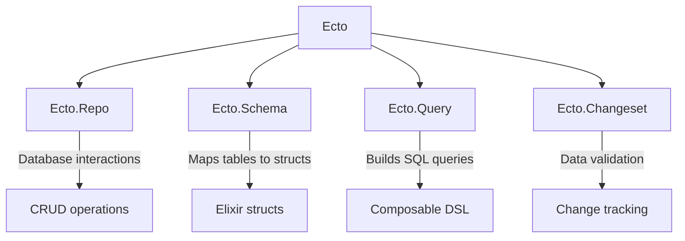
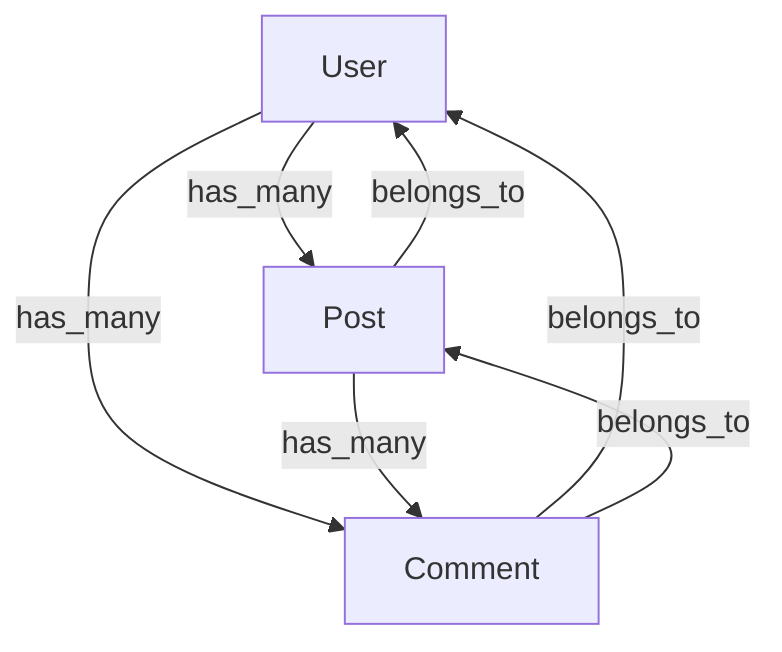
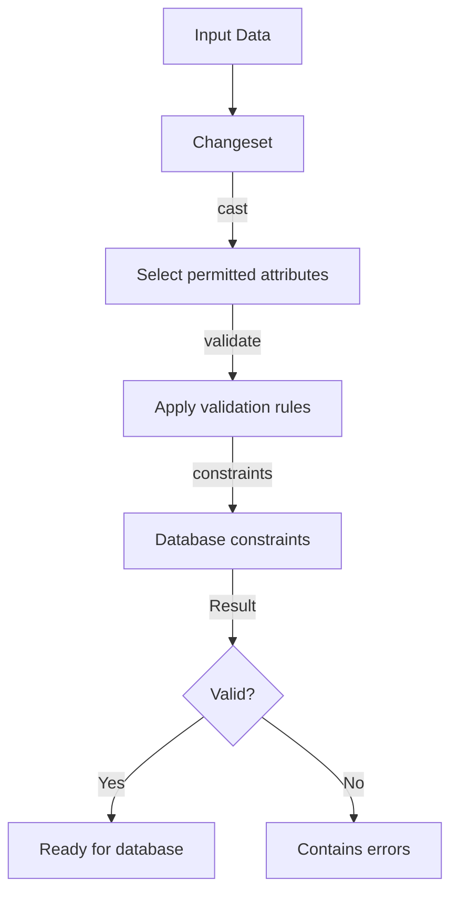
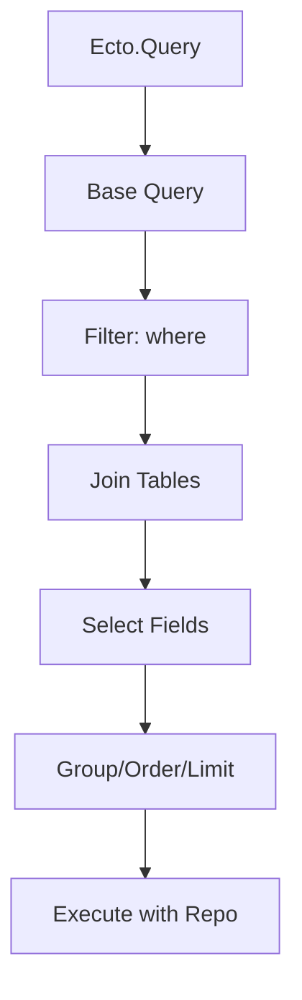

This crash course covers 85% of what you'll need for daily Ecto usage, with enough knowledge to explore the remaining advanced features independently.

## What is Ecto?

Ecto is the primary database toolkit for Elixir applications. It provides a structured approach to interacting with databases (primarily SQL databases like PostgreSQL and MySQL) through four main components:



## Installation and Setup

1. Create a new Elixir application with supervision tree:

```elixir
mix new my_app --sup
# The --sup flag is important as Ecto requires a supervision tree
```

2. Add dependencies to `mix.exs`:

```elixir
defp deps do
  [
    {:ecto_sql, "~> 3.10"},
    {:postgrex, "~> 0.17"} # For PostgreSQL
  ]
end
```

3. Configure Ecto in `config/config.exs`:

```elixir
config :my_app, MyApp.Repo,
  database: "my_app_dev",
  username: "postgres",
  password: "postgres",
  hostname: "localhost",
  port: 5432

config :my_app, ecto_repos: [MyApp.Repo]
```

4. Create a Repo module in `lib/my_app/repo.ex`:

```elixir
defmodule MyApp.Repo do
  use Ecto.Repo,
    otp_app: :my_app,
    adapter: Ecto.Adapters.Postgres
end
```

5. Add Repo to your supervision tree in `lib/my_app/application.ex`:

```elixir
def start(_type, _args) do
  children = [
    MyApp.Repo
    # other children...
  ]

  opts = [strategy: :one_for_one, name: MyApp.Supervisor]
  Supervisor.start_link(children, opts)
end
```

6. Create and migrate your database:

```bash
mix ecto.create
mix ecto.migrate
```

## Database Schema and Migrations

Before defining Ecto schemas, you need to create database tables. Migrations are used for this purpose:

1. Generate a migration:

```bash
mix ecto.gen.migration create_users
```

2. Define table structure in the migration file (in `priv/repo/migrations/`):

```elixir
defmodule MyApp.Repo.Migrations.CreateUsers do
  use Ecto.Migration

  def change do
    create table(:users) do
      add :username, :string, null: false
      add :email, :string, null: false
      add :password_hash, :string, null: false
      add :is_admin, :boolean, default: false

      timestamps() # adds inserted_at and updated_at fields
    end

    create unique_index(:users, [:email])
    create unique_index(:users, [:username])
  end
end
```

3. Run the migration:

```bash
mix ecto.migrate
```

## Ecto.Schema: Mapping Database Tables to Elixir Structs

Schemas define the structure of your data by mapping database tables to Elixir structs:

```elixir
# lib/my_app/user.ex
defmodule MyApp.User do
  use Ecto.Schema
  import Ecto.Changeset

  schema "users" do
    field :username, :string
    field :email, :string
    field :password_hash, :string
    field :is_admin, :boolean, default: false

    timestamps() # adds inserted_at and updated_at fields
  end

  # Changeset function will be defined later
end
```

### Associations Between Schemas

Ecto allows you to define relationships between tables:



In code:

```elixir
defmodule MyApp.User do
  use Ecto.Schema

  schema "users" do
    field :username, :string
    # other fields...

    has_many :posts, MyApp.Post
    has_many :comments, MyApp.Comment

    timestamps()
  end
end

defmodule MyApp.Post do
  use Ecto.Schema

  schema "posts" do
    field :title, :string
    field :content, :string

    belongs_to :user, MyApp.User
    has_many :comments, MyApp.Comment

    timestamps()
  end
end

defmodule MyApp.Comment do
  use Ecto.Schema

  schema "comments" do
    field :content, :string

    belongs_to :user, MyApp.User
    belongs_to :post, MyApp.Post

    timestamps()
  end
end
```

## Ecto.Changeset: Validating and Tracking Changes

Changesets provide a way to filter, cast, and validate data before inserting or updating the database.



Example implementation:

```elixir
# Add this to your MyApp.User module
def changeset(user, attrs) do
  user
  |> cast(attrs, [:username, :email, :password_hash, :is_admin])
  |> validate_required([:username, :email, :password_hash])
  |> validate_format(:email, ~r/@/)
  |> validate_length(:username, min: 3, max: 20)
  |> unique_constraint(:username)
  |> unique_constraint(:email)
end
```

Using the changeset:

```elixir
# Create a changeset for a new user
attrs = %{username: "johndoe", email: "john@example.com", password_hash: "hashed_password"}
changeset = MyApp.User.changeset(%MyApp.User{}, attrs)

# Check if the changeset is valid
if changeset.valid? do
  # Process valid data
else
  # Handle errors
  IO.inspect(changeset.errors) # Displays all validation errors
end
```

## Ecto.Repo: Interacting with the Database

The Repo module is your main interface for database operations.

### Basic CRUD Operations

#### Create

```elixir
# Using a changeset (recommended approach)
attrs = %{username: "johndoe", email: "john@example.com", password_hash: "hashed_password"}
changeset = MyApp.User.changeset(%MyApp.User{}, attrs)

case MyApp.Repo.insert(changeset) do
  {:ok, user} ->
    IO.puts("User created with ID: #{user.id}")
  {:error, changeset} ->
    IO.puts("Failed to create user:")
    IO.inspect(changeset.errors)
end

# Using bang (!) functions (raises exception on error)
user = MyApp.User.changeset(%MyApp.User{}, attrs) |> MyApp.Repo.insert!()
# This will raise an exception if validation fails
```

#### Read

```elixir
# Get by ID
user = MyApp.Repo.get(MyApp.User, 1)
# Returns nil if not found

# Get by ID with error if not found
user = MyApp.Repo.get!(MyApp.User, 1)
# Raises Ecto.NoResultsError if not found

# Get by another field
user = MyApp.Repo.get_by(MyApp.User, username: "johndoe")

# Get all users
users = MyApp.Repo.all(MyApp.User)
```

#### Update

```elixir
# First get the record
user = MyApp.Repo.get(MyApp.User, 1)

# Create a changeset with the updates
changeset = MyApp.User.changeset(user, %{email: "new_email@example.com"})

# Update the database
case MyApp.Repo.update(changeset) do
  {:ok, updated_user} ->
    IO.puts("User updated")
  {:error, changeset} ->
    IO.puts("Failed to update user:")
    IO.inspect(changeset.errors)
end
```

#### Delete

```elixir
# First get the record
user = MyApp.Repo.get(MyApp.User, 1)

# Delete it
case MyApp.Repo.delete(user) do
  {:ok, deleted_user} ->
    IO.puts("User deleted")
  {:error, changeset} ->
    IO.puts("Failed to delete user")
end
```

## Ecto.Query: Building Database Queries

Ecto provides a powerful query DSL for building SQL queries.



### Basic Queries

```elixir
import Ecto.Query

# Get all users
query = from u in MyApp.User, select: u
users = MyApp.Repo.all(query)
# This is equivalent to: MyApp.Repo.all(MyApp.User)

# Filter users
query = from u in MyApp.User, where: u.is_admin == true
admin_users = MyApp.Repo.all(query)

# Select specific fields
query = from u in MyApp.User, select: {u.id, u.username}
user_ids_and_names = MyApp.Repo.all(query)
# Returns a list of tuples: [{1, "johndoe"}, {2, "janedoe"}, ...]
```

### Advanced Queries

```elixir
# Joins
query = from p in MyApp.Post,
        join: u in assoc(p, :user),
        where: u.is_admin == true,
        select: %{title: p.title, author: u.username}
posts_by_admins = MyApp.Repo.all(query)

# Aggregations
query = from p in MyApp.Post,
        group_by: p.user_id,
        select: {p.user_id, count(p.id)}
post_counts_by_user = MyApp.Repo.all(query)

# Order and limit
query = from p in MyApp.Post,
        order_by: [desc: p.inserted_at],
        limit: 10
recent_posts = MyApp.Repo.all(query)
```

### Composing Queries

Queries can be built incrementally, which is useful for dynamic queries:

```elixir
# Start with a base query
query = from p in MyApp.Post

# Conditionally add query parts
query = if author_id = params["author_id"] do
  from p in query, where: p.user_id == ^author_id
else
  query
end

# Add more conditions
query = if search_term = params["search"] do
  search_pattern = "%#{search_term}%"
  from p in query, where: like(p.title, ^search_pattern) or like(p.content, ^search_pattern)
else
  query
end

# Execute the final query
results = MyApp.Repo.all(query)
```

Notice the `^` operator - it's used for interpolating Elixir values into the query (similar to prepared statements).

### Preloading Associations

Ecto doesn't automatically load associations to prevent N+1 query problems:

```elixir
# Load posts without user data
posts = MyApp.Repo.all(MyApp.Post)

# Explicitly preload the associations
posts_with_users = MyApp.Repo.all(from p in MyApp.Post, preload: [:user])

# Preload after fetching
posts = MyApp.Repo.all(MyApp.Post)
posts_with_users = MyApp.Repo.preload(posts, [:user])

# Preload nested associations
posts_with_users_and_comments = MyApp.Repo.preload(posts, [user: [], comments: [:user]])
```

## Error Handling with Ecto

Ecto operations that might fail return tuples like `{:ok, result}` or `{:error, changeset}`:

```elixir
# Complete example of error handling
case MyApp.Repo.insert(changeset) do
  {:ok, user} ->
    # Handle successful insert
    IO.puts("User created: #{user.username}")

  {:error, changeset} ->
    # Handle validation errors
    errors = Ecto.Changeset.traverse_errors(changeset, fn {msg, opts} ->
      Enum.reduce(opts, msg, fn {key, value}, acc ->
        String.replace(acc, "%{#{key}}", to_string(value))
      end)
    end)

    # Convert to human-readable format
    error_messages = Enum.map(errors, fn {field, messages} ->
      "#{field}: #{Enum.join(messages, ", ")}"
    end) |> Enum.join("; ")

    IO.puts("Validation failed: #{error_messages}")
end
```

For database-level errors, you can use `try/rescue`:

```elixir
try do
  MyApp.Repo.insert!(changeset)  # Note the ! which raises on error
rescue
  e in Ecto.InvalidChangesetError ->
    IO.puts("Invalid changeset: #{inspect(e.changeset.errors)}")
  e in Ecto.ConstraintError ->
    IO.puts("Constraint error: #{e.message}")
end
```

## Seeding Data

Create a seed file at `priv/repo/seeds.exs`:

```elixir
# priv/repo/seeds.exs

# Create users
user_data = [
  %{username: "admin", email: "admin@example.com", password_hash: "admin_hash", is_admin: true},
  %{username: "johndoe", email: "john@example.com", password_hash: "john_hash", is_admin: false},
  %{username: "janedoe", email: "jane@example.com", password_hash: "jane_hash", is_admin: false}
]

# Insert users and store results for association
users = Enum.map(user_data, fn user_attrs ->
  {:ok, user} = %MyApp.User{}
    |> MyApp.User.changeset(user_attrs)
    |> MyApp.Repo.insert(on_conflict: :nothing)
  user
end)

# Create some posts
admin = Enum.find(users, fn u -> u.username == "admin" end)
john = Enum.find(users, fn u -> u.username == "johndoe" end)

post_data = [
  %{title: "Welcome to the Blog", content: "This is our first post!", user_id: admin.id},
  %{title: "Elixir Tips", content: "Here are some Elixir tips...", user_id: admin.id},
  %{title: "My Journey", content: "My programming journey began...", user_id: john.id}
]

posts = Enum.map(post_data, fn post_attrs ->
  {:ok, post} = %MyApp.Post{}
    |> Ecto.Changeset.cast(post_attrs, [:title, :content, :user_id])
    |> Ecto.Changeset.validate_required([:title, :content, :user_id])
    |> MyApp.Repo.insert(on_conflict: :nothing)
  post
end)

# Create some comments
jane = Enum.find(users, fn u -> u.username == "janedoe" end)
welcome_post = Enum.find(posts, fn p -> p.title == "Welcome to the Blog" end)

comment_data = [
  %{content: "Great first post!", user_id: john.id, post_id: welcome_post.id},
  %{content: "Looking forward to more content.", user_id: jane.id, post_id: welcome_post.id}
]

Enum.each(comment_data, fn comment_attrs ->
  %MyApp.Comment{}
  |> Ecto.Changeset.cast(comment_attrs, [:content, :user_id, :post_id])
  |> Ecto.Changeset.validate_required([:content, :user_id, :post_id])
  |> MyApp.Repo.insert(on_conflict: :nothing)
end)

IO.puts("Seed data inserted successfully!")
```

Run the seeds with:

```bash
mix run priv/repo/seeds.exs
```

## The Remaining 15%: Advanced Ecto Features

1. **Transactions with Ecto.Multi**: Execute multiple database operations as a single unit that either all succeed or all fail.

```elixir
Ecto.Multi.new()
|> Ecto.Multi.insert(:user, user_changeset)
|> Ecto.Multi.insert(:profile, fn %{user: user} ->
  profile_changeset(user)
end)
|> MyApp.Repo.transaction()
```

2. **Custom Types**: Create your own Ecto types for specialized data.

3. **Embedded Schemas**: For nested, schemaless data structures within a table.

4. **Polymorphic Associations**: For relationships where a record can belong to multiple types of records.

5. **Performance Optimization**: Techniques like preloading, optimizing joins, and indexing.

6. **Testing with Ecto**: Approaches for testing, including sandboxed transactions.

7. **Working with Multiple Databases**: Connect to and query multiple databases.

8. **Upserts**: Insert or update records conditionally.

9. **Schema-less Queries**: Use Ecto without defining schemas.

10. **Raw SQL Fragments**: For complex queries not easily expressed in Ecto.Query.

## Complete Project Structure

For reference, here's how your Ecto project should be structured:

```
my_app/
├── config/
│   └── config.exs        # Ecto configuration
├── lib/
│   ├── my_app/
│   │   ├── application.ex # Includes Repo in supervision tree
│   │   ├── repo.ex        # Ecto.Repo module
│   │   ├── user.ex        # Schema for users
│   │   ├── post.ex        # Schema for posts
│   │   └── comment.ex     # Schema for comments
│   └── my_app.ex
├── priv/
│   └── repo/
│       ├── migrations/    # Database migrations
│       └── seeds.exs      # Seed data script
└── mix.exs               # Project dependencies
```

## Conclusion

This crash course has covered the core 85% of Ecto that you'll need for daily use:

- Setting up Ecto in an Elixir application
- Creating database schemas with migrations
- Defining Elixir schemas mapped to database tables
- Validating data with changesets
- Performing CRUD operations via the Repo
- Building complex queries with Ecto.Query
- Handling errors properly
- Seeding your database with test data

The remaining 15% consists of more specialized features that you can explore as needed for your specific projects. The knowledge you've gained here provides the foundation to understand and implement those advanced features when you encounter them.
