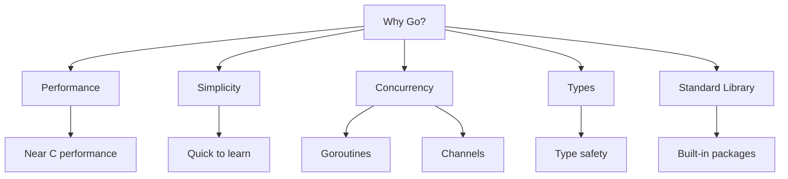
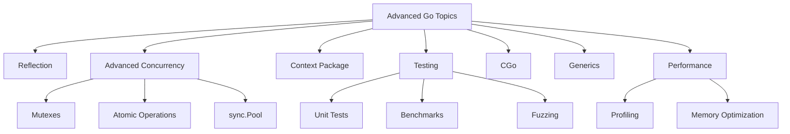

## Introduction to Go

Go (or Golang) is a modern programming language developed by Google in 2007 and released in 2009. It's designed for simplicity, efficiency, and excellent support for concurrency—making it ideal for everything from web services to cloud infrastructure.

Go was created to address limitations in existing languages while maintaining performance. Companies like Google, Uber, Twitch, and Dropbox rely on it for their critical systems because of its reliability and efficiency.

**Why Go stands out:**

- Static typing with concise syntax
- Built-in concurrency with goroutines and channels
- Garbage collection with low pause times
- Fast compilation
- Cross-platform support
- Rich standard library
- Simple dependency management



Before we dive into coding, let's make sure you have everything you need to get started with Go.

## Prerequisites

- Basic programming knowledge (variables, functions, loops)
- Command-line familiarity
- Text editor or IDE (VS Code with Go extension recommended)

## Setting Up Your Environment

Let's start by installing Go and setting up a basic project structure.

### Installation

1. Download Go from [golang.org](https://golang.org/dl/)
2. Run the installer for your OS
3. Verify installation:

```bash
go version
# Should display something like: go version go1.18.3 darwin/amd64
```

### Project Setup (Using Go Modules)

Modern Go development uses modules for dependency management. Here's how to set up a new project:

```bash
# Create a new project directory
mkdir my-go-project
cd my-go-project

# Initialize a Go module
go mod init github.com/yourusername/my-go-project
# Creates go.mod file to manage dependencies
```

Now that we have our environment ready, let's write our first Go program.

## Hello, World!

As with learning any language, we'll start with a simple Hello World program:

```go
// hello.go - First Go program
package main // Every Go program starts with a package declaration

import "fmt" // Import the format package for I/O

// main function - program entry point
func main() {
    // Print a message to the console
    fmt.Println("Hello, Gopher!")
}
```

To run this program, use the `go run` command:

```bash
go run hello.go
# Output: Hello, Gopher!
```

If you want to create an executable file instead, use `go build`:

```bash
go build hello.go
./hello  # On Windows: hello.exe
```

Now that we've created our first program, let's explore Go's fundamental building blocks, starting with variables and data types.

## Variables and Basic Types

Go is a statically typed language, which means every variable has a specific type at compile time. However, Go makes this painless with type inference.

### Variable Declaration

Go offers several ways to declare variables:

```go
// Multiple ways to declare variables
var name string = "Gopher"  // Explicit type
age := 5                    // Type inference (only inside functions)

// Multiple declaration
var (
    isActive bool = true
    count    int  = 10
)

// Constants
const Pi = 3.14159
```

The `:=` syntax is a shorthand that lets Go infer the type from the value, making your code more concise.

### Basic Data Types

Go provides several built-in data types:

```go
// Numbers
var i int = 42            // Platform dependent (32 or 64 bit)
var f float64 = 3.1415    // 64-bit floating point
var b byte = 255          // Alias for uint8 (0-255)

// Boolean
var isValid bool = true   // true or false

// Strings
var message string = "Go is fun!"

// Type conversion (explicit)
var i64 int64 = int64(i)  // Convert int to int64
```

One nice feature of Go is that variables are automatically initialized with "zero values" if you don't provide an initial value:

### Zero Values

```go
var i int        // 0
var f float64    // 0.0
var s string     // "" (empty string)
var b bool       // false
```

This helps prevent the "uninitialized variable" bugs common in other languages.

Now that we understand variables, let's look at how to control the flow of our programs.

## Control Structures

Go's control structures will be familiar if you've used other languages, but they have some Go-specific features that make them more concise and safer.

### Conditionals

Go's `if` statements are straightforward but don't require parentheses around conditions:

```go
// If statement
if x > 10 {
    fmt.Println("x is greater than 10")
} else if x < 0 {
    fmt.Println("x is negative")
} else {
    fmt.Println("x is between 0 and 10")
}
```

A unique feature of Go is the ability to include a short statement before the condition:

```go
// With initialization statement
if value := getValue(); value > threshold {
    // value is only accessible in this scope
    fmt.Println("Above threshold:", value)
}
```

This pattern is common when checking for errors, as we'll see later.

### Loops

Go simplifies loops by only having one loop construct: `for`. It can be used in several ways:

```go
// Basic for loop
for i := 0; i < 5; i++ {
    fmt.Println(i)
    // Prints: 0 1 2 3 4
}

// While-style loop
count := 0
for count < 5 {
    fmt.Println(count)
    count++
}

// Infinite loop
for {
    // Do something forever
    break  // Exit the loop
}
```

The `range` keyword allows you to iterate over various data structures:

```go
// Loop with range (for arrays, slices, maps, channels)
names := []string{"Alice", "Bob", "Charlie"}
for index, name := range names {
    fmt.Printf("%d: %s\n", index, name)
    // Prints: 0: Alice  1: Bob  2: Charlie
}
```

### Switch

Go's `switch` statement is more flexible than in many other languages:

```go
// Switch statement
switch day {
case "Monday", "Tuesday":
    fmt.Println("Start of week")
case "Wednesday":
    fmt.Println("Mid-week")
case "Thursday", "Friday":
    fmt.Println("End of week")
default:
    fmt.Println("Weekend")
}
```

Unlike languages like C, Go automatically breaks after each case. You can handle multiple values in a single case, and you can even use `switch` without an expression:

```go
// Switch with no expression (like if-else chain)
switch {
case hour < 12:
    fmt.Println("Good morning")
case hour < 17:
    fmt.Println("Good afternoon")
default:
    fmt.Println("Good evening")
}
```

Next, let's look at how to organize code into reusable units with functions.

## Functions

Functions are the building blocks of Go programs. They allow you to encapsulate logic, promote reuse, and organize your code.

```go
// Basic function
func add(a, b int) int {
    return a + b
}
```

One of Go's distinctive features is the ability to return multiple values from a function:

```go
// Multiple return values
func divide(a, b float64) (float64, error) {
    if b == 0 {
        return 0, errors.New("cannot divide by zero")
    }
    return a / b, nil
}
```

This is particularly useful for error handling, as we'll see in more detail later.

Go also supports named return values, which can make your code more readable:

```go
// Named return values
func rectangleProperties(length, width float64) (area, perimeter float64) {
    area = length * width
    perimeter = 2 * (length + width)
    return // Returns the named variables
}
```

Another powerful feature is variadic functions, which accept a variable number of arguments:

```go
// Variadic function (variable number of arguments)
func sum(nums ...int) int {
    total := 0
    for _, num := range nums {
        total += num
    }
    return total
}
// Usage: sum(1, 2, 3) or sum(mySlice...)
```

### Anonymous Functions & Closures

Go supports anonymous functions, which can be assigned to variables or used inline:

```go
// Function assigned to variable
add := func(a, b int) int {
    return a + b
}
result := add(3, 4) // 7
```

Closures are functions that can access variables from the outer scope:

```go
// Closure (function that captures outside variables)
func createCounter() func() int {
    count := 0
    return func() int {
        count++
        return count
    }
}

counter := createCounter()
fmt.Println(counter()) // 1
fmt.Println(counter()) // 2
```

This is particularly useful for creating stateful functions and callbacks.

Now that we know how to organize code with functions, let's explore Go's data structures for organizing data.

## Data Structures

Go provides several built-in data structures that help you organize and manipulate data efficiently.

### Arrays, Slices and Maps

Arrays in Go have a fixed size determined at compile time:

```go
// Arrays (fixed size)
var colors [3]string
colors[0] = "Red"
colors[1] = "Green"
colors[2] = "Blue"

// Array initialization
numbers := [5]int{1, 2, 3, 4, 5}
matrix := [2][3]int{{1, 2, 3}, {4, 5, 6}} // 2D array
```

While arrays are useful in some cases, slices are more flexible and commonly used in Go:

```go
// Slices (dynamic arrays)
names := []string{"Alice", "Bob", "Charlie"}
names = append(names, "Dave") // Add elements

// Create slice with make
scores := make([]int, 3, 5) // len=3, cap=5
scores[0] = 90
scores[1] = 85
scores[2] = 95
```

Slices can be manipulated in various ways:

```go
// Slice operations
subset := names[1:3]   // ["Bob", "Charlie"]
first := names[:2]     // ["Alice", "Bob"]
last := names[1:]      // ["Bob", "Charlie", "Dave"]
```

Maps are key-value stores, similar to dictionaries or hash maps in other languages:

```go
// Maps (key-value pairs)
userAges := map[string]int{
    "Alice":   28,
    "Bob":     32,
    "Charlie": 25,
}

// Access, modify, check
age := userAges["Alice"]      // 28
userAges["Dave"] = 42         // Add new entry
delete(userAges, "Charlie")   // Remove entry

if age, exists := userAges["Bob"]; exists {
    fmt.Printf("Bob is %d years old\n", age)
}
```

### Structs (Custom Types)

For more complex data, Go provides structs, which are collections of fields:

```go
// Define a struct
type Person struct {
    Name    string
    Age     int
    Address string
}

// Create instances
alice := Person{
    Name:    "Alice",
    Age:     28,
    Address: "123 Main St",
}

bob := Person{"Bob", 32, "456 Oak Ave"} // Order matters here

// Access fields
fmt.Println(alice.Name) // "Alice"
alice.Age = 29          // Modify field
```

Structs can be composed through embedding, which is Go's approach to composition over inheritance:

```go
// Struct embedding (composition)
type Employee struct {
    Person         // Embedded struct
    EmployeeID int
    Department string
}

emp := Employee{
    Person:     Person{"Charlie", 25, "789 Pine Rd"},
    EmployeeID: 12345,
    Department: "Engineering",
}

// Access embedded fields directly
fmt.Println(emp.Name) // "Charlie"
```

Now that we've covered data structures, let's see how we can add behavior to our types with methods and interfaces.

## Methods and Interfaces

Methods and interfaces are key to Go's approach to object-oriented programming, focusing on behavior rather than hierarchy.

### Methods

Methods are functions that operate on specific types:

```go
// Method on Person struct
func (p Person) FullInfo() string {
    return fmt.Sprintf("%s (%d) - %s", p.Name, p.Age, p.Address)
}
```

The `(p Person)` part is called the receiver, which associates the method with the `Person` type. You can use pointer receivers to modify the original value:

```go
// Method with pointer receiver (can modify the struct)
func (p *Person) Birthday() {
    p.Age++
}

// Usage
alice := Person{"Alice", 28, "123 Main St"}
info := alice.FullInfo()
alice.Birthday()
fmt.Println(alice.Age) // 29
```

### Interfaces

Interfaces define behavior without specifying implementation details. This is a powerful concept in Go that enables polymorphism:

```go
// Define an interface
type Shape interface {
    Area() float64
    Perimeter() float64
}
```

Any type that implements these methods automatically satisfies the interface (no explicit declaration needed):

```go
// Implement for Rectangle
type Rectangle struct {
    Width, Height float64
}

func (r Rectangle) Area() float64 {
    return r.Width * r.Height
}

func (r Rectangle) Perimeter() float64 {
    return 2 * (r.Width + r.Height)
}

// Implement for Circle
type Circle struct {
    Radius float64
}

func (c Circle) Area() float64 {
    return math.Pi * c.Radius * c.Radius
}

func (c Circle) Perimeter() float64 {
    return 2 * math.Pi * c.Radius
}
```

Now you can write functions that work with any `Shape`:

```go
// Function that works with any Shape
func PrintShapeInfo(s Shape) {
    fmt.Printf("Area: %.2f, Perimeter: %.2f\n", s.Area(), s.Perimeter())
}

// Usage
rect := Rectangle{5, 3}
circ := Circle{5}
PrintShapeInfo(rect) // Works with Rectangle
PrintShapeInfo(circ) // Works with Circle
```

This approach gives you the benefits of polymorphism without the complexity of inheritance hierarchies.

Next, let's see how to organize our code into packages and modules.

## Packages and Modules

As your Go programs grow, you'll want to organize them into packages and modules. Packages group related functionality, while modules manage dependencies.

### Creating Packages

Here's a simple project structure with a custom package:

```
myproject/
├── go.mod
├── main.go
└── math/
    └── calculator.go
```

In `calculator.go`, we define our package and functions:

```go
// Package math provides basic math operations
package math

// Add returns the sum of two integers
// Public function starts with uppercase
func Add(a, b int) int {
    return a + b
}

// private function starts with lowercase
func multiply(a, b int) int {
    return a * b
}
```

In Go, capitalized names are exported (public), while lowercase names are unexported (private to the package).

In `main.go`, we import and use our package:

```go
package main

import (
    "fmt"
    "github.com/yourusername/myproject/math"
)

func main() {
    result := math.Add(5, 3)
    fmt.Println("5 + 3 =", result)

    // Can't access: math.multiply(5, 3) - private function
}
```

### Using External Packages

Go modules make it easy to manage external dependencies:

```go
// In your go.mod file
module github.com/yourusername/myproject

go 1.18

require (
    github.com/gorilla/mux v1.8.0
)
```

You can then use the external package in your code:

```go
// Install external package
// $ go get github.com/gorilla/mux

// main.go
package main

import (
    "fmt"
    "log"
    "net/http"
    "github.com/gorilla/mux"
)

func main() {
    r := mux.NewRouter()
    r.HandleFunc("/", HomeHandler).Methods("GET")

    log.Println("Server starting on :8080")
    log.Fatal(http.ListenAndServe(":8080", r))
}

func HomeHandler(w http.ResponseWriter, r *http.Request) {
    fmt.Fprintln(w, "Welcome to my Go web app!")
}
```

This modular approach helps keep your code organized and maintainable.

Now, let's explore how Go handles errors, which is a fundamental aspect of writing robust programs.

## Error Handling

Go takes a unique approach to error handling, using return values instead of exceptions.

```go
// Basic error handling
file, err := os.Open("filename.txt")
if err != nil {
    // Handle error
    fmt.Println("Error opening file:", err)
    return
}
defer file.Close() // Ensures file is closed when function exits
```

The `defer` statement is particularly useful for cleanup operations, ensuring they run even if the function returns early.

Functions that can fail typically return an error as their last return value:

```go
// Creating errors
func divide(a, b float64) (float64, error) {
    if b == 0 {
        return 0, errors.New("cannot divide by zero")
    }
    return a / b, nil
}
```

You can also create custom error types for more detailed error information:

```go
// Custom error types
type ValidationError struct {
    Field string
    Message string
}

func (e ValidationError) Error() string {
    return fmt.Sprintf("%s: %s", e.Field, e.Message)
}

// Usage
func validateUser(user User) error {
    if user.Name == "" {
        return ValidationError{Field: "name", Message: "cannot be empty"}
    }
    return nil
}
```

This explicit error handling may seem verbose at first, but it makes error flow more visible and helps prevent bugs caused by unhandled error conditions.

One of Go's most distinctive features is its approach to concurrency, which we'll explore next.

## Concurrency

Go was designed with concurrency in mind, offering lightweight goroutines and channels to make concurrent programming safer and more accessible.

### Goroutines

Goroutines are lightweight threads managed by the Go runtime:

```go
// Start a function in a new goroutine
go sayHello("World")

// Anonymous function in goroutine
go func() {
    fmt.Println("Running in background")
}()
```

Unlike OS threads, goroutines are extremely lightweight—you can easily create thousands of them. Here's a practical example:

```go
// Example
func main() {
    // Start 5 goroutines
    for i := 1; i <= 5; i++ {
        i := i // Create a local copy for closure
        go func() {
            fmt.Println("Goroutine", i)
        }()
    }

    // Wait to see the output
    // (In real code, use WaitGroups or channels for synchronization)
    time.Sleep(time.Second)
}
```

The local copy of `i` is important to avoid a common closure pitfall where all goroutines would see the same final value of `i`.

### Channels

Channels provide a way for goroutines to communicate and synchronize:

```go
// Create a channel
messages := make(chan string)

// Send to channel (in goroutine)
go func() {
    messages <- "Hello"  // Sends "Hello" to channel
}()

// Receive from channel
msg := <-messages  // Receives value from channel
fmt.Println(msg)   // "Hello"
```

Channels can be buffered to allow a certain number of values without blocking:

```go
// Buffered channel
queue := make(chan string, 2)
queue <- "first"
queue <- "second"
// Can add 2 values before blocking
```

When you're done sending values, you can close the channel:

```go
// Close a channel when done sending
close(queue)

// Iterate over channel values
for msg := range queue {
    fmt.Println(msg)
}
```

The `select` statement allows you to work with multiple channels:

```go
// Select statement to work with multiple channels
func main() {
    c1 := make(chan string)
    c2 := make(chan string)

    go func() {
        time.Sleep(time.Second)
        c1 <- "one"
    }()

    go func() {
        time.Sleep(2 * time.Second)
        c2 <- "two"
    }()

    // Wait on multiple channels
    for i := 0; i < 2; i++ {
        select {
        case msg1 := <-c1:
            fmt.Println("Received:", msg1)
        case msg2 := <-c2:
            fmt.Println("Received:", msg2)
        case <-time.After(3 * time.Second):
            fmt.Println("Timeout")
        }
    }
}
```

### Synchronization

For more complex synchronization, Go provides the `sync` package:

```go
// WaitGroup for goroutine synchronization
func main() {
    var wg sync.WaitGroup

    // Launch 5 workers
    for i := 1; i <= 5; i++ {
        wg.Add(1)  // Add counter

        i := i  // Local copy for closure
        go func() {
            defer wg.Done()  // Decrease counter when done
            worker(i)
        }()
    }

    wg.Wait()  // Wait for all goroutines to finish
    fmt.Println("All workers done!")
}

func worker(id int) {
    fmt.Printf("Worker %d starting\n", id)
    time.Sleep(time.Second)
    fmt.Printf("Worker %d done\n", id)
}
```

WaitGroups are particularly useful when you need to wait for a group of goroutines to complete before continuing.

Let's put our knowledge into practice by building a simple web application.

## Web Development

Go's standard library includes everything you need to build web servers and APIs.

```go
// Simple HTTP server
package main

import (
    "fmt"
    "log"
    "net/http"
)

func main() {
    // Define route handlers
    http.HandleFunc("/", func(w http.ResponseWriter, r *http.Request) {
        fmt.Fprintf(w, "Welcome to my website!")
    })

    http.HandleFunc("/hello", func(w http.ResponseWriter, r *http.Request) {
        // Get URL parameter: /hello?name=Alice
        name := r.URL.Query().Get("name")
        if name == "" {
            name = "Guest"
        }
        fmt.Fprintf(w, "Hello, %s!", name)
    })

    // Start server
    fmt.Println("Server starting on port 8080...")
    log.Fatal(http.ListenAndServe(":8080", r))
}
```

For more complex web applications, third-party packages like `gorilla/mux` provide additional functionality:

### RESTful API Example

Here's a more complete example of a RESTful API for managing books:

```go
package main

import (
    "encoding/json"
    "log"
    "net/http"
    "strconv"
    "github.com/gorilla/mux"
)

// Book model
type Book struct {
    ID     int    `json:"id"`
    Title  string `json:"title"`
    Author string `json:"author"`
}

var books []Book

func main() {
    // Initialize router
    r := mux.NewRouter()

    // Seed initial data
    books = append(books,
        Book{ID: 1, Title: "Go Programming", Author: "John Doe"},
        Book{ID: 2, Title: "Web Development", Author: "Jane Smith"},
    )

    // Define routes
    r.HandleFunc("/books", getBooks).Methods("GET")
    r.HandleFunc("/books/{id}", getBook).Methods("GET")
    r.HandleFunc("/books", createBook).Methods("POST")

    // Start server
    log.Println("Server starting on port 8080...")
    log.Fatal(http.ListenAndServe(":8080", r))
}

// Get all books
func getBooks(w http.ResponseWriter, r *http.Request) {
    w.Header().Set("Content-Type", "application/json")
    json.NewEncoder(w).Encode(books)
}

// Get single book
func getBook(w http.ResponseWriter, r *http.Request) {
    w.Header().Set("Content-Type", "application/json")

    // Get id parameter
    params := mux.Vars(r)
    id, err := strconv.Atoi(params["id"])
    if err != nil {
        http.Error(w, "Invalid ID", http.StatusBadRequest)
        return
    }

    // Find book
    for _, book := range books {
        if book.ID == id {
            json.NewEncoder(w).Encode(book)
            return
        }
    }

    // Book not found
    http.Error(w, "Book not found", http.StatusNotFound)
}

// Create new book
func createBook(w http.ResponseWriter, r *http.Request) {
    w.Header().Set("Content-Type", "application/json")

    var book Book
    // Decode request body
    err := json.NewDecoder(r.Body).Decode(&book)
    if err != nil {
        http.Error(w, "Invalid request body", http.StatusBadRequest)
        return
    }

    // Generate new ID (simple implementation)
    if len(books) > 0 {
        book.ID = books[len(books)-1].ID + 1
    } else {
        book.ID = 1
    }

    // Add to books
    books = append(books, book)

    // Return created book
    w.WriteHeader(http.StatusCreated)
    json.NewEncoder(w).Encode(book)
}
```

With this API, you can create and retrieve books using HTTP requests. This demonstrates how Go's concurrency and standard library make it well-suited for building scalable web services.

We've now covered the 85% of Go that you'll use in your daily work. Let's briefly explore the remaining 15% that you can dive into as you become more proficient.

## The Remaining 15%: Advanced Go Topics



### 1. Reflection

Go's reflect package lets you examine types and values at runtime:

- Type introspection and manipulation
- Dynamic creation of types and values
- Working with unexported fields
- Used in JSON/XML encoding/decoding

### 2. Advanced Concurrency

Beyond basic goroutines and channels:

- Mutex and RWMutex for lock-based synchronization
- sync.Once for one-time initialization
- sync.Pool for object reuse
- Atomic operations for lock-free programming
- Worker pools and pipeline patterns

### 3. Context Package

For controlling cancellation, deadlines, and request values:

- Passing request-scoped values
- Cancellation propagation
- Deadline management
- Used heavily in HTTP servers/clients

### 4. Testing and Benchmarking

Comprehensive testing framework:

- Table-driven tests
- Mocking and dependency injection
- Benchmarks for performance measurement
- Fuzzing for finding bugs with random inputs
- Race detector for concurrency issues

### 5. CGo

Call C code from Go:

- Using external C libraries
- Performance-critical sections
- System programming
- Legacy code integration

### 6. Generics (Go 1.18+)

For type-safe polymorphic code:

- Generic functions and methods
- Generic data structures
- Type constraints
- Type inference

### 7. Performance Optimization

Techniques for faster Go code:

- Memory allocation reduction
- pprof profiling tools
- Escape analysis
- Slice and map optimization
- Preallocation strategies

### 8. Go Tooling

Advanced development tools:

- go vet for static analysis
- go doc for documentation
- go generate for code generation
- go race for race detection
- go mod for module management

## Final Words

This crash course has covered the 85% of Go that you'll use daily. The simplicity of the language, combined with its powerful features for concurrency and performance, makes it an excellent choice for modern software development.

To continue your Go journey, explore the advanced topics above, read the official documentation at [golang.org](https://golang.org/doc/), and build practical projects to reinforce your learning.

Remember: Go's philosophy emphasizes simplicity and readability. The language intentionally avoids complex features to favor clarity and maintainability—less is often more in the Go world!
