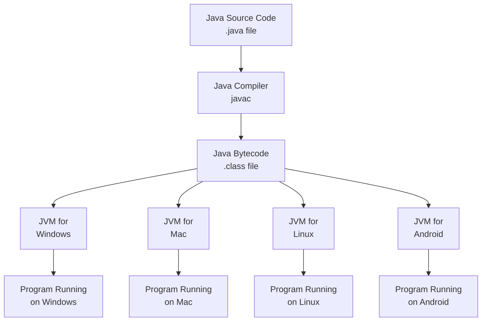
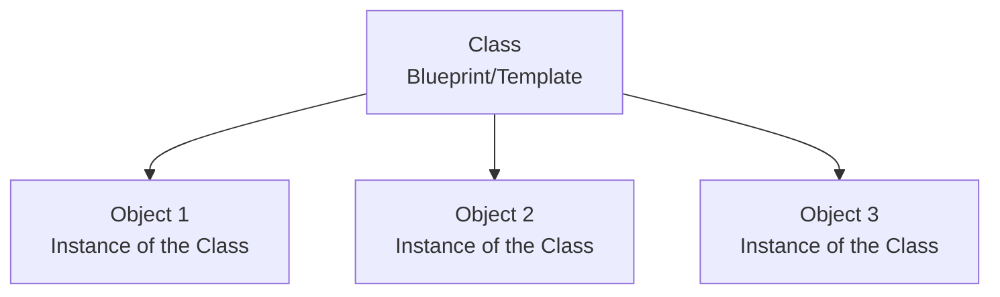
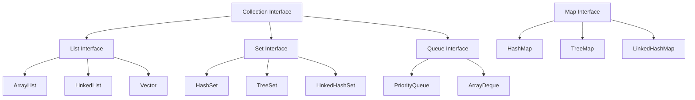

This crash course will guide you through the essential aspects of Java programming that you'll need for everyday work, building a solid foundation that will enable you to explore more advanced concepts independently.

## Introduction to Java

Java stands as one of the most influential programming languages in the computing world. Created with the philosophy of "Write Once, Run Anywhere," it offers platform independence through the Java Virtual Machine (JVM), allowing code to run on any device with a JVM installed. This versatility has made Java a cornerstone in various domains including:

- Enterprise applications
- Android mobile development
- Web services and applications
- Financial services
- Big data processing

Java combines powerful object-oriented principles with a robust type system and automatic memory management, making it both powerful and accessible. Understanding how Java works from code to execution provides important context:



## Setting Up Your Java Environment

Before diving into coding, you'll need to prepare your development environment. The process is straightforward and follows a few key steps.

### Prerequisites

- A computer running Windows, macOS, or Linux
- Basic knowledge of using command line/terminal
- A text editor (VS Code, IntelliJ IDEA, or Eclipse recommended)

### Installation Steps

First, you'll need to download and install the Java Development Kit (JDK), which contains everything needed to develop and run Java applications:

1. **Download the JDK:**

   - Visit [Oracle's official website](https://www.oracle.com/java/technologies/downloads/) or use OpenJDK

2. **Install the JDK:**
   - Run the installer and follow the instructions
3. **Set up environment variables:**

   - **Windows:**
     ```
     Set JAVA_HOME=C:\Program Files\Java\jdk-VERSION
     Add %JAVA_HOME%\bin to PATH
     ```
   - **macOS/Linux:**
     ```
     export JAVA_HOME=/Library/Java/JavaVirtualMachines/jdk-VERSION/Contents/Home
     export PATH=$PATH:$JAVA_HOME/bin
     ```

4. **Verify installation:** Open a terminal or command prompt and type:
   ```bash
   java -version
   javac -version
   ```
   Both commands should display the installed Java version, confirming that Java is properly set up on your system.

With your environment ready, let's create your first Java program to ensure everything is working correctly.

## Your First Java Program

The traditional starting point for learning any programming language is the "Hello World" program. In Java, this introduces you to the basic structure of a Java class:

1. Create a file named `HelloWorld.java` with:

```java
public class HelloWorld {
    public static void main(String[] args) {
        // This is a comment
        System.out.println("Hello, World!"); // This prints to the console
    }
}
```

2. Compile and run:

```bash
javac HelloWorld.java   # Creates HelloWorld.class
java HelloWorld         # Executes the program
```

When you run this, you'll see `Hello, World!` printed to the console. Let's break down what's happening:

- `public class HelloWorld` defines a class named HelloWorld
- `public static void main(String[] args)` is the entry point for any Java application
- `System.out.println()` displays text to the console

Now that you've created your first program, let's explore Java's fundamental building blocks.

## Java Fundamentals

### Variables and Data Types

Java is a strongly typed language, which means every variable must have a declared type before use. This type checking helps catch errors early in the development process.

#### Primitive Data Types

Java provides eight primitive data types for representing basic values:

```java
// Integer types - for whole numbers
byte b = 127;            // 8-bit, range: -128 to 127
short s = 32767;         // 16-bit, range: -32,768 to 32,767
int i = 2147483647;      // 32-bit (most commonly used)
long l = 9223372036854775807L; // 64-bit, note the 'L' suffix

// Floating-point types - for decimal numbers
float f = 3.14f;         // 32-bit, note the 'f' suffix
double d = 3.14159;      // 64-bit, default for decimal values

// Other primitive types
char c = 'A';            // 16-bit Unicode character
boolean bool = true;     // true or false value
```

Each type has a specific size and range, making them suitable for different purposes. For most cases, `int` and `double` are the go-to choices for numbers.

#### Reference Types

Unlike primitive types, reference types store references (memory addresses) to objects rather than the actual values:

```java
String name = "John";    // String is a class, not a primitive
int[] numbers = {1, 2, 3}; // Array of integers
```

Understanding the distinction between primitive and reference types is crucial as they behave differently when assigned or compared.

### Operators

Java provides a rich set of operators for performing various operations on variables:

```java
// Arithmetic operators
int sum = 5 + 3;         // Addition: 8
int difference = 5 - 3;  // Subtraction: 2
int product = 5 * 3;     // Multiplication: 15
int quotient = 5 / 3;    // Integer division: 1 (truncates decimal)
int remainder = 5 % 3;   // Modulus: 2

// Compound assignment operators
int number = 5;
number += 3;             // Same as: number = number + 3

// Comparison operators
boolean isEqual = (5 == 3);     // false
boolean isNotEqual = (5 != 3);  // true
boolean isGreater = (5 > 3);    // true

// Logical operators
boolean andResult = true && false;  // false (both must be true)
boolean orResult = true || false;   // true (either can be true)
boolean notResult = !true;          // false (negation)
```

These operators form the basis for creating expressions and making decisions in your code.

### Input and Output

Interacting with users through input and output is essential for many applications. Java provides several ways to do this, with the `Scanner` class being the most common for basic console input:

```java
import java.util.Scanner;

public class UserInput {
    public static void main(String[] args) {
        // Create a Scanner to read input from keyboard
        Scanner scanner = new Scanner(System.in);

        System.out.print("Enter your name: ");
        String name = scanner.nextLine(); // Read a line of text

        System.out.print("Enter your age: ");
        int age = scanner.nextInt(); // Read an integer

        System.out.println("Hello, " + name + "! You are " + age + " years old.");

        // Always close the scanner when done
        scanner.close();
    }
}
```

This program prompts the user for their name and age, then displays a personalized greeting. The `Scanner` class provides methods for reading different types of input, making it versatile for various scenarios.

## Control Flow

Control flow statements determine the order in which statements execute based on certain conditions, allowing your programs to make decisions and repeat actions.

### Conditional Statements

Conditional statements execute different blocks of code depending on whether a condition is true or false:

```java
int score = 85;

// if-else statement
if (score >= 90) {
    System.out.println("Grade: A");
} else if (score >= 80) {
    System.out.println("Grade: B");
} else if (score >= 70) {
    System.out.println("Grade: C");
} else {
    System.out.println("Grade: F");
}

// Ternary operator: condition ? valueIfTrue : valueIfFalse
String result = (score >= 60) ? "Pass" : "Fail";
```

In this example, the program assigns a letter grade based on the score value. The ternary operator provides a concise way to express simple if-else logic.

### Loops

Loops allow you to execute a block of code multiple times, which is essential for tasks that require repetition:

```java
// For loop - when you know the number of iterations
for (int i = 0; i < 5; i++) {
    System.out.println("Iteration: " + i);
}

// While loop - when you don't know the number of iterations upfront
int count = 0;
while (count < 5) {
    System.out.println("Count: " + count);
    count++;
}

// Do-while loop - always executes at least once
int number = 5;
do {
    System.out.println("Number: " + number);
    number--;
} while (number > 0);
```

Each loop type serves a different purpose: `for` loops work well with a known number of iterations, `while` loops continue until a condition becomes false, and `do-while` loops guarantee at least one execution.

### Switch Statements

The switch statement provides a clean way to select one of many code blocks to execute:

```java
int day = 3;
String dayName;

// Traditional switch
switch (day) {
    case 1:
        dayName = "Monday";
        break;
    case 2:
        dayName = "Tuesday";
        break;
    case 3:
        dayName = "Wednesday";
        break;
    // ... other cases
    default:
        dayName = "Invalid day";
}

// Enhanced switch (Java 14+)
dayName = switch (day) {
    case 1 -> "Monday";
    case 2 -> "Tuesday";
    case 3 -> "Wednesday";
    // ... other cases
    default -> "Invalid day";
};
```

The enhanced switch (arrow syntax) introduced in newer Java versions reduces boilerplate code by removing the need for `break` statements.

## Object-Oriented Programming in Java

Java's power largely comes from its robust implementation of object-oriented programming (OOP). Understanding these concepts is crucial for effective Java development.

Java's OOP model is built on four fundamental principles:

1. **Encapsulation**: Bundling data and methods that operate on that data into a single unit
2. **Inheritance**: Creating new classes based on existing ones
3. **Polymorphism**: The ability to process objects differently based on their data type
4. **Abstraction**: Hiding implementation details while showing only functionality

### Classes and Objects

Classes are the blueprints for objects, defining their structure and behavior:

```java
// Class definition
public class Person {
    // Fields (attributes)
    private String name;
    private int age;

    // Constructor
    public Person(String name, int age) {
        this.name = name;
        this.age = age;
    }

    // Methods
    public void introduce() {
        System.out.println("Hello, my name is " + name + " and I'm " + age + " years old.");
    }

    // Getters and setters
    public String getName() {
        return name;
    }

    public void setName(String name) {
        this.name = name;
    }

    public int getAge() {
        return age;
    }

    public void setAge(int age) {
        this.age = age;
    }
}

// Using the class to create objects
public class Main {
    public static void main(String[] args) {
        Person person1 = new Person("Alice", 25);
        Person person2 = new Person("Bob", 30);

        person1.introduce(); // Output: Hello, my name is Alice and I'm 25 years old.
        person2.introduce(); // Output: Hello, my name is Bob and I'm 30 years old.
    }
}
```

This example demonstrates the relationship between classes and objects. The `Person` class defines the structure (fields) and behavior (methods), while `person1` and `person2` are concrete instances with specific values.



### Inheritance

Inheritance enables you to create a new class that reuses, extends, or modifies the behavior of an existing class:

```java
// Parent class (superclass)
public class Animal {
    protected String name;

    public Animal(String name) {
        this.name = name;
    }

    public void eat() {
        System.out.println(name + " is eating.");
    }
}

// Child class (subclass)
public class Dog extends Animal {
    private String breed;

    public Dog(String name, String breed) {
        super(name); // Call parent constructor
        this.breed = breed;
    }

    public void bark() {
        System.out.println(name + " is barking.");
    }

    // Method overriding
    @Override
    public void eat() {
        System.out.println(name + " the " + breed + " is eating dog food.");
    }
}

// Usage
public class Main {
    public static void main(String[] args) {
        Dog dog = new Dog("Rex", "German Shepherd");
        dog.eat();  // From Dog class (overridden)
        dog.bark(); // From Dog class
    }
}
```

In this example, the `Dog` class inherits from the `Animal` class, gaining its fields and methods. It also adds its own unique field (`breed`) and method (`bark`), and overrides the `eat` method to provide specialized behavior.

### Polymorphism

Polymorphism allows objects to be treated as instances of their parent class rather than their actual type:

```java
// Parent class
public class Shape {
    public void draw() {
        System.out.println("Drawing a shape");
    }
}

// Child classes
public class Circle extends Shape {
    @Override
    public void draw() {
        System.out.println("Drawing a circle");
    }
}

public class Rectangle extends Shape {
    @Override
    public void draw() {
        System.out.println("Drawing a rectangle");
    }
}

// Polymorphic usage
public class Main {
    public static void main(String[] args) {
        Shape shape1 = new Circle();      // A Circle object can be a Shape
        Shape shape2 = new Rectangle();   // A Rectangle object can be a Shape

        shape1.draw(); // Calls Circle's draw method
        shape2.draw(); // Calls Rectangle's draw method
    }
}
```

This powerful feature allows you to write code that can work with objects of different types through a common interface, enhancing flexibility and reusability.

### Abstraction and Interfaces

Abstraction lets you focus on what an object does rather than how it does it, creating a clear separation between interface and implementation:

```java
// Abstract class
public abstract class Vehicle {
    private String brand;

    public Vehicle(String brand) {
        this.brand = brand;
    }

    // Abstract method (no implementation)
    public abstract void move();

    // Concrete method (with implementation)
    public void displayBrand() {
        System.out.println("Brand: " + brand);
    }
}

// Interface
public interface Flyable {
    void fly();  // All methods in interfaces are implicitly abstract

    // Default method (Java 8+)
    default void land() {
        System.out.println("Landing...");
    }
}

// Implementation
public class Airplane extends Vehicle implements Flyable {
    public Airplane(String brand) {
        super(brand);
    }

    @Override
    public void move() {
        System.out.println("Airplane is moving on the runway.");
    }

    @Override
    public void fly() {
        System.out.println("Airplane is flying in the sky.");
    }
}
```

Abstract classes and interfaces provide templates for subclasses to implement, ensuring consistent behavior while allowing for specialized implementations.

## Java Collections Framework

Moving beyond individual objects, Java's Collections Framework provides a unified architecture for representing and manipulating groups of objects. This framework solves common programming challenges like storing, retrieving, and manipulating data.



Let's explore some of the most commonly used collection types.

### ArrayList Example

`ArrayList` provides a resizable array implementation, making it ideal for scenarios where you need a dynamic list:

```java
import java.util.ArrayList;
import java.util.List;

public class ArrayListExample {
    public static void main(String[] args) {
        // Create ArrayList of Strings
        List<String> fruits = new ArrayList<>();

        // Add elements
        fruits.add("Apple");
        fruits.add("Banana");
        fruits.add("Orange");

        // Access elements
        System.out.println("First fruit: " + fruits.get(0));

        // Iterate over elements
        System.out.println("All fruits:");
        for (String fruit : fruits) {
            System.out.println(fruit);
        }

        // Remove elements
        fruits.remove("Banana");

        // Size of ArrayList
        System.out.println("Number of fruits: " + fruits.size());

        // Check if element exists
        boolean containsApple = fruits.contains("Apple");
        System.out.println("Contains Apple? " + containsApple);
    }
}
```

`ArrayList` excels when you need frequent access to elements by index and primarily add elements to the end of the list.

### HashMap Example

`HashMap` stores key-value pairs, providing fast lookups by key:

```java
import java.util.HashMap;
import java.util.Map;

public class HashMapExample {
    public static void main(String[] args) {
        // Create HashMap with String keys and Integer values
        Map<String, Integer> studentScores = new HashMap<>();

        // Add key-value pairs
        studentScores.put("Alice", 95);
        studentScores.put("Bob", 88);
        studentScores.put("Charlie", 90);

        // Access value by key
        int bobScore = studentScores.get("Bob");
        System.out.println("Bob's score: " + bobScore);

        // Check if key exists
        if (studentScores.containsKey("David")) {
            System.out.println("David's score: " + studentScores.get("David"));
        } else {
            System.out.println("David is not in the map");
        }

        // Iterate over entries
        System.out.println("All scores:");
        for (Map.Entry<String, Integer> entry : studentScores.entrySet()) {
            System.out.println(entry.getKey() + ": " + entry.getValue());
        }

        // Remove entry
        studentScores.remove("Charlie");

        // Size of HashMap
        System.out.println("Number of students: " + studentScores.size());
    }
}
```

`HashMap` is perfect for situations where you need to associate values with unique keys and quickly retrieve values based on those keys.

## Exception Handling

Real-world applications must handle unexpected conditions gracefully. Java's exception handling mechanism helps manage runtime errors effectively:

```java
public class ExceptionHandlingExample {
    public static void main(String[] args) {
        try {
            // Code that might throw an exception
            int result = divide(10, 0);
            System.out.println("Result: " + result); // This won't execute if exception occurs
        } catch (ArithmeticException e) {
            // Handle the specific exception
            System.out.println("Arithmetic exception caught: " + e.getMessage());
        } catch (Exception e) {
            // Handle any other exceptions
            System.out.println("General exception caught: " + e.getMessage());
        } finally {
            // Code that always executes, regardless of exception
            System.out.println("Finally block executed");
        }

        // Try-with-resources (Java 7+) - automatically closes resources
        try (java.util.Scanner scanner = new java.util.Scanner(System.in)) {
            System.out.print("Enter a number: ");
            int number = scanner.nextInt();
            System.out.println("You entered: " + number);
        } catch (java.util.InputMismatchException e) {
            System.out.println("Invalid input. Please enter a number.");
        }
    }

    public static int divide(int a, int b) throws ArithmeticException {
        if (b == 0) {
            throw new ArithmeticException("Division by zero");
        }
        return a / b;
    }
}
```

The try-catch-finally blocks provide a structured way to handle exceptions, while the try-with-resources construct automatically manages resource cleanup. This approach leads to more robust applications that can recover from errors gracefully.

## File I/O in Java

Working with files is a common requirement in many applications. Java provides several APIs for reading and writing files:

```java
import java.io.*;
import java.nio.file.*;
import java.util.Scanner;
import java.util.List;
import java.util.Arrays;

public class FileIOExample {
    public static void main(String[] args) {
        // Writing to a file
        try {
            FileWriter writer = new FileWriter("output.txt");
            writer.write("Hello, this is a test file.\n");
            writer.write("Writing to files in Java is easy!");
            writer.close();
            System.out.println("Successfully wrote to the file.");
        } catch (IOException e) {
            System.out.println("An error occurred while writing to the file.");
            e.printStackTrace();
        }

        // Reading from a file
        try {
            File file = new File("output.txt");
            Scanner scanner = new Scanner(file);

            System.out.println("File contents:");
            while (scanner.hasNextLine()) {
                String line = scanner.nextLine();
                System.out.println(line);
            }

            scanner.close();
        } catch (FileNotFoundException e) {
            System.out.println("File not found.");
            e.printStackTrace();
        }

        // Using NIO.2 (Java 7+)
        try {
            // Reading all lines at once
            List<String> lines = Files.readAllLines(Paths.get("output.txt"));
            System.out.println("\nReading with NIO.2:");
            for (String line : lines) {
                System.out.println(line);
            }

            // Writing all lines at once
            List<String> newLines = Arrays.asList("Line 1", "Line 2", "Line 3");
            Files.write(Paths.get("new_output.txt"), newLines);

        } catch (IOException e) {
            System.out.println("NIO.2 operation failed.");
            e.printStackTrace();
        }
    }
}
```

Java offers both traditional I/O (java.io) and the newer NIO.2 API (java.nio.file), providing flexibility for different file handling scenarios. The NIO.2 API is generally preferred for modern applications due to its improved performance and more intuitive API.

## The Remaining 15%: Advanced Java Topics

Now that you've gained a solid understanding of Java's core concepts, you're well-equipped to explore more advanced areas. These topics represent the remaining 15% that you can gradually master as you continue your Java journey.

### 1. Multithreading and Concurrency

Java's robust support for multithreaded programming allows applications to perform multiple tasks simultaneously, enhancing performance and responsiveness. As applications grow in complexity, understanding how to safely manage concurrent operations becomes increasingly important.

**Key Concepts:**

- Thread creation and lifecycle management
- Synchronization mechanisms and locks
- Thread pools and executor services
- Atomic operations for thread safety
- Concurrent collections for shared data

### 2. Lambda Expressions and Streams (Java 8+)

The functional programming features introduced in Java 8 revolutionized how developers write and organize code. These features enable more concise and expressive code, particularly when working with collections.

**Key Concepts:**

- Lambda expressions for compact function definitions
- Method references for even more concise code
- Functional interfaces as targets for lambdas
- Stream API for declarative collection processing
- Parallel streams for leveraging multi-core processors

### 3. Java Database Connectivity (JDBC)

Most enterprise applications need to interact with databases. JDBC provides the standard API for connecting Java applications to relational databases, allowing for data storage, retrieval, and manipulation.

**Key Concepts:**

- Establishing and managing database connections
- Executing SQL queries and processing results
- Using prepared statements for security and performance
- Managing transactions for data integrity
- Connection pooling for efficiency

### 4. JavaFX for GUI Development

When building desktop applications with rich user interfaces, JavaFX offers a modern and feature-rich framework. Its declarative approach to UI design and powerful animation capabilities make it suitable for creating engaging user experiences.

**Key Concepts:**

- Scene graph architecture and layout management
- UI controls and customization
- Event handling and property binding
- Animation and visual effects
- FXML for separating UI design from logic

### 5. Java Enterprise and Web Development

Java Enterprise Edition (now Jakarta EE) extends Java SE with APIs for building large-scale, multi-tiered, and distributed applications. Understanding these technologies opens doors to enterprise-level development.

**Key Components:**

- Servlets and JSP for web application development
- Enterprise JavaBeans (EJB) for business logic
- Java Persistence API (JPA) for object-relational mapping
- JAX-RS for RESTful web services
- Spring Framework for comprehensive enterprise solutions
- Hibernate for simplified database interactions

## Summary

This crash course has equipped you with a comprehensive understanding of Java's core features that make up the essential 85% of what you'll need for daily programming. You've learned about:

1. **Java Basics**: Setting up your environment and understanding the fundamentals of Java syntax, variables, and operators
2. **Control Flow**: Making decisions and repeating actions with conditionals and loops
3. **Object-Oriented Programming**: Creating and organizing code using classes, objects, inheritance, and polymorphism
4. **Collections Framework**: Managing groups of objects efficiently with specialized data structures
5. **Exception Handling**: Writing robust code that can gracefully recover from errors
6. **File I/O**: Reading and writing data to persistent storage

As you continue your Java journey, the remaining 15% of advanced topics will build naturally upon this foundation. The best approach is to start applying what you've learned through practical projects, gradually incorporating more advanced concepts as you gain confidence and experience.

Remember that mastery comes through practice. Each concept you've learned becomes more intuitive as you apply it in real-world scenarios. With the solid foundation you've established, you're well-prepared to tackle more complex Java development challenges and continue growing as a developer.
