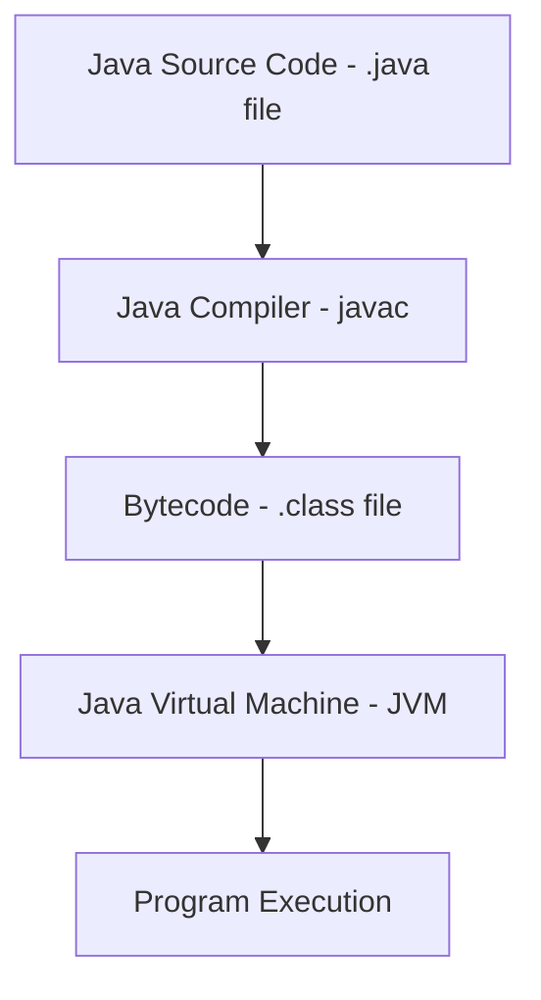
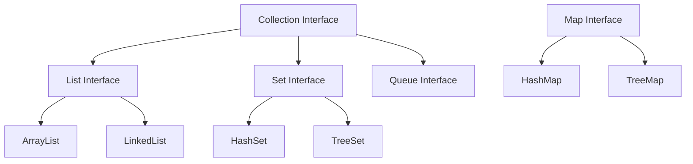

# Java Crash Course: The Essential 85%

Hey there! Let's dive into Java, one of the most popular programming languages in the world. I've designed this crash course to cover the 85% of Java you'll use daily, while giving you enough foundation to explore the remaining 15% on your own. Let's get started!

## What is Java?

Java is a versatile, object-oriented programming language created in 1995 by James Gosling at Sun Microsystems (now owned by Oracle). Its famous slogan is "Write Once, Run Anywhere," meaning Java code can run on any device with a Java Virtual Machine (JVM).

## Setting Up Your Java Environment

Before writing any code, let's get your environment ready:

1. **Install the Java Development Kit (JDK)**:

   - Go to [Oracle's JDK download page](https://www.oracle.com/java/technologies/downloads/) or use [OpenJDK](https://adoptopenjdk.net/)
   - Download and install the latest version for your OS (Windows, macOS, or Linux)

2. **Verify Installation**: Open a terminal/command prompt and type:

   ```
   java -version
   javac -version
   ```

   Both commands should display version information.

3. **Choose an IDE** (Integrated Development Environment):
   - **IntelliJ IDEA**: Popular, feature-rich IDE by JetBrains (Community edition is free)
   - **Eclipse**: Free, open-source IDE
   - **Visual Studio Code**: Lightweight editor with Java extensions

I recommend IntelliJ IDEA for beginners as it provides excellent code completion and error detection.

## Java Basics

### Your First Java Program

Let's create a classic "Hello, World!" program:

```java
public class HelloWorld {
    public static void main(String[] args) {
        System.out.println("Hello, World!");
    }
}
```

Save this as `HelloWorld.java`, then compile and run it:

```
javac HelloWorld.java
java HelloWorld
```

Let's break down what's happening:

- `public class HelloWorld`: Defines a class named HelloWorld
- `public static void main(String[] args)`: The entry point method for Java applications
- `System.out.println("Hello, World!");`: Prints text to the console

### Java Program Structure



### Variables and Data Types

Java is statically typed, meaning you must declare a variable's type before using it.

**Primitive Data Types**:

```java
// Numbers
byte smallNumber = 127;            // 8-bit integer (-128 to 127)
short mediumNumber = 32767;        // 16-bit integer
int standardNumber = 2147483647;   // 32-bit integer (most common)
long largeNumber = 9223372036854775807L; // 64-bit integer (note the 'L')

// Decimal numbers
float decimalNumber = 3.14f;       // 32-bit floating point (note the 'f')
double preciseDecimal = 3.14159265359; // 64-bit floating point (default for decimals)

// Other primitives
char singleCharacter = 'A';        // Single 16-bit Unicode character
boolean truthValue = true;         // true or false
```

**Reference Types**:

```java
String greeting = "Hello Java!";  // String is a class, not a primitive
int[] numbers = {1, 2, 3, 4, 5};  // Arrays store collections of values
```

### Operators

```java
// Arithmetic operators
int sum = 5 + 3;      // 8
int difference = 5 - 3; // 2
int product = 5 * 3;   // 15
int quotient = 5 / 2;  // 2 (integer division truncates)
int remainder = 5 % 2; // 1

// Comparison operators
boolean isEqual = (5 == 5);       // true
boolean isNotEqual = (5 != 3);    // true
boolean isGreater = (5 > 3);      // true
boolean isLessOrEqual = (5 <= 5); // true

// Logical operators
boolean andResult = (true && false); // false (both must be true)
boolean orResult = (true || false);  // true (at least one must be true)
boolean notResult = !true;           // false (inverts the boolean value)
```

### Control Flow

**Conditional Statements**:

```java
int score = 85;

// if-else statement
if (score >= 90) {
    System.out.println("Grade: A");
} else if (score >= 80) {
    System.out.println("Grade: B");
} else if (score >= 70) {
    System.out.println("Grade: C");
} else {
    System.out.println("Grade: F");
}
// Output: Grade: B

// Switch statement
int day = 3;
switch (day) {
    case 1:
        System.out.println("Monday");
        break;
    case 2:
        System.out.println("Tuesday");
        break;
    case 3:
        System.out.println("Wednesday");
        break;
    default:
        System.out.println("Another day");
}
// Output: Wednesday
```

**Loops**:

```java
// For loop
for (int i = 0; i < 5; i++) {
    System.out.print(i + " ");
}
// Output: 0 1 2 3 4

// Enhanced for loop (for arrays or collections)
int[] numbers = {1, 2, 3, 4, 5};
for (int num : numbers) {
    System.out.print(num + " ");
}
// Output: 1 2 3 4 5

// While loop
int count = 0;
while (count < 3) {
    System.out.print(count + " ");
    count++;
}
// Output: 0 1 2

// Do-while loop (executes at least once)
int x = 0;
do {
    System.out.print(x + " ");
    x++;
} while (x < 3);
// Output: 0 1 2
```

## Object-Oriented Programming (OOP)

Java is fundamentally object-oriented. Here are the key OOP concepts:

### Classes and Objects

A class is a blueprint for objects. Objects are instances of classes.

```java
// Define a class
public class Car {
    // Fields (attributes)
    private String make;
    private String model;
    private int year;

    // Constructor
    public Car(String make, String model, int year) {
        this.make = make;
        this.model = model;
        this.year = year;
    }

    // Methods
    public void startEngine() {
        System.out.println("Vroom! Engine started.");
    }

    public String getDescription() {
        return year + " " + make + " " + model;
    }
}

// Create and use objects
public class CarDemo {
    public static void main(String[] args) {
        // Create two Car objects
        Car myCar = new Car("Toyota", "Corolla", 2022);
        Car friendsCar = new Car("Honda", "Civic", 2021);

        // Use the objects
        System.out.println("My car: " + myCar.getDescription());
        myCar.startEngine();

        System.out.println("Friend's car: " + friendsCar.getDescription());
    }
}
```

### Inheritance

Inheritance allows a class to inherit attributes and methods from another class.

```java
// Parent class
public class Vehicle {
    protected String make;
    protected String model;

    public Vehicle(String make, String model) {
        this.make = make;
        this.model = model;
    }

    public void start() {
        System.out.println("Vehicle started");
    }
}

// Child class inherits from Vehicle
public class ElectricCar extends Vehicle {
    private int batteryCapacity;

    public ElectricCar(String make, String model, int batteryCapacity) {
        super(make, model); // Call parent constructor
        this.batteryCapacity = batteryCapacity;
    }

    // Override parent method
    @Override
    public void start() {
        System.out.println("Electric car silently started");
    }

    // Add new method
    public void charge() {
        System.out.println("Charging the battery");
    }
}

// Usage
ElectricCar tesla = new ElectricCar("Tesla", "Model 3", 75);
tesla.start(); // Calls the overridden method
tesla.charge(); // Calls ElectricCar's method
```

### Polymorphism

Polymorphism means "many forms" and occurs when we have many classes related by inheritance.

```java
// Using the classes defined above
public class VehicleDemo {
    public static void main(String[] args) {
        // Polymorphism in action
        Vehicle v1 = new Vehicle("Generic", "Vehicle");
        Vehicle v2 = new ElectricCar("Tesla", "Model S", 100);

        // Both call start(), but behavior depends on the actual object type
        v1.start(); // Output: Vehicle started
        v2.start(); // Output: Electric car silently started

        // This won't work because Vehicle doesn't have charge() method
        // v2.charge(); // Compilation error

        // We need to cast to access ElectricCar specific methods
        ((ElectricCar) v2).charge(); // Output: Charging the battery
    }
}
```

### Encapsulation

Encapsulation is the concept of hiding data within a class, preventing direct access from outside.

```java
public class BankAccount {
    // Private fields - cannot be accessed directly from outside
    private String accountNumber;
    private double balance;

    public BankAccount(String accountNumber, double initialDeposit) {
        this.accountNumber = accountNumber;
        this.balance = initialDeposit;
    }

    // Getter methods
    public String getAccountNumber() {
        return accountNumber;
    }

    public double getBalance() {
        return balance;
    }

    // Methods to modify private data
    public void deposit(double amount) {
        if (amount > 0) {
            balance += amount;
            System.out.println("Deposited: $" + amount);
        }
    }

    public void withdraw(double amount) {
        if (amount > 0 && amount <= balance) {
            balance -= amount;
            System.out.println("Withdrawn: $" + amount);
        } else {
            System.out.println("Invalid withdrawal amount or insufficient funds");
        }
    }
}
```

### Abstraction

Abstraction hides implementation details and shows only functionality.

```java
// Abstract class
public abstract class Shape {
    // Abstract method (no implementation)
    public abstract double calculateArea();

    // Concrete method
    public void display() {
        System.out.println("Area: " + calculateArea());
    }
}

// Concrete class
public class Circle extends Shape {
    private double radius;

    public Circle(double radius) {
        this.radius = radius;
    }

    @Override
    public double calculateArea() {
        return Math.PI * radius * radius;
    }
}

// Another concrete class
public class Rectangle extends Shape {
    private double length;
    private double width;

    public Rectangle(double length, double width) {
        this.length = length;
        this.width = width;
    }

    @Override
    public double calculateArea() {
        return length * width;
    }
}
```

### Interfaces

Interfaces define a contract that implementing classes must follow.

```java
// Interface definition
public interface Payable {
    double calculatePayment();
}

// Implementing the interface
public class Employee implements Payable {
    private String name;
    private double hourlyRate;
    private int hoursWorked;

    public Employee(String name, double hourlyRate, int hoursWorked) {
        this.name = name;
        this.hourlyRate = hourlyRate;
        this.hoursWorked = hoursWorked;
    }

    @Override
    public double calculatePayment() {
        return hourlyRate * hoursWorked;
    }
}

// Another class implementing the same interface
public class Invoice implements Payable {
    private String partNumber;
    private int quantity;
    private double pricePerItem;

    public Invoice(String partNumber, int quantity, double pricePerItem) {
        this.partNumber = partNumber;
        this.quantity = quantity;
        this.pricePerItem = pricePerItem;
    }

    @Override
    public double calculatePayment() {
        return quantity * pricePerItem;
    }
}
```

## Java Collections Framework

The Java Collections Framework provides a set of classes and interfaces for storing and manipulating groups of objects.



### Lists

Lists are ordered collections that can contain duplicate elements.

```java
import java.util.ArrayList;
import java.util.List;

public class ListExample {
    public static void main(String[] args) {
        // Create a List of Strings
        List<String> fruits = new ArrayList<>();

        // Add elements
        fruits.add("Apple");
        fruits.add("Banana");
        fruits.add("Orange");
        fruits.add("Apple"); // Duplicates allowed

        // Access elements
        System.out.println("First fruit: " + fruits.get(0)); // Output: Apple

        // Iterate through the list
        System.out.println("All fruits:");
        for (String fruit : fruits) {
            System.out.println("- " + fruit);
        }

        // Size of the list
        System.out.println("Number of fruits: " + fruits.size()); // Output: 4

        // Check if an element exists
        System.out.println("Contains Banana? " + fruits.contains("Banana")); // Output: true

        // Remove an element
        fruits.remove("Banana");
        System.out.println("After removal: " + fruits); // Output: [Apple, Orange, Apple]
    }
}
```

### Sets

Sets are collections that cannot contain duplicate elements.

```java
import java.util.HashSet;
import java.util.Set;

public class SetExample {
    public static void main(String[] args) {
        // Create a Set of Integers
        Set<Integer> numbers = new HashSet<>();

        // Add elements
        numbers.add(10);
        numbers.add(20);
        numbers.add(30);
        numbers.add(10); // Duplicate not added

        // Size of the set
        System.out.println("Size: " + numbers.size()); // Output: 3

        // Print all elements
        System.out.println("Numbers in set: " + numbers); // Order not guaranteed

        // Check if an element exists
        System.out.println("Contains 20? " + numbers.contains(20)); // Output: true

        // Remove an element
        numbers.remove(20);
        System.out.println("After removal: " + numbers);
    }
}
```

### Maps

Maps store key-value pairs. Each key can map to at most one value.

```java
import java.util.HashMap;
import java.util.Map;

public class MapExample {
    public static void main(String[] args) {
        // Create a Map with String keys and Integer values
        Map<String, Integer> ageMap = new HashMap<>();

        // Add key-value pairs
        ageMap.put("Alice", 25);
        ageMap.put("Bob", 30);
        ageMap.put("Charlie", 35);

        // Access a value by key
        System.out.println("Bob's age: " + ageMap.get("Bob")); // Output: 30

        // Check if a key exists
        System.out.println("Is David in the map? " + ageMap.containsKey("David")); // Output: false

        // Print all entries
        System.out.println("All entries:");
        for (Map.Entry<String, Integer> entry : ageMap.entrySet()) {
            System.out.println(entry.getKey() + " is " + entry.getValue() + " years old");
        }

        // Update a value
        ageMap.put("Alice", 26); // Overwrites the previous value

        // Remove an entry
        ageMap.remove("Charlie");

        // Size of the map
        System.out.println("Size after removal: " + ageMap.size()); // Output: 2
    }
}
```

## Exception Handling

Exceptions represent errors that occur during program execution. Java uses try-catch blocks to handle exceptions.

```java
import java.io.File;
import java.io.FileNotFoundException;
import java.util.Scanner;

public class ExceptionExample {
    public static void main(String[] args) {
        // Try-catch for handling exceptions
        try {
            // Code that might throw an exception
            File file = new File("nonexistent.txt");
            Scanner scanner = new Scanner(file);

            // This code won't execute if the exception is thrown
            System.out.println("Reading file...");
        } catch (FileNotFoundException e) {
            // Handle the exception
            System.out.println("Error: File not found");
            System.out.println("Exception details: " + e.getMessage());
        } finally {
            // This block always executes, regardless of whether an exception occurred
            System.out.println("End of file operation");
        }

        // Try-catch with multiple exceptions
        try {
            int[] numbers = {1, 2, 3};
            System.out.println(numbers[5]); // This will throw ArrayIndexOutOfBoundsException
        } catch (ArrayIndexOutOfBoundsException e) {
            System.out.println("Error: Array index out of bounds");
        } catch (Exception e) {
            // Generic catch block for any other exceptions
            System.out.println("Error: " + e.getMessage());
        }

        // Example of throwing an exception
        try {
            validateAge(15);
        } catch (IllegalArgumentException e) {
            System.out.println(e.getMessage());
        }
    }

    public static void validateAge(int age) {
        if (age < 18) {
            throw new IllegalArgumentException("Age must be 18 or older");
        }
        System.out.println("Age validation passed");
    }
}
```

## File I/O Operations

Java provides several ways to read and write files. Here's an example using the newer `java.nio.file` package:

```java
import java.io.IOException;
import java.nio.file.Files;
import java.nio.file.Path;
import java.nio.file.Paths;
import java.nio.file.StandardOpenOption;
import java.util.List;

public class FileIOExample {
    public static void main(String[] args) {
        // Path to our file
        Path filePath = Paths.get("example.txt");

        // Writing to a file
        try {
            // Create content
            String content = "Hello, Java File I/O!\nThis is a second line.";

            // Write to file (creates file if it doesn't exist)
            Files.write(filePath, content.getBytes(), StandardOpenOption.CREATE);
            System.out.println("Successfully wrote to the file");

        } catch (IOException e) {
            System.out.println("Error writing to file: " + e.getMessage());
        }

        // Reading from a file
        try {
            // Read all lines into a List
            List<String> lines = Files.readAllLines(filePath);

            System.out.println("File contents:");
            for (String line : lines) {
                System.out.println(line);
            }

        } catch (IOException e) {
            System.out.println("Error reading file: " + e.getMessage());
        }
    }
}
```

## A Practical Example: Simple Todo Application

Let's build a simple console-based Todo application to practice what we've learned:

```java
import java.util.ArrayList;
import java.util.List;
import java.util.Scanner;

public class TodoApp {
    // List to store our todos
    private static List<String> todos = new ArrayList<>();
    private static Scanner scanner = new Scanner(System.in);

    public static void main(String[] args) {
        boolean running = true;

        // Welcome message
        System.out.println("=== Simple Todo App ===");

        // Main application loop
        while (running) {
            // Display menu
            System.out.println("\nOptions:");
            System.out.println("1. Add a todo");
            System.out.println("2. View all todos");
            System.out.println("3. Mark todo as complete (remove)");
            System.out.println("4. Exit");
            System.out.print("Enter your choice (1-4): ");

            // Get user input
            String choice = scanner.nextLine();

            // Process user choice
            switch (choice) {
                case "1":
                    addTodo();
                    break;
                case "2":
                    viewTodos();
                    break;
                case "3":
                    completeTodo();
                    break;
                case "4":
                    running = false;
                    System.out.println("Goodbye!");
                    break;
                default:
                    System.out.println("Invalid choice. Please try again.");
            }
        }

        // Close the scanner
        scanner.close();
    }

    // Method to add a new todo
    private static void addTodo() {
        System.out.print("Enter your todo: ");
        String todo = scanner.nextLine();

        if (!todo.isEmpty()) {
            todos.add(todo);
            System.out.println("Todo added successfully!");
        } else {
            System.out.println("Todo cannot be empty.");
        }
    }

    // Method to view all todos
    private static void viewTodos() {
        if (todos.isEmpty()) {
            System.out.println("No todos yet. Add some tasks first!");
            return;
        }

        System.out.println("\n=== Your Todos ===");
        for (int i = 0; i < todos.size(); i++) {
            System.out.println((i + 1) + ". " + todos.get(i));
        }
    }

    // Method to mark a todo as complete (remove it)
    private static void completeTodo() {
        if (todos.isEmpty()) {
            System.out.println("No todos to complete!");
            return;
        }

        // Show todos
        viewTodos();

        // Ask which one to complete
        System.out.print("Enter the number of the todo to mark as complete: ");
        try {
            int index = Integer.parseInt(scanner.nextLine()) - 1;

            if (index >= 0 && index < todos.size()) {
                String completedTodo = todos.remove(index);
                System.out.println("'" + completedTodo + "' marked as complete!");
            } else {
                System.out.println("Invalid todo number.");
            }
        } catch (NumberFormatException e) {
            System.out.println("Please enter a valid number.");
        }
    }
}
```

## Building with Maven

For larger projects, you'll want to use a build tool like Maven:

1. **Install Maven**: Download from [Maven's website](https://maven.apache.org/download.cgi) and add it to your PATH

2. **Create a new Maven project**:

```
mvn archetype:generate -DgroupId=com.example -DartifactId=my-app -DarchetypeArtifactId=maven-archetype-quickstart -DinteractiveMode=false
```

3. **Project structure**:

```
my-app/
├── pom.xml                  <- Project configuration
├── src/
│   ├── main/
│   │   └── java/           <- Your application code
│   │       └── com/
│   │           └── example/
│   │               └── App.java
│   └── test/
│       └── java/           <- Test code
│           └── com/
│               └── example/
│                   └── AppTest.java
```

4. **Basic pom.xml**:

```xml
<project xmlns="http://maven.apache.org/POM/4.0.0"
         xmlns:xsi="http://www.w3.org/2001/XMLSchema-instance"
         xsi:schemaLocation="http://maven.apache.org/POM/4.0.0 http://maven.apache.org/maven-v4_0_0.xsd">
    <modelVersion>4.0.0</modelVersion>
    <groupId>com.example</groupId>
    <artifactId>my-app</artifactId>
    <packaging>jar</packaging>
    <version>1.0-SNAPSHOT</version>
    <name>my-app</name>

    <properties>
        <project.build.sourceEncoding>UTF-8</project.build.sourceEncoding>
        <maven.compiler.source>11</maven.compiler.source>
        <maven.compiler.target>11</maven.compiler.target>
    </properties>

    <dependencies>
        <!-- JUnit for testing -->
        <dependency>
            <groupId>junit</groupId>
            <artifactId>junit</artifactId>
            <version>4.13.2</version>
            <scope>test</scope>
        </dependency>
    </dependencies>
</project>
```

5. **Build and run**:

```
cd my-app
mvn package
java -cp target/my-app-1.0-SNAPSHOT.jar com.example.App
```

## The Remaining 15%: Advanced Java Topics

Here's a list of advanced Java topics to explore once you're comfortable with the basics:

1. **Multithreading and Concurrency**

   - Thread creation and management
   - Synchronization
   - Executor Framework
   - java.util.concurrent package

2. **Advanced Java Features**

   - Lambda expressions and functional interfaces
   - Stream API for functional-style operations
   - Optional class for null safety
   - Method references

3. **Java Frameworks and Libraries**

   - Spring Framework for enterprise applications
   - Hibernate for object-relational mapping
   - Jackson/Gson for JSON processing
   - JUnit and Mockito for testing

4. **Web Development**

   - Servlets and JSP
   - RESTful web services with JAX-RS
   - Spring Boot for rapid development

5. **Database Connectivity**

   - JDBC for database access
   - JPA for object-relational mapping

6. **Java EE/Jakarta EE**

   - Enterprise JavaBeans (EJB)
   - Contexts and Dependency Injection (CDI)
   - Java Message Service (JMS)

7. **Advanced Build Tools**

   - Gradle
   - Continuous Integration/Deployment

8. **Design Patterns**

   - Singleton, Factory, Builder, etc.
   - MVC architecture

9. **Java Memory Management**

   - Understanding the Java Memory Model
   - Garbage Collection

10. **Java Security**
    - Cryptography
    - Security APIs

## Resources for Further Learning

1. **Official Documentation**: [Oracle's Java Documentation](https://docs.oracle.com/javase/)
2. **Books**: "Effective Java" by Joshua Bloch
3. **Online Courses**: Coursera, Udemy, or edX Java courses
4. **Practice**: Sites like LeetCode, HackerRank for coding challenges
5. **Community**: Stack Overflow for questions, GitHub for exploring projects

And there you have it! You've just completed a crash course covering 85% of the Java you'll use on a daily basis. As you practice and build projects, you'll naturally start exploring more of the advanced topics. Happy coding!
