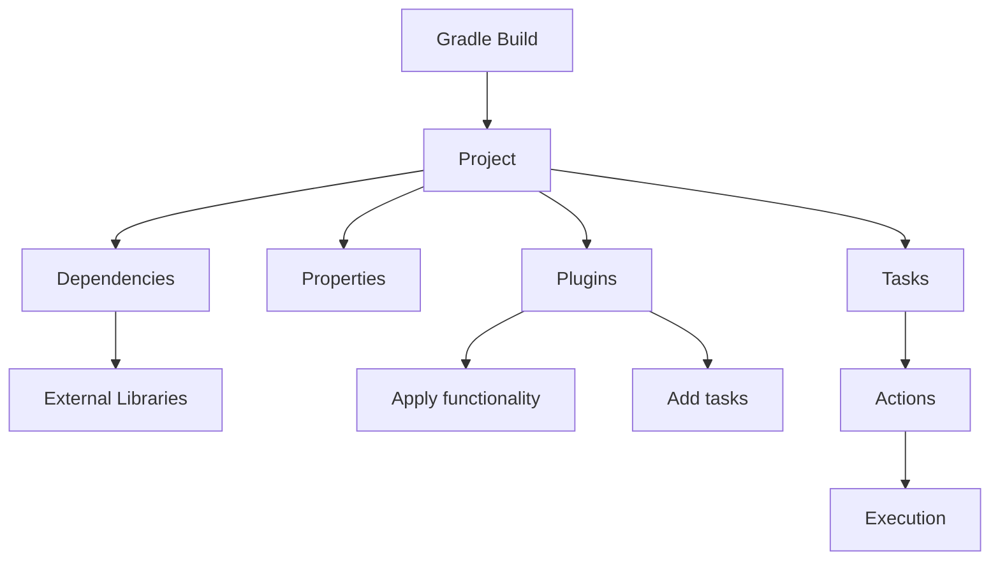
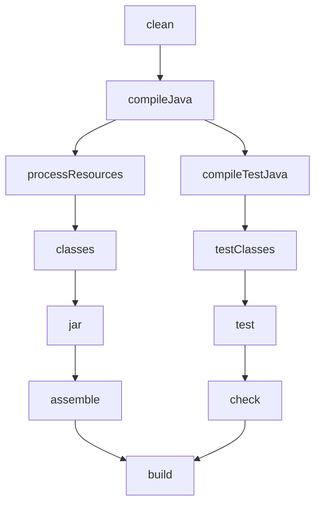
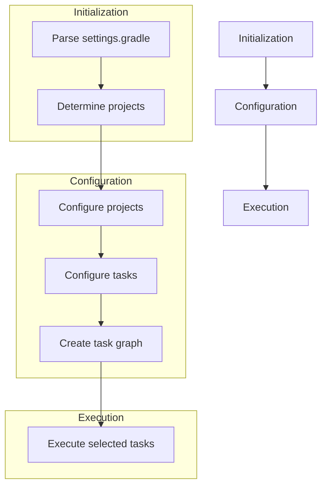

Hey there! Let's dive into Gradle - the powerful, flexible build system that's become a standard in many development environments. By the end of this guide, you'll be comfortable with Gradle for your daily tasks, and you'll know enough to explore the more advanced stuff on your own.

## What is Gradle?

Gradle is a build automation tool that helps you compile your code, manage dependencies, run tests, package applications, and deploy them. Think of it as your project's personal assistant - it handles all the repetitive tasks, leaving you free to focus on writing great code.

```
"Gradle combines the power of Ant with the dependency management of Maven,
wrapped in a Groovy or Kotlin DSL that makes it much more flexible and customizable."
```

## Why Gradle Over Other Build Tools?

Gradle offers some significant advantages over older tools like Maven and Ant:

- **Speed**: Gradle is faster thanks to its incremental builds and build cache
- **Flexibility**: Uses a programming language (Groovy or Kotlin) instead of XML
- **Dependency Management**: Powerful and flexible dependency resolution
- **Extensibility**: Easy to create custom tasks and plugins
- **Multi-project Builds**: Great support for managing complex, multi-module projects

## Installing Gradle

Let's get you up and running with Gradle:

### Prerequisites:

- Java Development Kit (JDK) 8 or newer installed
- Internet connection for downloading dependencies

### Installation:

**Option 1: Manual Installation**

1. Download Gradle from [gradle.org/releases](https://gradle.org/releases/)
2. Unzip to a directory of your choice
3. Add the `bin` directory to your PATH environment variable

**Option 2: Using SDKMAN (recommended for Linux/macOS)**

```bash
# Install SDKMAN first
curl -s "https://get.sdkman.io" | bash
source "$HOME/.sdkman/bin/sdkman-init.sh"

# Then install Gradle
sdk install gradle
```

**Option 3: Using Homebrew (macOS)**

```bash
brew install gradle
```

**Option 4: Using Chocolatey (Windows)**

```bash
choco install gradle
```

Verify your installation with:

```bash
gradle -v
```

## Gradle Core Concepts

Let's understand the fundamental building blocks of Gradle:



### Projects

A project represents something you're building (an application, library, etc.). Every Gradle build consists of one or more projects.

### Tasks

Tasks are the atomic units of work in a Gradle build. Examples include compiling code, running tests, or creating a JAR file.

### Dependencies

These are external libraries your project needs. Gradle manages downloading and linking them for you.

## Basic Project Structure

Here's what a typical Gradle project looks like:

```
my-project/
├── build.gradle      # The main build script
├── settings.gradle   # Project settings (name, subprojects)
├── gradle/
│   └── wrapper/      # Gradle wrapper files
├── gradlew          # Gradle wrapper script (Unix)
├── gradlew.bat      # Gradle wrapper script (Windows)
├── src/
│   ├── main/
│   │   ├── java/     # Your Java source code
│   │   └── resources/ # Non-code resources
│   └── test/
│       ├── java/     # Your test code
│       └── resources/ # Test resources
└── build/           # Generated files (created by Gradle)
```

## Creating Your First Gradle Project

Let's create a simple Java application:

```bash
# Create a directory for your project
mkdir my-first-gradle-project
cd my-first-gradle-project

# Initialize a Gradle project
gradle init
```

When prompted:

- Select "application" as the project type
- Select your implementation language (Java)
- Select build script DSL (Groovy or Kotlin)
- Use the defaults for the rest

## Understanding build.gradle

The `build.gradle` file is the heart of your project configuration. Here's a simple example for a Java application:

```groovy
// Apply the Java plugin - adds tasks for compiling Java, running tests, etc.
plugins {
    id 'java'
    id 'application'  // Adds support for running the application
}

// Basic information about your project
group = 'com.example'
version = '0.1.0'

// Set the main class for the application
application {
    mainClass = 'com.example.App'
}

// Configure which repositories to use for finding dependencies
repositories {
    mavenCentral()  // Use the Maven Central repository
}

// Define dependencies
dependencies {
    // Implementation dependencies (needed at compile and runtime)
    implementation 'com.google.guava:guava:30.1-jre'

    // Test dependencies
    testImplementation 'junit:junit:4.13.2'
}

// Custom task example
task hello {
    doLast {
        println 'Hello, Gradle!'
    }
}
```

## Running Gradle Tasks

To run tasks, use the `gradle` command followed by the task name:

```bash
# List all available tasks
gradle tasks

# Run the build task (compiles code, runs tests)
gradle build

# Run the application
gradle run

# Run your custom task
gradle hello

# Clean the build directory
gradle clean
```

Pro tip: use the `-q` flag for quieter output:

```bash
gradle -q run
```

## The Gradle Wrapper

The Gradle Wrapper is a best practice that ensures everyone uses the same Gradle version:

```bash
# Generate wrapper files (if not already present)
gradle wrapper --gradle-version=7.4.2
```

Now you can use `./gradlew` (or `gradlew.bat` on Windows) instead of `gradle`:

```bash
./gradlew build
```

Benefits:

- No need to install Gradle
- Ensures consistent builds across different environments
- Automatically downloads the specified Gradle version

## Managing Dependencies

Dependency management is one of Gradle's strengths:

```groovy
dependencies {
    // For code that's part of your application
    implementation 'group:name:version'

    // For APIs you expose to users of your library
    api 'group:name:version'

    // For compilation only
    compileOnly 'group:name:version'

    // For testing
    testImplementation 'group:name:version'

    // For runtime only
    runtimeOnly 'group:name:version'
}
```

Example with real libraries:

```groovy
dependencies {
    // Spring Boot starter
    implementation 'org.springframework.boot:spring-boot-starter-web:2.6.3'

    // Database driver
    runtimeOnly 'mysql:mysql-connector-java:8.0.28'

    // Testing frameworks
    testImplementation 'org.junit.jupiter:junit-jupiter:5.8.2'
    testImplementation 'org.mockito:mockito-core:4.3.1'
}
```

## Common Plugins

Plugins add pre-configured tasks and conventions to your build:

```groovy
plugins {
    id 'java'                    // Java compilation, testing, etc.
    id 'application'             // For applications with a main class
    id 'java-library'            // For Java libraries
    id 'org.springframework.boot' version '2.6.3'  // For Spring Boot apps
    id 'io.spring.dependency-management' version '1.0.11.RELEASE'
    id 'com.android.application' // For Android apps
}
```

## Task Lifecycle and Dependency

Tasks can depend on each other and have a lifecycle:



Creating task dependencies:

```groovy
task hello {
    doLast {
        println 'Hello, World!'
    }
}

task goodbye(dependsOn: hello) {
    doLast {
        println 'Goodbye, World!'
    }
}

// Running 'gradle goodbye' will first run 'hello', then 'goodbye'
```

## Working with Multi-Project Builds

For larger applications, you might split your code into multiple projects:

**settings.gradle:**

```groovy
rootProject.name = 'my-application'

// Include subprojects
include 'api'
include 'service'
include 'web'
```

**Root build.gradle:**

```groovy
// Configuration common to all projects
allprojects {
    repositories {
        mavenCentral()
    }
}

// Configuration for all subprojects but not the root project
subprojects {
    apply plugin: 'java'

    dependencies {
        testImplementation 'junit:junit:4.13.2'
    }
}
```

**api/build.gradle:**

```groovy
dependencies {
    implementation 'com.google.guava:guava:30.1-jre'
}
```

**service/build.gradle:**

```groovy
dependencies {
    implementation project(':api')  // Depends on the api project
}
```

## Custom Tasks

Creating custom tasks is straightforward:

```groovy
// Simple task
task copyDocs(type: Copy) {
    from 'src/docs'
    into 'build/docs'
}

// Task with custom actions
task countdown {
    doLast {
        5.downto(1) { number ->
            println "$number..."
        }
        println "Liftoff!"
    }
}

// Task with properties
task analyze {
    ext.outputDir = file("$buildDir/reports")

    doLast {
        println "Analyzing... Output will be in $outputDir"
    }
}
```

## Working with Database Projects

If you're working on a project with a database, you can use Gradle to manage database migrations and seed data:

**build.gradle:**

```groovy
plugins {
    id 'java'
    id 'org.flywaydb.flyway' version '8.5.0'  // For database migrations
}

repositories {
    mavenCentral()
}

dependencies {
    implementation 'org.flywaydb:flyway-core:8.5.0'
    implementation 'org.postgresql:postgresql:42.3.2'
}

flyway {
    url = 'jdbc:postgresql://localhost:5432/mydb'
    user = 'postgres'
    password = 'postgres'
    locations = ['filesystem:src/main/resources/db/migration']
}
```

**src/main/resources/db/migration/V1\_\_Create_tables.sql:**

```sql
-- Create tables
CREATE TABLE users (
    id SERIAL PRIMARY KEY,
    username VARCHAR(100) NOT NULL,
    email VARCHAR(100) NOT NULL,
    created_at TIMESTAMP NOT NULL DEFAULT NOW()
);

CREATE TABLE posts (
    id SERIAL PRIMARY KEY,
    user_id INTEGER REFERENCES users(id),
    title VARCHAR(200) NOT NULL,
    content TEXT,
    published_at TIMESTAMP
);

-- Seed data
INSERT INTO users (username, email) VALUES
('john_doe', 'john@example.com'),
('jane_smith', 'jane@example.com');

INSERT INTO posts (user_id, title, content, published_at) VALUES
(1, 'First Post', 'This is my first post!', NOW()),
(2, 'Hello World', 'Hello to everyone reading this!', NOW());
```

To run migrations:

```bash
./gradlew flywayMigrate
```

## Build Lifecycle

Understanding the build lifecycle helps you hook into the right points:



## Gradle Properties

You can configure Gradle behavior with properties:

**gradle.properties:**

```properties
# Increase memory for the daemon
org.gradle.jvmargs=-Xmx2048m

# Enable parallel execution
org.gradle.parallel=true

# Enable build cache
org.gradle.caching=true

# Custom project properties
appVersion=1.0.0
jdbcUrl=jdbc:postgresql://localhost:5432/mydb
```

Access in build.gradle:

```groovy
version = property('appVersion')

println "JDBC URL: ${property('jdbcUrl')}"
```

## The 15% You'll Explore Later

Here's what we've left for you to discover on your own (but now you have the foundation to learn it):

1. **Advanced Dependency Management**

   - Version catalogs
   - Dynamic versions
   - Dependency substitution
   - Custom repositories

2. **Writing Custom Plugins**

   - Creating reusable build logic
   - Publishing plugins

3. **Build Cache and Performance Optimization**

   - Configuring build cache
   - Incremental tasks
   - Profiling builds

4. **Continuous Integration**

   - Setting up Gradle with CI systems
   - Publishing artifacts to repositories

5. **Testing Framework Integration**

   - Advanced test configuration
   - Test reports and aggregation

6. **Gradle Kotlin DSL**

   - Converting from Groovy to Kotlin DSL
   - IDE integration

7. **Configuration Avoidance**

   - Lazy configuration
   - Configuration caching

8. **Composite Builds**

   - Including builds from other locations
   - Build substitution

9. **Gradle Enterprise**

   - Build scans
   - Advanced performance monitoring

10. **Dealing with Legacy Systems**
    - Migrating from Ant/Maven
    - Integrating with non-Gradle components

## Final Tips

1. **Use the Wrapper**: Always use the Gradle Wrapper (`gradlew`) rather than a locally installed Gradle.

2. **Read the Docs**: The [Gradle documentation](https://docs.gradle.org/) is comprehensive and well-written.

3. **Keep Build Scripts Clean**: Avoid putting too much logic in your build scripts. Extract complex logic to plugins.

4. **Be Careful with Task Dependencies**: Explicitly declare task dependencies to ensure correct execution order.

5. **Use Gradle Forums**: The Gradle community is helpful if you get stuck.

And that's your crash course! You now know enough about Gradle to handle 85% of what you'll need day-to-day. The remaining 15% will come naturally as you encounter specific needs in your projects. Happy building!
