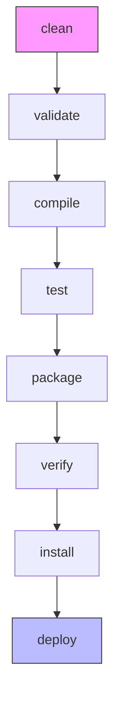
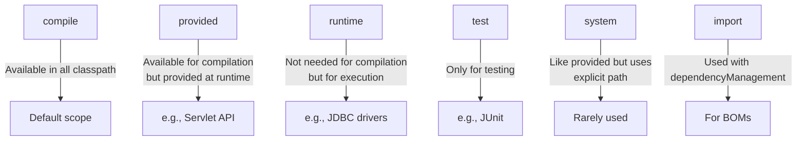
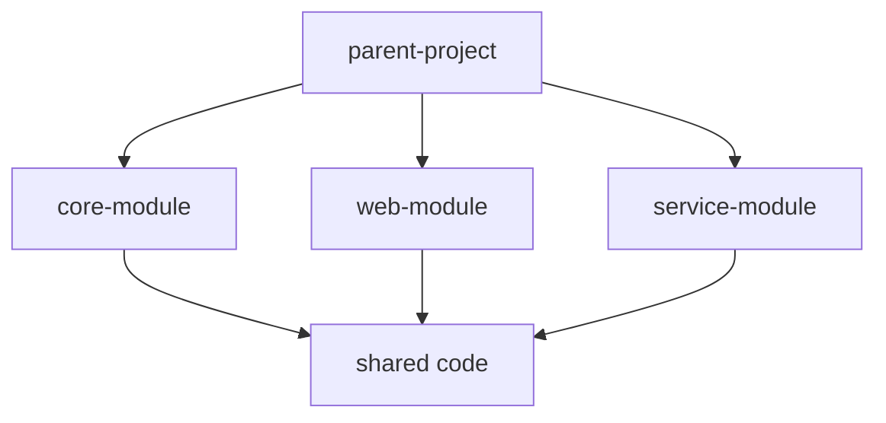

Maven is a powerful build automation and project management tool primarily used for Java projects. This crash course will give you the essential knowledge to use Maven effectively in your daily work.

## Prerequisites

Before diving into Maven, make sure you have:

- Java 8 or later installed on your system (required to run Maven)
- Basic understanding of Java programming
- Comfort with using command line interfaces

## 1. Installation & Setup

Let's start by getting Maven installed on your system:

### For Windows:

1. Download the latest binary zip from [Apache Maven](https://maven.apache.org/download.cgi)
2. Extract to a directory like `C:\Program Files\Apache\maven`
3. Add Maven's bin directory to your PATH:
   - Right-click on "This PC" → Properties → Advanced System Settings
   - Environment Variables → System Variables → Path → Edit → New
   - Add the path to your Maven bin directory (e.g., `C:\Program Files\Apache\maven\bin`)
4. Set JAVA_HOME environment variable to your JDK installation

### For Mac/Linux:

```bash
# Using Homebrew on Mac
brew install maven

# On Linux
sudo apt-get install maven  # Debian/Ubuntu
sudo dnf install maven      # Fedora
```

### Verify Installation:

Once installed, confirm everything is working properly:

```bash
mvn -v
# Should display Maven version, Java version, and system info
```

## 2. Core Concepts

Now that Maven is installed, let's understand its fundamental concepts:

Maven is built on two key principles:

1. **Project Object Model (POM)**: An XML file that describes your project
2. **Convention over Configuration**: Standard directory structure and build lifecycle that reduces the need for extensive configuration

### Understanding the POM File

Every Maven project contains a `pom.xml` file in its root directory. This is the heart of your project configuration:

```xml
<project>
    <!-- Maven coordinates (project identity) -->
    <groupId>com.example</groupId>        <!-- Organization/company namespace -->
    <artifactId>my-app</artifactId>       <!-- Project name -->
    <version>1.0-SNAPSHOT</version>       <!-- Version with -SNAPSHOT for development -->

    <!-- Project metadata -->
    <name>My First Maven App</name>
    <description>A simple Maven project</description>

    <!-- Build settings, dependencies, etc. go here -->
</project>
```

The combination of groupId, artifactId, and version creates a unique identifier for your project in the Maven ecosystem.

### Standard Directory Structure

Maven encourages a standard project layout that helps maintain consistency across projects:

```
my-project/
├── pom.xml                  # Project configuration
├── src/
│   ├── main/                # Main source code
│   │   ├── java/            # Java source files
│   │   └── resources/       # Configuration files, properties, etc.
│   └── test/                # Test code
│       ├── java/            # Java test files
│       └── resources/       # Test configuration and resources
└── target/                  # Generated output (created by Maven)
```

By following this convention, Maven knows where to find your code and where to put the compiled assets without additional configuration.

## 3. Maven Build Lifecycle

Maven's power comes from its standardized build process, which follows a series of phases. This predictable sequence is called the build lifecycle:



Each phase represents a stage in the build process:

- **validate**: Validates project is correct and all necessary information is available
- **compile**: Compiles the source code
- **test**: Tests the compiled code using a suitable framework
- **package**: Packages the compiled code in its distributable format (JAR, WAR, etc.)
- **verify**: Runs checks to verify the package is valid
- **install**: Installs the package in the local repository for use as a dependency in other projects
- **deploy**: Copies the package to the remote repository for sharing with other developers/projects

### Common Maven Commands:

These commands execute phases in the lifecycle:

```bash
mvn clean           # Removes the target directory
mvn compile         # Compiles source code
mvn test            # Runs unit tests (compiles first if needed)
mvn package         # Creates JAR/WAR in target directory (compiles and tests first)
mvn install         # Installs the package in local repository
mvn clean install   # Combines clean and install phases
```

When you run any phase, Maven executes all prior phases in sequence, ensuring the project is built correctly.

## 4. Dependency Management

One of Maven's most powerful features is its ability to automatically manage project dependencies - the external libraries your project needs.

### Adding Dependencies

To add a dependency, include it in the `<dependencies>` section in your pom.xml:

```xml
<dependencies>
    <!-- JUnit for testing -->
    <dependency>
        <groupId>junit</groupId>
        <artifactId>junit</artifactId>
        <version>4.13.2</version>
        <scope>test</scope>
    </dependency>

    <!-- Log4j for logging -->
    <dependency>
        <groupId>org.apache.logging.log4j</groupId>
        <artifactId>log4j-core</artifactId>
        <version>2.17.1</version>
    </dependency>
</dependencies>
```

Maven automatically downloads these dependencies from repositories, places them in your local repository, and makes them available to your project. This eliminates the need to manually download and manage JAR files.

### Dependency Scopes

Maven offers different scopes for dependencies, which control when the dependency is available:



Understanding these scopes helps you keep your project clean and ensures dependencies are only included when necessary.

### Finding Dependencies

To find the coordinates of libraries you want to use, visit the [Maven Central Repository](https://search.maven.org). You can search for libraries and copy their dependency XML directly into your pom.xml.

## 5. Plugins & Customization

While Maven has a standard build process, plugins allow you to customize and extend this process for your specific needs. In fact, nearly all of Maven's functionality comes from plugins.

Each plugin offers "goals" that execute specific tasks. These goals are bound to different phases of the build lifecycle.

### Common Plugins:

Here are some frequently used plugins and how to configure them:

```xml
<build>
    <plugins>
        <!-- Compiler plugin: controls Java version -->
        <plugin>
            <groupId>org.apache.maven.plugins</groupId>
            <artifactId>maven-compiler-plugin</artifactId>
            <version>3.10.1</version>
            <configuration>
                <source>11</source>  <!-- Java source compatibility -->
                <target>11</target>  <!-- Java target compatibility -->
            </configuration>
        </plugin>

        <!-- JAR plugin: creates executable JAR -->
        <plugin>
            <groupId>org.apache.maven.plugins</groupId>
            <artifactId>maven-jar-plugin</artifactId>
            <version>3.2.2</version>
            <configuration>
                <archive>
                    <manifest>
                        <mainClass>com.example.MainClass</mainClass>
                    </manifest>
                </archive>
            </configuration>
        </plugin>
    </plugins>
</build>
```

These configurations tell Maven to compile your code with Java 11 compatibility and to create an executable JAR with a specific main class.

## 6. Creating a Simple Maven Project

Now that we understand the basics, let's create and build a simple project:

### Using Maven Archetype (Project Template):

Maven provides archetypes (templates) to quickly scaffold different types of projects:

```bash
# Create a simple Java application
mvn archetype:generate \
  -DgroupId=com.example \
  -DartifactId=my-app \
  -DarchetypeArtifactId=maven-archetype-quickstart \
  -DarchetypeVersion=1.4 \
  -DinteractiveMode=false

# Create a web application
mvn archetype:generate \
  -DgroupId=com.example \
  -DartifactId=my-webapp \
  -DarchetypeArtifactId=maven-archetype-webapp \
  -DinteractiveMode=false
```

The commands above create project structures with all the necessary files to get started.

### Structure of Created Project:

After creating a quickstart project, you'll see this structure:

```
my-app/
├── pom.xml                              # Project configuration
└── src/
    ├── main/java/com/example/
    │   └── App.java                     # Main application class
    └── test/java/com/example/
        └── AppTest.java                 # Test class
```

### Building and Running:

You can now build and run your new project:

```bash
cd my-app
mvn package                              # Compiles and creates JAR file
java -cp target/my-app-1.0-SNAPSHOT.jar com.example.App
```

This compiles your code, runs tests, creates a JAR, and then executes the application.

## 7. Working with Multi-Module Projects

As your applications grow, you'll likely want to split them into modules. Maven makes this straightforward:



Multi-module projects help organize code, promote reuse, and enable separate deployment of components.

### Parent POM:

The parent project coordinates the modules:

```xml
<project>
    <modelVersion>4.0.0</modelVersion>
    <groupId>com.example</groupId>
    <artifactId>parent-project</artifactId>
    <version>1.0-SNAPSHOT</version>
    <packaging>pom</packaging>  <!-- Important! -->

    <modules>
        <module>core-module</module>
        <module>web-module</module>
        <module>service-module</module>
    </modules>

    <!-- Shared dependencies and plugins -->
    <dependencyManagement>
        <!-- Define versions here for all modules -->
    </dependencyManagement>
</project>
```

### Module POM (simplified):

Each module references the parent and adds its own specific configuration:

```xml
<project>
    <modelVersion>4.0.0</modelVersion>
    <parent>
        <groupId>com.example</groupId>
        <artifactId>parent-project</artifactId>
        <version>1.0-SNAPSHOT</version>
    </parent>

    <artifactId>core-module</artifactId>
    <!-- No need to specify groupId or version - inherited from parent -->

    <!-- Module-specific dependencies -->
</project>
```

### Building Multi-Module Projects:

Maven provides several options for building multi-module projects:

```bash
# From parent directory, builds all modules
mvn clean install

# Build specific module
mvn -pl core-module clean install

# Build module and its dependencies
mvn -pl web-module -am clean install
```

This flexibility allows you to build only what you need during development.

## 8. IDE Integration

Maven integrates seamlessly with all major Java IDEs, making your development experience smoother:

### IntelliJ IDEA:

- Open/Import → Select the directory containing pom.xml
- Maven Tool Window (right sidebar) → Shows projects and goals

### Eclipse:

- Install m2eclipse plugin
- Import → Existing Maven Projects → Select directory with pom.xml

### VS Code:

- Install Java Extension Pack
- Open folder containing pom.xml

The IDE integration gives you visual tools to run Maven commands and navigate project dependencies.

## 9. Practical Example: Spring Boot Application

Let's put everything together by creating a simple Spring Boot web application:

### Step 1: Generate the project

First, create the basic project structure:

```bash
mvn archetype:generate \
  -DgroupId=com.example \
  -DartifactId=spring-boot-demo \
  -DarchetypeArtifactId=maven-archetype-quickstart \
  -DarchetypeVersion=1.4 \
  -DinteractiveMode=false
```

### Step 2: Update POM with Spring Boot dependencies

Next, modify the pom.xml to include Spring Boot:

```xml
<project>
    <!-- ... existing elements ... -->

    <parent>
        <groupId>org.springframework.boot</groupId>
        <artifactId>spring-boot-starter-parent</artifactId>
        <version>2.7.5</version>
    </parent>

    <dependencies>
        <dependency>
            <groupId>org.springframework.boot</groupId>
            <artifactId>spring-boot-starter-web</artifactId>
        </dependency>
        <dependency>
            <groupId>org.springframework.boot</groupId>
            <artifactId>spring-boot-starter-test</artifactId>
            <scope>test</scope>
        </dependency>
    </dependencies>

    <build>
        <plugins>
            <plugin>
                <groupId>org.springframework.boot</groupId>
                <artifactId>spring-boot-maven-plugin</artifactId>
            </plugin>
        </plugins>
    </build>
</project>
```

The Spring Boot parent POM provides sensible defaults and version management.

### Step 3: Create a simple controller

Now, add a Spring Boot application with a REST controller:

```java
// src/main/java/com/example/DemoApplication.java
package com.example;

import org.springframework.boot.SpringApplication;
import org.springframework.boot.autoconfigure.SpringBootApplication;
import org.springframework.web.bind.annotation.GetMapping;
import org.springframework.web.bind.annotation.RestController;

@SpringBootApplication
public class DemoApplication {
    public static void main(String[] args) {
        SpringApplication.run(DemoApplication.class, args);
    }
}

@RestController
class HelloController {
    @GetMapping("/")
    public String hello() {
        return "Hello, Maven and Spring Boot!";
    }
}
```

This creates a simple web server that responds with a greeting message.

### Step 4: Build and run

Finally, build and run the application:

```bash
mvn clean package
java -jar target/spring-boot-demo-1.0-SNAPSHOT.jar

# Or using Spring Boot Maven plugin
mvn spring-boot:run
```

Access the application at http://localhost:8080 to see your greeting.

This example demonstrates how Maven simplifies dependency management and builds for complex frameworks like Spring Boot.

## 10. Advanced Configuration: Profiles

As you develop more complex applications, you'll need different configurations for different environments. Maven profiles solve this problem:

```xml
<profiles>
    <profile>
        <id>development</id>
        <activation>
            <activeByDefault>true</activeByDefault>
        </activation>
        <properties>
            <db.url>jdbc:h2:mem:devdb</db.url>
            <logging.level>DEBUG</logging.level>
        </properties>
    </profile>

    <profile>
        <id>production</id>
        <properties>
            <db.url>jdbc:mysql://production-server/proddb</db.url>
            <logging.level>WARN</logging.level>
        </properties>
    </profile>
</profiles>
```

Profiles allow you to define environment-specific properties that can be referenced throughout your configuration. Activate them with:

```bash
mvn clean install -P production
```

This helps manage configuration across different environments without changing your code.

## 11. The Remaining 15%: Topics for Self-Study

Now that you understand 85% of Maven, here are the advanced topics to explore on your own:

1. **Advanced Dependency Management**

   - Version ranges
   - Dependency exclusions
   - Bill of Materials (BOM)
   - Dependency scope inheritance

2. **Custom Plugins & Build Extensions**

   - Writing your own Maven plugins
   - Maven extensions
   - Build lifecycle extensions

3. **Repository Management**

   - Setting up Nexus/Artifactory
   - Using private repositories
   - Repository authentication
   - Mirror configurations

4. **Continuous Integration**

   - Jenkins/GitHub Actions integration
   - Multi-environment deployments
   - Release management with Maven

5. **Code Quality & Reporting**

   - Integrating SonarQube
   - Code coverage tools
   - Static analysis plugins
   - Generating project documentation

6. **Complex Build Optimization**

   - Parallel builds
   - Incremental compilation
   - Build performance tuning
   - BOM and platform management

7. **Maven Archetypes**

   - Creating custom project templates
   - Sharing archetypes across teams
   - Company-specific archetypes

8. **Advanced Testing**
   - Integration testing
   - Custom test runners
   - Test categorization
   - Test profiling

These topics build on the core 85% you've already learned and will take your Maven mastery to the next level as you encounter more complex requirements.

## Conclusion

Congratulations! You now have a solid foundation in Maven that covers 85% of what you'll need for daily Java development. You understand the core concepts, can manage dependencies, build projects, and configure Maven for your needs.

As you work with Maven, remember that its greatest strength is standardization and convention. The more you follow Maven's patterns, the less configuration you'll need. Start simple, using what you've learned here, and gradually explore the advanced topics as your projects require them.

Happy building!
